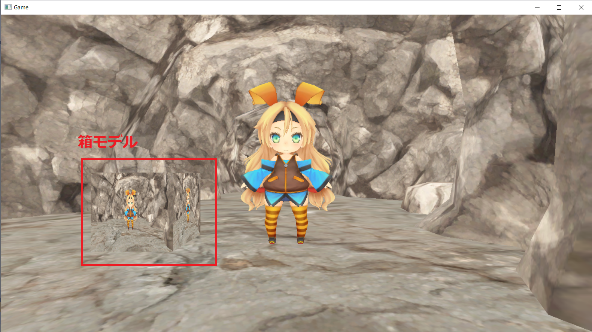

## はじめに
このチャプターでは、次のサンプルプログラムを利用します。ダウンロードをしてください。</br>
**[Sample_10_01.zip](https://drive.google.com/file/d/1BM07HjZFiD79DqT2xgth7-Z16Sheacqb/view?usp=sharing)**</br>

---
# Chapter 10 ポストエフェクト
最近の3Dゲームではカメラのピンボケ現象をシミュレーションする被写界深度や、光が溢れ出るブルームといわれる現象を疑似的に再現しています。</br>
**図10.1**</br>
</img></br>
これらはポストエフェクトと呼ばれる手法で実現されています。このチャプターでは、ポストエフェクトの基礎となるオフスクリーンレンダリングについ見ていった後で、モノクロ化、ブルーム、被写界深度、トーンマップ、Screen Space Reflectionといったいくつかのポストエフェクトを勉強していきます。

## 10.1 オフスクリーンレンダリング
オフスクリーンレンダリングとは画面に表示されないレンダリングのことです。これまで皆さんが行ってきたレンダリングは、画面に絵が出ていたのでオンスクリーンレンダリングです。一方オフスクリーンレンダリングは画面に表示されないレンダリングです。なぜそんなことをするの？と不思議な気持ちになってしまうかもしれませんが、ポストエフェクトを行うためにはオフスクリーンレンダリングを行う必要があります。では、多様なポストエフェクトのアルゴリズムを勉強する前に、ポストエフェクトの基礎となるオフスクリーンレンダリングについて見ていきましょう。

### 10.1.1 レンダリングターゲット
レンダリングターゲットというのは３Ｄモデルの描画先のことです。レンダリングターゲットは次の二つのテクスチャを指します。

1. カラーバッファ ： ピクセルシェーダーから出力されたカラーの書き込み先。
2. デプスステンシルバッファ : カラーバッファに書き込んだピクセルの深度値の書き込み先。

カラーバッファはピクセルシェーダーから出力されたピクセルのカラーが描き込まれるテクスチャです。これまで画面に表示されていたのは、フレームバッファと呼ばれるカラーバッファです。画面に表示されるカラーバッファはフレームバッファという特別な名前で呼ばれますが、本質的にはレンダリングターゲットに関連付けられているカラーバッファと変わりはありません。デプスステンシルバッファはカラーバッファに描き込んだピクセルの深度値が描き込まれるテクスチャです。このテクスチャを利用して、ピクセルの前後関係のテストが行われています。DirectX12では必ず絵の描き込み先となるレンダリングターゲットを指定する必要があります。つまり、これまではフレームバッファをカラーバッファとするレンダリングターゲットに絵が描き込まれていたわけです。</br>
さて、ここでオフスクリーンレンダリングの話に戻します。オフスクリーンレンダリングとは、フレームバッファ以外のテクスチャに絵を描き込むことを指します。画面に表示されるのがフレームバッファであるため、フレームバッファ以外のテクスチャに描き込むのであれば、当然画面に絵は出ません。では、これが何の役に立つのか？画面に絵が出ないのであれば意味がないのではないか？そう思われると思います。実はレンダリングターゲットのカラーバッファに書き込まれた絵は、テクスチャとして利用することができます。カラーバッファはテクスチャなので当然です。つまり、オフスクリーンレンダリングした絵をテクスチャとして３Ｄモデルに張り付けたりすることができるわけです。この技術を使えば、分かりやすい例であれば、車のバックミラー、鏡、テレビ画面といった表現を行うことができます(図10.2)。</br>
**図10.2**</br>
</img></br>

### 10.1.2 【ハンズオン】オフスクリーンレンダリングした絵をテクスチャとして貼り付けてみよう
では、オフスクリーンレンダリングした絵をテクスチャとして貼り付けるプログラムを実装してみましょう。`Chapter_10_01/Chapter_10_01.sln`を立ち上げてください。

#### step-1 オフスクリーン描画用のレンダリングターゲットを作成。
では、最初はオフスクリーン描画用のレンダリングターゲットを作成するコードを追加します。本書のMiniEngineにはレンダリングターゲットを扱うためのRenderTargetクラスが用意されています。今回はそれを利用します。レンダリングターゲットで必要なカラーバッファとデプスステンシルバッファはRenderTarget::Create()を利用することで作成することができます。この関数の引数に渡すパラメータはテクスチャの幅、高さ、フォーマットなど、テクスチャを作成するために必要な情報になります。main.cppの21行目にリスト10.1のプログラムを入力してください。</br>

[リスト10.1 main.cpp]
```cpp
//step-1 オフスクリーン描画用のレンダリングターゲットを作成。
//RenderTargetクラスのオブジェクトを定義。
RenderTarget offscreenRenderTarget;
//RenderTarget::Create()を利用して、レンダリングターゲットを作成する。
offscreenRenderTarget.Create(
	1280,						//テクスチャの幅。
	720,						//テクスチャの高さ。
	1,							//Mipmapレベル。
	1,							//テクスチャ配列のサイズ。
	DXGI_FORMAT_R8G8B8A8_UNORM, //カラーバッファのフォーマット。
	DXGI_FORMAT_D32_FLOAT		//デプスステンシルバッファのフォーマット。
);
```

#### step-2 各種3Dモデルを初期化する。
続いて、各種3Dモデルの絵を描画できるように、初期化するプログラムを実装します。リスト10.2のプログラムを入力してください。</br>

[リスト10.2 main.cpp]
```cpp
//step-2 各種モデルを初期化する。
//箱モデルを初期化する。
ModelInitData boxModelInitData;
boxModelInitData.m_tkmFilePath = "Assets/modelData/box.tkm";
boxModelInitData.m_fxFilePath = "Assets/shader/sample3D.fx";
Model boxModel;
boxModel.Init(boxModelInitData);
boxModel.UpdateWorldMatrix({ 100.0f, 0.0f, 0.0f }, g_quatIdentity, g_vec3One);

//背景モデルを初期化。
ModelInitData bgModelInitData;
bgModelInitData.m_tkmFilePath = "Assets/modelData/bg/bg.tkm";
bgModelInitData.m_fxFilePath = "Assets/shader/sample3D.fx";

//背景モデルを初期化。
Model bgModel;
bgModel.Init(bgModelInitData);

//プレイヤーモデルを初期化。
ModelInitData plModelInitData;
plModelInitData.m_tkmFilePath = "Assets/modelData/unityChan.tkm";
plModelInitData.m_fxFilePath = "Assets/shader/sample3D.fx";
Model plModel;
plModel.Init(plModelInitData);
```

#### step-3 箱モデルに貼り付けるテクスチャを変更する。
今回の実装では、箱モデルにオフスクリーンレンダリングしたテクスチャを貼り付けます。ですので、箱モデルのテクスチャを変更するコードを追加しましょう。リスト10.3のプログラムを入力して下さい。</br>
[リスト10.3 main.cpp]
```cpp
//step-3 箱モデルに貼り付けるテクスチャを変更する。
//箱モデルのテクスチャをオフスクリーンレンダリングされるテクスチャに切り替える。
boxModel.ChangeAlbedoMap(
	"", 
	offscreenRenderTarget.GetRenderTargetTexture()
);
```

#### step-4 レンダリングターゲットをoffscreenRenderTargetに変更する。
では、いよいよオフスクリーンレンダリングを行うコードを追加していきます。まずは描画先の切り替えのコードです。リスト10.4のプログラムを入力してください。</br>
[リスト10.4 main.cpp]
```cpp
//step-4 レンダリングターゲットをoffscreenRenderTargetに変更する。
RenderTarget* rtArray[] = { &offscreenRenderTarget };
//レンダリングターゲットとして利用できるまで待つ。
renderContext.WaitUntilToPossibleSetRenderTargets(1, rtArray);
//レンダリングターゲットを設定。
renderContext.SetRenderTargets(1, rtArray);
//レンダリングターゲットをクリア。
renderContext.ClearRenderTargetViews(1, rtArray);
```
では、このプログラムを解説していきます。DirectX12では、レンダリングターゲットを設定する前に、レンダリングターゲットとして利用できる状態になるまで待つ必要があります。これは、GPUがシェーダーリソースのテクスチャとして利用している間はレンダリングターゲットとして利用できないからです。本書では、この処理を薄くラップしているRenderTarget::WaitUntilToPossibleSetRenderTargets()を利用しています。この処理が抜けていると、VisualStudioの出力ウィンドウに、図10.3のようなエラーメッセージが表示されます。</br>
**図10.3**</br>
</img></br>
続いて、RenderContext::SetRenderTargets()を利用して、レンダリングターゲットを設定しています。第一引数はレンダリングターゲットの数です。実はレンダリングターゲットというのは、同時に複数枚設定することが可能です。今回は１枚だけなので、１を指定しています。最後はRenderTarget::ClearRenderTargetViews()を利用して、レンダリングターゲットのクリアを行っています。これは、絵を描くためのキャンパスを綺麗にしているようなイメージです。以前描いた絵を消す感じです。この関数の第一引数もレンダリングターゲットの数です。今回は１を指定しています。

#### step-5 offscreenRenderTargetに背景、プレイヤーを描画する。
レンダリングターゲットを変更することができたら、そのレンダリングターゲットに対し3Dモデルを描画しましょう。この処理は普通のモデル描画と全く同じになります。リスト10.5のプログラムを入力してください。</br>
[リスト10.5 main.cpp]
```cpp
//step-5 offscreenRenderTargetに背景、プレイヤーを描画する。
//背景モデルをドロー。		
bgModel.Draw(renderContext);
//プレイヤーをドロー。
plModel.Draw(renderContext);
//レンダリングターゲットへの書き込み終了待ち。
renderContext.WaitUntilFinishDrawingToRenderTargets(1, rtArray);
```
この描画処理では画面になにも表示されないことに注意してください。この描画はオフスクリーン(画面に表示されないテクスチャ)に描画しています。

#### step-6 画面に表示されるレンダリングターゲットに戻す。
オフスクリーンレンダリングが終わったら、次は画面に表示されるレンダリングターゲットに戻すプログラムを実装します。リスト10.6のプログラムを入力してください。</br>
[リスト10.6 main.cpp]
```cpp
//step-6 画面に表示されるレンダリングターゲットに戻す。
renderContext.SetRenderTarget(
	g_graphicsEngine->GetCurrentFrameBuffuerRTV(),
	g_graphicsEngine->GetCurrentFrameBuffuerDSV()
);
```
#### step-7 画面に表示されるレンダリングターゲットに各種モデルを描画する。
では、いよいよ最後です。画面に表示されるレンダリングターゲットに対して、各種モデルを描画します。リスト10.7のプログラムを入力してください。</br>
[リスト10.7 main.cpp]
```cpp
//step-7 画面に表示されるレンダリングターゲットに各種モデルを描画する。
//背景モデルをドロー。		
bgModel.Draw(renderContext);
//プレイヤーをドロー。
plModel.Draw(renderContext);
//箱を描画。
boxModel.Draw(renderContext);
```
入力出来たら実行してください。うまく実装出来ていると図10.4のようなプログラムが実行できます。箱モデルにオフスクリーンレンダリングされた絵がテクスチャとして貼り付けられています。</br>
**図10.4**</br>
</img></br>

## 評価テスト
次の評価テストを行いなさい。</br>
[評価テストへジャンプ](https://docs.google.com/forms/d/e/1FAIpQLSd7Kgz57s0XU_UfRtVHfIVuc1uiG7vkV3-s8NEE2y7anhmLRg/viewform?usp=sf_link)
