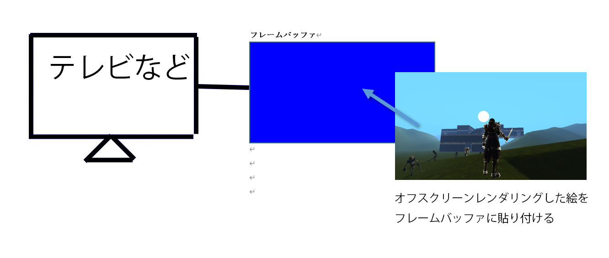

## はじめに
このチャプターでは、次のサンプルプログラムを利用します。ダウンロードをしてください。</br>
**[Sample_10_02.zip](https://drive.google.com/file/d/1Zg50WTczUXE8Ho6IWOVCWbj-UWg0PCpu/view?usp=sharing)**</br>

---
## 10.2 モノクロ化
前節でポストエフェクトの基礎となる、オフスクリーンレンダリングについて勉強しました。今節では、ポストエフェクトでオフスクリーンレンダリングをどのように利用するのか？という点を見てから、簡単なポストエフェクトのモノクロ化を実装していきます。
### 10.2.1 ポストエフェクトの流れ
 ポストエフェクトとはレンダリングした絵に対して、レタッチを行ってエフェクトを追加していく処理のことを言います。レンダリングを完了した後で、遅れて(ポスト)エフェクトを追加するのでポストエフェクトと呼ばれます。図10.5にポストエフェクトの流れを記載します。</br>
 **図10.5**
 </img></br>
一度レンダリングした絵に対してエフェクトをかけるには、レンダリングした絵をテクスチャ化する必要があります。描画した絵をテクスチャとして利用する方法は、前節のオフスクリーンレンダリングを使えば実現できます。つまり、今までキャラクターや背景などの画面に表示されるプリミティブは、画面に関連づいているカラーバッファ(フレームバッファ)にレンダリングしてきましたが、ポストエフェクトを行うためには、直接フレームバッファにレンダリングをせずにオフスクリーンに対してレンダリングを行うのです。

### 10.2.2 オフスクリーンレンダリングした絵をフレームバッファに張り付ける
ポストエフェクトを行うためには、まずキャラクターや背景などをオフスクリーンに対してレンダリングを行う必要があると説明しました。しかし当然ですが実際に画面に表示されるのはフレームバッファです。なので、このままでは画面に何も表示されません。そのため、オフスクリーンにレンダリングした絵をフレームバッファに張り付ける必要があります。フレームバッファに張り付けるには大きな四角形の板ポリにオフスクリーンレンダリングした絵をテクスチャとして張り付けてレンダリングを行えばよいのです。つまりスプライトを全画面描画したらいいのです(図10.6)。
 **図10.6**
 </img></br>
そして、この全画面描画の時にピクセルシェーダーでピクセルカラーを加工していくのがポストエフェクトです。

### 10.2.3【ハンズオン】画面をモノクロにするポストエフェクトを実装する。
では、画面を白黒にするポストエフェクトを実装してみましょう。Sample_10_02/Sample_10_02.slnを開いてください。

#### step-1 オフスクリーン描画用のレンダリングターゲットを作成。
まずは、オフスクリーンレンダリングするためのレンダリングターゲットを作成しましょう。このレンダリングターゲットの幅と高さはフレームバッファと同じになるようにしてください。main.cppの21行目にリスト10.8のプログラムを入力してください。</br>
[リスト10.8 main.cpp]
```cpp
//step-1 オフスクリーン描画用のレンダリングターゲットを作成。
//RenderTargetクラスのオブジェクトを定義。
RenderTarget offscreenRenderTarget;
//RenderTarget::Create()を利用して、レンダリングターゲットを作成する。
offscreenRenderTarget.Create(
	1280,												//テクスチャの幅。
	720,												//テクスチャの高さ。
	1,													//Mipmapレベル。
	1,													//テクスチャ配列のサイズ。
	DXGI_FORMAT_R8G8B8A8_UNORM,   //カラーバッファのフォーマット。
	DXGI_FORMAT_D32_FLOAT				//デプスステンシルバッファのフォーマット。
);
```
#### step-2 ポストエフェクト実行用のスプライトを初期化する。
続いて、ポストエフェクト実行用のスプライトを初期化します。main.cppにリスト10.9のプログラムを入力してください。このスプライトの描画で使用するテクスチャに、先ほど作成したレンダリングターゲットのカラーテクスチャを指定している箇所に注目して下さい。また、スプライトを描画するときに使用するシェーダーもポストエフェクト用のシェーダーを指定している箇所も注目してください。</br>
[リスト10.9 main.cpp]
```cpp
//step-2 ポストエフェクト実行用のスプライトを初期化する。
//スプライトの初期化オブジェクトを作成する。
SpriteInitData spriteInitData;
//【重要！！！】テクスチャはオフスクリーンレンダリングされた絵。
spriteInitData.m_textures[0] = &offscreenRenderTarget.GetRenderTargetTexture();
//【重要！！！】全画面描画なのでスプライトのサイズはフレームバッファと同じにする。
spriteInitData.m_width = 1280;
spriteInitData.m_height = 720;
//【重要！！！】モノクロ用のシェーダーを指定する。
spriteInitData.m_fxFilePath = "Assets/shader/samplePostEffect.fx";
//初期化オブジェクトを使って、スプライトを初期化する。
Sprite monochromeSprite;
monochromeSprite.Init(spriteInitData);
```
#### step-3 レンダリングターゲットをoffscreenRenderTargetに変更する。
続いて、レンダリングターゲットの切り替えです。リスト10.10のプログラムを入力してください。</br>
[リスト10.10 main.cpp]
```cpp
//step-3 レンダリングターゲットをoffscreenRenderTargetに変更する。
RenderTarget* rtArray[] = { &offscreenRenderTarget };
//レンダリングターゲットとして利用できるまで待つ。
renderContext.WaitUntilToPossibleSetRenderTargets(1, rtArray);
//レンダリングターゲットを設定。
renderContext.SetRenderTargets(1, rtArray);
//レンダリングターゲットをクリア。
renderContext.ClearRenderTargetViews(1, rtArray);
```

#### step-4 offscreenRenderTargetに各種モデルを描画する。
レンダリングターゲットの切り替えができたら、各種3Dモデルを描画します。リスト10.11のプログラムを入力してください。この描画処理はオフスクリーンに対して行われるので、このプログラムを入力しても、まだ画面には絵が出ないので注意してください。
[リスト10.11 main.cpp]
```cpp
//step-4 offscreenRenderTargetに各種モデルを描画する。
//背景モデルをドロー。		
bgModel.Draw(renderContext);
//プレイヤーをドロー。
plModel.Draw(renderContext);
//レンダリングターゲットへの書き込み終了待ち。
renderContext.WaitUntilFinishDrawingToRenderTargets(1, rtArray);
```

#### step-5 画面に表示されるレンダリングターゲットに戻す。
オフスクリーンへのレンダリングが完了したので、いよいよポストエフェクトの実行です。まずは画面に表示されるレンダリングターゲットに戻します。リスト10.12のプログラムを入力してください。</br>

[リスト10.12 main.cpp]
```cpp
//step-5 画面に表示されるレンダリングターゲットに戻す。
renderContext.SetRenderTarget(
	g_graphicsEngine->GetCurrentFrameBuffuerRTV(),
	g_graphicsEngine->GetCurrentFrameBuffuerDSV()
);
```
#### step-6 画面に表示されるレンダリングターゲットにフルスクリーン表示のスプライトを描画する。
step-6でcpp側のプログラムは最後です。レンダリングターゲットを切り替えることができたら、画面全体に２Ｄを描画します。リスト10.13を入力して下さい。</br>
[リスト10.13 main.cpp]
```cpp
//step-6 画面に表示されるレンダリングターゲットにフルスクリーン表示のスプライトを描画する。
monochromeSprite.Draw(renderContext);
```
#### step-7 ピクセルカラーをモノクロ化する。
続いて、シェーダー側です。`Assets/shader/samplePostEffect.fx`を開いてください。画像をモノクロ化するには、出力するカラーのRBGの値を全て同じにすることで行うことができます。リスト10.14のコードはテクスチャカラーの明るさを求めて、その明るさを出力するカラーのRGBに設定しています。では、samplePostEffect.fxの28行目にリスト10.14のプログラムを入力して下さい。入力出来たら実行してください。うまく実装できていると図10.7のようなプログラムが実行できます。</br>
[リスト10.14 samplePostEffect.fx]
```cpp
//step-7 ピクセルカラーをモノクロ化する。
float Y  =  0.299f * color.r + 0.587f * color.b + 0.114f * color.b;
color.r = Y;
color.g = Y;
color.b = Y;
```
**図10.7**</br>
 </img></br>

## 評価テスト
次の評価テストを行いなさい。</br>
[評価テストへジャンプ](https://docs.google.com/forms/d/e/1FAIpQLSd_A485UOjjZWUPlu4ceq96ePxgTckohXeDk06OLDYsq2cyxQ/viewform?usp=sf_link)