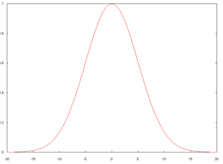
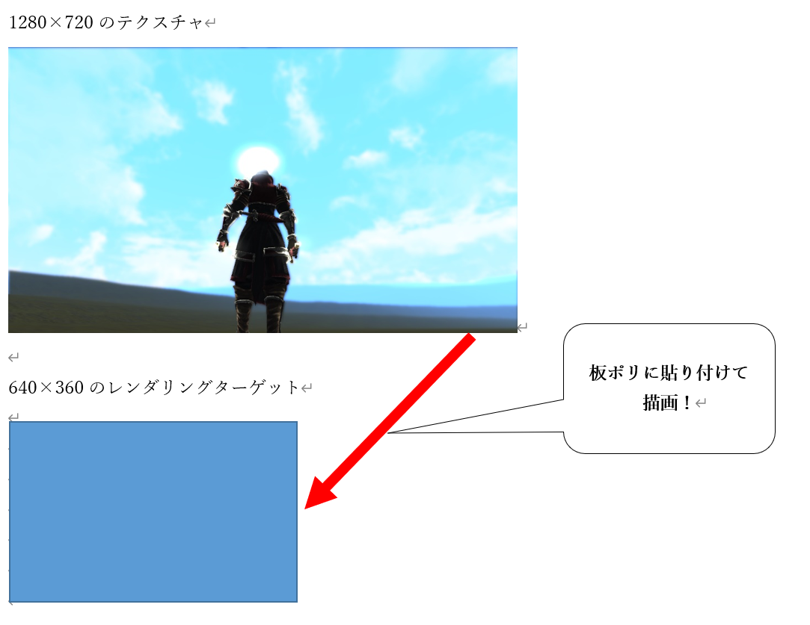
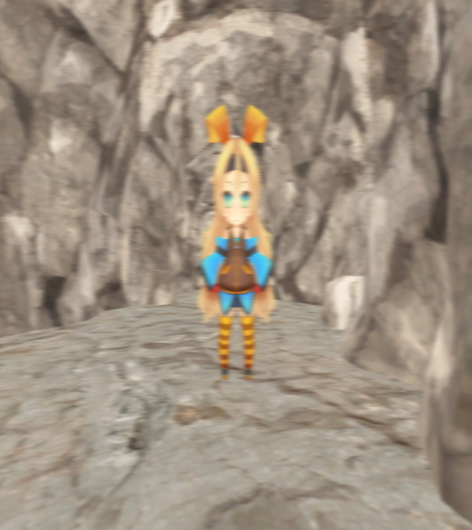

## はじめに
このチャプターでは、次のサンプルプログラムを利用します。ダウンロードをしてください。</br>
**[Sample_10_03.zip](https://drive.google.com/file/d/1sW7ntR9o5LJRDaJryNxSX4sESxYKFCQ7/view?usp=sharing)**</br>
**[Sample_10_04.zip](https://drive.google.com/file/d/18Lqg76eVYgktApQfeLvN0hM39vvuYH7Q/view?usp=sharing)**</br>

---
## 10.3 ブラー
このチャプターでは画像をぼかす、ブラーについて見ていきましょう。ブラーは、ブルーム、SSR、被写界深度など、様々なポストエフェクトで利用される画像加工処理です。
### 10.3.1 【ハンズオン】平均ブラーを実装する
では、最もシンプルな平均ブラーの処理を実装していきましょう。平均ブラーはピクセルシェーダーで複数のテクセルをサンプリングして、平均を取ることでぼかしていきます。今回のブラーの処理は、オフスクリーンレンダリングされたゲームシーンの絵をフレームバッファに貼り付ける処理のピクセルシェーダーでぼかしを入れていきます。ですので、C++側の処理の流れは10.3節のモノクロ化と全く同じです。
#### step-1 基準テクセル＋近傍8テクセルの平均を計算する。
では、Sample_10_03/Sample_10_03.slnを立ち上げてください。C++側の処理はモノクロ化と全く同じなので、今回はシェーダー側だけの実装です。`Assets/shader/samplePostEffect.fx`を開いてリスト10.15のプログラムを入力してください。</br>
[リスト10.15 samplePostEffect.fx]
```cpp
//step-1 基準テクセル＋近傍8テクセルの平均を計算する。

//1.5テクセル分ずらすためのUV値を求める。
float offsetU = 1.5f / 1280.0f;
float offsetV = 1.5f / 720.0f;

//基準テクセルから右のテクセルのカラーをサンプリングする。
color += sceneTexture.Sample(Sampler, In.uv + float2( offsetU, 0.0f));
//基準テクセルから左のテクセルのカラーをサンプリングする。
color += sceneTexture.Sample(Sampler, In.uv + float2( -offsetU, 0.0f));
//基準テクセルから下のテクセルのカラーをサンプリングする。
color += sceneTexture.Sample(Sampler, In.uv + float2( 0.0f, offsetV));
//基準テクセルから上のテクセルのカラーをサンプリングする。
color += sceneTexture.Sample(Sampler, In.uv + float2( 0.0f, -offsetV));
//基準テクセルから右下のテクセルのカラーをサンプリングする。
color += sceneTexture.Sample(Sampler, In.uv + float2( offsetU, offsetV));
//基準テクセルから右上のテクセルのカラーをサンプリングする。
color += sceneTexture.Sample(Sampler, In.uv + float2( offsetU, -offsetV));
//基準テクセルから左下のテクセルのカラーをサンプリングする。
color += sceneTexture.Sample(Sampler, In.uv + float2( -offsetU, offsetV));
//基準テクセルから左上のテクセルのカラーをサンプリングする。
color += sceneTexture.Sample(Sampler, In.uv + float2( -offsetU, -offsetV));

//基準テクセルと近傍８テクセルの平均なので9で除算する。
color /= 9.0f;
```
このプログラムでは基準テクセルとその周囲8テクセルをサンプリングして、その平均を計算しています。入力できたら実行してみてください。図10.8のようにシーンがボケて表示されていれば、実装出来ています。</br>
**図10.8**</br>
</img></br>

### 10.3.2 ガウシアンブラー
平均化ブラーでは広い範囲の綺麗なブラーを出すのが困難です。そこでブルームエフェクトのブラー処理では、比較的高速で綺麗なブラーをかけることができるガウシアンブラーが使われることが多いです。ガウシアンブラーも複数のテクセルをサンプリングしてぼかしていくことに変わりがないのですが、平均ブラーと異なり、各テクセルに重み(影響度)が付与されます。例えばテクセル0は0.7の重み、テクセル1は0.2の重み、テクセル2は0.1の重みでブレンディングするといった具合です。この場合は、最終的なカラーは次の計算で決定されます。</br>

**最終カラー = テクセル0×0.7 + テクセル1×0.2 + テクセル2×0.1**</br>

では、この重みはどのように決めるのか？ガウシアンブラーでは、この重みの計算に、ガウス関数を使用します。ガウス関数を利用するためガウシアンブラーと呼ばれます。ガウス関数は次のような式になっています。</br>

**F(x) = exp⁡(-x^2/(2σ^2 ))**</br>

この関数のxが基準テクセルからの距離です。このxの値に応じて重みを計算してくれます。σは分散具合を決定する定数です。σを大きくすると強くブラーするようになります。本書で勉強する範囲では、この式の意味は分からなくても大丈夫です。ガウス関数とは、基準テクセルからの距離ｘに応じて、いい感じに重みを計算してくれる関数くらいの認識で構いません。図10.8は基準テクセルからの距離(横軸)に応じて重み(縦軸)がどのように変化していくかを表しているグラフです。距離が離れていくほど重みが小さくなっていることが分かると思います。

**図10.9**</br>
</img></br>

#### 10.3.2.1 横ブラと縦ブラー
ガウシアンフィルターでは横方向のブラーと縦方向のブラーを２パスに分けて行います。次のコードはガウス関数で計算した重みテーブルを使って、横の解像度1280の画像に対して、横ブラーをかけているピクセルシェーダーの疑似コードです。
```cpp
float4 PSXBlur( PS_BlurInput In ) : SV_Target0
	float4 Color;
	//基準テクセルから右に3テクセル、重み付きでサンプリング。
	Color  = weight[0] * originalTexture.Sample( 
		Sampler, 
		//右に1テクセルずらしたUVを計算する
		In.uv + float2( 1.0f / 1280.0f, 0.0f) 
	);
	Color += weight[1] * originalTexture.Sample( 
		Sampler, 
		//右に2テクセルずらしたUVを計算する
		In.uv + float2( 2.0f / 1280.0f, 0.0f) 
	);
	Color += weight[2] * originalTexture.Sample( 
		Sampler, 
		//右に3テクセルずらしたUVを計算する
		In.uv + float2( 3.0f / 1280.0f, 0.0f) 
	);

	//基準テクセルに左に3テクセル、重み付きでサンプリング。
	Color += weight[0] * originalTexture.Sample( 
		Sampler, 
		//左に1テクセルずらしたUVを計算する
		In.uv + float2( -1.0f / 1280.0f, 0.0f) 
	);
	Color += weight[1] * originalTexture.Sample( 
		Sampler, 
		//左に2テクセルずらしたUVを計算する
		In.uv + float2( -2.0f / 1280.0f, 0.0f) 
	);
	Color += weight[2] * originalTexture.Sample( 
		Sampler, 
		//左に3テクセルずらしたUVを計算する
		In.uv + float2( -3.0f / 1280.0f, 0.0f) 
	);
	return Color;
}
```
weightにガウス関数で計算された重みが記憶されています。次のコードは縦の解像度720の画像に対して、縦ブラーをかけているピクセルシェーダーの疑似コードです。
```cpp
float4 PSXBlur( PS_BlurInput In ) : SV_Target0
	float4 Color;
	//基準テクセルから下に3テクセル、重み付きでサンプリング。
	Color  = weight[0] * originalTexture.Sample( 
		Sampler, 
		//下に1テクセルずらしたUVを計算する
		In.uv + float2( 0.0f, 1.0f / 720.0f ) 
	);
	Color += weight[1] * originalTexture.Sample( 
		Sampler, 
		//下に2テクセルずらしたUVを計算する
		In.uv + float2( 0.0f, 2.0f / 720.0f ) 
	);
	Color += weight[2] * originalTexture.Sample( 
		Sampler, 
		//下に3テクセルずらしたUVを計算する
		In.uv + float2( 0.0f, 3.0f / 720.0f )  
	);

	//基準テクセルに上に3テクセル、重み付きでサンプリング。
	Color += weight[0] * originalTexture.Sample( 
		Sampler, 
		//上に1テクセルずらしたUVを計算する
		In.uv + float2( 0.0f, -1.0f / 720.0f ) 
	);
	Color += weight[1] * originalTexture.Sample( 
		Sampler, 
		//上に2テクセルずらしたUVを計算する
		In.uv + float2( 0.0f, -2.0f / 720.0f ) 
	);
	Color += weight[2] * originalTexture.Sample( 
		Sampler, 
		//上に3テクセルずらしたUVを計算する
		In.uv + float2( 0.0f, -3.0f / 720.0f ) 
	);
	return Color;
}
```
横ブラーも縦ブラーも処理はほとんど同じです。違いがあるのはUVをずらす方向のみです。

#### 10.3.2.2 ダウンサンプリング
このあと実装するガウシアンブラーのハンズオンでは、ダウンサンプリングというテクニックも使っています。ダウンサンプリングとは解像度の高いテクスチャを解像度の低いレンダリングターゲットに対して縮小してレンダリングすることを言います。例えば1280×720の解像度のテクスチャを640×360のレンダリングターゲットに対してレンダリングする場合などです(図10.10)。</br>
**図10.10**</br>
</img></br>
今回の実装では、ダウンサンプリングは横ブラーと縦ブラーをかけるときに行います。次のガウシアンブラーの処理の流れを見てみてください。

1. ブラーをかけたい絵をオフスクリーンレンダリング(解像度は1280×720)
2. 1で作成した絵をテクスチャ(解像度は1280×720)にして、横ブラー用のレンダリングターゲット(解像度は640×720)に描画。
3. 2で作成した絵をテクスチャ(解像度は640×720)にして、縦ブラー用のレンダリングターゲット(解像度は640×360)に描画。

2と3の描画の時に、横ブラーと縦ブラーのピクセルシェーダーを実行することになるのですが、この時のテクスチャの解像度とレンダリングターゲットの解像度を比べてみてください。横ブラー用のレンダリングターゲットは、テクスチャの解像度に対して、横幅が半分に、縦ブラー用のレンダリングターゲットは、テクスチャの解像度に対して、縦幅が半分になっています。つまりダウンサンプリングを行っています。では、なぜダウンサンプリングを行っているのでしょうか。実は、ダウンサンプリングには次の二つの効果があります。

1. バイリニアフィルタを設定することによって、さらに強力にぼかすことができる。
2. レンダリングターゲットの解像度が下がるため、処理が高速になる。

図10.10の画像の例のように縦横1/2のレンダリングターゲットに描画すると、画素の総数がちょうど1/4になります(1280×720=921600、640×360 = 230400)。つまり640×360のレンダリングターゲットの1ピクセルは、元テクスチャの4テクセルに相当することになります。しかし当然1ピクセルに表現できる画素は1画素です。そのため何もしなければ、3テクセル分の画素は失われることになってしまいます。しかし、この時にバイリニアフィルタを使用すると1ピクセルの画素は、４テクセルの平均のカラーにすることができます。これにより、ガウスフィルタだけではなくバイリニアフィルタをかけることもでき、さらに強力に画像をぼかすことができます。もう一点は処理速度です。ピクセルシェーダーのプログラムはレンダリングターゲットのピクセルの数分だけ実行されます。つまり、1280×720なら921600回実行されます。しかし、解像度を下げて640×360にすると230400回に削減することができ、ピクセルシェーダーの実行回数を1/4にすることができ、処理速度を向上させることができます。では、最後に縦横ブラーをかけていく様子を画像で確認してみましょう。図10.11を見てみてください。</br>
**図10.11**</br>
</img></br>

### 10.3.3 【ハンズオン】ガウシアンブラーを実装する
では、ガウシアンブラーを実装していきましょう。`Sample_10_04/Sample_10_04.sln`を立ち上げてください。

#### step-1 ゲームシーンを描画するレンダリングターゲットを作成。
まずはゲームのシーンを描画するレンダリングターゲットを作成しましょう。また、これ以降のチャプターでは、ゲームのシーンを描画するレンダリングターゲットをメインレンダリングターゲットと呼称します。では、main.cppの45行目にリスト10.16のプログラムを入力してください。</br>
[リスト10.16 main.cpp]
```cpp
//step-1 ゲームシーンを描画するレンダリングターゲットを作成。
RenderTarget mainRenderTarget;
mainRenderTarget.Create(
	1280,
	720,
	1,
	1,
	DXGI_FORMAT_R8G8B8A8_UNORM,
	DXGI_FORMAT_D32_FLOAT
);
```

#### step-2 ガウスブラー用の重みテーブルを計算する
続いて、ガウス関数を利用して重みテーブルを計算します。今回は著者が作成した、CalcWeigthsTableFrmGaussian()を利用します。この関数は引数に重みの格納先となるテーブル、テーブルのサイズ、ボケ具合を受け取ります。この関数を呼び出すと、渡されたパラメータに応じて適切な重みを計算してくれます。main.cppにリスト10.17のプログラムを入力してください。</br>

[リスト10.17 main.cpp]
```cpp
//step-2 ガウスブラー用の重みテーブルを計算する
const int NUM_WEIGHTS = 8;
//テーブルのサイズは８。
float weights[NUM_WEIGHTS];
//重みテーブルを計算する。
CalcWeightsTableFromGaussian(
	weights,		//重みの格納先
	NUM_WEIGHTS,	//重みテーブルのサイズ。
	8.0f			//ボケ具合。この数値が大きくなるとボケが強くなる。
);
```

#### step-3 横ブラー用のレンダリングターゲットを作成。
続いて、横ブラー用のレンダリングターゲットを作成します。このレンダリングターゲットに、メインレンダリングターゲットに描画されたゲームシーンの絵をテクスチャとしたスプライトを描画します。レンダリングターゲットの横幅の解像度がメインレンダリングターゲットの半分になっているため、ダウンサンプリングを行うことになります。これによりバイリニアフィルタによるぼかしと、処理負荷の軽減の効果が期待できます。リスト10.18のプログラムを入力してください。</br>
[リスト10.18 main.cpp]
```cpp
//step-3 横ブラー用のレンダリングターゲットを作成。
RenderTarget xBlurRenderTarget;
xBlurRenderTarget.Create(
	640,	//横幅の解像度をmainRenderTargetの幅の半分にする。
	720,	//高さはmainRenderTargetの高さと同じ。
	1,
	1,
	DXGI_FORMAT_R8G8B8A8_UNORM,
	DXGI_FORMAT_D32_FLOAT
);
```

#### step-4 横ブラー用のスプライトを初期化。
横ブラー用のレンダリングターゲットを作成することができたら、次は、そのレンダリングターゲットに絵を描くためのスプライトを初期化します。このスプライトに貼り付けるテクスチャはメインレンダリングターゲットのテクスチャです。また、このスプライトを描画するときのピクセルシェーダーで、ガウス関数で計算した重みテーブルを利用した、ガウシアンブラーを行うため、ユーザー拡張の定数バッファに重みテーブルを設定しています。リスト10.19のプログラムを入力してください。</br>
[リスト10.19 main.cpp]
```cpp
//step-4 横ブラー用のスプライトを初期化。
//初期化情報を設定する。
SpriteInitData xBlurSpriteInitData;
xBlurSpriteInitData.m_fxFilePath = "Assets/shader/samplePostEffect.fx";
xBlurSpriteInitData.m_vsEntryPointFunc = "VSXBlur";
xBlurSpriteInitData.m_psEntryPoinFunc = "PSBlur";

//スプライトの解像度はxBlurRenderTargetと同じ。
xBlurSpriteInitData.m_width = 640;
xBlurSpriteInitData.m_height = 720;
//【注目】テクスチャはmainRenderTargetのカラーバッファ。
xBlurSpriteInitData.m_textures[0] = &mainRenderTarget.GetRenderTargetTexture();

//【注目】ユーザー拡張の定数バッファに重みテーブルを設定する。
xBlurSpriteInitData.m_expandConstantBuffer = &weights;
xBlurSpriteInitData.m_expandConstantBufferSize = sizeof(weights);

//初期化情報をもとに横ブラー用のスプライトを初期化する。
Sprite xBlurSprite;
xBlurSprite.Init(xBlurSpriteInitData);
```

#### step-5 縦ブラー用のレンダリングターゲットを作成。
続いて、縦ブラー用のレンダリングターゲットを作成しています。縦ブラーは、横ブラーをかけたテクスチャに対して行います。レンダリングターゲットの幅と高さに注目してください。縦幅が横ブラーをかけたテクスチャの半分の大きさになっています。これもダウンサンプリングを行うためです。リスト10.20のプログラムを入力してください。</br>

[リスト10.20 main.cpp]
```cpp
//step-5 縦ブラー用のレンダリングターゲットを作成。
RenderTarget yBlurRenderTarget;
yBlurRenderTarget.Create(
	640,		//横幅の解像度はxBlurRenderTargetの幅と同じ。
	360,		//縦幅の解像度はxBlurRenderTargetの高さの半分。
	1,
	1,
	DXGI_FORMAT_R8G8B8A8_UNORM,
	DXGI_FORMAT_D32_FLOAT
);
```

#### step-6 縦ブラー用のスプライトを初期化。
縦ブラーのレンダリングターゲットを作成出来たら、横ブラーと同じように、縦ブラー用のスプライトを初期化しましょう。リスト10.21のプログラムを入力してください。</br>
[リスト10.21 main.cpp]
```cpp
//step-6 縦ブラー用のスプライトを初期化。
//初期化情報を設定する。
SpriteInitData yBlurSpriteInitData;
yBlurSpriteInitData.m_fxFilePath = "Assets/shader/samplePostEffect.fx";
yBlurSpriteInitData.m_vsEntryPointFunc = "VSYBlur";
yBlurSpriteInitData.m_psEntryPoinFunc = "PSBlur";
//スプライトの幅と高さはyBlurRenderTargetと同じ。
yBlurSpriteInitData.m_width = 640;
yBlurSpriteInitData.m_height = 360;
//テクスチャはxBlurRenderTargetのカラーバッファ
yBlurSpriteInitData.m_textures[0] = &xBlurRenderTarget.GetRenderTargetTexture();

//ユーザー拡張の定数バッファに重みテーブルを設定する。
yBlurSpriteInitData.m_expandConstantBuffer = &weights;
yBlurSpriteInitData.m_expandConstantBufferSize = sizeof(weights);

//初期化情報をもとに縦ブラー用のスプライトを初期化する。
Sprite yBlurSprite;
yBlurSprite.Init(yBlurSpriteInitData);
```

#### step-7 yBlurRenderTargetのテクスチャをフレームバッファに貼り付けるためのスプライトを初期化する。
初期化処理の最後に、縦横ブラーをかけた絵をフレームバッファに貼り付けるためのスプライトを初期化しましょう。このスプライトをフレームバッファに描画することで、ガウシアンブラーをかけたボケ画像が画面に表示されます。リスト10.22のプログラムを入力してください。</br>
[リスト10.22 main.cpp]
```cpp
//step-7 yBlurRenderTargetのテクスチャをフレームバッファに貼り付けるためのスプライトを初期化する。
//スプライトの初期化オブジェクトを作成する。
SpriteInitData spriteInitData;
//テクスチャはyBlurRenderTargetのカラーバッファ。
spriteInitData.m_textures[0] = &yBlurRenderTarget.GetRenderTargetTexture();
//レンダリング先がフレームバッファなので、解像度はフレームバッファと同じ。
spriteInitData.m_width = 1280;
spriteInitData.m_height = 720;

//ボケ画像をそのまま貼り付けるだけなので、通常の2D描画のシェーダーを指定する。
spriteInitData.m_fxFilePath = "Assets/shader/sample2D.fx";
//初期化オブジェクトを使って、スプライトを初期化する。
Sprite copyToFrameBufferSprite;
copyToFrameBufferSprite.Init(spriteInitData);
```

#### step-8 レンダリングターゲットをmainRenderTargetに変更する。
step-8からはゲームループの処理です。まずはゲームシーンを描画するためにメインレンダリングターゲットを設定します。レンダリングターゲットを設定する前に、Wait命令を入れることを忘れないようにしてください。準備が整うのを待たずにレンダリングターゲットを設定することはできません。リスト10.23のプログラムを入力してください。</br>
[リスト10.23 main.cpp]
```cpp
//step-8 レンダリングターゲットをmainRenderTargetに変更する。
//レンダリングターゲットとして利用できるまで待つ。
renderContext.WaitUntilToPossibleSetRenderTarget(mainRenderTarget);
//レンダリングターゲットを設定。
renderContext.SetRenderTargetAndViewport(mainRenderTarget);
//レンダリングターゲットをクリア。
renderContext.ClearRenderTargetView(mainRenderTarget);
```
#### step-9 mainRenderTargetに各種モデルを描画する。
メインレンダリングターゲットの設定ができたら、各種３Ｄモデルを描画していきましょう。リスト10.24のプログラムを入力してください。このプログラムが実行されると図10.12のような絵がメインレンダリングターゲットに描画されます(注意：オフスクリーンなので画面には表示されません)。リスト10.24のプログラムを入力してください。</br>
[リスト10.24 main.cpp]
```cpp
//step-9 mainRenderTargetに各種モデルを描画する。
plModel.Draw(renderContext);
bgModel.Draw(renderContext);
//レンダリングターゲットへの書き込み終了待ち。
renderContext.WaitUntilFinishDrawingToRenderTarget(mainRenderTarget);
```
**図10.12**</br>
</img></br>

#### step-10 mainRenderTargetに描画された画像に横ブラーをかける。
続いて、横ブラーです。レンダリングターゲットをxBlurRenderTargetに変更して、xBlurSpriteを描画しています。このプログラムが実行されると図10.13のような横ブラーがかけられた画像が生成されます(注意：オフスクリーンなので画面には表示されません)。リスト10.25のプログラムを入力してください。</br>
[リスト10.25 main.cpp]
```cpp
//step-10 mainRenderTargetに描画された画像に横ブラーをかける。
//横ブラー用のレンダリングターゲットに変更。
//レンダリングターゲットとして利用できるまで待つ。
renderContext.WaitUntilToPossibleSetRenderTarget(xBlurRenderTarget);
//レンダリングターゲットを設定。
renderContext.SetRenderTargetAndViewport(xBlurRenderTarget);
//レンダリングターゲットをクリア。
renderContext.ClearRenderTargetView(xBlurRenderTarget);
//2Dを描画。
xBlurSprite.Draw(renderContext);
//レンダリングターゲットへの書き込み終了待ち。
renderContext.WaitUntilFinishDrawingToRenderTarget(xBlurRenderTarget);
```
**図10.13**</br>
</img></br>

#### step-11 縦ブラーも行う。
横ブラーが実装出来たら次は縦ブラーです。レンダリングターゲットをyBlurRenderTargetに変更して、yBlurSpriteを描画しています。このプログラムが実行されると、ガウシアンブラーが係った、図10.14のような画像が生成されます(注意：オフスクリーンなので画面には表示されません)。リスト10.26のプログラムを入力してください。</br>
[リスト10.26 main.cpp]
```cpp
//step-11 縦ブラーも行う。
//縦ブラー用のレンダリングターゲットに変更。
//レンダリングターゲットとして利用できるまで待つ。
renderContext.WaitUntilToPossibleSetRenderTarget(yBlurRenderTarget);
//レンダリングターゲットを設定。
renderContext.SetRenderTargetAndViewport(yBlurRenderTarget);
//レンダリングターゲットをクリア。
renderContext.ClearRenderTargetView(yBlurRenderTarget);
//2Dを描画。
yBlurSprite.Draw(renderContext);
//レンダリングターゲットへの書き込み終了待ち。
renderContext.WaitUntilFinishDrawingToRenderTarget(yBlurRenderTarget);
```
**図10.14**</br>
</img></br>

#### step-12 メインレンダリングターゲットの絵をフレームバッファにコピー
いよいよc++側は最後の実装です。step-11までのプログラムで、ガウシアンブラーがかかった画像が生成できました。最後に生成されたボケ画像を画面に表示するために、フレームバッファに貼り付けましょう。リスト10.27のプログラムを入力してください。</br>

[リスト10.27 main.cpp]
```cpp
//step-12 メインレンダリングターゲットの絵をフレームバッファにコピー
renderContext.SetRenderTarget(
	g_graphicsEngine->GetCurrentFrameBuffuerRTV(),
	g_graphicsEngine->GetCurrentFrameBuffuerDSV()
);
//ビューポートを指定する。
D3D12_VIEWPORT viewport;
viewport.TopLeftX = 0;
viewport.TopLeftY = 0;
viewport.Width = 1280;
viewport.Height = 720;
viewport.MinDepth = 0.0f;
viewport.MaxDepth = 1.0f;

renderContext.SetViewportAndScissor(viewport);
copyToFrameBufferSprite.Draw(renderContext);
```

#### step-13 横ブラー用の頂点シェーダーを実装。
続いてシェーダー側です。まずは横ブラー用の頂点シェーダーを実装します。横ブラーは基準テクセルから横方向(U方向)に向かってテクセルをサンプリングしていき、重み付き平均カラーを計算します。ですので、この頂点シェーダーでは基準テクセルから右に15テクセル、左に15テクセルずらしたUV座標を計算しています。samplePostEffect.fxの62行目にリスト10.28のプログラムを入力してください。</br>
[リスト10.28 samplePostEffect.fx]
```cpp
//step-13 横ブラー用の頂点シェーダーを実装。
PS_BlurInput Out;
//座標変換
Out.pos = mul(mvp, In.pos);

//テクスチャサイズを取得。
float2 texSize;
float level;
sceneTexture.GetDimensions(0, texSize.x, texSize.y, level);
//基準テクセルのUV座標を記録。
float2 tex = In.uv;

//基準テクセルからU座標を＋１テクセルずらすためのオフセットを計算する。
Out.tex0.xy = float2( 1.0f / texSize.x, 0.0f);
//基準テクセルからU座標を＋３テクセルずらすためのオフセットを計算する。
Out.tex1.xy = float2( 3.0f / texSize.x, 0.0f);
//基準テクセルからU座標を＋５テクセルずらすためのオフセットを計算する。
Out.tex2.xy = float2( 5.0f / texSize.x, 0.0f);
//基準テクセルからU座標を＋７テクセルずらすためのオフセットを計算する。
Out.tex3.xy = float2( 7.0f / texSize.x, 0.0f);
//基準テクセルからU座標を＋９テクセルずらすためのオフセットを計算する。
Out.tex4.xy = float2( 9.0f / texSize.x, 0.0f);
//基準テクセルからU座標を＋１１テクセルずらすためのオフセットを計算する。
Out.tex5.xy = float2( 11.0f / texSize.x, 0.0f);
//基準テクセルからU座標を＋１３テクセルずらすためのオフセットを計算する。
Out.tex6.xy = float2( 13.0f / texSize.x, 0.0f);
//基準テクセルからU座標を＋１５テクセルずらすためのオフセットを計算する。
Out.tex7.xy = float2( 15.0f / texSize.x, 0.0f);

//オフセットに-1をかけてマイナス方向のオフセットも計算する。
Out.tex0.zw = Out.tex0.xy * -1.0f;
Out.tex1.zw = Out.tex1.xy * -1.0f;
Out.tex2.zw = Out.tex2.xy * -1.0f;
Out.tex3.zw = Out.tex3.xy * -1.0f;
Out.tex4.zw = Out.tex4.xy * -1.0f;
Out.tex5.zw = Out.tex5.xy * -1.0f;
Out.tex6.zw = Out.tex6.xy * -1.0f;
Out.tex7.zw = Out.tex7.xy * -1.0f;

//オフセットに基準テクセルのUV座標を足し算して、
//実際にサンプリングするUV座標に変換する。
Out.tex0 += float4( tex, tex);
Out.tex1 += float4( tex, tex);
Out.tex2 += float4( tex, tex);
Out.tex3 += float4( tex, tex);
Out.tex4 += float4( tex, tex);
Out.tex5 += float4( tex, tex);
Out.tex6 += float4( tex, tex);
Out.tex7 += float4( tex, tex);

return Out;
```

#### step-14 縦ブラー用の頂点シェーダーを実装。
続いて縦ブラー用の頂点シェーダーの実装です。実装はほとんど横ブラーと同じです。違いは、基準テクセルからのオフセットの計算です。横ブラーはU方向にずらしていましたが、縦ブラーではV方向にずらしていっています。リスト10.29のプログラムを入力してください。</br>
[リスト10.29 sampleostEffect.fx]
```cpp
//step-14 縦ブラー用の頂点シェーダーを実装。
PS_BlurInput Out;
//座標変換。
Out.pos = mul(mvp, In.pos);

//テクスチャサイズを取得。
float2 texSize;
float level;
sceneTexture.GetDimensions( 0, texSize.x, texSize.y, level );

//基準テクセルのUV座標を記録。
float2 tex = In.uv;

//基準テクセルからV座標を＋１テクセルずらすためのオフセットを計算する。
Out.tex0.xy = float2(0.0f, 1.0f / texSize.y);
//基準テクセルからV座標を＋３テクセルずらすためのオフセットを計算する。
Out.tex1.xy = float2(0.0f, 3.0f / texSize.y);
//基準テクセルからV座標を＋５テクセルずらすためのオフセットを計算する。
Out.tex2.xy = float2(0.0f, 5.0f / texSize.y);
//基準テクセルからV座標を＋７テクセルずらすためのオフセットを計算する。
Out.tex3.xy = float2(0.0f, 7.0f / texSize.y);
//基準テクセルからV座標を＋９テクセルずらすためのオフセットを計算する。
Out.tex4.xy = float2(0.0f, 9.0f / texSize.y);
//基準テクセルからV座標を＋１１テクセルずらすためのオフセットを計算する。
Out.tex5.xy = float2(0.0f, 11.0f / texSize.y);
//基準テクセルからV座標を＋１３テクセルずらすためのオフセットを計算する。
Out.tex6.xy = float2(0.0f, 13.0f / texSize.y);
//基準テクセルからV座標を＋１５テクセルずらすためのオフセットを計算する。
Out.tex7.xy = float2(0.0f, 15.0f / texSize.y);

//オフセットに-1をかけてマイナス方向のオフセットも計算する。
Out.tex0.zw = Out.tex0.xy * -1.0f;
Out.tex1.zw = Out.tex1.xy * -1.0f;
Out.tex2.zw = Out.tex2.xy * -1.0f;
Out.tex3.zw = Out.tex3.xy * -1.0f;
Out.tex4.zw = Out.tex4.xy * -1.0f;
Out.tex5.zw = Out.tex5.xy * -1.0f;
Out.tex6.zw = Out.tex6.xy * -1.0f;
Out.tex7.zw = Out.tex7.xy * -1.0f;

//オフセットに基準テクセルのUV座標を足し算して、
//実際にサンプリングするUV座標に変換する。
Out.tex0 += float4( tex, tex);
Out.tex1 += float4( tex, tex);
Out.tex2 += float4( tex, tex);
Out.tex3 += float4( tex, tex);
Out.tex4 += float4( tex, tex);
Out.tex5 += float4( tex, tex);
Out.tex6 += float4( tex, tex);
Out.tex7 += float4( tex, tex);
return Out;
```

#### step-15 横、縦ブラー用のピクセルシェーダーを実装。
では、いよいよ最後です。最後は縦、横ブラーの両方で利用されるピクセルシェーダーの実装です。このピクセルシェーダーでは、頂点シェーダーで計算されたUV座標を使って、合計16テクセルの重み付き平均カラーを計算しています。weightにはガウス関数で計算された重みテーブルが設定されています。重みテーブルのサイズは8ですが、サンプリングしているテクセルの数は16です。これは基準テクセルから右に8テクセルの重みと、左に8テクセルの重みは同じになるためです。そのため、16テクセルのサンプリングであっても8つの重みで十分なのです。ではリスト10.30のプログラムを入力してください。入力出来たら実行してください。うまく実装できていると図10.14のボケ画像が画面に表示されます。</br>
[リスト10.30 sampleostEffect.fx]
```cpp
//step-15 X,Yブラー用のピクセルシェーダーを実装。
float4 Color;
//基準テクセルからプラス方向に8テクセル、重み付きでサンプリング。
Color  = weight[0].x * sceneTexture.Sample( Sampler, In.tex0.xy );
Color += weight[0].y * sceneTexture.Sample( Sampler, In.tex1.xy );
Color += weight[0].z * sceneTexture.Sample( Sampler, In.tex2.xy );
Color += weight[0].w * sceneTexture.Sample( Sampler, In.tex3.xy );
Color += weight[1].x * sceneTexture.Sample( Sampler, In.tex4.xy );
Color += weight[1].y * sceneTexture.Sample( Sampler, In.tex5.xy );
Color += weight[1].z * sceneTexture.Sample( Sampler, In.tex6.xy );
Color += weight[1].w * sceneTexture.Sample( Sampler, In.tex7.xy );

//基準テクセルにマイナス方向に8テクセル、重み付きでサンプリング。
Color += weight[0].x * sceneTexture.Sample(Sampler, In.tex0.zw);
Color += weight[0].y * sceneTexture.Sample(Sampler, In.tex1.zw);
Color += weight[0].z * sceneTexture.Sample(Sampler, In.tex2.zw);
Color += weight[0].w * sceneTexture.Sample(Sampler, In.tex3.zw);
Color += weight[1].x * sceneTexture.Sample(Sampler, In.tex4.zw);
Color += weight[1].y * sceneTexture.Sample(Sampler, In.tex5.zw);
Color += weight[1].z * sceneTexture.Sample(Sampler, In.tex6.zw);
Color += weight[1].w * sceneTexture.Sample(Sampler, In.tex7.zw);

return float4(Color.xyz, 1.0f);
```

## 評価テスト
次の評価テストを行いなさい。</br>
[評価テストへジャンプ](https://docs.google.com/forms/d/e/1FAIpQLSeC_8oooYelVRDjsoVfdJyj5OS2rjEnll2aFAmD8819Kr8whQ/viewform?usp=sf_link)