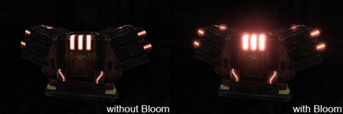
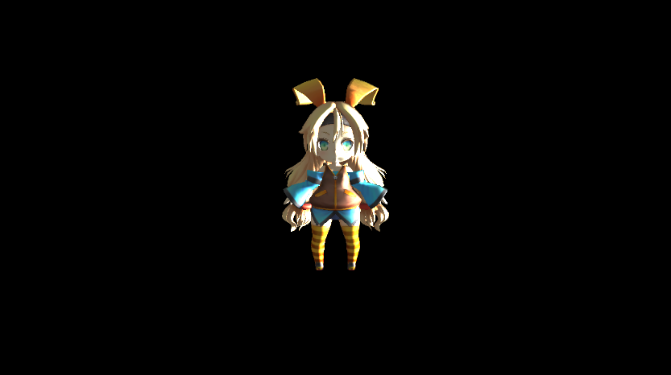
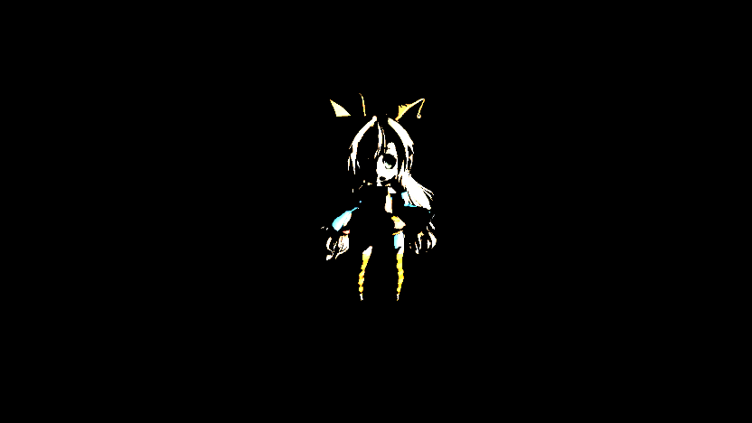
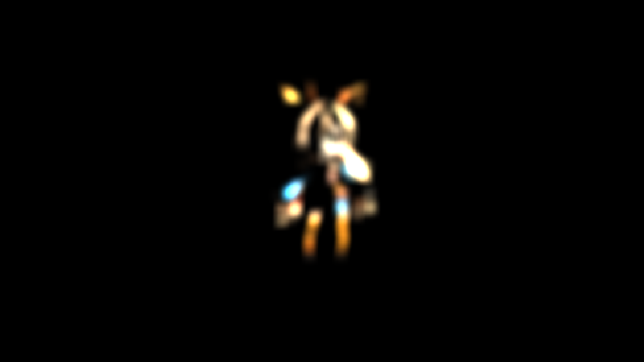
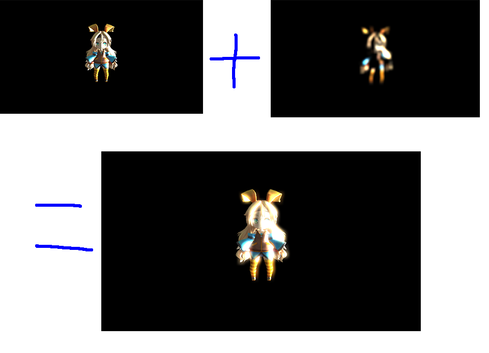

## はじめに
このチャプターでは、次のサンプルプログラムを利用します。ダウンロードをしてください。

**[Sample_10_05.zip](https://drive.google.com/file/d/1u4RK7OvhA4vUceV1aH2S8QNt5j6F6NqD/view?usp=sharing)**</br>

---

## 10.4 ブルーム
このチャプターでは光が溢れる現象のブルームについて見ていきましょう。
### 10.4.1 HDRレンダリング
オブジェクトに対して強い光が当たる、もしくはオブジェクト自身が強い光を放っている場合、その光は図10.15のように溢れ出して周囲に影響を与えます。</br>
**図10.15**</br>
</img></br>
このような現象がブルームと呼ばれます。では強い光とは一体どの程度のもののことをいうのでしょうか？私たちはここまでいくつかのライティングの計算を学んできました。ディフューズライト、スペキュラライト、アンビエントライトなど。これらのライトのカラーの値を大きくすることで、強い光を物体にあてることができます。これまでピクセルシェーダーで、ランバート拡散反射などを利用して、物体に光が入射した時の反射光の強さを求めてきました。しかし、どれだけ強い光を当てたとしても、レンダリングターゲットのカラーバッファに書き込まれるカラーの値の範囲は、0～255の256段階しかありませんでした。しかし現実世界での光の明るさの範囲は256段階程度ではありません。明るさはNitという単位で表すことができます。例えば室内の床の明るさは0.08Nit、廊下の壁の明るさは77Nit、蛍光灯の光は6,000Nit、コンクリートの照り返しは10,000Nit、直射日光を反射した車のボディの輝きは300,000Nitです。このように現実世界に存在する光の強さの幅は非常に大きいです。しかし、これまでのプログラムでは、どんなに強い光を当てても、カラーバッファに書き込むことができる光の強さの範囲は0～255までです。これでは表現できる光の強さの範囲が狭すぎるため、ブルームの表現を綺麗に行うことが困難です。そこで、このチャプター以降では、もっと広い光の範囲を扱うことができる、浮動小数点テクスチャをカラーバッファとして利用します。そして、このように、0～255段階という狭い範囲から抜け出して、広い範囲の光を扱うレンダリングのことをHDR( High Dynamic Range )レンダリングと呼びます。

#### 10.4.2.1 浮動小数点テクスチャ
今回実装するブルームでは、カラーバッファに32bitの浮動小数点テクスチャを利用します。これまでは8bit整数テクスチャを利用していました。テクスチャというのは、次のような配列です。
```cpp
struct Color{
	unsigned char r;
	unsigned char g;
	unsigned char b;
	unsigned char a;
};
//これは8ビットの整数テクスチャ。
Color texture[720][1280];
```
このテクスチャはr,g,b,aが8ビット符号なし整数型となっているため、0～255までの値しか扱えません。これが8bit整数テクスチャです。では、32bit浮動小数点テクスチャとはどのようなテクスチャなのでしょうか。次のプログラムを読んでください。</br>
```cpp
struct Color{
	float r;
	float g;
	float b;
	float a;
};
//これは32ビット浮動小数点テクスチャ。
Color texture[720][1280];
```
このテクスチャはr,g,b,aが32ビット浮動小数点型になっているため、8bit整数型とは比べ物にならないくらい、広い範囲の数値を扱えます。浮動小数点が表現できる範囲は言語使用などで異なってきますが、標準規格として普及しているIEEE754であれば、-3.40282×10^38～3.40282×10^38の範囲の数値を扱えます。

### 10.4.3 アルゴリズムの流れ
では、ブルームを行うためのアルゴリズムの流れを見ていきましょう。アルゴリズムの流れとしては次のようになります。
1. シーンをメインレンダリングターゲットにレンダリング
2. シーンの輝度をテクスチャとして抽出
3. 抽出した輝度テクスチャにブラーをかけてぼかす
4. ぼかした輝度テクスチャをメインレンダリングターゲットに加算合成

この流れを絵で示すと、図10.16のようになります。

**図10.16**</br>
</img></br>
では、各ステップを詳細に見ていきましょう。

1. シーンをメインレンダリングターゲットにレンダリング
このステップはこれまでのポストエフェクトと何も変わりません。メインレンダリングターゲットに対してゲームのシーンをレンダリングしていきます。ただし、メインレンダリングターゲットのカラーバッファのテクスチャは32ビット浮動小数点テクスチャです。このステップでは図10.17のようなテクスチャが作成されます。この時点では、光の強さとして強い値が描き込まれているのですが、光があふれる表現などは発生しません。</br>
**図10.17**</br>
</img></br>

2. シーンの輝度をテクスチャとして抽出輝度の抽出
このステップでは、1で作成したシーンテクスチャを利用して、光が強く反射しているピクセルのみを抽出した輝度テクスチャを作成します。このステップでは図10.18のようなテクスチャが作成されます。</br>
**図10.18**</br>
</img></br>

3. 抽出した輝度テクスチャにブラーをかけてぼかす
ここでは、2で作成したテクスチャにガウシアンブラーなどを適用して、ボケ画像を作成します。このステップでは図10.19のようなテクスチャが生成されます。輝度テクスチャをぼかすことで、強い光が当たっている箇所が外に広がっている画像が生成されます。</br>
**図10.19**</br>
</img></br>

4. ぼかした輝度テクスチャをメインレンダリングターゲットに加算合成
いよいよ、最終ステップです。1で作成されたシーンテクスチャと3で作成した画像を加算合成することで、ブルームエフェクトが完成します(図10.20)。</br>
**図10.20**</br>
</img></br>

### 10.4.4【ハンズオン】ブルームを実装
では、ブルームを実装していきましょう。`Sample_10_05/Sample_10_05.sln`を立ち上げてください。
#### step-1 32ビットの浮動小数点のカラーバッファを保持したメインレンダリングターゲットを作成する。
step-1では、これまで通り、ゲームシーンをレンダリングするレンダリングターゲットを作成するプログラムを実装するのですが、カラーバッファのフォーマットが32bit浮動小数点になっています。これはHDRレンダリングを行うためです。ここに注目して、main.cppの51行目にリスト10.31のプログラムを入力して下さい。</br>
[リスト10.31 main.cpp]
```cpp
//step-1 32ビットの浮動小数点のカラーバッファを保持したメインレンダリングターゲットを作成する。
RenderTarget mainRenderTarget;
mainRenderTarget.Create(
	1280,
	720,
	1,
	1,
	//【注目】カラーバッファのフォーマットを32bit浮動小数点にしている。
	DXGI_FORMAT_R32G32B32A32_FLOAT,
	DXGI_FORMAT_D32_FLOAT
);
```
#### step-2 強い光のライトを用意する。
続いて、3Dモデルにあてるライトを用意します。今回実装するエフェクトは、強い光を反射している箇所から、光が溢れ出てくるエフェクトです。そのため、意図的に強めのライトを設定しています。では、リスト10.32のプログラムを入力してください。</br>
[リスト10.32 main.cpp]
```cpp
//step-2 強い光のライトを用意する。
Light light;
//【注目】光を強めに設定する。
light.directionalLight[0].color.x = 5.8f;
light.directionalLight[0].color.y = 5.8f;
light.directionalLight[0].color.z = 5.8f;

light.directionalLight[0].direction.x = 0.0f;
light.directionalLight[0].direction.y = 0.0f;
light.directionalLight[0].direction.z = -1.0f;
light.directionalLight[0].direction.Normalize();

light.ambinetLight.x = 0.5f;
light.ambinetLight.y = 0.5f;
light.ambinetLight.z = 0.5f;
light.eyePos = g_camera3D->GetPosition();
```

#### step-3 輝度抽出用のレンダリングターゲットを作成。
続いて、輝度抽出用のレンダリングターゲットを作成します。ここでもカラーバッファのフォーマットに32bit浮動小数点を指定しています。では、リスト10.33のプログラムを入力してください。</br>
[リスト10.33 main.cpp]
```cpp
//step-3 輝度抽出用のレンダリングターゲットを作成。
RenderTarget luminnceRenderTarget;
//解像度、ミップマップレベル
luminnceRenderTarget.Create(
	1280,		//解像度はメインレンダリングターゲットと同じ。
	720,		//解像度はメインレンダリングターゲットと同じ。
	1,
	1,
	//【注目】カラーバッファのフォーマットを32bit浮動小数点にしている。
	DXGI_FORMAT_R32G32B32A32_FLOAT,
	DXGI_FORMAT_D32_FLOAT
);
```
#### step-4 輝度抽出用のスプライトを初期化。
続いて、輝度抽出用のスプライトを初期化します。リスト10.34のプログラムを入力してください。</br>
[リスト10.34 main.cpp]
```cpp
//step-4 輝度抽出用のスプライトを初期化。
//初期化情報を作成する。
SpriteInitData luminanceSpriteInitData;
//輝度抽出用のシェーダーのファイルパスを指定する。
luminanceSpriteInitData.m_fxFilePath = "Assets/shader/samplePostEffect.fx";
//頂点シェーダーのエントリーポイントを指定する。
luminanceSpriteInitData.m_vsEntryPointFunc = "VSMain";
//ピクセルシェーダーのエントリーポイントを指定する。
luminanceSpriteInitData.m_psEntryPoinFunc = "PSSamplingLuminance";
//スプライトの幅と高さはluminnceRenderTargetと同じ。
luminanceSpriteInitData.m_width = 1280;
luminanceSpriteInitData.m_height = 720;
//テクスチャはメインレンダリングターゲットのカラーバッファ。
luminanceSpriteInitData.m_textures[0] = &mainRenderTarget.GetRenderTargetTexture();
//描き込むレンダリングターゲットのフォーマットを指定する。
luminanceSpriteInitData.m_colorBufferFormat[0] = DXGI_FORMAT_R32G32B32A32_FLOAT;

//作成した初期化情報をもとにスプライトを初期化する。
Sprite luminanceSprite;
luminanceSprite.Init( luminanceSpriteInitData );
```

#### step-5 ガウシアンブラーを初期化。
輝度テクスチャをぼかすためのガウシアンブラーを初期化します。ガウシアンブラーはブルーム以外の処理でも頻繁に利用する処理なので、再利用しやすいように、著者の方でGaussianBlurクラスを用意しました。GaussianBlur::Init関数にブラーをかけたいテクスチャを渡して、後述するGaussianBlur::ExecuteOnGPU()を呼び出すと、指定したテクスチャにブラーをかけてくれます。リスト10.35のプログラムを入力してください。</br>
[リスト10.35 main.cpp]
```cpp
//step-5 ガウシアンブラーを初期化。
GaussianBlur gaussianBlur;
gaussianBlur.Init(&luminnceRenderTarget.GetRenderTargetTexture());
```
#### step-6 ボケ画像を加算合成するスプライトを初期化。
続いて、ガウシアンブラーで生成したボケ画像を、メインレンダリングターゲットに加算合成するためのスプライトを初期化します。加算合成を行うので、アルファブレンディングに加算モードを指定しています。リスト10.36のプログラムを入力してください。</br>
[リスト10.36 main.cpp]
```cpp
//step-6 ボケ画像を加算合成するスプライトを初期化。
//初期化情報を設定する。
SpriteInitData finalSpriteInitData;
finalSpriteInitData.m_textures[0] = &gaussianBlur.GetBokeTexture();
//解像度はmainRenderTargetの幅と高さ。
finalSpriteInitData.m_width = 1280;
finalSpriteInitData.m_height = 720;
//ぼかした画像を、通常の2Dとしてメインレンダリングターゲットに描画するので、
//2D用のシェーダーを使用する。
finalSpriteInitData.m_fxFilePath = "Assets/shader/sample2D.fx";
//ただし、加算合成で描画するので、アルファブレンディングモードを加算にする。
finalSpriteInitData.m_alphaBlendMode = AlphaBlendMode_Add;
//カラーバッファのフォーマットは例によって、32ビット浮動小数点バッファ。
finalSpriteInitData.m_colorBufferFormat[0] = DXGI_FORMAT_R32G32B32A32_FLOAT;

//初期化情報を元に加算合成用のスプライトを初期化する。
Sprite finalSprite;
finalSprite.Init(finalSpriteInitData);
```

#### step-7 mainRenderTargetのテクスチャをフレームバッファに貼り付けるためのスプライトを初期化する。
初期化ステップの最後に、メインレンダリングターゲットに描画された絵をフレームバッファにコピーするためのスプライトを初期化します。リスト10.37のプログラムを入力してください。</br>
[リスト10.37 main.cpp]
```cpp
//step-7 mainRenderTargetのテクスチャをフレームバッファに貼り付けるためのスプライトを初期化する。
//スプライトの初期化オブジェクトを作成する。
SpriteInitData spriteInitData;
//テクスチャはmainRenderTargetのカラーバッファ。
spriteInitData.m_textures[0] = &mainRenderTarget.GetRenderTargetTexture();
spriteInitData.m_width = 1280;
spriteInitData.m_height = 720;
//モノクロ用のシェーダーを指定する。
spriteInitData.m_fxFilePath = "Assets/shader/sample2D.fx";
//初期化オブジェクトを使って、スプライトを初期化する。
Sprite copyToFrameBufferSprite;
copyToFrameBufferSprite.Init(spriteInitData);
```
#### step-8 レンダリングターゲットをmainRenderTargetに変更する。
step-8からはゲームループの処理です。まずは、いつも通りレンダリングターゲットをメインレンダリングターゲットに変更します。リスト10.38のプログラムを入力してください。</br>
[リスト10.38 main.cpp]
```cpp
//step-8 レンダリングターゲットをmainRenderTargetに変更する。
//レンダリングターゲットとして利用できるまで待つ。
renderContext.WaitUntilToPossibleSetRenderTarget(mainRenderTarget);
//レンダリングターゲットを設定。
renderContext.SetRenderTargetAndViewport(mainRenderTarget);
//レンダリングターゲットをクリア。
renderContext.ClearRenderTargetView(mainRenderTarget);
```
#### step-9 mainRenderTargetに各種モデルを描画する。
step-9もいつも通りの処理です。メインレンダリングターゲットに対して、各種モデルを描画します。リスト10.39のプログラムを入力してください。</br>
[リスト10.39 main.cpp]
```cpp
//step-9 mainRenderTargetに各種モデルを描画する。
plModel.Draw(renderContext);
//レンダリングターゲットへの書き込み終了待ち。
renderContext.WaitUntilFinishDrawingToRenderTarget(mainRenderTarget);
```
#### step-10 輝度抽出
続いて輝度抽出です。レンダリングターゲットを輝度抽出用に変更します。変更できたら、輝度抽出用のスプライトを描画します。リスト10.39のプログラムを入力してください。</br>
[リスト10.39 main.cpp]
```cpp
//step-10 輝度抽出
//輝度抽出用のレンダリングターゲットに変更。
renderContext.WaitUntilToPossibleSetRenderTarget(luminnceRenderTarget);
//レンダリングターゲットを設定。
renderContext.SetRenderTargetAndViewport(luminnceRenderTarget);
//レンダリングターゲットをクリア。
renderContext.ClearRenderTargetView(luminnceRenderTarget);
//輝度抽出を行う。
luminanceSprite.Draw(renderContext);
//レンダリングターゲットへの書き込み終了待ち。
renderContext.WaitUntilFinishDrawingToRenderTarget(luminnceRenderTarget);
```

#### step-11 ガウシアンブラーを実行する。
輝度テクスチャを作成することができたら、そのテクスチャにガウシアンブラーを実行します。前述したように、今回は著者の方で用意した、GaussianBlurクラスを利用します。GaussianBlur::ExecuteOnGPU関数の第二引数は画像のボケ具合です。値を大きくすると、画像が強くボケるようになります。今回のサンプルでは20を指定しています。では、リスト10.40のプログラムを入力してください。</br>
[リスト10.40 main.cpp]
```cpp
//step-11 ガウシアンブラーを実行する。
gaussianBlur.ExecuteOnGPU(renderContext, 20);
```

#### step-12 ボケ画像をメインレンダリングターゲットに加算合成。
続いて、レンダリングターゲットをメインレンダリングターゲットに切り替えて、ボケ画像を加算合成します。リスト10.41のプログラムを入力してください。</br>
[リスト10.41 main.cpp]
```cpp
//step-12 ボケ画像をメインレンダリングターゲットに加算合成。
//レンダリングターゲットとして利用できるまで待つ。
renderContext.WaitUntilToPossibleSetRenderTarget(mainRenderTarget);
//レンダリングターゲットを設定。
renderContext.SetRenderTargetAndViewport(mainRenderTarget);
//最終合成。
finalSprite.Draw(renderContext);
//レンダリングターゲットへの書き込み終了待ち。
renderContext.WaitUntilFinishDrawingToRenderTarget(mainRenderTarget);
```

#### step-13 メインレンダリングターゲットの絵をフレームバッファにコピー。
step-13でcpp側のプログラムを終了です。step-12のプログラムでブルームエフェクトは完成しているので、あとは、完成した絵をフレームバッファにコピーするだけです。リスト10.42のプログラムを入力してください。</br>
[リスト10.42 main.cpp]
```cpp
//step-13 メインレンダリングターゲットの絵をフレームバッファにコピー。
renderContext.SetRenderTarget(
	g_graphicsEngine->GetCurrentFrameBuffuerRTV(),
	g_graphicsEngine->GetCurrentFrameBuffuerDSV()
);
copyToFrameBufferSprite.Draw(renderContext);	
```
#### step-14 輝度を抽出するピクセルシェーダーを実装。
今回の実装で、シェーダー側の実装は輝度抽出のピクセルシェーダーだけです。今回は内積を利用して、サンプリングしてきたテクスチャカラーの明るさを計算しています。clip()は引数の値がマイナスになると、ピクセルシェーダーの処理が打ち切られます。今回の実装では、明るさtが1.0以下の場合、処理が打ち切られるため、ピクセルカラーが描き込まれません。ですので、明るさが1.0以上になっているテクセルのみ、カラーバッファに描き込まれます。リスト10.43のプログラムを入力してください。入力出来たら実行してみてください。図10.21のようなプログラムが実行できたら完成しています。</br>
[リスト10.43 `samplePostEffect.fx`]
```cpp
//step-14 輝度を抽出するピクセルシェーダーを実装。
//メインレンダリングターゲットからカラーをサンプリング。
float4 color = mainRenderTargetTexture.Sample(Sampler, In.uv);
//サンプリングしたカラーの明るさを計算。
float t = dot( color.xyz, float3(0.2125f, 0.7154f, 0.0721f) );
//clip関数は引数の値がマイナスになると、以降の処理をスキップする。
//なので、マイナスになるとピクセルカラーは出力されない。
//今回の実装はカラーの明るさが１以下ならピクセルキルする。
clip(t - 1.0f);
return color;
```
**図10.21**</br>
</img></br>


#### 更に強い光をあてるとどうなる？
さて、先ほど実装したブルームのプログラムで、キャラに更に強い光をあてるとどうなるでしょうか？先ほどのサンプルはコントローラーの左スティックの入力(キーボードならA,D)の入力でライトの強さを変更することができます。ライトの強さを大きくしてみて下さい。すると、綺麗に光が広がらず、図10.22のようになってしまっていると思います。</br>
**図10.22**</br>
</img></br>
では、次の節ではこのブルームの処理を改良した川瀬式ブルームフィルタを見ていきます。川瀬式ブルームフィルタを実装すると、同じように強い光を当てた時に、図10.23のように綺麗に光が広がっていくようになります。</br>

**図10.23**</br>
</img></br>


## 評価テスト
次の評価テストを行いなさい。</br>
[評価テストへジャンプ](https://docs.google.com/forms/d/e/1FAIpQLSe1EuY8YuUvCLXsYi2wwIKdDUCVkYkP0-szkxI56iXY8UE8_w/viewform?usp=sf_link)
</br>