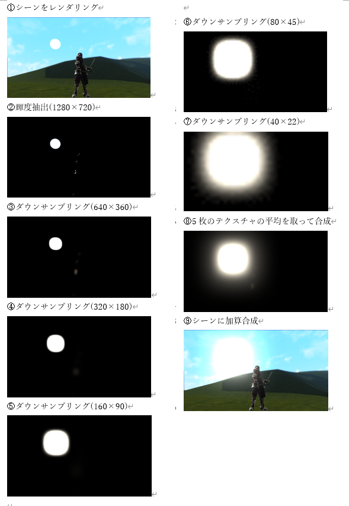

## はじめに
このチャプターでは、次のサンプルプログラムを利用します。ダウンロードをしてください。

**[Sample_10_06.zip](https://drive.google.com/file/d/1dcKLGhddX95ujRtTQBR9ASuhxACgnxAF/view?usp=sharing)**</br>

---

## 10.5 川瀬式ブルーム
この節では、ブルームをさらに綺麗に見せるために、当時ぶんか社に所属していた川瀬正樹氏が2003年のGDC(Game Developers Conference)で発表した川瀬式ブルームフィルタを紹介します。</br>
このアルゴリズムは高速で品質の高いブルームを表現でき、かつ非常にシンプルなアルゴリズムとなっています。川瀬式のブルームフィルタのアルゴリズムは、10.4で学んだ単一のガウシアンフィルターのアルゴリズムを少し改良するだけの実装です。ですが、その効果は絶大です。10.4で学んだブルームのアルゴリズムとの違いは、輝度テクスチャをぼかす処理が一回ではなく、複数ガウシアンブラーをかけていき、それらのテクスチャを合成します。例えば、輝度テクスチャの解像度が1024×1024の場合、512×512、256×256、128×128、64×64、32×32というように複数のダウンサンプリング用のレンダリングターゲットを用意して、ガウスフィルターをかけて縮小していきます。そして、それらを同解像度に拡大合成して、あふれテクスチャを生成する手法です。図10.24はアルゴリズムの流れを示しています。</br>
**図10.24**</br>
</img></br>

### 10.5.1 【ハンズオン】川瀬式ブルームを実装
では、さっそく川瀬式ブルームを実装していきましょう。`Sample_10_06/Sample_10_06.sln`を立ち上げてください。川瀬式のブルームフィルタは輝度抽出までの処理は、10.4のブルームを同じです。今回のハンズオンでは、10.4のブルームと違う点だけを見ていきます。

#### step-1 ガウシアンブラーを初期化。
今回のサンプルでは、ガウシアンブラーを４回実行してみます。GaussianBlurクラスのオブジェクトが要素数４の配列で定義されています。また、各オブジェクトが呼び出しているInit関数の引数に注目してください。gaussianBlur[0]は輝度テクスチャにブラーをかけたテクスチャを生成します。gaussianBlur[1]はgaussianBlur[0]のテクスチャにブラーをかけたテクスチャを生成します。これにより、４枚のボケ画像が出来上がります。では、main.cppの134行目にリスト10.44のプログラムを入力してください。</br>
[リスト10.44 main.cpp]
```cpp
//step-1 ガウシアンブラーを初期化。
GaussianBlur gaussianBlur[4];
//gaussianBlur[0]は輝度テクスチャにガウシアンブラーをかける。
gaussianBlur[0].Init(&luminnceRenderTarget.GetRenderTargetTexture());
//gaussianBlur[1]はgaussianBlur[0]のテクスチャにガウシアンブラーをかける。
gaussianBlur[1].Init(&gaussianBlur[0].GetBokeTexture());
//gaussianBlur[2]はgaussianBlur[1]のテクスチャにガウシアンブラーをかける。
gaussianBlur[2].Init(&gaussianBlur[1].GetBokeTexture());
//gaussianBlur[3]はgaussianBlur[2]のテクスチャにガウシアンブラーをかける。
gaussianBlur[3].Init(&gaussianBlur[2].GetBokeTexture());
```

#### step-2 ボケ画像を合成して書き込むためのスプライトを初期化。
続いて、ボケ画像を合成してスプライトを初期化します。4枚のボケ画像を使用するため、スプライトの初期化オブジェクトのm_textureメンバに４枚のテクスチャを指定しています。こうすると、Sprite::Init()の中で、４枚のテクスチャがディスクリプタヒープに登録されます。シェーダーもこの後で実装する専用シェーダーを指定していることに注目してください。では、main.cppにリスト10.45のプログラムを入力してください。</br>
[リスト10.45 main.cpp]
```cpp
//step-2 ボケ画像を合成して書き込むためのスプライトを初期化。
//初期化情報を設定する。
SpriteInitData finalSpriteInitData;
//【注目】ボケテクスチャを4枚指定する。
finalSpriteInitData.m_textures[0] = &gaussianBlur[0].GetBokeTexture();
finalSpriteInitData.m_textures[1] = &gaussianBlur[1].GetBokeTexture();
finalSpriteInitData.m_textures[2] = &gaussianBlur[2].GetBokeTexture();
finalSpriteInitData.m_textures[3] = &gaussianBlur[3].GetBokeTexture();
//解像度はmainRenderTargetの幅と高さ。
finalSpriteInitData.m_width = 1280;
finalSpriteInitData.m_height = 720;
//【注目】ボケ画像を合成する必要があるので、2D用のシェーダーではなく、専用シェーダーを指定。
finalSpriteInitData.m_fxFilePath = "Assets/shader/samplePostEffect.fx";
finalSpriteInitData.m_psEntryPoinFunc = "PSBloomFinal";

//ただし、加算合成で描画するので、アルファブレンディングモードを加算にする。
finalSpriteInitData.m_alphaBlendMode = AlphaBlendMode_Add;
//カラーバッファのフォーマットは例によって、32ビット浮動小数点バッファ。
finalSpriteInitData.m_colorBufferFormat[0] = DXGI_FORMAT_R32G32B32A32_FLOAT;

//初期化情報を元に加算合成用のスプライトを初期化する。
Sprite finalSprite;
finalSprite.Init(finalSpriteInitData);
```

#### step-3 ガウシアンブラーを4回実行する。
step-3からはゲームループ内の処理です。輝度テクスチャ抽出処理の後ろに、ガウシアンブラーを４回実行するコードを追加しましょう。main.cppにリスト10.46のプログラムを入力してください。</br>
[リスト10.46 main.cpp]
```cpp
//step-3 ガウシアンブラーを4回実行する。
gaussianBlur[0].ExecuteOnGPU(renderContext, 10);
gaussianBlur[1].ExecuteOnGPU(renderContext, 10);
gaussianBlur[2].ExecuteOnGPU(renderContext, 10);
gaussianBlur[3].ExecuteOnGPU(renderContext, 10);
```

#### step-4 4枚のボケ画像を合成してメインレンダリングターゲットに加算合成。
step-4でcpp側の最後の実装です。４枚のボケ画像の生成処理のあとで、ボケ画像を合成する処理を追加しましょう。リスト10.47のプログラムを入力してください。</br>
[リスト10.47 main.cpp]
```cpp
//step-4 4枚のボケ画像を合成してメインレンダリングターゲットに加算合成。
//レンダリングターゲットとして利用できるまで待つ。
renderContext.WaitUntilToPossibleSetRenderTarget(mainRenderTarget);
//レンダリングターゲットを設定。
renderContext.SetRenderTargetAndViewport(mainRenderTarget);
//最終合成。
finalSprite.Draw(renderContext);
//レンダリングターゲットへの書き込み終了待ち。
renderContext.WaitUntilFinishDrawingToRenderTarget(mainRenderTarget);
```

#### step-5 4枚のボケ画像にアクセスするための変数を追加。
ここからはシェーダー側です。ボケ画像を合成するためのシェーダーを実装して行きましょう。まずは、４枚のボケ画像にアクセスするための変数を追加します。`Assets/shader/samplePostEffect.fx`の51行目にリスト10.48のプログラムを入力してください。</br>
[リスト10.48 samplePostEffect.fx]
```cpp
//step-5 4枚のボケ画像にアクセスするための変数を追加。
Texture2D<float4> g_bokeTexture_0 : register(t0);
Texture2D<float4> g_bokeTexture_1 : register(t1);
Texture2D<float4> g_bokeTexture_2 : register(t2);
Texture2D<float4> g_bokeTexture_3 : register(t3);
```

#### step-6 ボケ画像をサンプリングして、平均をとって出力する。
これで最後の実装です。ボケ画像を合成して出力するピクセルシェーダーを実装しましょう。リスト10.49のプログラムを入力してください。入力出来たら実行してください。図10.25のようなプログラムが実行されたら完成です。コントローラの左スティック(キーボードならA,D)の入力でライトの強さを変えることができるので、10.4のブルームとの光の広がり方の違いを確認してみてください。</br>
[リスト10.49 samplePostEffect.fx]
```cpp
//step-6 ボケ画像をサンプリングして、平均をとって出力する。
float4 combineColor = g_bokeTexture_0.Sample(Sampler, In.uv);
combineColor += g_bokeTexture_1.Sample(Sampler, In.uv);
combineColor += g_bokeTexture_2.Sample(Sampler, In.uv);
combineColor += g_bokeTexture_3.Sample(Sampler, In.uv);
combineColor /= 4.0f;
combineColor.a = 1.0f;
return combineColor;
```
**図10.25**</br>
</img></br>


## 評価テスト
次の評価テストを行いなさい。</br>
[評価テストへジャンプ](https://docs.google.com/forms/d/e/1FAIpQLSe1EuY8YuUvCLXsYi2wwIKdDUCVkYkP0-szkxI56iXY8UE8_w/viewform?usp=sf_link)
</br>