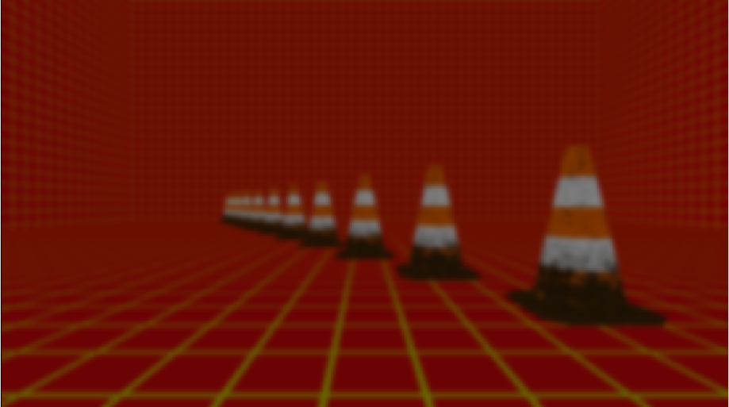
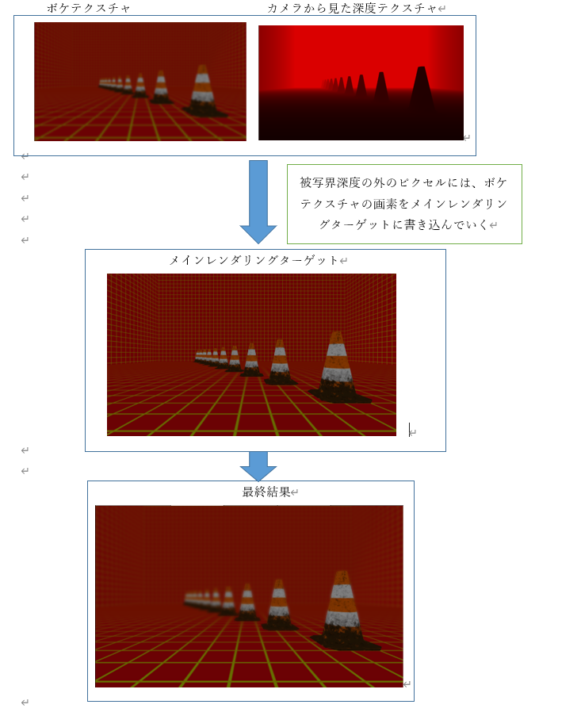

## はじめに
このチャプターでは、次のサンプルプログラムを利用します。ダウンロードをしてください。

**[Sample_10_07.zip](https://drive.google.com/file/d/1f0uf45BSvGf3UbM7L-UyXyE3qiyFPm4l/view?usp=sharing)**</br>

## 10.6 被写界深度
被写界深度(以下DoF)とはカメラのピントが合っているように見える範囲のことを指すのですが、リアルタムＣＧでDoFというと、図10.26のようなカメラのピンボケ現象全般を指します。このピンボケ現象もリアルタイムCGでは、ポストエフェクトで実現されています。</br>

**図10.26**</br>
</img></br>

### 10.6.1 アルゴリズム概要
 カメラのピンボケ現象は、図10.27のようにカメラ空間での深度値(Z値)によってボケ具合が変わっていきます。</br>
**図10.27**</br>
</img></br>

これでピンと来た人もいるかと思いますが、DoFの実装にはカメラから見たピクセルのZ値を活用します。Z値が被写界深度内の範囲外にあるピクセルにぼかしをかけていって、シーンに合成します。そのため、カメラから見たZ値をテクスチャ化する必要があります。
次が最もシンプルなDoFのアルゴリズムとなります。
1. シーンをメインレンダリングターゲットに描画。
2. １で描画したシーンのカメラ空間でのZ値を、深度値記録用のレンダリングターゲットに描画。
3. メインレンダリングターゲットのシーンテクスチャにブラーをかけて、ボケ画像を作成する。
4. 3で作成したボケ画像と2で作成したシーンの深度テクスチャを利用して、ボケ画像をメインレンダリングターゲットに合成する(図10.31)。</br>


では、アルゴリズムの詳細を見ていきましょう。

#### 1. シーンをメインレンダリングターゲットに描画。
まずは普通のシーンの描画です。ここで特別なことは行いません。メインレンダリングターゲットにオブジェクトを描画していきます(図10.28)。</br>
**図10.28**</br>
</img></br>

#### 2. １で描画したシーンのカメラ空間でのZ値を、深度値描き込み用のレンダリングターゲットに描画。</br>
続いて、シーンのカメラ空間でのZ値を、メインレンダリングターゲットとは別に作成したレンダリングターゲットに描画していきます(図10.29)。</br>
**図10.29**</br>
</img></br>

#### 3. メインレンダリングターゲットのシーンテクスチャにブラーをかけて、ボケ画像を作成する。</br>
続いて、シーンテクスチャのボケ画像を作成します。この画像を作るには、ガウシアンブラーなどのフィルターを使います(図10.30)。</br>
**図10.30**</br>
</img></br>

4. 3で作成したボケ画像と2で作成したシーンの深度テクスチャを利用して、ボケ画像をメインレンダリングターゲットに合成する(図10.31)。</br>
これで最後です。３で作成したボケ画像と、２で作成した深度テクスチャを使って、メインレンダリングターゲットにボケ画像を合成していきます。この処理では、ボケ画像からサンプリングしたテクセルをメインレンダリングターゲットに描き込む際に、深度テクスチャを参照して、そのテクセルのカメラから見たときのZ値を調べます。その値が被写界深度外であればボケたテクセルをメインレンダリングターゲットに描き込みます。逆に被写界深度内であれば、clip()などを利用して、ピクセルキルを行って、ボケたテクセルを描き込みません。すると、被写界深度外の箇所だけボケ画像になる最終画像が作成されます(図10.31)。</br>
**図10.31**</br>
</img></br>


### 10.6.2 Multi Renderging Target(MRT)
DoFを実装するためには、カメラから見た深度値が必要になってきます。アルゴリズム概要では、シーンをレンダリングした後で、カメラから見た深度値をレンダリングしていました。つまり、同じカメラから見たシーンを２回レンダリングしていることになります。次のコードはこの処理の疑似コードです。
```cpp
//レンダリングターゲットをメインレンダリングターゲットに変更する。
ChangeRenderTarget( mainRenderTarget );
//通常描画用のシェーダーを設定してモデルを描画。
SetNormalRenderShader();
//すべてのモデルを描画。
for( auto& model : modelList ){
　　model.Draw();
}
//レンダリングターゲットを深度値書き込み用のレンダリングターゲットに変更。
ChangeRenderTarget( depthInViewRenderTarget );
//深度値書き込み用のシェーダーを設定してモデルを描画
SetDepthInViewRenderShader();
//もう一度すべてのモデルを描画！！！
for( auto& model : modelList ){
　　model.Draw();
}
```
深度値を書き込むためだけに、シーンを2度レンダリングしているということは、3Dモデルを描画するための座標変換(頂点シェーダー)が2回実行されていることになります。ですが、同じカメラから見ているシーンを描画するわけなので、この頂点シェーダーの計算結果は結果は１回目と２回目とで全く同じ結果になります。DirectXにはこのような無駄な計算をなくすために、Multi Rendering Target(MRT)という機能ア用意されています。MRTを活用すると、一度の描画で複数のレンダリングターゲットに描き込むことができます。このあと実装する被写界深度は、このMRTを活用したものとなります。

### 10.6.3【ハンズオン】被写界深度を実装する。
では、Sample_10_07を改造して被写界深度を実装していきましょう。Sample_10_07/Sample_10_07.slnを立ち上げてください。
#### step-1 メインレンダリングターゲットと深度レンダリングターゲットを作成。
まずは、シーンのカラーを描きこむためのメインレンダリングターゲットと、シーンのカメラ空間でのZ値を描きこむためのレンダリングターゲットを作成します。main.cppの42行目にリスト10.50のプログラムを入力してください。</br>
[リスト10.50 main.cpp]
```cpp
//step-1 メインレンダリングターゲットと深度レンダリングターゲットを作成。
//シーンのカラーを描きこむメインレンダリングターゲットを作成。
RenderTarget mainRenderTarget;
mainRenderTarget.Create(
	1280,
	720,
	1,
	1,
	DXGI_FORMAT_R32G32B32A32_FLOAT,
	DXGI_FORMAT_D32_FLOAT
);
//シーンのカメラ空間でのZ値を書きこむレンダリングターゲットを作成。
RenderTarget depthRenderTarget;
depthRenderTarget.Create(
	1280,
	720,
	1,
	1,
	DXGI_FORMAT_R32_FLOAT,
	DXGI_FORMAT_UNKNOWN
);
```

#### step-2 シーンテクスチャをぼかすためのガウシアンブラーオブジェクトを初期化。
続いて、メインレンダリングターゲットに書き込まれた、シーンテクスチャをぼかすためのガウシアンブラーオブジェクトを初期化します。main.cppにリスト10.51のプログラムを入力してください。</br>
[リスト10.51 main.cpp]
```cpp
// step-2 シーンテクスチャをぼかすためのガウシアンブラーオブジェクトを初期化。
GaussianBlur blur;
blur.Init(&mainRenderTarget.GetRenderTargetTexture());
```

#### step-3 ボケ画像合成用のスプライトを初期化する。
被写界深度のアルゴリズムの最終ステップでは、step-2で作成されたボケ画像と、カメラ空間での深度テクスチャを利用して、ボケ画像をシーンに合成していきます。では、画像合成用のスプライトを初期化しましょう。リスト10.52のプログラムを入力して下さい。</br>
[リスト10.52 main.cpp]
```cpp
 // step-3 ボケ画像合成用のスプライトを初期化する。
SpriteInitData combineBokeImageSpriteInitData;
//使用するテクスチャは２枚。
combineBokeImageSpriteInitData.m_textures[0] = &blur.GetBokeTexture();
combineBokeImageSpriteInitData.m_textures[1] = &depthRenderTarget.GetRenderTargetTexture();
combineBokeImageSpriteInitData.m_width = 1280;
combineBokeImageSpriteInitData.m_height = 720;
//合成用のシェーダーを指定する。
combineBokeImageSpriteInitData.m_fxFilePath = "Assets/shader/samplePostEffect.fx";
combineBokeImageSpriteInitData.m_colorBufferFormat = DXGI_FORMAT_R32G32B32A32_FLOAT;
// 距離を利用してボケ画像をアルファブレンディングするので、半透明合成モードにする。
combineBokeImageSpriteInitData.m_alphaBlendMode = AlphaBlendMode_Trans;
// 初期化オブジェクトを利用してスプライトを初期化する。
Sprite combineBokeImageSprite;
combineBokeImageSprite.Init(combineBokeImageSpriteInitData);
```

#### step-4 ２枚のレンダリングターゲットを設定して、モデルを描画する。
ここからはゲームループの処理です。まずはシーンの絵とカメラ空間でのZ値を書きこんでいきます。今回はMRTを利用するので、複数枚のレンダリングターゲットを設定する必要があります。そのため、複数枚のレンダリングターゲットに対する操作ができる関数を利用して、レンダリングターゲットを設定していっています。そこに注目して、リスト10.53のプログラムを入力してください。</br>
[リスト10.53 main.cpp]
```cpp
 //step-4 ２枚のレンダリングターゲットを設定して、モデルを描画する。
//２枚のレンダリングターゲットのポインタを持つ配列を定義する。
RenderTarget* rts[] = {
	&mainRenderTarget,
	&depthRenderTarget
};
//レンダリングターゲットとして利用できるまで待つ
renderContext.WaitUntilToPossibleSetRenderTargets(2, rts);
//レンダリングターゲットを設定。
renderContext.SetRenderTargetsAndViewport(2, rts);
// レンダリングターゲットをクリア
renderContext.ClearRenderTargetViews(2, rts);
//モデルをドロー。
model.Draw(renderContext);
// レンダリングターゲットへの書き込み終了待ち
renderContext.WaitUntilFinishDrawingToRenderTargets(2, rts);
```

#### step-5 メインレンダリングターゲットのボケ画像を作成。
続いて、ボケ画像を作る処理を実装します。この処理はGaussianBlur::Execute()を実行するだけでです。では、リスト10.54のプログラムを入力してください。</br>
[リスト10.54 main.cpp]
```cpp
//step-5 メインレンダリングターゲットのボケ画像を作成。
blur.ExecuteOnGPU(renderContext, 5);
```

#### step-6 ボケ画像と深度テクスチャを利用して、ボケ画像を描きこんでいく。
では、cpp側はこれで最後です。ボケ画像と深度テクスチャを作成することができたので、この２枚のテクスチャを利用して、メインレンダリングターゲットにボケ画像を合成してきましょう。リスト10.55のプログラムを入力してください。</br>
[リスト10.55 main.cpp]
```cpp
// step-6 ボケ画像と深度テクスチャを利用して、ボケ画像を描きこんでいく。
// メインレンダリングターゲットを設定。
renderContext.WaitUntilToPossibleSetRenderTarget(mainRenderTarget);
renderContext.SetRenderTargetAndViewport(mainRenderTarget);
// スプライトを描画。
combineBokeImageSprite.Draw(renderContext);
// レンダリングターゲットへの書き込み終了待ち
renderContext.WaitUntilFinishDrawingToRenderTarget(mainRenderTarget);
```

#### step-7 カメラ空間でのZ値を記録する変数をピクセルシェーダへの入力に追加。
step-7からはシェーダー側です。まずは、３Dモデル描画の際に使用されているシェーダーを改造します。このシェーダーでは、二つのレンダリングターゲットに対して、シーンのカラーとカメラ空間でのZ値を出力する必要があります。では、まずは頂点シェーダーで計算したカメラ空間でのZ値をピクセルシェーダーに渡すために、ピクセルシェーダーの入力構造体に変数を追加しましょう。Assets/shader/sample3D.fxの39行目にリスト10.56のプログラムを入力してください。</br>
[リスト10.56 sample3D.fx]
```cpp
//step-7 カメラ空間でのZ値を記録する変数を追加。
float3 depthInView : TEXCOORD2; // カメラ空間でのZ値。
```

#### step-8 ピクセルシェーダーからの出力構造体を定義する。
続いて、ピクセルシェーダーからの出力構造体を定義します。このシェーダーではカラーとカメラ空間での深度値という二つの値を出力する必要があるため、その二つをまとめた構造体を利用します。では、リスト10.57のプログラムを入力してください。</br>
[リスト10.57 sample3D.fx]
```cpp
//step-8 ピクセルシェーダーからの出力構造体を定義する。
struct SPSOut{
    float4 color : SV_Target0;  //レンダリングターゲット0に描きこむ。
    float depth : SV_Target1;   //レンダリングターゲット1に描きこむ。
};
```

#### step-9 頂点シェーダーでカメラ空間でのZ値を設定する。
続いて、頂点シェーダーを改造します。ピクセルシェーダーにカメラ空間でのZ値を引き渡すための処理を実装します。リスト10.58のプログラムを頂点シェーダーに追加してください。</br>

[リスト10.58 sample3D.fx]
```cpp
//step-9 頂点シェーダーでカメラ空間でのZ値を設定する。
psIn.depthInView = psIn.pos.z;
```

#### step-10 ピクセルシェーダーからカラーとZ値を出力する。
step-10でsample3D.fxの実装は最後です。最後はピクセルシェーダーからシーンのカラーとカメラ空間でのZ	値を出力する処理を実装します。今回のサンプルでは、物理ベースライティングの結果を返してくれるCalcPBR()を著者の方で用意していますので、カラーの計算ではそちらを利用しています。では、ピクセルシェーダーにリスト10.59のプログラムを入力してください。</br>
[リスト10.59 sample3D.fx]
```cpp
//step-10 ピクセルシェーダーからカラーとZ値を出力する。
SPSOut psOut;
//カラーを計算。
psOut.color = CalcPBR(psIn);
//カメラ空間での深度値を設定。
psOut.depth = psIn.depthInView;
return psOut;
```

#### step-11 ボケ画像と深度テクスチャにアクセスするための変数を追加。
step-11からはボケ画像を合成していくシェーダーを改造していきます。Assets/shader/samplePostEffect.fxを開いて下さい。まずは、ボケ画像とカメラ空間での深度テクスチャにアクセスするための変数を追加します。samplePostEffect.fxの5行目にリスト10.60のプログラムを入力してください。</br>
[リスト10.60 samplePostEffect.fx]
```cpp
//step-11 ボケ画像と深度テクスチャにアクセスするための変数を追加。
Texture2D<float4> bokeTexture : register(t0);  // ボケ画像
Texture2D<float4> depthTexture : register(t1); // 深度テクスチャ
```

#### step-12 ボケ画像描き込み用のピクセルシェーダーを実装。
では、いよいよ最後です。深度テクスチャとボケテクスチャを利用して、ボケ画像をメインレンダリングターゲットに描きこんでいくシェーダーを実装しましょう。今回は、カメラ空間での深度値が200以上なら、徐々にボケていくように実装しています。では、リスト10.61のプログラムを入力してください。</br>
[リスト10.61 main.cpp]
```cpp
// step-12 ボケ画像描き込み用のピクセルシェーダーを実装。
// カメラ空間での深度値をサンプリング。
float depth = depthTexture.Sample( Sampler, In.uv );
// カメラ空間での深度値が200以下ならピクセルキル 
//      -> ボケ画像を描きこまない。
clip( depth - 200.0f);
// ボケ画像をサンプリング。
float4 boke = bokeTexture.Sample( Sampler, In.uv );
// 深度値から不透明度を計算する。
// 深度値200からボケが始まり、深度値500で最大のボケ具合になる。
//  -> つまり、深度値500で不透明度が1になる。
boke.a = min( 1.0f, ( depth - 200.0f ) / 500.0f );
// ボケ画像を出力。
return boke;
```
入力出来たら実行してみてください。うまく実装できていると図10.32のように、画面の奥の方の画像がボケて表示されているはずです。</br>
**図10.32**</br>
</img></br>

## 評価テスト
次の評価テストを行いなさい。</br>
[評価テストへジャンプ](https://docs.google.com/forms/d/e/1FAIpQLSeZN8nzMfWQ8SR-SGaTh1HkCWl8MRt2VwfPfiqjKygXw28gKg/viewform?usp=sf_link)
</br>