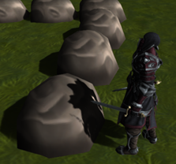

## はじめに
このチャプターでは、次のサンプルプログラムを利用します。ダウンロードをしてください。

**[Sample_11_01.zip](https://drive.google.com/file/d/1yyYLV2t6GShFKpPWry9a-WDyfJo5tQZ-/view?usp=sharing)**</br>
**[Sample_11_02.zip](https://drive.google.com/file/d/1EWq6nb021Gm6f1FcuCht0b3waNa9n2Tr/view?usp=sharing)**</br>


## 11.1 投影シャドウ
３Ｄゲームにおいて、リアルなグラフィックを実現するために影は非常に重要な要素になります。また、グラフィック面だけではなく、影は３Ｄオブジェクトの空間上の位置をユーザーに教えるための重要な要素となります。このチャプターでは、基本となる古典的な影生成アルゴリズムの投影シャドウについて見ていきます。
### 11.1.1 シャドウマップ
投影シャドウはシャドウマップと呼ばれるテクスチャを使用して、影を落とすアルゴリズムの一つになります。シャドウマップというのは影が落ちる場所がテクスチャに描きこまれたものとなります。下の図を見てみて下さい。図11.1を見てください。</br>
**図11.1**</br>
</img></br>
このように、影というのは物体によって光が遮られている箇所に発生するものだということが分かります。これは言い方を変えると、光を放っているライトの位置から見たときに、手前に物体が存在していれば影が落ちると言うことができます。図11.2を見てみて下さい。</br>

**図11.2**</br>
</img></br>
キャラクターの影が岩に落ちているのが分かります。では、これをライトの方向から見た場合はどうなるでしょうか？図11.3を見てください。

**図11.3**</br>
</img></br>
このように、ライトの位置から見てみると、影が落ちていた岩の部分は、キャラクターに遮られていることが分かります。このライトから見た絵がシャドウマップです。</br>


### 11.1.2 【ハンズオン】シャドウマップを作ってみる
では、早速ハンズオンでシャドウマップを作っていましょう。シャドウマップというのは、ライトから見た絵です。勘のいい人ならすでに気付いているかもしれませんが、シャドウマップは、これはチャプター10で勉強したオフスクリーンレンダリングを行うことで作成することが出来ます。つまり、ライトをカメラと見立てて影を生成したいオブジェクトを、シャドウマップに対してレンダリングしてやればいいのです。シャドウマップを作成するためのポイントは次の４点です。
1. シャドウマップ描画用のレンダリングターゲットを作成する
2. ライトの位置にカメラを設置する。
3. シャドウマップ描画用のモデルを用意する。
4. 影を生成したいモデルをシャドウマップに描画する。
5. シャドウマップ描画用のピクセルシェーダーを作成する。
では、この４点をハンズオンで実装していきましょう。`Sample_11_01/Sample_11_01.sln`を立ち上げてください。

#### step-1 シャドウマップ描画用のレンダリングターゲットを作成する
まずは。影から見た絵を描画する必要があるので、シャドウマップ描画用のレンダリングターゲットを作成する必要があります。main.cppの23行目にリスト11.1のプログラムを入力してください。</br>
[リスト11.1 main.cpp]
```cpp
//step-1 シャドウマップ描画用のレンダリングターゲットを作成する。
//カラーバッファのクリアカラー
//今回はカラーバッファは真っ白にする。
float clearColor[4] = { 1.0f, 1.0f, 1.0f, 1.0f };
RenderTarget shadowMap;
shadowMap.Create(
	1024,//【注目】レンダリングターゲットの横幅
	1024,//【注目】レンダリングターゲットの縦幅
	1,
	1,
	DXGI_FORMAT_R8G8B8A8_UNORM,
	DXGI_FORMAT_D32_FLOAT,
	clearColor
);
```
レンダリングターゲットの解像度は、影生成のクオリティに影響を与えるので、コメントを記載しています。端的に説明しておくと、シャドウマップの解像度を上げると品質は向上し、下げると品質は低下します。では、単純に解像度をあげればいいのかというと、そういう訳でもなく、解像度を上げると影の品質は上がりますが、パフォーマンスは低下することとなります。

#### step-2 ライトの位置にカメラを設置する
続いて、ライトから見た絵をシャドウマップに描画するのでライトカメラを準備します。ライトカメラはライトの位置置、方向などの情報からカメラを設定します。リスト11.2のプログラムをmain.cppに入力してください。</br>
[リスト11.2 main.cpp]
```cpp
//step-2 影描画用のライトカメラを作成する。
Camera lightCamera;
//カメラの位置を設定。これはライトの位置。
lightCamera.SetPosition(0, 600, 0);
//カメラの注視点を設定。これがライトが照らしている場所。
lightCamera.SetTarget(0, 0, 0);
//【注目】上方向を設定。今回はライトが真下を向いているので、X方向を上にしている。
lightCamera.SetUp(1, 0, 0);
//今回のサンプルでは画角を狭めにしておく。
lightCamera.SetViewAngle(Math::DegToRad(20.0f));
//ライトビュープロジェクション行列を計算している。
lightCamera.Update();
```
今回のハンズオンはライトが真下を向いているので、カメラの上方向に{0, 1, 0}を指定すると、計算がおかしくなってしまうため、X方向を真上にしています。

#### step-3 シャドウマップ描画用のモデルを用意する。
続いて、シャドウマップ描画用のモデルを定義します。今回のサンプルでは、シャドウマップ描画と通常描画でピクセルシェーダーが異なるため、ティーポットのモデルはシャドウマップ描画用と通常描画用の２種類を用意しています。リスト11.3のプログラムをmain.cppに入力してください。</br>
[リスト11.3 main.cpp]
```cpp
//step-3 シャドウマップ描画用のモデルを用意する。
ModelInitData teapotShadowModelInitData;
//【注目】シャドウマップ描画用のシェーダーを指定する。
teapotShadowModelInitData.m_fxFilePath = "Assets/shader/sampleDrawShadowMap.fx";
teapotShadowModelInitData.m_tkmFilePath = "Assets/modelData/teapot.tkm";
Model teapotShadowModel;
teapotShadowModel.Init(teapotShadowModelInitData);
teapotShadowModel.UpdateWorldMatrix(
	{ 0, 50, 0 },
	g_quatIdentity,
	g_vec3One
);
```

#### step-4 影を生成したいモデルをシャドウマップに描画する。
cpp側最後のハンズオンです。影を生成したモデルをシャドウマップに描画しましょう。リスト11.4のプログラムをmain.cppに入力してください。</br>
[リスト11.4 main.cpp]
```cpp
//step-4 影を生成したいモデルをシャドウマップに描画する。
//レンダリングターゲットをシャドウマップに変更する。
renderContext.WaitUntilToPossibleSetRenderTarget(shadowMap);
renderContext.SetRenderTargetAndViewport(shadowMap);
renderContext.ClearRenderTargetView(shadowMap);

//影モデルを描画。
teapotShadowModel.Draw(renderContext, lightCamera);

//書き込み完了待ち。
renderContext.WaitUntilFinishDrawingToRenderTarget(shadowMap);
```

#### step-5 シャドウマップ描画用のピクセルシェーダーを作成する。
では、最後のハンズオンです。今回のハンズオンでシャドウマップに描き込むカラーはグレースケール(灰色)である必要があります。そこで、シャドウマップ描画用のピクセルシェーダーを実装しましょう。Assets/shader/sampleDrawShadowMap.fxの46行目にリスト11.5のプログラムを入力してください。</br>
[リスト11.5 sampleDrawShadowMap.fx]
```cpp
//step-5 シャドウマップ描画用のピクセルシェーダーを作成する。
return float4( 0.5f, 0.5f, 0.5f, 1.0f);
```
ここまで実装できたら、実行してみてください。うまく実装できていると図11.4のようなプログラムが実行できます。</br>
**図11.4**</br>
</img></br>
ここまでの実装はシャドウマップを作成しただけなので、まだ投影シャドウの実装の半分です。ですので、まだ影は落ちません。今回のサンプルではシャドウマップが作成できていることを確認するために、画面の左上に描画されたシャドウマップを表示しています。図11.4と同じようなシャドウマップが作れているか確認してください。

### 11.1.3 シャドウマップの貼り付け
前節でグレースケールのシャドウマップが作成できました。これで投影シャドウに使用するシャドウマップは完成したことになります。あとは、影を受けたいオブジェクトにシャドウマップを張り付けてやればよいことになります。では、どうやって張り付けるのか見ていきましょう。例えば図11.5絵の岩を画面に描画する際は、岩の頂点座標×ワールド行列×カメラ行列×射影行列という計算を行ってスクリーン座標系に変換します。</br>
**図11.5**</br>
</img></br>

シャドウマップを張り付ける場合は、先ほどの変換とは別に岩の頂点座標×ワールド行列×ライトカメラ行列×ライト射影行列という計算を行って、ライトをカメラと見立てたスクリーン座標系への変換も行う必要があります。つまり岩に影を落とす場合、図11.6の２パターンの座標変換を行うことになります。</br>
**図11.6**</br>
</img></br>
では、具体的にコードを見ていきましょう。次のコードは２パターンの座標変換を行っている頂点シェーダーの疑似コードです。</br>

```cpp
/// <summary>
/// 影が落とされる3Dモデル用の頂点シェーダー。
/// </summary>
SPSIn VSMain(SVSIn vsIn)
{
	//シャドウレシーバー用の頂点シェーダーを実装。
	SPSIn psIn;
	//ここは通常の座標変換
	float4 worldPos = mul(mWorld, vsIn.pos);
	psIn.pos = mul(mView, worldPos);
	psIn.pos = mul(mProj, psIn.pos);
	psIn.uv = vsIn.uv;

	//ここからライトビュースクリーン空間での座標を計算している。
	psIn.posInLVP = mul( mLVP, worldPos);
	psIn.normal = mul(mWorld, vsIn.normal);
	return psIn;
}
```
psIn.posInLVPというパラメータにライトビュースクリーン空間での座標が記録されており、この値がピクセルシェーダーに渡されています。
#### 11.1.3.1 正規化スクリーン座標系
では、ここで頂点シェーダーで変換されている、スクリーン空間の座標系というのがどのような座標系になっているかみてみましょう。例えば図11.7のように描画された場合、頂点座標は縦横-1.0～1.0の座標系に変換されています。</br>
**図11.7**</br>
</img></br>

このように、画面の左下が( -1, -1 )、画面の右上が( 1, 1 )となっている座標系が正規化スクリーン座標系と呼ばれます。実は、これまでの頂点シェーダーで行っていた変換は、最終的に正規化スクリーン座標系に変換していたのです。これがシャドウマップを張り付ける際に重要になってきますので、しっかりと抑えておいてください。

#### 11.1.3.2  正規化スクリーン座標系からUV座標系に変換
では、シャドウマップの貼り付けの話に戻りましょう。先ほど頂点シェーダーで影を受けたいオブジェクトの頂点座標にライトビュープロジェクション行列を乗算して、正規化スクリーン座標系に変換を行いました。そうすると岩のオブジェクトは図11.8のような座標系に変換されます。</br>
**図11.8**</br>
</img></br>

仮にこの人間のキャラクターがシャドウマップに描画されている場合は図11.9のようなシャドウマップが生成されています。
**図11.9**</br>
</img></br>
図11.8と図11.9を見比べてみると、座標の範囲の違いはありますが、岩に影が落ちる部分はシャドウマップにマッピングするとちょうど灰色になっていることが分かります。つまり、ライトビュープロジェクション行列で変換した座標(-1～1)を、UV座標(0～1)に変換して、それを使って岩にシャドウマップを張り付けてやればうまくいきそうです。次のコードは座標変換の疑似コードです。</br>

```cpp
//正規化スクリーン座標系( -1～1 )の範囲に0.5をかけて( -0.5～0.5 )の範囲にする。
//yの値が-0.5なのは、上下が逆だから。
float2 shadowMapUV = psIn.posInLVP.xy * float2( 0.5f, -0.5f);
//( -0.5～0.5 )の範囲に0.5を足し算することで、( 0.0～1.0 )の範囲にする。
shadowMapUV += 0.5f; 
```
あとは、計算されたUV座標を利用して、シャドウマップからカラーをサンプリングしてやれば影を落とすことができます。

### 11.1.4 【ハンズオン】シャドウマップを使って影を落とす。
では、シャドウマップを貼り付けるプログラムを実装していきましょう。Sample_11_02/Sample_11_02.slnを立ち上げてください。

#### step-1 影を受ける背景モデルを初期化。
まずは、影を落とされるモデルを初期化します。影を受けるモデルは、座標変換とシャドウマップからのカラーのサンプリングが必要になるので、シェーダーが通常のモノとは異なります。また、ライトビュースクリーン空間に変換を行う必要があるため、座標変換を行うための行列を定数バッファに設定しています。main.cppの71行目にリスト11.6のプログラムを入力してください。</br>

[リスト11.6 main.cpp]
```cpp
//step-1 影を受ける背景モデルを初期化。
ModelInitData bgModelInitData;
//影が落とされるモデル用のシェーダーを指定する。
bgModelInitData.m_fxFilePath = "Assets/shader/sampleShadowReciever.fx";
//シャドウマップを拡張SRVに設定する。
bgModelInitData.m_expandShaderResoruceView[0] = &shadowMap.GetRenderTargetTexture();
//ライトビュープロジェクション行列を拡張定数バッファに設定する。
bgModelInitData.m_expandConstantBuffer = (void*)&lightCamera.GetViewProjectionMatrix();
bgModelInitData.m_expandConstantBufferSize = sizeof(lightCamera.GetViewProjectionMatrix());
bgModelInitData.m_tkmFilePath = "Assets/modelData/bg/bg.tkm";

Model bgModel;
bgModel.Init(bgModelInitData);
```

#### step-2 影を受ける背景を描画。
続いて、影を受けるモデルを描画します。この描画は通常の描画パスです。main.cppにリスト11.7のプログラムを入力してください。</br>
[リスト11.7 main.cpp]
```cpp
//step-2 影を受ける背景を描画。
bgModel.Draw(renderContext);
```
#### step-3 ライトビュープロジェクション行列にアクセする定数バッファを定義。
step-3からは影を受けるモデル用のシェーダーのプログラムになります。まずは、ライトビュープロジェクション行列にアクセスするための定数バッファを定義しましょう。`Assets/shader/sampleShadowReciever.fx`を開いて、11行目にリスト11.8のプログラムを入力してください。</br>

[リスト11.8 sampleShadowReciever.fx]
```cpp
//step-3 ライトビュープロジェクション行列にアクセする定数バッファを定義。
cbuffer ShadowCb : register(b1){
	float4x4 mLVP;
};

```
#### step-4 ライトビュースクリーン空間でのピクセルの座標を追加。
続いて、ピクセルシェーダーへの入力にライトビュースクリーン空間でのピクセルの座標を追加します。リスト11.9のプログラムを入力してください。</br>
[リスト11.9 sampleShadowReciever.fx]
```cpp
//step-4 ライトビュースクリーン空間でのピクセルの座標を追加。
float4 posInLVP		: TEXCOORD1;	//ライトビュースクリーン空間でのピクセルの座標
```

#### step-5 ライトビュースクリーン空間の座標を計算する。
step-5では、頂点シェーダーでのライトビュースクリーン空間への座標変換を実装します。リスト11.10のプログラムを入力してください。</br>
[リスト11.10 sampleShadowReciever.fx]
```cpp
//step-5 ライトビュースクリーン空間の座標を計算する。
psIn.posInLVP = mul( mLVP, worldPos);
```

#### step-6 ライトビュースクリーン空間からUV空間に座標変換。
続いてピクセルシェーダーです。まず、頂点シェーダーから渡された、ライトビュースクリーン空間の座標をUV空間に変換しましょう。リスト11.11のプログラムを入力してください。</br>

[リスト11.11 sampleShadowReciever.fx]
```cpp
//step-6 ライトビュースクリーン空間からUV空間に座標変換。
//【注目】ライトビュースクリーン空間からUV座標空間に変換している。
float2 shadowMapUV = psIn.posInLVP.xy / psIn.posInLVP.w;
shadowMapUV *= float2( 0.5f, -0.5f);
shadowMapUV += 0.5f; 
```
ここで一点注意点として、psIn.posInLVP.xyの値をpsIn.posInLVP.wで除算しています。これはまだ説明していませんが、実は正規化スクリーン座標系というのは、wで割り算することで、(-1～1)の範囲に収まることとなります。この数学的な原理の話については本書では詳しくは説明しません。本書では、wで除算することで、正規化スクリーン座標系に変換されるということを覚えておいてくれれば十分です。
#### step-7 計算したUV座標を使って、シャドウマップから影情報をサンプリング。
UV座標を計算することができたら、シャドウマップから影情報をサンプリングしましょう。リスト11.12のプログラムを入力してください。</br>
[リスト11.12 sampleShadowReciever.fx]
```cpp
//step-7 計算したUV座標を使って、シャドウマップから影情報をサンプリング
float3 shadowMap = 1.0f; 
if( shadowMapUV.x > 0.0f && shadowMapUV.x < 1.0f
	&& shadowMapUV.y > 0.0f && shadowMapUV.y < 1.0f
){
	shadowMap = g_shadowMap.Sample(g_sampler, shadowMapUV);
} 
```
UV座標がUV空間の範囲内の場合だけ、シャドウマップからカラーをサンプリングしています。シャドウマップに描画できる範囲というのは、有限なので、範囲外の場所に影を落とすことはできません。

#### step-8 サンプリングした影情報をテクスチャカラーに乗算する。
では、最後のハンズオンです。影情報をサンプリングできたら、そのカラーをテクスチャカラーに掛け算しましょう。リスト11.13のプログラムを入力してください。</br>
[リスト11.13 sampleShadowReciever.fx]
```cpp
//step-8 サンプリングした影情報をテクスチャカラーに乗算する。
//テクスチャカラーにシャドウマップからサンプリングした情報を掛け算する。
//影が描き込まれていたら0.5になっているので、色味が落ちて影っぽくなる。
color.xyz *= shadowMap;
```

シャドウマップは1.0でクリアされています。また、影が落ちる箇所には、灰色(0.5, 0.5, 0.5)が格納されています。そのため、影が落ちていなければ1.0が乗算されるため、何も変化が起きず、影が落ちている箇所は0.5が乗算されるため、色味が暗くなります。実装出来たら実行してください。うまく実装できていると図11.10のようなプログラムが実行できます。</br>
**図11.10**</br>
</img></br>

## 評価テスト
次の評価テストを行いなさい。</br>
[評価テストへジャンプ](https://docs.google.com/forms/d/e/1FAIpQLScGf2X24p-yuwFZ7_EFtimL-whHH7sn9rHgd5PuWXQei0hm6g/viewform?usp=sf_link)
</br>