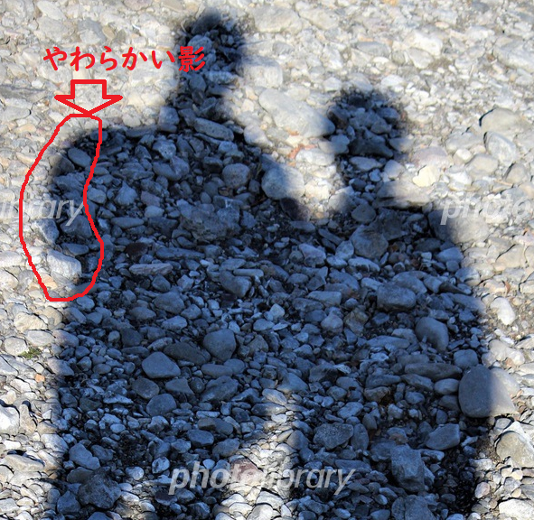
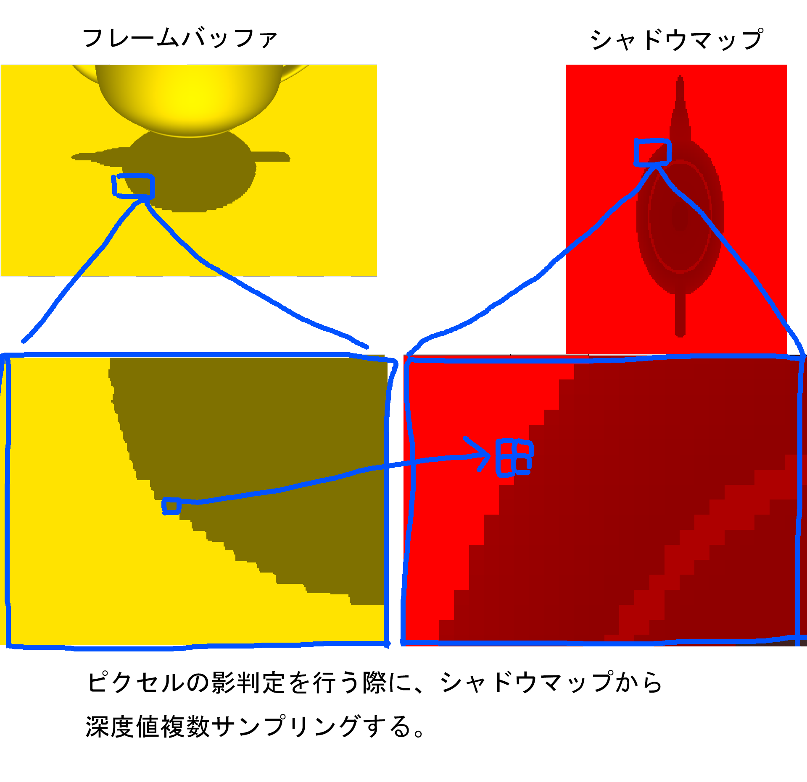
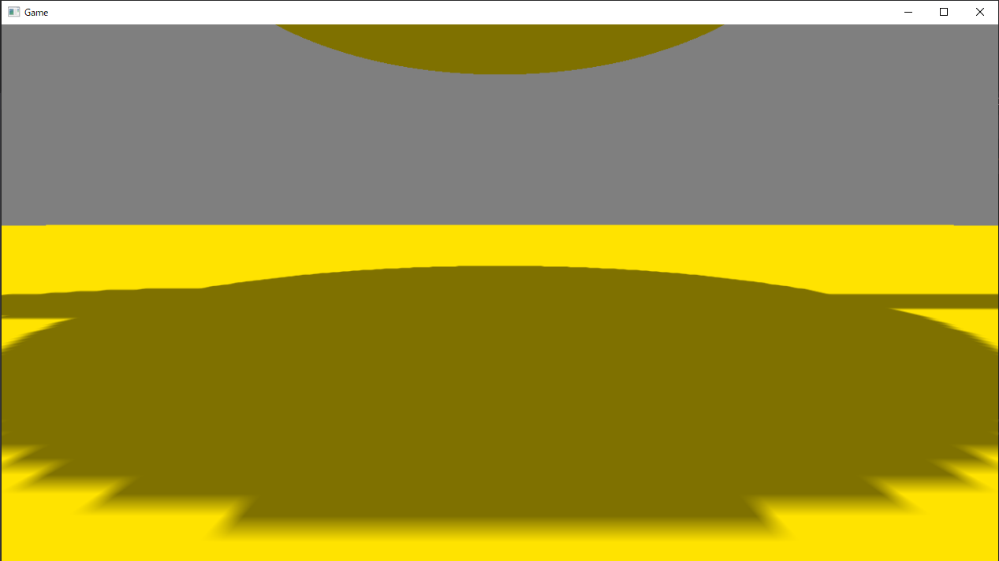

## はじめに
このチャプターでは、次のサンプルプログラムを利用します。ダウンロードをしてください。

**[Sample_11_04.zip](https://drive.google.com/file/d/1-sD46EaTRxxPZDKSJwqUu2dvHQdEgid6/view?usp=sharing)**</br>

## 11.3 Percentage Closer Filtering(PCF)
この節では、もっとも簡単にソフトシャドウを実現できるPercentage Closer Filtering(PCF)について見ていきます。

### 11.3.1 ソフトシャドウ
ソフトシャドウとは現実世界の影で生じるやわらかい影のことを指しています。現実世界では、影の輪郭付近が薄くなっていき、ぼんやりとした影になります(図11.14)。</br>
**図11.14**</br>
</img></br>
一方、11.2で実装した影はハードシャドウとよばれる、輪郭がくっきりとした影になります(図11.15)。</br>

**図11.15**</br>
</img></br>

### 11.3.2 PCF
PCFはデプスシャドウマップを少し改造するだけで実装出来ます。ほとんどのアルゴリズムはシンプルなデプスシャドウと同じです。違いがあるのは、シャドウレシーバーを描画するときのピクセルシェーダーです。シャドウレシーバーを描画する際にシャドウマップから深度値をサンプリングして、そのピクセルが光源から遮蔽されているかどうかを判定していましたが、PCFではこの深度値のサンプリングを一点だけではなく、複数サンプリングして、その遮蔽状況から、その遮蔽情報からどれだけ遮蔽されているか(遮蔽率)を決定します(図11.16)。</br>

**図11.16**</br>
</img></br>

### 11.3.2.1 PCFのアルゴリズム
PCFのアルゴリズムを疑似コードを見ながら説明していきます。PCFはシャドウマップを作成するまでの処理は、シンプルなデプスシャドウと全く同じです。違う点はシャドウレシーバーを描画するときの影の判定の方法です。PCFでは、まずシャドウマップをつかって、基準テクセルから近傍４テクセルの深度値をサンプリングします(リスト11.19)。</br>

[リスト11.19 疑似コード]
```cpp
//OFFSET_XとOFFSET_Yには1テクセルずらすためのUVオフセットが計算されているとする。
//【注目】基本テクセルから近傍4テクセル深度値を引っ張ってくる。
float zInShadowMap_0 = g_shadowMap.Sample(
	g_sampler, 
	shadowMapUV).r;
float zInShadowMap_1 = g_shadowMap.Sample(
	g_sampler, 
	shadowMapUV + float2( OFFSET_X, 0.0f)).r;
float zInShadowMap_2 = g_shadowMap.Sample(
	g_sampler, 
	shadowMapUV + float2( OFFSET_X, OFFSET_Y)).r;
float zInShadowMap_3 = g_shadowMap.Sample(
	g_sampler, 
	shadowMapUV + float2( 0.0f, OFFSET_Y)
	).r;
```

4つの深度値をサンプリングできたら、これから描画しようとしているピクセルのZ値と、サンプリングしたZ値との比較を行います。遮蔽されている場合はshadowRateという変数に１加算していっていることに注目してください(リスト11.20)。</br>

[リスト11.20 疑似コード]
```cpp
//このピクセルのライトから見た深度値と４つの深度値を比較して遮蔽率を計算する。
float shadowRate = 0.0f;
if( zInLVP > zInShadowMap_0){
	//遮蔽されているので、遮蔽率を１加算。
	shadowRate += 1.0f;
}
if( zInLVP > zInShadowMap_1){
	//遮蔽されているので、遮蔽率を１加算。
	shadowRate += 1.0f;
}
if( zInLVP > zInShadowMap_2){
	//遮蔽されているので、遮蔽率を１加算。
	shadowRate += 1.0f;
}
if( zInLVP > zInShadowMap_3){
	//遮蔽されているので、遮蔽率を１加算。
	shadowRate += 1.0f;
}
```
4つの深度値と比較を行うことができたら、最後にshadowRateを4で割って遮蔽率の平均を求めます。もしこのピクセルが2つのテクセルから遮蔽されていたら、遮蔽率の平均は0.5となります(リスト11.21)。</br>
[リスト11.22 疑似コード]
```cpp
//遮蔽率の平均を計算する。
//4つすべて遮蔽されていたら遮蔽率が100%になる。
//２つしか遮蔽されていなければ、50%になる。
shadowRate /= 4.0f;
```
遮蔽率を求めることができたら、その遮蔽率を使って、シャドウカラーと通常カラーをブレンディングして最終カラーを求めることで影を落とすことができます。(リスト11.23)。</br>
[リスト11.23 疑似コード]
```cpp
//遮蔽率が求まったら、線形補完で影を落とす。
float3 shadowColor = albedoColor.xyz;
float3 finalColor = lerp( albedoColor.xyz, shadowColor, shadowRate );
```

### 11.3.2 ハードウェアの機能を使ったPCFの実装
HLSLには、リスト11.19とリスト11.20の深度比較と遮蔽率の計算を一発で行うことができる、SampleCmpLevelZero()という関数があります。この関数を利用すると、先ほどのコードを次のように改造することができます(リスト11.24)。</br>
[リスト11.24 疑似コード]
```cpp
//SampleCmpLevelZero()を利用して、遮蔽率を求める。
float shadow = g_shadowMap.SampleCmpLevelZero(
	g_shadowMapSampler, 	//比較サンプリング用のサンプラステート。
	shadowMapUV, 			//シャドウマップUV。
	zInLVP					//このピクセルのライトから見たときの深度値。
);
//遮蔽されている。
float3 shadowColor = color.xyz * 0.5f;
color.xyz = lerp( color.xyz, shadowColor, shadow) ;
```
この関数を利用するためには、適切な比較サンプリング用のサンプラステートを作成する必要があります。今回指定しているサンプラステートは、第三引数の値と、シャドウマップの値とで比較を行い、第三引数の値が大きければ1,0、小さければ0.0、これを４テクセル分行って、その平均を戻り値として返すように設定されています。リスト11.19とリスト11.20の疑似コードの４テクセル分のif文と同じ処理を行うための設定です。本書が提供しているエンジンでは、このサンプラステートはMiniEngine/Material.cppの91行目からのプログラムで作成されています(リスト11.25)。

[リスト11.25 Material.cpp]
```cpp
//シャドウマップ用のサンプラの設定を行う。
samplerDescArray[1] = samplerDescArray[0];
//比較対象の値が小さければ０、大きければ１を返す比較関数を設定する。
samplerDescArray[1].Filter = D3D12_FILTER_COMPARISON_MIN_MAG_MIP_LINEAR;
samplerDescArray[1].ComparisonFunc = D3D12_COMPARISON_FUNC_GREATER;
samplerDescArray[1].MaxAnisotropy = 1;
samplerDescArray[1].ShaderRegister = 1; //s1レジスタに設定する。

m_rootSignature.Init(
	samplerDescArray,
	2
);
```
### 11.3.3 【ハンズオン】PCFを実装する
では、PCFを実装していきましょう。今回は4つのテクセル値との比較の平均を取得してくれる、HLSLの関数のSampleCmpLevelZeroを使用してPCFを実装していきます。Sample_11_04/Sample_11_04.slnを立ち上げてください。

#### step-1 シャドウマップサンプリング用のサンプラステートにアクセスする変数を追加する。
PCFのアルゴリズムはシャドウマップを作るまでは、ノーマルのデプスシャドウと何も変わりはありません。違いがあるのはシャドウレシーバーの影判定の箇所だけです。ですので、今回の実装では、シャドウレシーバー用のシェーダーのみ変更してきます。まずは、比較サンプリングのためのサンプラステートにアクセスするための変数を追加します。では、Assets/shader/sampleShadowReciever.fxの39行目にリスト11.26のプログラムを入力してください。</br>

[リスト11.26 sampleShadowReciever.fx]
```cpp
//step-1 シャドウマップサンプリング用のサンプラステートにアクセスする変数を追加する。
SamplerComparisonState g_shadowMapSampler: register(s1);
```
リスト11.25で見たように、本書のエンジンでは、比較サンプリング用のサンプラステートはs1レジスタに設定されてるため、s1にアクセスするための変数を定義しています。

#### step-2 SampleCmpLevelZero関数を使用して、遮蔽率を取得する。
続いてピクセルシェーダーの改造です。SampleCmpLevelZero関数を使用して、ピクセルの遮蔽率を計算します。リスト11.27のプログラムを入力して下さい。</br>
[リスト11.27 sampleShadowReciever.fx]
```cpp
//step-2 SampleCmpLevelZero関数を使用して、遮蔽率を取得する。
float shadow = g_shadowMap.SampleCmpLevelZero(
	g_shadowMapSampler, 	//使用するサンプラステート。
	shadowMapUV, 			//シャドウマップにアクセするUV座標。
	zInLVP					//比較するZ値。この値が比較するテクセルの値より大きければ1.0、0.0。
							//それを4テクセル分行い、4テクセルの平均を返してくる。
);
```
#### step-3 シャドウカラーと通常カラーを遮蔽率で線形補間する。
では、これで最後です。遮蔽率を使って、シャドウカラーと通常カラーでブレンディグして影を落とします。リスト11.28のプログラムを入力して下さい。</br>
[リスト11.28 sampleShadowReciever.fx]
```cpp
//step-3 シャドウカラーと通常カラーを遮蔽率で線形補間する。
//シャドウカラーを計算。
float3 shadowColor = color.xyz * 0.5f;
//遮蔽率を使って線形補完、
color.xyz = lerp( color.xyz, shadowColor, shadow) ;
```
実装したら実行して、コントローラーの右スティックを操作して、影をアップにしてみてください。図11.17のように、影の境界がボケていたら実装できています。</br>
**図11.17**</br>
</img></br>


## 評価テスト
次の評価テストを行いなさい。</br>
[評価テストへジャンプ](https://docs.google.com/forms/d/e/1FAIpQLScR1_QuxpMd8N6MTeaUJLTmw_z69WP247Xpex2M_SOj8tb7sw/viewform?usp=sf_link)
</br>