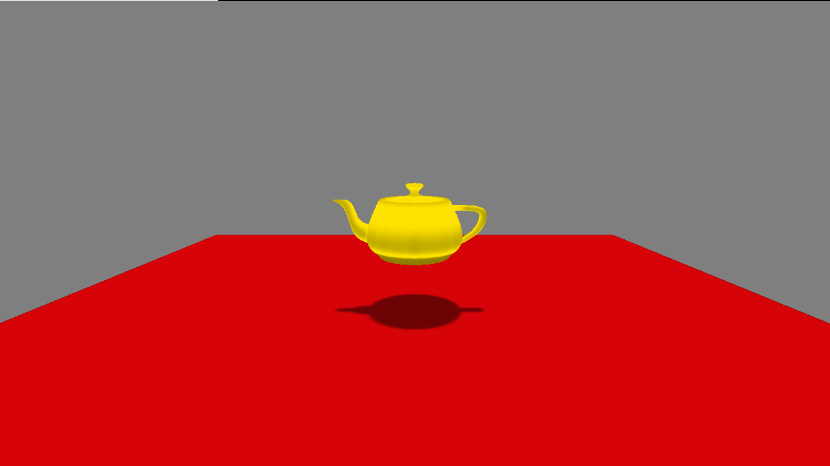
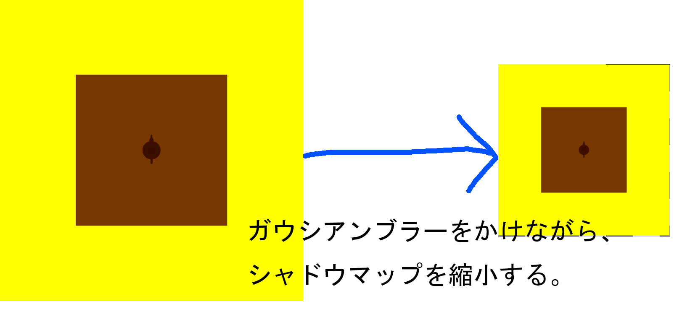
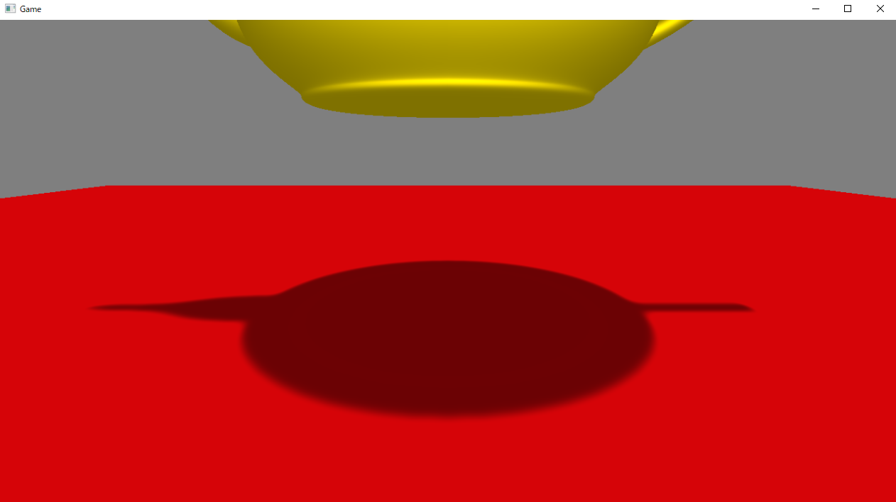

## 11.4 Variance Shadow Maps(VSM)
11.4ではPCFよりも品質の高いソフトシャドウを実現することができる、Variance Shadow Maps(VSM)と呼ばれる分散シャドウマップについて見ていきます。
### 11.4.1 VSMとは
VSMとは、シャドウマップに描き込まれた深度値の局所的な分散を利用して、ソフトシャドウを実現するアルゴリズムです。分散というのは、ある集団がどれくらい分散している、散らばっているのか？というものを表すものです。例えば、次の表11.1、表11.2を見てください。これはある二つのクラスの数学の試験の結果です。</br>
**表11.1 Aクラスの数学の試験結果**</br>
|名前|点数|
| ---- | ---- |
|山田 太郎|100|
|山田 花子|90|
|佐々木 小次郎|20|
|聖徳 太子|10|

**表11.2 Bクラスの数学の試験結果**</br>
|名前|点数|
| ---- | ---- |
|織田 信長|70|
|豊臣 秀吉|80|
|小野 妹子|50|
|徳川 家康|60|

この二つのクラスを見比べると、Aクラスは点数の差(分散)が10点～90点と、点数の差が大きくなっているのに対して、Bクラスは点数の差(分散)が50点～70点と、点数の差は小さくなっています。これが分散です。Aクラスは分散の値が大きく、Bクラスは分散の値が小さくなります。

#### 11.4.1.1 深度値の局所的な分散とは？
VSMはシャドウマップに描き込まれた深度値の局所的な分散を利用したアルゴリズムです。局所的な分散とは、シャドウマップに書き込まれた深度値をいくつかのグループに分けた、グループごとの分散のことです。図11.18を見てみてください。</br>
**図11.18**</br>
</img></br>
図11.18は図11.19のシーンのシャドウマップです。</br>

**図11.19**</br>
</img></br>
このシャドウマップには、ティーポットと地面のライトから見た深度値が描き込まれています。VSMでは、このシャドウマップを図11.20のようにグループ分けを行います。</br>

**図11.20**</br>
</img></br>
この図はシャドウマップに描き込まれたティーポットをアップにしたものです。VSMでは、このシャドウマップを格子模様で分割して、各グループ内の深度値について分散を調べていくことになります(図11.21)。

**図11.21**</br>
</img></br>

さて、ここで注目してほしいのはどの「グループの分散が大きくなるのか？」ということです。分散が大きいということは、グループ内に含まれているテクセルの深度値の幅が広いということです。逆に言うと、グループ内に含まれているテクセルの深度値の幅が狭いということは、分散が小さいということです。分散が大きくなるグループにマークを付けた図11.22を見てください。</br>

**図11.22**</br>
</img></br>
マークがついている個所に注目してみると、ティーポットと地面の両方の深度値が描き込まれている箇所が分散が大きくなっていることが分かります。これは、影の境界線付近が分散が大きくなることを示しており、影のジャギーが起きやすい箇所です。VSMは、この深度値の局所的な分散を利用して、分散が大きい箇所はジャギーが起きる可能性が高いため、影を薄くして、ジャギーを目立たないようにしましょう、というアルゴリズムとなります。

#### 11.4.1.2 シャドウマップに書き込む値
では、具体的な実装を見ていきましょう。VSMではのちの分散の計算のために、次の値を書き込みます。
1. ライトから見たピクセルまでの距離(深度値)
2. ライトから見たピクセルまでの距離(深度値)の２乗
まず、これまではライトスクリーン空間でのZ値を描きこんでいたのですが、実はこのZ値の値は非線形の変化をしており、深度値の変化が一定ではありませんでした。VSMでは深度値による分散を考えたいので、線形に変化しているほうが都合がよいので、ライトから見た距離を深度値として書き込みます。ただし、考え方はこれまで通りの考え方と変わりはなく、ライトから見た深度値を書き込んでいます。続いて、２番目の距離の２乗ですが、分散を計算するときには、距離の２乗など、２乗した値を使います。これを詳しく説明すると、数学や統計学の分野に入ってしまい、本書の範疇を超えてしまいますので、説明はしません。VSMではシャドウマップに「ライトから見たピクセルまでの深度」と「ライトから見たピクセルまでの深度の2乗を書き込む」と考えてください。リスト11.29はシャドウマップに１と２を書き込んでいるピクセルシェーダーの疑似コードです。</br>
[リスト11.29 疑似コード]
```cpp
/// <summary>
/// シャドウマップ描画用のピクセルシェーダー。
/// </summary>
float4 PSMain( SPSIn psIn ) : SV_Target0
{
	//ライトからの距離を計算する。
	float depth = min( 1.0f, length( psIn.worldPos - lightPos ) / 1000.0f );
	return float4( 
		depth, 			//Rの成分にライト空間での深度値
		depth * depth,	//Gの成分にライト空間での深度値の２乗
		0.0f, 
		1.0f	
	);
}
```
深度値を1000で割ることで、0～1000までの深度値を、0.0～1.0に正規化しています。

#### 11.4.1.3 グループごとの深度値と深度値の２乗の平均を求める。
続いて、グループごとの深度値と深度値の２乗の平均を求めます。これを求めるために、今回の実装ではガウシアンブラーを使ってシャドウマップにブラーをかけます。ブラーをかけると周囲のテクセルの値と混ぜ合わせたテクスチャが出来上がるため、ブロックごとの平均を求めるのにうってつけです。本書のミニエンジンが用意しているGaussianBlurクラスを利用すると、元のテクスチャの1/4のサイズになるため、4x4ブロックで局所的な平均を計算することができます(図11.23)。</br>
**図11.23**</br>
</img></br>
これにより、シャドウマップの局所的な深度値の平均と、深度値の2乗の平均が求まりました。VSMでは、ガウシアンブラーがかかったテクスチャをシャドウマップとして利用して、影を落とします。

#### 11.4.1.4 チェビシェフの不等式を利用して、光が届く確率を求める。
VSMで利用するシャドウマップが出来上がったので、あとはシャドウレシーバーに影を落とします。影を落とすときにはチェビシェフの不等式というものを利用します。これの詳しい説明も本書の範疇を超えてしまいますので、割愛して要点だけ説明します。この不等式を利用することで、あるピクセルに光が届く確率を計算することができます。この確率は分散が大きいほど光が届く確率が高くなり、分散が小さいほど光が届く可能性が低くなります。処理の流れはデプスシャドウ技法とよく似ています。描画しようとするシャドウレシーバーのピクセルの、ライトから見た深度値を計算します。そして、シャドウマップを参照して、そのピクセルが遮蔽されているかどうかを調べるのです。そして、遮蔽されている場合は、そのピクセルが含まれているシャドウマップのグループの分散具合から、光がどれくらい届くか？を調べるのです。分散が大きいほど光が届く可能性が高くなるため、影が薄くなります。逆に分散が小さければ光が届く可能性が低くなるため、影が濃くなります。リスト11.30は影を落とす疑似コードです。</br>
[リスト11.30 疑似コード]
```cpp
//シャドウマップから値をサンプリング。
float2 shadowValue = g_shadowMap.Sample(g_sampler, shadowMapUV).xy;
//【注目】まずこのピクセルが遮蔽されているか調べる。これは通常のデプスシャドウと同じ。
if( zInLVP > shadowValue.r){
	//////////////////////////////////////////
	//ここからチェビシェフの不等式を利用している。
	//////////////////////////////////////////
	//遮蔽されているなら、チェビシェフの不等式を利用して光が当たる確率を求める。
	float depth_sq = shadowValue.x * shadowValue.x;
	//このグループの分散具合を求める。
	//【注目】分散が大きいほど、varianceの数値は大きくなる。
	float variance = min( max( shadowValue.y - depth_sq, 0.0001f), 1.0f);
	//このピクセルのライトから見た深度値とシャドウマップの平均の深度値の差を求める。
	float md = zInLVP - shadowValue.x;
	//【注目】光が届く確率を求める。
	float lit_factor = variance / ( variance + md * md )  ;
	//////////////////////////////////////////
	//ここまでがチェビシェフの不等式
	//////////////////////////////////////////

	//シャドウカラーを求める。
	float3 shadowColor = color.xyz * 0.5f;
	//光が当たる確率を使って通常カラーとシャドウカラーを線形補間。
	color.xyz = lerp( shadowColor, color.xyz, lit_factor);
}		
```
まず、最初にピクセルが遮断されているかを調べています。これは通常のデプスシャドウと同じです。続いて、シャドウマップに書き込まれている値からグループの分散を求めて、varianceに記録されています。そして、mdという変数に、このグループの平均深度値との差を求めています。その後、varianceの値とmdの値を利用して、光が届く確率をlit_factorという変数に記録しています。光が届く計算を見てみると分かりますが、分散の値が大きいほど、光が届く確率は大きくなりやすくなっていきます。


### 11.4.2 【ハンズオン】VSMを実装する。
では、分散シャドウマップを実装していきましょう。Sample_11_05/Sample_11_05.slnを立ち上げてください。
#### step-1 シャドウマップ描画用のレンダリングターゲットを作成する。
まずは、シャドウマップ描画用のレンダリングターゲットを作成します。VSMでは、ライトから見た深度値と、ライトから見た深度値の２乗の二つのパラメーターを描き込む必要があるため、カラーバッファのフォーマットをR(赤)とG(緑)を描き込むことができるDXGI_FORMAT_R32G32_FLOATに変更しています。では、main.cppの32行目にリスト11.31のプログラムを入力してください。</br>
[リスト11.31 main.cpp]
```cpp
//step-1 シャドウマップ描画用のレンダリングターゲットを作成する。
float clearColor[4] = { 1.0f, 1.0f, 1.0f, 1.0f };
RenderTarget shadowMap;
shadowMap.Create(
	2048, 
	2048, 
	1, 
	1, 
	//【注目】シャドウマップのカラーバッファのフォーマットを変更している。
	DXGI_FORMAT_R32G32_FLOAT,
	DXGI_FORMAT_D32_FLOAT,
	clearColor
);
```
#### step-2 シャドウマップをぼかすためのGaussianBlurクラスのオブジェクトを初期化する。
続いて、シャドウマップをぼかすために、GaussianBlurクラスのオブジェクトを用意します。ぼかすテクスチャはstep-1で作ったシャドウマップのテクスチャです。main.cppにリスト11.32のプログラムを入力してください。</br>
[リスト11.32 main.cpp]
```cpp
//step-2 シャドウマップをぼかすためのGaussianBlurクラスのオブジェクトを初期化する。
GaussianBlur shadowBlur;
shadowBlur.Init(
	&shadowMap.GetRenderTargetTexture()	//ぼかすテクスチャはシャドウマップのテクスチャ。
);

```
#### step-3 GPU側で利用するシャドウ用のShadowParam構造体を定義する。
VSMではライトから見た深度値を計算する必要があるため、ライトの位置情報を送る必要があるので、拡張定数バッファに設定するパラメータを追加する必要があります。そこで今回は、ライトビュープロジェクション行列とライトの座標のパラメーターをまとめた構造体を定義します。main.cppにリスト11.33のプログラムを入力してください。</br>
[リスト11.33 main.cpp]
```cpp
//step-3 GPU側で利用するシャドウ用のShadowParam構造体を定義する。
struct ShadowParam {
	Matrix mLVP;		//ライトビュープロジェクション行列。
	Vector3 lightPos;	//ライトの座標。
};
```
#### step-4 GPU側に送るデータを設定する。
ShadowParam構造体を定義することができたので、ShadowParam構造体型の変数spを定義して、各種データを設定してやりましょう。main.cppにリスト11.34のプログラムを入力してください。</br>
[リスト11.34 main.cpp]
```cpp
//step-4 GPU側に送るデータを設定する。
ShadowParam sp;
sp.mLVP = lightCamera.GetViewProjectionMatrix();
sp.lightPos.Set(ligPos);

```
#### step-5 シャドウマップに描画するモデルを初期化する。
続いて、シャドウマップに描画するためのモデルを初期化します。注目する点は２点です。まずは、拡張定数バッファにstep-4で定義した変数spのアドレスを渡しています。もう一点はシャドウマップのフォーマットに変更が入ったので、ModelInitData::m_colorBufferFormatに設定する値も変更する必要があります。これはDirectX12では、プリミティブを描画する前に、描き込むカラーバッファのフォーマットを指定する必要があるためでした。では、main.cppにリスト11.35のプログラムを入力して下さい。</br>
[リスト11.35 main.cpp]
```cpp
//step-5 シャドウマップに描画するモデルを初期化する。
//ティーポットモデルを初期化するための初期化データを設定する。
ModelInitData teapotShadowModelInitData;
//シャドウマップ描画用のシェーダーを指定する。
teapotShadowModelInitData.m_fxFilePath = "Assets/shader/sampleDrawShadowMap.fx";
teapotShadowModelInitData.m_tkmFilePath = "Assets/modelData/teapot.tkm";
//【注目】影用のパラメータを拡張定数バッファに設定する。
teapotShadowModelInitData.m_expandConstantBuffer = (void*)&sp; 
teapotShadowModelInitData.m_expandConstantBufferSize = sizeof(sp);
//【注目】カラーバッファのフォーマットに変更が入ったので、こちらも変更する。
teapotShadowModelInitData.m_colorBufferFormat[0] = DXGI_FORMAT_R32G32_FLOAT;

//ティーポットモデルを初期化する。
Model teapotShadowModel;
teapotShadowModel.Init(teapotShadowModelInitData);
teapotShadowModel.UpdateWorldMatrix(
	{ 0, 50, 0 },
	g_quatIdentity,
	g_vec3One
);
```
#### step-6 影を受ける背景モデルを初期化。
続いて、影を受ける背景モデルの初期化です。こちらも注目してほしい点は２点です。まず一点目はstep-5と同じく拡張定数バッファです。そして、二点目はシャドウマップにガウシアンブラーでぼかしたテクスチを指定している点です。この二点に注目してmain.cppにリスト11.36のプログラムを入力してください。</br>
[リスト11.36 main.cpp]
```cpp
//step-6 影を受ける背景モデルを初期化。
ModelInitData bgModelInitData;
//シャドウレシーバー(影が落とされるモデル)用のシェーダーを指定する。
bgModelInitData.m_fxFilePath = "Assets/shader/sampleShadowReciever.fx";
//【注目】影用のパラメータを拡張定数バッファに設定する。
bgModelInitData.m_expandConstantBuffer = (void*)&sp;
bgModelInitData.m_expandConstantBufferSize = sizeof(sp);
//【注目】シャドウマップは、ガウシアンブラーでぼかしたものを利用する。
bgModelInitData.m_expandShaderResoruceView[0] = &shadowBlur.GetBokeTexture();

bgModelInitData.m_tkmFilePath = "Assets/modelData/bg/bg.tkm";

Model bgModel;
bgModel.Init(bgModelInitData);
```
#### step-7 シャドウマップをぼかすためのガウシアンブラーを実行する。
step-7からはゲームループの処理です。VSMではシャドウマップへのレンダリングが終わったら、シャドウマップをぼかして、グループごとの平均の値を計算する必要があります。これを行うために、ガウシアンブラーを実行するコードを追加しましょう。main.cppにリスト11.37のプログラムを入力してください。</br>
[リスト11.37 main.cpp]
```cpp
//step-7 シャドウマップをぼかすためのガウシアンブラーを実行する。
shadowBlur.ExecuteOnGPU(renderContext, 5.0f);
```

#### step-8 影用のパラメータにアクセする定数バッファを定義。
ここからはシェーダー側です。まずは、シャドウマップに描き込むシェーダーを改造していきます。Assets/shader/sampleDrawShadowMap.fxを開いてください。まずは、ライトビュープロジェクション行列、ライトの座標にアクセスするための定数バッファを定義します。sampleDrawShadowMap.fxの13行目にリスト11.38のプログラムを入力して下さい。</br>
[リスト11.38 sampleDrawShadowMap.fx]
```cpp
//step-8 影用のパラメータにアクセする定数バッファを定義。
cbuffer ShadowParamCb : register(b1){
	float4x4 mLVP;		//ライトビュープロジェクション行列。
	float3 lightPos;	//ライトの座標。
};
```
#### step-9 頂点のライトから見た深度値と、ライトから見た深度値の２乗を計算する。
続いて、頂点シェーダーです。今回のサンプルではピクセル単位ではなく、頂点単位でライトから見た深度値と、ライトから見た深度値の２乗を計算しています。sampleDrawShadowMap.fxにリスト11.39のプログラムを入力してください。</br>
[リスト11.39 sampleDrawShadowMap.fx]
```cpp
//step-9 頂点のライトから見た深度値と、ライトから見た深度値の２乗を計算する。
psIn.depth.x = length( worldPos - lightPos) / 1000.0f;
psIn.depth.y = psIn.depth.x * psIn.depth.x;
```
今回のサンプルでは、ライトから見た深度値の最大は1000で固定になっています。このため、ライトからの距離が1000を超える箇所には影は落ちません。このパラメーターも定数バッファとして送ることができると、より柔軟な影生成が可能になります。

#### step-10 ライトから見た深度値と、ライトから見た深度値の２乗を出力する。
step-10はピクセルシェーダーを実装します。この実装でシャドウマップへの描き込みシェーダーの実装は終了です。ピクセルシェーダーが行うことは、頂点シェーダーから渡された深度情報を出力するだけです。リスト11.40のプログラムを入力してください。</br>
[リスト11.40 sampleDrawShadowMap.fx]
```cpp
//step-10 ライトから見た深度値と、ライトから見た深度値の２乗を出力する。
return float4( psIn.depth.x, psIn.depth.y, 0.0f, 1.0f);
```
#### step-11 影用のパラメータにアクセする定数バッファを定義。
step-11からはシャドウレシーバー用のシェーダーを改造します。Assets/shader/sampleShadowReciever.fxを開いて下さい。こちらもsampleDrawShadowMap.fxと同じく、影用パラメータにアクセスするための定数バッファを定義します。sampleShadowReciever.fxの11行目にリスト11.41のプログラムを入力してください。</br>
[リスト11.41 sampleShadowReciever.fx]
```cpp
//step-11 影用のパラメータにアクセする定数バッファを定義。
cbuffer ShadowParamCb : register(b1){
	float4x4 mLVP;		//ライトビュープロジェクション行列。
	float3 lightPos;	//ライトの座標。
};
```
#### step-12 頂点のライトから見た深度値を計算する。
続いて、頂点シェーダーの改造です。シャドウレシーバーオブジェクトの頂点のライトから見た深度値を計算します。sampleShadowReciever.fxにリスト11.42のプログラムを入力してください。</br>
[リスト11.42 sampleShadowReciever.fx]
```cpp
//step-12 頂点のライトから見た深度値を計算する。
psIn.posInLVP.z = length( worldPos.xyz - lightPos) / 1000.0f;
```
#### step-13 シャドウレシーバーに影を落とす。
では、いよいよ最後です。ピクセルが遮断されている時に、チェビシェフの不等式を利用して、光が届く確率を求めて、影の濃さを計算するプログラムを実装しましょう。sampleShadowReciever.fxリスト11.43のプログラムを入力してください。</br>
[リスト11.43 sampleShadowReciever.fx]
```cpp
//step-13 シャドウレシーバーに影を落とす。
//シャドウマップから値をサンプリング。
float2 shadowValue = g_shadowMap.Sample(g_sampler, shadowMapUV).xy;
//まずこのピクセルが遮蔽されているか調べる。これは通常のデプスシャドウと同じ。
if( zInLVP > shadowValue.r &&  zInLVP <= 1.0f){
	//遮蔽されているなら、チェビシェフの不等式を利用して光が当たる確率を求める。
	float depth_sq = shadowValue.x * shadowValue.x;
	//このグループの分散具合を求める。
	//分散が大きいほど、varianceの数値は大きくなる。
	float variance = min( max( shadowValue.y - depth_sq, 0.0001f), 1.0f);
	//このピクセルのライトから見た深度値とシャドウマップの平均の深度値の差を求める。
	float md = zInLVP - shadowValue.x;
	//光が届く確率を求める。
	float lit_factor = variance / ( variance + md * md )  ;
	//シャドウカラーを求める。
	float3 shadowColor = color.xyz * 0.5f;
	//光が当たる確率を使って通常カラーとシャドウカラーを線形補完。
	color.xyz = lerp( shadowColor, color.xyz, lit_factor);
}
```
入力出来たら実行して見てください。コントローラーの左スティックと右スティックの入力でカメラを動かすことができるので、ティーポットに近づいて、影を確認してみて下さい。図11.24のようにPCFでのソフトシャドウよりも品質の高い影が表現できていると思います。</br>
**図11.24**</br>
</img></br>

