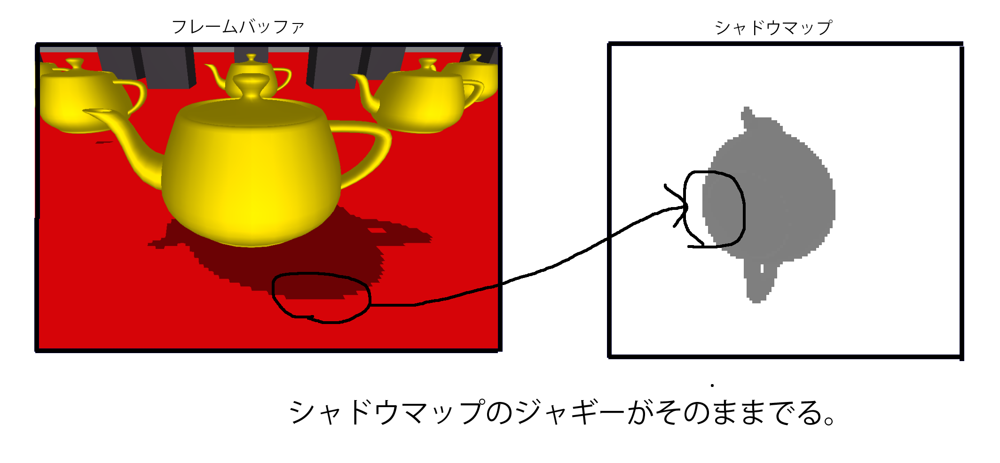
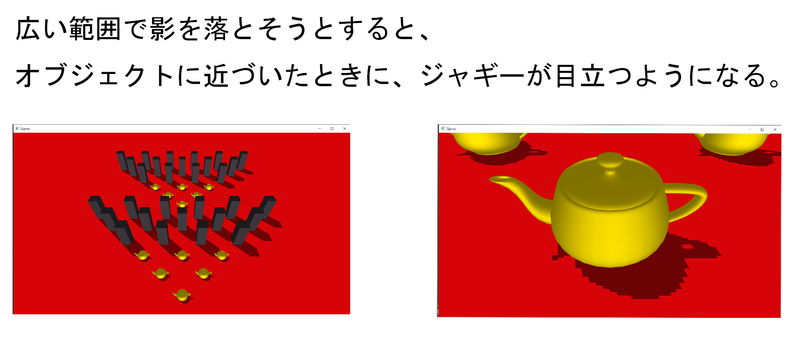
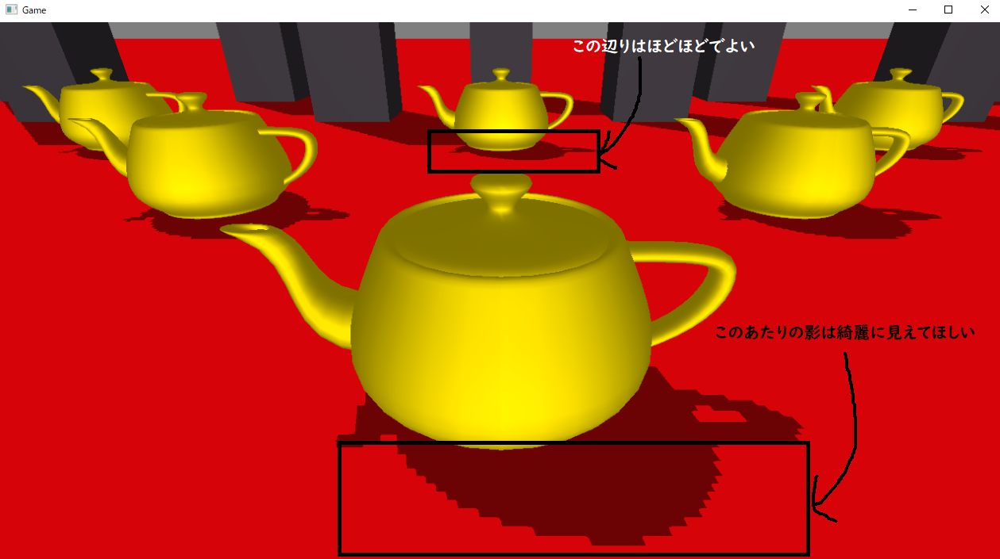
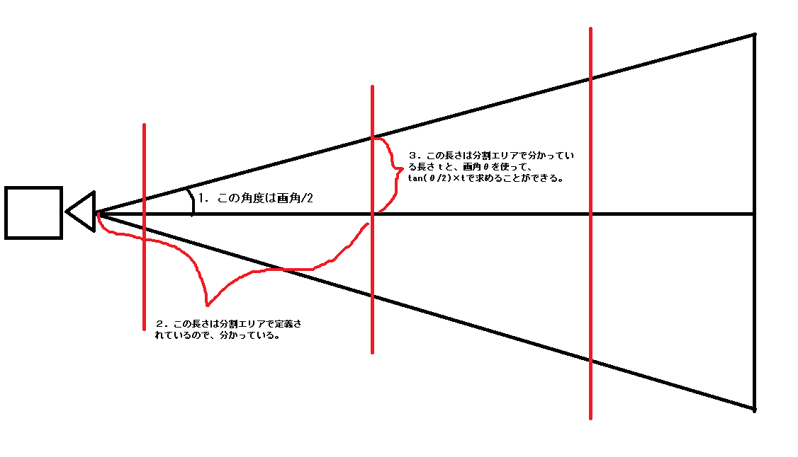
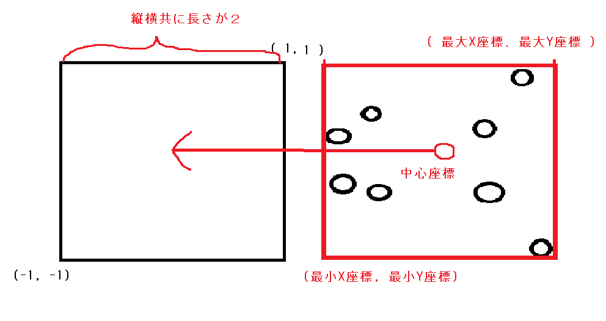

## 11.5 カスケードシャドウ
シャドウイングの最後の内容として、カスケードシャドウ法について解説します。現在のハイエンドゲームの影生成技法はカスケードシャドウ＋ソフトシャドウという手法がディファクトスタンダードとなっています。

## 11.5.1 ジャギーとの戦い
ここまで、シャドウマップ法をベースとしたアルゴリズムはいくつか見てきました。シャドウマップ法のアルゴリズムの進化は影のジャギーとの戦いの歴史です。シャドウマップ法は、シャドウマップと影の投影面の解像度の違いでジャギーが発生するという問題があります(図11.25)。</br>
**図11.25**</br>
</img></br>
シャドウマップ法はシャドウマップに描き込まれたオブジェクトの影しか落とすことができないため、広範囲に影を落とそうとすると、どうしても解像度が足りなくなり、ジャギーが発生してしまいます(図11.26)。</br>

**図11.26**</br>
</img></br>

ジャギーはソフトシャドウをかけることによって軽減することはできるのですが、そもそもシャドウマップに書き込まれている情報が不足しているため、ソフトシャドウをかけたとしても品質の低い影表現となってしまいます(図11.27)。</br>
**図11.27**</br>
</img></br>
この解像度による品質劣化を改善するために、Perspective Shadow Map(PSM)、Light Scpace Perspective Shadow Map(LSPSM)など様々なアルゴリズムが開発されてきました。しかし、それらの多くのアルゴリズムは、特定の条件下で品質が劣化し、通常のシャドウマップ技法と変わらなくなるという問題点を抱えていました。カスケードシャドウマップもその流れで開発されたアルゴリズムなのですが、その他の影生成アルゴリズムと比べて、実装難易度、扱いやすさ、品質のバランスが高く、現在の影生成技法のデファクトスタンダードになっている手法です。

## 11.5.2 どこの影が一番きれいに見えてほしい？
カスケードシャドウ法について考える前に、一旦ゲームのユーザー視点に戻って考えてみましょう。あなたがゲームを遊んでいて一番影が綺麗に見えてほしい箇所はどこでしょうか？図11.28を見てみて下さい。恐らく最も影が綺麗に見えてほしいのは、カメラから近い場所。画面上アップになっている場所だと思います。一方、画面から離れている場所については、そもそも画面に移っている範囲が小さいため、多少影が汚くても分かりません。</br>
**図11.28**</br>
</img></br>
PSM、LSPSM、そしてカスケードシャドウもこの観点から影の品質を向上を行うアルゴリズムで、画面に近いエリアほど影を綺麗に描画して、画面から遠いエリアの影はほどほどで描画するという手法になります。PSMやLSPSMはこの問題を一枚のシャドウマップで解決しようとするアルゴリズムですが、カスケードシャドウマップは複数枚のシャドウマップを利用することでこの問題の解決を行います。

## 11.5.3 複数枚のシャドウマップ
カスケードシャドウマップは複数枚のシャドウマップを利用することで影の品質を向上させます。PSMやLSPSMは一枚のシャドウマップを使って、線形代数的な工夫を行って品質向上を行うのですが、それらに比べると、いささか力技で強引な解決法のように感じるかもしれません。ですが、非常にシンプルな考え方で高品質な影を実装できるため、非常にバランスの良い影生成手法だと言えます。カスケードシャドウマップは近距離描画用のシャドウマップ、中距離描画用のシャドウマップ、遠距離描画用のシャドウマップというように、カメラからの距離に応じて使用するシャドウマップを変更します。そして、近距離の描画ほど、高い解像度で狭いエリアを描画します。</br>
**図11.29**</br>
<!-- ネットから拾ってきた画像を加工しています。-->
</img></br>

## 11.5.4 アルゴリズムの流れ
では、カスケードシャドウのアルゴリズムの流れについて見ていきましょう。
1. 分割エリアを定義する
2. 分割エリアを描画するためのライトビュープロジェクション行列を計算する。
3. 複数枚のシャドウマップにシャドウキャスターモデルを描画する。
4. 複数枚のシャドウマップを利用してシャドウレシーバーを描画する。

では、各ステップ詳細に見ていきましょう。
### 11.5.4.1 分割エリアを定義する
分割エリアの定義とは、カメラからどこまでの距離を近距離、中距離、遠距離とするかを定義するものです。この分割エリアを適切に計算するためのアルゴリズムなどもあるのですが、今回は、分割エリアは単なる配列の固定値で定義しています。次の疑似コードを見てください。
```cpp
float splitAreaTbl[] = {
	500.0f,		//近距離
	2000.0f,	//中距離
	5000.0f		//遠距離
};
```
このテーブルは、カメラから距離500以内を近距離、500～2000を中距離、2000～5000を遠距離と定義しています。このデータを使って、2番のライトビュープロジェクション行列を計算します。
<note>
今回はカスケードシャドウマップのアルゴリズムに焦点をあてるため、分割距離の定義はシンプルなものにしています。webに無料で公開されている、GPU Gems3などに分割距離の計算のアルゴリズムのParallel-Split ShadowMapsなどが公開されていますので、興味がある方は参照してみて下さい。</br>
https://developer.nvidia.com/gpugems/gpugems3/part-ii-light-and-shadows/chapter-10-parallel-split-shadow-maps-programmable-gpus
</note>

### 11.5.4.2 分割エリアを描画するためのライトビュープロジェクション行列を計算する。
続いて、分割エリアを描画するためのライトビュープロジェクション行列の計算です。カスケードシャドウでは、ここが一番難しい話になるかと思います。カスケードシャドウ技法では、分割エリアの定義に従って、各距離のオブジェクトを適切なシャドウマップに必ず描画する必要があります。そのため、各エリアのオブジェクトを正しくシャドウマップに描画するためのライトビュープロジェクション行列を計算する必要があります。行列の計算手順は次のようになります。
1. 通常のデプスシャドウマップ技法用のライトビュープロジェクション行列を作成する。
2. 分割エリアの定義にしたがって、各エリアを内容する視錐台の8頂点を求める。
3. 2で求めた各エリアの8頂点をライトビュープロジェクション空間に変換する。
4. 3で求めた8頂点の最大値と最小値を利用して、ライトビュープロジェクション空間に収めるためのクロップ行列を計算する。
5. ライトビュープロジェクション行列とクロップ行列を乗算して最終的な行列を求める。

では、各ステップ詳細に見ていきましょう。
#### 1. 通常のデプスシャドウマップ技法用のライトビュープロジェクション行列を作成する。
これは特別な説明は不要かと思います。通常のデプスシャドウマップと同じです。ライトをカメラと見立てて、ライトビュープロジェクション行列を求めてください。なお、今回のサンプルではプロジェクション行列に平行投影行列を利用しています。平行投影行列を利用すると、遠近感がない絵を描画することができます。遠近感がないということは、光源から近くだろうが、遠くだろうが大きさが変わらないということです。例えば、地球上でジャンプして太陽との距離が多少変わったところで影の大きさは変わりません。ですので、太陽などで生じる影は平行投影行列を利用するのが良いでしょう。

#### 2.分割エリアの定義に従って、各エリアを内包する視錐台の8頂点を求める。
続いて、分割エリアの定義に従って、各エリアを内包する8頂点を求めます。図11.30を見てください。</br>
**図11.30**</br>
<!-- ネットから拾ってきた画像を加工しています。-->
</img></br>
図11.30に〇でマークしている頂点を求めます。各エリアで8頂点なので、近、中、遠なら3×8の24頂点を求めます（実際には、重複する頂点があるので、16頂点求めればOKです)。この頂点は、カメラの各種情報(位置、画角、前方方向、アスペクト比、カメラの上方向)が分かっていれば、簡単な三角比を利用することで求めることができます。図11.31を見てください。

**図11.31**</br>
</img></br>
図11.31は視錐台を横から見ている図です。この図に記載されている3番目の辺の長さを求めることができたら、8頂点を求めることができます。図にも記載していますが、この辺の長さは、画角と分割エリアの範囲が分かっていれば、tan関数を利用することで求めることができます。リスト11.43は近影エリアを内包する８頂点を求めるために、カメラの各種情報と、距離テーブルを定義している疑似コードです。

[リスト11.43 疑似コード]
```cpp
//シャドウマップを分割する距離テーブル。
float cascadeAreaTbl[NUM_SHADOW_MAP] = {
	500,					//近影を映す最大深度値。
	2000,					//中影を映す最大深度値。
	g_camera3D->GetFar(),	//遠影を映す最大深度値。
};
//nearDepthはエリアの最小深度値を表す。
//近影エリア最小深度値はカメラのニーアクリップ。
float nearDepth = g_camera3D->GetNear();
//近影エリアの最大深度値を距離テーブルから引っ張ってくる。
float farDepth = cascadeAreaTbl[0];

////////////////////////////////////////////////////////////////
// ここから下のカメラ関係のパラメータは、
// 本書が提供しているMiniEngineのCameraクラスで計算済みのものを利用している。
////////////////////////////////////////////////////////////////
//視点
Vector3 cameraPos = g_camera3D->GetPosition();
//カメラの前方向
Vector3 cameraForward = g_camera3D->GetForward();
//カメラの右方向
Vector3 cameraRight = g_camera3D->GetRight();
//カメラの上方向は前方方向と右方向の外積で求められる。
Vector3 cameraUp;
cameraUp.Cross( camera);
//画角
float viewAngle = g_camera3D->GetViewAngle();
//アスペクト比
float accpect = g_camera3D->GetAspect();

```
続いて、リスト11.44のコードは近影エリアの最小深度の4頂点を求める疑似コードです。ここで三角比を利用して、4頂点を求めています。このプログラムで求めているものを図11.32で示しますので、そちらも参照してみてください。</br>

[リスト11.44 疑似コード]
```cpp
Vector3 vertex[8];
//１.最小深度の平面の中心座標を求める。
Vector3 nearClipCneterPos = cameraPos + forward * nearDepth;

//２．近影エリアの最小深度の上面までの長さを変数yに求める。
float y = tanf(viewAngle*0.5f) * nearDepth;
//３．右面までの長さを変数xに求める。
//アスペクト比は縦の長さに対しての横の長さの比率なので
//縦の長さに乗算してやれば求まる。
float x = y * asspect;

//４．４頂点を求める。
vertex[0] = nearClipCneterPos + cameraUp *  y + cameraRight *  x;
vertex[1] = nearClipCneterPos + cameraUp *  y + cameraRight * -x;
vertex[2] = nearClipCneterPos + cameraUp * -y + cameraRight *  x;
vertex[3] = nearClipCneterPos + cameraUp * -y + cameraRight * -x;
```
**図11.32**</br>
</img></br>

続いて、リスト11.45に近影エリアの最深深度の4頂点を求める疑似コードを示します。この疑似コードは最小深度の4頂点を求める考え方と全く同じです。</br>
[リスト11.45 疑似コード]
```cpp
//１.最大深度の平面の中心座標を求める。
Vector3 farClipCneterPos = cameraPos + forward * farDepth;

//２．近影エリアの最大深度の上面までの長さを変数yに求める。
y = tanf(viewAngle*0.5f) * farDepth;
//３．右面までの長さを変数xに求める。
//アスペクト比は縦の長さに対しての横の長さの比率なので
//縦の長さに乗算してやれば求まる。
x = y * asspect;

//４．４頂点を求める。
vertex[4] = farClipCneterPos + cameraUp *  y + cameraRight *  x;
vertex[5] = farClipCneterPos + cameraUp *  y + cameraRight * -x;
vertex[6] = farClipCneterPos + cameraUp * -y + cameraRight *  x;
vertex[7] = farClipCneterPos + cameraUp * -y + cameraRight * -x;
```

#### 2で求めた各エリアの8頂点をライトビュープロジェクション空間に変換する。
続いて、2で求めた8頂点をライトビュープロジェクション空間に変換します(リスト11.46)。</br>[リスト11.45 疑似コード]
```cpp
//エリアを内包する視錐台の8頂点をライトビュープロジェクション空間に変換する
for (int i = 0; i < 8; i++) {
	lvpMatrix.Apply(vertex[i]);
}
```

#### 3で求めた8頂点の最大値と最小値を利用して、ライトビュープロジェクション空間に収めるためのクロップ行列を計算する。
さて、ここからが各エリアを分割エリアの定義に従って、各距離のオブジェクトを適切なシャドウマップに必ず描画するためのトリックになります。今定義されているライトビュープロジェクション行列はライトを適当な場所に設置しているため、どこのエリアを写すかは分かりません。これを補正するための行列がクロップ行列です。各エリアごとのクロップ行列を計算して、その行列をライトビュープロジェクション行列に乗算することで、該当エリアのオブジェクトをすべてシャドウマップに描画することができるようになります。</br>
では、２で求めたライトビュープロジェクション空間の視錐台の8頂点について考えていきましょう。シャドウマップに全てのオブジェクトを描画するということは、変換された視錐台の8頂点が正規化スクリーン座標系の-1～1の範囲に収まっていれば良いことになります。しかし、今はライトの位置が適当な位置になっているため、変換後の8頂点は-1～1の範囲に綺麗には収まってはいないでしょう。もちろん奇跡的に収まっていることもあるかもしれませんが、その場合、その他のエリアがはみ出しているはずです。そこで視錐台の8頂点を-1～1の範囲に収めるための行列、クロップ行列を求めます。そしてこの行列をライトビュープロジェクション行列に乗算します。そうすると、この行列で座標変換されたオブジェクトの頂点座標は、ライトビュープロジェクション空間にちょうど収まるように補正されることになるので、必ず画面に収まるようになります。では、クロップ行列とは一体何のか？これはそれほど難しい行列ではなく、単なる拡大行列 × 平行移動行列です。図11.33を見てください。これは、あるエリアの8頂点をライトビュースクリーン空間に座標変換したものです。全て、-1～1の範囲から外れています。</br>
**図11.33**</br>
</img></br>

この８頂点を画面に収める��め��は��まず８頂点の最大値と最小値を求めて、8頂点を内包するAABBをまず求めます(図11.34)。</br>
**図11.34**</br>
</img></br>
８頂点の最大値と最小値を求めることができたら、このAABBが正規化スクリーン座標系にピッタリフィットするような拡大率を求めます。個の拡大率は正規化スクリーン座標系の幅と高さの長さが2なので、次のようなプログラムで求めることができます。</br>

```cpp
float xScale = 2.0f / (vMax.x - vMin.x);
float yScale = 2.0f / (vMax.y - vMin.y);
```
このプログラムで求めているものを図11.35で示します。</br>
**図11.35**</br>
</img></br>

拡大率を求めることができたら、最後は座標を-1～1の範囲に収まるようにずらします。これは、拡大した最大値、最小値を利用して、AABBの中心座標を求めて、その分平行移動してやることで求めることができます。この平行移動を求めるプログラムを次に示します。</br>
```cpp
float xOffset = (vMax.x + vMin.x) * -0.5f * xScale;
float yOffset = (vMax.y + vMin.y) * -0.5f * yScale;
```
このプログラムで求めているものを図11.36で示します。</br>
**図11.36**</br>
</img></br>
これで8頂点を内包するAABBをシャドウマップにぴったりと収めるための拡大率と平行移動量が求まりました。後はこれらを利用して、クロップ行列を作成計算します。

```cpp
//クロップ行列を求める。
Matrix clopMatrix;
clopMatrix.m[0][0] = xScale;
clopMatrix.m[1][1] = yScale;
clopMatrix.m[3][0] = xOffset;
clopMatrix.m[3][1] = yOffset;

```

#### ライトビュープロジェクション行列とクロップ行列を乗算して最終的な行列を求める。
では、いよいよ最後です。最後は先ほど求めたクロップ行列をライトビュープロジェクション行列に乗算するだけです。これで、後は普通のデプスシャドウマップと同じように、作成した行列を使って、座標変換して、シャドウマップに描画、シャドウレシーバーに影を落としていくだけです。</br>

```cpp
//ライトビュープロジェクション行列にクロップ行列を乗算する。
lvpMatrix = lvpMatrix * clopMatrix;
```

## 11.5.5【ハンズオン】カスケードシャドウマップを実装しよう
では、`Smaple_11_06/Sample_11_06.sln`を開いて、カスケードシャドウマップを実装していきましょう。
### step-1 シャドウマップの枚数を定数で定義する。
まずはシャドウマップの枚数の定数を定義しましょう。main.cppの37行目にリスト11.46のプログラムを入力してください。</br>
[リスト11.46 main.cpp]
```cpp
//step-1 シャドウマップの枚数を定数で定義する。
const int NUM_SHADOW_MAP = 3;
```
### step-2 ライトビュープロジェクションクロップ行列の配列を定義する。
続いて、ライトビュープロジェクションクロップ行列の配列を定義します。近、中、遠の３エリアをシャドウマップに描画する必要があるので、行列も３つ必要です。では、main.cppにリスト11.47のプログラムを入力してください。</br>
[リスト11.47 main.cpp]
```cpp
//step-2 ライトビュープロジェクションクロップ行列の配列を定義する。
Matrix lvpcMatrix[NUM_SHADOW_MAP];
```

### step-3 シャドウマップを書き込むレンダリングターゲットを３枚用意する。
step-3では、シャドウマップを書き込むためのレンダリングターゲットを３枚用意します。遠景のシャドウマップになるほど、解像度が小さくなっていっていることに注目してリスト11.48のプログラムをmain.cppに入力してください。</br>
[リスト11.48 main.cpp]
```cpp
//step-3 シャドウマップを書き込むレンダリングターゲットを３枚用意する。
RenderTarget shadowMaps[NUM_SHADOW_MAP];
//近影用のシャドウマップ。
shadowMaps[0].Create(
	2048, 
	2048, 
	1, 
	1, 
	DXGI_FORMAT_R32_FLOAT,
	DXGI_FORMAT_D32_FLOAT,
	clearColor
);
//中影用のシャドウマップ。
shadowMaps[1].Create(
	1024,
	1024,
	1,
	1,
	DXGI_FORMAT_R32_FLOAT,
	DXGI_FORMAT_D32_FLOAT,
	clearColor
);
//遠影用のシャドウマップ。
shadowMaps[2].Create(
	512,
	512,
	1,
	1,
	DXGI_FORMAT_R32_FLOAT,
	DXGI_FORMAT_D32_FLOAT,
	clearColor
);
```

### step-4 分割エリアの最大深度値を定義する。
続いて、分割エリアの最大深度テーブルを定義しましょう。今回は一番最後の最大深度値はカメラのFarクリップにしています。こうすることで、カメラに映る範囲すべてのオブジェクトの影を落とすことができるようになります。では、main.cppにリスト11.49のプログラムを入力してください。</br>
[リスト11.49 main.cpp]
```cpp
//step-4 分割エリアの最大深度値を定義する。
float cascadeAreaTbl[NUM_SHADOW_MAP] = {
	500,					//近影を映す最大深度値。
	2000,					//中影を映す最大深度値。
	g_camera3D->GetFar(),	//遠影を映す最大深度値。３枚目の最大深度はカメラのFarクリップ。
};
```

### step-5 影を受ける背景モデルを初期化。
続いて、影を受ける背景モデルを初期化します。シャドウレシーバーモデルは３枚のシャドウマップと、３つのライトビュープロジェクションクロップ行列を利用して、影を落とします。拡張SRVにテクスチャを３つ、拡張定数バッファにライトビュープロジェクションクロップ行列の配列を設定している点に注目して、リスト11.50のプログラムを入力してください。</br>
[リスト11.50 main.cpp]
```cpp
//step-5 影を受ける背景モデルを初期化。
ModelInitData bgModelInitData;
//シャドウレシーバー(影が落とされるモデル)用のシェーダーを指定する。
bgModelInitData.m_fxFilePath = "Assets/shader/sampleShadowReciever.fx";
//【注目】シャドウマップを拡張SRVに設定する。
bgModelInitData.m_expandShaderResoruceView[0] = &shadowMaps[0].GetRenderTargetTexture();
bgModelInitData.m_expandShaderResoruceView[1] = &shadowMaps[1].GetRenderTargetTexture();
bgModelInitData.m_expandShaderResoruceView[2] = &shadowMaps[2].GetRenderTargetTexture();
//【注目】ライトビュープロジェクションクロップ行列を拡張定数バッファに設定する。
bgModelInitData.m_expandConstantBuffer = (void*)lvpcMatrix;
bgModelInitData.m_expandConstantBufferSize = sizeof(lvpcMatrix);
bgModelInitData.m_tkmFilePath = "Assets/modelData/bg/bg.tkm";

Model bgModel;
bgModel.Init(bgModelInitData);
```
### step-6 カメラの前方向、右方向、上方向を求める。
ここからはゲームループの処理です。まずはライトビュープロジェクションクロップ行列を計算するために必要な、カメラの各種情報を計算します。リスト11.51のプログラムを入力してください。</br>
[リスト11.51 main.cpp]
```cpp
//step-6 カメラの前方向、右方向、上方向を求める。
//前方向と右方向はすでに計算済みなので、それを引っ張ってくる。
const auto& cameraForward = g_camera3D->GetForward();
const auto& cameraRight = g_camera3D->GetRight();
//カメラの上方向は前方向と右方向の外積で求める。
Vector3 cameraUp;
cameraUp.Cross( cameraForward, cameraRight );
```

### step-7 エリアを内包する視錐台の８頂点を求める。
step-7からは３枚のカスケードシャドウへの描画のループ内の処理です。step-7～step-11までのプログラムは、３枚のシャドウマップに対して行う処理になるため、計３回実行されます。では、まずは描画しようとしているエリアの８頂点を求めるプログラムを入力しましょう。これは11.5.4.2で勉強した、カメラの画角と三角比を使って求める処理です。では、リスト11.52のプログラムをmain.cppに入力してください。
[リスト11.52 main.cpp]
```cpp
//step-7 エリアを内包する視錐台の８頂点を求める。
//エリアの近平面の中心からの上面、下面までの距離を求める。
float nearY = tanf(g_camera3D->GetViewAngle() * 0.5f) * nearDepth;
//エリアの近平面の中心からの右面、左面までの距離を求める。
float nearX = nearY * g_camera3D->GetAspect();

//エリアの遠平面の中心からの上面、下面までの距離を求める。
float farY = tanf(g_camera3D->GetViewAngle()*0.5f) * cascadeAreaTbl[areaNo];
//エリアの遠平面の中心からの右面、左面までの距離を求める。
float farX = farY * g_camera3D->GetAspect();

//エリアの近平面の中心座標を求める。
Vector3 nearPos = g_camera3D->GetPosition() + cameraForward * nearDepth;
//エリアの遠平面の中心座標を求める。
Vector3 farPos = g_camera3D->GetPosition() + cameraForward * cascadeAreaTbl[areaNo];

//8頂点を求める。
Vector3 vertex[8];
//近平面の右上の頂点。
vertex[0] += nearPos + cameraUp *  nearY + cameraRight *  nearX;
//近平面の左上の頂点。
vertex[1] += nearPos + cameraUp *  nearY + cameraRight * -nearX;
//近平面の右下の頂点。
vertex[2] += nearPos + cameraUp * -nearY + cameraRight *  nearX;
//近平面の左下の頂点。
vertex[3] += nearPos + cameraUp * -nearY + cameraRight * -nearX;

//遠平面の右上の頂点。
vertex[4] += farPos + cameraUp *  farY + cameraRight *  farX;
//遠平面の左上の頂点。
vertex[5] += farPos + cameraUp *  farY + cameraRight * -farX;
//遠平面の右下の頂点。
vertex[6] += farPos + cameraUp * -farY + cameraRight *  farX;
//遠平面の左下の頂点。
vertex[7] += farPos + cameraUp * -farY + cameraRight * -farX;
```
### step-8 8頂点をライトビュープロジェクション空間に変換して、8頂点の最大値、最小値を求める。
8頂点を求めることができたら、ライトビュープロジェクション空間に変換して、ライトビュープロジェクション空間での最大値、最小値を求めます。main.cppにリスト11.53のプログラムを入力してください。</br>
[リスト11.53 main.cpp]
```cpp
//step-8 8頂点をライトビュープロジェクション空間に変換して、8頂点の最大値、最小値を求める。
Vector3 vMax, vMin;
vMax = { -FLT_MAX, -FLT_MAX, -FLT_MAX };
vMin = {  FLT_MAX,  FLT_MAX,  FLT_MAX };
for (auto& v : vertex) {
	lvpMatrix.Apply(v);
	vMax.Max(v);
	vMin.Min(v);
}
```
### step-9 クロップ行列を求める。
ライトビュープロジェクション空間での８頂点の最大値、最小値を求めることができたので、これらの頂点をライトビュープロジェクション空間の-1～1の範囲に収めるためのクロップ行列を計算します。リスト11.54のプログラムを入力してください。</br>
[リスト11.54 main.cpp]
```cpp
//step-9 クロップ行列を求める。
float xScale = 2.0f / (vMax.x - vMin.x);
float yScale = 2.0f / (vMax.y - vMin.y);
float xOffset = (vMax.x + vMin.x) * -0.5f * xScale;
float yOffset = (vMax.y + vMin.y) * -0.5f * yScale;
Matrix clopMatrix;
clopMatrix.m[0][0] = xScale;
clopMatrix.m[1][1] = yScale;
clopMatrix.m[3][0] = xOffset;
clopMatrix.m[3][1] = yOffset;
```

### step-10 ライトビュープロジェクション行列にクロップ行列を乗算する。
クロップ行列を求めることができたので、ライトビュープロジェクション行列にクロップ行列を乗算した行列を求めます。この行列がシャドウマップにオブジェクトを描画するときと、シャドウレシーバーに影を落とすときに使われる行列です。では、リスト11.55のプログラムを入力してください。</br>
[リスト11.55 main.cpp]
```cpp
//step-10 ライトビュープロジェクション行列にクロップ行列を乗算する。
lvpcMatrix[areaNo] = lvpMatrix * clopMatrix;
```
### step-11 シャドウマップにレンダリング。
ライトビュープロジェクションクロップ行列を計算することができたので、シャドウマップに影を落とすオブジェクトを描画していきましょう。リスト11.56のプログラムを入力してください。</br>
[リスト11.56 main.cpp]
```cpp
//step-11 シャドウマップにレンダリング。
//レンダリングターゲットをシャドウマップに変更する。
renderContext.WaitUntilToPossibleSetRenderTarget(shadowMaps[areaNo]);
renderContext.SetRenderTargetAndViewport(shadowMaps[areaNo]);
renderContext.ClearRenderTargetView(shadowMaps[areaNo]);

//影モデルを描画。
testShadowModel[areaNo].Draw(renderContext, g_matIdentity, lvpcMatrix[areaNo]);

//書き込み完了待ち。
renderContext.WaitUntilFinishDrawingToRenderTarget(shadowMaps[areaNo]);
```

### step-12 ライトビュープロジェクションクロップ行列にアクセスするための定数バッファを定義。
step12からはシェーダー側の実装になります。カスケードシャドウでは、シャドウマップを作成する処理に特別な処理はないので、sampleDrawShadowMap.fxは改造せずに、影を落とす処理が記述されているsampleShadowReciever.fxのみ改造していきます。まずは、ライトビュープロジェクションクロップ行列にアクセスするための定数バッファを定義しましょう。Asset/shader/sampleShadowReciever.fxの11行目にリスト11.57のプログラムを入力してください。</br>
[リスト11.57　sampleShadowReciever.fx]
```cpp
//step-12 ライトビュープロジェクションクロップ行列にアクセスするための定数バッファを定義。
cbuffer ShadowParamCb : register(b1){
	float4x4 mLVPC[3];		//ライトビュープロジェクションクロップ行列。
};
```
### step-13 ライトビュースクリーン空間での座標を追加。
今回の実装では、エリアが３つあるので、３つのライトビュースクリーン空間の座標を計算して、ピクセルシェーダーに渡す必要があります。リスト11.58のプログラムを入力して、ピクセルシェーダーへの入力データを追加してください。</br>
[リスト11.58 sampleShadowReciever.fx]
```cpp
//step-13 ライトビュースクリーン空間での座標を追加。
float4 posInLVP[3]	: TEXCOORD1;	//ライトビュースクリーン空間でのピクセルの座標

```
### step-14 近～中距離のシャドウマップにアクセスするための変数を定義。
続いて、各エリアのシャドウマップにアクセスする��めの変数を定義します。リスト11.59のプログラムを入力してください。</br>
[リスト11.59 sampleShadowReciever.fx]
```cpp
//step-14 近～中距離のシャドウマップにアクセスするための変数を定義。
Texture2D<float4> g_shadowMap_0 : register(t10);	//近距離のシャドウマップ。
Texture2D<float4> g_shadowMap_1 : register(t11);	//中距離のシャドウマップ。
Texture2D<float4> g_shadowMap_2 : register(t12);	//遠距離のシャドウマップ。

```
### step-15 ライトビュースクリーン空間の座標を計算する。
では、頂点シェーダーを改造します。頂点シェーダーでは３つのライトビュープロジェクションクロップ行列を利用して、座標返還を行います。リスト11.60のプログラムを入力してください。</br>
[リスト11.60 sampleShadowReciever.fx]
```cpp
//step-15 ライトビュースクリーン空間の座標を計算する。
psIn.posInLVP[0] = mul( mLVPC[0], worldPos);
psIn.posInLVP[1] = mul( mLVPC[1], worldPos);
psIn.posInLVP[2] = mul( mLVPC[2], worldPos);
```
### step-16 ３枚のシャドウマップを使って、シャドウレシーバーに影を落とす。
では、いよいよ最後です。３枚のシャドウマップを使って、影を落とすプログラムをピクセルシェーダーに実装しましょう。やっていることは単一のシャドウマップでやっていたことを、３枚分行っているだけです。では、リスト11.61のプログラムを入力してください。</br>
[リスト11.61 sampleShadowReciever.fx]
```cpp
//step-16 ３枚のシャドウマップを使って、シャドウレシーバーに影を落とす。
for( int cascadeIndex = 0; cascadeIndex < 3; cascadeIndex++){		
	//ライトビュースクリーン空間でのZ値を計算する。
	float zInLVP = psIn.posInLVP[cascadeIndex].z  / psIn.posInLVP[cascadeIndex].w;
	if( zInLVP >= 0.0f && zInLVP <= 1.0f ){
		//Zの値を見て、このピクセルがこのシャドウマップに含まれているか判定。
		float2 shadowMapUV = psIn.posInLVP[cascadeIndex].xy / psIn.posInLVP[cascadeIndex].w;
		shadowMapUV *= float2( 0.5f, -0.5f);
		shadowMapUV += 0.5f; 
		//シャドウマップUVが範囲内か判定。
		if( shadowMapUV.x >= 0.0f && shadowMapUV.x <= 1.0f
			&& shadowMapUV.y >= 0.0f && shadowMapUV.y <= 1.0f ){ 
			//シャドウマップから値をサンプリング。
			float2 shadowValue = shadowMapArray[cascadeIndex].Sample(g_sampler, shadowMapUV).xy;;
			//まずこのピクセルが遮蔽されているか調べる。
			if( zInLVP >= shadowValue.r){
				color.xyz *= 0.5f;
				//影を落とせたので終了。
				break;
			}		
		}

	} 
}
```
ここまで入力出来たら実行して、コントローラーの右スティックと左スティックを操作して、カメラを動かしてみてください。近景の影は綺麗に落ちており、遠景に行っても影が落ちているかと思います(図11.37)。注意深く影を見てみると、シャドウマップの切り替わりが分かるかと思います。</br>
**図11.37**</br>
</img></br>
