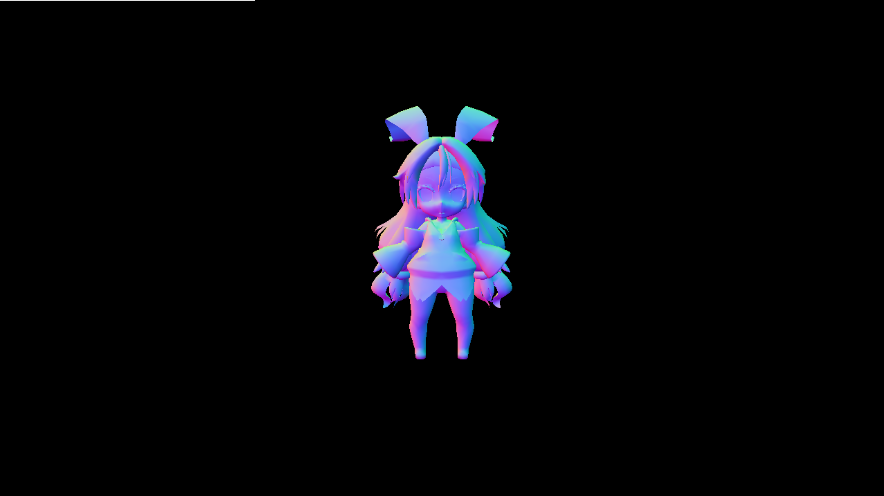

## はじめに
このチャプターでは、次のサンプルプログラムを利用します。ダウンロードをしてください。</br>
**[Sample_12_01.zip](https://drive.google.com/file/d/1TLYYLNm-dgoXPRU18RkZaCo415j-CBlT/view?usp=sharing)**</br>

# Chapter 12 ディファードレンダリング
&emsp;このチャプターでは現在主流になってきているディファードレンダリングについてみていきます。
## 12.1 フォワードレンダリング
&emsp;ディファードレンダリングを見ていく前に、まずは、3Dゲームの黎明期から進化してきたレンダリング手法のフォワードレンダリングについて見ていきましょう。フォワードレンダリングを端的に説明すると、**「ポリゴンをレンダリングする時にライティングの計算を行う」**というものです。モデルのDrawを行うと頂点シェーダー、ピクセルシェーダーが実行されてピクセルカラーが決まります。このタイミングでライティングを行うのがフォワードレンダリングです。これまで皆さんが実装してきたものは全てフォワードレンダリングとなります。
## 12.2 ディファードレンダリング
&emsp;ディファードレンダリングはxbox360、PlayStation3のころに生まれたレンダリング手法で、比較的新しい手法となっています。特にPlayStation3はこの手法が向いているアーキテクチャだったため、ディファードレンダリングが採用されているゲームがいくつかありました。ディファードレンダリングを端的に説明すると「ポリゴンをレンダリングする時にはライティングの計算は行わずに後で行う。」というものです。Deferredは遅延という意味なので、遅延レンダリングとも呼ばれます。フォワード系に慣れ親しんでいるとピンと来ないかもしれません。ライティングの計算をポストエフェクト的に行うと言った方が理解しやすいかもしれませんね。

### 12.2.1 G-Buffer
&emsp;ではディファードレンダリングで使用されるG-Bufferについてみていきましょう。ディファードレンダリングではポリゴンをレンダリングする時にはライティングの計算は行わずにMRT(MultiRenderingTarget)を活用して、複数枚のテクスチャ(G-Bufferと呼ばれる)にテクスチャカラー、法線情報、スペキュラ強度、深度値などを書き込みます。図12.1はPlayStation3のKillzone2のG-Bufferの内容です</br>

**図12.1**</br>
</img></br>
&emsp;フォワードレンダリングでは「モデルを描画する=ライティングを行ってレンダリングターゲットに書き込む」だったのですが、ディファードレンダリング「モデルを描画する=ライティングに必要な情報をG-Bufferに書き込む。」というものになります。そして、G-Bufferを使用してポストエフェクト的にライティングの計算を行って、最終画象をレンダリングターゲットに書き込みます。

## 12.3 ディファードレンダリングのメリット
&emsp;なぜ、PlayStation3やXbox360のころからディファードレンダリングを採用しているゲームが増えてきたのでしょうか？当然増えてきたのには何か理由があります。この節ではその理由についてみていきましょう。
&emsp;PlayStation3、Xbox360が登場したことによって、家庭用ゲーム機の世界にもプログラマブルシェーダーの波が押し寄せました。映像を少しでもいいものに、ほかのゲームと違うグラフィック表現などなど、いろいろな工夫が凝らされるようになった結果、1ピクセル当たりの計算量がどんどん増えていきました。例えばPlayStation3が発売されたばかりのころの１ピクセルのプログラムは次のようなものだったと思ってください。</br>

```cpp
/*!
 *@brief	ピクセルシェーダー。
 */
float4 PSMain( VS_OUTPUT In ) : COLOR
{
	//ライトを計算。
	float4 lig = 0.0f;
	float3 normal = normalize(In.normal);
	lig.xyz = CalcDiffuse( In.normal );
	lig.xyz += CalcSpecular( In.worldPos, normal );	
	lig += g_ambientLight;
	float4 color = tex2D( g_diffuseTextureSampler, In.uv );
	color.xyz *= lig;
	return color;
}
```
これが時とともにもっと良いものを求めていった結果複雑化していき、次のようなコードになっていきました。</br>

```cpp
/*!
 * @brief	ピクセルシェーダー。
 */
PSOutput PSMain( VS_OUTPUT In )
{
	float4 color = 0.0f;
	float4 diffuseColor = tex2D(g_diffuseTextureSampler, In.Tex0);
	color = diffuseColor;
	float3 normal = normalize(In.Normal);
	if(g_flags.x){
		//法線マップあり。
		float3 tangent = normalize(In.Tangent);
		float3 binSpaceNormal = tex2D( g_normalMapSampler, In.Tex0);
		float4x4 tangentSpaceMatrix;
		float3 biNormal = normalize( cross( tangent, normal) );
		tangentSpaceMatrix[0] = float4( tangent, 0.0f);
		tangentSpaceMatrix[1] = float4( biNormal, 0.0f);
		tangentSpaceMatrix[2] = float4( normal, 0.0f);
		tangentSpaceMatrix[3] = float4( 0.0f, 0.0f, 0.0f, 1.0f );
		//-1.0～1.0の範囲にマッピングする。
		binSpaceNormal = (binSpaceNormal * 2.0f)- 1.0f;
		normal = tangentSpaceMatrix[0] * binSpaceNormal.x + tangentSpaceMatrix[1] * binSpaceNormal.y + tangentSpaceMatrix[2] * binSpaceNormal.z; 
		
	}
	float4 lig = DiffuseLight(normal);
	if(g_flags.z){
		//リムライト。
		lig.xyz += CalcLimLight(normal, g_light.limLightDir, g_light.limLightColor.xyz);
	}
	if(g_flags.w){
		//スペキュラライト。
		lig.xyz += SpecLight(normal, In.worldPos_depth.xyz, In.Tex0);
	}
	if(g_flags.y){
		//影
		lig *= CalcShadow(In.worldPos_depth.xyz);
	}
	//自己発光色
	lig.xyz += g_light.emission;
	color *= lig;
	//大気錯乱
	if(g_flags2.y == AtomosphereFuncObjectFromAtomosphere)
	{
		color = In.rayColor + color * In.mieColor;
	}
	//ポイントライト。
	color.xyz += diffuseColor.xyz * PointLight(normal, In.worldPos_depth.xyz, g_flags.z);
	//アンビエントライトを加算。
	color.xyz += diffuseColor.xyz * g_light.ambient.xyz;	
	if(g_fogParam.z > 1.9f){
		//高さフォグ
		float h = max(In.worldPos_depth.y - g_fogParam.y, 0.0f);
		float t = min(h / g_fogParam.x, 1.0f);
		color.xyz = lerp(float3(0.75f, 0.75f, 0.95f), color.xyz, t);
	}else if(g_fogParam.z > 0.0f){
		//距離フォグ
		float z = length(In.worldPos_depth.xyz - g_cameraPos);
		z = max(z - g_fogParam.x, 0.0f);
		float t = min( z / g_fogParam.y, 1.0f);
		color.xyz = lerp(color.xyz, float3(0.75f, 0.75f, 0.95f), t);
	}
	PSOutput psOut = (PSOutput)0;
	psOut.color = color;
	psOut.depth = In.worldPos_depth.w;
	if(g_flags2.x){
		psOut.velocity.xy = In.velocity.xy / In.velocity.w-In.screenPos.xy / In.screenPos.w;
		psOut.velocity.xy *= 0.5f;
		psOut.velocity.xy += 0.5f;
		psOut.velocity.zw = 0.0f;
	}else{
		//速度なし。
		psOut.velocity = 0.5f;
	}
	return psOut;
}
```
&emsp;これが１ピクセルに実行されるプログラムです。これによりピクセル単位のプログラムの処理時間が増大していきました。そこで、無駄なピクセルのプログラムは実行しないようにできないか？という考えから生まれてきたのがディファードレンダリングです。フォワードレンダリングは先にライティングを行うため、不要なピクセルのライティングが計算されてしまいます。例えば図12.2のように3Dモデルを画面の奥から手前の順番でレンダリングした場合のことを考えてみてください。</br>
**図12.2**</br>
</img></br>
&emsp;この図は顔のモデルを描画した後で、その手前に三角形の板ポリを描画している図です。これがフォワードレンダリングで行われた場合、三角形の板ポリに遮蔽された部分のライティングの計算が無駄になってしまいます。一方、ディファードレンダリングでは、モデル描画のパスではライティング計算は行わずに、G-Bufferの内容を使って、ポストエフェクト的にライティングの計算を行うため、無駄な計算は発生しません。例えば1920×1080の解像度であれば、どんな順番でモデルを描画したとしても1920×1080回のライティングの計算で完了することになります。

## 12.4 ディファードレンダリングのデメリット
&emsp;先ほどはディファードレンダリングのメリットを見ていきましたが、すべてのケースでフォワードレンダリングより優れているわけではありません。ではディファードレンダリングのデメリットについてみていきましょう。
### 12.4.1 メモリの速度と容量の問題
&emsp;ディファード系ではMRT(multiRenderingTarget)を活用するため、フォワード系に比べるとメモリ使用量が増大します。また、モデルの描画パスで複数のG-Bufferに対して書き込みを行うため、メモリの書き込み速度も問題になってきます。CPUやGPUの演算速度とメモリの読み書きの速度の差はどんどん大きくなってきています。そのため、アーキテクチャによってはディファード系の方が遅くなるというのは十分考えられます。実はディファード系がPlayStation3では増えていたが、Xbox360では増えなかったのはこれが理由です。メモリの速度とVRAMの容量がxbox360はPlayStation3より劣っていたため、ディファードに向きでした。

### 12.4.2 半透明描画の問題
&emsp;ディファード系は半透明オブジェクトの描画に弱いため、半透明のオブジェクトを描画する場合、不透明オブジェクトをディファードで描画した後でフォワードで半透明オブジェクトを描画するなどといった工夫が必要になります。そのため、半透明オブジェクトを多用する日本のゲームには向いていないといわれていました。</br>
&emsp;このようにいいことばかりではなく、ディファードの方が遅くなるケースは実はたくさんあります。最近ですとVRゲームは4K解像度の絵を右目用と左目用の２枚レンダリングを行う必要があり、ディファードでレンダリングを行うと4K解像度の複数枚のG-Bufferへの書き込みが発生してメモリ帯域を圧迫します。


## 12.5 【ハンズオン】ディファードレンダリング入門 ～ 拡散反射 ～
&emsp;では、ハンズオンでディファードレンダリングを実装してみましょう。Sample_12_01を立ち上げてください。
### step-1 	モデルを初期化。
&emsp;まず、レンダリングを行うモデルを用意します。シェーダーにmodel.fxを指定していますが、このシェーダーではライティングの計算は行っていません。このシェーダーの目的はアルベドカラーと法線をG-bufferに出力することです。</br>

[リスト 12.1 main.cpp]
```cpp
//step-1 モデルを用意。
ModelInitData modelInitData;
modelInitData.m_tkmFilePath = "Assets/modelData/unityChan.tkm";
modelInitData.m_fxFilePath = "Assets/shader/model.fx";
Model model;
model.Init(modelInitData);
```

### step-2 G-Bufferを作成
&emsp;アルベドカラーと法線を出力するためのG-Bufferを作成します。</br>
[リスト 12.2 main.cpp]
```cpp
//step-2 G-Bufferを作成。
RenderTarget albedRT;	//アルベドカラー書き込み用のレンダリングターゲット。
albedRT.Create(
	FRAME_BUFFER_W, FRAME_BUFFER_H, 
	1, 1, 
	DXGI_FORMAT_R8G8B8A8_UNORM, DXGI_FORMAT_D32_FLOAT);
RenderTarget normalRT;	//法線書き込み用のレンダリングターゲット。
normalRT.Create(
	FRAME_BUFFER_W, FRAME_BUFFER_H, 
	1, 1, DXGI_FORMAT_R8G8B8A8_UNORM, XGI_FORMAT_UNKNOWN);

```

### step-3 ポストエフェクト的にディファードライティングを行うためのスプライトを準備。
&emsp;続いて、ポストエフェクト的にライティングを行うので、画面全体にレンダリングされるスプライトを準備します。ここで指定しているsprite.fxでライティングの計算が行われます。

[リスト 12.3 main.cpp]
```cpp
//step-3 ポストエフェクト的にディファードライティングを行うためのスプライトを準備。
SpriteInitData spriteInitData;
//画面全体にレンダリングするので幅と高さはフレームバッファの幅と高さと同じ。
spriteInitData.m_width = FRAME_BUFFER_W;
spriteInitData.m_height = FRAME_BUFFER_H;
//使用するテクスチャはアルベドテクスチャと法線テクスチャ。
spriteInitData.m_textures[0] = &albedRT.GetRenderTargetTexture();
spriteInitData.m_textures[1] = &normalRT.GetRenderTargetTexture();
spriteInitData.m_fxFilePath = "Assets/shader/sprite.fx";
spriteInitData.m_expandConstantBuffer = &light;
spriteInitData.m_expandConstantBufferSize = sizeof(light);
//初期化データを使ってスプライトを作成。
Sprite defferdLightinSpr;
defferdLightinSpr.Init(spriteInitData);
```
&emsp;このスプライトの描画でモデルのドローで作成されるテクスチャが利用されます。

### step-4 レンダリングターゲットをG-Bufferに変更して書き込む。
&emsp;この箇所がフォワードレンダリングでのモデルのドローにあたる部分です。これまでここで直接フレームバッファ(画面)にレンダリングしていたのですが、ディファードではレンダリング先がG-Bufferになります。</br>
[リスト 12.4 main.cpp]
```cpp
//step-4 レンダリングターゲットをG-Bufferに変更して書き込む。
RenderTarget* rts[] = {
	&albedRT,
	&normalRT
};
//まず、レンダリングターゲットとして設定できるようになるまで待つ。
renderContext.WaitUntilToPossibleSetRenderTargets(2, rts);
//レンダリングターゲットを設定。
renderContext.SetRenderTargets(2, rts);
//レンダリングターゲットをクリア。
renderContext.ClearRenderTargetViews(2, rts);
model.Draw(renderContext);

//レンダリングターゲットへの書き込み待ち。
renderContext.WaitUntilFinishDrawingToRenderTargets(2, rts);
```
&emsp;このモデルのドローで図12.1と図12.2の２枚のテクスチャ(G-Buffer)が作成されます。この2枚のテクスチャを使用してstep-5でライティングの計算が行われます。</br>
**図12.1 アルベド**</br>
</img>

**図12.2 法線**</br>
</img></br>

### step-5 レンダリング先をフレームバッファに戻してスプライトをレンダリングする 
&emsp;G-Bufferの作成が終わったら、次はディファードライティングです。step-4で作成されたアルベドテクスチャと法線テクスチャを使ってライティングの計算が行われます。</br>
[リスト 12.5 main.cpp]
```cpp
//step-5 レンダリング先をフレームバッファに戻してスプライトをレンダリングする
g_graphicsEngine->ChangeRenderTargetToFrameBuffer(renderContext);
//G-Bufferの内容を元にしてスプライトをレンダリング。
defferdLightinSpr.Draw(renderContext);
```
&emsp;このスプライトのドローで、step-4で作成されたテクスチャを使用して、ライティングの計算がおこなれます。</br>
**図12.3 ディファードライティング**</br>
</img></br>

### step-6 G-Bufferに出力。
&emsp;続いて、シェーダー側��model.fxです。モデルシェーダーではライティングの計算のような複雑な計算は行われておらず、アルベドと法線をレンダリングターゲットに出力しているだけのシンプルなプログラムになっています。</br>
[リスト 12.6 model.fx]
```cpp
//step-6 G-Bufferに出力。
SPSOut psOut;
//アルベドカラーを出力。
psOut.albedo = g_texture.Sample(g_sampler, psIn.uv);
//法線を出力。
//出力は0～1に丸められてしまうのでマイナスの値が失われてしまう。
//なので-1～1を0～1に変換する。
//(-1 ～ 1) ÷ 2.0       = ( -0.5 ～ 0.5 )
//( -0.5 ～ 0.5) + 0.5  = (  0.0 ～ 1.0 )
psOut.normal = ( psIn.normal / 2.0f ) + 0.5f;
return psOut;
```

### step-7 G-Bufferの内容を使ってライティング。
&emsp;いよいよ最後です。sprite.fxでは作成されたG-Bufferの情報を元にライティングの計算を行います。ライティングの計算自体はフォワードレンダリングで行っているものと違いはありません。</br>
[リスト 12.6 sprite.fx]
```cpp
//step-7 G-Bufferの内容を使ってライティング。
float4 albedo = albedoTexture.Sample(Sampler, In.uv);
float3 normal = normalTexture.Sample(Sampler, In.uv).xyz;
normal = (normal * 2.0f)-1.0f;
//ライトを計算。
float3 lig = 0.0f;
float t = max( 0.0f, dot( normal, ligDirection) * -1.0f);
lig = ligColor * t;
float4 finalColor = albedo;
finalColor.xyz *= lig;
return finalColor;
```
&emsp;今回のハンズオンではライティングの計算もシンプルだったので、余り恩恵は受けませんが、この後のチャプターで勉強する物理ベースライティングでは、１ピクセル辺りのライティングの計算が更にヘビーになります。そのような重いシェーダーになってきたときはディファードレンダリングの恩恵が大きくなっていきます。


## 評価テスト
次の評価テストを行いなさい。</br>
[評価テストへジャンプ](https://docs.google.com/forms/d/e/1FAIpQLSfO7xyBUxawn7N3izgkY5hljnEXbwFFi0Br7z7IYlKl9xZiVA/viewform?usp=sf_link)
</br>