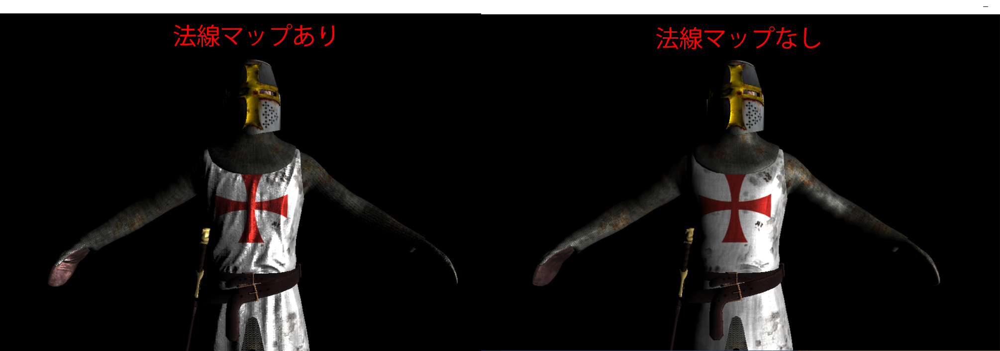

## はじめに
このチャプターでは、次のサンプルプログラムを利用します。ダウンロードをしてください。</br>
**[Sample_12_03.zip](https://drive.google.com/file/d/1Ct2sKoXrjy9Du0vaOpFN1qx2bVgNuZSz/view?usp=sharing)**</br>

## 12.8 【ハンズオン】ディファードレンダリング入門～法線マップ～
この節では、法線マップが貼られているモデルをディファードレンダリングでレンダリングする方法を見ていきましょう。しかし、これは何も難しい話ではありません。単にG-Bufferを作成するモデル描画パスで法線マップを使って法線を計算し、それをG-Bufferに出力するだけです。ですので、内容的には6.1.9の法線の計算のプログラムと全く同じです。では、Sample_12_03/Sample_12_03.slnを立ち上げて下さい。


### step-1 頂点シェーダーの入力に接ベクトルと従ベクトルを追加
今回のハンズオンも6.1.9の法線マップの実装と同じように、必要なデータはすべてシェーダーからアクセスできるようになっているため、cpp側を改造する必要はないので、シェーダー側の実装のみとなります。`Assets/shader/model.fx`を開いてください。まずは、頂点シェーダーの入力に接ベクトルと従ベクトルを追加します。リスト12.18のプログラムを入力してください。</br>
[リスト12.18 model.fx]
```cpp
// step-1 頂点シェーダーの入力に接ベクトルと従ベクトルを追加
float3 tangent : TANGENT;
float3 biNormal : BINORMAL;
```
### step-2 ピクセルシェーダーの入力に接ベクトルと従ベクトルを追加
続いて、ピクセルシェーダーの入力にも接ベクトルと従ベクトルを追加します。リスト12.19のプログラムを入力してください。</br>
[リスト12.19 model.fx]
```cpp
// step-2 ピクセルシェーダーの入力に接ベクトルと従ベクトルを追加
float3 tangent  : TANGENT;      // 接ベクトル
float3 biNormal : BINORMAL;     // 従ベクトル
```
### step-3 法線マップにアクセスするための変数を追加

次は、法線マップにアクセスするための変数を追加します。リスト12.19のプログラムを入力してください。</br>

```cpp
// step-3 法線マップにアクセスするための変数を追加
Texture2D<float4> g_normalMap : register(t1);
```
### step-4 接ベクトルと従ベクトルをワールド空間に変換する
続いて、頂点シェーダーの改造です。接ベクトルと従ベクトルを頂点シェーダーからピクセルシェーダーに渡す処理を実装します。リスト12.20のプログラムを入力してください。</br>

[リスト12.20 model.fx]
```cpp
// step-4 接ベクトルと従ベクトルをワールド空間に変換する
psIn.tangent = normalize(mul(mWorld, vsIn.tangent));
  psIn.biNormal = normalize(mul(mWorld, vsIn.biNormal));
```

### step-5 法線マップからタンジェントスペースの法線をサンプリングする
続いて、ピクセルシェーダーです。法線マップから法線をサンプリングするプログラムを追加します。リスト12.21のプログラムを入力してください。</br>
[リスト12.21 model.fx]
```cpp
// step-5 法線マップからタンジェントスペースの法線をサンプリングする
float3 localNormal = g_normalMap.Sample(g_sampler, psIn.uv).xyz;
// タンジェントスペースの法線を0～1の範囲から-1～1の範囲に復元する
localNormal = (localNormal - 0.5f) * 2.0f;
```
### step-6 タンジェントスペースの法線をワールドスペースに変換する
では、これで最後です。接ベクトルなどの、タンジェントスペースの基底軸を利用して法線をワールドスペースに変換しましょう。リスト12.22のプログラムを入力してください。

[リスト12.22 model.fx]
```cpp
// step-6 タンジェントスペースの法線をワールドスペースに変換する
float3 normal = psIn.tangent * localNormal.x + psIn.biNormal * localNormal.y + psIn.normal * localNormal.z;
```
ここで計算した法線が、このプロ宇グラムの後で、G-Bufferに出力可能な範囲に変換されて、出力されています。ディファードレンダリングでの法線マップの利用は、フォワードレンダリングでの利用となにも変わりません。では、実行してみてください。うまく実装できていると、図12.7のようにキャラクターの衣服の部分のシワが、法線マップによって表現されるようになります。</br>
**図12.7**</br>
</img></br>
