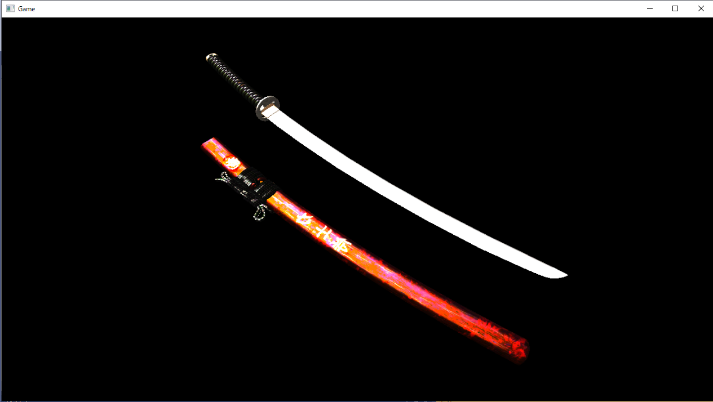

## はじめに
このチャプターでは、次のサンプルプログラムを利用します。ダウンロードをしてください。</br>
**[Sample_12_04.zip](https://drive.google.com/file/d/1SXD6J35rEs8UCcFojg1ipn_7dfulAD-O/view?usp=sharing)**</br>
**[Sample_12_05.zip](https://drive.google.com/file/d/10zRg4dyythHpB-bonUYb99PgulA1XZNi/view?usp=sharing)**</br>

## 12.9 【ハンズオン】ディファードレンダリング入門～スペキュラマップ～
この節では、Sample_12_04を改造して、ディファードレンダリングでのスペキュラマップの活用を実装していきます。Sample_12_04は実行すると日本刀が表示されているデモを起動することができます。このデモで表示されている日本刀は、本来強いスペキュラ反射は発生しない、日本刀の柄や鞘でもスペキュラ反射が起きています(図12.8)。</br>
**図12.8**</br>
</img></br>
このプログラムをスペキュラマップを利用するように改造して、日本刀の刀身や鞘の装飾部分だけがスペキュラ反射するようにしていきましょう。</br>
しかし、スペキュラマップを利用する話だけですと、先ほどの法線マップの利用と同様に、6.2.1のスペキュラマップを利用したライティング実装と同じことをするだけです。そこで今回は、プラスアルファの内容としてG-Bufferの節約についても考えていきます。スペキュラマップを利用するということは、スペキュラ強度を図12.1のようにG-Bufferに書きこむ必要があります。ですので、単純に考えると、次のコードのようにスペキュラ強度を書き込む用のG-Bufferを追加することになります。
```cpp
//レンダリングターゲットをG-Bufferに変更して書き込む
RenderTarget* rts[] = {
	&albedRT,       // 0番目のレンダリングターゲット
	&normalRT, 		// 1番目のレンダリングターゲット
	&worldPosRT     // 2番目のレンダリングターゲット
	&specRT,		// スペキュラ強度を書きこむために、3番目のレンダリングターゲットを追加。
};
```
ここである疑問が生まれます。DirectX12では一度の描画で最大何枚のレンダリングターゲットに書き込むことができるのだろうか？この答えは８枚です。もちろんこの枚数は将来的に増えていく可能性はありますが、今後も何かのグラフィック表現を実現したい場合にG-Bufferが増えていくことが考えられます。例えば、PBRでのライティングを行うのであれば、メタリック、スムース、クリアコートなどのパラメータが必要になる可能性があります。そのため、G-Bufferの使い方を工夫して節約するというのは重要なことです。そこで、今回は、法線を記録しているG-Bufferのwの要素にスペキュラ強度を記憶する実装を行っていきます。G-Bufferへの記憶の仕方を工夫すること以外は、スペキュラマップの利用のプログラムと何も変わりません。では、実装していきましょう。Sample_12_04/Sample_12_04.slnを開いて下さい。</br>

### step-1 スペキュラマップにアクセスするための変数を追加。
今回のサンプルもcpp側の実装はすべて終わっているので、シェーダー側からの実装です。まずはG-Buffer作成のシェーダーを改造からです。Assets/shader/model.fxを開いてリスト12.23のプログラムを入力して、スペキュラマップにアクセスできるようにしてください。</br>
[リスト12.23 model.fx]
```cpp
// step-1 スペキュラマップにアクセスするための変数を追加。
Texture2D<float4> g_specularMap : register(t2);
```

### step-2 スペキュラ強度をpsOut.normal.wに代入。
続いてピクセルシェーダーを改造します。スペキュラマップからスペキュラ強度をサンプリングして、G-Bufferに出力します。法線出力用のデータのw要素にスペキュラ強度を記憶していることに注目してください。では、リスト12.24のプログラムを入力して下さい。</br>
[リスト12.24 model.fx]
```cpp
// step-2 スペキュラ強度をpsOut.normal.wに代入。
psOut.normal.w = g_specularMap.Sample( g_sampler, psIn.uv).r;
```

### step-3 スペキュラ強度を法線テクスチャのw要素からサンプリングする。
step-2でG-Buffer作成の処理の実装は終わりです。step-3からはディファードライティングを実装していきます。まずは、法線テクスチャからスペキュラ強度をサンプリングするプログラムを実装します。スペキュラ強度が法線テクスチャのw要素に記録されている点に注目してください。では、Assets/shader/sprite.fxを開いてリスト12.25のプログラムを入力してください。</br>
[リスト12.25 sprite.fx]
```cpp
// step-3 スペキュラ強度を法線テクスチャのw要素からサンプリングする。
float specPower = normalTexture.Sample(Sampler, In.uv).w;
```
### step-4 スペキュラ強度を法線テクスチャのw要素からサンプリングする。
これで最後です。step-3でサンプリングしたスペキュラ強度をスペキュラカラーに乗算します。リスト12.26のプログラムを入力してください。</br>
[リスト12.26 sprite.fx]
```cpp
// step-4 スペキュラ強度をスペキュラライトに乗算する。
specColor *= specPower;
```
ここまで実装出来たら実行して下さい。うまく実装できていると、図12.9のように、日本刀の刀身とサヤの文字の部分だけがスペキュラ反射で輝くようになります。</br>
**図12.9**</br>
</img></br>

<note>
本書では分かりやすさを優先して、ワールド座標のxyz全てをG-Bufferに書きこんで記録しています。ですが、多くのレンダリングエンジンでは、ワールド座標はそのまま記録せずに、正規化スクリーン座標系のZ値のみをG-Bufferに記録しています。これは、SSR( Screen Space Reflection )などの多くのポストエフェクトで深度値が必要になるため、G-Bufferに深度情報が必要になるという点と、正規化スクリーン座標系のZ値さえ記憶しておけば、ビュープロジェクション行列の逆行列を利用することで、ディファードライティングの際にワールド座標に復元することが可能だからです。G-Bufferを節約するということは、レンダリングターゲットの最大枚数の問題だけではなく、メモリ書き込みの節約にもつながるため、ゲームのパフォーマンスの向上も期待できるようになります。Sample_12_05に深度情報からワールド座標を復元するサンプルを用意していますので、興味がある方は参照してみてください。

</note>
<!-- 改ページ. -->
<div style="page-break-before:always"></div>

## 評価テスト
次の評価テストを行いなさい。</br>
[評価テストへジャンプ](https://docs.google.com/forms/d/e/1FAIpQLScmtJZA7pOF00dRPFQNdK2uGLhrFn_D5Oi4Ywmn-PymxdF4PA/viewform?usp=sf_link)
</br>

