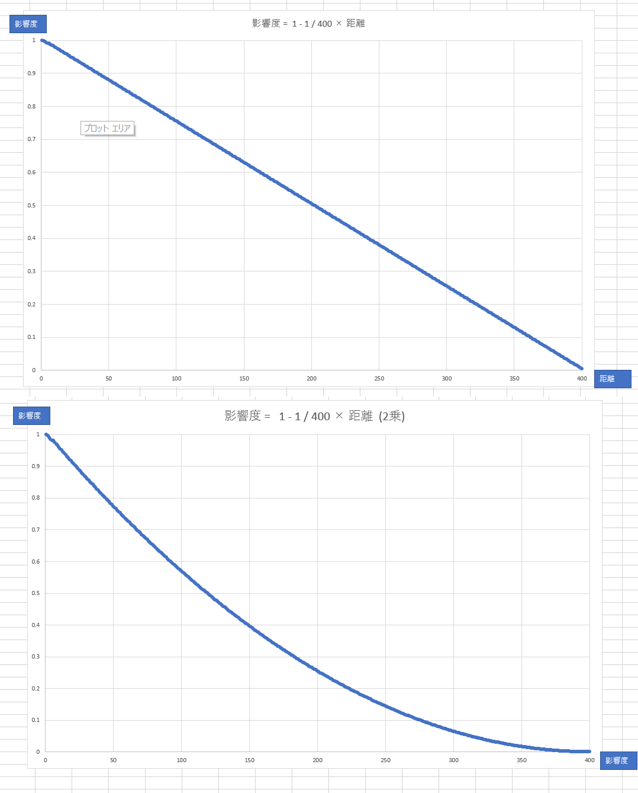

## はじめに
このチャプターでは、次のサンプルプログラムを利用します。ダウンロードをしてください。</br>
**[Sample_05_01.zip](https://drive.google.com/file/d/1Y7u-to5KLL2IQIme5hpFZUZWMg4-tBKt/view?usp=sharing)**</br>

---
## 5.1 ポイントライト
&emsp;ポイントライトはディレクションライトと異なり、位置情報を保持しているライトです。ですので、図4.4のように光源が移動したり、キャラクターが移動することで光の当たる方向が変わっていきます。今回実装するポイントライトはPhongの反射モデルで実装するので、前節のディレクションライトで行った、ランバート拡散反射とフォン鏡面反射の計算を行います。しかし、ディレクションライトと異なり下記の二つのことを考える必要があります。</br>
1. 入射してくる光の方向
2. 光源との距離による光の減衰

---
### 5.1.1 入射してくる光の方向
&emsp;ランバート拡散反射とフォン鏡面反射の計算にはサーフェイスに入射してくる光の方向が必要でした。なので、ポイントライトでこれらの反射を計算する場合も図5.1のように入射してくる光の方向が必要です。</br>
**図5.1**</br>
</img></br>
&emsp;サーフェイスに入射してくる光の方向は、サーフェイスのワールド座標からポイントライトの座標を引き算して正規化することで求めることができます。</br>

```cpp
//サーフェイスのワールド座標 - ポイントライトの座標。
float3 ligDir = surface.worldPosition - pointLight.position;
//求めたベクトルを正規化する。
ligDir = normalize( ligDir );
```

---
### 5.1.2 光源との距離による光の減衰
&emsp;ポイントライトの光の影響は距離によって減衰していきます。今回実装するポイントライトでは、次の計算式を使用して距離に比例して、光の影響力が0になっていくようにします。</br>
**D : ポイントライトとサーフェイスの距離**</br>
**R : ポイントライトが影響を与える範囲**</br>
**この時、影響力 Aを次の計算で求める。**</br>
**A = 1 - 1/R × D**</br>
&emsp;この計算式を使った場合に、ポイントライトが影響を与える範囲が400の時の、ポイントライトとサーフェイズの距離による影響力を表5.1に示します。</br>
**表5.1**</br>
| サーフェイスとの距離 | 計算式 | 影響力 |
| ---- | ---- | ---- |
| 0 | 1 - 1 / 400 × 0 | 1(100%)|
| 100 | 1 - 1 / 400 × 100 | 0.75(75%)|
| 200 | 1 - 1 / 400 × 200 | 0.5(50%)|
| 300 | 1 - 1 / 400 × 300 | 0.25(25%)|
| 400 | 1 - 1 / 400 × 400 | 0(0%)|

&emsp;サーフェイスとの距離が離れていくほど影響力が小さくなっていき、影響を与える範囲の限界に来ると、影響力が0になっていることが分かるかと思います。影響力を求める疑似コードを示します。</br>
```cpp
//サーフェイスとポイントライトの距離を計算する。
float D = length( surface.worldPosition - pointLight.position );
//影響力を計算する。
float A = 1.0f - 1.0f / pointLight.range * D;
//影響力がマイナスになる場合(範囲を超えている)は0にする。
if( A < 0.0f){
	A = 0.0f;
}
//2乗することで影響力の変化を指数関数的にする。
A = pow( A, 2.0f );
```
&emsp;ポイントライトとの距離が、ポイントライトの範囲を超えると影響力がマイナスになってしまうので、この疑似コードではif文を使ってマイナスにならないようにしています。</br>
&emsp;また、今回実装するポイントライトでは、影響力にpow関数を利用して、影響力の変化が指数関数的になるようにしています。</br>
**表5.2**</br>
| サーフェイスとの距離 | 計算式 | 影響力 | 影響力(2乗)|
| ---- | ---- | ---- | ---- |
| 0 | 1 - 1 / 400 × 0 | 1(100%)| 1(100% | 
| 100 | 1 - 1 / 400 × 100 | 0.75(75%)| 0.5625(56%) | 
| 200 | 1 - 1 / 400 × 200 | 0.5(50%)| 0.25(25%) |
| 300 | 1 - 1 / 400 × 300 | 0.25(25%) | 0.0625(6%) |
| 400 | 1 - 1 / 400 × 400 | 0(0%)| 0(0%) | 
&emsp;影響力を累乗することで、図5.2のように影響力の強さは線形な変化から、指数関数的な変化となります。自然界には指数関数的な変化をしている現象が多いため、pow関数を利用することでお手軽にリアルな表現を実装できます。</br>

**図5.2**
</img></br>

---
### 5.1.2 ポイントライト実装まとめ
&emsp;では、ポイントライトの実装方法をまとめます。
1. ポイントライトの座標とサーフェイスのワールド座標で入射してくる光の方向を求める。
2. 1で求めた光の方向を使って、ランバート拡散反射光と鏡面反射光を求める。
3. ポイントライトとサーフェイスとの距離を使って、ライトの影響度を求める。
4. 3で求めたライトの影響度を拡散反射光と鏡面反射光に乗算して、最終的な反射光を求める。

---
### 5.1.3 【ハンズオン】ポイントライトを実装する。
&emsp;では、ポイントライトを実装していきましょう。Sample_05_01を立ち上げてください。

#### step-1 ライト構造体にポイントライト用のメンバ変数を追加。
&emsp;まずはライト構造体にポイントライト用のメンバ変数を追加します。main.cppの17行目にリスト5.1のプログラムを入力してください。</br>
[リスト5.1 main.cpp]
```cpp
//step-1 ライト構造体にポイントライト用のメンバ変数を追加。
Vector3 ptPosition;		//位置。
float pad2;					//パディング。
Vector3 ptColor;			//カラー。
float ptRange;				//影響範囲。
```
#### step-2 ポイントライトの初期座標を設定する。
&emsp;続いて、ポイントライトの初期座標を設定します。main.cppにリスト5.2のプログラムを入力してください。</br>
[リスト5.2 main.cpp]
```cpp
//step-2 ポイントライトの初期座標を設定する。
light.ptPosition.x = 0.0f;
light.ptPosition.y = 50.0f;
light.ptPosition.z = 50.0f;
```

#### step-4 ポイントライトのカラーを設定する。
&emsp;初期座標が設定出来たら、次はポイントライトの初期カラーを設定します。main.cppにリスト5.3のプログラムを入力してください。</br>
[リスト5.3 main.cpp]
```cpp
//step-3 ポイントライトの初期カラーを設定する。
light.ptColor.x = 15.0f;
light.ptColor.y = 0.0f;
light.ptColor.z = 0.0f;
```

#### step-4 ポイントライトの影響範囲を設定する。
&emsp;続いて、ポイントライトの影響範囲の設定です。この設定を変更することでポイントライトの光が届く範囲を変更することができます。届く範囲を狭くしたい場合は値を小さく、広くしたい場合は値を大きくしてください。では、main.cppにリスト5.4のプログラムを入力してください。</br>
[リスト5.4 main.cpp]
```cpp
//step-4 ポイントライトの影響範囲を設定する。
light.ptRange = 100.0f;
```
#### step-5 コントローラーでポイントライトを動かす。
&emsp;では、c++側は最後です。ポイントライトの初期化が終わったら、ゲームループの中にポイントライトを動かすプログラムを追加してみましょう。XInputに対応しているゲームパッドを持っている人はパソコンに接続してもらえると、左のアナログスティックでポイントライトを動かせるようになります。コントローラーを持っていない人もキーボードのWASDキーで動かすことができます。main.cppにリスト5.5のプログラムを入力してください。</br>
[リスト5.5 main.cpp]
```cpp
//step-5 コントローラーでポイントライトを動かす。
light.ptPosition.x -= g_pad[0]->GetLStickXF();
if (g_pad[0]->IsPress(enButtonB)) {
	light.ptPosition.y += g_pad[0]->GetLStickYF();
}
else {
	light.ptPosition.z -= g_pad[0]->GetLStickYF();
}
```

#### step-6 定数バッファにポイントライト用の変数を追加。
&emsp;ここからはシェーダー側を実装していきます。ポイントライト用のデータにアクセスするために定数バッファに変数を追加します。Assets/shader/sample.fxの36行目にリスト5.6のプログラムを入力してください。</br>
[リスト5.6 sample.fx]
```cpp
//step-6 定数バッファにポイントライト用の変数を追加。
float3 ptPosition;	//ポイントライトの位置。
float3 ptColor;		//ポイントライトのカラー。
float ptRange;		//ポイントライトの影響範囲。
```
#### step-7 このサーフェイスに入射しているポイントライトの光の向きを計算する。
&emsp;続いてピクセルシェーダーです。まずは、サーフェイス(ピクセル)に入射しているポイントライトの光の向きを計算します。光の向きはサーフェイスのワールド座標からポイントライトの座標を減算して、正規化(大きさ１)にすることで求めることができます。sample.fxにリスト5.7のプログラムを入力して下さい。</br>
[リスト5.7 sample.fx]
```cpp
//step-7 このサーフェイスに入射しているポイントライトの光の向きを計算する。
float3 ligDir = psIn.worldPos - ptPosition;
//正規化して大きさ１のベクトルにする。
ligDir = normalize(ligDir);
```

#### step-8 減衰なしのランバート拡散反射光を計算する。
&emsp;入射してくる光の方向を求めることができたら、ランバート拡散反射光を求めることができます。今回のサンプルではランバート拡散反射を求める処理をまとめたCalcLambertDiffuseという関数を著者の方で用意していますので、こちらを使用します。sample.fxにリスト5.8のプログラムを入力して下さい。</br>
[リスト5.8 sample.fx]
```cpp
//step-8 減衰なしのランバート拡散反射光を計算する。
float3 diffPoint = CalcLambertDiffuse(
	ligDir, 		//ライトの方向
	ptColor,	 	//ライトのカラー
	psIn.normal		//サーフェイスの法線
);
```

#### step-9 減衰なしのフォン鏡面反射光を計算する。
&emsp;拡散反射光を求めることができたら、次はフォン鏡面反射光も計算します。こちらも著者の方でフォン鏡面反射光を求める処理をまとめたCalcPhongSpecularという関数を用意していますので、こちらを利用します。sample.fxにリスト5.9のプログラムを入力してください。</br>
[リスト5.9 sample.fx]
```cpp
//step-9 減衰なしのフォン鏡面反射光を計算する。
float3 specPoint = CalcPhongSpecular(
	ligDir, 			//ライトの方向。
	ptColor,		 	//ライトのカラー。
	psIn.worldPos, 		//サーフェイズのワールド座標。
	psIn.normal			//サーフェイズの法線。
);
```

#### step-10 距離による影響率を計算する。
&emsp;step-8とstep-9で求めた反射光は距離による影響率は考慮していませんでした。step-10ではポイントライトとの距離による影響率を計算していきましょう。影響率は距離に比例して小さくなるようになっていて、ポイントライトの範囲を超えると影響率は0になります。sample.fxにリスト5.10のプログラムを入力してください。</br>
[リスト5.10 sample.fx]
```cpp
//step-10 距離による影響率を計算する。
//ポイントライトとの距離を計算する。
float3 distance = length( psIn.worldPos - ptPosition );

//影響率は距離に比例して小さくなっていく。
float affect = 1.0f - 1.0f / ptRange * distance;
//影響力がマイナスにならないように補正をかける。
if( affect < 0.0f){
	affect = 0.0f;
}
//影響の仕方を指数関数的にする。今回のサンプルでは3乗している。
affect = pow( affect, 3.0f );
```

#### step-11 拡散反射光と鏡面反射光に影響率を乗算して影響を弱める。
&emsp;影響率を求めることができたら、反射光に影響率を乗算して、光の影響を距離によって減衰してやりましょう。sample.fxにリスト5.11のプログラムを入力してください。</br>
[リスト5.11 sample.fx]
```cpp
//step-13 拡散反射光と鏡面反射光に減衰率を乗算して影響を弱める。
diffPoint *= affect;
specPoint *= affect;
```

#### step-12 ポイントライトによる反射光とディレクションライトによる反射光を合算して最終的な反射光を求める。
&emsp;では、最後のハンズオンです。ポイントライトによる反射光とディレクションライトによる反射光を合成して、最終的な反射光を求めましょう。sample.fxにリスト5.12のプログラムを入力してください。</br>
[リスト5.12 sample.fx]
```cpp
//step-14 ポイントライトによる反射光とディレクションライトによる反射光を合算して最終的な反射光を求める。
float3 diffuseLig = diffPoint + diffDirection;
float3 specularLig = specPoint + specDirection;
```
&emsp;入力出来たら、実行してみてください。うまくいっていたら図5.3のようなプログラムが実行できます。コントローラーの左スティックでポイントライトを動かすことができますので、動かしてみてください。Bボタン(キーボードならK)を押しながら左スティックで上下にも移動します。</br>
**図5.3**</br>
</img></br>
