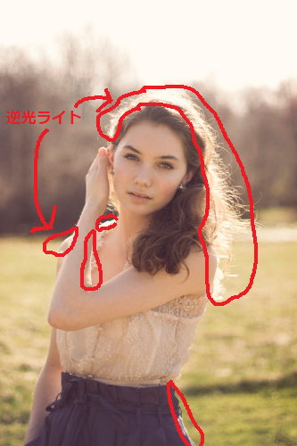
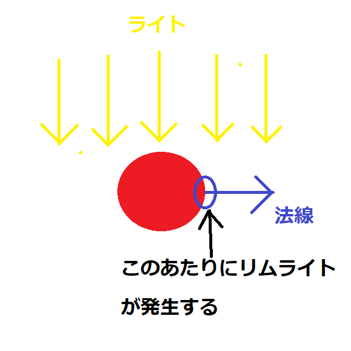
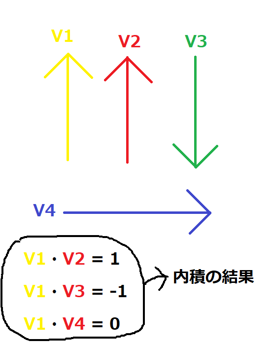
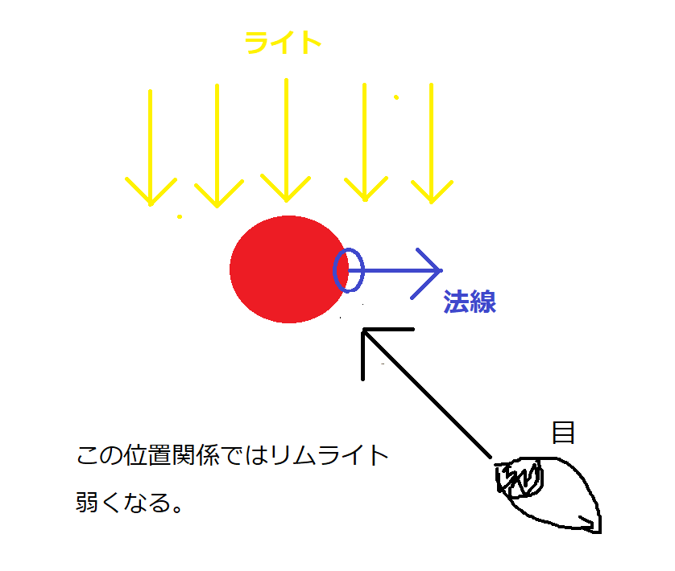
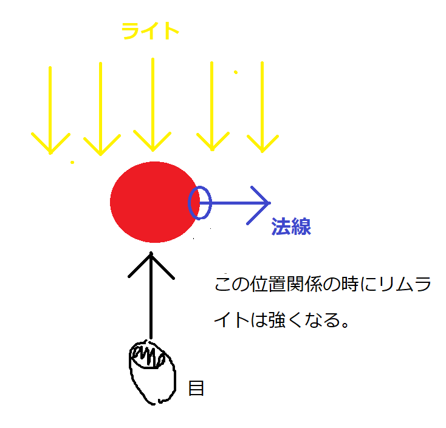
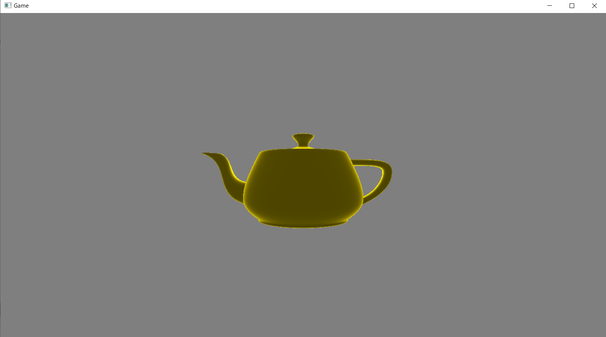

## はじめに
このチャプターでは、次のサンプルプログラムを利用します。ダウンロードをしてください。</br>
**[Sample_05_03.zip](https://drive.google.com/file/d/11R6dSppHeIAbBn4JRisEJQMuwzhJNcTb/view?usp=sharing)**</br>

---
## 5.3 リムライト
リムライトは逆光ライトとも呼ばれます。図5.12のような表現のことです。</br>

**図5.12**</br>
</img></br>

図5.12の写真は後ろから当たっている光が被写体を透過して、図5.13のように被写体の輪郭がうっすらと光っています。</br>
**図5.13**</br>
</img></br>
このような現象を再現するのがリムライトです。この逆光表現は動物の毛の表現でも使われることがあり、ファーシェーダーというように呼ばれていたりもします。(図5.14)</br>

**図5.14**</br>
</img></br>
逆光ライトは次の２点について考えることで実装することができます。

1.サーフェイスの法線と光の入射方向

2.サーフェイスの法線と視線の方向

では、この２点について詳しく見ていきましょう。

---
### 5.3.1 サーフェイスの法線と光の入射方向

まず、リムライトは図5.15のように、光の向きとサーフェイスの法線が垂直に近い箇所で強く発生すると考えることができます。</br>
**図5.15**</br>
</img></br>
この強さは光の向きとサーフェイスの法線とで内積を利用すると求めることができます。</br>
内積には次のような性質があります。</br>
**「正規化された二つのベクトルの内積は、その二つのベクトルのなす角が0度なら1.0、90度なら0.0、180度なら-1.0を返す」**</br>
図5.16を見てみてください。</br>
**図5.16**</br>
</img></br>
この性質は非常に重要で、リアルタイムCGの計算で何度も出てきます。実はこれは、ランバート拡散反射で光の強さを求めるときに利用したものと全く同じです。図4.10と表4.1を見てみてください。二つのベクトルのなす角度が0度の内積は1、90度の内積は0、180度の内積は-1になっています。</br>
今回は光の向きとサーフェイスの法線が垂直(90度)になるほどリムライトの影響を強くしたい(100%にしたい)わけなので、下記のような計算でリムライトの強さを求めることができます。</br>
**1 - max{ 0,  ライトの方向 ・ 法線  }**</br>
ライトの方向と法線の角度が垂直であれば、内積の結果は0になるため、計算すると1(100%)になります。逆にライトの方向と法線が同じ向きであれば、1になるため、計算すると0(0%)となります。これをリムライトの強さとして考えます。

---
### 5.3.2 サーフェイスの法線と視線の方向
リムライトの強さを決めるのは、サーフェイスの法線とライトの方向のみではありません。サーフェイスの法線と視線の方向でも決まります。図5.17と図5.18を見てみてください。</br>
**図5.18**</br>
</img></br>

**図5.19**</br>
</img></br>


つまり、リムライトさは「サーフェイスの法線と視線の方向が９０度に近いほど強くなる」という特性あります。この強さの求め方は5.3.1節と全く同じ考え方です。次の計算を行うことで求めることができます。</br>
**1 - max{ 0, 視線の方向 ・ 法線 * -1 }**</br>
ライトの方向との時と違う点は、視線の方向がライトとは逆向きなので、-1を乗算していることです。

---
### 5.3.3 リムライトの強さを乗算する
さて、5.3.1と5.3.2でリムライトの強さに影響を与える二つの要素について計算することができました。後は、その二つを乗算することで最終的なリムライトの強さを求めることができます。では、最後にリムライトの強さを求める疑似コードを示します。</br>
```cpp
//ライトの方向をL、視線の方向をeyeDir、法線をNとする。

//ライトの方向と法線で内積を計算。
float power1 = dot( L, N );		
//内積結果がマイナスであれば0にする。
power1 = max( 0.0f, power1 );	
//1から引いて、ライトの方向に依存するリムの強さを計算する。
power1 = 1.0f - power1;

//視線の逆方向と法線で内積を計算する。
float power2 = dot( -eyeDir, N );
//内積結果がマイナスであれば0にする。
power2 = max( 0.0f, power2 );	
//1から引いて、視線の方向に依存するリムの強さを計算する。
power2 = 1.0f - power2;

//二つの強さを乗算して、最終的なリムの強さを求める。
float limPower = power1 * power2;
```
`max()`はHLSLの組み込み関数です。二つの引数を受け取り、大きいほうの数値を返します。マイナスになる値を0に補正する場合などによく利用されます。

---
### 5.3.4 【ハンズオン】リムライトを実装しよう。
では、ハンズオンでリムライトを実装していきましょう。今回の実装ではディレクションライトによるリムライトを実装します。すでにディレクションライトの情報をグラフィックメモリに転送するコードは実装できているので、今回改造するのはシェーダー側だけとなります。`Sample_05_03/Sample_05_03.sln`を立ち上げてください。
#### step-1 ピクセルシェーダーへの入力にカメラ空間の法線を追加。
まずは、ピクセルシェーダーへの入力にカメラ空間の法線を追加します。これはカメラを原点(0,0,0)、カメラの右をX軸(1,0,0)、上をY軸(0,1,0)、奥をZ軸(0,0,1)とした空間です。この空間のサーフェイスの法線をピクセルシェーダーに渡すようにしたいわけです。この理由は後述します。Assets/shader/sample.fxを開いてリスト5.27のプログラムを入力してください。</br>

[リスト5.27 `sample.fx`]
```cpp
//step-1 ピクセルシェーダーへの入力にカメラ空間の法線を追加。
float3 normalInView	: TEXCOORD2;	//カメラ空間の法線。
```

#### step-2 カメラ空間の法線を求める。
ピクセルシェーダーの入力にカメラ空間の法線を追加したので、頂点シェーダーでカメラ空間の法線を計算します。カメラ空間に変換するのは、ワールド空間の法線に、カメラ行列を乗算するだけです。リスト5.28のプログラムを入力してください。</br>

[リスト5.28 `sample.fx`]
```cpp
//step-2 カメラ空間の法線を求める。
psIn.normalInView = mul( mView, psIn.normal);//カメラ空間の法線を求める。
```

#### step-3 サーフェイスの法線と光の入射方向に依存するリムの強さを求める。
いよいよピクセルシェーダーにリムライトの計算のプログラムを実装していきます。最初の計算はサーフェイスの法線と光の入射方向に依存するリムの強さを求めています。これは5.3.1節で説明した内容です。リスト5.29のプログラムを入力してください。</br>

[リスト5.29 `sample.fx`]
```cpp
//step-3 サーフェイスの法線と光の入射方向に依存するリムの強さを求める。
float power1 = 1.0f - max( 0.0f, dot( dirDirection, psIn.normal));
```

#### step-4 サーフェイスの法線と視線の方向に依存するリムの強さを求める。
続いて、サーフェイスの法線と視線の方向に依存するリムの強さを求めます。これも5.3.2節で説明した内容なのですが、今回は計算を簡略化するために、カメラ空間のサーフェイスの法線を利用しています。視線の方向はカメラ空間なので(0,0,1)となります。内積の公式は次のようなものでした。</br>
**V1.x × V2.x + V1.y × V2.y + V1.z × V2.z**</br>
視線のX方向とY方向の値は0、Zの方向は1とになっているため、内積の結果は法線のZの値と同じになります。ですので、リスト5.30のプログラムでは`dot()`は利用しておらず、カメラ空間の法線のZ値をそのまま使用しています。では、リスト5.30のプログラムを入力してください。</br>

[リスト5.30 `sample.fx`]
```cpp
//step-4 サーフェイスの法線と視線の方向に依存するリムの強さを求める。
float power2 = 1.0f - max( 0.0f, psIn.normalInView.z * -1.0f);
```

#### step-5 最終的なリムの強さを求める。
「サーフェイスの法線と光の入射方向に依存するリムの強さ」と「サーフェイスの法線と視線の方向に依存するリムの強さ」が求まったら、その二つの強さを乗算して最終的なリムの強さを求めましょう。また、ここでも`pow()`を利用して、リムの強さの変化を指数関数的にしています。ここでは1.3乗しています。では、リスト5.31のプログラムを入力してください。</br>

[リスト5.31 `sample.fx`]
```cpp
//step-5 最終的なリムの強さを求める。
float limPower = power1 * power2;
//pow()を使用して、強さの変化を指数関数的にする。
limPower = pow( limPower, 1.3f);
```

#### step-6 最終的な反射光にリムライトの反射光を合算する。
では最後です。最終的な反射光にリムライトの反射光を合算しましょう。リスト5.32のプログラムを入力して下さい。</br>
[リスト5.32 `sample.fx`]
```cpp
//step-6 最終的な反射光にリムライトの反射光を合算する。
//まずはリムライトのカラーを計算する。
float3 limColor = limPower * dirColor;
//最終的な反射光にリムの反射光を合算する。
finalLig += limColor;
```
入力出来たら実行してみてください。図5.20のようなプログラムが実行できたら完成です。</br>

**図5.20**</br>
</img></br>
XInput対応のゲームパッドであれば左スティックを動かすとライトを回すことができます。ゲームパッドがない場合はキーボードのAキーとDキーでまわすことができます。リムライトの効果を確認してみてください。

---
## 評価テスト-3
次の評価テストを行いなさい。</br>
[評価テストへジャンプ](https://docs.google.com/forms/d/e/1FAIpQLSdRjKAwmpImesGjCFqEtC4mnF9cM4eraGLdpd87TNFoYfvKAw/viewform?usp=sf_link)