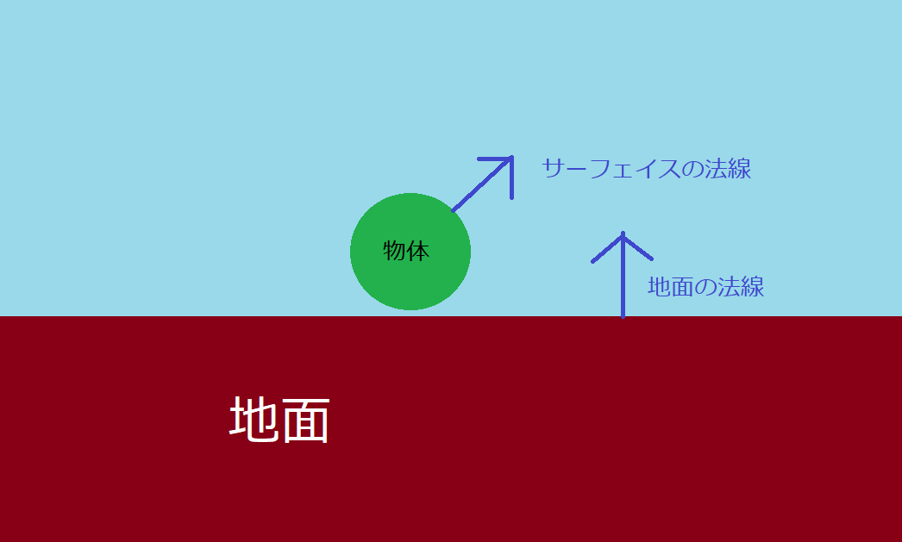
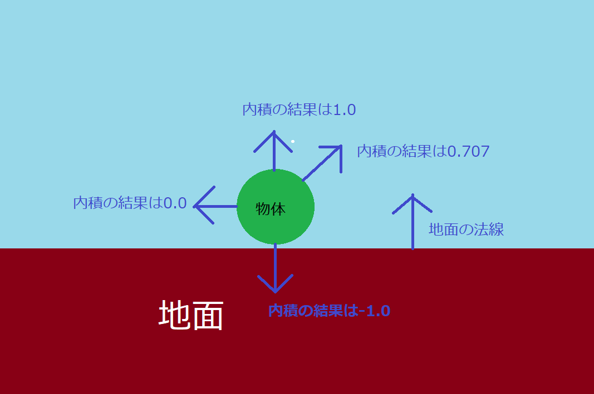
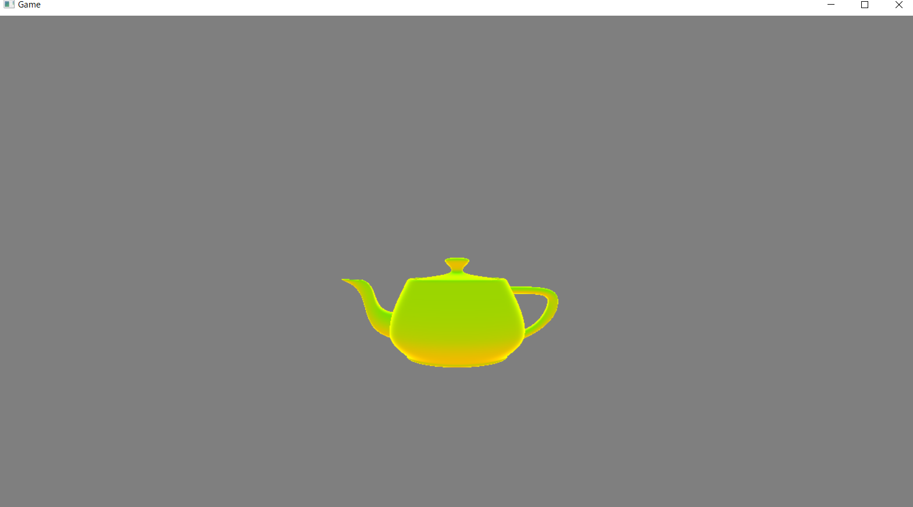

## はじめに
このチャプターでは、次のサンプルプログラムを利用します。ダウンロードをしてください。</br>
**[Sample_05_04.zip](https://drive.google.com/file/d/1lkcNeFctGnVlHqqWORDRE15PNaOUG87H/view?usp=sharing)**</br>

---
## 5.4 半球ライト
4.3.5節で環境光について勉強しました。現実世界の物体は、太陽などの直接光の影響だけを受けているわけではなく、地面からの照り返し、ビルの照り返し、など様々な物体に反射した間接光の影響を受けています。しかし、地面の照り返しなどの２次反射の計算を真面目に実行すると、膨大な計算量となってしまいます。そこで、ゲームでは「物体は一律で同じ間接光を受けている」という環境光の計算モデルについて学びました。ここで勉強する半球ライトはこの環境光の計算を、シンプルな計算でもう少しだけマシなものにしたライトです。
### 5.4.1 地面色と天球色
半球ライトは地面の色(地面からの照り返し)と天球色(空の色)を考慮したライトです。このライトはサーフェイスの法線と地面との内積を計算するだけのシンプルな計算で処理できます。そのため、PlayStation3などの、今と比べるとGPUの計算速度が心もとないゲーム機で発売されたゲームで採用事例がありました。現在でもスマートフォンなどのゲームでは、お手軽な環境光の処理として使えるのではないかと思います。
### 5.4.2 半球ライトの計算
半球ライトの計算を行うためには、地面色、天球色、地面の法線、サーフェイスの法線が必要になります。今回のサンプルでは地面色、天球色、地面の法線は固定的なものとしています。サーフェイスの法線はピクセルシェーダに渡されてくる法線です。半球ライトのデータは次のようになります。
```cpp
struct HemisphereLight{
	Vector3 skyColor;		//天球色
	Vector3 groundColor;	//地面色
	Vector3 groundNormal;	//地面の法線。
};
```
半球ライトの計算は地面の法線とサーフェイスの法線とで内積を計算します(図5.21)。</br>
**図5.21**
</img></br>

サーフェイスが空の方向を向いているのであれば1、地面の方を向いているのであれば-1を返してきます(図5.22)。</br>
**図5.22**
</img></br>
この内積の結果を使って地面色と天球色を線形補完するのですが、線形補完で使用する値は0.0～1.0になっている必要があるので、次の計算式のように、内積の結果に1.0を加算して2で割ることによって、内積の結果が0.0～1.0に変換されます。</br>
**( 内積の結果[-1.0～1.0] + 1.0 ) ÷ 2.0  = ( 0.0～1.0)**</br>
後は、0.0～1.0に変換された値を使って、次のように天球色と地面色を線形補完します。疑似コードは次のようになります。

```cpp
//天球色はskyColor、地面の色はgroundColor、
//地面の法線はgroundNormal、サーフェイスの法線はnormalとする。

//まず、サーフェイスの法線と地面の法線の内積を求める。
float t = dot( normal, groundNormal );
//内積の結果を0～1に変換する。
t = ( t + 1.0f ) / 2.0f;
//0～1に変換されたtを利用して、半球ライトを求める。
float3 hemiLight = skyColor * t + groundColor( 1.0f * t);

```


### 5.4.3 【ハンズオン】半球ライトを実装しよう。
では、半球ライトを実装していきましょう。`Sample_05_04/Sample_05_04.sln`を立ち上げて`main.cpp`を開いてください。</br>
#### step-1 地面色、天球色、地面の法線追加。
まずは、ライト構造体に地面色、天球色、地面の法線のデータを追加しましょう。リスト5.33のプログラムを`main.cpp`の21行目に入力して下さい。</br>
[リスト5.33 `main.cpp`]
```cpp
//step-1 地面色と天球色を追加。
Vector3 groundColor;	//地面色。
float pad4;
Vector3 skyColor;		//天球色。
float pad5;
Vector3 groundNormal;	//地面の法線。
```

#### step-2 地面色、天球色、地面の法線のデータを設定。
続いて、各種データを設定しましょう。今回は全て固定のデータとしています。リスト5.34のプログラムを入力してください。</br>
[リスト5.34 `main.cpp`]
```cpp
//step-2 地面色、天球色、地面の法線のデータを設定。

//地面色を設定。
light.groundColor.x = 0.7f;
light.groundColor.y = 0.5f;
light.groundColor.z = 0.3f;

//天球色を設定。
light.skyColor.x = 0.15f;
light.skyColor.y = 0.7f;
light.skyColor.z = 0.95f;

//地面の法線を設定。
light.groundNormal.x = 0.0f;
light.groundNormal.y = 1.0f;
light.groundNormal.z = 0.0f;
```

#### step-3 半球ライトのデータにアクセスするための変数を定数バッファに追加。
では、続いてシェーダー側です。`Assets/shader/sample.fx`を開いて36行目にリスト5.35のプログラムを入力してください。</br>
[リスト5.35 `sample.fx`]
```cpp
//step-3 半球ライトのデータにアクセスするための変数を定数バッファに追加。
float3 groundColor;		//照り返しのライト。
float3 skyColor;		//天球ライト。
float3 groundNormal;	//地面の法線
```

#### step-4 半球ライトを計算する。
続いてピクセルシェーダーで半球ライトの計算を行いましょう。ここで実装するプログラムは5.4.2節で示した計算と全く同じ考え方のものです。リスト5.36のプログラムを入力してください。</br>
[リスト5.36 `sample.fx`]
```cpp
//step-4 半球ライトを計算する。
//サーフェイスの法線と地面の法線との内積を計算する。
float t = dot( psIn.normal, groundNormal);
//内積の結果を０～１の範囲に変換する。
t = ( t + 1.0f ) / 2.0f;
//地面色と天球色を補完率ｔで線形補完する。
float3 hemiLight = lerp(groundColor , skyColor, t);
```
lerp関数はHLSLの組み込み関数で線形補完を行ってくれます。内部で行われている計算は5.4.2節で紹介した次のようなものです。</br>
**groundColor * ( 1.0f - t ) + skyColor * t**
lerp関数はよく使う関数なので、覚えておくと便利です。

#### step-5 半球ライトを最終的な反射光に加算する。
では、最後です。step-4で求めた半球ライトを最終的な反射光に加算しましょう。リスト5.37のプログラムを入力してください。</br>
[リスト5.37 `sample.fx`]
```cpp
//step-5 半球ライトを最終的な反射光に加算する。
finalLig += hemiLight;
```
入力出来たら実行してみてください。うまく実装できていれば、図5.23のようなプログラムが実行できます。ティーポットの下側から上側に向かってなだらかに環境光の影響が変化していることが分かります。</br>
**図5.23**</br>
</img></br>

---
## 評価テスト
次の評価テストを行いなさい。</br>
[評価テストへジャンプ](https://docs.google.com/forms/d/e/1FAIpQLSccwHfeEkjO6-JQlLYfwQMtIT7R4QWWc9CNahRCnw8x1DlGBw/viewform?usp=sf_link)