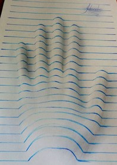
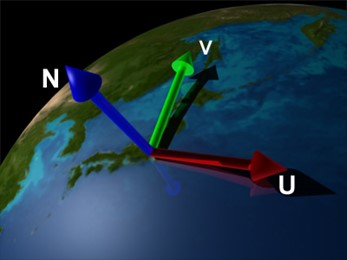

## はじめに
このチャプターでは、次のサンプルプログラムを利用します。ダウンロードをしてください。</br>
**[Sample_06_01.zip](https://drive.google.com/file/d/1gQr0c6fmi5SwBojqyUh-UTWiqNEJ_zmR/view?usp=sharing)**</br>

# Chapter 6 いろいろなテクスチャの利用
ここまでテクスチャは、「物体の模様を表現するための画像データ」として扱ってきていました。このような、模様を表すテクスチャはディフューズマップと呼ばれます。実はテクスチャは模様を表すディフューズマップ以外にも、凸凹を表現する法線マップ、高さを表すハイトマップ、透明度を表す透明度マップなど、様々なデータとして利用されます。このチャプターでは、このような色々なテクスチャを利用したシェーダープログラミングについて見ていきます。

## 6.1 法線マップ
法線マップは物体の凸凹を表現するためのテクスチャです。法線マップを活用することで、少ないポリゴン数でも細かなディテールを表現することが可能になります。
### 6.1.1 法線マップの登場
コンソールゲーム機で法線マップが本格的に使われだしたのは、PS3、Xbox360が登場してからになります。法線マップはプログラマブルシェーダーが登場してから生まれた技術のため、固定パイプラインには存在しません。そのためプログラマブルシェーダーを本格的に使用することが可能になったPS3、Xbox360の世代でコンソールゲーム機でも法線マップが活用されるようになりました。そして、現在はPS4、XboxOne、PC、スマートフォンなどでリリースされる多くの3Dゲームではあって当たり前の技術になっています。
### 6.1.2 細かいディテールの表現
法線マップの目的は低ポリゴンで細かなディテールを表現することです。では、それを具体的に考えていきましょう。例えば道路のアスファルトを考えてみてください。アスファルトを近くでよく観察をしてみると細かな凹凸があることが分かります。もしこの凹凸をポリゴンで表現しようとすると非常に多くのポリゴンが必要になります。多すぎるポリゴンはGPUのパフォーマンスを低下させ、多くのメモリを使用してしまうことになります。このような細かいディテールの表現をポリゴンで行うことには多くの問題がありました。そこでこれらを高いパフォーマンスと少ないメモリ使用量で実現するために法線マップという技術が生まれました。
### 6.1.3 法線をテクスチャに描き込む
引き続き、先ほどのアスファルトの凹凸で考えていきましょう。私たちはどうやってアスファルトの凸凹を認識しているのでしょうか？ 実は凸凹を認識するために一番重要な情報は光の陰影になります。図6.1を見てみてください。</br>

**図6.1**</br>
</img></br>
立体的に見えると思います。しかしこれらは全て平らなノートに書かれた絵であって実際には凹凸はありません。このように人間は実際に凹凸がなくても、陰影をつけることで実際に凹凸があるように錯覚します。陰影はChapter5で勉強した拡散反射や鏡面反射の計算で行うことができます。拡散反射や鏡面反射の計算式を思い出してください。ライトによって生成される陰影はライトの方向とモデルの法線によって決まっていました。つまり、ポリゴン数が少なくてもモデルの法線さえ詳細であれば、細かなディテールは表現できることになります。いわゆるだまし絵です。そこで、モデルの法線をテクスチャに書き込んでしまって、ライティングの時にはその法線を使用しようという考えが生まれます。これが法線マップです。図6.2はユニティちゃんの法線マップです。</br>

**図6.2**</br>
</img></br>
テクスチャのRGB成分に、法線のXYZ成分を書き込んでテクスチャにしたものです。

### 6.1.4 オブジェクトスペース法線マップとタンジェントスペース法線マップ
法線マップにはオブジェクトスペース法線マップとタンジェントスペース法線マップという二種類のデータ形式があります。オブジェクトスペース法線マップは、オブジェクト空間の法線マップです。タンジェントペース法線マップは法線空間での法線マップです。ではこの二つについて見ていきましょう。

### 6.1.5 オブジェクトスペース法線マップ
オブジェクトスペースはタンジェントスペースと比べるとイメージがしやすい法線マップです。この法線マップは単純にオブジェクトの法線のXYZの値をテクスチャのRGBに書き込んでいるだけです。オブジェクトスペース法線マップは図6.3のようなデータになります。</br>

**図6.3**</br>
</img></br>
先ほどのユニティちゃんの法線マップとは少し違った感じのデータに見えるかと思います。実は先ほどのユニティちゃんの法線マップはタンジェントスペース法線マップです。リスト6.1はオブジェクトスペース法線マップを使って、ランバート拡散反射を計算するHLSLの疑似コードを示します。</br>

[リスト6.1]
```cpp
//法線マップから法線をサンプリング。
float3 normal = normalMap.Sample(sampler, In.uv).xyz;
//法線マップに書き込まれている法線は0.0～1.0で、負の数になっていないので
//負の数に復元する。
normal = ( normal - 0.5f ) * 2.0f;
//法線を回転させて、オブジェクト空間からワールド空間に変換する。
//今回使用している行列は回転成分のみ。
float3 normal = mul( worldRotMatrix, normal );
//法線マップから計算した法線とディレクションライトの方向を使って
//拡散反射光を計算する。
float3 lig = max( dot( ligDirection, -normal) ) ) * ligColor;
```

法線マップはテクスチャなので、書き込まれている値は0～1の範囲になっています。しかし、法線というのは-1～1の範囲の値です。そこで、オブジェクトスペース法線マップでは、-1～1の数値を0～1に変換して書き込まれています。しかし、ライティングを計算するタイミングでは、-1～1の範囲に復元する必要があります。そこで、疑似コードでは、法線マップから法線をサンプリングした後で、その法線から0.5を引き算して、2を掛け算しています。この計算をすると、0～1の範囲が-1～1の範囲に復元されます。表6.1は復元前の法線と、復元後の法線を表したものです。</br>

**表6.1**</br>
| 復元前の法線 | 復元後の法線 |  
| ---- | ---- |
| ( 0, 0.5, 0.5 ) | (1, 0, 0 ) |
| ( 0.5, 0, 0.5 ) | (0, -1, 0) |
| ( 0.5, 0.5, 1.0 ) | (0, 0, 1) |
法線を-1～1の範囲に復元することができたら、法線をワールド空間に変換する必要があります。オブジェクトスペースの法線は、オブジェクトが回転していない空間での法線です。しかし、ゲームのキャラクターや、進行方向に向けて回転するなど動いています。なので、ゲーム中の動き(回転)に合わせて、法線も回転させる必要があります。そこで、法線にワールド行列を乗算して、法線をワールド空間に変換しています。ここで注意してほしいのが、法線をワールド空間に変換するときに平行移動成分は不要だということです。法線は向きの情報のみ保持している情報です。平行移動量は不要です。ですので、今回使用している行列は回転成分のみの行列を使っています。

## 6.1.6 タンジェントスペース法線マップ
タンジェントスペース法線マップは単純にオブジェクトの法線を埋め込んだものではなく、法線マップを貼り付けるポリゴンの法線座標系から見た法線を書き込んでいることになります。ポリゴンの法線座標系というのはポリゴンの法線をZ軸、ポリゴンの法線と直交している接ベクトル(タンジェント)をX軸、法線と接ベクトルの外積で求めた従法線ベクトルをY軸とした空間のことです。図6.4を見てください。</br>
**図6.4**</br>
</img></br>
この画像ですと、Nが法線、Uが接ベクトル、Vが従法線ベクトルになります。この３軸を基底軸とした空間がタンジェントスペースと呼ばれるものです。例えば、Nが(0.707,  0.0,  0.707)というベクトルだった場合、このNと同じ向きのベクトル(0.707,  0.0,  0.707)をタンジェントスペースに変換すると(0, 0, 1)になります。このように法線マップを貼り付けるポリゴンの法線と同じ向きのベクトルはタンジェントスペースに変換すると(0，0，1)に変換されます。これをテクスチャのRGBに変換して書き込むため、(0，0，255)という青いカラーが書き込まれることになります。多くのオブジェクトで法線マップに書き込む法線の方向は、貼り付けるポリゴンの法線から大きく変化することはありません。そのため、タンジェントスペース法線マップは青の成分が強く出る画像データになります。


## 6.1.7 法線空間からワールド空間への変換
ライティングを行うためには法線をワールド空間に変換する必要がありました。では、法線空間の法線をワールド空間に変換する方法について考えていきましょう。この変換の方法を理解するためには、基底軸について理解する必要があります。話を簡単にするために２次元で考えてみましょう。例えば、基底軸ex(1,0)、ey(0,1)の空間で考えてみましょう。基底軸というのはある座標系のX軸とY軸をワールド空間で表したものです。基底軸がex( 1, 0 ), ey( 0, 1 )ということは、これはワールド空間の基底軸です。では、図6.5を見てみてください。</br>
**図6.5**</br>
</img></br>

図6.6のベクトルVはワールド空間のベクトルです。このベクトルはX軸方向に5、Y軸方向に6の大きさを持っています。ベクトルVは次のような計算が成り立ちます。</br>
**V = V0 + V1**</br>

また、V0とV1は次の計算が成り立ちます。</br>

**V0 = V.x × ex**</br>
**V1 = V.y × ey**</br>

つまり、ベクトルVは次の計算式で求めることができます。</br>

**V = V.x × ex + V.y × ey**</br>

exとeyはこの空間の基底軸です。</br>
では、基底軸がex(0.707, -0.707), ey(0.707, 0.707)の場合を考えましょう。図6.6を見てください。</br>
**図6.6**</br>
</img></br>
図6.6は図6.5と全く同じですが、基底軸が異なっています。つまり、空間が違うということです。Vはワールド空間でのベクトルではなく、基底軸ex(0.707, -0.707), ey(0.707, 0.707)の空間でのベクトルです。これを基底軸ex(1, 0), ey(0,1)のワールド座標系に変換することを考えます。VはV0とV1の合算で求まります。そこで、まずはワールド空間でV0とV1がどのようなベクトルになるか求めてみましょう。V0とV1は下記の計算で求めることができます。</br>

**V0 = V.x × ex**</br>
**V1 = v.y × ey**</br></br>
つまり、ワールド空間のV0とV1は次のようになります。</br></br>
**V0 = 5 × ( 0.707, -0.707 )**</br>
**V0 = (3.535，－3.535)**</br>
**V1 = 6 × ( 0.707, 0.707 )**</br>
**V1 = (3.535，3.535)**</br></br>
ワールド空間でのV0とV1を求めることができたら、あとはV0とV1を足し算してVを求めます。</br></br>
**V = (3.535，－3.535) + (3.535，3.535)**</br>
**V = (7.07，0.0)**</br></br>
よって、(7.07，0.0)がVをワールド空間に変換したベクトルということになります。では、法線空間の法線をワールド空間に変換する話に求めましょう。ワールド空間に変換するためには法線空間の基底軸が必要となります。法線空間の基底軸はexが接ベクトル、eyが従法線、ezがサーフェイスの法線です。この基底軸を使って、法線をワールド空間に変換します。リスト6.2は法線マップからサンプリングした法線をワールド空間に変換する疑似コードです。</br>
[リスト6.2]
```cpp
//法線マップから法線をサンプリング。
float3 normalLocal = normalMap.Sample(sampler, In.uv).xyz;
//法線マップに書き込まれている法線は0.0～1.0で、負の数になっていないので
//負の数に復元する。
normalLocal = ( normal - 0.5f ) * 2.0f;
//ワールド空間の法線を計算する。
//なお、接ベクトルはtangent、従法線はbinormal、サーフェイスの法線はnormalに記録されているものとする。
float3 normalWorld =  localNormal.x * tangent + localNormal.y * binormal + localNormal * normal:
```

## 6.1.8 主流はタンジェントスペース法線マップ
現在主流となっているのはタンジェントスペース法線マップです。特に断りなく法線マップと言った場合はタンジェントスペースを指していると考えてください。
では、なぜタンジェントスペースが主流なのでしょうか。オブジェクトスペースの方が単純で分かりやすく感じたはずです。実はオブジェクトスペースには頂点の変形に対応できないという欠点があり、その欠点はタンジェントスペースであれば解決できます。今の3Dゲームではモーフィング、クロスシミュレーションなどといったオブジェクトの頂点を変形させる技術が使われています。その場合にオブジェクトスペースを使っていると図6.6のような問題が発生します。</br>

**図6.7**</br>
</img></br>
これがオブジェクトスペースの欠点です。一方タンジェントスペースはどうでしょうか？法線はライティングの計算を行うときに、ワールドスペースに変換を行う必要がありましたが、このワールドスペースへの変換を行う時に貼り付けるモデルの法線を使って変換を行うことになります。つまり、オブジェクトが変形した時にポリゴンの法線さえを正しく計算を行っておけば変形後の法線を求めることができます。オブジェクトスペース法線マップは非常にシンプルな考え方になるため、タンジェントスペース法線マップに比べるとGPUパフォーマンスの面では軍配があがります。しかし、頂点の変形に対応できないというデメリットを抱えることとなります。

## 6.1.9 【ハンズオン】法線マップを利用したライティング実装
では、法線マップを利用したライティングを実装していきましょう。`Sample_06_01/Sample_06_01.sln`を立ち上げてください。このサンプルはサーフェイスの法線を利用したランバート拡散反射がすでに実装されていて、実行すると図6.8のようなプログラムが実行できます。</br>
**図6.8**</br>
</img></br>
このデモはゲームコントローラーの左スティックでカメラが回転、十字キーでライトを回転させることができます。では、このサンプルを改造して、法線マップから計算した法線を利用したライティングを実装していきましょう。

### step-1 頂点シェーダーの入力に接ベクトルと従ベクトルを追加。
今回のデモでは、すでに接ベクトル、従ベクトル、法線マップはGPUで扱えるようになっているため、cpp側は改造する必要がありません。`Assets/shader/sample.fx`を開いてください。まずは、頂点シェーダーの入力に接ベクトルと従ベクトルを追加します。リスト6.3のプログラムを入力してください。</br>
[リスト6.3 `sample.fx`]</br>
```cpp
//step-1 頂点シェーダーの入力に接ベクトルと従ベクトルを追加。
float3 tangent  : TANGENT;
float3 biNormal : BINORMAL;
```
### step-2 ピクセルシェーダーの入力に接ベクトルと従ベクトルを追加。
続いて、ピクセルシェーダーの入力にも接ベクトルと従ベクトルを追加します。リスト6.4のプログラムを入力して下さい。</br>
[リスト6.4 `sample.fx`]</br>
```cpp
//step-2 ピクセルシェーダーの入力に接ベクトルと従ベクトルを追加。
float3 tangent		: TANGENT;		//接ベクトル。
float3 biNormal 	: BINORMAL;		//従ベクトル。
```

### step-3 法線マップにアクセスするための変数を追加。
次は、法線マップにアクセスするための変数を追加します。このサンプルでは法線マップはレジスタt1にバインドされています。リスト6.5のプログラムを入力してください。</br>
[リスト6.5 `sample.fx`]
```cpp
//step-3 法線マップにアクセスするための変数を追加。
Texture2D<float4> g_normalMap : register(t1);
```

### step-4 接ベクトルと従ベクトルをワールド空間に変換する。
各種データにアクセスするための準備が終わったので、いよいよシェーダーを改造していきます。まずは、接ベクトルと従ベクトルを頂点シェーダーからピクセルシェーダーに渡す処理を実装します。リスト6.6のプログラムを入力してください。</br>
[リスト6.6 `sample.fx`]
```cpp
//step-4 接ベクトルと従ベクトルをワールド空間に変換する。
psIn.tangent = normalize(mul(mWorld, vsIn.tangent));
psIn.biNormal = normalize(mul(mWorld, vsIn.biNormal));	
```
頂点シェーダーからピクセルシェーダーにベクトルをワールド空間に変換して渡していることに注意してください。

### step-5 法線マップからタンジェントスペースの法線をサンプリングする。
頂点シェーダーから必要なデータをピクセルシェーダーに送るプログラムが実装できたので、ここからはピクセルシェーダーを改造していきます。まずは、法線マップから法線をサンプリングするプログラムを追加します。リスト6.7のプログラムを入力してください。</br>
[リスト6.7 `sample.fx`]
```cpp
float3 localNormal = g_normalMap.Sample( g_sampler, psIn.uv).xyz;
//タンジェントスペースの法線を0～1の範囲から-1～1の範囲に復元する。
localNormal = (localNormal - 0.5f) * 2.0f;

```

### step-6 タンジェントスペースの法線をワールドスペースに変換する。
では、これで最後です。接ベクトルなどの、タンジェントスペースの基底軸を利用して法線をワールドスペースに変換しましょう。リスト6.8のプログラムを入力してください。</br>
[リスト6.8 `sample.fx`]
```cpp
//spte-6 タンジェントスペースの法線をワールドスペースに変換する。
normal = psIn.tangent * localNormal.x + psIn.biNormal * localNormal.y + normal * localNormal.z; 
```
実装出来たら実行してカメラやライトを動かしてみてください。法線マップを利用していないバージョンと比べるとモンスターの手の甲の凸凹間に大きな違いが生まれていることが分かります(図6.9)。</br>
**図6.9**</br>
</img></br>

