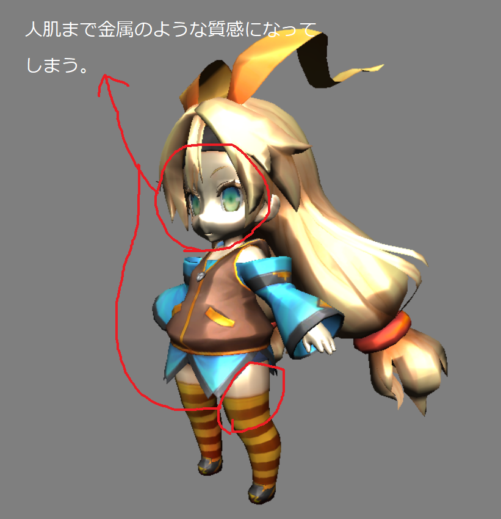
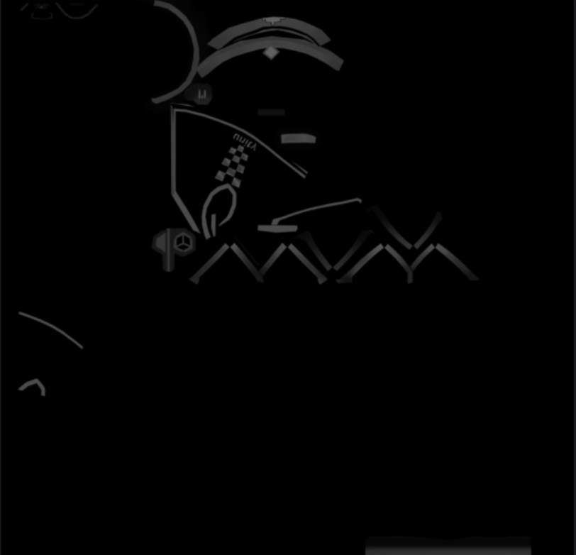
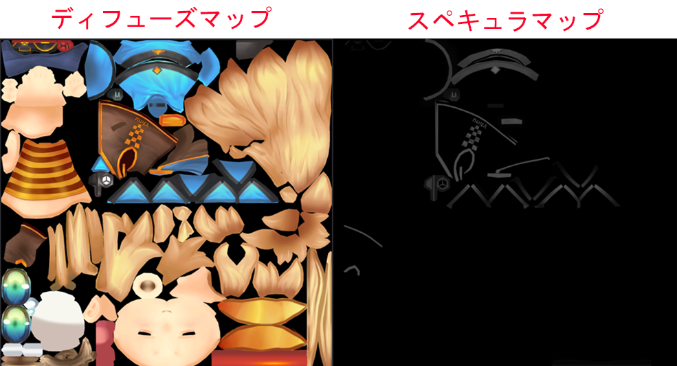
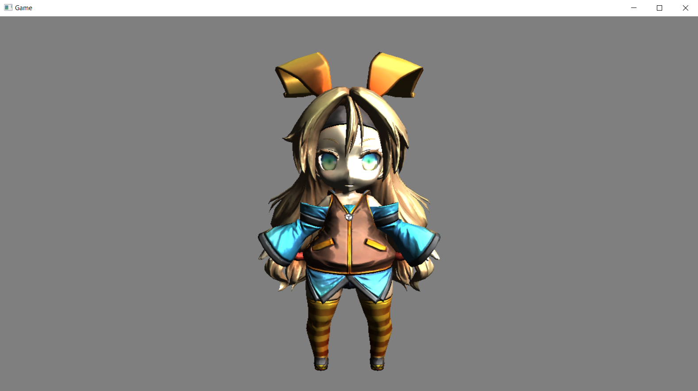
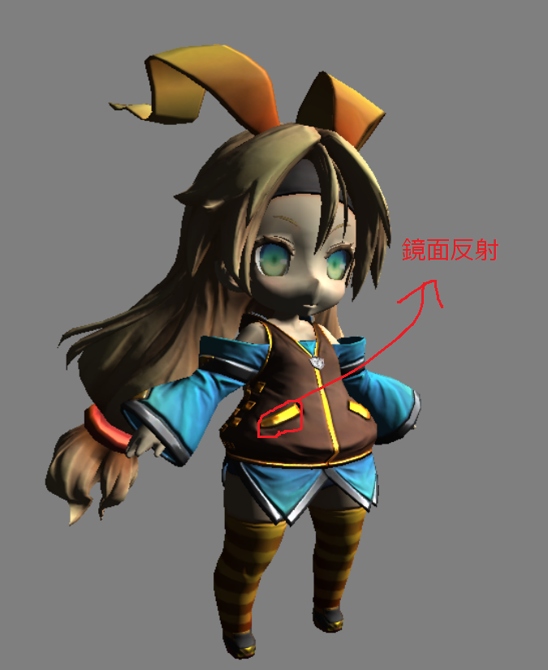

## はじめに
このチャプターでは、次のサンプルプログラムを利用します。ダウンロードをしてください。</br>
**[Sample_06_02.zip](https://drive.google.com/file/d/1WSEXWep_WreomN64RSo_5_Gsg5aSXuqo/view?usp=sharing)**</br>

## 6.2 スペキュラマップ
スペキュラマップは鏡面反射の強さを描き込んだテクスチャです。Chapter5で金属のような質感を表現するための鏡面反射について学びました。しかし、Chpater5の知識だけですと、図6.10のように人間の肌などのような、鏡面反射があまり発生しないサーフェイスでも鏡面反射が発生していまいます。</br>
**図6.10**</br>
</img></br>
このような問題を解決するために使用されるのがスペキュラマップと呼ばれるテクスチャです。図6.11はユニティちゃんのスペキュラマップです。</br>

**図6.11**</br>
</img></br>
スペキュラマップは下記のようにグレースケールのテクスチャになっていることが多く、白(255,255,255)に近づくほど、反射が強くなります(注意：ユニティちゃんのスペキュラマップはαチャンネルに衣服の金具の部分のみを鏡面反射させることができるデータが入っていたので、今回はそちらを使用しています)。図6.12はユニティちゃんのディフューズマップとスペキュラマップを２枚並べたものです。ちょうど、衣服の金具に当たる部分に鏡面反射の強さが描きこまれていることが分かると思います。</br>

**図6.12**</br>
</img></br>

### 6.2.1 【ハンズオン】スペキュラマップを利用したライティング実装
スペキュラマップの利用は非常に簡単ですので、早速ハンズオンでスペキュラマップの利用を実装してみましょう。`Sample_06_02/Sample_06_02.sln`を立ち上げてください。このサンプルを実行すると図6.13のような、人肌にまで鏡面反射が起きているプログラムが実行できると思います。

**図6.13**</br>
</img></br>

では、スペキュラマップを利用して、狙った個所に鏡面反射を起こせるようにプログラムを改造していきましょう。

#### step-1 スペキュラマップにアクセスするための変数を追加。
今回のサンプルも必要なデータはすべてGPUでアクセスできるようになっているので、最初からシェーダー側を改造していきます。`Assets/shader/sample.fx`を開いてください。まずはスペキュラマップにアクセスするための変数を追加します。今回はt2レジスタにスペキュラマップはバインドされています。リスト6.9のプログラムを入力して下さい。</br>
[リスト6.9 `sample.fx`]
```cpp
//step-1 スペキュラマップにアクセスするための変数を追加。
Texture2D<float4> g_specularMap : register(t2);
```

#### step-2 スペキュラマップから鏡面反射の強さをサンプリング。
続いてピクセルシェーダーを改造していきます。先ほど追加したスペキュラマップの変数を利用して、鏡面反射の強さをサンプリングします。リスト6.10のプログラムを入力してください。</br>
[リスト6.10 `sample.fx`]
```cpp
//step-2 スペキュラマップからスペキュラ反射の強さをサンプリング。
float specPower = g_specularMap.Sample(g_sampler, psIn.uv).a;
```
ユニティちゃんのスペキュラマップはαチャンネルに金具の鏡面反射の強さが描きこまれていたので、αチャンネルを利用しています。

#### step-3 鏡面反射の強さを鏡面反射光に乗算する。
では、これで最後のハンズオンです。反射の強さを鏡面反射光に乗算しましょう。鏡面反射光はすでに計算済みで、spceLig	という変数に記憶されています。リスト6.11のプログラムを入力してください(注意：今回は鏡面反射を分かりやすくするために、反射光を10倍しています)。</br>
[リスト6.11 `sample.fx`]
```cpp
//step-3 鏡面反射の強さを鏡面反射光に乗算する。
specLig *= specPower * 10.0f;
```
入力出来たら実行してみてください。うまく実装出来ていると図6.13のように金具の部分だけ鏡面反射が起きるようになっているはずです。</br>
**図6.14**</br>
</img></br>

## 評価テスト
次の評価テストを行いなさい。</br>
[評価テストへジャンプ](https://docs.google.com/forms/d/e/1FAIpQLScDp5NiLcxXIS7q0YtarOsU0YfbB57xNSVzXEugqh7OD-wKqg/viewform?usp=sf_link)