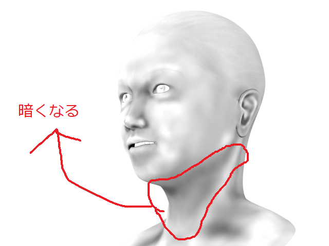
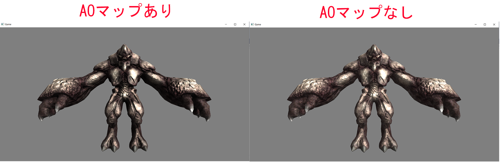

## はじめに
このチャプターでは、次のサンプルプログラムを利用します。ダウンロードをしてください。</br>
**[Sample_06_03.zip](https://drive.google.com/file/d/1oSh9wOBRMZEJGlo19XSNMfR_CYEmA-6P/view?usp=sharing)**</br>

## 6.3 アンビエントオクルージョンマップ
アンビエントオクルージョンマップは環境光の強さを表すテクスチャです。Chapter5で「物体は一律で同じ間接光を受けている」という大胆に近似した環境光について学びました。しかし、環境光というのは影響を受けやすい箇所と受けにくい箇所というものがあります。例えば人間であれば、図6.15のように顎の下の首元あたりは、顎によって周囲の光が遮断されます。</br>
**図6.15**</br>
</img></br>
しかし、Chapter5で説明したように、環境光を真面目に計算するのは非常に負荷の高い処理になります。そこで、ゲームでは、事前にテクスチャに環境光の強さを描きこんでおき、それを利用する方法がよく活用されています。このテクスチャがアンビエントオクルージョンマップと呼ばれるものです。

### 6.3.1 【ハンズオン】アンビエントオクルージョンマップを利用したライティング実装
アンビエントオクルージョンマップを利用したライティングも非常に簡単ですので、早速ハンズオンで実装していきましょう。`Sample_06_03/Sample_06_03.sln`を立ち上げてください。

#### step-1 アンビエントオクルージョンマップにアクセスするための変数を追加。
今回のサンプルも必要なデータはすべてGPUでアクセスできるようになっているので、最初からシェーダー側を改造していきます。`Assets/shader/sample.fx`を開いてください。まずはアンビエントオクルージョンマップにアクセスするための変数を追加します。今回はt10レジスタにアンビエントオクルージョンマップはバインドされています。リスト6.12のプログラムを入力して下さい。</br>
[リスト6.12 `sample.fx`]
```cpp
//step-1 アンビエントオクルージョンマップにアクセスするための変数を追加。
Texture2D<float4> g_aoMap : register(t10);
```

#### step-2 アンビエントオクルージョンマップから環境光の強さをサンプリング
続いてピクセルシェーダーを改造していきます。先ほど追加したアンビエントオクルージョンマップの変数を利用して、環境光の強さをサンプリングします。リスト6.13のプログラムを入力してください。</br>
[リスト6.13 `sample.fx`]
```cpp
//step-2 アンビエントオクルージョンマップから環境光の強さをサンプリング
float ambientPower = g_aoMap.Sample(g_sampler, psIn.uv);
```

#### step-3 環境光の強さを環境光に乗算する。
では、これで最後のハンズオンです。環境光の強さを環境光に乗算しましょう。リスト6.13のプログラムを入力してください。
[リスト6.14 `sample.fx`]
```cpp
//step-3 環境光の強さを環境光に乗算する。
ambient *= ambientPower;
```
これでハンズオンは終了です。ほとんどスペキュラマップと同じような考え方で簡単だったのではないかと思います。では、実行してみてください。分かりにくいかもしれませんが、図6.16のAOマップありの画像のように、顎下や腕の下側などの環境光が弱くなっていることを確認してください。</br>
**図6.16**</br>
</img></br>

