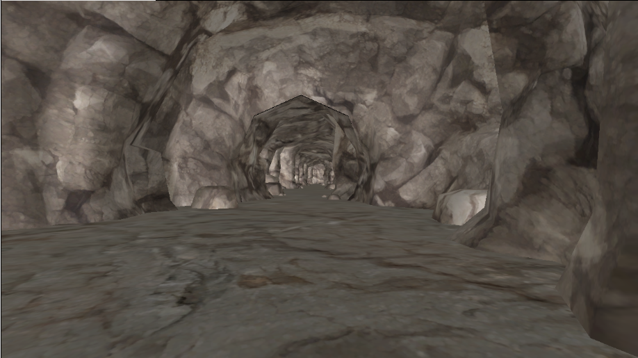
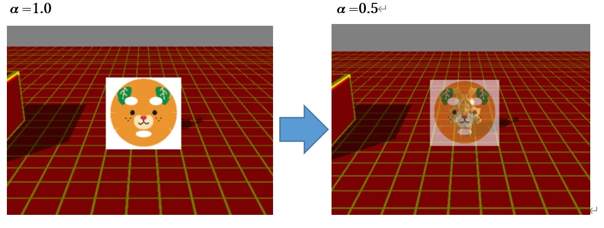

## はじめに
このチャプターでは、次のサンプルプログラムを利用します。ダウンロードをしてください。</br>
**[Sample_08_02.zip](https://drive.google.com/file/d/1lXikdQ36n8QlQGa8oOzAmHLc2SVqIrUU/view?usp=sharing)**</br>
**[Sample_08_03.zip](https://drive.google.com/file/d/1H5kgeyiZHu8BxyMWdCV145YBnKttO_kn/view?usp=sharing)**</br>

---
## 8.2 アルファブレンディング
この節では半透明合成や、加算合成を行うために必要なαブレンディングについて説明します。アルファブレンディングを理解することで、窓ガラスなどの半透明な物体の描画や、光り輝くエフェクトの描画などを行うことができます。
### 8.2.1 アルファブレンディングとは
アルファブレンディングとは、ピクセルシェーダーで計算されたカラー(RGBA)をカラーバッファ(ここでは画面に表示される絵だと考えてください。)にどのように描き込むのかを指定するものとなります。その描き込みの際にアルファ値を使用して描き込む方法を決定するため、アルファブレンディングと言われます。このチャプターでは代表的なアルファブレンディングの、半透明合成と加算合成を見ていこうと思います。例えば次の順番でモデルを描画するケースを考えてみてください。</br>

1. 地面を描画
2. キャラクターを描画

地面を描画した後で、キャラクターを描画しています。この場合、先に地面の絵がカラーバッファに書き込まれます(図8.2)。</br>
**図8.2**</br>
</img></br>
その後でキャラクターがカラーバッファに書き込まれます(図8.3)。</br>

**図8.3**</br>
</img></br>
この時、キャラクターが描画されたことによって、地面のカラーは上書きされてしまっています。ここがポイントです。では、色付きガラスなどの半透明のオブジェクトを描画したい場合はどうしたらいいのでしょうか？このようなオブジェクトを描画するときは、すでに描き込まれているカラーと、これから描き込もうとしているカラーを混ぜ合わせる必要があります(図8.2)。このカラーを合成することをアルファブレンディングといいます。DirectX12では様々なブレンドステートを作成することで、様々なブレンディング方法を指定することができます。では、次の節から代表的なアルファブレンディングの半透明合成と加算合成を見ていきましょう。

### 8.2.2 半透明合成
アルファブレンディングにおいて、これから描きこもうとしているカラーをソースカラーといいます。そして既にカラーバッファに描きこまれているカラーのことをデスティネーションカラーといいます。半透明合成はソースカラーのアルファ値を使用してソースカラーとデスティネーションカラーを混ぜ合わせることで実現されています。半透明合成の計算式は次のようになります。</br>
ソースカラー：SRC</br>
ディスティネーションカラー : DEST</br>
ソースカラーのα値 : SRC_αとしたとき、</br>
**描き込まれるカラー = SRC　×　SRC_α + DEST + ( 1 - SRC_α )**</br>
αは0～1の値をとります。αの値が1だと不透明、0.5だと半透明で合成されます(図8.4)。</br>
**図8.4**
</img></br>
半透明合成は、合成を行うためのブレンディングステートをパイプラインステートに設定することで行うことができます。

### 8.2.3 【ハンズオン】半透明で2Dを描画する。
では、半透明で2Dを描画してみましょう。以降の2D描画には、著者が用意した、Spriteクラスを利用して2Dを描画していきます。

#### step-1 Spriteクラスのオブジェクトを初期化する。
まずはSpriteクラスのオブジェクトを定義して初期化します。`Sample_08_02/Sample_08_02.sln`を立ち上げてmain.cppの35行目にリスト8.11のプログラムを入力してください。</br>
[リスト8.11 main.cpp]
```cpp
//step-1 Spriteクラスのオブジェクトを初期化する。

//まずはSpriteクラスの初期化オブジェクト作成する。
SpriteInitData spriteInitData;
//テクスチャのファイルパスを指定。
spriteInitData.m_ddsFilePath[0] = "Assets/image/test.dds";
//シェーダーファイルのパスを指定。
spriteInitData.m_fxFilePath = "Assets/shader/sample2D.fx";
//スプライトの幅と高さを指定。
spriteInitData.m_width = 128.0f;
spriteInitData.m_height = 128.0f;
//アルファブレンディングモードを半透明にして設定。
spriteInitData.m_alphaBlendMode = AlphaBlendMode_Trans;

//Spriteクラスのオブジェクトを定義して初期化する。
Sprite test2D;
//Init()に初期化オブジェクトを渡し２Ｄ期化する。
test2D.Init(spriteInitData);
```
`Sprite::Init()`の中で、２Ｄを表示するための頂点バッファ、インデックスバッファ、パイプラインステートの作成などが行われています。Spriteクラスの初期化オブジェクトに半透明合成の設定を行っていることに注目してみてください。`Sprite::Init()`の中で、m_alphaBlendModeの値を見て、半透明合成のステートを設定しています。この設定のプログラムは`MiniEngine/Sprite.cpp`の136行目に記載されています。次のプログラムを見てみてください。

```cpp
if (initData.m_alphaBlendMode == AlphaBlendMode_Trans) {
	//半透明合成のブレンドステートを作成する。
	//αブレンディングを有効にする。
	psoDesc.BlendState.RenderTarget[0].BlendEnable = true;
	//ソースカラーはソースアルファを掛け算する。
	psoDesc.BlendState.RenderTarget[0].SrcBlend = D3D12_BLEND_SRC_ALPHA;
	//ディステヒネーションカラーに1-ソースアルファを掛け算する。
	psoDesc.BlendState.RenderTarget[0].DestBlend = D3D12_BLEND_INV_SRC_ALPHA;
	//ソースカラーとディスティネーションカラーを足し算する。
	psoDesc.BlendState.RenderTarget[0].BlendOp = D3D12_BLEND_OP_ADD;
}
```
### step-2 スプライトのドローコールを実行する。
Spriteクラスのオブジェクトの初期化ができたので、次は`Sprite::Draw()`を利用して、スプライトのドローコールを実行しましょう。リスト8.12のプログラムを入力してください。</br>
[リスト8.12 main.cpp]
```cpp
//step-2 スプライトのドローコールを実行する。
test2D.Draw(renderContext);
```

### step-3 ピクセルシェーダーから出力するαを変更する。
続いて、シェーダー側を改造します。半透明合成を行うためには、ピクセルシェーダーから出力するアルファを変更する必要があります。`Assets/shader/sample2D.fx`を開いて、リスト8.13のプログラムを入力してください。
[リスト8.13 sample2D.fx]
```cpp
//step-3 ピクセルシェーダーから出力するαを変更する。
//不透明度0.4で出力する。
color.a = 0.4f;
```
入力出来たら実行してみて下さい。図8.5のように半透明で2Dが描画されていたら完成です。</br>
**図8.5**
</img></br>


### 8.2.4 【ハンズオン】加算合成で2Dを描画する。
#### step-1 加算合成の設定で描画する。
では、このチャプターの最後に加算合成で2Dを描画するハンズオンを行いましょう。Spriteクラスを利用して加算合成を行うには、Spriteクラスのオブジェクトを初期化するときの設定を変更するだけです。`Sample_08_03/Sample_08_03.sln`を立ち上げて、main.cppのにリスト8.13を入力して下さい。</br>
[リスト8.13 main.cpp]
```cpp
//step-1 加算合成の設定で描画する。
spriteInitData.m_alphaBlendMode = AlphaBlendMode_Add;
```
先ほどの半透明描画の時と同じく、`Sprite::Init()`の中で、m_alphaBlendModeの値を見て加算合成の設定を行っています。この設定のプログラムは`MiniEngine/Sprite.cpp`の143行目～記載されています。次のプログラムを見てみてください。
```cpp
else if (initData.m_alphaBlendMode == AlphaBlendMode_Add) {
	//加算合成。
	psoDesc.BlendState.RenderTarget[0].BlendEnable = true;
	psoDesc.BlendState.RenderTarget[0].SrcBlend = D3D12_BLEND_ONE;
	psoDesc.BlendState.RenderTarget[0].DestBlend = D3D12_BLEND_ONE;
	psoDesc.BlendState.RenderTarget[0].BlendOp = D3D12_BLEND_OP_ADD;
}
```
## 評価テスト-5
次の評価テストを行いなさい。</br>
[評価テストへジャンプ](https://docs.google.com/forms/d/e/1FAIpQLSeSCZ8aEoX51Ft3dvpYWQUh9N1iL6MM-wR6YHBk_vDrFTshsw/viewform?usp=sf_link)