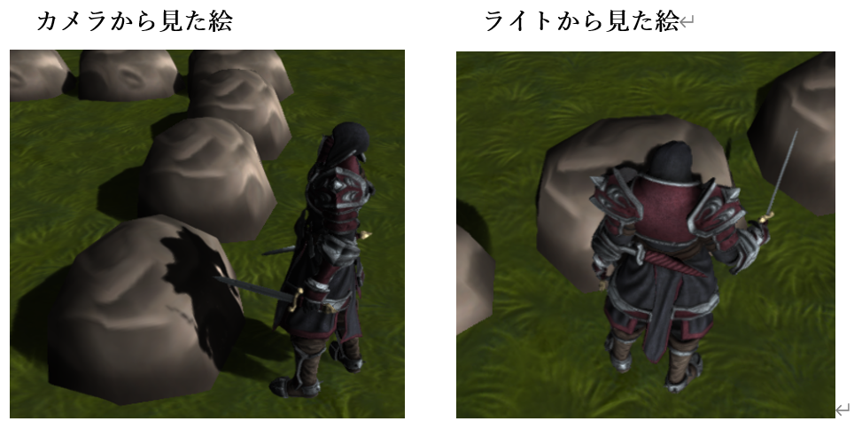
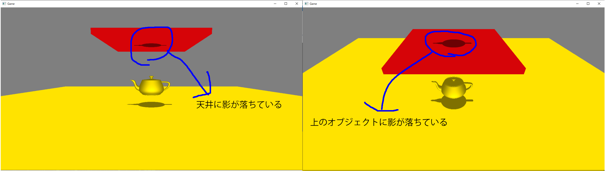
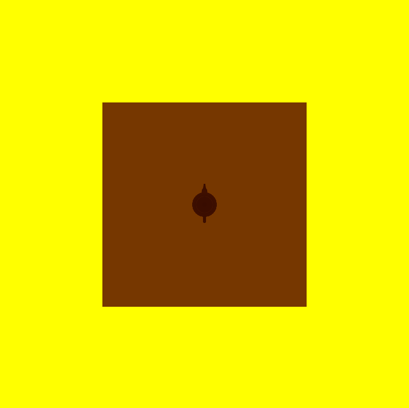
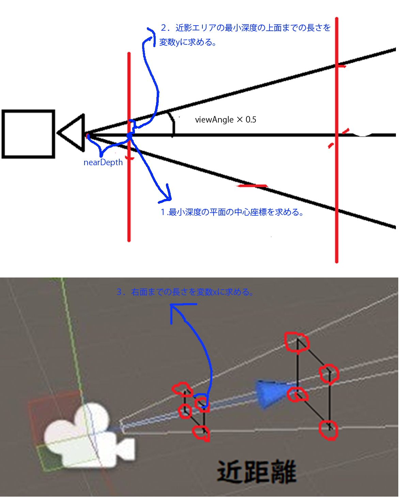
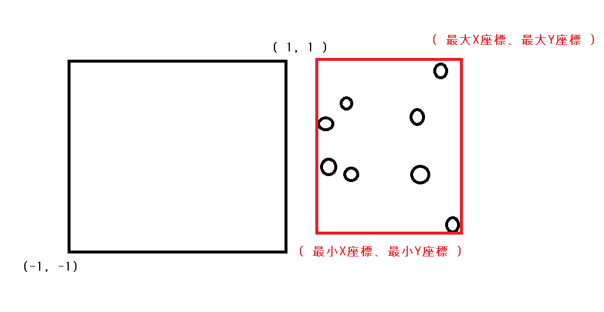
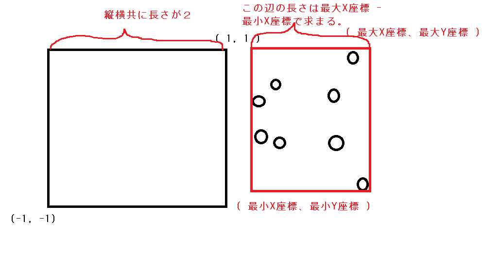
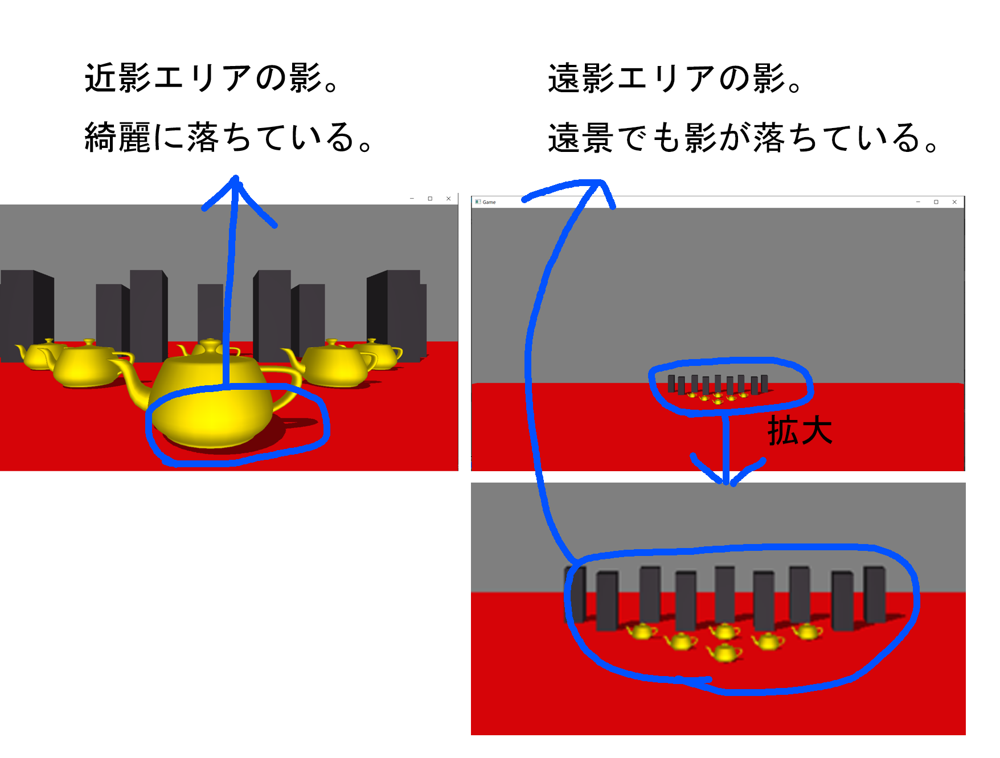

# Chapter 11 シャドウイング
## 11.1 投影シャドウ
３Ｄゲームにおいて、リアルなグラフィックを実現するために影は非常に重要な要素になります。また、グラフィック面だけではなく、影は３Ｄオブジェクトの空間上の位置をユーザーに教えるための重要な要素となります。このチャプターでは、基本となる古典的な影生成アルゴリズムの投影シャドウについて見ていきます。
### 11.1.1 シャドウマップ
投影シャドウはシャドウマップと呼ばれるテクスチャを使用して、影を落とすアルゴリズムの一つになります。シャドウマップというのは影が落ちる場所がテクスチャに描きこまれたものとなります。下の図を見てみて下さい。図11.1を見てください。</br>
**図11.1**</br>
</img></br>
このように、影というのは物体によって光が遮られている箇所に発生するものだということが分かります。これは言い方を変えると、光を放っているライトの位置から見たときに、手前に物体が存在していれば影が落ちると言うことができます。図11.2を見てみて下さい。</br>

**図11.2**</br>
</img></br>
キャラクターの影が岩に落ちているのが分かります。では、これをライトの方向から見た場合はどうなるでしょうか？図11.3を見てください。

**図11.3**</br>
</img></br>
このように、ライトの位置から見てみると、影が落ちていた岩の部分は、キャラクターに遮られていることが分かります。このライトから見た絵がシャドウマップです。</br>


### 11.1.2 【ハンズオン】シャドウマップを作ってみる
では、早速ハンズオンでシャドウマップを作っていましょう。シャドウマップというのは、ライトから見た絵です。勘のいい人ならすでに気付いているかもしれませんが、シャドウマップは、これはチャプター10で勉強したオフスクリーンレンダリングを行うことで作成することが出来ます。つまり、ライトをカメラと見立てて影を生成したいオブジェクトを、シャドウマップに対してレンダリングしてやればいいのです。シャドウマップを作成するためのポイントは次の４点です。
1. シャドウマップ描画用のレンダリングターゲットを作成する
2. ライトの位置にカメラを設置する。
3. シャドウマップ描画用のモデルを用意する。
4. 影を生成したいモデルをシャドウマップに描画する。
5. シャドウマップ描画用のピクセルシェーダーを作成する。
では、この４点をハンズオンで実装していきましょう。`Sample_11_01/Sample_11_01.sln`を立ち上げてください。

#### step-1 シャドウマップ描画用のレンダリングターゲットを作成する
まずは。影から見た絵を描画する必要があるので、シャドウマップ描画用のレンダリングターゲットを作成する必要があります。main.cppの23行目にリスト11.1のプログラムを入力してください。</br>
[リスト11.1 main.cpp]
```cpp
//step-1 シャドウマップ描画用のレンダリングターゲットを作成する。
//カラーバッファのクリアカラー
//今回はカラーバッファは真っ白にする。
float clearColor[4] = { 1.0f, 1.0f, 1.0f, 1.0f };
RenderTarget shadowMap;
shadowMap.Create(
	1024,//【注目】レンダリングターゲットの横幅
	1024,//【注目】レンダリングターゲットの縦幅
	1,
	1,
	DXGI_FORMAT_R8G8B8A8_UNORM,
	DXGI_FORMAT_D32_FLOAT,
	clearColor
);
```
レンダリングターゲットの解像度は、影生成のクオリティに影響を与えるので、コメントを記載しています。端的に説明しておくと、シャドウマップの解像度を上げると品質は向上し、下げると品質は低下します。では、単純に解像度をあげればいいのかというと、そういう訳でもなく、解像度を上げると影の品質は上がりますが、パフォーマンスは低下することとなります。

#### step-2 ライトの位置にカメラを設置する
続いて、ライトから見た絵をシャドウマップに描画するのでライトカメラを準備します。ライトカメラはライトの位置置、方向などの情報からカメラを設定します。リスト11.2のプログラムをmain.cppに入力してください。</br>
[リスト11.2 main.cpp]
```cpp
//step-2 影描画用のライトカメラを作成する。
Camera lightCamera;
//カメラの位置を設定。これはライトの位置。
lightCamera.SetPosition(0, 600, 0);
//カメラの注視点を設定。これがライトが照らしている場所。
lightCamera.SetTarget(0, 0, 0);
//【注目】上方向を設定。今回はライトが真下を向いているので、X方向を上にしている。
lightCamera.SetUp(1, 0, 0);
//今回のサンプルでは画角を狭めにしておく。
lightCamera.SetViewAngle(Math::DegToRad(20.0f));
//ライトビュープロジェクション行列を計算している。
lightCamera.Update();
```
今回のハンズオンはライトが真下を向いているので、カメラの上方向に{0, 1, 0}を指定すると、計算がおかしくなってしまうため、X方向を真上にしています。

#### step-3 シャドウマップ描画用のモデルを用意する。
続いて、シャドウマップ描画用のモデルを定義します。今回のサンプルでは、シャドウマップ描画と通常描画でピクセルシェーダーが異なるため、ティーポットのモデルはシャドウマップ描画用と通常描画用の２種類を用意しています。リスト11.3のプログラムをmain.cppに入力してください。</br>
[リスト11.3 main.cpp]
```cpp
//step-3 シャドウマップ描画用のモデルを用意する。
ModelInitData teapotShadowModelInitData;
//【注目】シャドウマップ描画用のシェーダーを指定する。
teapotShadowModelInitData.m_fxFilePath = "Assets/shader/sampleDrawShadowMap.fx";
teapotShadowModelInitData.m_tkmFilePath = "Assets/modelData/teapot.tkm";
Model teapotShadowModel;
teapotShadowModel.Init(teapotShadowModelInitData);
teapotShadowModel.UpdateWorldMatrix(
	{ 0, 50, 0 },
	g_quatIdentity,
	g_vec3One
);
```

#### step-4 影を生成したいモデルをシャドウマップに描画する。
cpp側最後のハンズオンです。影を生成したモデルをシャドウマップに描画しましょう。リスト11.4のプログラムをmain.cppに入力してください。</br>
[リスト11.4 main.cpp]
```cpp
//step-4 影を生成したいモデルをシャドウマップに描画する。
//レンダリングターゲットをシャドウマップに変更する。
renderContext.WaitUntilToPossibleSetRenderTarget(shadowMap);
renderContext.SetRenderTargetAndViewport(shadowMap);
renderContext.ClearRenderTargetView(shadowMap);

//影モデルを描画。
teapotShadowModel.Draw(renderContext, lightCamera);

//書き込み完了待ち。
renderContext.WaitUntilFinishDrawingToRenderTarget(shadowMap);
```

#### step-5 シャドウマップ描画用のピクセルシェーダーを作成する。
では、最後のハンズオンです。今回のハンズオンでシャドウマップに描き込むカラーはグレースケール(灰色)である必要があります。そこで、シャドウマップ描画用のピクセルシェーダーを実装しましょう。Assets/shader/sampleDrawShadowMap.fxの46行目にリスト11.5のプログラムを入力してください。</br>
[リスト11.5 sampleDrawShadowMap.fx]
```cpp
//step-5 シャドウマップ描画用のピクセルシェーダーを作成する。
return float4( 0.5f, 0.5f, 0.5f, 1.0f);
```
ここまで実装できたら、実行してみてください。うまく実装できていると図11.4のようなプログラムが実行できます。</br>
**図11.4**</br>
</img></br>
ここまでの実装はシャドウマップを作成しただけなので、まだ投影シャドウの実装の半分です。ですので、まだ影は落ちません。今回のサンプルではシャドウマップが作成できていることを確認するために、画面の左上に描画されたシャドウマップを表示しています。図11.4と同じようなシャドウマップが作れているか確認してください。

### 11.1.3 シャドウマップの貼り付け
前節でグレースケールのシャドウマップが作成できました。これで投影シャドウに使用するシャドウマップは完成したことになります。あとは、影を受けたいオブジェクトにシャドウマップを張り付けてやればよいことになります。では、どうやって張り付けるのか見ていきましょう。例えば図11.5絵の岩を画面に描画する際は、岩の頂点座標×ワールド行列×カメラ行列×射影行列という計算を行ってスクリーン座標系に変換します。</br>
**図11.5**</br>
</img></br>

シャドウマップを張り付ける場合は、先ほどの変換とは別に岩の頂点座標×ワールド行列×ライトカメラ行列×ライト射影行列という計算を行って、ライトをカメラと見立てたスクリーン座標系への変換も行う必要があります。つまり岩に影を落とす場合、図11.6の２パターンの座標変換を行うことになります。</br>
**図11.6**</br>
</img></br>
では、具体的にコードを見ていきましょう。次のコードは２パターンの座標変換を行っている頂点シェーダーの疑似コードです。</br>

```cpp
/// <summary>
/// 影が落とされる3Dモデル用の頂点シェーダー。
/// </summary>
SPSIn VSMain(SVSIn vsIn)
{
	//シャドウレシーバー用の頂点シェーダーを実装。
	SPSIn psIn;
	//ここは通常の座標変換
	float4 worldPos = mul(mWorld, vsIn.pos);
	psIn.pos = mul(mView, worldPos);
	psIn.pos = mul(mProj, psIn.pos);
	psIn.uv = vsIn.uv;

	//ここからライトビュースクリーン空間での座標を計算している。
	psIn.posInLVP = mul( mLVP, worldPos);
	psIn.normal = mul(mWorld, vsIn.normal);
	return psIn;
}
```
psIn.posInLVPというパラメータにライトビュースクリーン空間での座標が記録されており、この値がピクセルシェーダーに渡されています。
#### 11.1.3.1 正規化スクリーン座標系
では、ここで頂点シェーダーで変換されている、スクリーン空間の座標系というのがどのような座標系になっているかみてみましょう。例えば図11.7のように描画された場合、頂点座標は縦横-1.0～1.0の座標系に変換されています。</br>
**図11.7**</br>
</img></br>
このように、画面の左下が( -1, -1 )、画面の右上が( 1, 1 )となっている座標系が正規化スクリーン座標系と呼ばれます。実は、これまでの頂点シェーダーで行っていた変換は、最終的に正規化スクリーン座標系に変換していたのです。これがシャドウマップを張り付ける際に重要になってきますので、しっかりと抑えておいてください。

#### 11.1.3.2  正規化スクリーン座標系からUV座標系に変換
では、シャドウマップの貼り付けの話に戻りましょう。先ほど頂点シェーダーで影を受けたいオブジェクトの頂点座標にライトビュープロジェクション行列を乗算して、正規化スクリーン座標系に変換を行いました。そうすると岩のオブジェクトは図11.8のような座標系に変換されます。</br>
**図11.8**</br>
</img></br>

仮にこの人間のキャラクターがシャドウマップに描画されている場合は図11.9のようなシャドウマップが生成されています。
**図11.9**</br>
</img></br>
図11.8と図11.9を見比べてみると、座標の範囲の違いはありますが、岩に影が落ちる部分はシャドウマップにマッピングするとちょうど灰色になっていることが分かります。つまり、ライトビュープロジェクション行列で変換した座標(-1～1)を、UV座標(0～1)に変換して、それを使って岩にシャドウマップを張り付けてやればうまくいきそうです。次のコードは座標変換の疑似コードです。</br>

```cpp
//正規化スクリーン座標系( -1～1 )の範囲に0.5をかけて( -0.5～0.5 )の範囲にする。
//yの値が-0.5なのは、上下が逆だから。
float2 shadowMapUV = psIn.posInLVP.xy * float2( 0.5f, -0.5f);
//( -0.5～0.5 )の範囲に0.5を足し算することで、( 0.0～1.0 )の範囲にする。
shadowMapUV += 0.5f; 
```
あとは、計算されたUV座標を利用して、シャドウマップからカラーをサンプリングしてやれば影を落とすことができます。

### 11.1.4 【ハンズオン】シャドウマップを使って影を落とす。
では、シャドウマップを貼り付けるプログラムを実装していきましょう。Sample_11_02/Sample_11_02.slnを立ち上げてください。

#### step-1 影を受ける背景モデルを初期化。
まずは、影を落とされるモデルを初期化します。影を受けるモデルは、座標変換とシャドウマップからのカラーのサンプリングが必要になるので、シェーダーが通常のモノとは異なります。また、ライトビュースクリ�������ン空間に変換を行う必要があるため、座標変換を行うための行列を定数バッファに設定しています。main.cppの71行目にリスト11.6のプログラムを入力してください。</br>

[リスト11.6 main.cpp]
```cpp
//step-1 影を受ける背景モデルを初期化。
ModelInitData bgModelInitData;
//影が落とされるモデル用のシェーダーを指定する。
bgModelInitData.m_fxFilePath = "Assets/shader/sampleShadowReciever.fx";
//シャドウマップを拡張SRVに設定する。
bgModelInitData.m_expandShaderResoruceView[0] = &shadowMap.GetRenderTargetTexture();
//ライトビュープロジェクション行列を拡張定数バッファに設定する。
bgModelInitData.m_expandConstantBuffer = (void*)&lightCamera.GetViewProjectionMatrix();
bgModelInitData.m_expandConstantBufferSize = sizeof(lightCamera.GetViewProjectionMatrix());
bgModelInitData.m_tkmFilePath = "Assets/modelData/bg/bg.tkm";

Model bgModel;
bgModel.Init(bgModelInitData);
```

#### step-2 影を受ける背景を描画。
続いて、影を受けるモデルを描画します。この描画は通常の描画パスです。main.cppにリスト11.7のプログラムを入力してください。</br>
[リスト11.7 main.cpp]
```cpp
//step-2 影を受ける背景を描画。
bgModel.Draw(renderContext);
```
#### step-3 ライトビュープロジェクション行列にアクセする定数バッファを定義。
step-3からは影を受けるモデル用のシェーダーのプログラムになります。まずは、ライトビュープロジェクション行列にアクセスするための定数バッファを定義しましょう。`Assets/shader/sampleShadowReciever.fx`を開いて、11行目にリスト11.8のプログラムを入力してください。</br>

[リスト11.8 sampleShadowReciever.fx]
```cpp
//step-3 ライトビュープロジェクション行列にアクセする定数バッファを定義。
cbuffer ShadowCb : register(b1){
	float4x4 mLVP;
};

```
#### step-4 ライトビュースクリーン空間でのピクセルの座標を追加。
続いて、ピクセルシェーダーへの入力にライトビュースクリーン空間でのピクセルの座標を追加します。リスト11.9のプログラムを入力してください。</br>
[リスト11.9 sampleShadowReciever.fx]
```cpp
//step-4 ライトビュースクリーン空間でのピクセルの座標を追加。
float4 posInLVP		: TEXCOORD1;	//ライトビュースクリーン空間でのピクセルの座標
```

#### step-5 ライトビュースクリーン空間の座標を計算する。
step-5では、頂点シェーダーでのライトビュースクリーン空間への座標変換を実装します。リスト11.10のプログラムを入力してください。</br>
[リスト11.10 sampleShadowReciever.fx]
```cpp
//step-5 ライトビュースクリーン空間の座標を計算する。
psIn.posInLVP = mul( mLVP, worldPos);
```

#### step-6 ライトビュースクリーン空間からUV空間に座標変換。
続いてピクセルシェーダーです。まず、頂点シェーダーから渡された、ライトビュースクリーン空間の座標をUV空間に変換しましょう。リスト11.11のプログラムを入力してください。</br>

[リスト11.11 sampleShadowReciever.fx]
```cpp
//step-6 ライトビュースクリーン空間からUV空間に座標変換。
//【注目】ライトビュースクリーン空間からUV座標空間に変換している。
float2 shadowMapUV = psIn.posInLVP.xy / psIn.posInLVP.w;
shadowMapUV *= float2( 0.5f, -0.5f);
shadowMapUV += 0.5f; 
```
ここで一点注意点として、psIn.posInLVP.xyの値をpsIn.posInLVP.wで除算しています。これはまだ説明していませんが、実は正規化スクリーン座標系というのは、wで割り算することで、(-1～1)の範囲に収まることとなります。この数学的な原理の話については本書では詳しくは説明しません。本書では、wで除算することで、正規化スクリーン座標系に変換されるということを覚えておいてくれれば十分です。
#### step-7 計算したUV座標を使って、シャドウマップから影情報をサンプリング。
UV座標を計算することができたら、シャドウマップから影情報をサンプリングしましょう。リスト11.12のプログラムを入力してください。</br>
[リスト11.12 sampleShadowReciever.fx]
```cpp
//step-7 計算したUV座標を使って、シャドウマップから影情報をサンプリング
float3 shadowMap = 1.0f; 
if( shadowMapUV.x > 0.0f && shadowMapUV.x < 1.0f
	&& shadowMapUV.y > 0.0f && shadowMapUV.y < 1.0f
){
	shadowMap = g_shadowMap.Sample(g_sampler, shadowMapUV);
} 
```
UV座標がUV空間の範囲内の場合だけ、シャドウマップからカラーをサンプリングしています。シャドウマップに描画できる範囲というのは、有限なので、範囲外の場所に影を落とすことはできません。

#### step-8 サンプリングした影情報をテクスチャカラーに乗算する。
では、最後のハンズオンです。影情報をサンプリングできたら、そのカラーをテクスチャカラーに掛け算しましょう。リスト11.13のプログラムを入力してください。</br>
[リスト11.13 sampleShadowReciever.fx]
```cpp
//step-8 サンプリングした影情報をテクスチャカラーに乗算する。
//テクスチャカラーにシャドウマップからサンプリングした情報を掛け算する。
//影が描き込まれていたら0.5になっているので、色味が落ちて影っぽくなる。
color.xyz *= shadowMap;
```

シャドウマップは1.0でクリアされています。また、影が落ちる箇所には、灰色(0.5, 0.5, 0.5)が格納されています。そのため、影が落ちていなければ1.0が乗算されるため、何も変化が起きず、影が落ちている箇所は0.5が乗算されるため、色味が暗くなります。実装出来たら実行してください。うまく実装できていると図11.10のようなプログラムが実行できます。</br>
**図11.10**</br>
</img></br>

## 11.2 デプスシャドウ
11.2では投影シャドウを進化させたデプスシャドウ技法について見ていきましょう。
### 11.2.1 投影シャドウの欠点
11.1でシンプルな影生成技法の投影シャドウについて見ていきました。シンプルな考え方でリアルな影を生成することができるため、今でもゲームによっては採用されることがある影生成技法です。しかし、投影シャドウには次のような欠点があります。

1. 影が落ちないはずの場所に影が落ちてしまう。
2. セルフシャドウが行えない。

投影シャドウは単純にモデルにシャドウマップを貼り付けているだけなので、図11.11のように本来影が落ちない場所に影が落ちてしまいます。</br>
**図11.11**</br>
</img></br>
これと同様の原因として、自分自身に影を落とすセルフシャドウも行うことができません。今回のケースで言えば、ティーポットにティーポット自身の影を落とすことができないということです。デプスシャドウ技法を使うと、これらの問題を解決することができます。

<note>

`Sample_11_03/ShadowProjection/Game.exe`を実行すると、投影シャドウの問題点について確認することができるので、こちらも試してみてください。コントローラーの左スティックの入力でカメラを動かすことができます。

</note>

### 11.2.2 デプスシャドウとは
デプスシャドウは投影シャドウの考え方を発展させたものとなります。アルゴリズム的にもシャドウマップを作成して、それを利用して影を落とすという処理になるため、投影シャドウととてもよく似ています。投影シャドウとの違いは、シャドウマップに描き込む値が、グレースケールではなく、ライトスクリーン空間でのZ値を描き込むというて点です。Z値、ライトスクリーン空間での深度値、デプスを描き込むめ、デプスシャドウと呼ばれます。デプスシャドウは「影はライトの光が遮られている場所に落ちるはずなので、影が落ちる箇所には、手前に遮蔽物があるはず」という考え方から影を落とします(図11.12)。</br>
**図11.12**</br>
</img></br>

モデルを描画する際に、シャドウマップに描き込まれた深度値を使って、ピクセルが遮蔽されているかどうかを判定します。
### 11.2.3【ハンズオン】デプスシャドウを実装する。
では、Sample_11_03/Sample_11_03.slnを改造して、デプスシャドウを実装しましょう。実装は投影シャドウを少し改造するだけです。今回は投影シャドウから改造した点に注目して実装を行っていきます。

#### step-1 シャドウマップ描画用のレンダリングターゲットを作成する。
まずは、シャドウマップ描画用のレンダリングターゲットを作成します。変更点はカラーバッファのフォーマットです。今回は数値の精度が欲しかったのと、深度情報のみを描き込むため、G(緑)B(青)A(α)の成分は不要なので、R(赤)のみの32bit浮動小数点フォーマットにしています。では、main.cppの36行目にリスト11.14のプログラムを入力してください。</br>
[リスト11.14 main.cpp]
```cpp
//step-1 シャドウマップ描画用のレンダリングターゲットを作成する。
float clearColor[4] = { 1.0f, 1.0f, 1.0f, 1.0f };
RenderTarget shadowMap;
shadowMap.Create(
	1024, 
	1024, 
	1, 
	1, 
	//【注目】シャドウマップのカラーバッファのフォーマットを変更している。
	DXGI_FORMAT_R32_FLOAT,
	DXGI_FORMAT_D32_FLOAT,
	clearColor
);
```

#### step-2 シャドウマップに描画するモデルを初期化する。
続いて、シャドウマップに描画するモデルの初期化処理を実装します。ここでの変更点もカラーバッファのフォーマットの変更に起因するものです。DirectX12では、ドローコールを実行する際にパイプラインステートというものを指定する必要があるのですが、このパイプラインステートの設定に、描き込むカラーバッファのフォーマットというものがあります。この設定のための変更があります。main.cppにリスト11.15のプログラムを入力してください。</br>
[リスト11.15 main.cpp]
```cpp
//step-2 シャドウマップに描画するモデルを初期化する。
ModelInitData teapotShadowModelInitData;
//シャドウマップ描画用のシェーダーを指定する。
teapotShadowModelInitData.m_fxFilePath = "Assets/shader/sampleDrawShadowMap.fx";
teapotShadowModelInitData.m_tkmFilePath = "Assets/modelData/teapot.tkm";

//【注目】カラーバッファのフォーマットに変更が入ったので、こちらも変更する。
teapotShadowModelInitData.m_colorBufferFormat[0] = DXGI_FORMAT_R32_FLOAT;

Model teapotShadowModel;
teapotShadowModel.Init(teapotShadowModelInitData);
teapotShadowModel.UpdateWorldMatrix(
	{ 0, 50, 0 },
	g_quatIdentity,
	g_vec3One
);
```
#### step-3 シャドウマップにZ値を描き込む。
step-3はシャドウマップ書き込み用のシェーダー側の変更です。まずは、シャドウマップに書き込む値をライトカメラスクリーン空間でのZ値に変更します。`Assets/shader/sampleDrawShadowMap.fx`の56行目にリスト11.16のプログラムを入力してください。</br>
[リスト11.16 sampleDrawShadowMap.fx]
```cpp
//step-3 シャドウマップにZ値を描き込む。
return float4( psIn.pos.z, psIn.pos.z, psIn.pos.z, 1.0f);
```
ちなみにここでは、psIn.pos.zをpsIn.pos.wで除算していません。これは、SV_POSITIONのセマンティクスが指定されているパラメーターはwで除算済みのデータとして、ピクセルシェーダーに渡されるためです。

#### step-4 ライトビュースクリーン空間でのZ値を計算する。
step-4からは影を受けるモデル用のシェーダーの変更です。まずは、影を受けるモデルのライトビュースクリーン空間でZ値を計算します。`Assets/shader/sampleShadowReciever.fx`の70行目にリスト11.17のプログラムを入力してください。</br>
[リスト11.17 sampleShadowReciever.fx]
```cpp
//step-4 ライトビュースクリーン空間でのZ値を計算する。
float zInLVP = psIn.posInLVP.z / psIn.posInLVP.w;
```

#### step-5 シャドウマップに描き込まれているZ値と比較する。
これで最後です。step-4で描画したいピクセルのライトビュースクリーン空間でのZ値を求めることができたので、シャドウマップに書き込まれているZ値と比較を行って、遮蔽されているようであれば、影を落とすプログラムを実装します。sampleShadowReciever.fxにリスト11.18のプログラムを入力してください。</br>
[リスト11.18 sampleShadowReciever.fx]
```cpp
//step-5 シャドウマップに描き込まれているZ値と比較する。
//計算したUV座標を使って、シャドウマップから深度値をサンプリング
float zInShadowMap = g_shadowMap.Sample(g_sampler, shadowMapUV).r;
if( zInLVP > zInShadowMap ){
	//遮蔽されている。
	color.xyz *= 0.5f;
}
```
ここまで実装出来たら実行してみて下さい。うまく実装できていると、図11.13のようなプログラムが実行できます。ティーポットの上の赤いオブジェクトに影が落ちないようになっているはずです。
**図11.13**</br>
</img></br>


## 11.3 Percentage Closer Filtering(PCF)
この節では、もっとも簡単にソフトシャドウを実現できるPercentage Closer Filtering(PCF)について見ていきます。

### 11.3.1 ソフトシャドウ
ソフトシャドウとは現実世界の影で生じるやわらかい影のことを指しています。現実世界では、影の輪郭付近が薄くなっていき、ぼんやりとした影になります(図11.14)。</br>
**図11.14**</br>
</img></br>
一方、11.2で実装した影はハードシャドウとよばれる、輪郭がくっきりとした影になります(図11.15)。</br>

**図11.15**</br>
</img></br>

### 11.3.2 PCF
PCFはデプスシャド���マップを少し改造するだけで実装出来ます。ほとんどのアルゴリズムはシンプルなデプスシャドウと同じです。違いがあるのは、シャドウレシーバーを描画するときのピクセルシェーダーです。シャドウレシーバーを描画する際にシャドウマップから深度値をサンプリングして、そのピクセルが光源から遮蔽されているかどうかを判定していましたが、PCFではこの深度値のサンプリングを一点だけではなく、複数サンプリングして、その遮蔽状況から、その遮蔽情報からどれだけ遮蔽されているか(遮蔽率)を決定します(図11.16)。</br>

**図11.16**</br>
</img></br>

### 11.3.2.1 PCFのアルゴリズム
PCFのアルゴリズムを疑似コードを見ながら説明していきます。PCFはシャドウマップを作成するまでの処理は、シンプルなデプスシャドウと全く同じです。違う点はシャドウレシーバーを描画するときの影の判定の方法です。PCFでは、まずシャドウマップをつかって、基準テクセルから近傍４テクセルの深度値をサンプリングします(リスト11.19)。</br>

[リスト11.19 疑似コード]
```cpp
//OFFSET_XとOFFSET_Yには1テクセルずらすためのUVオフセットが計算されているとする。
//【注目】基本テクセルから近傍4テクセル深度値を引っ張ってくる。
float zInShadowMap_0 = g_shadowMap.Sample(
	g_sampler, 
	shadowMapUV).r;
float zInShadowMap_1 = g_shadowMap.Sample(
	g_sampler, 
	shadowMapUV + float2( OFFSET_X, 0.0f)).r;
float zInShadowMap_2 = g_shadowMap.Sample(
	g_sampler, 
	shadowMapUV + float2( OFFSET_X, OFFSET_Y)).r;
float zInShadowMap_3 = g_shadowMap.Sample(
	g_sampler, 
	shadowMapUV + float2( 0.0f, OFFSET_Y)
	).r;
```

4つの深度値をサンプリングできたら、これから描画しようとしているピクセルのZ値と、サンプリングしたZ値との比較を行います。遮蔽されている場合はshadowRateという変数に１加算していっていることに注目してください(リスト11.20)。</br>

[リスト11.20 疑似コード]
```cpp
//このピクセルのライトから見た深度値と４つの深度値を比較して遮蔽率を計算する。
float shadowRate = 0.0f;
if( zInLVP > zInShadowMap_0){
	//遮蔽されているので、遮蔽率を１加算。
	shadowRate += 1.0f;
}
if( zInLVP > zInShadowMap_1){
	//遮蔽されているので、遮蔽率を１加算。
	shadowRate += 1.0f;
}
if( zInLVP > zInShadowMap_2){
	//遮蔽されているので、遮蔽率を１加算。
	shadowRate += 1.0f;
}
if( zInLVP > zInShadowMap_3){
	//遮蔽されているので、遮蔽率を１加算。
	shadowRate += 1.0f;
}
```
4つの深度値と比較を行うことができたら、最後にshadowRateを4で割って遮蔽率の平均を求めます。もしこのピクセルが2つのテクセルから遮蔽されていたら、遮蔽率の平均は0.5となります(リスト11.21)。</br>
[リスト11.22 疑似コード]
```cpp
//遮蔽率の平均を計算する。
//4つすべて遮蔽されていたら遮蔽率が100%になる。
//２つしか遮蔽されていなければ、50%になる。
shadowRate /= 4.0f;
```
遮蔽率を求めることができたら、その遮蔽率を使って、シャドウカラーと通常カラーをブレンディングして最終カラーを求めることで影を落とすことができます。(リスト11.23)。</br>
[リスト11.23 疑似コード]
```cpp
//遮蔽率が求まったら、線形補完で影を落とす。
float3 shadowColor = albedoColor.xyz;
float3 finalColor = lerp( albedoColor.xyz, shadowColor, shadowRate );
```

### 11.3.2 ハードウェアの機能を使ったPCFの実装
HLSLには、リスト11.19とリスト11.20の深度比較と遮蔽率の計算を一発で行うことができる、SampleCmpLevelZero()という関数があります。この関数を利用すると、先ほどのコードを次のように改造することができます(リスト11.24)。</br>
[リスト11.24 疑似コード]
```cpp
//SampleCmpLevelZero()を利用して、遮蔽率を求める。
float shadow = g_shadowMap.SampleCmpLevelZero(
	g_shadowMapSampler, 	//比較サンプリング用のサンプラステート。
	shadowMapUV, 			//シャドウマップUV。
	zInLVP					//このピクセルのライトから見たときの深度値。
);
//遮蔽されている。
float3 shadowColor = color.xyz * 0.5f;
color.xyz = lerp( color.xyz, shadowColor, shadow) ;
```
この関数を利用するためには、適切な比較サンプリング用のサンプラステートを作成する必要があります。今回指定しているサンプラステートは、第三引数の値と、シャドウマップの値とで比較を行い、第三引数の値が大きければ1,0、小さければ0.0、これを４テクセル分行って、その平均を戻り値として返すように設定されています。リスト11.19とリスト11.20の疑似コードの４テクセル分のif文と同じ処理を行うための設定です。本書が提供しているエンジンでは、このサンプラステートはMiniEngine/Material.cppの91行目からのプログラムで作成されています(リスト11.25)。

[リスト11.25 Material.cpp]
```cpp
//シャドウマップ用のサンプラの設定を行う。
samplerDescArray[1] = samplerDescArray[0];
//比較対象の値が小さければ０、大きければ１を返す比較関数を設定する。
samplerDescArray[1].Filter = D3D12_FILTER_COMPARISON_MIN_MAG_MIP_LINEAR;
samplerDescArray[1].ComparisonFunc = D3D12_COMPARISON_FUNC_GREATER;
samplerDescArray[1].MaxAnisotropy = 1;
samplerDescArray[1].ShaderRegister = 1; //s1レジスタに設定する。

m_rootSignature.Init(
	samplerDescArray,
	2
);
```
### 11.3.3 【ハンズオン】PCFを実装する
では、PCFを実装していきましょう。今回は4つのテクセル値との比較の平均を取得してくれる、HLSLの関数のSampleCmpLevelZeroを使用してPCFを実装していきます。Sample_11_04/Sample_11_04.slnを立ち上げてください。

#### step-1 シャドウマップサンプリング用のサンプラステートにアクセスする変数を追加する。
PCFのアルゴリズムはシャドウマップを作るまでは、ノーマルのデプスシャドウと何も変わりはありません。違いがあるのはシャドウレシーバーの影判定の箇所だけです。ですので、今回の実装では、シャドウレシーバー用のシェーダーのみ変更してきます。まずは、比較サンプリングのためのサンプラステートにアクセスするための変数を追加します。では、Assets/shader/sampleShadowReciever.fxの39行目にリスト11.26のプログラムを入力してください。</br>

[リスト11.26 sampleShadowReciever.fx]
```cpp
//step-1 シャドウマップサンプリング用のサンプラステートにアクセスする変数を追加する。
SamplerComparisonState g_shadowMapSampler: register(s1);
```
リスト11.25で見たように、本書のエンジンでは、比較サンプリング用のサンプラステートはs1レジスタに設定されてるため、s1にアクセスするための変数を定義しています。

#### step-2 SampleCmpLevelZero関数を使用して、遮蔽率を取得する。
続いてピクセルシェーダーの改造です。SampleCmpLevelZero関数を使用して、ピクセルの遮蔽率を計算します。リスト11.27のプログラムを入力して下さい。</br>
[リスト11.27 sampleShadowReciever.fx]
```cpp
//step-2 SampleCmpLevelZero関数を使用して、遮蔽率を取得する。
float shadow = g_shadowMap.SampleCmpLevelZero(
	g_shadowMapSampler, 	//使用するサンプラステート。
	shadowMapUV, 			//シャドウマップにアクセするUV座標。
	zInLVP					//比較するZ値。この値が比較するテクセルの値より大きければ1.0、0.0。
							//それを4テクセル分行い、4テクセルの平均を返してくる。
);
```
#### step-3 シャドウカラーと通常カラーを遮蔽率で線形補間する。
では、これで最後です。遮蔽率を使って、シャドウカラーと通常カラーでブレンディグして影を落とします。リスト11.28のプログラムを入力して下さい。</br>
[リスト11.28 sampleShadowReciever.fx]
```cpp
//step-3 シャドウカラーと通常カラーを遮蔽率で線形補間する。
//シャドウカラーを計算。
float3 shadowColor = color.xyz * 0.5f;
//遮蔽率を使って線形補完、
color.xyz = lerp( color.xyz, shadowColor, shadow) ;
```
実装したら実行して、コントローラーの右スティックを操作して、影をアップにしてみてください。図11.17のように、影の境界がボケていたら実装できています。</br>
**図11.17**</br>
</img></br>


## 11.4 Variance Shadow Maps(VSM)
11.4ではPCFよりも品質の高いソフトシャドウを実現することができる、Variance Shadow Maps(VSM)と呼ばれる分散シャドウマップについて見ていきます。
### 11.4.1 VSMとは
VSMとは、シャドウマップに描き込まれた深度値の局所的な分散を利用して、ソフトシャドウを実現するアルゴリズムです。分散というのは、ある集団がどれくらい分散している、散らばっているのか？というものを表すものです。例えば、次の表11.1、表11.2を見てください。これはある二つのクラスの数学の試験の結果です。</br>
**表11.1 Aクラスの数学の試験結果**</br>
|名前|点数|
| ---- | ---- |
|山田 太郎|100|
|山田 花子|90|
|佐々木 小次郎|20|
|聖徳 太子|10|

**表11.2 Bクラスの数学の試験結果**</br>
|名前|点数|
| ---- | ---- |
|織田 信長|70|
|豊臣 秀吉|80|
|小野 妹子|50|
|徳川 家康|60|

この二つのクラスを見比べると、Aクラスは点数の差(分散)が10点～90点と、点数の差が大きくなっているのに対して、Bクラスは点数の差(分散)が50点～70点と、点数の差は小さくなっています。これが分散です。Aクラスは分散の値が大きく、Bクラスは分散の値が小さくなります。

#### 11.4.1.1 深度値の局所的な分散とは？
VSMはシャドウマップに描き込まれた深度値の局所的な分散を利用したアルゴリズムです。局所的な分散とは、シャドウマップに書き込まれた深度値をいくつかのグループに分けた、グループごとの分散のことです。図11.18を見てみてください。</br>
**図11.18**</br>
</img></br>
図11.18は図11.19のシーンのシャドウマップです。</br>

**図11.19**</br>
</img></br>
このシャドウマップには、ティーポットと地面のライトから見た深度値が描き込まれています。VSMでは、このシャドウマップを図11.20のようにグループ分けを行います。</br>

**図11.20**</br>
</img></br>
この図はシャドウマップに描き込まれたティーポットをアップにしたものです。VSMでは、このシャドウマップを格子模様で分割して、各グループ内の深度値について分散を調べていくことになります(図11.21)。

**図11.21**</br>
</img></br>

さて、ここで注目してほしいのはどの「グループの分散が大きくなるのか？」ということです。分散が大きいということは、グループ内に含まれているテクセルの深度値の幅が広いということです。逆に言うと、グループ内に含まれているテクセルの深度値の幅が狭いということは、分散が小さいということです。分散が大きくなるグループにマークを付けた図11.22を見てください。</br>

**図11.22**</br>
</img></br>
マークがついている個所に注目してみると、ティーポットと地面の両方の深度値が描き込まれている箇所が分散が大きくなっていることが分かります。これは、影の境界線付近が分散が大きくなることを示しており、影のジャギーが起きやすい箇所です。VSMは、この深度値の局所的な分散を利用して、分散が大きい箇所はジャギーが起きる可能性が高いため、影を薄くして、ジャギーを目立たないようにしましょう、というアルゴリズムとなります。

#### 11.4.1.2 シャドウマップに書き込む値
では、具体的な実装を見ていきましょう。VSMではのちの分散の計算のために、次の値を書き込みます。
1. ライトから見たピクセルまでの距離(深度値)
2. ライトから見たピクセルまでの距離(深度値)の２乗
まず、これまではライトスクリーン空間でのZ値を描きこんでいたのですが、実はこのZ値の値は非線形の変化をしており、深度値の変化が一定ではありませんでした。VSMでは深度値による分散を考えたいので、線形に変化しているほうが都合がよいので、ライトから見た距離を深度値として書き込みます。ただし、考え方はこれまで通りの考え方と変わりはなく、ライトから見た深度値を書き込んでいます。続いて、２番目の距離の２乗ですが、分散を計算するときには、距離の２乗など、２乗した値を使います。これを詳しく説明すると、数学や統計学の分野に入ってしまい、本書の範疇を超えてしまいますので、説明はしません。VSMではシャドウマップに「ライトから見たピクセルまでの深度」と「ライトから見たピクセルまでの深度の2乗を書き込む」と考えてください。リスト11.29はシャドウマップに１と２を書き込んでいるピクセルシェーダーの疑似コードです。</br>
[リスト11.29 疑似コード]
```cpp
/// <summary>
/// シャドウマップ描画用のピクセルシェーダー。
/// </summary>
float4 PSMain( SPSIn psIn ) : SV_Target0
{
	//ライトからの距離を計算する。
	float depth = min( 1.0f, length( psIn.worldPos - lightPos ) / 1000.0f );
	return float4( 
		depth, 			//Rの成分にライト空間での深度値
		depth * depth,	//Gの成分にライト空間での深度値の２乗
		0.0f, 
		1.0f	
	);
}
```
深度値を1000で割ることで、0～1000までの深度値を、0.0～1.0に正規化しています。

#### 11.4.1.3 グループごとの深度値と深度値の２乗の平均を求める。
続いて、グループごとの深度値と深度値の２乗の平均を求めます。これを求めるために、今回の実装ではガウシアンブラーを使ってシャドウマップにブラーをかけます。ブラーをかけると周囲のテクセルの値と混ぜ合わせたテクスチャが出来上がるため、ブロックごとの平均を求めるのにうってつけです。本書のミニエンジンが用意しているGaussianBlurクラスを利用すると、元のテクスチャの1/4のサイズになるため、4x4ブロックで局所的な平均を計算することができます(図11.23)。</br>
**図11.23**</br>
</img></br>
これにより、シャドウマップの局所的な深度値の平均と、深度値の2乗の平均が求まりました。VSMでは、ガウシアンブラーがかかったテクスチャをシャドウマップとして利用して、影を落とします。

#### 11.4.1.4 チェビシェフの不等式を利用して、光が届く確率を求める。
VSMで利用するシャドウマップが出来上がったので、あとはシャドウレシーバーに影を落とします。影を落とすときにはチェビシェフの不等式というものを利用します。これの詳しい説明も本書の範疇を超えてしまいますので、割愛して要点だけ説明します。この不等式を利用することで、あるピクセルに光が届く確率を計算することができます。この確率は分散が大きいほど光が届く確率が高くなり、分散が小さいほど光が届く可能性が低くなります。処理の流れはデプスシャドウ技法とよく似ています。描画しようとするシャドウレシーバーのピクセルの、ライトから見た深度値を計算します。そして、シャドウマップを参照して、そのピクセルが遮蔽されているかどうかを調べるのです。そして、遮蔽されている場合は、そのピクセルが含まれているシャドウマップのグループの分散具合から、光がどれくらい届くか？を調べるのです。分散が大きいほど光が届く可能性が高くなるため、影が薄くなります。逆に分散が小さければ光が届く可能性が低くなるため、影が濃くなります。リスト11.30は影を落とす疑似コードです。</br>
[リスト11.30 疑似コード]
```cpp
//シャドウマップから値をサンプリング。
float2 shadowValue = g_shadowMap.Sample(g_sampler, shadowMapUV).xy;
//【注目】まずこのピクセルが遮蔽されているか調べる。これは通常のデプスシャドウと同じ。
if( zInLVP > shadowValue.r){
	//////////////////////////////////////////
	//ここからチェビシェフの不等式を利用している。
	//////////////////////////////////////////
	//遮蔽されているなら、チェビシェフの不等式を利用して光が当たる確率を求める。
	float depth_sq = shadowValue.x * shadowValue.x;
	//このグループの分散具合を求める。
	//【注目】分散が大きいほど、varianceの数値は大きくなる。
	float variance = min( max( shadowValue.y - depth_sq, 0.0001f), 1.0f);
	//このピクセルのライトから見た深度値とシャドウマップの平均の深度値の差を求める。
	float md = zInLVP - shadowValue.x;
	//【注目】光が届く確率を求める。
	float lit_factor = variance / ( variance + md * md )  ;
	//////////////////////////////////////////
	//ここまでがチェビシェフの不等式
	//////////////////////////////////////////

	//シャドウカラーを求める。
	float3 shadowColor = color.xyz * 0.5f;
	//光が当たる確率を使って通常カラーとシャドウカラーを線形補間。
	color.xyz = lerp( shadowColor, color.xyz, lit_factor);
}		
```
まず、最初にピクセルが遮断されているかを調べています。これは通常のデプスシャドウと同じです。続いて、シャドウマップに書き込まれている値からグループの分散を求めて、varianceに記録されています。そして、mdという変数に、このグループの平均深度値との差を求めています。その後、varianceの値とmdの値を利用して、光が届く確率をlit_factorという変数に記録しています。光が届く計算を見てみると分かりますが、分散の値が大きいほど、光が届く確率は大きくなりやすくなっていきます。


### 11.4.2 【ハンズオン】VSMを実装する。
では、分散シャドウマップを実装していきましょう。Sample_11_05/Sample_11_05.slnを立ち上げてください。
#### step-1 シャドウマップ描画用のレンダリングターゲットを作成する。
まずは、シャドウマップ描画用のレンダリングターゲットを作成します。VSMでは、ライトから見た深度値と、ライトから見た深度値の２乗の二つのパラメーターを描き込む必要があるため、カラーバッファのフォーマットをR(赤)とG(緑)を描き込むことができるDXGI_FORMAT_R32G32_FLOATに変更しています。では、main.cppの32行目にリスト11.31のプログラムを入力してください。</br>
[リスト11.31 main.cpp]
```cpp
//step-1 シャドウマップ描画用のレンダリングターゲットを作成する。
float clearColor[4] = { 1.0f, 1.0f, 1.0f, 1.0f };
RenderTarget shadowMap;
shadowMap.Create(
	2048, 
	2048, 
	1, 
	1, 
	//【注目】シャドウマップのカラーバッファのフォーマットを変更している。
	DXGI_FORMAT_R32G32_FLOAT,
	DXGI_FORMAT_D32_FLOAT,
	clearColor
);
```
#### step-2 シャドウマップをぼかすためのGaussianBlurクラスのオブジェクトを初期化する。
続いて、シャドウマップをぼかすために、GaussianBlurクラスのオブジェクトを用意します。ぼかすテクスチャはstep-1で作ったシャドウマップのテクスチャです。main.cppにリスト11.32のプログラムを入力してください。</br>
[リスト11.32 main.cpp]
```cpp
//step-2 シャドウマップをぼかすためのGaussianBlurクラスのオブジェクトを初期化する。
GaussianBlur shadowBlur;
shadowBlur.Init(
	&shadowMap.GetRenderTargetTexture()	//ぼかすテクスチャはシャドウマップのテクスチャ。
);

```
#### step-3 GPU側で利用するシャドウ用のShadowParam構造体を定義する。
VSMではライトから見た深度値を計算する必要があるため、ライトの位置情報を送る必要があるので、拡張定数バッファに設定するパラメータを追加する必要があります。そこで今回は、ライトビュープロジェクション行列とライトの座標のパラメーターをまとめた構造体を定義します。main.cppにリスト11.33のプログラムを入力してください。</br>
[リスト11.33 main.cpp]
```cpp
//step-3 GPU側で利用するシャドウ用のShadowParam構造体を定義する。
struct ShadowParam {
	Matrix mLVP;		//ライトビュープロジェクション行列。
	Vector3 lightPos;	//ライトの座標。
};
```
#### step-4 GPU側に送るデータを設定する。
ShadowParam構造体を定義することができたので、ShadowParam構造体型の変数spを定義して、各種データを設定してやりましょう。main.cppにリスト11.34のプログラムを入力してください。</br>
[リスト11.34 main.cpp]
```cpp
//step-4 GPU側に送るデータを設定する。
ShadowParam sp;
sp.mLVP = lightCamera.GetViewProjectionMatrix();
sp.lightPos.Set(ligPos);

```
#### step-5 シャドウマップに描画するモデルを初期化する。
続いて、シャドウマップに描画するためのモデルを初期化します。注目する点は２点です。まずは、拡張定数バッファにstep-4で定義した変数spのアドレスを渡しています。もう一点はシャドウマップのフォーマットに変更が入ったので、ModelInitData::m_colorBufferFormatに設定する値も変更する必要があります。これはDirectX12では、プリミティブを描画する前に、描き込むカラーバッファのフォーマットを指定する必要があるためでした。では、main.cppにリスト11.35のプログラムを入力して下さい。</br>
[リスト11.35 main.cpp]
```cpp
//step-5 シャドウマップに描画するモデルを初期化する。
//ティーポットモデルを初期化するための初期化データを設定する。
ModelInitData teapotShadowModelInitData;
//シャドウマップ描画用のシェーダーを指定する。
teapotShadowModelInitData.m_fxFilePath = "Assets/shader/sampleDrawShadowMap.fx";
teapotShadowModelInitData.m_tkmFilePath = "Assets/modelData/teapot.tkm";
//【注目】影用のパラメータを拡張定数バッファに設定する。
teapotShadowModelInitData.m_expandConstantBuffer = (void*)&sp; 
teapotShadowModelInitData.m_expandConstantBufferSize = sizeof(sp);
//【注目】カラーバッファのフォーマットに変更が入ったので、こちらも変更する。
teapotShadowModelInitData.m_colorBufferFormat[0] = DXGI_FORMAT_R32G32_FLOAT;

//ティーポットモデルを初期化する。
Model teapotShadowModel;
teapotShadowModel.Init(teapotShadowModelInitData);
teapotShadowModel.UpdateWorldMatrix(
	{ 0, 50, 0 },
	g_quatIdentity,
	g_vec3One
);
```
#### step-6 影を受ける背景モデルを初期化。
続いて、影を受ける背景モデルの初期化です。こちらも注目してほしい点は２点です。まず一点目はstep-5と同じく拡張定数バッファです。そして、二点目はシャドウマップにガウシアンブラーでぼかしたテクスチを指定している点です。この二点に注目してmain.cppにリスト11.36のプログラムを入力してください。</br>
[リスト11.36 main.cpp]
```cpp
//step-6 影を受ける背景モデルを初期化。
ModelInitData bgModelInitData;
//シャドウレシーバー(影が落とされるモデル)用のシェーダーを指定する。
bgModelInitData.m_fxFilePath = "Assets/shader/sampleShadowReciever.fx";
//【注目】影用のパラメータを拡張定数バッファに設定する。
bgModelInitData.m_expandConstantBuffer = (void*)&sp;
bgModelInitData.m_expandConstantBufferSize = sizeof(sp);
//【注目】シャドウマップは、ガウシアンブラーでぼかしたものを利用する。
bgModelInitData.m_expandShaderResoruceView[0] = &shadowBlur.GetBokeTexture();

bgModelInitData.m_tkmFilePath = "Assets/modelData/bg/bg.tkm";

Model bgModel;
bgModel.Init(bgModelInitData);
```
#### step-7 シャドウマップをぼかすためのガウシアンブラーを実行する。
step-7からはゲームループの処理です。VSMではシャドウマップへのレンダリングが終わったら、シャドウマップをぼかして、グループごとの平均の値を計算する必要があります。これを行うために、ガウシアンブラーを実行するコードを追加しましょう。main.cppにリスト11.37のプログラムを入力してください。</br>
[リスト11.37 main.cpp]
```cpp
//step-7 シャドウマップをぼかすためのガウシアンブラーを実行する。
shadowBlur.ExecuteOnGPU(renderContext, 5.0f);
```

#### step-8 影用のパラメータにアクセする定数バッファを定義。
ここからはシェーダー側です。まずは、シャドウマップに描き込むシェーダーを改造していきます。Assets/shader/sampleDrawShadowMap.fxを開いてください。まずは、ライトビュープロジェクション行列、ライトの座標にアクセスするための定数バッファを定義します。sampleDrawShadowMap.fxの13行目にリスト11.38のプログラムを入力して下さい。</br>
[リスト11.38 sampleDrawShadowMap.fx]
```cpp
//step-8 影用のパラメータにアクセする定数バッファを定義。
cbuffer ShadowParamCb : register(b1){
	float4x4 mLVP;		//ライトビュープロジェクション行列。
	float3 lightPos;	//ライトの座標。
};
```
#### step-9 頂点のライトから見た深度値と、ライトから見た深度値の２乗を計算する。
続いて、頂点シェーダーです。今回のサンプルではピクセル単位ではなく、頂点単位でライトから見た深度値と、ライトから見た深度値の２乗を計算しています。sampleDrawShadowMap.fxにリスト11.39のプログラムを入力してください。</br>
[リスト11.39 sampleDrawShadowMap.fx]
```cpp
//step-9 頂点のライトから見た深度値と、ライトから見た深度値の２乗を計算する。
psIn.depth.x = length( worldPos - lightPos) / 1000.0f;
psIn.depth.y = psIn.depth.x * psIn.depth.x;
```
今回のサンプルでは、ライトから見た深度値の最大は1000で固定になっています。このため、ライトからの距離が1000を超える箇所には影は落ちません。このパラメーターも定数バッファとして送ることができると、より柔軟な影生成が可能になります。

#### step-10 ライトから見た深度値と、ライトから見た深度値の２乗を出力する。
step-10はピクセルシェーダーを実装します。この実装でシャドウマップへの描き込みシェーダーの実装は終了です。ピクセルシェーダーが行うことは、頂点シェーダーから渡された深度情報を出力するだけです。リスト11.40のプログラムを入力してください。</br>
[リスト11.40 sampleDrawShadowMap.fx]
```cpp
//step-10 ライトから見た深度値と、ライトから見た深度値の２乗を出力する。
return float4( psIn.depth.x, psIn.depth.y, 0.0f, 1.0f);
```
#### step-11 影用のパラメータにアクセする定数バッファを定義。
step-11からはシャドウレシーバー用のシェーダーを改造します。Assets/shader/sampleShadowReciever.fxを開いて下さい。こちらもsampleDrawShadowMap.fxと同じく、影用パラメータにアクセスするための定数バッファを定義します。sampleShadowReciever.fxの11行目にリスト11.41のプログラムを入力してください。</br>
[リスト11.41 sampleShadowReciever.fx]
```cpp
//step-11 影用のパラメータにアクセする定数バッファを定義。
cbuffer ShadowParamCb : register(b1){
	float4x4 mLVP;		//ライトビュープロジェクション行列。
	float3 lightPos;	//ライトの座標。
};
```
#### step-12 頂点のライトから見た深度値を計算する。
続いて、頂点シェーダーの改造です。シャドウレシーバーオブジェクトの頂点のライトから見た深度値を計算します。sampleShadowReciever.fxにリスト11.42のプログラムを入力してください。</br>
[リスト11.42 sampleShadowReciever.fx]
```cpp
//step-12 頂点のライトから見た深度値を計算する。
psIn.posInLVP.z = length( worldPos.xyz - lightPos) / 1000.0f;
```
#### step-13 シャドウレシーバーに影を落とす。
では、いよいよ最後です。ピクセルが遮断されている時に、チェビシェフの不等式を利用して、光が届く確率を求めて、影の濃さを計算するプログラムを実装しましょう。sampleShadowReciever.fxリスト11.43のプログラムを入力してください。</br>
[リスト11.43 sampleShadowReciever.fx]
```cpp
//step-13 シャドウレシーバーに影を落とす。
//シャドウマップから値をサンプリング。
float2 shadowValue = g_shadowMap.Sample(g_sampler, shadowMapUV).xy;
//まずこのピクセルが遮蔽されているか調べる。これは通常のデプスシャドウと同じ。
if( zInLVP > shadowValue.r &&  zInLVP <= 1.0f){
	//遮蔽されているなら、チェビシェフの不等式を利用して光が当たる確率を求める。
	float depth_sq = shadowValue.x * shadowValue.x;
	//このグループの分散具合を求める。
	//分散が大きいほど、varianceの数値は大きくなる。
	float variance = min( max( shadowValue.y - depth_sq, 0.0001f), 1.0f);
	//このピクセルのライトから見た深度値とシャドウマップの平均の深度値の差を求める。
	float md = zInLVP - shadowValue.x;
	//光が届く確率を求める。
	float lit_factor = variance / ( variance + md * md )  ;
	//シャドウカラーを求める。
	float3 shadowColor = color.xyz * 0.5f;
	//光が当たる確率を使って通常カラーとシャドウカラーを線形補完。
	color.xyz = lerp( shadowColor, color.xyz, lit_factor);
}
```
入力出来たら実行して見てください。コントローラーの左スティックと右スティックの入力でカメラを動かすことができるので、ティーポットに近づいて、影を確認してみて下さい。図11.24のようにPCFでのソフトシャドウよりも品質の高い影が表現できていると思います。</br>
**図11.24**</br>
</img></br>

## 11.5 カスケードシャドウ
シャドウイングの最後の内容として、カスケードシャドウ法について解説します。現在のハイエンドゲームの影生成技法はカスケードシャドウ＋ソフトシャドウという手法がディファクトスタンダードとなっています。

## 11.5.1 ジャギーとの戦い
ここまで、シャドウマップ法をベースとしたアルゴリズムはいくつか見てきました。シャドウマップ法のアルゴリズムの進化は影のジャギーとの戦いの歴史です。シャドウマップ法は、シャドウマップと影の投影面の解像度の違いでジャギーが発生するという問題があります(図11.25)。</br>
**図11.25**</br>
</img></br>
シャドウマップ法はシャドウマップに描き込まれたオブジェクトの影しか落とすことができないため、広範囲に影を落とそうとすると、どうしても解像度が足りなくなり、ジャギーが発生してしまいます(図11.26)。</br>

**図11.26**</br>
</img></br>

ジャギーはソフトシャドウをかけることによって軽減することはできるのですが、そもそもシャドウマップに書き込まれている情報が不足しているため、ソフトシャドウをかけたとしても品質の低い影表現となってしまいます(図11.27)。</br>
**図11.27**</br>
</img></br>
この解像度による品質劣化を改善するために、Perspective Shadow Map(PSM)、Light Scpace Perspective Shadow Map(LSPSM)など様々なアルゴリズムが開発されてきました。しかし、それらの多くのアルゴリズムは、特定の条件下で品質が劣化し、通常のシャドウマップ技法と変わらなくなるという問題点を抱えていました。カスケードシャドウマップもその流れで開発されたアルゴリズムなのですが、その他の影生成アルゴリズムと比べて、実装難易度、扱いやすさ、品質のバランスが高く、現在の影生成技法のデファクトスタンダードになっている手法です。

## 11.5.2 どこの影が一番きれいに見えてほしい？
カスケードシャドウ法について考える前に、一旦ゲームのユーザー視点に戻って考えてみましょう。あなたがゲームを遊んでいて一番影が綺麗に見えてほしい箇所はどこでしょうか？図11.28を見てみて下さい。恐らく最も影が綺麗に見えてほしいのは、カメラから近い場所。画面上アップになっている場所だと思います。一方、画面から離れている場所については、そもそも画面に移っている範囲が小さいため、多少影が汚くても分かりません。</br>
**図11.28**</br>
</img></br>
PSM、LSPSM、そしてカスケードシャドウもこの観点から影の品質を向上を行うアルゴリズムで、画面に近いエリアほど影を綺麗に描画して、画面から遠いエリアの影はほどほどで描画するという手法になります。PSMやLSPSMはこの問題を一枚のシャドウマップで解決しようとするアルゴリズムですが、カスケードシャドウマップは複数枚のシャドウマップを利用することでこの問題の解決を行います。

## 11.5.3 複数枚のシャドウマップ
カスケードシャドウマップは複数枚のシャドウマップを利用することで影の品質を向上させます。PSMやLSPSMは一枚のシャドウマップを使って、線形代数的な工夫を行って品質向上を行うのですが、それらに比べると、いささか力技で強引な解決法のように感じるかもしれません。ですが、非常にシンプルな考え方で高品質な影を実装できるため、非常にバランスの良い影生成手法だと言えます。カスケードシャドウマップは近距離描画用のシャドウマップ、中距離描画用のシャドウマップ、遠距離描画用のシャドウマップというように、カメラからの距離に応じて使用するシャドウマップを変更します。そして、近距離の描画ほど、高い解像度で狭いエリアを描画します。</br>
**図11.29**</br>
<!-- ネットから拾ってきた画像を加工しています。-->
</img></br>

## 11.5.4 アルゴリズムの流れ
では、カスケードシャドウのアルゴリズムの流れについて見ていきましょう。
1. 分割エリアを定義する
2. 分割エリアを描画するためのライトビュープロジェクション行列を計算する。
3. 複数枚のシャドウマップにシャドウキャスターモデルを描画する。
4. 複数枚のシャドウマップを利用してシャドウレシーバーを描画する。

では、各ステップ詳細に見ていきましょう。
### 11.5.4.1 分割エリアを定義する
分割エリアの定義とは、カメラからどこまでの距離を近距離、中距離、遠距離とするかを定義するものです。この分割エリアを適切に計算するためのアルゴリズムなどもあるのですが、今回は、分割エリアは単なる配列の固定値で定義しています。次の疑似コードを見てください。
```cpp
float splitAreaTbl[] = {
	500.0f,		//近距離
	2000.0f,	//中距離
	5000.0f		//遠距離
};
```
このテーブルは、カメラから距離500以内を近距離、500～2000を中距離、2000～5000を遠距離と定義しています。このデータを使って、2番のライトビュープロジェクション行列を計算します。
<note>
今回はカスケードシャドウマップのアルゴリズムに焦点をあてるため、分割距離の定義はシンプルなものにしています。webに無料で公開されている、GPU Gems3などに分割距離の計算のアルゴリズムのParallel-Split ShadowMapsなどが公開されていますので、興味がある方は参照してみて下さい。</br>
https://developer.nvidia.com/gpugems/gpugems3/part-ii-light-and-shadows/chapter-10-parallel-split-shadow-maps-programmable-gpus
</note>

### 11.5.4.2 分割エリアを描画するためのライトビュープロジェクション行列を計算する。
続いて、分割エリアを描画するためのライトビュープロジェクション行列の計算です。カスケードシャドウでは、ここが一番難しい話になるかと思います。カスケードシャドウ技法では、分割エリアの定義に従って、各距離のオブジェクトを適切なシャドウマップに必ず描画する必要があります。そのため、各エリアのオブジェクトを正しくシャドウマップに描画するためのライトビュープロジェクション行列を計算する必要があります。行列の計算手順は次のようになります。
1. 通常のデプスシャドウマップ技法用のライトビュープロジェクション行列を作成する。
2. 分割エリアの定義にしたがって、各エリアを内容する視錐台の8頂点を求める。
3. 2で求めた各エリアの8頂点をライトビュープロジェクション空間に変換する。
4. 3で求めた8頂点の最大値と最小値を利用して、ライトビュープロジェクション空間に収めるためのクロップ行列を計算する。
5. ライトビュープロジェクション行列とクロップ行列を乗算して最終的な行列を求める。

では、各ステップ詳細に見ていきましょう。
#### 1. 通常のデプスシャドウマップ技法用のライトビュープロジェクション行列を作成する。
これは特別な説明は不要かと思います。通常のデプスシャドウマップと同じです。ライトをカメラと見立てて、ライトビュープロジェクション行列を求めてください。なお、今回のサンプルではプロジェクション行列に平行投影行列を利用しています。平行投影行列を利用すると、遠近感がない絵を描画することができます。遠近感がないということは、光源から近くだろうが、遠くだろうが大きさが変わらないということです。例えば、地球上でジャンプして太陽との距離が多少変わったところで影の大きさは変わりません。ですので、太陽などで生じる影は平行投影行列を利用するのが良いでしょう。

#### 2.分割エリアの定義に従って、各エリアを内包する視錐台の8頂点を求める。
続いて、分割エリアの定義に従って、各エリアを内包する8頂点を求めます。図11.30を見てください。</br>
**図11.30**</br>
<!-- ネットから拾ってきた画像を加工しています。-->
</img></br>
図11.30に〇でマークしている頂点を求めます。各エリアで8頂点なので、近、中、遠なら3×8の24頂点を求めます（実際には、重複する頂点があるので、16頂点求めればOKです)。この頂点は、カメラの各種情報(位置、画角、前方方向、アスペクト比、カメラの上方向)が分かっていれば、簡単な三角比を利用することで求めることができます。図11.31を見てください。

**図11.31**</br>
</img></br>
図11.31は視錐台を横から見ている図です。この図に記載されている3番目の辺の長さを求めることができたら、8頂点を求めることができます。図にも記載していますが、この辺の長さは、画角と分割エリアの範囲が分かっていれば、tan関数を利用することで求めることができます。リスト11.43は近影エリアを内包する８頂点を求めるために、カメラの各種情報と、距離テーブルを定義している疑似コードです。

[リスト11.43 疑似コード]
```cpp
//シャドウマップを分割する距離テーブル。
float cascadeAreaTbl[NUM_SHADOW_MAP] = {
	500,					//近影を映す最大深度値。
	2000,					//中影を映す最大深度値。
	g_camera3D->GetFar(),	//遠影を映す最大深度値。
};
//nearDepthはエリアの最小深度値を表す。
//近影エリア最小深度値はカメラのニーアクリップ。
float nearDepth = g_camera3D->GetNear();
//近影エリアの最大深度値を距離テーブルから引っ張ってくる。
float farDepth = cascadeAreaTbl[0];

////////////////////////////////////////////////////////////////
// ここから下のカメラ関係のパラメータは、
// 本書が提供しているMiniEngineのCameraクラスで計算済みのものを利用している。
////////////////////////////////////////////////////////////////
//視点
Vector3 cameraPos = g_camera3D->GetPosition();
//カメラの前方向
Vector3 cameraForward = g_camera3D->GetForward();
//カメラの右方向
Vector3 cameraRight = g_camera3D->GetRight();
//カメラの上方向は前方方向と右方向の外積で求められる。
Vector3 cameraUp;
cameraUp.Cross( camera);
//画角
float viewAngle = g_camera3D->GetViewAngle();
//アスペクト比
float accpect = g_camera3D->GetAspect();

```
続いて、リスト11.44のコードは近影エリアの最小深度の4頂点を求める疑似コードです。ここで三角比を利用して、4頂点を求めています。このプログラムで求めているものを図11.32で示しますので、そちらも参照してみてください。</br>

[リスト11.44 疑似コード]
```cpp
Vector3 vertex[8];
//１.最小深度の平面の中心座標を求める。
Vector3 nearClipCneterPos = cameraPos + forward * nearDepth;

//２．近影エリアの最小深度の上面までの長さを変数yに求める。
float y = tanf(viewAngle*0.5f) * nearDepth;
//３．右面までの長さを変数xに求める。
//アスペクト比は縦の長さに対しての横の長さの比率なので
//縦の長さに乗算してやれば求まる。
float x = y * asspect;

//４．４頂点を求める。
vertex[0] = nearClipCneterPos + cameraUp *  y + cameraRight *  x;
vertex[1] = nearClipCneterPos + cameraUp *  y + cameraRight * -x;
vertex[2] = nearClipCneterPos + cameraUp * -y + cameraRight *  x;
vertex[3] = nearClipCneterPos + cameraUp * -y + cameraRight * -x;
```
**図11.32**</br>
</img></br>

続いて、リスト11.45に近影エリアの最深深度の4頂点を求める疑似コードを示します。この疑似コードは最小深度の4頂点を求める考え方と全く同じです。</br>
[リスト11.45 疑似コード]
```cpp
//１.最大深度の平面の中心座標を求める。
Vector3 farClipCneterPos = cameraPos + forward * farDepth;

//２．近影エリアの最大深度の上面までの長さを変数yに求める。
y = tanf(viewAngle*0.5f) * farDepth;
//３．右面までの長さを変数xに求める。
//アスペクト比は縦の長さに対しての横の長さの比率なので
//縦の長さに乗算してやれば求まる。
x = y * asspect;

//４．４頂点を求める。
vertex[4] = farClipCneterPos + cameraUp *  y + cameraRight *  x;
vertex[5] = farClipCneterPos + cameraUp *  y + cameraRight * -x;
vertex[6] = farClipCneterPos + cameraUp * -y + cameraRight *  x;
vertex[7] = farClipCneterPos + cameraUp * -y + cameraRight * -x;
```

#### 2で求めた各エリアの8頂点をライトビュープロジェクション空間に変換する。
続いて、2で求めた8頂点をライトビュープロジェクション空間に変換します(リスト11.46)。</br>[リスト11.45 疑似コード]
```cpp
//エリアを内包する視錐台の8頂点をライトビュープロジェクション空間に変換する
for (int i = 0; i < 8; i++) {
	lvpMatrix.Apply(vertex[i]);
}
```

#### 3で求めた8頂点の最大値と最小値を利用して、ライトビュープロジェクション空間に収めるためのクロップ行列を計算する。
さて、ここからが各エリアを分割エリアの定義に従って、各距離のオブジェクトを適切なシャドウマップに必ず描画するためのトリックになります。今定義されているライトビュープロジェクション行列はライトを適当な場所に設置しているため、どこのエリアを写すかは分かりません。これを補正するための行列がクロップ行列です。各エリアごとのクロップ行列を計算して、その行列をライトビュープロジェクション行列に乗算することで、該当エリアのオブジェクトをすべてシャドウマップに描画することができるようになります。</br>
では、２で求めたライトビュープロジェクション空間の視錐台の8頂点について考えていきましょう。シャドウマップに全てのオブジェクトを描画するということは、変換された視錐台の8頂点が正規化スクリーン座標系の-1～1の範囲に収まっていれば良いことになります。しかし、今はライトの位置が適当な位置になっているため、変換後の8頂点は-1～1の範囲に綺麗には収まってはいないでしょう。もちろん奇跡的に収まっていることもあるかもしれませんが、その場合、その他のエリアがはみ出しているはずです。そこで視錐台の8頂点を-1～1の範囲に収めるための行列、クロップ行列を求めます。そしてこの行列をライトビュープロジェクション行列に乗算します。そうすると、この行列で座標変換されたオブジェクトの頂点座標は、ライトビュープロジェクション空間にちょうど収まるように補正されることになるので、必ず画面に収まるようになります。では、クロップ行列とは一体何のか？これはそれほど難しい行列ではなく、単なる拡大行列 × 平行移動行列です。図11.33を見てください。これは、あるエリアの8頂点をライトビュースクリーン空間に座標変換したものです。全て、-1～1の範囲から外れています。</br>
**図11.33**</br>
</img></br>

この８頂点を画面に収める��め��は��まず８頂点の最大値と最小値を求めて、8頂点を内包するAABBをまず求めます(図11.34)。</br>
**図11.34**</br>
</img></br>
８頂点の最大値と最小値を求めることができたら、このAABBが正規化スクリーン座標系にピッタリフィットするような拡大率を求めます。個の拡大率は正規化スクリーン座標系の幅と高さの長さが2なので、次のようなプログラムで求めることができます。</br>

```cpp
float xScale = 2.0f / (vMax.x - vMin.x);
float yScale = 2.0f / (vMax.y - vMin.y);
```
このプログラムで求めているものを図11.35で示します。</br>
**図11.35**</br>
</img></br>

拡大率を求めることができたら、最後は座標を-1～1の範囲に収まるようにずらします。これは、拡大した最大値、最小値を利用して、AABBの中心座標を求めて、その分平行移動してやることで求めることができます。この平行移動を求めるプログラムを次に示します。</br>
```cpp
float xOffset = (vMax.x + vMin.x) * -0.5f * xScale;
float yOffset = (vMax.y + vMin.y) * -0.5f * yScale;
```
このプログラムで求めているものを図11.36で示します。</br>
**図11.36**</br>
</img></br>
これで8頂点を内包するAABBをシャドウマップにぴったりと収めるための拡大率と平行移動量が求まりました。後はこれらを利用して、クロップ行列を作成計算します。

```cpp
//クロップ行列を求める。
Matrix clopMatrix;
clopMatrix.m[0][0] = xScale;
clopMatrix.m[1][1] = yScale;
clopMatrix.m[3][0] = xOffset;
clopMatrix.m[3][1] = yOffset;

```

#### ライトビュープロジェクション行列とクロップ行列を乗算して最終的な行列を求める。
では、いよいよ最後です。最後は先ほど求めたクロップ行列をライトビュープロジェクション行列に乗算するだけです。これで、後は普通のデプスシャドウマップと同じように、作成した行列を使って、座標変換して、シャドウマップに描画、シャドウレシーバーに影を落としていくだけです。</br>

```cpp
//ライトビュープロジェクション行列にクロップ行列を乗算する。
lvpMatrix = lvpMatrix * clopMatrix;
```

## 11.5.5【ハンズオン】カスケードシャドウマップを実装しよう
では、`Smaple_11_06/Sample_11_06.sln`を開いて、カスケードシャドウマップを実装していきましょう。
### step-1 シャドウマップの枚数を定数で定義する。
まずはシャドウマップの枚数の定数を定義しましょう。main.cppの37行目にリスト11.46のプログラムを入力してください。</br>
[リスト11.46 main.cpp]
```cpp
//step-1 シャドウマップの枚数を定数で定義する。
const int NUM_SHADOW_MAP = 3;
```
### step-2 ライトビュープロジェクションクロップ行列の配列を定義する。
続いて、ライトビュープロジェクションクロップ行列の配列を定義します。近、中、遠の３エリアをシャドウマップに描画する必要があるので、行列も３つ必要です。では、main.cppにリスト11.47のプログラムを入力してください。</br>
[リスト11.47 main.cpp]
```cpp
//step-2 ライトビュープロジェクションクロップ行列の配列を定義する。
Matrix lvpcMatrix[NUM_SHADOW_MAP];
```

### step-3 シャドウマップを書き込むレンダリングターゲットを３枚用意する。
step-3では、シャドウマップを書き込むためのレンダリングターゲットを３枚用意します。遠景のシャドウマップになるほど、解像度が小さくなっていっていることに注目してリスト11.48のプログラムをmain.cppに入力してください。</br>
[リスト11.48 main.cpp]
```cpp
//step-3 シャドウマップを書き込むレンダリングターゲットを３枚用意する。
RenderTarget shadowMaps[NUM_SHADOW_MAP];
//近影用のシャドウマップ。
shadowMaps[0].Create(
	2048, 
	2048, 
	1, 
	1, 
	DXGI_FORMAT_R32_FLOAT,
	DXGI_FORMAT_D32_FLOAT,
	clearColor
);
//中影用のシャドウマップ。
shadowMaps[1].Create(
	1024,
	1024,
	1,
	1,
	DXGI_FORMAT_R32_FLOAT,
	DXGI_FORMAT_D32_FLOAT,
	clearColor
);
//遠影用のシャドウマップ。
shadowMaps[2].Create(
	512,
	512,
	1,
	1,
	DXGI_FORMAT_R32_FLOAT,
	DXGI_FORMAT_D32_FLOAT,
	clearColor
);
```

### step-4 分割エリアの最大深度値を定義する。
続いて、分割エリアの最大深度テーブルを定義しましょう。今回は一番最後の最大深度値はカメラのFarクリップにしています。こうすることで、カメラに映る範囲すべてのオブジェクトの影を落とすことができるようになります。では、main.cppにリスト11.49のプログラムを入力してください。</br>
[リスト11.49 main.cpp]
```cpp
//step-4 分割エリアの最大深度値を定義する。
float cascadeAreaTbl[NUM_SHADOW_MAP] = {
	500,					//近影を映す最大深度値。
	2000,					//中影を映す最大深度値。
	g_camera3D->GetFar(),	//遠影を映す最大深度値。３枚目の最大深度はカメラのFarクリップ。
};
```

### step-5 影を受ける背景モデルを初期化。
続いて、影を受ける背景モデルを初期化します。シャドウレシーバーモデルは３枚のシャドウマップと、３つのライトビュープロジェクションクロップ行列を利用して、影を落とします。拡張SRVにテクスチャを３つ、拡張定数バッファにライトビュープロジェクションクロップ行列の配列を設定している点に注目して、リスト11.50のプログラムを入力してください。</br>
[リスト11.50 main.cpp]
```cpp
//step-5 影を受ける背景モデルを初期化。
ModelInitData bgModelInitData;
//シャドウレシーバー(影が落とされるモデル)用のシェーダーを指定する。
bgModelInitData.m_fxFilePath = "Assets/shader/sampleShadowReciever.fx";
//【注目】シャドウマップを拡張SRVに設定する。
bgModelInitData.m_expandShaderResoruceView[0] = &shadowMaps[0].GetRenderTargetTexture();
bgModelInitData.m_expandShaderResoruceView[1] = &shadowMaps[1].GetRenderTargetTexture();
bgModelInitData.m_expandShaderResoruceView[2] = &shadowMaps[2].GetRenderTargetTexture();
//【注目】ライトビュープロジェクションクロップ行列を拡張定数バッファに設定する。
bgModelInitData.m_expandConstantBuffer = (void*)lvpcMatrix;
bgModelInitData.m_expandConstantBufferSize = sizeof(lvpcMatrix);
bgModelInitData.m_tkmFilePath = "Assets/modelData/bg/bg.tkm";

Model bgModel;
bgModel.Init(bgModelInitData);
```
### step-6 カメラの前方向、右方向、上方向を求める。
ここからはゲームループの処理です。まずはライトビュープロジェクションクロップ行列を計算するために必要な、カメラの各種情報を計算します。リスト11.51のプログラムを入力してください。</br>
[リスト11.51 main.cpp]
```cpp
//step-6 カメラの前方向、右方向、上方向を求める。
//前方向と右方向はすでに計算済みなので、それを引っ張ってくる。
const auto& cameraForward = g_camera3D->GetForward();
const auto& cameraRight = g_camera3D->GetRight();
//カメラの上方向は前方向と右方向の外積で求める。
Vector3 cameraUp;
cameraUp.Cross( cameraForward, cameraRight );
```

### step-7 エリアを内包する視錐台の８頂点を求める。
step-7からは３枚のカスケードシャドウへの描画のループ内の処理です。step-7～step-11までのプログラムは、３枚のシャドウマップに対して行う処理になるため、計３回実行されます。では、まずは描画しようとしているエリアの８頂点を求めるプログラムを入力しましょう。これは11.5.4.2で勉強した、カメラの画角と三角比を使って求める処理です。では、リスト11.52のプログラムをmain.cppに入力してください。
[リスト11.52 main.cpp]
```cpp
//step-7 エリアを内包する視錐台の８頂点を求める。
//エリアの近平面の中心からの上面、下面までの距離を求める。
float nearY = tanf(g_camera3D->GetViewAngle() * 0.5f) * nearDepth;
//エリアの近平面の中心からの右面、左面までの距離を求める。
float nearX = nearY * g_camera3D->GetAspect();

//エリアの遠平面の中心からの上面、下面までの距離を求める。
float farY = tanf(g_camera3D->GetViewAngle()*0.5f) * cascadeAreaTbl[areaNo];
//エリアの遠平面の中心からの右面、左面までの距離を求める。
float farX = farY * g_camera3D->GetAspect();

//エリアの近平面の中心座標を求める。
Vector3 nearPos = g_camera3D->GetPosition() + cameraForward * nearDepth;
//エリアの遠平面の中心座標を求める。
Vector3 farPos = g_camera3D->GetPosition() + cameraForward * cascadeAreaTbl[areaNo];

//8頂点を求める。
Vector3 vertex[8];
//近平面の右上の頂点。
vertex[0] += nearPos + cameraUp *  nearY + cameraRight *  nearX;
//近平面の左上の頂点。
vertex[1] += nearPos + cameraUp *  nearY + cameraRight * -nearX;
//近平面の右下の頂点。
vertex[2] += nearPos + cameraUp * -nearY + cameraRight *  nearX;
//近平面の左下の頂点。
vertex[3] += nearPos + cameraUp * -nearY + cameraRight * -nearX;

//遠平面の右上の頂点。
vertex[4] += farPos + cameraUp *  farY + cameraRight *  farX;
//遠平面の左上の頂点。
vertex[5] += farPos + cameraUp *  farY + cameraRight * -farX;
//遠平面の右下の頂点。
vertex[6] += farPos + cameraUp * -farY + cameraRight *  farX;
//遠平面の左下の頂点。
vertex[7] += farPos + cameraUp * -farY + cameraRight * -farX;
```
### step-8 8頂点をライトビュープロジェクション空間に変換して、8頂点の最大値、最小値を求める。
8頂点を求めることができたら、ライトビュープロジェクション空間に変換して、ライトビュープロジェクション空間での最大値、最小値を求めます。main.cppにリスト11.53のプログラムを入力してください。</br>
[リスト11.53 main.cpp]
```cpp
//step-8 8頂点をライトビュープロジェクション空間に変換して、8頂点の最大値、最小値を求める。
Vector3 vMax, vMin;
vMax = { -FLT_MAX, -FLT_MAX, -FLT_MAX };
vMin = {  FLT_MAX,  FLT_MAX,  FLT_MAX };
for (auto& v : vertex) {
	lvpMatrix.Apply(v);
	vMax.Max(v);
	vMin.Min(v);
}
```
### step-9 クロップ行列を求める。
ライトビュープロジェクション空間での８頂点の最大値、最小値を求めることができたので、これらの頂点をライトビュープロジェクション空間の-1～1の範囲に収めるためのクロップ行列を計算します。リスト11.54のプログラムを入力してください。</br>
[リスト11.54 main.cpp]
```cpp
//step-9 クロップ行列を求める。
float xScale = 2.0f / (vMax.x - vMin.x);
float yScale = 2.0f / (vMax.y - vMin.y);
float xOffset = (vMax.x + vMin.x) * -0.5f * xScale;
float yOffset = (vMax.y + vMin.y) * -0.5f * yScale;
Matrix clopMatrix;
clopMatrix.m[0][0] = xScale;
clopMatrix.m[1][1] = yScale;
clopMatrix.m[3][0] = xOffset;
clopMatrix.m[3][1] = yOffset;
```

### step-10 ライトビュープロジェクション行列にクロップ行列を乗算する。
クロップ行列を求めることができたので、ライトビュープロジェクション行列にクロップ行列を乗算した行列を求めます。この行列がシャドウマップにオブジェクトを描画するときと、シャドウレシーバーに影を落とすときに使われる行列です。では、リスト11.55のプログラムを入力してください。</br>
[リスト11.55 main.cpp]
```cpp
//step-10 ライトビュープロジェクション行列にクロップ行列を乗算する。
lvpcMatrix[areaNo] = lvpMatrix * clopMatrix;
```
### step-11 シャドウマップにレンダリング。
ライトビュープロジェクションクロップ行列を計算することができたので、シャドウマップに影を落とすオブジェクトを描画していきましょう。リスト11.56のプログラムを入力してください。</br>
[リスト11.56 main.cpp]
```cpp
//step-11 シャドウマップにレンダリング。
//レンダリングターゲットをシャドウマップに変更する。
renderContext.WaitUntilToPossibleSetRenderTarget(shadowMaps[areaNo]);
renderContext.SetRenderTargetAndViewport(shadowMaps[areaNo]);
renderContext.ClearRenderTargetView(shadowMaps[areaNo]);

//影モデルを描画。
testShadowModel[areaNo].Draw(renderContext, g_matIdentity, lvpcMatrix[areaNo]);

//書き込み完了待ち。
renderContext.WaitUntilFinishDrawingToRenderTarget(shadowMaps[areaNo]);
```

### step-12 ライトビュープロジェクションクロップ行列にアクセスするための定数バッファを定義。
step12からはシェーダー側の実装になります。カスケードシャドウでは、シャドウマップを作成する処理に特別な処理はないので、sampleDrawShadowMap.fxは改造せずに、影を落とす処理が記述されているsampleShadowReciever.fxのみ改造していきます。まずは、ライトビュープロジェクションクロップ行列にアクセスするための定数バッファを定義しましょう。Asset/shader/sampleShadowReciever.fxの11行目にリスト11.57のプログラムを入力してください。</br>
[リスト11.57　sampleShadowReciever.fx]
```cpp
//step-12 ライトビュープロジェクションクロップ行列にアクセスするための定数バッファを定義。
cbuffer ShadowParamCb : register(b1){
	float4x4 mLVPC[3];		//ライトビュープロジェクションクロップ行列。
};
```
### step-13 ライトビュースクリーン空間での座標を追加。
今回の実装では、エリアが３つあるので、３つのライトビュースクリーン空間の座標を計算して、ピクセルシェーダーに渡す必要があります。リスト11.58のプログラムを入力して、ピクセルシェーダーへの入力データを追加してください。</br>
[リスト11.58 sampleShadowReciever.fx]
```cpp
//step-13 ライトビュースクリーン空間での座標を追加。
float4 posInLVP[3]	: TEXCOORD1;	//ライトビュースクリーン空間でのピクセルの座標

```
### step-14 近～中距離のシャドウマップにアクセスするための変数を定義。
続いて、各エリアのシャドウマップにアクセスする��めの変数を定義します。リスト11.59のプログラムを入力してください。</br>
[リスト11.59 sampleShadowReciever.fx]
```cpp
//step-14 近～中距離のシャドウマップにアクセスするための変数を定義。
Texture2D<float4> g_shadowMap_0 : register(t10);	//近距離のシャドウマップ。
Texture2D<float4> g_shadowMap_1 : register(t11);	//中距離のシャドウマップ。
Texture2D<float4> g_shadowMap_2 : register(t12);	//遠距離のシャドウマップ。

```
### step-15 ライトビュースクリーン空間の座標を計算する。
では、頂点シェーダーを改造します。頂点シェーダーでは３つのライトビュープロジェクションクロップ行列を利用して、座標返還を行います。リスト11.60のプログラムを入力してください。</br>
[リスト11.60 sampleShadowReciever.fx]
```cpp
//step-15 ライトビュースクリーン空間の座標を計算する。
psIn.posInLVP[0] = mul( mLVPC[0], worldPos);
psIn.posInLVP[1] = mul( mLVPC[1], worldPos);
psIn.posInLVP[2] = mul( mLVPC[2], worldPos);
```
### step-16 ３枚のシャドウマップを使って、シャドウレシーバーに影を落とす。
では、いよいよ最後です。３枚のシャドウマップを使って、影を落とすプログラムをピクセルシェーダーに実装しましょう。やっていることは単一のシャドウマップでやっていたことを、３枚分行っているだけです。では、リスト11.61のプログラムを入力してください。</br>
[リスト11.61 sampleShadowReciever.fx]
```cpp
//step-16 ３枚のシャドウマップを使って、シャドウレシーバーに影を落とす。
for( int cascadeIndex = 0; cascadeIndex < 3; cascadeIndex++){		
	//ライトビュースクリーン空間でのZ値を計算する。
	float zInLVP = psIn.posInLVP[cascadeIndex].z  / psIn.posInLVP[cascadeIndex].w;
	if( zInLVP >= 0.0f && zInLVP <= 1.0f ){
		//Zの値を見て、このピクセルがこのシャドウマップに含まれているか判定。
		float2 shadowMapUV = psIn.posInLVP[cascadeIndex].xy / psIn.posInLVP[cascadeIndex].w;
		shadowMapUV *= float2( 0.5f, -0.5f);
		shadowMapUV += 0.5f; 
		//シャドウマップUVが範囲内か判定。
		if( shadowMapUV.x >= 0.0f && shadowMapUV.x <= 1.0f
			&& shadowMapUV.y >= 0.0f && shadowMapUV.y <= 1.0f ){ 
			//シャドウマップから値をサンプリング。
			float2 shadowValue = shadowMapArray[cascadeIndex].Sample(g_sampler, shadowMapUV).xy;;
			//まずこのピクセルが遮蔽されているか調べる。
			if( zInLVP >= shadowValue.r){
				color.xyz *= 0.5f;
				//影を落とせたので終了。
				break;
			}		
		}

	} 
}
```
ここまで入力出来たら実行して、コントローラーの右スティックと左スティックを操作して、カメラを動かしてみてください。近景の影は綺麗に落ちており、遠景に行っても影が落ちているかと思います(図11.37)。注意深く影を見てみると、シャドウマップの切り替わりが分かるかと思います。</br>
**図11.37**</br>
</img></br>
