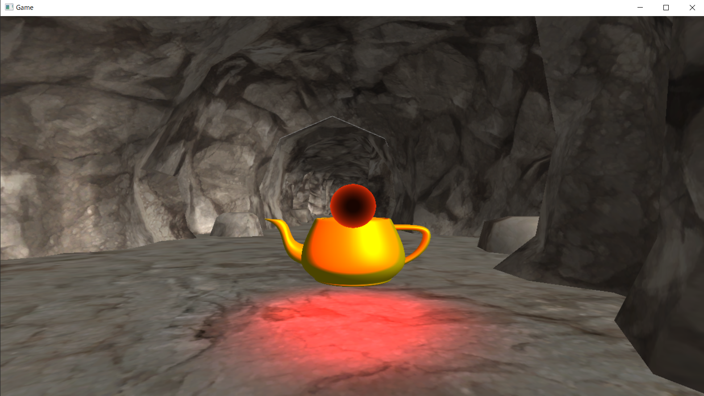
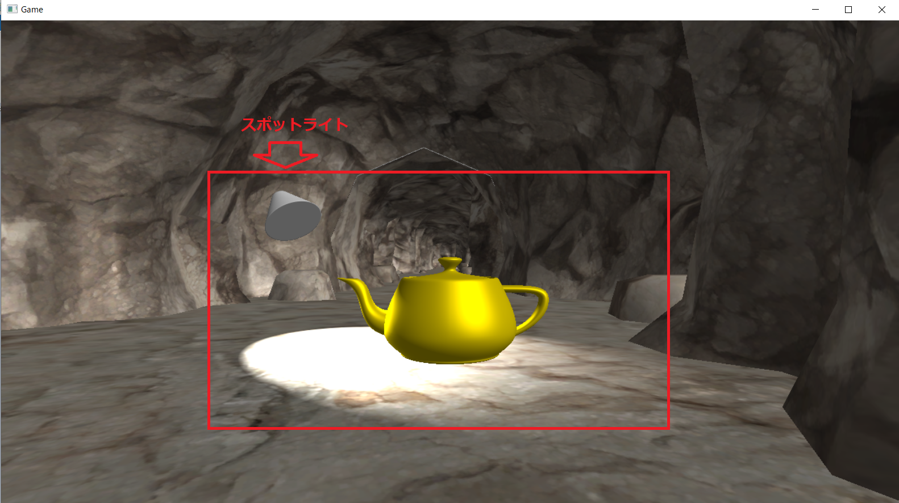
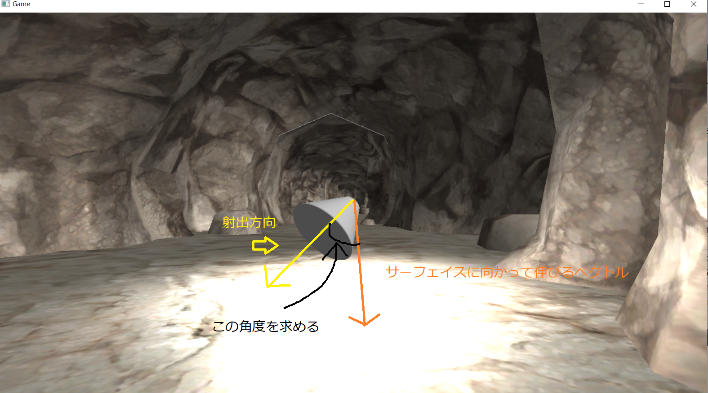
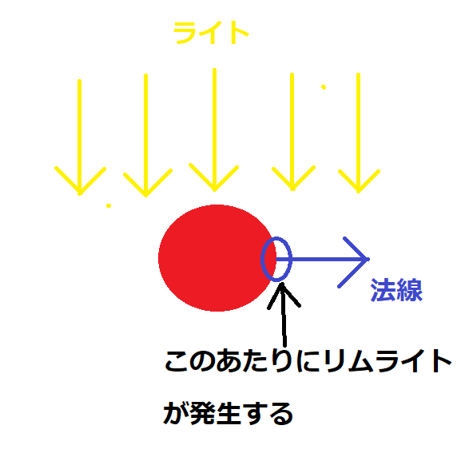
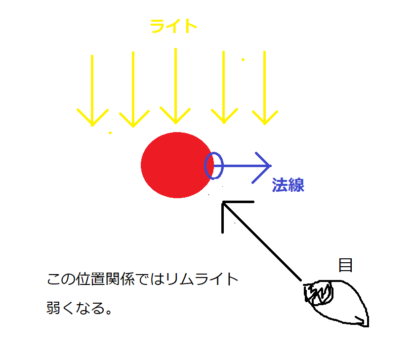
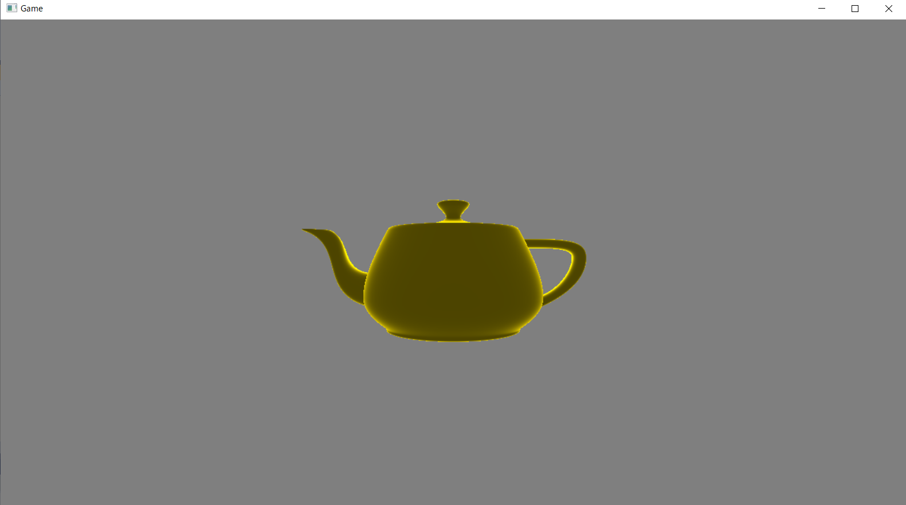

# Chapter 5 ライティング発展
## 5.1 ポイントライト
&emsp;ポイントライトはディレクションライトと異なり、位置情報を保持しているライトです。ですので、図4.4のように光源が移動したり、キャラクターが移動することで光の当たる方向が変わっていきます。今回実装するポイントライトはPhongの反射モデルで実装するので、前節のディレクションライトで行った、ランバート拡散反射とフォン鏡面反射の計算を行います。しかし、ディレクションライトと異なり下記の二つのことを考える必要があります。</br>
1. 入射してくる光の方向
2. 光源との距離による光の減衰

### 5.1.1 入射してくる光の方向
&emsp;ランバート拡散反射とフォン鏡面反射の計算にはサーフェイスに入射してくる光の方向が必要でした。なので、ポイントライトでこれらの反射を計算する場合も図5.1のように入射してくる光の方向が必要です。</br>
**図5.1**</br>
</img></br>
&emsp;サーフェイスに入射してくる光の方向は、サーフェイスのワールド座標からポイントライトの座標を引き算して正規化することで求めることができます。</br>

```cpp
//サーフェイスのワールド座標 - ポイントライトの座標。
float3 ligDir = surface.worldPosition - pointLight.position;
//求めたベクトルを正規化する。
ligDir = normalize( ligDir );
```
### 5.1.2 光源との距離による光の減衰
&emsp;ポイントライトの光の影響は距離によって減衰していきます。今回実装するポイントライトでは、次の計算式を使用して距離に比例して、光の影響力が0になっていくようにします。</br>
**D : ポイントライトとサーフェイスの距離**</br>
**R : ポイントライトが影響を与える範囲**</br>
**この時、影響力 Aを次の計算で求める。**</br>
**A = 1 - 1/R × D**</br>
&emsp;この計算式を使った場合に、ポイントライトが影響を与える範囲が400の時の、ポイントライトとサーフェイズの距離による影響力を表5.1に示します。</br>
**表5.1**</br>
| サーフェイスとの距離 | 計算式 | 影響力 |
| ---- | ---- | ---- |
| 0 | 1 - 1 / 400 × 0 | 1(100%)|
| 100 | 1 - 1 / 400 × 100 | 0.75(75%)|
| 200 | 1 - 1 / 400 × 200 | 0.5(50%)|
| 300 | 1 - 1 / 400 × 300 | 0.25(25%)|
| 400 | 1 - 1 / 400 × 400 | 0(0%)|

&emsp;サーフェイスとの距離が離れていくほど影響力が小さくなっていき、影響を与える範囲の限界に来ると、影響力が0になっていることが分かるかと思います。影響力を求める疑似コードを示します。</br>
```cpp
//サーフェイスとポイントライトの距離を計算する。
float D = length( surface.worldPosition - pointLight.position );
//影響力を計算する。
float A = 1.0f - 1.0f / pointLight.range * D;
//影響力がマイナスになる場合(範囲を超えている)は0にする。
if( A < 0.0f){
	A = 0.0f;
}
//2乗することで影響力の変化を指数関数的にする。
A = pow( A, 2.0f );
```
&emsp;ポイントライトとの距離が、ポイントライトの範囲を超えると影響力がマイナスになってしまうので、この疑似コードではif文を使ってマイナスにならないようにしています。</br>
&emsp;また、今回実装するポイントライトでは、影響力にpow関数を利用して、影響力の変化が指数関数的になるようにしています。</br>
**表5.2**</br>
| サーフェイスとの距離 | 計算式 | 影響力 | 影響力(2乗)|
| ---- | ---- | ---- | ---- |
| 0 | 1 - 1 / 400 × 0 | 1(100%)| 1(100% | 
| 100 | 1 - 1 / 400 × 100 | 0.75(75%)| 0.5625(56%) | 
| 200 | 1 - 1 / 400 × 200 | 0.5(50%)| 0.25(25%) |
| 300 | 1 - 1 / 400 × 300 | 0.25(25%) | 0.0625(6%) |
| 400 | 1 - 1 / 400 × 400 | 0(0%)| 0(0%) | 
&emsp;影響力を累乗することで、図5.2のように影響力の強さは線形な変化から、指数関数的な変化となります。自然界には指数関数的な変化をしている現象が多いため、pow関数を利用することでお手軽にリアルな表現を実装できます。</br>

**図5.2**
</img></br>

### 5.1.2 ポイントライト実装まとめ
&emsp;では、ポイントライトの実装方法をまとめます。
1. ポイントライトの座標とサーフェイスのワールド座標で入射してくる光の方向を求める。
2. 1で求めた光の方向を使って、ランバート拡散反射光と鏡面反射光を求める。
3. ポイントライトとサーフェイスとの距離を使って、ライトの影響度を求める。
4. 3で求めたライトの影響度を拡散反射光と鏡面反射光に乗算して、最終的な反射光を求める。

### 5.1.3 【ハンズオン】ポイントライトを実装する。
&emsp;では、ポイントライトを実装していきましょう。Sample_05_01を立ち上げてください。

#### step-1 ライト構造体にポイントライト用のメンバ変数を追加。
&emsp;まずはライト構造体にポイントライト用のメンバ変数を追加します。main.cppの17行目にリスト5.1のプログラムを入力してください。</br>
[リスト5.1 main.cpp]
```cpp
//step-1 ライト構造体にポイントライト用のメンバ変数を追加。
Vector3 ptPosition;		//位置。
float pad2;					//パディング。
Vector3 ptColor;			//カラー。
float ptRange;				//影響範囲。
```
#### step-2 ポイントライトの初期座標を設定する。
&emsp;続いて、ポイントライトの初期座標を設定します。main.cppにリスト5.2のプログラムを入力してください。</br>
[リスト5.2 main.cpp]
```cpp
//step-2 ポイントライトの初期座標を設定する。
light.ptPosition.x = 0.0f;
light.ptPosition.y = 50.0f;
light.ptPosition.z = 50.0f;
```

#### step-4 ポイントライトのカラーを設定する。
&emsp;初期座標が設定出来たら、次はポイントライトの初期カラーを設定します。main.cppにリスト5.3のプログラムを入力してください。</br>
[リスト5.3 main.cpp]
```cpp
//step-3 ポイントライトの初期カラーを設定する。
light.ptColor.x = 15.0f;
light.ptColor.y = 0.0f;
light.ptColor.z = 0.0f;
```

#### step-4 ポイントライトの影響範囲を設定する。
&emsp;続いて、ポイントライトの影響範囲の設定です。この設定を変更することでポイントライトの光が届く範囲を変更することができます。届く範囲を狭くしたい場合は値を小さく、広くしたい場合は値を大きくしてください。では、main.cppにリスト5.4のプログラムを入力してください。</br>
[リスト5.4 main.cpp]
```cpp
//step-4 ポイントライトの影響範囲を設定する。
light.ptRange = 100.0f;
```
#### step-5 コントローラーでポイントライトを動かす。
&emsp;では、c++側は最後です。ポイントライトの初期化が終わったら、ゲームループの中にポイントライトを動かすプログラムを追加してみましょう。XInputに対応しているゲームパッドを持っている人はパソコンに接続してもらえると、左のアナログスティックでポイントライトを動かせるようになります。コントローラーを持っていない人もキーボードのWASDキーで動かすことができます。main.cppにリスト5.5のプログラムを入力してください。</br>
[リスト5.5 main.cpp]
```cpp
//step-5 コントローラーでポイントライトを動かす。
light.ptPosition.x -= g_pad[0]->GetLStickXF();
if (g_pad[0]->IsPress(enButtonB)) {
	light.ptPosition.y += g_pad[0]->GetLStickYF();
}
else {
	light.ptPosition.z -= g_pad[0]->GetLStickYF();
}
```

#### step-6 定数バッファにポイントライト用の変数を追加。
&emsp;ここからはシェーダー側を実装していきます。ポイントライト用のデータにアクセスするために定数バッファに変数を追加します。Assets/shader/sample.fxの36行目にリスト5.6のプログラムを入力してください。</br>
[リスト5.6 sample.fx]
```cpp
//step-6 定数バッファにポイントライト用の変数を追加。
float3 ptPosition;	//ポイントライトの位置。
float3 ptColor;		//ポイントライトのカラー。
float ptRange;		//ポイントライトの影響範囲。
```
#### step-7 このサーフェイスに入射しているポイントライトの光の向きを計算する。
&emsp;続いてピクセルシェーダーです。まずは、サーフェイス(ピクセル)に入射しているポイントライトの光の向きを計算します。光の向きはサーフェイスのワールド座標からポイントライトの座標を減算して、正規化(大きさ１)にすることで求めることができます。sample.fxにリスト5.7のプログラムを入力して下さい。</br>
[リスト5.7 sample.fx]
```cpp
//step-7 このサーフェイスに入射しているポイントライトの光の向きを計算する。
float3 ligDir = psIn.worldPos - ptPosition;
//正規化して大きさ１のベクトルにする。
ligDir = normalize(ligDir);
```

#### step-8 減衰なしのランバート拡散反射光を計算する。
&emsp;入射してくる光の方向を求めることができたら、ランバート拡散反射光を求めることができます。今回のサンプルではランバート拡散反射を求める処理をまとめたCalcLambertDiffuseという関数を著者の方で用意していますので、こちらを使用します。sample.fxにリスト5.8のプログラムを入力して下さい。</br>
[リスト5.8 sample.fx]
```cpp
//step-8 減衰なしのランバート拡散反射光を計算する。
float3 diffPoint = CalcLambertDiffuse(
	ligDir, 		//ライトの方向
	ptColor,	 	//ライトのカラー
	psIn.normal		//サーフェイスの法線
);
```

#### step-9 減衰なしのフォン鏡面反射光を計算する。
&emsp;拡散反射光を求めることができたら、次はフォン鏡面反射光も計算します。こちらも著者の方でフォン鏡面反射光を求める処理をまとめたCalcPhongSpecularという関数を用意していますので、こちらを利用します。sample.fxにリスト5.9のプログラムを入力してください。</br>
[リスト5.9 sample.fx]
```cpp
//step-9 減衰なしのフォン鏡面反射光を計算する。
float3 specPoint = CalcPhongSpecular(
	ligDir, 			//ライトの方向。
	ptColor,		 	//ライトのカラー。
	psIn.worldPos, 		//サーフェイズのワールド座標。
	psIn.normal			//サーフェイズの法線。
);
```

#### step-10 距離による影響率を計算する。
&emsp;step-8とstep-9で求めた反射光は距離による影響率は考慮していませんでした。step-10ではポイントライトとの距離による影響率を計算していきましょう。影響率は距離に比例して小さくなるようになっていて、ポイントライトの範囲を超えると影響率は0になります。sample.fxにリスト5.10のプログラムを入力してください。</br>
[リスト5.10 sample.fx]
```cpp
//step-10 距離による影響率を計算する。
//ポイントライトとの距離を計算する。
float3 distance = length( psIn.worldPos - ptPosition );

//影響率は距離に比例して小さくなっていく。
float affect = 1.0f - 1.0f / ptRange * distance;
//影響力がマイナスにならないように補正をかける。
if( affect < 0.0f){
	affect = 0.0f;
}
//影響の仕方を指数関数的にする。今回のサンプルでは3乗している。
affect = pow( affect, 3.0f );
```

#### step-11 拡散反射光と鏡面反射光に影響率を乗算して影響を弱める。
&emsp;影響率を求めることができたら、反射光に影響率を乗算して、光の影響を距離によって減衰してやりましょう。sample.fxにリスト5.11のプログラムを入力してください。</br>
[リスト5.11 sample.fx]
```cpp
//step-13 拡散反射光と鏡面反射光に減衰率を乗算して影響を弱める。
diffPoint *= affect;
specPoint *= affect;
```

#### step-12 ポイントライトによる反射光とディレクションライトによる反射光を合算して最終的な反射光を求める。
&emsp;では、最後のハンズオンです。ポイントライトによる反射光とディレクションライトによる反射光を合成して、最終的な反射光を求めましょう。sample.fxにリスト5.12のプログラムを入力してください。</br>
[リスト5.12 sample.fx]
```cpp
//step-14 ポイントライトによる反射光とディレクションライトによる反射光を合算して最終的な反射光を求める。
float3 diffuseLig = diffPoint + diffDirection;
float3 specularLig = specPoint + specDirection;
```
&emsp;入力出来たら、実行してみてください。うまくいっていたら図5.3のようなプログラムが実行できます。コントローラーの左スティックでポイントライトを動かすことができますので、動かしてみてください。Bボタン(キーボードならK)を押しながら左スティックで上下にも移動します。</br>
**図5.3**</br>
</img></br>

## 5.2 スポットライト
&emsp;スポットライトとはアイドルのライブステージや、スポーツの試合などで使用される図5.4のようなライトです。</br>
**図5.4**</br>
</img></br>
&emsp;このチャプターではこのようなスポットライトを実装していきます。しかし、だだし、本来スポットライトというのは、空気中の塵を照らすため、光の筋が見えるような現象も見えるのですが、ここで実装するポイントライトは物体に照射された光のみの実装になります。(図5.5)

**図5.5**</br>
</img></br>
&emsp;今回実装するスポットライトはポイントライトとほとんど同じプログラムになります。ポイントライトのデータに光の放射方向と、光の放射角度を追加することで実装できます。処理の手順としては下記のようになります。
1. スポットライトの位置を光源とみなして、ポイントライトを計算する。
2. スポットライトの位置からサーフェイスに向かって伸びるベクトルを計算する。
3. 2で求めたベクトルとスポットライトの射出方向とで内積を使って、角度を求める。
4. 3で求めた角度を使って、ライトの影響率を計算する。

&emsp;では、各ステップを詳細に見ていきましょう。

### 5.2.1 スポットライトの位置を光源とみなして、ポイントライトを計算する。
&emsp;この処理はポイントライトの処理と全く同じです。スポットライトの位置とスポットライトの照射範囲を使ってポイントライトと同じ処理を行います。すると図5.6のようなライティング結果となります。</br>

**図5.6**</br>
</img></br>

### 5.2.2 スポットライトの位置からサーフェイスに向かって伸びるベクトルを計算する。

&emsp;ポイントライトの計算ができたら、図5.7のようにスポットライトの位置からサーフェイスに向かって伸びるベクトルを計算します。</br>

**図5.7**</br>
</img></br>
&emsp;このベクトルは、サーフェイスのワールド座標―スポットライトの座標で求めることができます。また、このベクトルは正規化を行っておく必要があります。</br>

### 5.2.3 2で求めたベクトルとスポットライトの射出方向とで内積を使って、角度を求める。
&emsp;続いて、先ほど求めたベクトルを使って、図5.8のようにスポットライトの射出方向と照射しているサーフェイスの角度を求めます。</br>
**図5.8**</br>
</img></br>
&emsp;この角度は内積の下記のような性質を利用すると求めることができます。</br>
**正規化されたベクトル同士の内積の結果は、その二つのベクトルのなす角度の逆余弦の値になる。**</br>
&emsp;なんのことかよく分らないと思いますが、ようはリスト5.13のようなプログラムで、二つのベクトルの間の角度を求めることができるということです。</br>
[リスト5.13]
```cpp
//ベクトルv1とv2のなす角度を求める。
//まずはv1とv2の内積を計算する。
float t = dot( v1, v2 );
//内積の結果をacos関数に与えて、角度に戻す。
float angle = acos(t);
```
&emsp;この性質を利用して、スポットライトの射出方向と照射しているサーフェイスに向かって伸びるベクトルとの内積を求めて、`acos()`を利用することでサーフェイスとの角度を求めることができます。角度を求めることができたら、スポットライトの照射角度の範囲外は照射しないようにすることで図5.9のようなライティングを行うことができます。</br>

**図5.9**</br>
</img></br>

### 5.2.4 3で求めた角度を使って、ライトの影響率を計算する。
&emsp;最後に3で求めた角度を使ってライトの影響を減衰させます(図5.10)。これはポイントライトの減衰と同じ考え方で、角度が大きくなるにしたがってライトの影響率を下げていくことで実現できます。今回のサンプルではポイントライトの実装と同じようにpow関数を利用することで、指数関数的な減衰を実現しています。</br>
**図5.10**</br>
</img></br>

### 5.2.4 【ハンズオン】スポットライトを実装する。
では、ハンズオンでスポットライトを実装していきましょう。`Smaple_05_02/Sample_05_02.sln`を立ち上げてください。</br>

#### step-1 ライト構造体にスポットライト用のメンバ変数を追加。
まずは、ライト構造体にスポットライト用のメンバ変数を追加しましょう。スポットライトの実装のために必要なデータは、下記のようになります。
1. ライトの座標(ポイントライトと同じ)
2. ライトのカラー(ポイントライトと同じ)
3. 影響範囲(ポイントライトと同じ)
4. 射出方向
5. 射出角度

これらのデータをライト構造体に追加していきましょう。では、`main.cpp`の23行目にリスト5.13のプログラムを入力してください。</br>
[リスト5.13 `main.cpp`]
```cpp
//step-1 ライト構造体にスポットライト用のメンバ変数を追加。
Vector3 spPosition;		//位置。
float pad3;					//パディング。
Vector3 spColor;			//カラー。
float spRange;				//影響範囲。
Vector3 spDirection;	//射出方向。
float spAngle;				//射出角度。
```

#### step-2 スポットライトのデータを初期化する。
続いてスポットライトのデータを初期化しましょう。リスト5.14のプログラムを入力してください。</br>
[リスト5.14 `main.cpp`]
```cpp
//step-2 スポットライトのデータを初期化する。
//初期座標はX = 0、Y = 50、Z = 0にする。
light.spPosition.x = 0.0f;
light.spPosition.y = 0.0f;
light.spPosition.y = 50.0f;
//ライトのカラーを設定。R = 10、G = 10、B = 10にする。
light.spColor.x = 10.0f;
light.spColor.y = 10.0f;
light.spColor.z = 10.0f;

//初期方向は斜め下にする。
light.spDirection.x = 1.0f;
light.spDirection.y = -1.0f;
light.spDirection.z = 1.0f;
//方向データなので、大きさを１にする必要があるので正規化する。
light.spDirection.Normalize();

//射出範囲は300
light.spRange = 300.0f;
//射出角度は25度。
light.spAngle = Math::DegToRad(25.0f);
```

射出角度はラジアン単位で指定する必要があります。今回は著者のほうで用意している、デグリー角度からラジアン角度を求めるMath::DegToRad()を利用して角度を設定しています。

#### step-3 コントローラーの左スティックでスポットライトを移動させる。
ライトの初期化ができたら今度はゲームループの中にコントローラーの入力でスポットライトを移動させるプログラムを追加しましょう。リスト5.15のプログラムを入力してください。</br>
[リスト5.15 `main.cpp`]
```cpp
//step-3 コントローラーの左スティックでスポットライトを移動させる。
//左のアナログスティックで動かす。
light.spPosition.x -= g_pad[0]->GetLStickXF();
if (g_pad[0]->IsPress(enButtonB)) {
	//Bボタンが一緒に押されていたらY軸方向に動かす。
	light.spPosition.y += g_pad[0]->GetLStickYF();
}
else {
	//Z軸方向に動かす。
	light.spPosition.z -= g_pad[0]->GetLStickYF();
}
```

#### step-4 コントローラー右スティックでスポットライトを回転させる。
続いて、コントローラーの右スティックの入力でスポットライトを回転させましょう。リスト5.16のプログラムを入力してください。

[リスト5.16 `main.cpp`]
```cpp
//step-4 コントローラー右スティックでスポットライトを回転させる。
//Y軸周りの回転クォータニオンを計算する。
Quaternion qRotY;
qRotY.SetRotationY(g_pad[0]->GetRStickXF() * 0.01f);
//計算したクォータニオンでライトの方向を回す。
qRotY.Apply(light.spDirection);

//X軸周りの回転クォータニオンを計算する。
Vector3 rotAxis;
rotAxis.Cross(g_vec3AxisY, light.spDirection);
Quaternion qRotX;
qRotX.SetRotation(rotAxis, g_pad[0]->GetRStickYF() * 0.01f);
//計算したクォータニオンでライトの方向を回す。
qRotX.Apply(light.spDirection);
```
このコードではクォータニオンを利用してライトの方向を回すプログラムを作成していますが、クォータニオンの説明は本書の目的である、リアルタイムCGプログラミングのアルゴリズムを学ぶという点からずれてしまい、数学的な話になってしまいますので、詳細な説明は割愛させていただきます。本書では、クォータニオンは任意の軸周りの回転を扱うことができ、ベクトルを回したり、回転行列を作成したりすることができる程度の認識で大丈夫です。</br>

#### step-5 スポットライトのデータにアクセスするための変数を追加する。
続いてシェーダー側のプログラムを実装していきます。まずは、cpp側で用意されたスポットライトのデータにアクセスするための変数を定数バッファに追加しましょう。`Assets/shader/sample.fx`を開いてリスト5.17のプログラムを入力してください。</br>
[リスト5.17 `sample.fx`]
```cpp
//step-5 スポットライトのデータにアクセスするための変数を追加する。
float3 spPosition;	//スポットライトの位置。
float3 spColor;		//スポットライトのカラー。
float spRange;		//スポットライトの射出範囲。
float3 spDirection;	//スポットライトの射出方向。
float spAngle;		//スポットライトの射出角度。
```

#### step-6 このサーフェイスに入射しているスポットライトの光の向きを計算する。
では、ここからはピクセルシェーダーを改造して、スポットライトの計算を行っていきます。step-6～step-10までのプログラムはポイントライトと全く同じになります。では、まずは、スポットライトからサーフェイス(ピクセル)に入射してくる光の向きを計算しましょう。リスト5.18のプログラムを入力してください。</br>
[リスト5.18 `sample.fx`]
```cpp
//step-6 このサーフェイスに入射しているスポットライトの光の向きを計算する。
//ピクセルの座標 - スポットライトの座標を計算。
float3 ligDir = psIn.worldPos - spPosition;
//正規化して大きさ１のベクトルにする。
ligDir = normalize(ligDir);
```

#### step-7 減衰なしのランバート拡散反射光を計算する。
入射してくる光の向きを計算することができたら、拡散反射光を計算します。リスト5.19のプログラムを入力してください。</br>
[リスト5.19 `sample.fx`]
```cpp
//step-7 減衰なしのランバート拡散反射光を計算する。
float3 diffSpotLight = CalcLambertDiffuse(
	ligDir, 		//ライトの方向
	spColor,	 	//ライトのカラー
	psIn.normal		//サーフェイスの法線
);
```

#### step-8 減衰なしのフォン鏡面反射光を計算する。
続いて鏡面反射光を計算しましょう。リスト5.20のプログラムを入力してください。</br>
[リスト5.20 `sample.fx`]
```cpp
//step-8 減衰なしのフォン鏡面反射光を計算する。
float3 specSpotLight = CalcPhongSpecular(
	ligDir, 			//ライトの方向。
	spColor,		 	//ライトのカラー。
	psIn.worldPos, 		//サーフェイズのワールド座標。
	psIn.normal			//サーフェイズの法線。
);
```

#### step-9 距離による影響率を計算する。
減衰なしの反射光を求めることができたので、次は距離による減衰率を計算します。この計算もポイントライトのものと全く同じです。リスト5.21のプログラムを入力してください。</br>
[リスト5.21 `sample.fx`]
```cpp
//step-9 距離による影響率を計算する。
//スポットライトとの距離を計算する。
float3 distance = length( psIn.worldPos - spPosition );

//影響率は距離に比例して小さくなっていく。
float affect = 1.0f - 1.0f / spRange * distance;
//影響力がマイナスにならないように補正をかける。
if( affect < 0.0f){
	affect = 0.0f;
}
//影響の仕方を指数関数的にする。今回のサンプルでは3乗している。
affect = pow( affect, 3.0f );
```

#### step-10 拡散反射光と鏡面反射光に影響率を乗算して反射光を弱める。
距離による影響率を求めることができたので、反射光に影響率を乗算して、反射光を弱めましょう。リスト5.22のプログラムを入力してください。</br>
[リスト5.22 `sample.fx`]
```cpp
//step-10 拡散反射光と鏡面反射光に影響率を乗算して影響を弱める。
diffSpotLight *= affect;
specSpotLight *= affect;
```

#### step-11 入射光と射出方向の角度を求める。
ここからはスポットライト固有のプログラムになっていきます。まずはサーフェイスへの入射光とスポットライトの射出方向との角度を求めましょう。この角度は内積と逆余弦関数を利用することで求めることができます。では、リスト5.23のプログラムを入力して下さい。</br>
[リスト5.23 `sample.fx`]
```cpp
//step-11 入射光と射出方向の角度を求める。
//dot()を利用して内積を求める。
float angle = dot( ligDir, spDirection);
//dot()で求めた値をacos()に渡して角度を求める。
angle = acos(angle);
```

#### step-12 角度による影響率を求める。
角度を求めることができたら影響率を計算しましょう。この計算の考え方は、距離によるものとよく似ています。角度の大きさに比例して影響率を小さくしていきます。また、影響率を累乗することで、影響率の変化を指数関数的にしています。これも距離によるものと同じ考え方です。リスト5.24のプログラムを入力してください。</br>
[リスト5.24 `sample.fx`]
```cpp
//step-12 角度による影響率を求める。
//角度に比例して小さくなっていく影響率を計算する。
affect = 1.0f - 1.0f / spAngle * angle;
//影響力がマイナスにならないように補正をかける。
if( affect < 0.0f){
	affect = 0.0f;
}
//影響の仕方を指数関数的にする。今回のサンプルでは0.5乗している。
affect = pow( affect, 0.5f );
```
#### step-13 角度による影響率を反射光に乗算して、影響を弱める。
求めた影響率を反射光に乗算して、影響率を弱めましょう。リスト5.25のプログラムを入力してください。</br>
[リスト5.25 `sample.fx`]
```cpp
//step-13 角度による影響率を反射光に乗算して、影響を弱める。
diffSpotLight *= affect;
specSpotLight *= affect;
```
#### step-14 スポットライトの反射光を最終的な反射光に足し算する。
いよいよ最後の実装です。スポットライトの反射光を最終的な反射光に足し算しましょう。リスト5.26のプログラムを入力してください。</br>
[リスト5.26 `sample.fx`]
```cpp
//step-14 スポットライトの反射光を最終的な反射光に足し算する。
finalLig += diffSpotLight + specSpotLight;
```
ここまで実装できたら実行してみてください。図5.11のようなプログラムが実行できたら完成です。コントローラーの入力でスポットライトを動かすことができますので、こちらも試してみてください。</br>

**図5.11**</br>
</img></br>

<!-- 改ページ. -->
<div style="page-break-before:always"></div>

## 評価テスト-1
次の評価テストを行いなさい。</br>
[評価テストへジャンプ](https://docs.google.com/forms/d/e/1FAIpQLSeNa0Mgac80QzWgZT1sRcWl-TriXEZHS1AvKhJTeddz_INWOA/viewform?usp=sf_link)

## 5.2 スポットライト
&emsp;スポットライトとはアイドルのライブステージや、スポーツの試合などで使用される図5.4のようなライトです。</br>
**図5.4**</br>
</img></br>
&emsp;このチャプターではこのようなスポットライトを実装していきます。しかし、だだし、本来スポットライトというのは、空気中の塵を照らすため、光の筋が見えるような現象も見えるのですが、ここで実装するポイントライトは物体に照射された光のみの実装になります。(図5.5)

**図5.5**</br>
</img></br>
&emsp;今回実装するスポットライトはポイントライトとほとんど同じプログラムになります。ポイントライトのデータに光の放射方向と、光の放射角度を追加することで実装できます。処理の手順としては下記のようになります。
1. スポットライトの位置を光源とみなして、ポイントライトを計算する。
2. スポットライトの位置からサーフェイスに向かって伸びるベクトルを計算する。
3. 2で求めたベクトルとスポットライトの射出方向とで内積を使って、角度を求める。
4. 3で求めた角度を使って、ライトの影響率を計算する。

&emsp;では、各ステップを詳細に見ていきましょう。

### 5.2.1 スポットライトの位置を光源とみなして、ポイントライトを計算する。
&emsp;この処理はポイントライトの処理と全く同じです。スポットライトの位置とスポットライトの照射範囲を使ってポイントライトと同じ処理を行います。すると図5.6のようなライティング結果となります。</br>

**図5.6**</br>
</img></br>

### 5.2.2 スポットライトの位置からサーフェイスに向かって伸びるベクトルを計算する。

&emsp;ポイントライトの計算ができたら、図5.7のようにスポットライトの位置からサーフェイスに向かって伸びるベクトルを計算します。</br>

**図5.7**</br>
</img></br>
&emsp;このベクトルは、サーフェイスのワールド座標―スポットライトの座標で求めることができます。また、このベクトルは正規化を行っておく必要があります。</br>

### 5.2.3 2で求めたベクトルとスポットライトの射出方向とで内積を使って、角度を求める。
&emsp;続いて、先ほど求めたベクトルを使って、図5.8のようにスポットライトの射出方向と照射しているサーフェイスの角度を求めます。</br>
**図5.8**</br>
</img></br>
&emsp;この角度は内積の下記のような性質を利用すると求めることができます。</br>
**正規化された二つのベクトルの内積の結果は、その二つのベクトルのなす角θのcos(θ)の値になる。**</br>
&emsp;なんのことかよく分らないと思いますが、ようはリスト5.13のようなプログラムで、二つのベクトルの間の角度を求めることができるということです。</br>
[リスト5.13]
```cpp
//ベクトルv1とv2のなす角度を求める。
//まずはv1とv2の内積を計算する。
float t = dot( v1, v2 );
//内積の結果をacos関数に与えて、角度に戻す。
float angle = acos(t);
```
&emsp;この性質を利用して、スポットライトの射出方向と照射しているサーフェイスに向かって伸びるベクトルとの内積を求めて、`acos()`を利用することでサーフェイスとの角度を求めることができます。角度を求めることができたら、スポットライトの照射角度の範囲外は照射しないようにすることで図5.9のようなライティングを行うことができます。</br>

**図5.9**</br>
</img></br>

### 5.2.4 3で求めた角度を使って、ライトの影響率を計算する。
&emsp;最後に3で求めた角度を使ってライトの影響を減衰させます(図5.10)。これはポイントライトの減衰と同じ考え方で、角度が大きくなるにしたがってライトの影響率を下げていくことで実現できます。今回のサンプルではポイントライトの実装と同じようにpow関数を利用することで、指数関数的な減衰を実現しています。</br>
**図5.10**</br>
</img></br>

### 5.2.4 【ハンズオン】スポットライトを実装する。
では、ハンズオンでスポットライトを実装していきましょう。`Smaple_05_02/Sample_05_02.sln`を立ち上げてください。</br>

#### step-1 ライト構造体にスポットライト用のメンバ変数を追加。
まずは、ライト構造体にスポットライト用のメンバ変数を追加しましょう。スポットライトの実装のために必要なデータは、下記のようになります。
1. ライトの座標(ポイントライトと同じ)
2. ライトのカラー(ポイントライトと同じ)
3. 影響範囲(ポイントライトと同じ)
4. 射出方向
5. 射出角度

これらのデータをライト構造体に追加していきましょう。では、`main.cpp`の23行目にリスト5.13のプログラムを入力してください。</br>
[リスト5.13 `main.cpp`]
```cpp
//step-1 ライト構造体にスポットライト用のメンバ変数を追加。
Vector3 spPosition;		//位置。
float pad3;					//パディング。
Vector3 spColor;			//カラー。
float spRange;				//影響範囲。
Vector3 spDirection;	//射出方向。
float spAngle;				//射出角度。
```

#### step-2 スポットライトのデータを初期化する。
続いてスポットライトのデータを初期化しましょう。リスト5.14のプログラムを入力してください。</br>
[リスト5.14 `main.cpp`]
```cpp
//step-2 スポットライトのデータを初期化する。
//初期座標はX = 0、Y = 50、Z = 0にする。
light.spPosition.x = 0.0f;
light.spPosition.y = 0.0f;
light.spPosition.y = 50.0f;
//ライトのカラーを設定。R = 10、G = 10、B = 10にする。
light.spColor.x = 10.0f;
light.spColor.y = 10.0f;
light.spColor.z = 10.0f;

//初期方向は斜め下にする。
light.spDirection.x = 1.0f;
light.spDirection.y = -1.0f;
light.spDirection.z = 1.0f;
//方向データなので、大きさを１にする必要があるので正規化する。
light.spDirection.Normalize();

//射出範囲は300
light.spRange = 300.0f;
//射出角度は25度。
light.spAngle = Math::DegToRad(25.0f);
```

射出角度はラジアン単位で指定する必要があります。今回は著者のほうで用意している、デグリー角度からラジアン角度を求めるMath::DegToRad()を利用して角度を設定しています。

#### step-3 コントローラーの左スティックでスポットライトを移動させる。
ライトの初期化ができたら今度はゲームループの中にコントローラーの入力でスポットライトを移動させるプログラムを追加しましょう。リスト5.15のプログラムを入力してください。</br>
[リスト5.15 `main.cpp`]
```cpp
//step-3 コントローラーの左スティックでスポットライトを移動させる。
//左のアナログスティックで動かす。
light.spPosition.x -= g_pad[0]->GetLStickXF();
if (g_pad[0]->IsPress(enButtonB)) {
	//Bボタンが一緒に押されていたらY軸方向に動かす。
	light.spPosition.y += g_pad[0]->GetLStickYF();
}
else {
	//Z軸方向に動かす。
	light.spPosition.z -= g_pad[0]->GetLStickYF();
}
```

#### step-4 コントローラー右スティックでスポットライトを回転させる。
続いて、コントローラーの右スティックの入力でスポットライトを回転させましょう。リスト5.16のプログラムを入力してください。

[リスト5.16 `main.cpp`]
```cpp
//step-4 コントローラー右スティックでスポットライトを回転させる。
//Y軸周りの回転クォータニオンを計算する。
Quaternion qRotY;
qRotY.SetRotationY(g_pad[0]->GetRStickXF() * 0.01f);
//計算したクォータニオンでライトの方向を回す。
qRotY.Apply(light.spDirection);

//X軸周りの回転クォータニオンを計算する。
Vector3 rotAxis;
rotAxis.Cross(g_vec3AxisY, light.spDirection);
Quaternion qRotX;
qRotX.SetRotation(rotAxis, g_pad[0]->GetRStickYF() * 0.01f);
//計算したクォータニオンでライトの方向を回す。
qRotX.Apply(light.spDirection);
```
このコードではクォータニオンを利用してライトの方向を回すプログラムを作成していますが、クォータニオンの説明は本書の目的である、リアルタイムCGプログラミングのアルゴリズムを学ぶという点からずれてしまい、数学的な話になってしまいますので、詳細な説明は割愛させていただきます。本書では、クォータニオンは任意の軸周りの回転を扱うことができ、ベクトルを回したり、回転行列を作成したりすることができる程度の認識で大丈夫です。</br>

#### step-5 スポットライトのデータにアクセスするための変数を追加する。
続いてシェーダー側のプログラムを実装していきます。まずは、cpp側で用意されたスポットライトのデータにアクセスするための変数を定数バッファに追加しましょう。`Assets/shader/sample.fx`を開いてリスト5.17のプログラムを入力してください。</br>
[リスト5.17 `sample.fx`]
```cpp
//step-5 スポットライトのデータにアクセスするための変数を追加する。
float3 spPosition;	//スポットライトの位置。
float3 spColor;		//スポットライトのカラー。
float spRange;		//スポットライトの射出範囲。
float3 spDirection;	//スポットライトの射出方向。
float spAngle;		//スポットライトの射出角度。
```

#### step-6 このサーフェイスに入射しているスポットライトの光の向きを計算する。
では、ここからはピクセルシェーダーを改造して、スポットライトの計算を行っていきます。step-6～step-10までのプログラムはポイントライトと全く同じになります。では、まずは、スポットライトからサーフェイス(ピクセル)に入射してくる光の向きを計算しましょう。リスト5.18のプログラムを入力してください。</br>
[リスト5.18 `sample.fx`]
```cpp
//step-6 このサーフェイスに入射しているスポットライトの光の向きを計算する。
//ピクセルの座標 - スポットライトの座標を計算。
float3 ligDir = psIn.worldPos - spPosition;
//正規化して大きさ１のベクトルにする。
ligDir = normalize(ligDir);
```

#### step-7 減衰なしのランバート拡散反射光を計算する。
入射してくる光の向きを計算することができたら、拡散反射光を計算します。リスト5.19のプログラムを入力してください。</br>
[リスト5.19 `sample.fx`]
```cpp
//step-7 減衰なしのランバート拡散反射光を計算する。
float3 diffSpotLight = CalcLambertDiffuse(
	ligDir, 		//ライトの方向
	spColor,	 	//ライトのカラー
	psIn.normal		//サーフェイスの法線
);
```

#### step-8 減衰なしのフォン鏡面反射光を計算する。
続いて鏡面反射光を計算しましょう。リスト5.20のプログラムを入力してください。</br>
[リスト5.20 `sample.fx`]
```cpp
//step-8 減衰なしのフォン鏡面反射光を計算する。
float3 specSpotLight = CalcPhongSpecular(
	ligDir, 			//ライトの方向。
	spColor,		 	//ライトのカラー。
	psIn.worldPos, 		//サーフェイズのワールド座標。
	psIn.normal			//サーフェイズの法線。
);
```

#### step-9 距離による影響率を計算する。
減衰なしの反射光を求めることができたので、次は距離による減衰率を計算します。この計算もポイントライトのものと全く同じです。リスト5.21のプログラムを入力してください。</br>
[リスト5.21 `sample.fx`]
```cpp
//step-9 距離による影響率を計算する。
//スポットライトとの距離を計算する。
float3 distance = length( psIn.worldPos - spPosition );

//影響率は距離に比例して小さくなっていく。
float affect = 1.0f - 1.0f / spRange * distance;
//影響力がマイナスにならないように補正をかける。
if( affect < 0.0f){
	affect = 0.0f;
}
//影響の仕方を指数関数的にする。今回のサンプルでは3乗している。
affect = pow( affect, 3.0f );
```

#### step-10 拡散反射光と鏡面反射光に影響率を乗算して反射光を弱める。
距離による影響率を求めることができたので、反射光に影響率を乗算して、反射光を弱めましょう。リスト5.22のプログラムを入力してください。</br>
[リスト5.22 `sample.fx`]
```cpp
//step-10 拡散反射光と鏡面反射光に影響率を乗算して影響を弱める。
diffSpotLight *= affect;
specSpotLight *= affect;
```

#### step-11 入射光と射出方向の角度を求める。
ここからはスポットライト固有のプログラムになっていきます。まずはサーフェイスへの入射光とスポットライトの射出方向との角度を求めましょう。この角度は内積と逆余弦関数を利用することで求めることができます。では、リスト5.23のプログラムを入力して下さい。</br>
[リスト5.23 `sample.fx`]
```cpp
//step-11 入射光と射出方向の角度を求める。
//dot()を利用して内積を求める。
float angle = dot( ligDir, spDirection);
//dot()で求めた値をacos()に渡して角度を求める。
angle = acos(angle);
```

#### step-12 角度による影響率を求める。
角度を求めることができたら影響率を計算しましょう。この計算の考え方は、距離によるものとよく似ています。角度の大きさに比例して影響率を小さくしていきます。また、影響率を累乗することで、影響率の変化を指数関数的にしています。これも距離によるものと同じ考え方です。リスト5.24のプログラムを入力してください。</br>
[リスト5.24 `sample.fx`]
```cpp
//step-12 角度による影響率を求める。
//角度に比例して小さくなっていく影響率を計算する。
affect = 1.0f - 1.0f / spAngle * angle;
//影響力がマイナスにならないように補正をかける。
if( affect < 0.0f){
	affect = 0.0f;
}
//影響の仕方を指数関数的にする。今回のサンプルでは0.5乗している。
affect = pow( affect, 0.5f );
```
#### step-13 角度による影響率を反射光に乗算して、影響を弱める。
求めた影響率を反射光に乗算して、影響率を弱めましょう。リスト5.25のプログラムを入力してください。</br>
[リスト5.25 `sample.fx`]
```cpp
//step-13 角度による影響率を反射光に乗算して、影響を弱める。
diffSpotLight *= affect;
specSpotLight *= affect;
```
#### step-14 スポットライトの反射光を最終的な反射光に足し算する。
いよいよ最後の実装です。スポットライトの反射光を最終的な反射光に足し算しましょう。リスト5.26のプログラムを入力してください。</br>
[リスト5.26 `sample.fx`]
```cpp
//step-14 スポットライトの反射光を最終的な反射光に足し算する。
finalLig += diffSpotLight + specSpotLight;
```
ここまで実装できたら実行してみてください。図5.11のようなプログラムが実行できたら完成です。コントローラーの入力でスポットライトを動かすことができますので、こちらも試してみてください。</br>

**図5.11**</br>
</img></br>

<!-- 改ページ. -->
<div style="page-break-before:always"></div>

## 評価テスト-2
次の評価テストを行いなさい。</br>
[評価テストへジャンプ](https://docs.google.com/forms/d/e/1FAIpQLScxSMGVU0TC7X5l__XaIv8XxKpVMi1yEjywvVBm0njhUPnNhA/viewform?usp=sf_link)


## 5.3 リムライト
リムライトは逆光ライトとも呼ばれます。図5.12のような表現のことです。</br>

**図5.12**</br>
</img></br>

図5.12の写真は後ろから当たっている光が被写体を透過して、図5.13のように被写体の輪郭がうっすらと光っています。</br>
**図5.13**</br>
</img></br>
このような現象を再現するのがリムライトです。この逆光表現は動物の毛の表現でも使われることがあり、ファーシェーダーというように呼ばれていたりもします。(図5.14)</br>

**図5.14**</br>
</img></br>
逆光ライトは次の２点について考えることで実装することができます。

1.サーフェイスの法線と光の入射方向

2.サーフェイスの法線と視線の方向

では、この２点について詳しく見ていきましょう。
### 5.3.1 サーフェイスの法線と光の入射方向
まず、リムライトは図5.15のように、光の向きとサーフェイスの法線が垂直に近い箇所で強く発生すると考えることができます。</br>
**図5.15**</br>
</img></br>
この強さは光の向きとサーフェイスの法線とで内積を利用すると求めることができます。</br>
内積には次のような性質があります。</br>
**「正規化された二つのベクトルの内積は、その二つのベクトルのなす角が0度なら1.0、90度なら0.0、180度なら-1.0を返す」**</br>
図5.16を見てみてください。</br>
**図5.16**</br>
</img></br>
この性質は非常に重要で、リアルタイムCGの計算で何度も出てきます。実はこれは、ランバート拡散反射で光の強さを求めるときに利用したものと全く同じです。図4.10と表4.1を見てみてください。二つのベクトルのなす角度が0度の内積は1、90度の内積は0、180度の内積は-1になっています。</br>
今回は光の向きとサーフェイスの法線が垂直(90度)になるほどリムライトの影響を強くしたい(100%にしたい)わけなので、下記のような計算でリムライトの強さを求めることができます。</br>
**1 - max{ 0,  ライトの方向 ・ 法線  }**</br>
ライトの方向と法線の角度が垂直であれば、内積の結果は0になるため、計算すると1(100%)になります。逆にライトの方向と法線が同じ向きであれば、1になるため、計算すると0(0%)となります。これをリムライトの強さとして考えます。

### 5.3.2 サーフェイスの法線と視線の方向
リムライトの強さを決めるのは、サーフェイスの法線とライトの方向のみではありません。サーフェイスの法線と視線の方向でも決まります。図5.17と図5.18を見てみてください。</br>
**図5.18**</br>
</img></br>

**図5.19**</br>
</img></br>


つまり、リムライトさは「サーフェイスの法線と視線の方向が９０度に近いほど強くなる」という特性あります。この強さの求め方は5.3.1節と全く同じ考え方です。次の計算を行うことで求めることができます。</br>
**1 - max{ 0, 視線の方向 ・ 法線 * -1 }**</br>
ライトの方向との時と違う点は、視線の方向がライトとは逆向きなので、-1を乗算していることです。

### 5.3.3 リムライトの強さを乗算する
さて、5.3.1と5.3.2でリムライトの強さに影響を与える二つの要素について計算することができました。後は、その二つを乗算することで最終的なリムライトの強さを求めることができます。では、最後にリムライトの強さを求める疑似コードを示します。</br>
```cpp
//ライトの方向をL、視線の方向をeyeDir、法線をNとする。

//ライトの方向と法線で内積を計算。
float power1 = dot( L, N );		
//内積結果がマイナスであれば0にする。
power1 = max( 0.0f, power1 );	
//1から引いて、ライトの方向に依存するリムの強さを計算する。
power1 = 1.0f - power1;

//視線の逆方向と法線で内積を計算する。
float power2 = dot( -eyeDir, N );
//内積結果がマイナスであれば0にする。
power2 = max( 0.0f, power2 );	
//1から引いて、視線の方向に依存するリムの強さを計算する。
power2 = 1.0f - power2;

//二つの強さを乗算して、最終的なリムの強さを求める。
float limPower = power1 * power2;
```
`max()`はHLSLの組み込み関数です。二つの引数を受け取り、大きいほうの数値を返します。マイナスになる値を0に補正する場合などによく利用されます。

### 5.3.4 【ハンズオン】リムライトを実装しよう。
では、ハンズオンでリムライトを実装していきましょう。今回の実装ではディレクションライトによるリムライトを実装します。すでにディレクションライトの情報をグラフィックメモリに転送するコードは実装できているので、今回改造するのはシェーダー側だけとなります。`Sample_05_03/Sample_05_03.sln`を立ち上げてください。
#### step-1 ピクセルシェーダーへの入力にカメラ空間の法線を追加。
まずは、ピクセルシェーダーへの入力にカメラ空間の法線を追加します。これはカメラを原点(0,0,0)、カメラの右をX軸(1,0,0)、上をY軸(0,1,0)、奥をZ軸(0,0,1)とした空間です。この空間のサーフェイスの法線をピクセルシェーダーに渡すようにしたいわけです。この理由は後述します。Assets/shader/sample.fxを開いてリスト5.27のプログラムを入力してください。</br>

[リスト5.27 `sample.fx`]
```cpp
//step-1 ピクセルシェーダーへの入力にカメラ空間の法線を追加。
float3 normalInView	: TEXCOORD2;	//カメラ空間の法線。
```

#### step-2 カメラ空間の法線を求める。
ピクセルシェーダーの入力にカメラ空間の法線を追加したので、頂点シェーダーでカメラ空間の法線を計算します。カメラ空間に変換するのは、ワールド空間の法線に、カメラ行列を乗算するだけです。リスト5.28のプログラムを入力してください。</br>

[リスト5.28 `sample.fx`]
```cpp
//step-2 カメラ空間の法線を求める。
psIn.normalInView = mul( mView, psIn.normal);//カメラ空間の法線を求める。
```

#### step-3 サーフェイスの法線と光の入射方向に依存するリムの強さを求める。
いよいよピクセルシェーダーにリムライトの計算のプログラムを実装していきます。最初の計算はサーフェイスの法線と光の入射方向に依存するリムの強さを求めています。これは5.3.1節で説明した内容です。リスト5.29のプログラムを入力してください。</br>

[リスト5.29 `sample.fx`]
```cpp
//step-3 サーフェイスの法線と光の入射方向に依存するリムの強さを求める。
float power1 = 1.0f - max( 0.0f, dot( dirDirection, psIn.normal));
```

#### step-4 サーフェイスの法線と視線の方向に依存するリムの強さを求める。
続いて、サーフェイスの法線と視線の方向に依存するリムの強さを求めます。これも5.3.2節で説明した内容なのですが、今回は計算を簡略化するために、カメラ空間のサーフェイスの法線を利用しています。視線の方向はカメラ空間なので(0,0,1)となります。内積の公式は次のようなものでした。</br>
**V1.x × V2.x + V1.y × V2.y + V1.z × V2.z**</br>
視線のX方向とY方向の値は0、Zの方向は1とになっているため、内積の結果は法線のZの値と同じになります。ですので、リスト5.30のプログラムでは`dot()`は利用しておらず、カメラ空間の法線のZ値をそのまま使用しています。では、リスト5.30のプログラムを入力してください。</br>

[リスト5.30 `sample.fx`]
```cpp
//step-4 サーフェイスの法線と視線の方向に依存するリムの強さを求める。
float power2 = 1.0f - max( 0.0f, psIn.normalInView.z * -1.0f);
```

#### step-5 最終的なリムの強さを求める。
「サーフェイスの法線と光の入射方向に依存するリムの強さ」と「サーフェイスの法線と視線の方向に依存するリムの強さ」が求まったら、その二つの強さを乗算して最終的なリムの強さを求めましょう。また、ここでも`pow()`を利用して、リムの強さの変化を指数関数的にしています。ここでは1.3乗しています。では、リスト5.31のプログラムを入力してください。</br>

[リスト5.31 `sample.fx`]
```cpp
//step-5 最終的なリムの強さを求める。
float limPower = power1 * power2;
//pow()を使用して、強さの変化を指数関数的にする。
limPower = pow( limPower, 1.3f);
```

#### step-6 最終的な反射光にリムライトの反射光を合算する。
では最後です。最終的な反射光にリムライトの反射光を合算しましょう。リスト5.32のプログラムを入力して下さい。</br>
[リスト5.32 `sample.fx`]
```cpp
//step-6 最終的な反射光にリムライトの反射光を合算する。
//まずはリムライトのカラーを計算する。
float3 limColor = limPower * dirColor;
//最終的な反射光にリムの反射光を合算する。
finalLig += limColor;
```
入力出来たら実行してみてください。図5.20のようなプログラムが実行できたら完成です。</br>

**図5.20**</br>
</img></br>
XInput対応のゲームパッドであれば左スティックを動かすとライトを回すことができます。ゲームパッドがない場合はキーボードのAキーとDキーでまわすことができます。リムライトの効果を確認してみてください。

## 評価テスト-3
次の評価テストを行いなさい。</br>
[評価テストへジャンプ](https://docs.google.com/forms/d/e/1FAIpQLSdRjKAwmpImesGjCFqEtC4mnF9cM4eraGLdpd87TNFoYfvKAw/viewform?usp=sf_link)