# Chapter 5 ライティング発展
## 5.1 ポイントライト
&emsp;ポイントライトはディレクションライトと異なり、位置情報を保持しているライトです。ですので、図4.4のように光源が移動したり、キャラクターが移動することで光の当たる方向が変わっていきます。今回実装するポイントライトはPhongの反射モデルで実装するので、前節のディレクションライトで行った、ランバート拡散反射とフォン鏡面反射の計算を行います。しかし、ディレクションライトと異なり下記の二つのことを考える必要があります。</br>
1. 入射してくる光の方向
2. 光源との距離による光の減衰

### 5.1.1 入射してくる光の方向
&emsp;ランバート拡散反射とフォン鏡面反射の計算にはサーフェイスに入射してくる光の方向が必要でした。なので、ポイントライトでこれらの反射を計算する場合も図5.1のように入射してくる光の方向が必要です。</br>
**図5.1**</br>
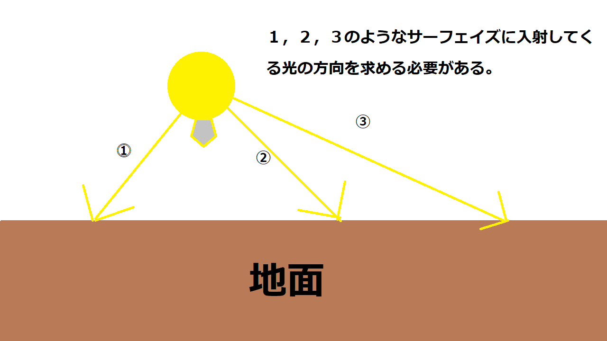</img></br>
&emsp;サーフェイスに入射してくる光の方向は、サーフェイスのワールド座標からポイントライトの座標を引き算して正規化することで求めることができます。</br>

```cpp
//サーフェイスのワールド座標 - ポイントライトの座標。
float3 ligDir = surface.worldPosition - pointLight.position;
//求めたベクトルを正規化する。
ligDir = normalize( ligDir );
```
### 5.1.2 光源との距離による光の減衰
&emsp;ポイントライトの光の影響は距離によって減衰していきます。今回実装するポイントライトでは、次の計算式を使用して距離に比例して、光の影響力が0になっていくようにします。</br>
**D : ポイントライトとサーフェイスの距離**</br>
**R : ポイントライトが影響を与える範囲**</br>
**この時、影響力 Aを次の計算で求める。**</br>
**A = 1 - 1/R × D**</br>
&emsp;この計算式を使った場合に、ポイントライトが影響を与える範囲が400の時の、ポイントライトとサーフェイズの距離による影響力を表5.1に示します。</br>
**表5.1**</br>
| サーフェイスとの距離 | 計算式 | 影響力 |
| ---- | ---- | ---- |
| 0 | 1 - 1 / 400 × 0 | 1(100%)|
| 100 | 1 - 1 / 400 × 100 | 0.75(75%)|
| 200 | 1 - 1 / 400 × 200 | 0.5(50%)|
| 300 | 1 - 1 / 400 × 300 | 0.25(25%)|
| 400 | 1 - 1 / 400 × 400 | 0(0%)|

&emsp;サーフェイスとの距離が離れていくほど影響力が小さくなっていき、影響を与える範囲の限界に来ると、影響力が0になっていることが分かるかと思います。影響力を求める疑似コードを示します。</br>
```cpp
//サーフェイスとポイントライトの距離を計算する。
float D = length( surface.worldPosition - pointLight.position );
//影響力を計算する。
float A = 1.0f - 1.0f / pointLight.range * D;
//影響力がマイナスになる場合(範囲を超えている)は0にする。
if( A < 0.0f){
	A = 0.0f;
}
//2乗することで影響力の変化を指数関数的にする。
A = pow( A, 2.0f );
```
&emsp;ポイントライトとの距離が、ポイントライトの範囲を超えると影響力がマイナスになってしまうので、この疑似コードではif文を使ってマイナスにならないようにしています。</br>
&emsp;また、今回実装するポイントライトでは、影響力にpow関数を利用して、影響力の変化が指数関数的になるようにしています。</br>
**表5.2**</br>
| サーフェイスとの距離 | 計算式 | 影響力 | 影響力(2乗)|
| ---- | ---- | ---- | ---- |
| 0 | 1 - 1 / 400 × 0 | 1(100%)| 1(100% | 
| 100 | 1 - 1 / 400 × 100 | 0.75(75%)| 0.5625(56%) | 
| 200 | 1 - 1 / 400 × 200 | 0.5(50%)| 0.25(25%) |
| 300 | 1 - 1 / 400 × 300 | 0.25(25%) | 0.0625(6%) |
| 400 | 1 - 1 / 400 × 400 | 0(0%)| 0(0%) | 
&emsp;影響力を累乗することで、図5.2のように影響力の強さは線形な変化から、指数関数的な変化となります。自然界には指数関数的な変化をしている現象が多いため、pow関数を利用することでお手軽にリアルな表現を実装できます。</br>

**図5.2**
</img></br>

### 5.1.2 ポイントライト実装まとめ
&emsp;では、ポイントライトの実装方法をまとめます。
1. ポイントライトの座標とサーフェイスのワールド座標で入射してくる光の方向を求める。
2. 1で求めた光の方向を使って、ランバート拡散反射光と鏡面反射光を求める。
3. ポイントライトとサーフェイスとの距離を使って、ライトの影響度を求める。
4. 3で求めたライトの影響度を拡散反射光と鏡面反射光に乗算して、最終的な反射光を求める。

### 5.1.3 【ハンズオン】ポイントライトを実装する。
&emsp;では、ポイントライトを実装していきましょう。Sample_05_01を立ち上げてください。

#### step-1 ライト構造体にポイントライト用のメンバ変数を追加。
&emsp;まずはライト構造体にポイントライト用のメンバ変数を追加します。main.cppの17行目にリスト5.1のプログラムを入力してください。</br>
[リスト5.1 main.cpp]
```cpp
//step-1 ライト構造体にポイントライト用のメンバ変数を追加。
Vector3 ptPosition;		//位置。
float pad2;					//パディング。
Vector3 ptColor;			//カラー。
float ptRange;				//影響範囲。
```
#### step-2 ポイントライトの初期座標を設定する。
&emsp;続いて、ポイントライトの初期座標を設定します。main.cppにリスト5.2のプログラムを入力してください。</br>
[リスト5.2 main.cpp]
```cpp
//step-2 ポイントライトの初期座標を設定する。
light.ptPosition.x = 0.0f;
light.ptPosition.y = 50.0f;
light.ptPosition.z = 50.0f;
```

#### step-4 ポイントライトのカラーを設定する。
&emsp;初期座標が設定出来たら、次はポイントライトの初期カラーを設定します。main.cppにリスト5.3のプログラムを入力してください。</br>
[リスト5.3 main.cpp]
```cpp
//step-3 ポイントライトの初期カラーを設定する。
light.ptColor.x = 15.0f;
light.ptColor.y = 0.0f;
light.ptColor.z = 0.0f;
```

#### step-4 ポイントライトの影響範囲を設定する。
&emsp;続いて、ポイントライトの影響範囲の設定です。この設定を変更することでポイントライトの光が届く範囲を変更することができます。届く範囲を狭くしたい場合は値を小さく、広くしたい場合は値を大きくしてください。では、main.cppにリスト5.4のプログラムを入力してください。</br>
[リスト5.4 main.cpp]
```cpp
//step-4 ポイントライトの影響範囲を設定する。
light.ptRange = 100.0f;
```
#### step-5 コントローラーでポイントライトを動かす。
&emsp;では、c++側は最後です。ポイントライトの初期化が終わったら、ゲームループの中にポイントライトを動かすプログラムを追加してみましょう。XInputに対応しているゲームパッドを持っている人はパソコンに接続してもらえると、左のアナログスティックでポイントライトを動かせるようになります。コントローラーを持っていない人もキーボードのWASDキーで動かすことができます。main.cppにリスト5.5のプログラムを入力してください。</br>
[リスト5.5 main.cpp]
```cpp
//step-5 コントローラーでポイントライトを動かす。
light.ptPosition.x -= g_pad[0]->GetLStickXF();
if (g_pad[0]->IsPress(enButtonB)) {
	light.ptPosition.y += g_pad[0]->GetLStickYF();
}
else {
	light.ptPosition.z -= g_pad[0]->GetLStickYF();
}
```

#### step-6 定数バッファにポイントライト用の変数を追加。
&emsp;ここからはシェーダー側を実装していきます。ポイントライト用のデータにアクセスするために定数バッファに変数を追加します。Assets/shader/sample.fxの36行目にリスト5.6のプログラムを入力してください。</br>
[リスト5.6 sample.fx]
```cpp
//step-6 定数バッファにポイントライト用の変数を追加。
float3 ptPosition;	//ポイントライトの位置。
float3 ptColor;		//ポイントライトのカラー。
float ptRange;		//ポイントライトの影響範囲。
```
#### step-7 このサーフェイスに入射しているポイントライトの光の向きを計算する。
&emsp;続いてピクセルシェーダーです。まずは、サーフェイス(ピクセル)に入射しているポイントライトの光の向きを計算します。光の向きはサーフェイスのワールド座標からポイントライトの座標を減算して、正規化(大きさ１)にすることで求めることができます。sample.fxにリスト5.7のプログラムを入力して下さい。</br>
[リスト5.7 sample.fx]
```cpp
//step-7 このサーフェイスに入射しているポイントライトの光の向きを計算する。
float3 ligDir = psIn.worldPos - ptPosition;
//正規化して大きさ１のベクトルにする。
ligDir = normalize(ligDir);
```

#### step-8 減衰なしのランバート拡散反射光を計算する。
&emsp;入射してくる光の方向を求めることができたら、ランバート拡散反射光を求めることができます。今回のサンプルではランバート拡散反射を求める処理をまとめたCalcLambertDiffuseという関数を著者の方で用意していますので、こちらを使用します。sample.fxにリスト5.8のプログラムを入力して下さい。</br>
[リスト5.8 sample.fx]
```cpp
//step-8 減衰なしのランバート拡散反射光を計算する。
float3 diffPoint = CalcLambertDiffuse(
	ligDir, 		//ライトの方向
	ptColor,	 	//ライトのカラー
	psIn.normal		//サーフェイスの法線
);
```

#### step-9 減衰なしのフォン鏡面反射光を計算する。
&emsp;拡散反射光を求めることができたら、次はフォン鏡面反射光も計算します。こちらも著者の方でフォン鏡面反射光を求める処理をまとめたCalcPhongSpecularという関数を用意していますので、こちらを利用します。sample.fxにリスト5.9のプログラムを入力してください。</br>
[リスト5.9 sample.fx]
```cpp
//step-9 減衰なしのフォン鏡面反射光を計算する。
float3 specPoint = CalcPhongSpecular(
	ligDir, 			//ライトの方向。
	ptColor,		 	//ライトのカラー。
	psIn.worldPos, 		//サーフェイズのワールド座標。
	psIn.normal			//サーフェイズの法線。
);
```

#### step-10 距離による影響率を計算する。
&emsp;step-8とstep-9で求めた反射光は距離による影響率は考慮していませんでした。step-10ではポイントライトとの距離による影響率を計算していきましょう。影響率は距離に比例して小さくなるようになっていて、ポイントライトの範囲を超えると影響率は0になります。sample.fxにリスト5.10のプログラムを入力してください。</br>
[リスト5.10 sample.fx]
```cpp
//step-10 距離による影響率を計算する。
//ポイントライトとの距離を計算する。
float3 distance = length( psIn.worldPos - ptPosition );

//影響率は距離に比例して小さくなっていく。
float affect = 1.0f - 1.0f / ptRange * distance;
//影響力がマイナスにならないように補正をかける。
if( affect < 0.0f){
	affect = 0.0f;
}
//影響の仕方を指数関数的にする。今回のサンプルでは3乗している。
affect = pow( affect, 3.0f );
```

#### step-11 拡散反射光と鏡面反射光に影響率を乗算して影響を弱める。
&emsp;影響率を求めることができたら、反射光に影響率を乗算して、光の影響を距離によって減衰してやりましょう。sample.fxにリスト5.11のプログラムを入力してください。</br>
[リスト5.11 sample.fx]
```cpp
//step-13 拡散反射光と鏡面反射光に減衰率を乗算して影響を弱める。
diffPoint *= affect;
specPoint *= affect;
```

#### step-12 ポイントライトによる反射光とディレクションライトによる反射光を合算して最終的な反射光を求める。
&emsp;では、最後のハンズオンです。ポイントライトによる反射光とディレクションライトによる反射光を合成して、最終的な反射光を求めましょう。sample.fxにリスト5.12のプログラムを入力してください。</br>
[リスト5.12 sample.fx]
```cpp
//step-14 ポイントライトによる反射光とディレクションライトによる反射光を合算して最終的な反射光を求める。
float3 diffuseLig = diffPoint + diffDirection;
float3 specularLig = specPoint + specDirection;
```
&emsp;入力出来たら、実行してみてください。うまくいっていたら図5.3のようなプログラムが実行できます。コントローラーの左スティックでポイントライトを動かすことができますので、動かしてみてください。Bボタン(キーボードならK)を押しながら左スティックで上下にも移動します。</br>
**図5.3**</br>
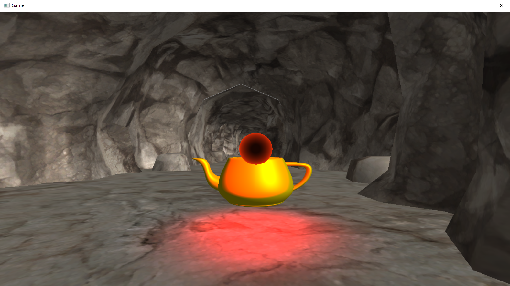</img></br>

## 5.2 スポットライト
&emsp;スポットライトとはアイドルのライブステージや、スポーツの試合などで使用される図5.4のようなライトです。</br>
**図5.4**</br>
</img></br>
&emsp;このチャプターではこのようなスポットライトを実装していきます。しかし、だだし、本来スポットライトというのは、空気中の塵を照らすため、光の筋が見えるような現象も見えるのですが、ここで実装するポイントライトは物体に照射された光のみの実装になります。(図5.5)

**図5.5**</br>
</img></br>
&emsp;今回実装するスポットライトはポイントライトとほとんど同じプログラムになります。ポイントライトのデータに光の放射方向と、光の放射角度を追加することで実装できます。処理の手順としては下記のようになります。
1. スポットライトの位置を光源とみなして、ポイントライトを計算する。
2. スポットライトの位置からサーフェイスに向かって伸びるベクトルを計算する。
3. 2で求めたベクトルとスポットライトの射出方向とで内積を使って、角度を求める。
4. 3で求めた角度を使って、ライトの影響率を計算する。

&emsp;では、各ステップを詳細に見ていきましょう。

### 5.2.1 スポットライトの位置を光源とみなして、ポイントライトを計算する。
&emsp;この処理はポイントライトの処理と全く同じです。スポットライトの位置とスポットライトの照射範囲を使ってポイントライトと同じ処理を行います。すると図5.6のようなライティング結果となります。</br>

**図5.6**</br>
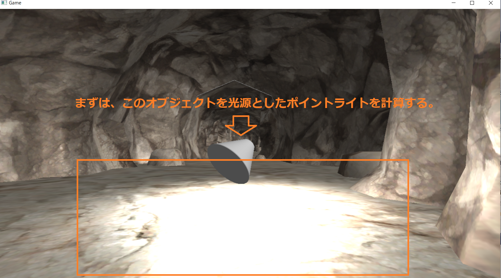</img></br>

### 5.2.2 スポットライトの位置からサーフェイスに向かって伸びるベクトルを計算する。

&emsp;ポイントライトの計算ができたら、図5.7のようにスポットライトの位置からサーフェイスに向かって伸びるベクトルを計算します。</br>

**図5.7**</br>
</img></br>
&emsp;このベクトルは、サーフェイスのワールド座標―スポットライトの座標で求めることができます。また、このベクトルは正規化を行っておく必要があります。</br>

### 5.2.3 2で求めたベクトルとスポットライトの射出方向とで内積を使って、角度を求める。
&emsp;続いて、先ほど求めたベクトルを使って、図5.8のようにスポットライトの射出方向と照射しているサーフェイスの角度を求めます。</br>
**図5.8**</br>
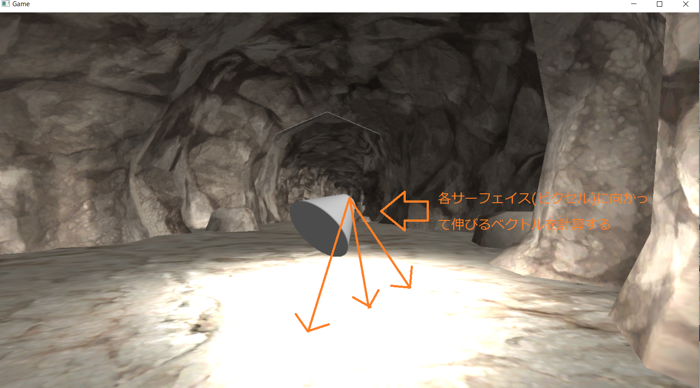</img></br>
&emsp;この角度は内積の下記のような性質を利用すると求めることができます。</br>
**正規化されたベクトル同士の内積の結果は、その二つのベクトルのなす角度の逆余弦の値になる。**</br>
&emsp;なんのことかよく分らないと思いますが、ようはリスト5.13のようなプログラムで、二つのベクトルの間の角度を求めることができるということです。</br>
[リスト5.13]
```cpp
//ベクトルv1とv2のなす角度を求める。
//まずはv1とv2の内積を計算する。
float t = dot( v1, v2 );
//内積の結果をacos関数に与えて、角度に戻す。
float angle = acos(t);
```
&emsp;この性質を利用して、スポットライトの射出方向と照射しているサーフェイスに向かって伸びるベクトルとの内積を求めて、`acos()`を利用することでサーフェイスとの角度を求めることができます。角度を求めることができたら、スポットライトの照射角度の範囲外は照射しないようにすることで図5.9のようなライティングを行うことができます。</br>

**図5.9**</br>
</img></br>

### 5.2.4 3で求めた角度を使って、ライトの影響率を計算する。
&emsp;最後に3で求めた角度を使ってライトの影響を減衰させます(図5.10)。これはポイントライトの減衰と同じ考え方で、角度が大きくなるにしたがってライトの影響率を下げていくことで実現できます。今回のサンプルではポイントライトの実装と同じようにpow関数を利用することで、指数関数的な減衰を実現しています。</br>
**図5.10**</br>
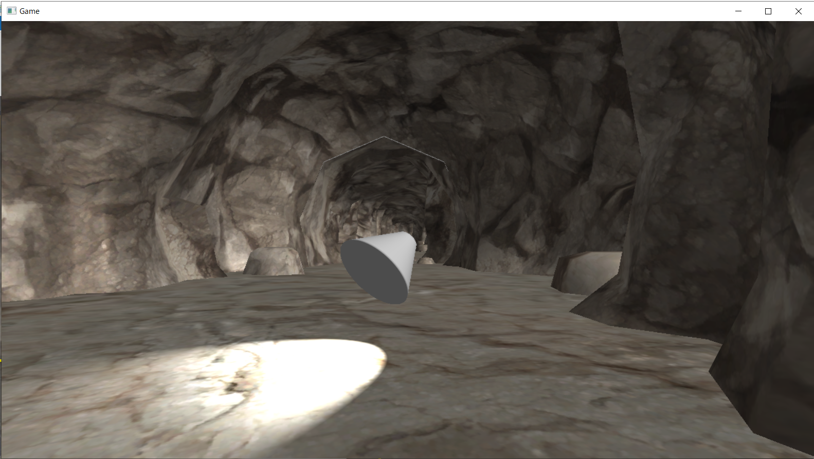</img></br>

### 5.2.4 【ハンズオン】スポットライトを実装する。
では、ハンズオンでスポットライトを実装していきましょう。`Smaple_05_02/Sample_05_02.sln`を立ち上げてください。</br>

#### step-1 ライト構造体にスポットライト用のメンバ変数を追加。
まずは、ライト構造体にスポットライト用のメンバ変数を追加しましょう。スポットライトの実装のために必要なデータは、下記のようになります。
1. ライトの座標(ポイントライトと同じ)
2. ライトのカラー(ポイントライトと同じ)
3. 影響範囲(ポイントライトと同じ)
4. 射出方向
5. 射出角度

これらのデータをライト構造体に追加していきましょう。では、`main.cpp`の23行目にリスト5.13のプログラムを入力してください。</br>
[リスト5.13 `main.cpp`]
```cpp
//step-1 ライト構造体にスポットライト用のメンバ変数を追加。
Vector3 spPosition;		//位置。
float pad3;					//パディング。
Vector3 spColor;			//カラー。
float spRange;				//影響範囲。
Vector3 spDirection;	//射出方向。
float spAngle;				//射出角度。
```

#### step-2 スポットライトのデータを初期化する。
続いてスポットライトのデータを初期化しましょう。リスト5.14のプログラムを入力してください。</br>
[リスト5.14 `main.cpp`]
```cpp
//step-2 スポットライトのデータを初期化する。
//初期座標はX = 0、Y = 50、Z = 0にする。
light.spPosition.x = 0.0f;
light.spPosition.y = 0.0f;
light.spPosition.y = 50.0f;
//ライトのカラーを設定。R = 10、G = 10、B = 10にする。
light.spColor.x = 10.0f;
light.spColor.y = 10.0f;
light.spColor.z = 10.0f;

//初期方向は斜め下にする。
light.spDirection.x = 1.0f;
light.spDirection.y = -1.0f;
light.spDirection.z = 1.0f;
//方向データなので、大きさを１にする必要があるので正規化する。
light.spDirection.Normalize();

//射出範囲は300
light.spRange = 300.0f;
//射出角度は25度。
light.spAngle = Math::DegToRad(25.0f);
```

射出角度はラジアン単位で指定する必要があります。今回は著者のほうで用意している、デグリー角度からラジアン角度を求めるMath::DegToRad()を利用して角度を設定しています。

#### step-3 コントローラーの左スティックでスポットライトを移動させる。
ライトの初期化ができたら今度はゲームループの中にコントローラーの入力でスポットライトを移動させるプログラムを追加しましょう。リスト5.15のプログラムを入力してください。</br>
[リスト5.15 `main.cpp`]
```cpp
//step-3 コントローラーの左スティックでスポットライトを移動させる。
//左のアナログスティックで動かす。
light.spPosition.x -= g_pad[0]->GetLStickXF();
if (g_pad[0]->IsPress(enButtonB)) {
	//Bボタンが一緒に押されていたらY軸方向に動かす。
	light.spPosition.y += g_pad[0]->GetLStickYF();
}
else {
	//Z軸方向に動かす。
	light.spPosition.z -= g_pad[0]->GetLStickYF();
}
```

#### step-4 コントローラー右スティックでスポットライトを回転させる。
続いて、コントローラーの右スティックの入力でスポットライトを回転させましょう。リスト5.16のプログラムを入力してください。

[リスト5.16 `main.cpp`]
```cpp
//step-4 コントローラー右スティックでスポットライトを回転させる。
//Y軸周りの回転クォータニオンを計算する。
Quaternion qRotY;
qRotY.SetRotationY(g_pad[0]->GetRStickXF() * 0.01f);
//計算したクォータニオンでライトの方向を回す。
qRotY.Apply(light.spDirection);

//X軸周りの回転クォータニオンを計算する。
Vector3 rotAxis;
rotAxis.Cross(g_vec3AxisY, light.spDirection);
Quaternion qRotX;
qRotX.SetRotation(rotAxis, g_pad[0]->GetRStickYF() * 0.01f);
//計算したクォータニオンでライトの方向を回す。
qRotX.Apply(light.spDirection);
```
このコードではクォータニオンを利用してライトの方向を回すプログラムを作成していますが、クォータニオンの説明は本書の目的である、リアルタイムCGプログラミングのアルゴリズムを学ぶという点からずれてしまい、数学的な話になってしまいますので、詳細な説明は割愛させていただきます。本書では、クォータニオンは任意の軸周りの回転を扱うことができ、ベクトルを回したり、回転行列を作成したりすることができる程度の認識で大丈夫です。</br>

#### step-5 スポットライトのデータにアクセスするための変数を追加する。
続いてシェーダー側のプログラムを実装していきます。まずは、cpp側で用意されたスポットライトのデータにアクセスするための変数を定数バッファに追加しましょう。`Assets/shader/sample.fx`を開いてリスト5.17のプログラムを入力してください。</br>
[リスト5.17 `sample.fx`]
```cpp
//step-5 スポットライトのデータにアクセスするための変数を追加する。
float3 spPosition;	//スポットライトの位置。
float3 spColor;		//スポットライトのカラー。
float spRange;		//スポットライトの射出範囲。
float3 spDirection;	//スポットライトの射出方向。
float spAngle;		//スポットライトの射出角度。
```

#### step-6 このサーフェイスに入射しているスポットライトの光の向きを計算する。
では、ここからはピクセルシェーダーを改造して、スポットライトの計算を行っていきます。step-6～step-10までのプログラムはポイントライトと全く同じになります。では、まずは、スポットライトからサーフェイス(ピクセル)に入射してくる光の向きを計算しましょう。リスト5.18のプログラムを入力してください。</br>
[リスト5.18 `sample.fx`]
```cpp
//step-6 このサーフェイスに入射しているスポットライトの光の向きを計算する。
//ピクセルの座標 - スポットライトの座標を計算。
float3 ligDir = psIn.worldPos - spPosition;
//正規化して大きさ１のベクトルにする。
ligDir = normalize(ligDir);
```

#### step-7 減衰なしのランバート拡散反射光を計算する。
入射してくる光の向きを計算することができたら、拡散反射光を計算します。リスト5.19のプログラムを入力してください。</br>
[リスト5.19 `sample.fx`]
```cpp
//step-7 減衰なしのランバート拡散反射光を計算する。
float3 diffSpotLight = CalcLambertDiffuse(
	ligDir, 		//ライトの方向
	spColor,	 	//ライトのカラー
	psIn.normal		//サーフェイスの法線
);
```

#### step-8 減衰なしのフォン鏡面反射光を計算する。
続いて鏡面反射光を計算しましょう。リスト5.20のプログラムを入力してください。</br>
[リスト5.20 `sample.fx`]
```cpp
//step-8 減衰なしのフォン鏡面反射光を計算する。
float3 specSpotLight = CalcPhongSpecular(
	ligDir, 			//ライトの方向。
	spColor,		 	//ライトのカラー。
	psIn.worldPos, 		//サーフェイズのワールド座標。
	psIn.normal			//サーフェイズの法線。
);
```

#### step-9 距離による影響率を計算する。
減衰なしの反射光を求めることができたので、次は距離による減衰率を計算します。この計算もポイントライトのものと全く同じです。リスト5.21のプログラムを入力してください。</br>
[リスト5.21 `sample.fx`]
```cpp
//step-9 距離による影響率を計算する。
//スポットライトとの距離を計算する。
float3 distance = length( psIn.worldPos - spPosition );

//影響率は距離に比例して小さくなっていく。
float affect = 1.0f - 1.0f / spRange * distance;
//影響力がマイナスにならないように補正をかける。
if( affect < 0.0f){
	affect = 0.0f;
}
//影響の仕方を指数関数的にする。今回のサンプルでは3乗している。
affect = pow( affect, 3.0f );
```

#### step-10 拡散反射光と鏡面反射光に影響率を乗算して反射光を弱める。
距離による影響率を求めることができたので、反射光に影響率を乗算して、反射光を弱めましょう。リスト5.22のプログラムを入力してください。</br>
[リスト5.22 `sample.fx`]
```cpp
//step-10 拡散反射光と鏡面反射光に影響率を乗算して影響を弱める。
diffSpotLight *= affect;
specSpotLight *= affect;
```

#### step-11 入射光と射出方向の角度を求める。
ここからはスポットライト固有のプログラムになっていきます。まずはサーフェイスへの入射光とスポットライトの射出方向との角度を求めましょう。この角度は内積と逆余弦関数を利用することで求めることができます。では、リスト5.23のプログラムを入力して下さい。</br>
[リスト5.23 `sample.fx`]
```cpp
//step-11 入射光と射出方向の角度を求める。
//dot()を利用して内積を求める。
float angle = dot( ligDir, spDirection);
//dot()で求めた値をacos()に渡して角度を求める。
angle = acos(angle);
```

#### step-12 角度による影響率を求める。
角度を求めることができたら影響率を計算しましょう。この計算の考え方は、距離によるものとよく似ています。角度の大きさに比例して影響率を小さくしていきます。また、影響率を累乗することで、影響率の変化を指数関数的にしています。これも距離によるものと同じ考え方です。リスト5.24のプログラムを入力してください。</br>
[リスト5.24 `sample.fx`]
```cpp
//step-12 角度による影響率を求める。
//角度に比例して小さくなっていく影響率を計算する。
affect = 1.0f - 1.0f / spAngle * angle;
//影響力がマイナスにならないように補正をかける。
if( affect < 0.0f){
	affect = 0.0f;
}
//影響の仕方を指数関数的にする。今回のサンプルでは0.5乗している。
affect = pow( affect, 0.5f );
```
#### step-13 角度による影響率を反射光に乗算して、影響を弱める。
求めた影響率を反射光に乗算して、影響率を弱めましょう。リスト5.25のプログラムを入力してください。</br>
[リスト5.25 `sample.fx`]
```cpp
//step-13 角度による影響率を反射光に乗算して、影響を弱める。
diffSpotLight *= affect;
specSpotLight *= affect;
```
#### step-14 スポットライトの反射光を最終的な反射光に足し算する。
いよいよ最後の実装です。スポットライトの反射光を最終的な反射光に足し算しましょう。リスト5.26のプログラムを入力してください。</br>
[リスト5.26 `sample.fx`]
```cpp
//step-14 スポットライトの反射光を最終的な反射光に足し算する。
finalLig += diffSpotLight + specSpotLight;
```
ここまで実装できたら実行してみてください。図5.11のようなプログラムが実行できたら完成です。コントローラーの入力でスポットライトを動かすことができますので、こちらも試してみてください。</br>

**図5.11**</br>
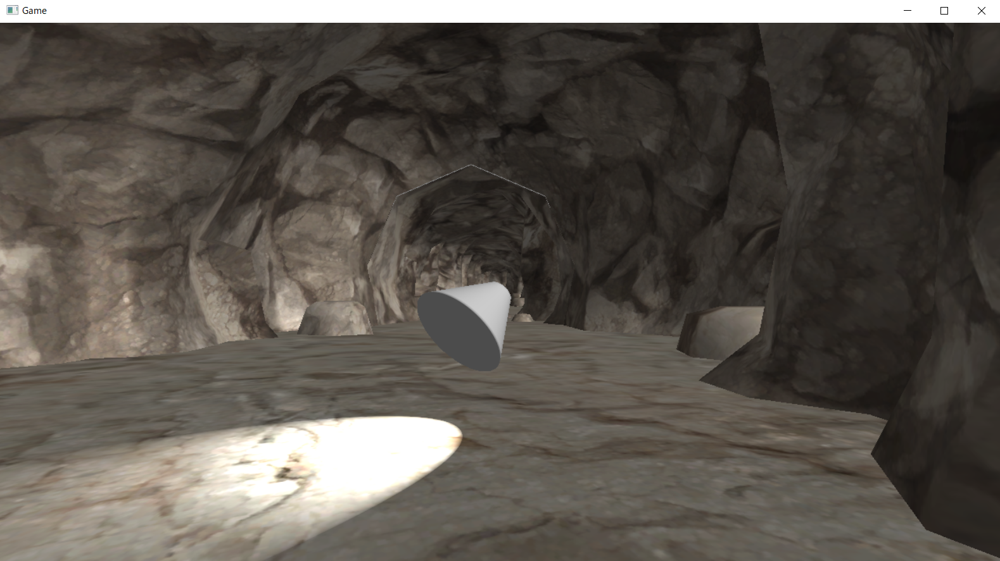</img></br>

<!-- 改ページ. -->
<div style="page-break-before:always"></div>

## 5.3 リムライト
リムライトは逆光ライトとも呼ばれます。図5.12のような表現のことです。</br>

**図5.12**</br>
</img></br>

図5.12の写真は後ろから当たっている光が被写体を透過して、図5.13のように被写体の輪郭がうっすらと光っています。</br>
**図5.13**</br>
</img></br>
このような現象を再現するのがリムライトです。この逆光表現は動物の毛の表現でも使われることがあり、ファーシェーダーというように呼ばれていたりもします。(図5.14)</br>

**図5.14**</br>
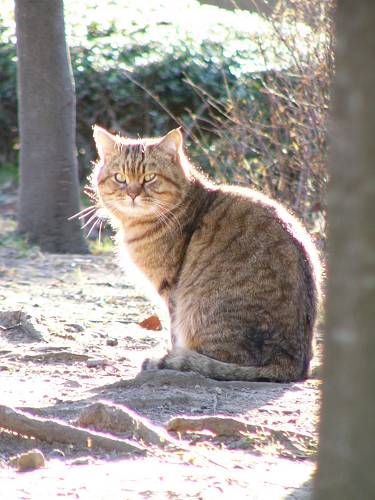</img></br>
逆光ライトは次の２点について考えることで実装することができます。

1.サーフェイスの法線と光の入射方向

2.サーフェイスの法線と視線の方向

では、この２点について詳しく見ていきましょう。
### 5.3.1 サーフェイスの法線と光の入射方向
まず、リムライトは図5.15のように、光の向きとサーフェイスの法線が垂直に近い箇所で強く発生すると考えることができます。</br>
**図5.15**</br>
</img></br>
この強さは光の向きとサーフェイスの法線とで内積を利用すると求めることができます。</br>
内積には次のような性質があります。</br>
**「正規化された二つのベクトルの内積は、その二つのベクトルのなす角が0度なら1.0、90度なら0.0、180度なら-1.0を返す」**</br>
図5.16を見てみてください。</br>
**図5.16**</br>
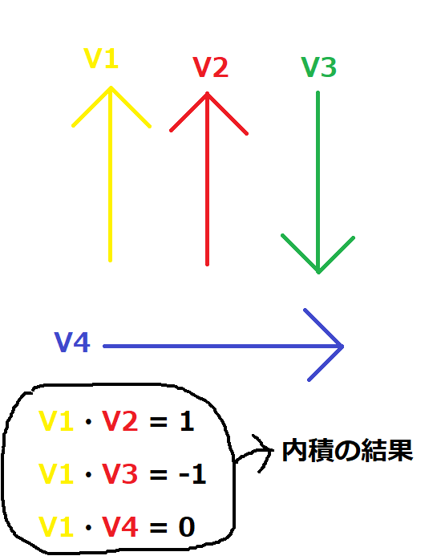</img></br>
この性質は非常に重要で、リアルタイムCGの計算で何度も出てきます。実はこれは、ランバート拡散反射で光の強さを求めるときに利用したものと全く同じです。図4.10と表4.1を見てみてください。二つのベクトルのなす角度が0度の内積は1、90度の内積は0、180度の内積は-1になっています。</br>
今回は光の向きとサーフェイスの法線が垂直(90度)になるほどリムライトの影響を強くしたい(100%にしたい)わけなので、下記のような計算でリムライトの強さを求めることができます。</br>
**1 - max{ 0,  ライトの方向 ・ 法線  }**</br>
ライトの方向と法線の角度が垂直であれば、内積の結果は0になるため、計算すると1(100%)になります。逆にライトの方向と法線が同じ向きであれば、1になるため、計算すると0(0%)となります。これをリムライトの強さとして考えます。

### 5.3.2 サーフェイスの法線と視線の方向
リムライトの強さを決めるのは、サーフェイスの法線とライトの方向のみではありません。サーフェイスの法線と視線の方向でも決まります。図5.17と図5.18を見てみてください。</br>
**図5.18**</br>
</img></br>

**図5.19**</br>
</img></br>


つまり、リムライトさは「サーフェイスの法線と視線の方向が９０度に近いほど強くなる」という特性あります。この強さの求め方は5.3.1節と全く同じ考え方です。次の計算を行うことで求めることができます。</br>
**1 - max{ 0, 視線の方向 ・ 法線 * -1 }**</br>
ライトの方向との時と違う点は、視線の方向がライトとは逆向きなので、-1を乗算していることです。

### 5.3.3 リムライトの強さを乗算する
さて、5.3.1と5.3.2でリムライトの強さに影響を与える二つの要素について計算することができました。後は、その二つを乗算することで最終的なリムライトの強さを求めることができます。では、最後にリムライトの強さを求める疑似コードを示します。</br>
```cpp
//ライトの方向をL、視線の方向をeyeDir、法線をNとする。

//ライトの方向と法線で内積を計算。
float power1 = dot( L, N );		
//内積結果がマイナスであれば0にする。
power1 = max( 0.0f, power1 );	
//1から引いて、ライトの方向に依存するリムの強さを計算する。
power1 = 1.0f - power1;

//視線の逆方向と法線で内積を計算する。
float power2 = dot( -eyeDir, N );
//内積結果がマイナスであれば0にする。
power2 = max( 0.0f, power2 );	
//1から引いて、視線の方向に依存するリムの強さを計算する。
power2 = 1.0f - power2;

//二つの強さを乗算して、最終的なリムの強さを求める。
float limPower = power1 * power2;
```
`max()`はHLSLの組み込み関数です。二つの引数を受け取り、大きいほうの数値を返します。マイナスになる値を0に補正する場合などによく利用されます。

### 5.3.4 【ハンズオン】リムライトを実装しよう。
では、ハンズオンでリムライトを実装していきましょう。今回の実装ではディレクションライトによるリムライトを実装します。すでにディレクションライトの情報をグラフィックメモリに転送するコードは実装できているので、今回改造するのはシェーダー側だけとなります。`Sample_05_03/Sample_05_03.sln`を立ち上げてください。
#### step-1 ピクセルシェーダーへの入力にカメラ空間の法線を追加。
まずは、ピクセルシェーダーへの入力にカメラ空間の法線を追加します。これはカメラを原点(0,0,0)、カメラの右をX軸(1,0,0)、上をY軸(0,1,0)、奥をZ軸(0,0,1)とした空間です。この空間のサーフェイスの法線をピクセルシェーダーに渡すようにしたいわけです。この理由は後述します。Assets/shader/sample.fxを開いてリスト5.27のプログラムを入力してください。</br>

[リスト5.27 `sample.fx`]
```cpp
//step-1 ピクセルシェーダーへの入力にカメラ空間の法線を追加。
float3 normalInView	: TEXCOORD2;	//カメラ空間の法線。
```

#### step-2 カメラ空間の法線を求める。
ピクセルシェーダーの入力にカメラ空間の法線を追加したので、頂点シェーダーでカメラ空間の法線を計算します。カメラ空間に変換するのは、ワールド空間の法線に、カメラ行列を乗算するだけです。リスト5.28のプログラムを入力してください。</br>

[リスト5.28 `sample.fx`]
```cpp
//step-2 カメラ空間の法線を求める。
psIn.normalInView = mul( mView, psIn.normal);//カメラ空間の法線を求める。
```

#### step-3 サーフェイスの法線と光の入射方向に依存するリムの強さを求める。
いよいよピクセルシェーダーにリムライトの計算のプログラムを実装していきます。最初の計算はサーフェイスの法線と光の入射方向に依存するリムの強さを求めています。これは5.3.1節で説明した内容です。リスト5.29のプログラムを入力してください。</br>

[リスト5.29 `sample.fx`]
```cpp
//step-3 サーフェイスの法線と光の入射方向に依存するリムの強さを求める。
float power1 = 1.0f - max( 0.0f, dot( dirDirection, psIn.normal));
```

#### step-4 サーフェイスの法線と視線の方向に依存するリムの強さを求める。
続いて、サーフェイスの法線と視線の方向に依存するリムの強さを求めます。これも5.3.2節で説明した内容なのですが、今回は計算を簡略化するために、カメラ空間のサーフェイスの法線を利用しています。視線の方向はカメラ空間なので(0,0,1)となります。内積の公式は次のようなものでした。</br>
**V1.x × V2.x + V1.y × V2.y + V1.z × V2.z**</br>
視線のX方向とY方向の値は0、Zの方向は1とになっているため、内積の結果は法線のZの値と同じになります。ですので、リスト5.30のプログラムでは`dot()`は利用しておらず、カメラ空間の法線のZ値をそのまま使用しています。では、リスト5.30のプログラムを入力してください。</br>

[リスト5.30 `sample.fx`]
```cpp
//step-4 サーフェイスの法線と視線の方向に依存するリムの強さを求める。
float power2 = 1.0f - max( 0.0f, psIn.normalInView.z * -1.0f);
```

#### step-5 最終的なリムの強さを求める。
「サーフェイスの法線と光の入射方向に依存するリムの強さ」と「サーフェイスの法線と視線の方向に依存するリムの強さ」が求まったら、その二つの強さを乗算して最終的なリムの強さを求めましょう。また、ここでも`pow()`を利用して、リムの強さの変化を指数関数的にしています。ここでは1.3乗しています。では、リスト5.31のプログラムを入力してください。</br>

[リスト5.31 `sample.fx`]
```cpp
//step-5 最終的なリムの強さを求める。
float limPower = power1 * power2;
//pow()を使用して、強さの変化を指数関数的にする。
limPower = pow( limPower, 1.3f);
```

#### step-6 最終的な反射光にリムライトの反射光を合算する。
では最後です。最終的な反射光にリムライトの反射光を合算しましょう。リスト5.32のプログラムを入力して下さい。</br>
[リスト5.32 `sample.fx`]
```cpp
//step-6 最終的な反射光にリムライトの反射光を合算する。
//まずはリムライトのカラーを計算する。
float3 limColor = limPower * dirColor;
//最終的な反射光にリムの反射光を合算する。
finalLig += limColor;
```
入力出来たら実行してみてください。図5.20のようなプログラムが実行できたら完成です。</br>

**図5.20**</br>
</img></br>
XInput対応のゲームパッドであれば左スティックを動かすとライトを回すことができます。ゲームパッドがない場合はキーボードのAキーとDキーでまわすことができます。リムライトの効果を確認してみてください。

<!-- 改ページ. -->
<div style="page-break-before:always"></div>

## 5.4 半球ライト
4.3.5節で環境光について勉強しました。現実世界の物体は、太陽などの直接光の影響だけを受けているわけではなく、地面からの照り返し、ビルの照り返し、など様々な物体に反射した間接光の影響を受けています。しかし、地面の照り返しなどの２次反射の計算を真面目に実行すると、膨大な計算量となってしまいます。そこで、ゲームでは「物体は一律で同じ間接光を受けている」という環境光の計算モデルについて学びました。ここで勉強する半球ライトはこの環境光の計算を、シンプルな計算でもう少しだけマシなものにしたライトです。
### 5.4.1 地面色と天球色
半球ライトは地面の色(地面からの照り返し)と天球色(空の色)を考慮したライトです。このライトはサーフェイスの法線と地面との内積を計算するだけのシンプルな計算で処理できます。そのため、PlayStation3などの、今と比べるとGPUの計算速度が心もとないゲーム機で発売されたゲームで採用事例がありました。現在でもスマートフォンなどのゲームでは、お手軽な環境光の処理として使えるのではないかと思います。
### 5.4.2 半球ライトの計算
半球ライトの計算を行うためには、地面色、天球色、地面の法線、サーフェイスの法線が必要になります。今回のサンプルでは地面色、天球色、地面の法線は固定的なものとしています。サーフェイスの法線はピクセルシェーダに渡されてくる法線です。半球ライトのデータは次のようになります。
```cpp
struct HemisphereLight{
	Vector3 skyColor;		//天球色
	Vector3 groundColor;	//地面色
	Vector3 groundNormal;	//地面の法線。
};
```
半球ライトの計算は地面の法線とサーフェイスの法線とで内積を計算します(図5.21)。</br>
**図5.21**
</img></br>

サーフェイスが空の方向を向いているのであれば1、地面の方を向いているのであれば-1を返してきます(図5.22)。</br>
**図5.22**
</img></br>
この内積の結果を使って地面色と天球色を線形補完するのですが、線形補完で使用する値は0.0～1.0になっている必要があるので、次の計算式のように、内積の結果に1.0を加算して2で割ることによって、内積の結果が0.0～1.0に変換されます。</br>
**( 内積の結果[-1.0～1.0] + 1.0 ) ÷ 2.0  = ( 0.0～1.0)**</br>
後は、0.0～1.0に変換された値を使って、次のように天球色と地面色を線形補完します。疑似コードは次のようになります。

```cpp
//天球色はskyColor、地面の色はgroundColor、
//地面の法線はgroundNormal、サーフェイスの法線はnormalとする。

//まず、サーフェイスの法線と地面の法線の内積を求める。
float t = dot( normal, groundNormal );
//内積の結果を0～1に変換する。
t = ( t + 1.0f ) / 2.0f;
//0～1に変換されたtを利用して、半球ライトを求める。
float3 hemiLight = skyColor * t + groundColor( 1.0f * t);

```


### 5.4.3 【ハンズオン】半球ライトを実装しよう。
では、半球ライトを実装していきましょう。`Sample_05_04/Sample_05_04.sln`を立ち上げて`main.cpp`を開いてください。</br>
#### step-1 地面色、天球色、地面の法線追加。
まずは、ライト構造体に地面色、天球色、地面の法線のデータを追加しましょう。リスト5.33のプログラムを`main.cpp`の21行目に入力して下さい。</br>
[リスト5.33 `main.cpp`]
```cpp
//step-1 地面色と天球色を追加。
Vector3 groundColor;	//地面色。
float pad4;
Vector3 skyColor;		//天球色。
float pad5;
Vector3 groundNormal;	//地面の法線。
```

#### step-2 地面色、天球色、地面の法線のデータを設定。
続いて、各種データを設定しましょう。今回は全て固定のデータとしています。リスト5.34のプログラムを入力してください。</br>
[リスト5.34 `main.cpp`]
```cpp
//step-2 地面色、天球色、地面の法線のデータを設定。

//地面色を設定。
light.groundColor.x = 0.7f;
light.groundColor.y = 0.5f;
light.groundColor.z = 0.3f;

//天球色を設定。
light.skyColor.x = 0.15f;
light.skyColor.y = 0.7f;
light.skyColor.z = 0.95f;

//地面の法線を設定。
light.groundNormal.x = 0.0f;
light.groundNormal.y = 1.0f;
light.groundNormal.z = 0.0f;
```

#### step-3 半球ライトのデータにアクセスするための変数を定数バッファに追加。
では、続いてシェーダー側です。`Assets/shader/sample.fx`を開いて36行目にリスト5.35のプログラムを入力してください。</br>
[リスト5.35 `sample.fx`]
```cpp
//step-3 半球ライトのデータにアクセスするための変数を定数バッファに追加。
float3 groundColor;		//照り返しのライト。
float3 skyColor;		//天球ライト。
float3 groundNormal;	//地面の法線
```

#### step-4 半球ライトを計算する。
続いてピクセルシェーダーで半球ライトの計算を行いましょう。ここで実装するプログラムは5.4.2節で示した計算と全く同じ考え方のものです。リスト5.36のプログラムを入力してください。</br>
[リスト5.36 `sample.fx`]
```cpp
//step-4 半球ライトを計算する。
//サーフェイスの法線と地面の法線との内積を計算する。
float t = dot( psIn.normal, groundNormal);
//内積の結果を０～１の範囲に変換する。
t = ( t + 1.0f ) / 2.0f;
//地面色と天球色を補完率ｔで線形補完する。
float3 hemiLight = lerp(groundColor , skyColor, t);
```
lerp関数はHLSLの組み込み関数で線形補完を行ってくれます。内部で行われている計算は5.4.2節で紹介した次のようなものです。</br>
**groundColor * ( 1.0f - t ) + skyColor * t**
lerp関数はよく使う関数なので、覚えておくと便利です。

#### step-5 半球ライトを最終的な反射光に加算する。
では、最後です。step-4で求めた半球ライトを最終的な反射光に加算しましょう。リスト5.37のプログラムを入力してください。</br>
[リスト5.37 `sample.fx`]
```cpp
//step-5 半球ライトを最終的な反射光に加算する。
finalLig += hemiLight;
```
入力出来たら実行してみてください。うまく実装できていれば、図5.23のようなプログラムが実行できます。ティーポットの下側から上側に向かってなだらかに環境光の影響が変化していることが分かります。</br>
**図5.23**</br>
</img></br>


## 5.6 キューブマップベースのIBL
10月下旬

<!-- 改ページ. -->
<div style="page-break-before:always"></div>

# Chapter 6 いろいろなテクスチャの利用
ここまでテクスチャは、「物体の模様を表現するための画像データ」として扱ってきていました。このような、模様を表すテクスチャはディフューズマップと呼ばれます。実はテクスチャは模様を表すディフューズマップ以外にも、凸凹を表現する法線マップ、高さを表すハイトマップ、透明度を表す透明度マップなど、様々なデータとして利用されます。このチャプターでは、このような色々なテクスチャを利用したシェーダープログラミングについて見ていきます。

## 6.1 法線マップ
法線マップは物体の凸凹を表現するためのテクスチャです。法線マップを活用することで、少ないポリゴン数でも細かなディテールを表現することが可能になります。
### 6.1.1 法線マップの登場
コンソールゲーム機で法線マップが本格的に使われだしたのは、PS3、Xbox360が登場してからになります。法線マップはプログラマブルシェーダーが登場してから生まれた技術のため、固定パイプラインには存在しません。そのためプログラマブルシェーダーを本格的に使用することが可能になったPS3、Xbox360の世代でコンソールゲーム機でも法線マップが活用されるようになりました。そして、現在はPS4、XboxOne、PC、スマートフォンなどでリリースされる多くの3Dゲームではあって当たり前の技術になっています。
### 6.1.2 細かいディテールの表現
法線マップの目的は低ポリゴンで細かなディテールを表現することです。では、それを具体的に考えていきましょう。例えば道路のアスファルトを考えてみてください。アスファルトを近くでよく観察をしてみると細かな凹凸があることが分かります。もしこの凹凸をポリゴンで表現しようとすると非常に多くのポリゴンが必要になります。多すぎるポリゴンはGPUのパフォーマンスを低下させ、多くのメモリを使用してしまうことになります。このような細かいディテールの表現をポリゴンで行うことには多くの問題がありました。そこでこれらを高いパフォーマンスと少ないメモリ使用量で実現するために法線マップという技術が生まれました。
### 6.1.3 法線をテクスチャに描き込む
引き続き、先ほどのアスファルトの凹凸で考えていきましょう。私たちはどうやってアスファルトの凸凹を認識しているのでしょうか？ 実は凸凹を認識するために一番重要な情報は光の陰影になります。図6.1を見てみてください。</br>

**図6.1**</br>
</img></br>
立体的に見えると思います。しかしこれらは全て平らなノートに書かれた絵であって実際には凹凸はありません。このように人間は実際に凹凸がなくても、陰影をつけることで実際に凹凸があるように錯覚します。陰影はChapter5で勉強した拡散反射や鏡面反射の計算で行うことができます。拡散反射や鏡面反射の計算式を思い出してください。ライトによって生成される陰影はライトの方向とモデルの法線によって決まっていました。つまり、ポリゴン数が少なくてもモデルの法線さえ詳細であれば、細かなディテールは表現できることになります。いわゆるだまし絵です。そこで、モデルの法線をテクスチャに書き込んでしまって、ライティングの時にはその法線を使用しようという考えが生まれます。これが法線マップです。図6.2はユニティちゃんの法線マップです。</br>

**図6.2**</br>
</img></br>
テクスチャのRGB成分に、法線のXYZ成分を書き込んでテクスチャにしたものです。

### 6.1.4 オブジェクトスペース法線マップとタンジェントスペース法線マップ
法線マップにはオブジェクトスペース法線マップとタンジェントスペース法線マップという二種類のデータ形式があります。オブジェクトスペース法線マップは、オブジェクト空間の法線マップです。タンジェントペース法線マップは法線空間での法線マップです。ではこの二つについて見ていきましょう。

### 6.1.5 オブジェクトスペース法線マップ
オブジェクトスペースはタンジェントスペースと比べるとイメージがしやすい法線マップです。この法線マップは単純にオブジェクトの法線のXYZの値をテクスチャのRGBに書き込んでいるだけです。オブジェクトスペース法線マップは図6.3のようなデータになります。</br>

**図6.3**</br>
</img></br>
先ほどのユニティちゃんの法線マップとは少し違った感じのデータに見えるかと思います。実は先ほどのユニティちゃんの法線マップはタンジェントスペース法線マップです。リスト6.1はオブジェクトスペース法線マップを使って、ランバート拡散反射を計算するHLSLの疑似コードを示します。</br>

[リスト6.1]
```cpp
//法線マップから法線をサンプリング。
float3 normal = normalMap.Sample(sampler, In.uv).xyz;
//法線マップに書き込まれている法線は0.0～1.0で、負の数になっていないので
//負の数に復元する。
normal = ( normal - 0.5f ) * 2.0f;
//法線を回転させて、オブジェクト空間からワールド空間に変換する。
//今回使用している行列は回転成分のみ。
float3 normal = mul( worldRotMatrix, normal );
//法線マップから計算した法線とディレクションライトの方向を使って
//拡散反射光を計算する。
float3 lig = max( dot( ligDirection, -normal) ) ) * ligColor;
```

法線マップはテクスチャなので、書き込まれている値は0～1の範囲になっています。しかし、法線というのは-1～1の範囲の値です。そこで、オブジェクトスペース法線マップでは、-1～1の数値を0～1に変換して書き込まれています。しかし、ライティングを計算するタイミングでは、-1～1の範囲に復元する必要があります。そこで、疑似コードでは、法線マップから法線をサンプリングした後で、その法線から0.5を引き算して、2を掛け算しています。この計算をすると、0～1の範囲が-1～1の範囲に復元されます。表6.1は復元前の法線と、復元後の法線を表したものです。</br>

**表6.1**</br>
| 復元前の法線 | 復元後の法線 |  
| ---- | ---- |
| ( 0, 0.5, 0.5 ) | (1, 0, 0 ) |
| ( 0.5, 0, 0.5 ) | (0, -1, 0) |
| ( 0.5, 0.5, 1.0 ) | (0, 0, 1) |
法線を-1～1の範囲に復元することができたら、法線をワールド空間に変換する必要があります。オブジェクトスペースの法線は、オブジェクトが回転していない空間での法線です。しかし、ゲームのキャラクターや、進行方向に向けて回転するなど動いています。なので、ゲーム中の動き(回転)に合わせて、法線も回転させる必要があります。そこで、法線にワールド行列を乗算して、法線をワールド空間に変換しています。ここで注意してほしいのが、法線をワールド空間に変換するときに平行移動成分は不要だということです。法線は向きの情報のみ保持している情報です。平行移動量は不要です。ですので、今回使用している行列は回転成分のみの行列を使っています。

## 6.1.6 タンジェントスペース法線マップ
タンジェントスペース法線マップは単純にオブジェクトの法線を埋め込んだものではなく、法線マップを貼り付けるポリゴンの法線座標系から見た法線を書き込んでいることになります。ポリゴンの法線座標系というのはポリゴンの法線をZ軸、ポリゴンの法線と直交している接ベクトル(タンジェント)をX軸、法線と接ベクトルの外積で求めた従法線ベクトルをY軸とした空間のことです。図6.4を見てください。</br>
**図6.4**</br>
</img></br>
この画像ですと、Nが法線、Uが接ベクトル、Vが従法線ベクトルになります。この３軸を基底軸とした空間がタンジェントスペースと呼ばれるものです。例えば、Nが(0.707,  0.0,  0.707)というベクトルだった場合、このNと同じ向きのベクトル(0.707,  0.0,  0.707)をタンジェントスペースに変換すると(0, 0, 1)になります。このように法線マップを貼り付けるポリゴンの法線と同じ向きのベクトルはタンジェントスペースに変換すると(0，0，1)に変換されます。これをテクスチャのRGBに変換して書き込むため、(0，0，255)という青いカラーが書き込まれることになります。多くのオブジェクトで法線マップに書き込む法線の方向は、貼り付けるポリゴンの法線から大きく変化することはありません。そのため、タンジェントスペース法線マップは青の成分が強く出る画像データになります。


## 6.1.7 法線空間からワールド空間への変換
ライティングを行うためには法線をワールド空間に変換する必要がありました。では、法線空間の法線をワールド空間に変換する方法について考えていきましょう。この変換の方法を理解するためには、基底軸について理解する必要があります。話を簡単にするために２次元で考えてみましょう。例えば、基底軸ex(1,0)、ey(0,1)の空間で考えてみましょう。基底軸というのはある座標系のX軸とY軸をワールド空間で表したものです。基底軸がex( 1, 0 ), ey( 0, 1 )ということは、これはワールド空間の基底軸です。では、図6.5を見てみてください。</br>
**図6.5**</br>
</img></br>

図6.6のベクトルVはワールド空間のベクトルです。このベクトルはX軸方向に5、Y軸方向に6の大きさを持っています。ベクトルVは次のような計算が成り立ちます。</br>
**V = V0 + V1**</br>

また、V0とV1は次の計算が成り立ちます。</br>

**V0 = V.x × ex**</br>
**V1 = V.y × ey**</br>

つまり、ベクトルVは次の計算式で求めることができます。</br>

**V = V.x × ex + V.y × ey**</br>

exとeyはこの空間の基底軸です。</br>
では、基底軸がex(0.707, -0.707), ey(0.707, 0.707)の場合を考えましょう。図6.6を見てください。</br>
**図6.6**</br>
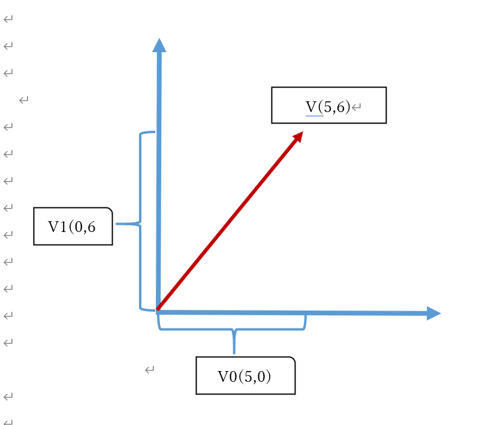</img></br>
図6.6は図6.5と全く同じですが、基底軸が異なっています。つまり、空間が違うということです。Vはワールド空間でのベクトルではなく、基底軸ex(0.707, -0.707), ey(0.707, 0.707)の空間でのベクトルです。これを基底軸ex(1, 0), ey(0,1)のワールド座標系に変換することを考えます。VはV0とV1の合算で求まります。そこで、まずはワールド空間でV0とV1がどのようなベクトルになるか求めてみましょう。V0とV1は下記の計算で求めることができます。</br>

**V0 = V.x × ex**</br>
**V1 = v.y × ey**</br></br>
つまり、ワールド空間のV0とV1は次のようになります。</br></br>
**V0 = 5 × ( 0.707, -0.707 )**</br>
**V0 = (3.535，－3.535)**</br>
**V1 = 6 × ( 0.707, 0.707 )**</br>
**V1 = (3.535，3.535)**</br></br>
ワールド空間でのV0とV1を求めることができたら、あとはV0とV1を足し算してVを求めます。</br></br>
**V = (3.535，－3.535) + (3.535，3.535)**</br>
**V = (7.07，0.0)**</br></br>
よって、(7.07，0.0)がVをワールド空間に変換したベクトルということになります。では、法線空間の法線をワールド空間に変換する話に求めましょう。ワールド空間に変換するためには法線空間の基底軸が必要となります。法線空間の基底軸はexが接ベクトル、eyが従法線、ezがサーフェイスの法線です。この基底軸を使って、法線をワールド空間に変換します。リスト6.2は法線マップからサンプリングした法線をワールド空間に変換する疑似コードです。</br>
[リスト6.2]
```cpp
//法線マップから法線をサンプリング。
float3 normalLocal = normalMap.Sample(sampler, In.uv).xyz;
//法線マップに書き込まれている法線は0.0～1.0で、負の数になっていないので
//負の数に復元する。
normalLocal = ( normal - 0.5f ) * 2.0f;
//ワールド空間の法線を計算する。
//なお、接ベクトルはtangent、従法線はbinormal、サーフェイスの法線はnormalに記録されているものとする。
float3 normalWorld =  localNormal.x * tangent + localNormal.y * binormal + localNormal * normal:
```

## 6.1.8 主流はタンジェントスペース法線マップ
現在主流となっているのはタンジェントスペース法線マップです。特に断りなく法線マップと言った場合はタンジェントスペースを指していると考えてください。
では、なぜタンジェントスペースが主流なのでしょうか。オブジェクトスペースの方が単純で分かりやすく感じたはずです。実はオブジェクトスペースには頂点の変形に対応できないという欠点があり、その欠点はタンジェントスペースであれば解決できます。今の3Dゲームではモーフィング、クロスシミュレーションなどといったオブジェクトの頂点を変形させる技術が使われています。その場合にオブジェクトスペースを使っていると図6.6のような問題が発生します。</br>

**図6.7**</br>
</img></br>
これがオブジェクトスペースの欠点です。一方タンジェントスペースはどうでしょうか？法線はライティングの計算を行うときに、ワールドスペースに変換を行う必要がありましたが、このワールドスペースへの変換を行う時に貼り付けるモデルの法線を使って変換を行うことになります。つまり、オブジェクトが変形した時にポリゴンの法線さえを正しく計算を行っておけば変形後の法線を求めることができます。オブジェクトスペース法線マップは非常にシンプルな考え方になるため、タンジェントスペース法線マップに比べるとGPUパフォーマンスの面では軍配があがります。しかし、頂点の変形に対応できないというデメリットを抱えることとなります。

## 6.1.9 【ハンズオン】法線マップを利用したライティング実装
では、法線マップを利用したライティングを実装していきましょう。`Sample_06_01/Sample_06_01.sln`を立ち上げてください。このサンプルはサーフェイスの法線を利用したランバート拡散反射がすでに実装されていて、実行すると図6.8のようなプログラムが実行できます。</br>
**図6.8**</br>
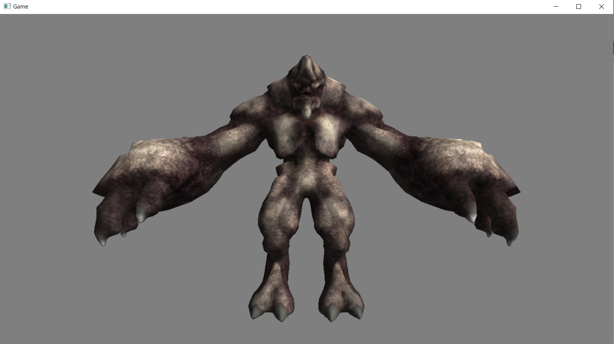</img></br>
このデモはゲームコントローラーの左スティックでカメラが回転、十字キーでライトを回転させることができます。では、このサンプルを改造して、法線マップから計算した法線を利用したライティングを実装していきましょう。

### step-1 頂点シェーダーの入力に接ベクトルと従ベクトルを追加。
今回のデモでは、すでに接ベクトル、従ベクトル、法線マップはGPUで扱えるようになっているため、cpp側は改造する必要がありません。`Assets/shader/sample.fx`を開いてください。まずは、頂点シェーダーの入力に接ベクトルと従ベクトルを追加します。リスト6.3のプログラムを入力してください。</br>
[リスト6.3 `sample.fx`]</br>
```cpp
//step-1 頂点シェーダーの入力に接ベクトルと従ベクトルを追加。
float3 tangent  : TANGENT;
float3 biNormal : BINORMAL;
```
### step-2 ピクセルシェーダーの入力に接ベクトルと従ベクトルを追加。
続いて、ピクセルシェーダーの入力にも接ベクトルと従ベクトルを追加します。リスト6.4のプログラムを入力して下さい。</br>
[リスト6.4 `sample.fx`]</br>
```cpp
//step-2 ピクセルシェーダーの入力に接ベクトルと従ベクトルを追加。
float3 tangent		: TANGENT;		//接ベクトル。
float3 biNormal 	: BINORMAL;		//従ベクトル。
```

### step-3 法線マップにアクセスするための変数を追加。
次は、法線マップにアクセスするための変数を追加します。このサンプルでは法線マップはレジスタt1にバインドされています。リスト6.5のプログラムを入力してください。</br>
[リスト6.5 `sample.fx`]
```cpp
//step-3 法線マップにアクセスするための変数を追加。
Texture2D<float4> g_normalMap : register(t1);
```

### step-4 接ベクトルと従ベクトルをワールド空間に変換する。
各種データにアクセスするための準備が終わったので、いよいよシェーダーを改造していきます。まずは、接ベクトルと従ベクトルを頂点シェーダーからピクセルシェーダーに渡す処理を実装します。リスト6.6のプログラムを入力してください。</br>
[リスト6.6 `sample.fx`]
```cpp
//step-4 接ベクトルと従ベクトルをワールド空間に変換する。
psIn.tangent = normalize(mul(mWorld, vsIn.tangent));
psIn.biNormal = normalize(mul(mWorld, vsIn.biNormal));	
```
頂点シェーダーからピクセルシェーダーにベクトルをワールド空間に変換して渡していることに注意してください。

### step-5 法線マップからタンジェントスペースの法線をサンプリングする。
頂点シェーダーから必要なデータをピクセルシェーダーに送るプログラムが実装できたので、ここからはピクセルシェーダーを改造していきます。まずは、法線マップから法線をサンプリングするプログラムを追加します。リスト6.7のプログラムを入力してください。</br>
[リスト6.7 `sample.fx`]
```cpp
float3 localNormal = g_normalMap.Sample( g_sampler, psIn.uv).xyz;
//タンジェントスペースの法線を0～1の範囲から-1～1の範囲に復元する。
localNormal = (localNormal - 0.5f) * 2.0f;

```

### step-6 タンジェントスペースの法線をワールドスペースに変換する。
では、これで最後です。接ベクトルなどの、タンジェントスペースの基底軸を利用して法線をワールドスペースに変換しましょう。リスト6.8のプログラムを入力してください。</br>
[リスト6.8 `sample.fx`]
```cpp
//spte-6 タンジェントスペースの法線をワールドスペースに変換する。
normal = psIn.tangent * localNormal.x + psIn.biNormal * localNormal.y + normal * localNormal.z; 
```
実装出来たら実行してカメラやライトを動かしてみてください。法線マップを利用していないバージョンと比べるとモンスターの手の甲の凸凹間に大きな違いが生まれていることが分かります(図6.9)。</br>
**図6.9**</br>
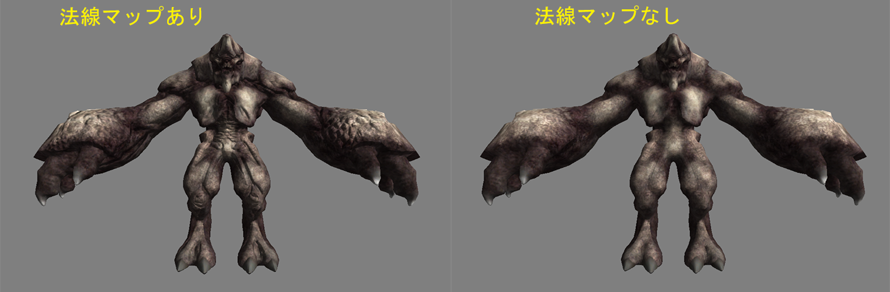</img></br>


## 6.2 スペキュラマップ
スペキュラマップは鏡面反射の強さを描き込んだテクスチャです。Chapter5で金属のような質感を表現するための鏡面反射について学びました。しかし、Chpater5の知識だけですと、図6.10のように人間の肌などのような、鏡面反射があまり発生しないサーフェイスでも鏡面反射が発生していまいます。</br>
**図6.10**</br>
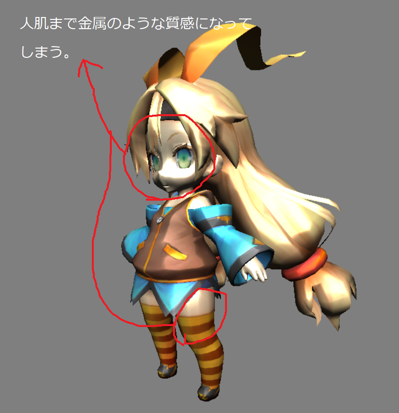</img></br>
このような問題を解決するために使用されるのがスペキュラマップと呼ばれるテクスチャです。図6.11はユニティちゃんのスペキュラマップです。</br>

**図6.11**</br>
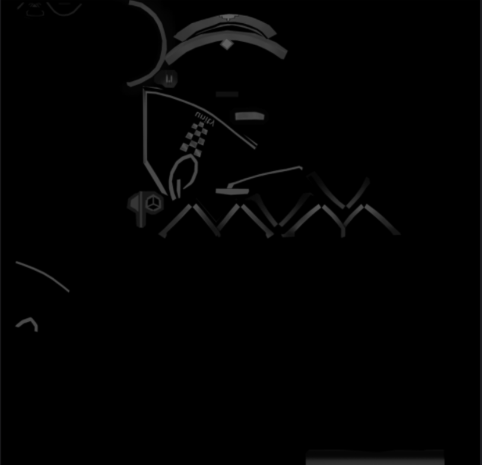</img></br>
スペキュラマップは下記のようにグレースケールのテクスチャになっていることが多く、白(255,255,255)に近づくほど、反射が強くなります(注意：ユニティちゃんのスペキュラマップはαチャンネルに衣服の金具の部分のみを鏡面反射させることができるデータが入っていたので、今回はそちらを使用しています)。図6.12はユニティちゃんのディフューズマップとスペキュラマップを２枚並べたものです。ちょうど、衣服の金具に当たる部分に鏡面反射の強さが描きこまれていることが分かると思います。</br>

**図6.12**</br>
</img></br>

### 6.2.1 【ハンズオン】スペキュラマップを利用したライティング実装
スペキュラマップの利用は非常に簡単ですので、早速ハンズオンでスペキュラマップの利用を実装してみましょう。`Sample_06_02/Sample_06_02.sln`を立ち上げてください。このサンプルを実行すると図6.13のような、人肌にまで鏡面反射が起きているプログラムが実行できると思います。

**図6.13**</br>
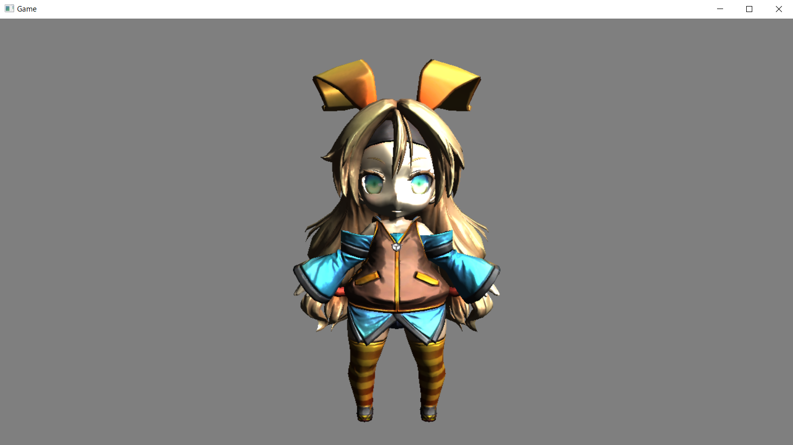</img></br>

では、スペキュラマップを利用して、狙った個所に鏡面反射を起こせるようにプログラムを改造していきましょう。

#### step-1 スペキュラマップにアクセスするための変数を追加。
今回のサンプルも必要なデータはすべてGPUでアクセスできるようになっているので、最初からシェーダー側を改造していきます。`Assets/shader/sample.fx`を開いてください。まずはスペキュラマップにアクセスするための変数を追加します。今回はt2レジスタにスペキュラマップはバインドされています。リスト6.9のプログラムを入力して下さい。</br>
[リスト6.9 `sample.fx`]
```cpp
//step-1 スペキュラマップにアクセスするための変数を追加。
Texture2D<float4> g_specularMap : register(t2);
```

#### step-2 スペキュラマップから鏡面反射の強さをサンプリング。
続いてピクセルシェーダーを改造していきます。先ほど追加したスペキュラマップの変数を利用して、鏡面反射の強さをサンプリングします。リスト6.10のプログラムを入力してください。</br>
[リスト6.10 `sample.fx`]
```cpp
//step-2 スペキュラマップからスペキュラ反射の強さをサンプリング。
float specPower = g_specularMap.Sample(g_sampler, psIn.uv).a;
```
ユニティちゃんのスペキュラマップはαチャンネルに金具の鏡面反射の強さが描きこまれていたので、αチャンネルを利用しています。

#### step-3 鏡面反射の強さを鏡面反射光に乗算する。
では、これで最後のハンズオンです。反射の強さを鏡面反射光に乗算しましょう。鏡面反射光はすでに計算済みで、spceLig	という変数に記憶されています。リスト6.11のプログラムを入力してください(注意：今回は鏡面反射を分かりやすくするために、反射光を10倍しています)。</br>
[リスト6.11 `sample.fx`]
```cpp
//step-3 鏡面反射の強さを鏡面反射光に乗算する。
specLig *= specPower * 10.0f;
```
入力出来たら実行してみてください。うまく実装出来ていると図6.13のように金具の部分だけ鏡面反射が起きるようになっているはずです。</br>
**図6.14**</br>
</img></br>

## 6.3 アンビエントオクルージョンマップ
アンビエントオクルージョンマップは環境光の強さを表すテクスチャです。Chapter5で「物体は一律で同じ間接光を受けている」という大胆に近似した環境光について学びました。しかし、環境光というのは影響を受けやすい箇所と受けにくい箇所というものがあります。例えば人間であれば、図6.15のように顎の下の首元あたりは、顎によって周囲の光が遮断されます。</br>
**図6.15**</br>
</img></br>
しかし、Chapter5で説明したように、環境光を真面目に計算するのは非常に負荷の高い処理になります。そこで、ゲームでは、事前にテクスチャに環境光の強さを描きこんでおき、それを利用する方法がよく活用されています。このテクスチャがアンビエントオクルージョンマップと呼ばれるものです。

### 6.3.1 【ハンズオン】アンビエントオクルージョンマップを利用したライティング実装
アンビエントオクルージョンマップを利用したライティングも非常に簡単ですので、早速ハンズオンで実装していきましょう。`Sample_06_03/Sample_06_03.sln`を立ち上げてください。

#### step-1 アンビエントオクルージョンマップにアクセスするための変数を追加。
今回のサンプルも必要なデータはすべてGPUでアクセスできるようになっているので、最初からシェーダー側を改造していきます。`Assets/shader/sample.fx`を開いてください。まずはアンビエントオクルージョンマップにアクセスするための変数を追加します。今回はt10レジスタにアンビエントオクルージョンマップはバインドされています。リスト6.12のプログラムを入力して下さい。</br>
[リスト6.12 `sample.fx`]
```cpp
//step-1 アンビエントオクルージョンマップにアクセスするための変数を追加。
Texture2D<float4> g_aoMap : register(t10);
```

#### step-2 アンビエントオクルージョンマップから環境光の強さをサンプリング
続いてピクセルシェーダーを改造していきます。先ほど追加したアンビエントオクルージョンマップの変数を利用して、環境光の強さをサンプリングします。リスト6.13のプログラムを入力してください。</br>
[リスト6.13 `sample.fx`]
```cpp
//step-2 アンビエントオクルージョンマップから環境光の強さをサンプリング
float ambientPower = g_aoMap.Sample(g_sampler, psIn.uv);
```

#### step-3 環境光の強さを環境光に乗算する。
では、これで最後のハンズオンです。環境光の強さを環境光に乗算しましょう。リスト6.13のプログラムを入力してください。
[リスト6.14 `sample.fx`]
```cpp
//step-3 環境光の強さを環境光に乗算する。
ambient *= ambientPower;
```
これでハンズオンは終了です。ほとんどスペキュラマップと同じような考え方で簡単だったのではないかと思います。では、実行してみてください。分かりにくいかもしれませんが、図6.16のAOマップありの画像のように、顎下や腕の下側などの環境光が弱くなっていることを確認してください。</br>
**図6.16**</br>
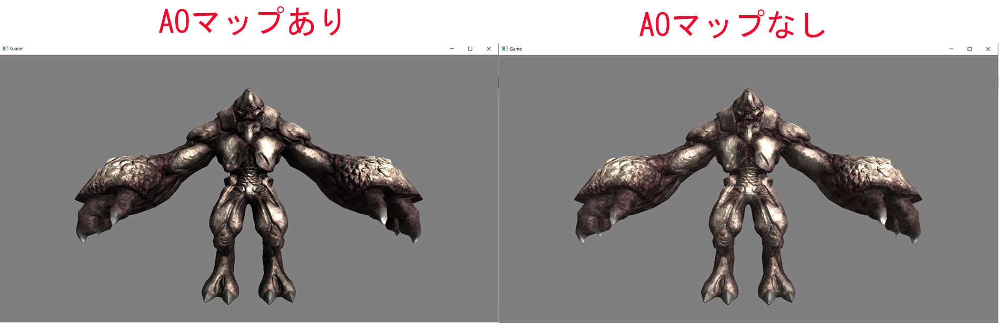</img></br>

## 6.4 ライトマップ
11月下旬

<!-- 改ページ. -->
<div style="page-break-before:always"></div>

# Chapter 7 物理ベースレンダリング(PBR)
このチャプターでは、現在のハイエンドゲームのライティングの計算のディファクトスタンダードになっている、物理ベースレンダリング(PBR)、について見ていきます。物理ベースということで、インターネットなどで調べると、難しい話がたくさん出てくるのですが、本書では難しい言葉はできるだけ使わずに、かみ砕いて説明をしていきます。
## 7.1 PBRとは
PBRはPlayStation4やXBoxOneなどが登場して、トレンドとなった技術の１つです。PBRを大雑把に説明すると、ライティングの計算で物理法則に従った計算をしましょう、というものになります。すでに皆さんはChpater5でPhongの反射モデルを利用したライティングを勉強しました。Phongの反射モデルはPlayStation3の世代のゲームでは、広く使われていたものですが、物理的に正しいライティングの計算ではありませんでした。PlayStation3世代のGPUでは、まだまだ物理的に正しい計算を行えるほどのパワーが足りていなかったのです。しかし、PlayStation4やXBoxOne世代になってくると、物理的に正しい計算を行えるようになってきて、PBRを採用したゲームが多数登場してくることとなります。現在、ハイエンドゲ－ムにおいてはPBRがデファクトスタンダードになっていると考えて良いです。</br>
では、物理的に正しいシェーダーというのはどういうことかを考えていきます。PBRで言われている、物理的に正しいというのは、次の二つの法則を満たすことを指していいます。
1. エネルギー保存の法則
2. ヘルムホルツの相反性

エネルギー保存の法則というのは、入射してきた光より強い光を跳ね返さないということです。光は物体に入射すると反射と屈折を起こします(図7.1)。このとき、反射する光と、屈折する光を合算したエネルギーの総量は、入射してきた光より大きくなることはありません。これがエネルギー保存の法則です。ざっくりと説明すると、「当たっている光よりも強いエネルギーを跳ね返してはいけない」という考えてください。</br>
**図7.1**</br>
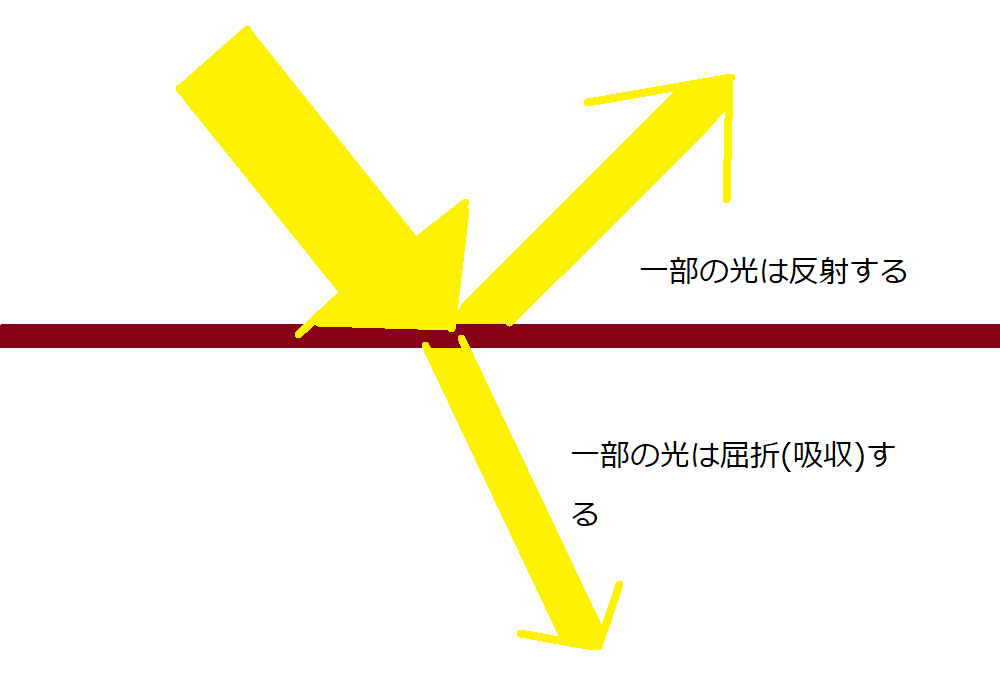</img></br>
ヘルムホルツの相反性というのは、光が入射してくる方向と射出する方向が入れ替わっても光の射出量の結果が変わらないという性質です(図7.2)。</br>

**図7.2**</br>
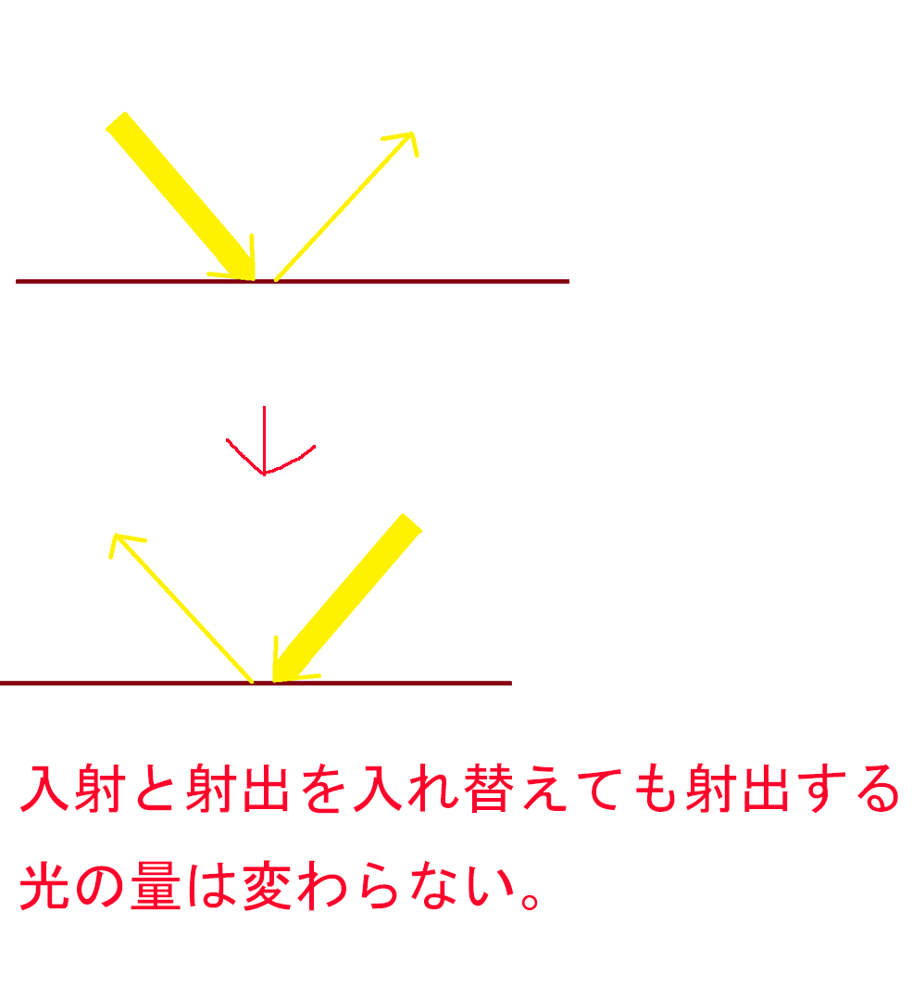</img></br>

Chapter5で勉強したランバート拡散反射はヘルムホルツの相反性は満たしていますが、エネルギー保存の法則は満たしていないため、物理ベースのライティングモデルではありません。ランバート拡散反射のエネルギーの総量を積分すると、入射エネルギーのπ倍になっていることが知られています。そこで、物理ベースの拡散反射の計算モデルとして、ランバート拡散反射の結果を、円周率のπで除算した、**正規化ランバート拡散反射**が採用されていることがあります。

### 7.1.1 【ハンズオン】正規化ランバート拡散反射の実装
では、正規化ランバート拡散反射を実装してみましょう。正規化ランバート拡散反射の実装は非常に簡単で、ランバート拡散反射で計算した反射光を円周率πで割り算を行うだけです。`Sample_07_01/Sample_07_01.sln`を立ち上げてください。

#### step-1 拡散反射光を正規化する
`Assets/shader/sample.fx`を開いて、80行目にリスト7.1のプログラムを入力して下さい。</br>
[リスト7.1 `sample.fx`]
```cpp
//step-1 拡散反射光を正規化する。
diffuse /= 3.1415926f;
```
今回のハンズオンはこれだけで完了です。実行してみてください。拡散反射正規化する前と後で図7.3のような違いが生まれます。</br>
**図7.3**</br>
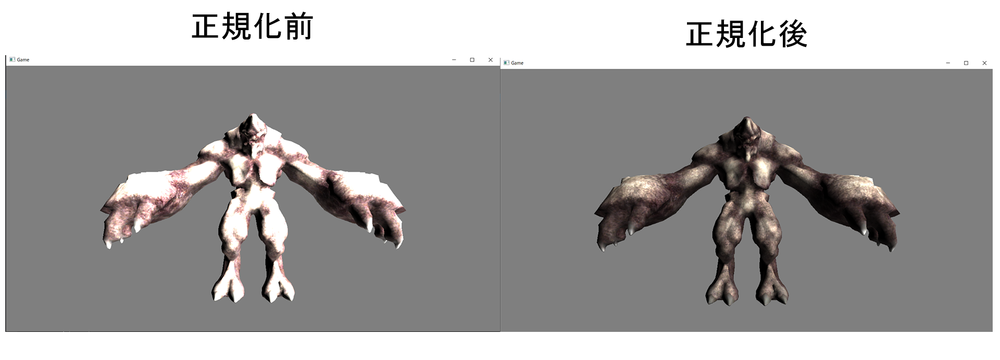</img></br>
結果自体は、反射光の総量が減っているだけで、ライトの明るさが弱くなっているだけです。重要なのは反射光が入射光の強さを超えていないという点です。では、なぜこれが重要なのか？この点について、2012年のSIGGRAPH(アメリカコンピュータ学会におけるコンピュータグラフィックス (CG) を扱う分科会)で発表された、ウォルトディズニーの論文を元に次の節で解説していきます。

## 7.2 Disney based PBR
2012年、SIGGRAPHでウォルト・ディズニーが物理ベースレンダリングに関する論文を発表しました。この論文には「塔の上のラプンツェル」の髪の毛の表現のために、物理ベースのシェーダーを開発したと記述されていました。物理ベースのシェーダーを開発した理由は、単一のシェーダーで、物理的なパラメーター(屈折率、表面の粗さ、金属度、異方性の度合)などの変更を行うだけで、髪の毛の様々な表現(ツヤのある髪、傷んでいる髪などの表現)を可能にするためだったと記述されています。このシェーダーを開発したことにより、目的となっていた髪の毛の豊かな表現というのは実現できました。しかし一方で、物理ベースではないシェーダーを利用している、その他のマテリアルとの統合に苦労したようです。物理ベースレンダリングが行われる以前は、豊かな表現を行うために、様々なシェーダーが作成されていました。しかし、これらのシェーダーは物理的に正しいシェーダーではないため、エネルギー保存の法則やヘルムホルツの相反性を無視しています。そうなると、どうなるかというと、同じ強さのライトを当てたときに、光輝いているマテリアルと、暗くどよんとしているマテリアルが存在するわけです。例えば、あなたが蛍光灯がついている部屋に入った時に、あなたは蛍光灯の光を浴びるわけですが、顔は光輝いてしまっているが、身に着けている時計や眼鏡はどんよりとした明るさになっている、といった現象が発生してしまうわけです。これらを解決するには、顔用のライト、時計用のライト、眼鏡用のライトといったように、各種ライトを調整する必要が出てきてしまいます。そこで塔の上のラプンツェルン以降の映画では、髪の毛以外にも物理ベースのシェーダーを適用できるようにするために、より豊かな、髪の毛以外の表現ができる物理ベースのシェーダーの開発が行われました。そして、その開発結果として発表されたPRBが、現在多くのゲームエンジンのPBRのベースとなっています。そして、このディズニーのPBRを元に作られたPBRは「Disney based PBR」と呼ばれます。</br>
### 7.2.1 物理的なパラメータ
ディズニーが開発したPBRは物理的なパラメーターを調整することで、様々な表現が行えることを目指して開発されたシェーダーです。しかし、不必要にパラメータを多くすると、パラメータの爆発が起きてしまいます。それは、アーティストの絵作りの負担を増大させることになります。ですので、パラメータの追加は映像を作成するにあたって、効果的なもののみ追加すべきです。最終的に、この論文には１個のカラーの情報と、10個のパラメータになったと記載されています(表7.1)。</br>

**表7.1**
|パラメータ名|説明|
| ---- | ---- |
|baseColor|サーフェイスのカラー。従来のマテリアルのテクスチャカラーに近いが厳密には違う。|
|subsurface|表面化錯乱具合。大きいほど拡散反射が起きる。|
|metallic|金属度|
|specular|鏡面反射率|
|specularTint|スペキュラカラーをベース色にするための調整値。|
|roufhness|表面の粗さ|
|anistorpic|異方性反射率|
|sheen|光沢のパラメータ。主に衣服などのサーフェイスで使用される。|
|sheenTint|光沢をベース色にするための調整値。|
|clearcoat|クリアコート|
|clearcoatGloss|クリアコートの光沢の調整値|

現在ゲームで広く使われているPBRはこのパラメーターの考え方を基本にして作られています。では、ゲームで使われている代表的なパラメータについて解説していきます。

#### アルベドカラー
拡散反射光を表すカラーです。 表7.1ではbaseColorが該当します。PS3の世代のNon-PBR時代のシェーダーで扱われてきた、ディフューズテクスチャとよく似ています。ディフーズテクスチャとアルベドテクスチャの違いは、テクスチャに陰影が描き込まれているかどうかです。Non-PBR時代に使われていたディフューズテクスチャには、テクスチャにライティングの結果による陰影が描き込まれていることがありました。アルベドテクスチャに陰影を描き込んではいけません。アルベドテクスチャはサーフェイスに光を当てた時の拡散反射のカラーが記録されているテクスチャになります。図7.4を見てみてください。アルベドテクスチャには陰影が描き込まれていないため、のっぺりとしたテクスチャになります。</br>

**図7.4**</br>
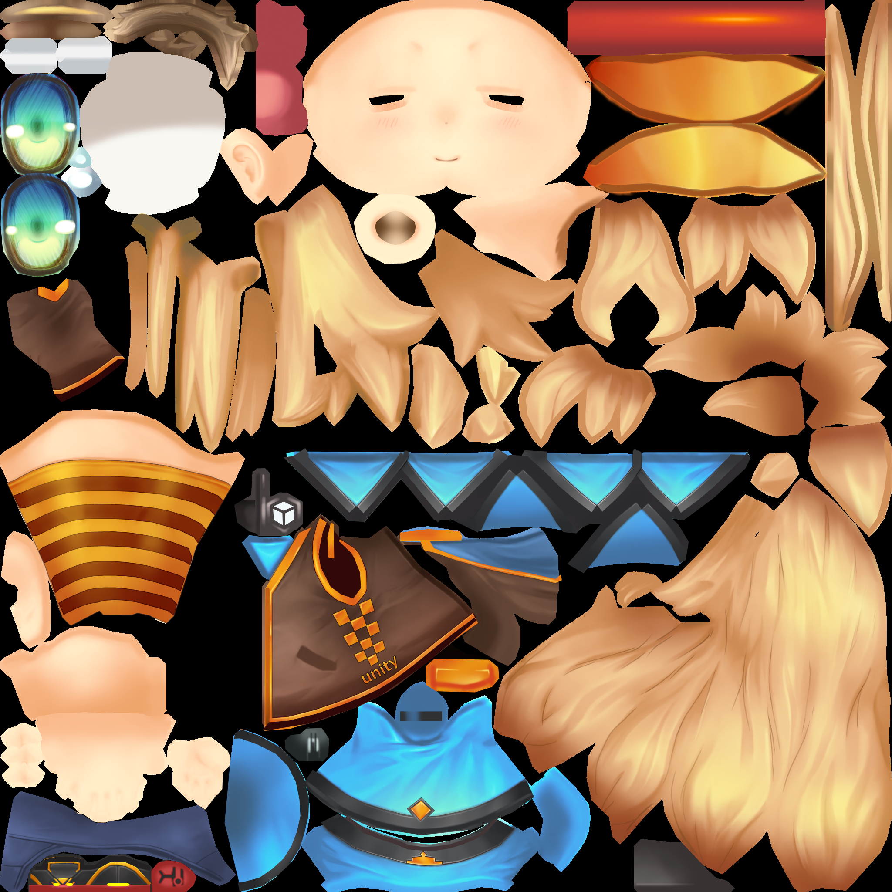</img></br>

#### スペキュラカラー
鏡面反射光を表すカラーです。表7.1には該当する項目がありませんが、おそらくbaseColorをスペキュラカラーとしても使っていたのではないかと思います。鏡面反射光は物体の表面で反射する光です。一方拡散反射光は物体の内部で拡散して反射してくる光です。ですので、厳密には拡散反射光と鏡面反射光は異なってきます。

#### メタリック
金属具合のことです。この考え方がこれまではなかったものなので、鏡面反射と関わってくるパラメータになります。Chapter5で鏡面反射というのは金属のようなサーフェイスで発生するものだと解説をしましたが、あれは正しい説明ではありません。鏡面反射というのは全てのサーフェイスで発生します。鏡面反射の割合が違うというだけです。ただ、金属のサーフェイスと非金属のサーフェイスでは鏡面反射カラーが変わってきます。金属のサーフェイスは物体の色を鏡面反射光として返すのですが、非金属のサーフェイスは光源のカラーを返します。このメタリックのパラメータは、鏡面反射光を物体のカラーと光源のカラーをブレンディングして、鏡面反射光を計算するときに使われるパラメータです。

#### スペキュラ反射率
鏡面反射が発生する割合はサーフェイスによって異なります。そこで、スペキュラ反射率を表すテクスチャを利用します。これはChapter6で扱ったスペキュラマップと同じ考え方になります。

### 7.2.2 【ハンズオン】Disney Based PBRを実装
では、ディズニーが発表したPBRを参考に、本書独自のPBRを実装していきす。今回のハンズオンでは、拡散反射は正規化ランバート拡散反射とフレネル拡散反射を合成した実装、鏡面反射はクックトランスモデルを使って実装していきます。これらの実装には前節で説明した物理パラメーターを利用していきます。`Sample_07_02/Sample_07_02.sln`を立ち上げてください。

#### step-1 アルベドマップ、法線マップ、スペキュラマップにアクセスするための変数を追加。
まず、シェーダー側にPBR用のパラメターにアクセスするための変数を追加しましょう。今回PBRで使用するパラメータは全てテクスチャとしてグラフィックメモリに送られていいます。Assets/shader/sample.fxの58行目にリスト7.2のプログラムを入力してください。</br>
[リスト7.2 `sample.fx`]
```cpp
//step-1 アルベドマップ、法線マップ、スペキュラマップにアクセスするための変数を追加。
Texture2D<float4> g_albedo : register(t0);		//アルベドマップ
Texture2D<float4> g_normalMap : register(t1);	//法線マップ
Texture2D<float4> g_specularMap : register(t2);	//スペキュラマップ。rgbにスペキュラカラー、aに金属度。
```
スペキュラマップのrgbにスペキュラカラー、aに金属度が設定されています。

#### step-2 アルベドカラー、スペキュラカラー、金属度をサンプリングする。
続いて、ピクセルシェーダーを改造していきます。アルベドカラー、スペキュラカラー、金属度をサンプリングする処理を実装しましょう。リスト7.3のプログラムを入力してください。</br>
[リスト7.3 `sample.fx`]
```cpp
//step-2 アルベドカラー、スペキュラカラー、金属度をサンプリングする。
//アルベドカラー(拡散反射光)。
float4 albedoColor = g_albedo.Sample(g_sampler, psIn.uv);
//スペキュラカラー(鏡面反射光)。
float3 specColor = g_specularMap.SampleLevel(g_sampler, psIn.uv, 0).rgb;
//金属度。
float metaric = g_specularMap.Sample(g_sampler, psIn.uv).a;
```

#### step-3 ディズニーベースの拡散反射を実装する。
では、いよいよディズニーベースの拡散反射を実装していきましょう。ディズニーの論文で発表された拡散反射は、ランバート拡散反射にフレネル反射というものを考慮した拡散反射を合成した次のようなものでした。</br>
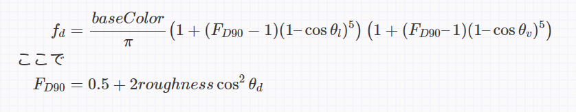</img></br>
よくわからない数式がでてきましたが、このbaseColor/PIの部分が正規化ランバート拡散反射の項になっています。その後ろの数式がフレネル反射を考慮した拡散反射率で、この二つを乗算することで、フレネル反射を考慮したランバート拡散反射を実現しています。フレネル反射については置いておいて、先にランバート拡散反射とフレネル反射を考慮した拡散反射を合成するプログラムを実装しましょう。リスト7.4のプログラムを入力してください。</br>

[リスト7.4 `sample.fx` ]
```cpp
//step-3 ディズニーベースの拡散反射を実装する。
//フレネル反射を考慮した拡散反射を計算。
float diffuseFromFresnel = CalcDiffuseFromFresnel(normal, -directionalLight[ligNo].direction, toEye);
//正規化ランバート拡散反射を求める。
float NdotL = saturate( dot( normal, -directionalLight[ligNo].direction )) ;
float3 lambertDiffuse = directionalLight[ligNo].color * NdotL / PI;
//最終的な拡散反射光を計算する。
float3 diffuse = albedoColor * diffuseFromFresnel * lambertDiffuse;
```
やっていることは、CalcDiffuseFromFresnel()で計算した結果と、正規化ランバート拡散反射の結果を掛け算しているだけです。

#### step-4 フレネル反射を考慮した拡散反射光を求める。
続いて、先ほど利用したCalcDiffuseFromFresnel()の中身を実装していきましょう。今回実装する拡散反射は「フレネル反射率が低いときに拡散反射率が高くなる」という考えに基づいたものです。ではリスト7.5のプログラムを入力してください。</br>
[リスト7.5 `sample.fx`]
```cpp
//step-4 フレネル反射を考慮した拡散反射光を求める。
// 光源に向かうベクトルと視線に向かうベクトルのハーフベクトルを求める。
float3 H = normalize(L+V);

//表面の粗さは0.5で固定とする。
float roughness = 0.5f;
float energyBias = lerp(0.0f, 0.5f, roughness);
// 光源に向かうベクトルとハーフベクトルがどれだけ似ているかを内積で求める。
float dotLH = saturate(dot(L,H));
// 光源に向かうベクトルとハーフベクトル、最大の拡散反射率を求める。
float Fd90 = energyBias + 2.0 * dotLH * dotLH * roughness;

// 法線と光源に向かうベクトルがどれだけ似ているかを内積で求める。
float dotNL = saturate(dot(N,L));
//ここでは、法線とライトの方向を利用して拡散反射率を求めています。
//法線とライトの方向が同じ向きだと拡散反射が強くなる。
//向きが異なっていくと拡散反射が弱くなる計算になっています。
float FL = Fd90 + (dotNL - Fd90);

// 法線と視線に向かうベクトルがどれだけ似ているかを内積で求める。
float dotNV = saturate(dot(N,V));
//ここでは、法線と視点に向かうベクトルを利用して拡散反射率を求めています。
//法線とライトの方向が同じ向きだと拡散反射が強くなる。
//向きが異なっていくと拡散反射が弱くなる計算になっています。
float FV = Fd90 + (dotNV - Fd90);

//法線と光源への方向に依存する拡散反射率と、法線と視点ベクトルに依存する拡散反射率を乗算して
//最終的な拡散反射率を求めている。PIで除算しているのは正規化を行うため。
return (FL*FV)/PI;
```
フレネル反射というのは、いわゆる鏡面反射のことなのですが、実はフレネル反射には下記のような性質があります。</br>

**フレネル反射は光のサーフェイスへの入射角度が大きくなっていくと、反射率が上がる**</br>
図7.5を見てみてください。</br>
**図7.5**</br>
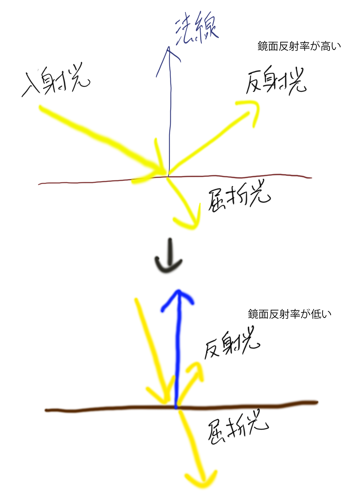</img></br>

つまり、逆に考えると、フレネル反射が弱いということは、物体内部に侵入する光が多くなるめ、内部で拡散する拡散反射が強くなります。「フレネル反射が弱くなれば、拡散反射が強くなる」というのが考え方の基本です。つまり、最も拡散反射が強くなるのは光がサーフェイスに垂直に入射しているときです(図7.6)。</br>

**図7.6**</br>
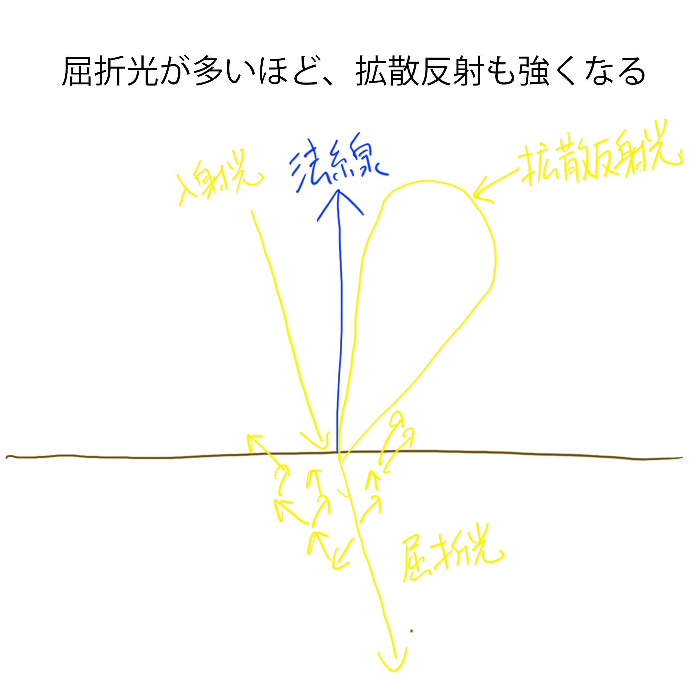</img></br>
光がサーフェイスに垂直に入射しているときが一番強く拡散反射が強いことが分かりました。では、今度は目の位置について考えていきます。光が強く見えるのは目に反射した光が多く入ってくる場合です。では、拡散反射が一番強く目に飛び込んでくるのはどういうケースでしょうか？それは、サーフェイスから目までのベクトルと、光の入射ベクトルが同じ時に最も多くの光が目に飛び込んできます。つまり、拡散反射がもっとも強くなるのは、「光の入射ベクトル、サーフェイスの法線、そして目までのベクトルの向きが同じ時」ということになります(図7.7)。</br>

**図7.7**</br>
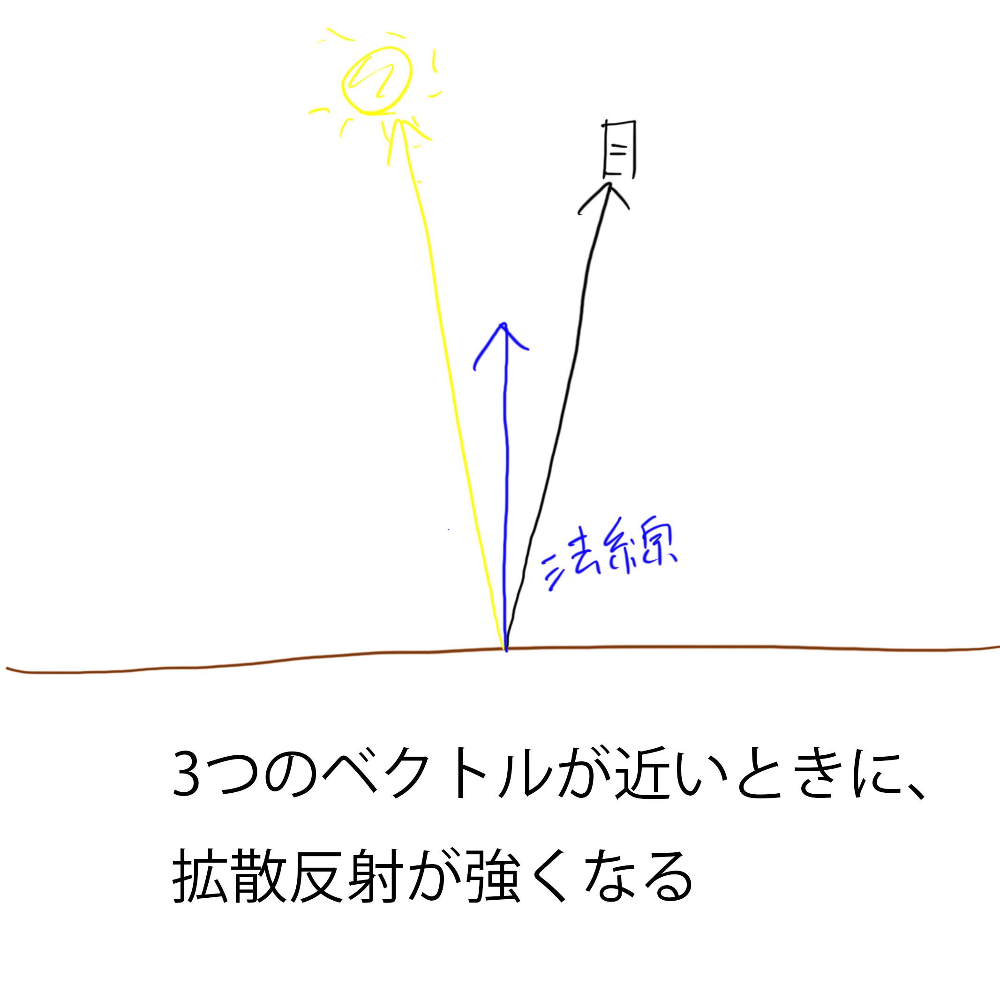</img></br>

今回のサンプルでは、光の入射ベクトルと目までのベクトルのハーフベクトルを計算して、そのハーフベクトルとサーフェイスの法線を利用して、Fd90という変数に、拡散反射がどれくらい発生しているのかを計算しています(図7.8)。</br>

**図7.8**</br>
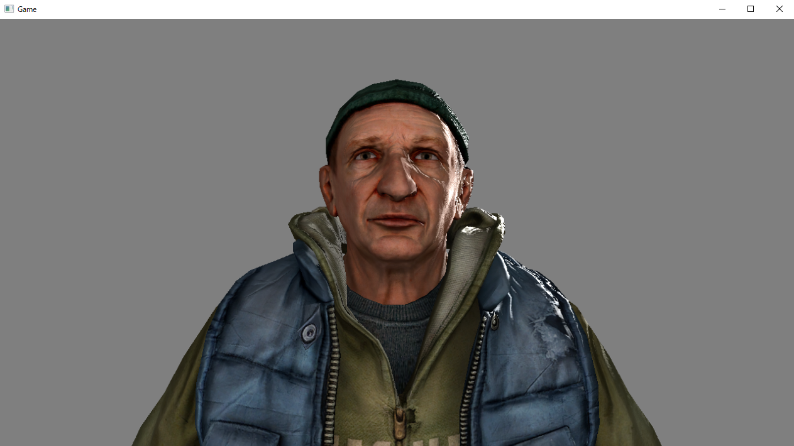</img></br>

ただし、このままだと図7.9のように、本来拡散反射光は強く目に飛び込んでこないのに、ハーフベクトルが法線と同じ向きになったときに拡散反射光が強く出てしまいます。</br>
**図7.9**</br>
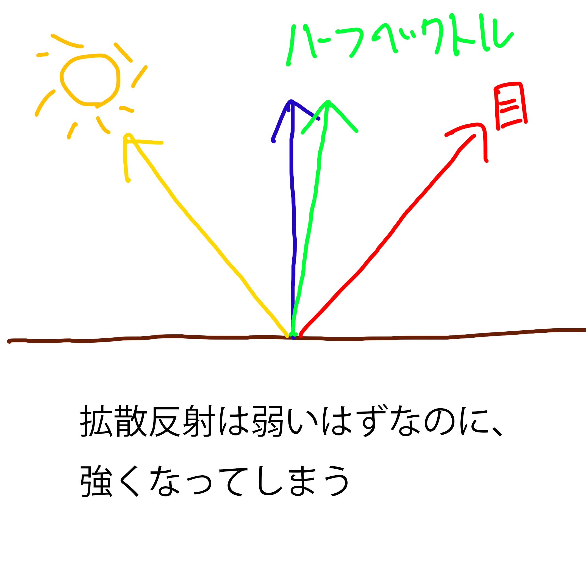</img></br>
光の入射方向とサーフェイスの法線を利用して、入射方向に依存する拡散反射の強さを、変数FLに求めています。続いて、目に向かうベクトルとサーフェイスの法線を利用して、目の位置に依存する拡散反射の強さを、変数FVに求めています。そして、最終的にFLとFVを合成した結果を拡散反射の強さとして戻しています。最後にPIで除算しているのは正規化を行うためです。


#### step-5 クックトランスモデルを利用した鏡面反射率を計算する。
続いて、鏡面反射を計算していきます。鏡面反射の計算にはクックトランスモデルを利用しています。しかし、今回はクックトランスモデルの中身については説明は行いません。クックトランスに関してはwebなどに豊富に説明があるので、そちらを参照してもらえたらと思います。今回は金属度の使い方に焦点をあてて解説します。では、リスト7.6のプログラムを入力してください。</br>
[リスト7.6 `sample.fx`]
```cpp
//step-5 クックトランスモデルを利用した鏡面反射率を計算する。
//クックトランスモデルの鏡面反射率を計算する。
float3 spec = CookTrranceSpecular(-directionalLight[ligNo].direction, toEye, normal, metaric) * directionalLight[ligNo].color ;
//金属度が高ければ、鏡面反射はスペキュラカラー、低ければ白。
//スペキュラカラーの強さを鏡面反射率として扱う。
float specTerm = length(specColor.xyz);
spec *= lerp( float3( specTerm, specTerm, specTerm), specColor, metaric);
```

スペキュラ反射というのは金属だけではなく全ての物体で発生します。しかし、金属と非金属のスペキュラ反射には下記のような違いがあります。
**「金属性の高いサーフェイスのスペキュラ反射には色がつく」**
逆に金属性が低いサーフェイスのスペキュラ反射は色がつかず、白っぽいスペキュラ反射になります。今回のプログラムでは次のように、メタリック度を利用して、スペキュラ反射のカラーを決定しています。
```cpp
//金属度が高ければ、鏡面反射はスペキュラカラー、低ければ白。
//スペキュラカラーの強さを鏡面反射率として扱う。
float specTerm = length(specColor.xyz);
//金属度を利用して、白っぽいカラーからスペキュラカラーへと線形補完する。
spec *= lerp( float3( specTerm, specTerm, specTerm), specColor, metaric);
```

#### step-6 鏡面反射率を使って、拡散反射光と鏡面反射光を合成する。
では、これで最後です。鏡面反射率を使って、拡散反射光と鏡面反射光を合成しましょう。リスト7.7のプログラムを入力してください。</br>
[リスト7.7 `sample.fx`]
```cpp
//step-6 鏡面反射率を使って、拡散反射光と鏡面反射光を合成する。
//鏡面反射率が高ければ、拡散反射は弱くなる。
lig += diffuse * ( 1.0f - specTerm ) + spec;
```
ここまで実行できたらプログラムを入力してください。図7.9のようなプログラムが実行できていたら完成です。ゲームコントローラーの右スティックでカメラの回転、左スティックでライトの回転、Ａボタンを押すとモデルを変更することができます。</br>


# Chapter 8 2D描画の基礎
## 8.1 DirectX12で2D描画
まず、大前提としてDirectX12は3Dを描画するためのグラフィックスAPIで、2Dを描画するAPIはありません。正確には2D専用のAPIはありません。では、DirectX12でどのようにして2Dを描画するのかというと、3D描画の機能を使って四角形の板ポリを描画して、あたかも2Dであるかのように見せているのです。ですので、2D描画といっても新しいことを学ぶわけではありません。2D	を表示するために準備必要なデータは、頂点バッファ、インデックスバッファ、テクスチャ、頂点シェーダー、ピクセルシェーダーなど3D表示と全く同じです。

## 8.2【ハンズオン】2D表示
では、2Dを表示するためのハンズオンを行っていきましょう。Chapter3で行った、三角形ポリゴンの表示とほとんど同じですので、それも思い出しながらハンズオンを実施してみて下さい。

### step-1 ルートシグネチャを作成
DirectX12で絵を描画するためにはルートシグネチャが必要になってきます。これはここまで説明はしてきていませんが、3D描画でも当然必要です。ルートシグネチャとは大雑把に説明すると、これから絵を描くための情報のデータ構造などを定義しているものです。今回は著者の方でルートシグネチャをラップしているRootSinatureクラスを利用します。`Sample_08_01/Sample_08_01.slnを立ち上げてmain.cppの26行目にリスト8.1のプログラムを入力してください。</br>

[リスト8.1 main.cpp]

```cpp
//step-1 ルートシグネチャを作成。
RootSignature rootSignature;
InitRootSignature(rootSignature);
```

### step-2 シェーダーをロードする。
続いて2D描画用のシェーダーをロードします。リスト8.2のプログラムを入力して下さい。</br>
[リスト8.2 main.cpp]
```cpp
//step2 シェーダーをロード。
Shader vs, ps;
//頂点シェーダーをロード。
vs.LoadVS("Assets/shader/sample.fx", "VSMain");
//ピクセルシェーダーをロード。
ps.LoadPS("Assets/shader/sample.fx", "PSMain");
```

### step-3 パイプラインステートを作成する。
パイプラインステートとは、レンダリングパイプラインの設定です。Chapter1でレンダリングパイプラインについて少しだけ勉強しました。絵が表示されるまでには色々な工程があります。その各種工程に関する設定です。このレンダリングパイプラインについてはあとで、新しい設定を二つほど勉強します。そこでまた詳しく説明します。では、リスト8.3のプログラムを入力してください。</br>

[リスト8.3 main.cpp]
```cpp
//step-3 パイプラインステートを作成。
PipelineState pipelineState;
InitPipelineState(pipelineState, rootSignature, vs, ps);
```

### step-4 四角形の板ポリの頂点バッファを作成
続いて、四角形の板ポリの頂点バッファを定義します。今回の頂点は頂点座標とUV座標のデータを保持しています。では、リスト8.4のプログラムを入力して下さい。</br>

[リスト8.4 main.cpp]
```cpp
//step-4 四角形の板ポリの頂点バッファを作成
//頂点配列を定義。
SimpleVertex vertices[] = {
	{
		{ -1.0f, -1.0f, 0.0f, 1.0f },	//座標
		{ 0.0f, 1.0f},					//UV座標
	},
	{
		{ 1.0f, 1.0f, 0.0f, 1.0f },		//座標
		{ 1.0f, 0.0f},					//UV座標
	},
	{
		{ 1.0f, -1.0f, 0.0f, 1.0f },	//座標
		{ 1.0f, 1.0f},					//UV座標
	},
	{
		{ -1.0f, 1.0f, 0.0f, 1.0f },	//座標。
		{ 0.0f, 0.0f},					//UV座標
	}
};
//頂点配列から頂点バッファを作成。
VertexBuffer triangleVB;
triangleVB.Init(sizeof(vertices), sizeof(vertices[0]));
triangleVB.Copy(vertices);
```

### step-5 板ポリのインデックスバッファを作成。
頂点バッファを作成出来たらインデックスバッファを作詞しましょう。リスト8.5のプロ宇グラムを入力してください。</br>
[リスト8.5 main.cpp]
```cpp
//step-5 板ポリのインデックスバッファを作成。
//インデックスの配列
uint16_t indices[] = {
	0,1,2,
	3,1,0,
};
//インデックスの配列からインデックスバッファを作成する。
IndexBuffer triangleIB;
triangleIB.Init(sizeof(indices), 2);
triangleIB.Copy(indices);
```

### ste-6 テクスチャをロード。
板ポリに貼り付けるテクスチャをロードしましょう。リスト8.6のプログラムを入力して下さい。</br>
[リスト8.6 main.cpp]
```cpp
//step-6 テクスチャをロード。
Texture texture;
texture.InitFromDDSFile(L"Assets/image/test.dds");
```

### step-7 ディスクリプタヒープを作成。
テクスチャが作成出来たら、ディスクリプタヒープを作成して、テクスチャを登録しましょう。リスト8.7のプログラムを入力してください。</br>

[リスト8.7 main.cpp]
```cpp
//step-7 ディスクリプタヒープを作成。
DescriptorHeap ds;
ds.RegistShaderResource(0, texture);
ds.Commit();
```

### step-8 ドローコールを実行。
step-7までのプログラムで２Ｄを描くためのデータの準備は終わりました。では、c++側の最後の実装です。ドローコールを実装しましょう。リスト8.8のプログラムを入力してください。</br>
[リスト8.8 main.cpp]
```cpp
//step-8 ドローコールを実行。
//ルートシグネチャを設定。
renderContext.SetRootSignature(rootSignature);
//パイプラインステートを設定。
renderContext.SetPipelineState(pipelineState);
//プリミティブのトポロジーを設定。
renderContext.SetPrimitiveTopology(D3D_PRIMITIVE_TOPOLOGY_TRIANGLELIST);
//頂点バッファを設定。
renderContext.SetVertexBuffer(triangleVB);
//インデックスバッファを設定。
renderContext.SetIndexBuffer(triangleIB);
//ディスクリプタヒープを登録。
renderContext.SetDescriptorHeap(ds);
//ドローコール
renderContext.DrawIndexed(6); //引数はインデックスの数。
```

### step-9 頂点シェーダーを実装
では、続いてシェーダー側です。`Assets/shader/sample.fx`を開いて下さい。まずは頂点シェーダーを実装していきます。リスト8.9のプログラムを入力してください。</br>
[リスト8.9 sample.fx]
```cpp
//step-9 頂点シェーダーを実装。
//１．引数は変換前の頂点情報。
//２．戻り値は変換後の頂点情報。
VSOutput VSMain(VSInput In) 
{
	VSOutput vsOut = (VSOutput)0;
    //入力された頂点座標を変換せずに出力する。
    vsOut.pos = In.pos;
	vsOut.uv = In.uv;
	return vsOut;
}
```
今回入力してもらった頂点シェーダーは、座標変換など一切行わずに、そのままピクセルシェーダーに渡しています。これは入力された頂点の座標が、すでに正規化されたスクリーン座標系になっているからです。

### step-10 ピクセルシェーダーを実装
では、いよいよ最後の実装です。ピクセルシェーダーを実装します。今回のピクセルシェーダーはテクスチャカラーをサンプリングして、それを返しているだけです。リスト8.10のプログラムを入力してください。</br>
[リスト8.10 sample.fx]
```cpp
//step-10 ピクセルシェーダーを実装。
//１．引数は頂点シェーダーの出力を元に計算された情報。
//２．戻り値はピクセルのカラー。
float4 PSMain( VSOutput In ) : SV_Target0
{
	return g_texture.Sample( g_sampler, In.uv );
}
```
入力出来たら実行してください。図8.1のようなプログラムが実行できていたら完成です。</br>
**図8.1**</br>
</img></br>

## 8.2 アルファブレンディング
この節では半透明合成や、加算合成を行うために必要なαブレンディングについて説明します。アルファブレンディングを理解することで、窓ガラスなどの半透明な物体の描画や、光り輝くエフェクトの描画などを行うことができます。
### 8.2.1 アルファブレンディングとは
アルファブレンディングとは、ピクセルシェーダーで計算されたカラー(RGBA)をカラーバッファ(ここでは画面に表示される絵だと考えてください。)にどのように描き込むのかを指定するものとなります。その描き込みの際にアルファ値を使用して描き込む方法を決定するため、アルファブレンディングと言われます。このチャプターでは代表的なアルファブレンディングの、半透明合成と加算合成を見ていこうと思います。例えば次の順番でモデルを描画するケースを考えてみてください。</br>

1. 地面を描画
2. キャラクターを描画

地面を描画した後で、キャラクターを描画しています。この場合、先に地面の絵がカラーバッファに書き込まれます(図8.2)。</br>
**図8.2**</br>
</img></br>
その後でキャラクターがカラーバッファに書き込まれます(図8.3)。</br>

**図8.3**</br>
</img></br>
この時、キャラクターが描画されたことによって、地面のカラーは上書きされてしまっています。ここがポイントです。では、色付きガラスなどの半透明のオブジェクトを描画したい場合はどうしたらいいのでしょうか？このようなオブジェクトを描画するときは、すでに描き込まれているカラーと、これから描き込もうとしているカラーを混ぜ合わせる必要があります(図8.2)。このカラーを合成することをアルファブレンディングといいます。DirectX12では様々なブレンドステートを作成することで、様々なブレンディング方法を指定することができます。では、次の節から代表的なアルファブレンディングの半透明合成と加算合成を見ていきましょう。

### 8.2.2 半透明合成
アルファブレンディングにおいて、これから描きこもうとしているカラーをソースカラーといいます。そして既にカラーバッファに描きこまれているカラーのことをデスティネーションカラーといいます。半透明合成はソースカラーのアルファ値を使用してソースカラーとデスティネーションカラーを混ぜ合わせることで実現されています。半透明合成の計算式は次のようになります。</br>
ソースカラー：SRC</br>
ディスティネーションカラー : DEST</br>
ソースカラーのα値 : SRC_αとしたとき、</br>
**描き込まれるカラー = SRC　×　SRC_α + DEST + ( 1 - SRC_α )**</br>
αは0～1の値をとります。αの値が1だと不透明、0.5だと半透明で合成されます(図8.4)。</br>
**図8.4**
</img></br>
半透明合成は、合成を行うためのブレンディングステートをパイプラインステートに設定することで行うことができます。

### 8.2.3 【ハンズオン】半透明で2Dを描画する。
では、半透明で2Dを描画してみましょう。以降の2D描画には、著者が用意した、Spriteクラスを利用して2Dを描画していきます。

#### step-1 Spriteクラスのオブジェクトを初期化する。
まずはSpriteクラスのオブジェクトを定義して初期化します。`Sample_08_02/Sample_08_02.sln`を立ち上げてmain.cppの35行目にリスト8.11のプログラムを入力してください。</br>
[リスト8.11 main.cpp]
```cpp
//step-1 Spriteクラスのオブジェクトを初期化する。

//まずはSpriteクラスの初期化オブジェクト作成する。
SpriteInitData spriteInitData;
//テクスチャのファイルパスを指定。
spriteInitData.m_ddsFilePath[0] = "Assets/image/test.dds";
//シェーダーファイルのパスを指定。
spriteInitData.m_fxFilePath = "Assets/shader/sample2D.fx";
//スプライトの幅と高さを指定。
spriteInitData.m_width = 128.0f;
spriteInitData.m_height = 128.0f;
//アルファブレンディングモードを半透明にして設定。
spriteInitData.m_alphaBlendMode = AlphaBlendMode_Trans;

//Spriteクラスのオブジェクトを定義して初期化する。
Sprite test2D;
//Init()に初期化オブジェクトを渡し２Ｄ期化する。
test2D.Init(spriteInitData);
```
`Sprite::Init()`の中で、２Ｄを表示するための頂点バッファ、インデックスバッファ、パイプラインステートの作成などが行われています。Spriteクラスの初期化オブジェクトに半透明合成の設定を行っていることに注目してみてください。`Sprite::Init()`の中で、m_alphaBlendModeの値を見て、半透明合成のステートを設定しています。この設定のプログラムは`MiniEngine/Sprite.cpp`の136行目に記載されています。次のプログラムを見てみてください。

```cpp
if (initData.m_alphaBlendMode == AlphaBlendMode_Trans) {
	//半透明合成のブレンドステートを作成する。
	//αブレンディングを有効にする。
	psoDesc.BlendState.RenderTarget[0].BlendEnable = true;
	//ソースカラーはソースアルファを掛け算する。
	psoDesc.BlendState.RenderTarget[0].SrcBlend = D3D12_BLEND_SRC_ALPHA;
	//ディステヒネーションカラーに1-ソースアルファを掛け算する。
	psoDesc.BlendState.RenderTarget[0].DestBlend = D3D12_BLEND_INV_SRC_ALPHA;
	//ソースカラーとディスティネーションカラーを足し算する。
	psoDesc.BlendState.RenderTarget[0].BlendOp = D3D12_BLEND_OP_ADD;
}
```
### step-2 スプライトのドローコールを実行する。
Spriteクラスのオブジェクトの初期化ができたので、次は`Sprite::Draw()`を利用して、スプライトのドローコールを実行しましょう。リスト8.12のプログラムを入力してください。</br>
[リスト8.12 main.cpp]
```cpp
//step-2 スプライトのドローコールを実行する。
test2D.Draw(renderContext);
```

### step-3 ピクセルシェーダーから出力するαを変更する。
続いて、シェーダー側を改造します。半透明合成を行うためには、ピクセルシェーダーから出力するアルファを変更する必要があります。`Assets/shader/sample2D.fx`を開いて、リスト8.13のプログラムを入力してください。
[リスト8.13 sample2D.fx]
```cpp
//step-3 ピクセルシェーダーから出力するαを変更する。
//不透明度0.4で出力する。
color.a = 0.4f;
```
入力出来たら実行してみて下さい。図8.5のように半透明で2Dが描画されていたら完成です。</br>
**図8.5**
</img></br>


### 8.2.4 【ハンズオン】加算合成で2Dを描画する。
#### step-1 加算合成の設定で描画する。
では、このチャプターの最後に加算合成で2Dを描画するハンズオンを行いましょう。Spriteクラスを利用して加算合成を行うには、Spriteクラスのオブジェクトを初期化するときの設定を変更するだけです。`Sample_08_03/Sample_08_03.sln`を立ち上げて、main.cppのにリスト8.13を入力して下さい。</br>
[リスト8.13 main.cpp]
```cpp
//step-1 加算合成の設定で描画する。
spriteInitData.m_alphaBlendMode = AlphaBlendMode_Add;
```
先ほどの半透明描画の時と同じく、`Sprite::Init()`の中で、m_alphaBlendModeの値を見て加算合成の設定を行っています。この設定のプログラムは`MiniEngine/Sprite.cpp`の143行目～記載されています。次のプログラムを見てみてください。
```cpp
else if (initData.m_alphaBlendMode == AlphaBlendMode_Add) {
	//加算合成。
	psoDesc.BlendState.RenderTarget[0].BlendEnable = true;
	psoDesc.BlendState.RenderTarget[0].SrcBlend = D3D12_BLEND_ONE;
	psoDesc.BlendState.RenderTarget[0].DestBlend = D3D12_BLEND_ONE;
	psoDesc.BlendState.RenderTarget[0].BlendOp = D3D12_BLEND_OP_ADD;
}
```


# Chapter 9 2D描画発展
このチャプターでは、2D描画の発展として、いくつか場面転換などで使えるワイプ演出の実装と、画像加工の実装について見ていきます。
## 9.1　【ハンズオン】リニアワイプを実装する。その１。
ワイプとは、画面切り替えなどで使われる演出のことで、ゲームであれば、ゲームシーンからメニューシーンへの切り替えといった、シーンの遷移演出などで使われています。ここではもっともシンプルな、画像が左から右に線形に消えていくリニアワイプについて見ていきます。では、Sample_09_01/Sample_09_01.slnを開いてください。
### step-1 ワイプ演出を行うSpriteの初期化。
まずは、ワイプ演出を行う2Dを描画するためにSpriteクラスのオブジェクトを初期化します。main.cppの27行目にリスト9.1のプログラムを入力してください。</br>
[リスト9.1 main.cpp]
```cpp
// step-1 ワイプ演出を行うSpriteの初期化。
// まずはSpriteクラスの初期化オブジェクトを作成する
SpriteInitData spriteInitData;
// テクスチャのファイルパスを指定
spriteInitData.m_ddsFilePath[0] = "Assets/image/test.dds";
// シェーダーファイルのパスを指定
spriteInitData.m_fxFilePath = "Assets/shader/sample.fx";
// スプライトの幅と高さを指定
spriteInitData.m_width = 1280.0f;
spriteInitData.m_height = 720.0f;
//【注目】定数バッファとして送るワイプサイズのパラメーター。
float wipeSize = 0;
spriteInitData.m_expandConstantBuffer = &wipeSize;
spriteInitData.m_expandConstantBufferSize = sizeof(wipeSize);
// Spriteクラスのオブジェクトを定義して初期化する
Sprite test2D;
// Init()に初期化オブジェクトを渡して初期化する
test2D.Init(spriteInitData);
```
ワイプのサイズを表すパラメーターを拡張定数バッファとして渡している点に注目してください。この変数の数値をゲームループ内で少しづつ増加させていくことで、画像を徐々にワイプすることができます。例えば、wipeSizeの数値が200になると、画面の右端から200ピクセルワイプされます。

### step-2 ワイプサイズを増やして少しずつワイプさせる。
続いて、ゲームループの処理です。少しづつワイプサイズを増やしていくコードを実装しましょう。main.cppにリスト9.2のプログラムを入力してください。</br>
[リスト9.2 main.cpp]
```cpp
// step-2 ワイプサイズを増やして少しずつワイプさせる。
wipeSize += 5.0f;
```
wipeSizeの値を毎フレーム5ずつ増やしているため、今回実装するワイプは毎フレーム５ピクセルずつワイプしていきます。そのため、ワイプの速度を変更したければ、wipeSizeを増やす値を変更すれば良いことになります。

### step-3 スプライトのドローコールを実行する
では、C++側の最後のコードです。ワイプを行うスプライトのドローコールを実行しましょう。main.cppにリスト9.3のプログラムを入力してください。</br>
[リスト9.3 main.cpp]
```cpp
// step-3 スプライトのドローコールを実行する
test2D.Draw(renderContext);
```

### step-4 ワイプサイズにアクセスするための定数バッファを定義する。
step-4からはシェーダー側のコードです。まずは、C++側から送られてきているワイプサイズにアクセスするための定数バッファを定義します。Assets/shader/sample.fxの11行目にリスト9.4のプログラムを入力してください。</br>
[リスト9.4 main.cpp]
```cpp
// step-4 ワイプサイズにアクセスするための定数バッファを定義する。
cbuffer WipeCB : register( b1 )
{
    float wipeSize;     //ワイプサイズ。
};
```

### step-5 ワイプサイズの値に応じてピクセルをクリップする。
では、これで最後です。C++側から送られてきている、wipeSizeの値と、ピクセルのスクリーン座標を利用して、ピクセルキルを行います。sample.fxにリスト9.5のプログラムを入力してください。</br>
[リスト9.5 sample.fx]
```cpp
// step-5 ワイプサイズの値に応じてピクセルをクリップする。
clip( In.pos.x - wipeSize);
```
clip()は引数で渡される値がマイナスになるとピクセルキル(そのピクセルシェーダーの結果は出力されない)してくれる関数です。ピクセルのスクリーン座標系のx座標からwipeSizeをマイナスしているため、例えば、wipeSizeが400であれば、X座標が400以下のピクセルはIn.pos.x - wipeSizeの結果がマイナスになるため、ピクセルキルされて描画されません。wipeSizeの値はC++側で毎フレーム少しずつ増加していっているため、左から右に向けてワイプする処理が実現できます。実装出来たら、実行してみて下さい。図9.1のように、画像がワイプされていたら完成です。</br>
**図9.1**</br>
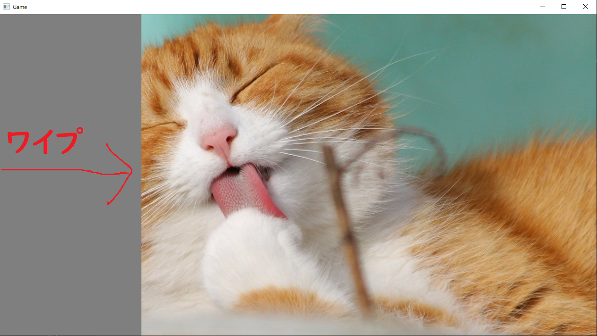</img></br>

## 9.2　【ハンズオン】リニアワイプを実装する。その２。
9.1では左から右にワイプするリニアワイプの実装を見てきました。今度はワイプする方向を指定できるリニアワイプの実装について見ていきましょう。Sample_09_02/Sample_09_02.slnを開いてください。
### step-1 ワイプパラメータ構造体を定義する。
まずは、ワイプを制御するためのパラメータをまとめた構造体を定義しましょう。このデータが定数バッファとしてGPUに送られることとなります。main.cppの32行目にリスト9.6のプログラムを入力してください。ワイプを制御するパラメーターとして、ワイプする方向が追加されている点に注目してください。</br>
[リスト9.6 main.cpp]
```cpp
// step-1 ワイプパラメータ構造体を定義する。
struct WipeParam {
	Vector2 wipeDir;    //【注目】ワイプする方向。
	float wipeSize;     //ワイプサイズ。
};
```
### step-2 ワイプパラメータを初期化する。
続いて、ワイプパラメータを初期化するコードを追加しましょう。main.cppにリスト9.7のプログラムを入力して下さい。</br>
[リスト9.7 main.cpp]
```cpp
// step-2 ワイプパラメータを初期化する。
WipeParam wipeParam;
//ワイプする方向を設定する。
//今回は右下に向かってワイプする。
wipeParam.wipeDir.Set(1.0f, 1.0f);
wipeParam.wipeDir.Normalize();
//ワイプサイズを初期化する。
wipeParam.wipeSize = 0.0f;
```
ワイプサイズだけではなく、ワイプする方向も初期化されています。今回実装するワイプ処理は右下に向かってワイプしていきます。このwipeParamのデータが定数バッファのデータとしてGPUに送られることとなります。wipeParam.wipeDirの値を変更すれば、ワイプする方向を変更することができるので、ぜひ実装後に値を変更して試してみてください。

### step-3 ワイプパラメータにアクセスするための定数バッファを定義。
step-3からはシェーダー側です。まずはワイプパラメーターにアクセスするための定数バッファを定義しましょう。Assets/shader/sample.fxの11行目にリスト9.8のプログラムを入力してください。</br>
[リスト9.8 sample.fx]
```cpp
// step-3 ワイプパラメータにアクセスするための定数バッファを定義。
cbuffer WipeCB : register( b1 )
{
    float2 wipeDirection;  //ワイプの方向。
    float wipeSize;        //ワイプサイズ。
};
```

### step-4 ワイプ方向とワイプサイズを利用して、ピクセルをクリップする。
では、最後です。ワイプ方向とワイプサイズを利用してピクセルをクリップしましょう。sample.fxにリスト9.9のプログラムを入力してください。</br>
[リスト9.9 sample.fx]
```cpp
 //step-4 ワイプ方向とワイプサイズを利用して、ピクセルをクリップする。
//ピクセル座標をワイプ方向に射影する。
float t = dot( wipeDirection, In.pos.xy);
clip( t - wipeSize);
```
では、このプログラムについて解説を行います。まず、次のプログラムで変数tにワイプ方向とピクセルの座標の内積の結果を格納しています。</br>
```cpp
float t = dot( wipeDirection, In.pos.xy);
```
この変数tにはどのような数値が格納されているかというと、wipeDirectionの無限線分上にIn.pos.xyを射影した長さが格納されています(図9.2)。</br>
**図9.2**</br>
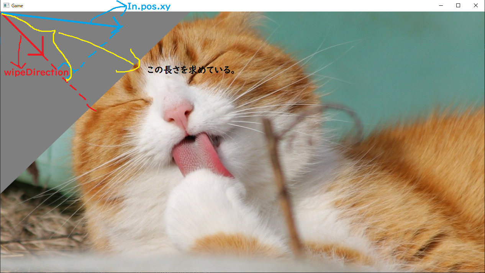</img>
これは「ある二つのベクトルの内積の結果は、片方のベクトルが単位ベクトルであれば、その単位ベクトルの無限線分上に垂線を落として射影した長さになる」という内積の性質を利用しているものです(図9.3)。</br>

**図9.3**</br>
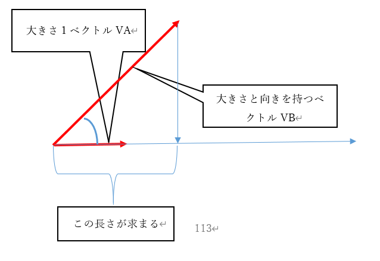</img></br>
そして、次のコードでclip()を利用して変数tの値がwipeSize以下の時にピクセルキルしています。</br>
```cpp
clip( t - wipeSize);
```
これにより、斜め方向のワイプが実現されています。入力出来たら実行して確認してみてください。右下方向にワイプされていたら実装できています。</br>


## 9.3　【ハンズオン】円形ワイプを実装する。
続いて、円形ワイプを実装していきます。円形ワイプは図9.4のように画面の中央から円形にワイプしていく演出となります。</br>
**図9.4**</br>
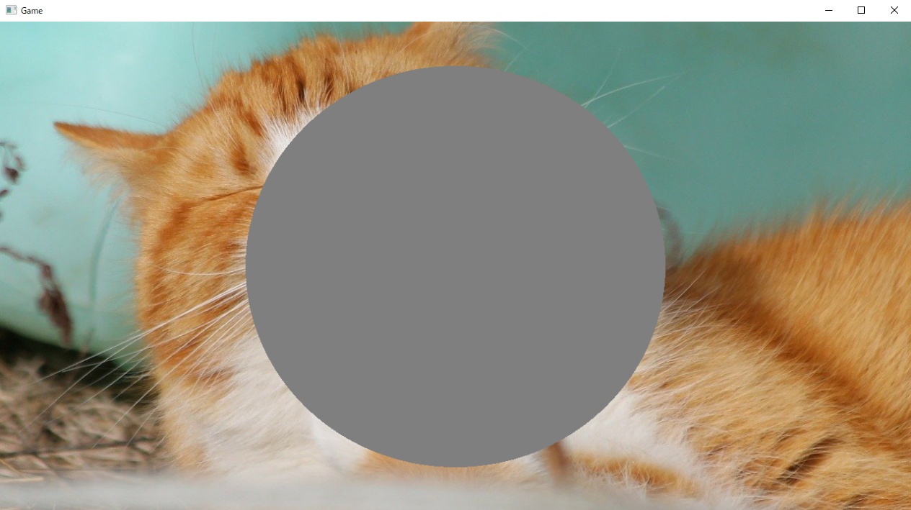</img></br>
では、実装していきましょう。Sample_09_03/Sample_09_03.slnを立ち上げてください。

### step-1 画面の中央からこのピクセルに向かって伸びるベクトルを計算する。
円形ワイプのC++側のコードは9.1のリニアワイプと同じなので、C++側の実装は行いません。Assets/shader/sample.fxを開いてください。まずは、画面の中央から描画しようとしているピクセルに向かって伸びるベクトルを計算します(図9.5)。では、sample.fxの41行目にリスト9.10のプログラムを入力してください。
[リスト9.10 sample.fx]
```cpp
// step-1 画面の中央からこのピクセルに向かって伸びるベクトルを計算する。
float2 posFromCenter = In.pos.xy - float2( 640.0f, 360.0f);
```
**図9.5**</br>
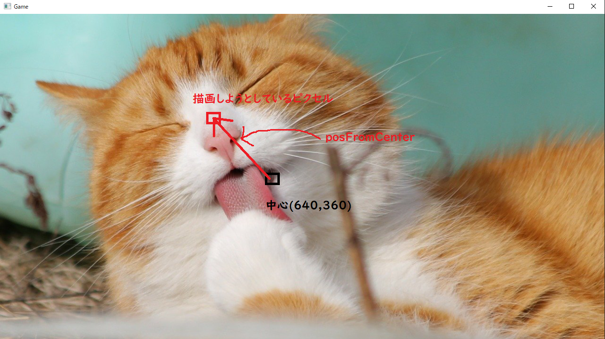</img></br>

### step-2 画面の中央からの距離とwipeSizeを利用してピクセルキル。
画面の中央からピクセルに向かって伸びるベクトルを計算することができたら、clip()を利用して、そのベクトルの長さがwipeSize以下ならピクセルキルするようにしましょう。sample.fxにリスト9.11のプログラムを入力してください。入力出来たら実行してください。円形にワイプできていたら完成です。</br></br>
[リスト9.11 sample.fx]
```cpp
// step-2 画面の中央からの距離とwipeSizeを利用してピクセルキル。
clip( length( posFromCenter ) - wipeSize);
```


## 9.4　【ハンズオン】縦縞ワイプを実装する。
続いて、縦縞ワイプを実装していきます。縦縞ワイプは図9.6のような演出となります。</br>
**図9.6**</br>
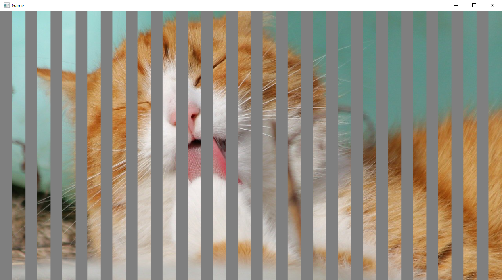</img></br>
では、Sample_09_04/Sample_09_04.slnを立ち上げてください。

### step-1 ピクセルのX座標を64で割った余りとワイプサイズを利用してピクセルキル。
縦縞ワイプのC++側のコードは9.1のリニアワイプと同じなので、c++側の実装は行いません。Assets/shader/sample.fxを開いてください。sample.fxの41行目にリスト9.12のプログラムを入力してください。</br>
[リスト9.12 sample.fx]
```cpp
// step-1 ピクセルのX座標を64で割った余りとワイプサイズを利用してピクセルキル。
float t = (int)fmod( In.pos.x, 64.0f);
clip( t- wipeSize );
```
縦縞ワイプでは、まず、fmod()を使用して、ピクセルのX座標を64で割った余りを求めます。この計算結果は図9.7のようになります(この画像の解像度は横幅が256になっています)。</br>
**図9.7**</br>
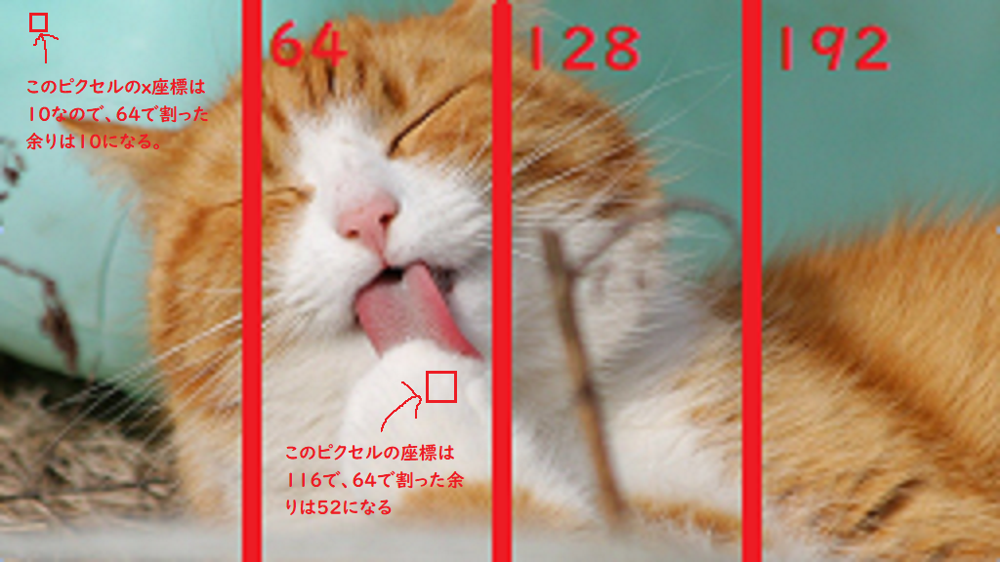</img></br>
このとき、例えばワイプサイズが10であれば、割った余りが10以下のピクセルは描画されなくなります。ワイプサイズが64になると、すべてのピクセルが描画されなくなります(図9.8)。</br>

**図9.8**</br>
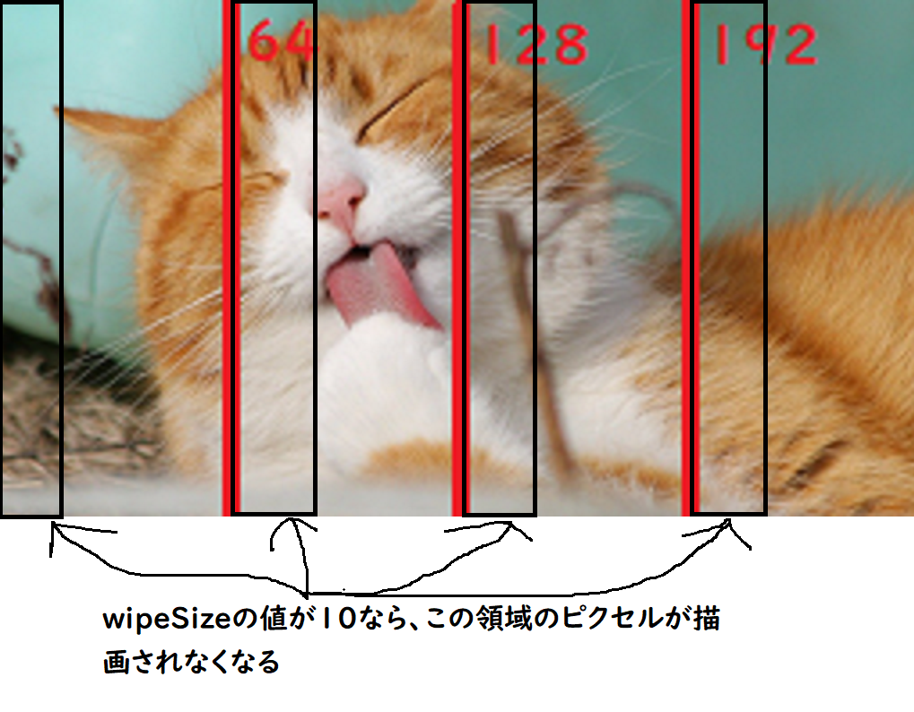</img></br>
では、入力出来たら実行してください。縦縞にワイプができていたら完成です。

## 9.5　【ハンズオン】横縞ワイプを実装する。
横縞ワイプは縦縞ワイプの実装をほんの少し改造するだけです。では、Sample_09_05/Sample_09_05.slnを立ち上げてください。
### step-1 ピクセルのY座標を64で割った余りとワイプサイズを利用してピクセルキル。
横縞ワイプは縦縞ワイプの実装とほとんど同じです。縦縞ワイプはピクセルのX座標を利用してワイプをかけていましたが、横縞ワイプではピクセルのY座標を利用します。では、Assets/shader/sample.fxの42行目にリスト9.13のプログラムを入力してください。</br>
[リスト9.13 sample.fx]
```cpp
//step-1 ピクセルのY座標を64で割った余りとワイプサイズを利用してピクセルキル。
float t = (int)fmod( In.pos.y, 64.0f);
clip( t- wipeSize );
```
入力出来たら実行してください。図9.9のように横縞ワイプができていたら完成です。</br>
**図9.9**</br>
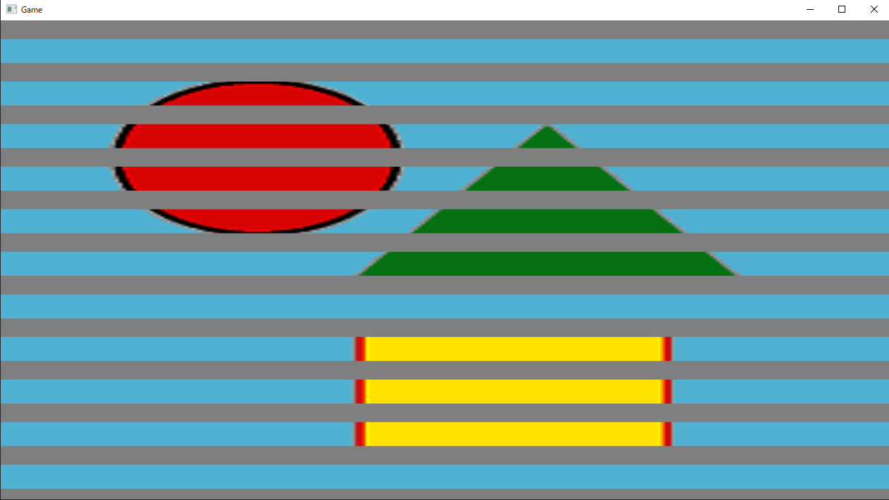</img></br>

## 9.6　【ハンズオン】チェッカーボードワイプを実装する。
ワイプ処理の最後にチェッカーボードワイプを実装します。チェッカーボードワイプは図9.10のようにワイプしていく演出です。では。</br>
**図9.10**</br>
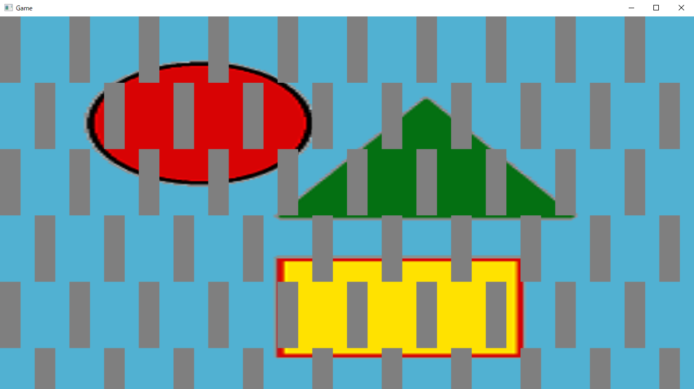</img></br>
チェッカーボードワイプは縦縞ワイプと同じ考え方なのですが、ピクセルのY座標に応じて、ピクセルのX座標に下駄をはかせることで、ワイプの基準位置をずらして縦縞ワイプを行うことで、図9.10のようなワイプ処理になります。図9.11であれば、各行を0行、1行、2行と考えると、奇数の行が基準位置がずれていることが分かります。</br>

**図9.11**</br>
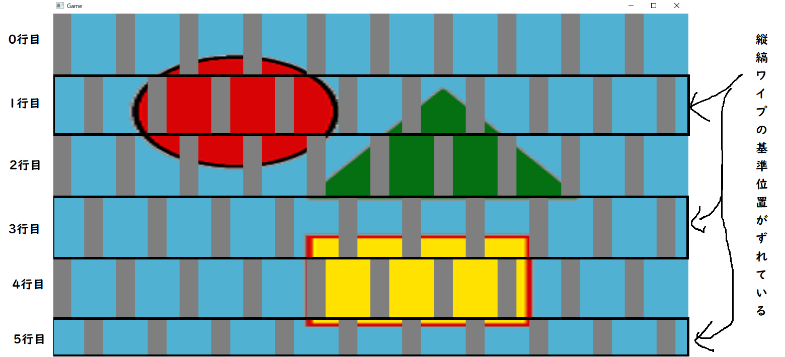</img></br>
つまり、チェッカーボードワイプはピクセルのY座標から、何行目のピクセルなのかを計算して、もしも奇数行であれば、基準位置をずらして縦縞ワイプを行えばよいこととなります。では実装を行っていきましょう。Sample_09_06/Sample_09_06.slnを開いてください。</br>


### step-1 チェッカーボードワイプを実装する。
チェッカーボードワイプもC++側の実装は9.1のリニアワイプと同じなので、C++側の実装は行いません。Assets/shader/sample.fxを開いて41行目にリスト9.14のプログラムを入力してください。</br>
[リスト9.14 sample.fx]
```cpp
// 1. ピクセルのY座標を128で割って、小数部分を切り捨てて、行番号を求める。
float t = floor(In.pos.y / 128.0f);
// 2. 行番号を2で割った余りを求める。偶数ならtは0、奇数ならtは1となる。
t = fmod(t, 2.0f);
// 3. 奇数行ならX座標を64ずらして、縦縞のワイプ処理を行う。
t = (int)fmod( In.pos.x + 64.0f * t, 128.0f);
clip( t- wipeSize );
```
入力出来たら実行してみてください。チェッカーボードワイプを行えていたら完成です。

## 9.7　【ハンズオン】画像のモノクロ加工
9.7からは画像加工のアルゴリズムについて見ていきます。まずは画像をモノクロ化するプログラムを実装しましょう。Sample_09_07/Sample_09_07.slnを開いて下さい。
### step-1 画像を徐々にモノクロに変化させていく。
では、Assets/shader/sample.fxの40行目にリスト9.15のプログラムを入力してください。</br>
[リスト9.15 sample.fx]
```cpp
 // step-1 画像を徐々にモノクロに変化させていく。
// ピクセルの明るさを計算する。
float Y  =  0.299f * color.r + 0.587f * color.g + 0.114f * color.b;
// 明るさの値をRGBに設定して、モノクロカラーを求める。
float3 monochromeColor = float3( Y, Y, Y);
// モノクロ率を使って徐々に白黒にしていく。
color.xyz = lerp( color, monochromeColor, monochromeRate);
```
モノクロ化のアルゴリズムは非常にシンプルで、モノクロにしたいピクセルカラーの明るさを計算して、その明るさをピクセルのRGBの値にすることで、モノクロにすることができます。今回実装したプログラムでは、カラー画像から徐々にモノクロ画像に変化していくように、lerp()を利用して、線形補完を行っています。lerp()の第三引数のmonochromeRateはC++側で計算されている値で、定数バッファとしてGPU側に送られてきています。では、入力出来たら実行してください。図9.12のようにモノクロ画像が生成されていたら完成です。</br>
**図9.12**</br>
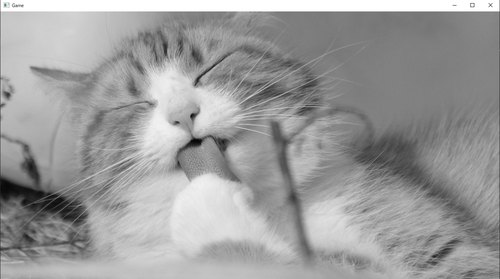</img></br>

## 9.8　【ハンズオン】画像のセピア調加工
続いて、画像をセピア調に加工する実装を行っていきましょう。Sample_09_08/Sample_09_08.slnを開いてください。
### step-1 画像を徐々にセピア調に変化させていく。
では、Assets/shader/sample.fxの41行目にリスト9.16のプログラムを入力してください。</br>
[リスト9.16 sample.fx]
```cpp
// step-1 画像を徐々にセピア調に変化させていく。
// ピクセルの明るさを計算する。
float Y  =  0.299f * color.r + 0.587f * color.g + 0.114f * color.b;
// セピア調ではモノクロ化とは違い。R、G、Bに明るさをそのまま代入はしない。
//　今回の実装では、赤みの成分に0.9、緑に0.7、bに0.4の重みを乗算している。
float3 sepiaColor;
sepiaColor.r = Y * 0.9f;
sepiaColor.g = Y * 0.7f;
sepiaColor.b = Y * 0.4f;

// セピア率を使って徐々に白黒にしていく。
color.xyz = lerp( color, sepiaColor, sepiaRate);
```
セピア調への加工処理はモノクロ化の手法とほとんど同じです。違いは、ピクセルの明るさをそのままRGB全ての成分に代入するのではなく、各成分ごとに重みがあり、それを乗算して代入しています。今回のプログラムですと、Rの成分の重みが高いため、加工後の画像は赤みが強い画像となります。入力出来たら、実行して動作を確認してください。

## 9.9　【ハンズオン】ネガポジ反転
続いて、画像をネガポジ反転させていく実装を行っていきましょう。Sample_09_09/Sample_09_09.slnを開いてください。
### 画像を徐々にネガポジ反転させていく。
ネガポジ反転はRBGの値を反転させることで実現できます。例えば、Rの値が0.8であれば、反転すると0.2になります。Gの値が0.6であれば、反転すると0.4になります。ですので、ネガポジ反転後のカラーは次の計算で求めることができます。</br>
**ネガポジ反転後のカラー = 1 - 元のカラー**
では、Assets/shader/sample.fxの41行目にリスト9.17のプログラムを入力してください。入力出来たら実行してみてください。徐々にネガポジ反転していけば、実装できています。</br>
[リスト9.17 sample.fx]
```cpp
 // step-1 画像を徐々にネガポジ反転させていく。
float3 negaColor;
negaColor.x = 1.0f - color.x;
negaColor.y = 1.0f - color.y;
negaColor.z = 1.0f - color.z;

// ネガポジ率を使って徐々にネガポジ画像にしていく。
color.xyz = lerp( color, negaColor, negaRate);
```
## 9.10　【ハンズオン】ノイズ
では、最後に画像にノイズを加える加工処理を見ていきましょう。今回のノイズ加工にはKen Perlin氏が考案したシンプレックスノイズというアルゴリズムを使います。Ken Perlin氏は画像加工のアルゴリズムで広く使われているパーリンノイズというアルゴリズムを考案したことでも有名です。今回使用するシンプレックスノイズはパーリンノイズの改良版で、パーリンノイズよりも実装がシンプルになっており、処理速度も高速になっています。では実装していきましょう。Sample_09_10/Sample_09_10.slnを開いて下さい。

### step-1 シンプレックスノイズを利用してノイズ加工を行う。
シンプレックスノイズとは、n次元の座標に応じて乱数を返してくるアルゴリズムです。ノイズ加工はテクセルをサンプリングするUV座標に乱数を加えて、サンプリングする場所をずらすことで実現できます。しかし、線形合同法やメルセンヌツイスターなど、一般的な乱数アルゴリズムを使うと、数値に連続性がなくなり、ノイズというよりもめちゃくちゃな画像が生成されてしまいます。パーリンノイズは乱数に連続性があるため、なだらかな変化を作成することがでます。その性質から、画像加工アルゴリズムで頻繁に利用されています。今回使用するシンプレックスノイズもパーリンノイズの改良版であるため、この性質を引き継いでいます。では、Assets/shader/sample.fxの56行目にリスト9.18のプログラムを入力してください。なお、今回は著者の方で用意したノイズ生成関数のSimplexNoise()を利用して、シンプレックスノイズを利用しています。</br>
[リスト9.18 sample.fx]
```cpp
// step-1 シンプレックスノイズを利用してノイズ加工を行う。
// シンプレックスノイズを使用して、0～1の乱数を取得。
float t = SimplexNoise(In.pos.xyz);
//ノイズの値の範囲を0～1から-1～1に変換。
t = ( t - 0.5f ) * 2.0f;
//UV座標にノイズを加える。0.01fはノイズの強さ。
//この数値を大きくするとノイズが大きくなる。
float2 uv = In.uv + t * 0.01f;
//ずらしたUV座標を利用して、カラーをサンプリングする。
float4 color = colorTexture.Sample(Sampler, uv);
```
入力出来たら実行してください。図9.13のようなノイズがかかった画像が表示できたら完成です。</br>
**図9.13**</br>
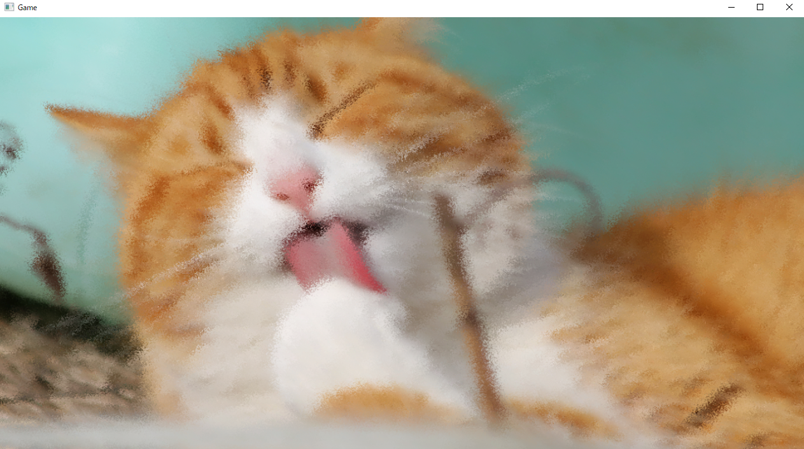</img></br>

# Chapter 10 ポストエフェクト
最近の3Dゲームではカメラのピンボケ現象をシミュレーションする被写界深度や、光が溢れ出るブルームといわれる現象を疑似的に再現しています。</br>
**図10.1**</br>
</img></br>
これらはポストエフェクトと呼ばれる手法で実現されています。このチャプターでは、ポストエフェクトの基礎となるオフスクリーンレンダリングについ見ていった後で、モノクロ化、ブルーム、被写界深度、トーンマップ、Screen Space Reflectionといったいくつかのポストエフェクトを勉強していきます。

## 10.1 オフスクリーンレンダリング
オフスクリーンレンダリングとは画面に表示されないレンダリングのことです。これまで皆さんが行ってきたレンダリングは、画面に絵が出ていたのでオンスクリーンレンダリングです。一方オフスクリーンレンダリングは画面に表示されないレンダリングです。なぜそんなことをするの？と不思議な気持ちになってしまうかもしれませんが、ポストエフェクトを行うためにはオフスクリーンレンダリングを行う必要があります。では、多様なポストエフェクトのアルゴリズムを勉強する前に、ポストエフェクトの基礎となるオフスクリーンレンダリングについて見ていきましょう。

### 10.1.1 レンダリングターゲット
レンダリングターゲットというのは３Ｄモデルの描画先のことです。レンダリングターゲットは次の二つのテクスチャを指します。

1. カラーバッファ ： ピクセルシェーダーから出力されたカラーの書き込み先。
2. デプスステンシルバッファ : カラーバッファに書き込んだピクセルの深度値の書き込み先。

カラーバッファはピクセルシェーダーから出力されたピクセルのカラーが描き込まれるテクスチャです。これまで画面に表示されていたのは、フレームバッファと呼ばれるカラーバッファです。画面に表示されるカラーバッファはフレームバッファという特別な名前で呼ばれますが、本質的にはレンダリングターゲットに関連付けられているカラーバッファと変わりはありません。デプスステンシルバッファはカラーバッファに描き込んだピクセルの深度値が描き込まれるテクスチャです。このテクスチャを利用して、ピクセルの前後関係のテストが行われています。DirectX12では必ず絵の描き込み先となるレンダリングターゲットを指定する必要があります。つまり、これまではフレームバッファをカラーバッファとするレンダリングターゲットに絵が描き込まれていたわけです。</br>
さて、ここでオフスクリーンレンダリングの話に戻します。オフスクリーンレンダリングとは、フレームバッファ以外のテクスチャに絵を描き込むことを指します。画面に表示されるのがフレームバッファであるため、フレームバッファ以外のテクスチャに描き込むのであれば、当然画面に絵は出ません。では、これが何の役に立つのか？画面に絵が出ないのであれば意味がないのではないか？そう思われると思います。実はレンダリングターゲットのカラーバッファに書き込まれた絵は、テクスチャとして利用することができます。カラーバッファはテクスチャなので当然です。つまり、オフスクリーンレンダリングした絵をテクスチャとして３Ｄモデルに張り付けたりすることができるわけです。この技術を使えば、分かりやすい例であれば、車のバックミラー、鏡、テレビ画面といった表現を行うことができます(図10.2)。</br>
**図10.2**</br>
</img></br>

### 10.1.2 【ハンズオン】オフスクリーンレンダリングした絵をテクスチャとして貼り付けてみよう
では、オフスクリーンレンダリングした絵をテクスチャとして貼り付けるプログラムを実装してみましょう。`Chapter_10_01/Chapter_10_01.sln`を立ち上げてください。

#### step-1 オフスクリーン描画用のレンダリングターゲットを作成。
では、最初はオフスクリーン描画用のレンダリングターゲットを作成するコードを追加します。本書のMiniEngineにはレンダリングターゲットを扱うためのRenderTargetクラスが用意されています。今回はそれを利用します。レンダリングターゲットで必要なカラーバッファとデプスステンシルバッファはRenderTarget::Create()を利用することで作成することができます。この関数の引数に渡すパラメータはテクスチャの幅、高さ、フォーマットなど、テクスチャを作成するために必要な情報になります。main.cppの21行目にリスト10.1のプログラムを入力してください。</br>

[リスト10.1 main.cpp]
```cpp
//step-1 オフスクリーン描画用のレンダリングターゲットを作成。
//RenderTargetクラスのオブジェクトを定義。
RenderTarget offscreenRenderTarget;
//RenderTarget::Create()を利用して、レンダリングターゲットを作成する。
offscreenRenderTarget.Create(
	1280,						//テクスチャの幅。
	720,						//テクスチャの高さ。
	1,							//Mipmapレベル。
	1,							//テクスチャ配列のサイズ。
	DXGI_FORMAT_R8G8B8A8_UNORM, //カラーバッファのフォーマット。
	DXGI_FORMAT_D32_FLOAT		//デプスステンシルバッファのフォーマット。
);
```

#### step-2 各種3Dモデルを初期化する。
続いて、各種3Dモデルの絵を描画できるように、初期化するプログラムを実装します。リスト10.2のプログラムを入力してください。</br>

[リスト10.2 main.cpp]
```cpp
//step-2 各種モデルを初期化する。
//箱モデルを初期化する。
ModelInitData boxModelInitData;
boxModelInitData.m_tkmFilePath = "Assets/modelData/box.tkm";
boxModelInitData.m_fxFilePath = "Assets/shader/sample3D.fx";
Model boxModel;
boxModel.Init(boxModelInitData);
boxModel.UpdateWorldMatrix({ 100.0f, 0.0f, 0.0f }, g_quatIdentity, g_vec3One);

//背景モデルを初期化。
ModelInitData bgModelInitData;
bgModelInitData.m_tkmFilePath = "Assets/modelData/bg/bg.tkm";
bgModelInitData.m_fxFilePath = "Assets/shader/sample3D.fx";

//背景モデルを初期化。
Model bgModel;
bgModel.Init(bgModelInitData);

//プレイヤーモデルを初期化。
ModelInitData plModelInitData;
plModelInitData.m_tkmFilePath = "Assets/modelData/unityChan.tkm";
plModelInitData.m_fxFilePath = "Assets/shader/sample3D.fx";
Model plModel;
plModel.Init(plModelInitData);
```

#### step-3 箱モデルに貼り付けるテクスチャを変更する。
今回の実装では、箱モデルにオフスクリーンレンダリングしたテクスチャを貼り付けます。ですので、箱モデルのテクスチャを変更するコードを追加しましょう。リスト10.3のプログラムを入力して下さい。</br>
[リスト10.3 main.cpp]
```cpp
//step-3 箱モデルに貼り付けるテクスチャを変更する。
//箱モデルのテクスチャをオフスクリーンレンダリングされるテクスチャに切り替える。
boxModel.ChangeAlbedoMap(
	"", 
	offscreenRenderTarget.GetRenderTargetTexture()
);
```

#### step-4 レンダリングターゲットをoffscreenRenderTargetに変更する。
では、いよいよオフスクリーンレンダリングを行うコードを追加していきます。まずは描画先の切り替えのコードです。リスト10.4のプログラムを入力してください。</br>
[リスト10.4 main.cpp]
```cpp
//step-4 レンダリングターゲットをoffscreenRenderTargetに変更する。
RenderTarget* rtArray[] = { &offscreenRenderTarget };
//レンダリングターゲットとして利用できるまで待つ。
renderContext.WaitUntilToPossibleSetRenderTargets(1, rtArray);
//レンダリングターゲットを設定。
renderContext.SetRenderTargets(1, rtArray);
//レンダリングターゲットをクリア。
renderContext.ClearRenderTargetViews(1, rtArray);
```
では、このプログラムを解説していきます。DirectX12では、レンダリングターゲットを設定する前に、レンダリングターゲットとして利用できる状態になるまで待つ必要があります。これは、GPUがシェーダーリソースのテクスチャとして利用している間はレンダリングターゲットとして利用できないからです。本書では、この処理を薄くラップしているRenderTarget::WaitUntilToPossibleSetRenderTargets()を利用しています。この処理が抜けていると、VisualStudioの出力ウィンドウに、図10.3のようなエラーメッセージが表示されます。</br>
**図10.3**</br>
</img></br>
続いて、RenderContext::SetRenderTargets()を利用して、レンダリングターゲットを設定しています。第一引数はレンダリングターゲットの数です。実はレンダリングターゲットというのは、同時に複数枚設定することが可能です。今回は１枚だけなので、１を指定しています。最後はRenderTarget::ClearRenderTargetViews()を利用して、レンダリングターゲットのクリアを行っています。これは、絵を描くためのキャンパスを綺麗にしているようなイメージです。以前描いた絵を消す感じです。この関数の第一引数もレンダリングターゲットの数です。今回は１を指定しています。

#### step-5 offscreenRenderTargetに背景、プレイヤーを描画する。
レンダリングターゲットを変更することができたら、そのレンダリングターゲットに対し3Dモデルを描画しましょう。この処理は普通のモデル描画と全く同じになります。リスト10.5のプログラムを入力してください。</br>
[リスト10.5 main.cpp]
```cpp
//step-5 offscreenRenderTargetに背景、プレイヤーを描画する。
//背景モデルをドロー。		
bgModel.Draw(renderContext);
//プレイヤーをドロー。
plModel.Draw(renderContext);
//レンダリングターゲットへの書き込み終了待ち。
renderContext.WaitUntilFinishDrawingToRenderTargets(1, rtArray);
```
この描画処理では画面になにも表示されないことに注意してください。この描画はオフスクリーン(画面に表示されないテクスチャ)に描画しています。

#### step-6 画面に表示されるレンダリングターゲットに戻す。
オフスクリーンレンダリングが終わったら、次は画面に表示されるレンダリングターゲットに戻すプログラムを実装します。リスト10.6のプログラムを入力してください。</br>
[リスト10.6 main.cpp]
```cpp
//step-6 画面に表示されるレンダリングターゲットに戻す。
renderContext.SetRenderTarget(
	g_graphicsEngine->GetCurrentFrameBuffuerRTV(),
	g_graphicsEngine->GetCurrentFrameBuffuerDSV()
);
```
#### step-7 画面に表示されるレンダリングターゲットに各種モデルを描画する。
では、いよいよ最後です。画面に表示されるレンダリングターゲットに対して、各種モデルを描画します。リスト10.7のプログラムを入力してください。</br>
[リスト10.7 main.cpp]
```cpp
//step-7 画面に表示されるレンダリングターゲットに各種モデルを描画する。
//背景モデルをドロー。		
bgModel.Draw(renderContext);
//プレイヤーをドロー。
plModel.Draw(renderContext);
//箱を描画。
boxModel.Draw(renderContext);
```
入力出来たら実行してください。うまく実装出来ていると図10.4のようなプログラムが実行できます。箱モデルにオフスクリーンレンダリングされた絵がテクスチャとして貼り付けられています。</br>
**図10.4**
</img></br>

## 10.2 モノクロ化
前節でポストエフェクトの基礎となる、オフスクリーンレンダリングについて勉強しました。今節では、ポストエフェクトでオフスクリーンレンダリングをどのように利用するのか？という点を見てから、簡単なポストエフェクトのモノクロ化を実装していきます。
### 10.2.1 ポストエフェクトの流れ
 ポストエフェクトとはレンダリングした絵に対して、レタッチを行ってエフェクトを追加していく処理のことを言います。レンダリングを完了した後で、遅れて(ポスト)エフェクトを追加するのでポストエフェクトと呼ばれます。図10.5にポストエフェクトの流れを記載します。</br>
 **図10.5**
 </img></br>
一度レンダリングした絵に対してエフェクトをかけるには、レンダリングした絵をテクスチャ化する必要があります。描画した絵をテクスチャとして利用する方法は、前節のオフスクリーンレンダリングを使えば実現できます。つまり、今までキャラクターや背景などの画面に表示されるプリミティブは、画面に関連づいているカラーバッファ(フレームバッファ)にレンダリングしてきましたが、ポストエフェクトを行うためには、直接フレームバッファにレンダリングをせずにオフスクリーンに対してレンダリングを行うのです。

### 10.2.2 オフスクリーンレンダリングした絵をフレームバッファに張り付ける
ポストエフェクトを行うためには、まずキャラクターや背景などをオフスクリーンに対してレンダリングを行う必要があると説明しました。しかし当然ですが実際に画面に表示されるのはフレームバッファです。なので、このままでは画面に何も表示されません。そのため、オフスクリーンにレンダリングした絵をフレームバッファに張り付ける必要があります。フレームバッファに張り付けるには大きな四角形の板ポリにオフスクリーンレンダリングした絵をテクスチャとして張り付けてレンダリングを行えばよいのです。つまりスプライトを全画面描画したらいいのです(図10.6)。
 **図10.6**
 </img></br>
そして、この全画面描画の時にピクセルシェーダーでピクセルカラーを加工していくのがポストエフェクトです。

### 10.2.3【ハンズオン】画面をモノクロにするポストエフェクトを実装する。
では、画面を白黒にするポストエフェクトを実装してみましょう。Sample_10_02/Sample_10_02.slnを開いてください。

#### step-1 オフスクリーン描画用のレンダリングターゲットを作成。
まずは、オフスクリーンレンダリングするためのレンダリングターゲットを作成しましょう。このレンダリングターゲットの幅と高さはフレームバッファと同じになるようにしてください。main.cppの21行目にリスト10.8のプログラムを入力してください。</br>
[リスト10.8 main.cpp]
```cpp
//step-1 オフスクリーン描画用のレンダリングターゲットを作成。
//RenderTargetクラスのオブジェクトを定義。
RenderTarget offscreenRenderTarget;
//RenderTarget::Create()を利用して、レンダリングターゲットを作成する。
offscreenRenderTarget.Create(
	1280,												//テクスチャの幅。
	720,												//テクスチャの高さ。
	1,													//Mipmapレベル。
	1,													//テクスチャ配列のサイズ。
	DXGI_FORMAT_R8G8B8A8_UNORM,   //カラーバッファのフォーマット。
	DXGI_FORMAT_D32_FLOAT				//デプスステンシルバッファのフォーマット。
);
```
#### step-2 ポストエフェクト実行用のスプライトを初期化する。
続いて、ポストエフェクト実行用のスプライトを初期化します。main.cppにリスト10.9のプログラムを入力してください。このスプライトの描画で使用するテクスチャに、先ほど作成したレンダリングターゲットのカラーテクスチャを指定している箇所に注目して下さい。また、スプライトを描画するときに使用するシェーダーもポストエフェクト用のシェーダーを指定している箇所も注目してください。</br>
[リスト10.9 main.cpp]
```cpp
//step-2 ポストエフェクト実行用のスプライトを初期化する。
//スプライトの初期化オブジェクトを作成する。
SpriteInitData spriteInitData;
//【重要！！！】テクスチャはオフスクリーンレンダリングされた絵。
spriteInitData.m_textures[0] = &offscreenRenderTarget.GetRenderTargetTexture();
//【重要！！！】全画面描画なのでスプライトのサイズはフレームバッファと同じにする。
spriteInitData.m_width = 1280;
spriteInitData.m_height = 720;
//【重要！！！】モノクロ用のシェーダーを指定する。
spriteInitData.m_fxFilePath = "Assets/shader/samplePostEffect.fx";
//初期化オブジェクトを使って、スプライトを初期化する。
Sprite monochromeSprite;
monochromeSprite.Init(spriteInitData);
```
#### step-3 レンダリングターゲットをoffscreenRenderTargetに変更する。
続いて、レンダリングターゲットの切り替えです。リスト10.10のプログラムを入力してください。</br>
[リスト10.10 main.cpp]
```cpp
//step-3 レンダリングターゲットをoffscreenRenderTargetに変更する。
RenderTarget* rtArray[] = { &offscreenRenderTarget };
//レンダリングターゲットとして利用できるまで待つ。
renderContext.WaitUntilToPossibleSetRenderTargets(1, rtArray);
//レンダリングターゲットを設定。
renderContext.SetRenderTargets(1, rtArray);
//レンダリングターゲットをクリア。
renderContext.ClearRenderTargetViews(1, rtArray);
```

#### step-4 offscreenRenderTargetに各種モデルを描画する。
レンダリングターゲットの切り替えができたら、各種3Dモデルを描画します。リスト10.11のプログラムを入力してください。この描画処理はオフスクリーンに対して行われるので、このプログラムを入力しても、まだ画面には絵が出ないので注意してください。
[リスト10.11 main.cpp]
```cpp
//step-4 offscreenRenderTargetに各種モデルを描画する。
//背景モデルをドロー。		
bgModel.Draw(renderContext);
//プレイヤーをドロー。
plModel.Draw(renderContext);
//レンダリングターゲットへの書き込み終了待ち。
renderContext.WaitUntilFinishDrawingToRenderTargets(1, rtArray);
```

#### step-5 画面に表示されるレンダリングターゲットに戻す。
オフスクリーンへのレンダリングが完了したので、いよいよポストエフェクトの実行です。まずは画面に表示されるレンダリングターゲットに戻します。リスト10.12のプログラムを入力してください。</br>

[リスト10.12 main.cpp]
```cpp
//step-5 画面に表示されるレンダリングターゲットに戻す。
renderContext.SetRenderTarget(
	g_graphicsEngine->GetCurrentFrameBuffuerRTV(),
	g_graphicsEngine->GetCurrentFrameBuffuerDSV()
);
```
#### step-6 画面に表示されるレンダリングターゲットにフルスクリーン表示のスプライトを描画する。
step-6でcpp側のプログラムは最後です。レンダリングターゲットを切り替えることができたら、画面全体に２Ｄを描画します。リスト10.13を入力して下さい。</br>
[リスト10.13 main.cpp]
```cpp
//step-6 画面に表示されるレンダリングターゲットにフルスクリーン表示のスプライトを描画する。
monochromeSprite.Draw(renderContext);
```
#### step-7 ピクセルカラーをモノクロ化する。
続いて、シェーダー側です。`Assets/shader/samplePostEffect.fx`を開いてください。画像をモノクロ化するには、出力するカラーのRBGの値を全て同じにすることで行うことができます。リスト10.14のコードはテクスチャカラーの明るさを求めて、その明るさを出力するカラーのRGBに設定しています。では、samplePostEffect.fxの28行目にリスト10.14のプログラムを入力して下さい。入力出来たら実行してください。うまく実装できていると図10.7のようなプログラムが実行できます。</br>
[リスト10.14 samplePostEffect.fx]
```cpp
//step-7 ピクセルカラーをモノクロ化する。
float Y  =  0.299f * color.r + 0.587f * color.b + 0.114f * color.b;
color.r = Y;
color.g = Y;
color.b = Y;
```
**図10.7**</br>
 </img></br>

## 10.3 ブラー
このチャプターでは画像をぼかす、ブラーについて見ていきましょう。ブラーは、ブルーム、SSR、被写界深度など、様々なポストエフェクトで利用される画像加工処理です。
### 10.3.1 【ハンズオン】平均ブラーを実装する
では、最もシンプルな平均ブラーの処理を実装していきましょう。平均ブラーはピクセルシェーダーで複数のテクセルをサンプリングして、平均を取ることでぼかしていきます。今回のブラーの処理は、オフスクリーンレンダリングされたゲームシーンの絵をフレームバッファに貼り付ける処理のピクセルシェーダーでぼかしを入れていきます。ですので、C++側の処理の流れは10.3節のモノクロ化と全く同じです。
#### step-1 基準テクセル＋近傍8テクセルの平均を計算する。
では、Sample_10_03/Sample_10_03.slnを立ち上げてください。C++側の処理はモノクロ化と全く同じなので、今回はシェーダー側だけの実装です。`Assets/shader/samplePostEffect.fx`を開いてリスト10.15のプログラムを入力してください。</br>
[リスト10.15 samplePostEffect.fx]
```cpp
//step-1 基準テクセル＋近傍8テクセルの平均を計算する。

//1.5テクセル分ずらすためのUV値を求める。
float offsetU = 1.5f / 1280.0f;
float offsetV = 1.5f / 720.0f;

//基準テクセルから右のテクセルのカラーをサンプリングする。
color += sceneTexture.Sample(Sampler, In.uv + float2( offsetU, 0.0f));
//基準テクセルから左のテクセルのカラーをサンプリングする。
color += sceneTexture.Sample(Sampler, In.uv + float2( -offsetU, 0.0f));
//基準テクセルから下のテクセルのカラーをサンプリングする。
color += sceneTexture.Sample(Sampler, In.uv + float2( 0.0f, offsetV));
//基準テクセルから上のテクセルのカラーをサンプリングする。
color += sceneTexture.Sample(Sampler, In.uv + float2( 0.0f, -offsetV));
//基準テクセルから右下のテクセルのカラーをサンプリングする。
color += sceneTexture.Sample(Sampler, In.uv + float2( offsetU, offsetV));
//基準テクセルから右上のテクセルのカラーをサンプリングする。
color += sceneTexture.Sample(Sampler, In.uv + float2( offsetU, -offsetV));
//基準テクセルから左下のテクセルのカラーをサンプリングする。
color += sceneTexture.Sample(Sampler, In.uv + float2( -offsetU, offsetV));
//基準テクセルから左上のテクセルのカラーをサンプリングする。
color += sceneTexture.Sample(Sampler, In.uv + float2( -offsetU, -offsetV));

//基準テクセルと近傍８テクセルの平均なので9で除算する。
color /= 9.0f;
```
このプログラムでは基準テクセルとその周囲8テクセルをサンプリングして、その平均を計算しています。入力できたら実行してみてください。図10.8のようにシーンがボケて表示されていれば、実装出来ています。</br>
**図10.8**</br>
</img></br>

### 10.3.2 ガウシアンブラー
平均化ブラーでは広い範囲の綺麗なブラーを出すのが困難です。そこでブルームエフェクトのブラー処理では、比較的高速で綺麗なブラーをかけることができるガウシアンブラーが使われることが多いです。ガウシアンブラーも複数のテクセルをサンプリングしてぼかしていくことに変わりがないのですが、平均ブラーと異なり、各テクセルに重み(影響度)が付与されます。例えばテクセル0は0.7の重み、テクセル1は0.2の重み、テクセル2は0.1の重みでブレンディングするといった具合です。この場合は、最終的なカラーは次の計算で決定されます。</br>

**最終カラー = テクセル0×0.7 + テクセル1×0.2 + テクセル2×0.1**</br>

では、この重みはどのように決めるのか？ガウシアンブラーでは、この重みの計算に、ガウス関数を使用します。ガウス関数を利用するためガウシアンブラーと呼ばれます。ガウス関数は次のような式になっています。</br>

**F(x) = exp⁡(-x^2/(2σ^2 ))**</br>

この関数のxが基準テクセルからの距離です。このxの値に応じて重みを計算してくれます。σは分散具合を決定する定数です。σを大きくすると強くブラーするようになります。本書で勉強する範囲では、この式の意味は分からなくても大丈夫です。ガウス関数とは、基準テクセルからの距離ｘに応じて、いい感じに重みを計算してくれる関数くらいの認識で構いません。図10.8は基準テクセルからの距離(横軸)に応じて重み(縦軸)がどのように変化していくかを表しているグラフです。距離が離れていくほど重みが小さくなっていることが分かると思います。

**図10.9**</br>
</img></br>

#### 10.3.2.1 横ブラと縦ブラー
ガウシアンフィルターでは横方向のブラーと縦方向のブラーを２パスに分けて行います。次のコードはガウス関数で計算した重みテーブルを使って、横の解像度1280の画像に対して、横ブラーをかけているピクセルシェーダーの疑似コードです。
```cpp
float4 PSXBlur( PS_BlurInput In ) : SV_Target0
	float4 Color;
	//基準テクセルから右に3テクセル、重み付きでサンプリング。
	Color  = weight[0] * originalTexture.Sample( 
		Sampler, 
		//右に1テクセルずらしたUVを計算する
		In.uv + float2( 1.0f / 1280.0f, 0.0f) 
	);
	Color += weight[1] * originalTexture.Sample( 
		Sampler, 
		//右に2テクセルずらしたUVを計算する
		In.uv + float2( 2.0f / 1280.0f, 0.0f) 
	);
	Color += weight[2] * originalTexture.Sample( 
		Sampler, 
		//右に3テクセルずらしたUVを計算する
		In.uv + float2( 3.0f / 1280.0f, 0.0f) 
	);

	//基準テクセルに左に3テクセル、重み付きでサンプリング。
	Color += weight[0] * originalTexture.Sample( 
		Sampler, 
		//左に1テクセルずらしたUVを計算する
		In.uv + float2( -1.0f / 1280.0f, 0.0f) 
	);
	Color += weight[1] * originalTexture.Sample( 
		Sampler, 
		//左に2テクセルずらしたUVを計算する
		In.uv + float2( -2.0f / 1280.0f, 0.0f) 
	);
	Color += weight[2] * originalTexture.Sample( 
		Sampler, 
		//左に3テクセルずらしたUVを計算する
		In.uv + float2( -3.0f / 1280.0f, 0.0f) 
	);
	return Color;
}
```
weightにガウス関数で計算された重みが記憶されています。次のコードは縦の解像度720の画像に対して、縦ブラーをかけているピクセルシェーダーの疑似コードです。
```cpp
float4 PSXBlur( PS_BlurInput In ) : SV_Target0
	float4 Color;
	//基準テクセルから下に3テクセル、重み付きでサンプリング。
	Color  = weight[0] * originalTexture.Sample( 
		Sampler, 
		//下に1テクセルずらしたUVを計算する
		In.uv + float2( 0.0f, 1.0f / 720.0f ) 
	);
	Color += weight[1] * originalTexture.Sample( 
		Sampler, 
		//下に2テクセルずらしたUVを計算する
		In.uv + float2( 0.0f, 2.0f / 720.0f ) 
	);
	Color += weight[2] * originalTexture.Sample( 
		Sampler, 
		//下に3テクセルずらしたUVを計算する
		In.uv + float2( 0.0f, 3.0f / 720.0f )  
	);

	//基準テクセルに上に3テクセル、重み付きでサンプリング。
	Color += weight[0] * originalTexture.Sample( 
		Sampler, 
		//上に1テクセルずらしたUVを計算する
		In.uv + float2( 0.0f, -1.0f / 720.0f ) 
	);
	Color += weight[1] * originalTexture.Sample( 
		Sampler, 
		//上に2テクセルずらしたUVを計算する
		In.uv + float2( 0.0f, -2.0f / 720.0f ) 
	);
	Color += weight[2] * originalTexture.Sample( 
		Sampler, 
		//上に3テクセルずらしたUVを計算する
		In.uv + float2( 0.0f, -3.0f / 720.0f ) 
	);
	return Color;
}
```
横ブラーも縦ブラーも処理はほとんど同じです。違いがあるのはUVをずらす方向のみです。

#### 10.3.2.2 ダウンサンプリング
このあと実装するガウシアンブラーのハンズオンでは、ダウンサンプリングというテクニックも使っています。ダウンサンプリングとは解像度の高いテクスチャを解像度の低いレンダリングターゲットに対して縮小してレンダリングすることを言います。例えば1280×720の解像度のテクスチャを640×360のレンダリングターゲットに対してレンダリングする場合などです(図10.10)。</br>
**図10.10**</br>
</img></br>
今回の実装では、ダウンサンプリングは横ブラーと縦ブラーをかけるときに行います。次のガウシアンブラーの処理の流れを見てみてください。

1. ブラーをかけたい絵をオフスクリーンレンダリング(解像度は1280×720)
2. 1で作成した絵をテクスチャ(解像度は1280×720)にして、横ブラー用のレンダリングターゲット(解像度は640×720)に描画。
3. 2で作成した絵をテクスチャ(解像度は640×720)にして、縦ブラー用のレンダリングターゲット(解像度は640×360)に描画。

2と3の描画の時に、横ブラーと縦ブラーのピクセルシェーダーを実行することになるのですが、この時のテクスチャの解像度とレンダリングターゲットの解像度を比べてみてください。横ブラー用のレンダリングターゲットは、テクスチャの解像度に対して、横幅が半分に、縦ブラー用のレンダリングターゲットは、テクスチャの解像度に対して、縦幅が半分になっています。つまりダウンサンプリングを行っています。では、なぜダウンサンプリングを行っているのでしょうか。実は、ダウンサンプリングには次の二つの効果があります。

1. バイリニアフィルタを設定することによって、さらに強力にぼかすことができる。
2. レンダリングターゲットの解像度が下がるため、処理が高速になる。

図10.10の画像の例のように縦横1/2のレンダリングターゲットに描画すると、画素の総数がちょうど1/4になります(1280×720=921600、640×360 = 230400)。つまり640×360のレンダリングターゲットの1ピクセルは、元テクスチャの4テクセルに相当することになります。しかし当然1ピクセルに表現できる画素は1画素です。そのため何もしなければ、3テクセル分の画素は失われることになってしまいます。しかし、この時にバイリニアフィルタを使用すると1ピクセルの画素は、４テクセルの平均のカラーにすることができます。これにより、ガウスフィルタだけではなくバイリニアフィルタをかけることもでき、さらに強力に画像をぼかすことができます。もう一点は処理速度です。ピクセルシェーダーのプログラムはレンダリングターゲットのピクセルの数分だけ実行されます。つまり、1280×720なら921600回実行されます。しかし、解像度を下げて640×360にすると230400回に削減することができ、ピクセルシェーダーの実行回数を1/4にすることができ、処理速度を向上させることができます。では、最後に縦横ブラーをかけていく様子を画像で確認してみましょう。図10.11を見てみてください。</br>
**図10.11**</br>
</img></br>

### 10.3.3 【ハンズオン】ガウシアンブラーを実装する
では、ガウシアンブラーを実装していきましょう。`Sample_10_04/Sample_10_04.sln`を立ち上げてください。

#### step-1 ゲームシーンを描画するレンダリングターゲットを作成。
まずはゲームのシーンを描画するレンダリングターゲットを作成しましょう。また、これ以降のチャプターでは、ゲームのシーンを描画するレンダリングターゲットをメインレンダリングターゲットと呼称します。では、main.cppの45行目にリスト10.16のプログラムを入力してください。</br>
[リスト10.16 main.cpp]
```cpp
//step-1 ゲームシーンを描画するレンダリングターゲットを作成。
RenderTarget mainRenderTarget;
mainRenderTarget.Create(
	1280,
	720,
	1,
	1,
	DXGI_FORMAT_R8G8B8A8_UNORM,
	DXGI_FORMAT_D32_FLOAT
);
```

#### step-2 ガウスブラー用の重みテーブルを計算する
続いて、ガウス関数を利用して重みテーブルを計算します。今回は著者が作成した、CalcWeigthsTableFrmGaussian()を利用します。この関数は引数に重みの格納先となるテーブル、テーブルのサイズ、ボケ具合を受け取ります。この関数を呼び出すと、渡されたパラメータに応じて適切な重みを計算してくれます。main.cppにリスト10.17のプログラムを入力してください。</br>

[リスト10.17 main.cpp]
```cpp
//step-2 ガウスブラー用の重みテーブルを計算する
const int NUM_WEIGHTS = 8;
//テーブルのサイズは８。
float weights[NUM_WEIGHTS];
//重みテーブルを計算する。
CalcWeightsTableFromGaussian(
	weights,		//重みの格納先
	NUM_WEIGHTS,	//重みテーブルのサイズ。
	8.0f			//ボケ具合。この数値が大きくなるとボケが強くなる。
);
```

#### step-3 横ブラー用のレンダリングターゲットを作成。
続いて、横ブラー用のレンダリングターゲットを作成します。このレンダリングターゲットに、メインレンダリングターゲットに描画されたゲームシーンの絵をテクスチャとしたスプライトを描画します。レンダリングターゲットの横幅の解像度がメインレンダリングターゲットの半分になっているため、ダウンサンプリングを行うことになります。これによりバイリニアフィルタによるぼかしと、処理負荷の軽減の効果が期待できます。リスト10.18のプログラムを入力してください。</br>
[リスト10.18 main.cpp]
```cpp
//step-3 横ブラー用のレンダリングターゲットを作成。
RenderTarget xBlurRenderTarget;
xBlurRenderTarget.Create(
	640,	//横幅の解像度をmainRenderTargetの幅の半分にする。
	720,	//高さはmainRenderTargetの高さと同じ。
	1,
	1,
	DXGI_FORMAT_R8G8B8A8_UNORM,
	DXGI_FORMAT_D32_FLOAT
);
```

#### step-4 横ブラー用のスプライトを初期化。
横ブラー用のレンダリングターゲットを作成することができたら、次は、そのレンダリングターゲットに絵を描くためのスプライトを初期化します。このスプライトに貼り付けるテクスチャはメインレンダリングターゲットのテクスチャです。また、このスプライトを描画するときのピクセルシェーダーで、ガウス関数で計算した重みテーブルを利用した、ガウシアンブラーを行うため、ユーザー拡張の定数バッファに重みテーブルを設定しています。リスト10.19のプログラムを入力してください。</br>
[リスト10.19 main.cpp]
```cpp
//step-4 横ブラー用のスプライトを初期化。
//初期化情報を設定する。
SpriteInitData xBlurSpriteInitData;
xBlurSpriteInitData.m_fxFilePath = "Assets/shader/samplePostEffect.fx";
xBlurSpriteInitData.m_vsEntryPointFunc = "VSXBlur";
xBlurSpriteInitData.m_psEntryPoinFunc = "PSBlur";

//スプライトの解像度はxBlurRenderTargetと同じ。
xBlurSpriteInitData.m_width = 640;
xBlurSpriteInitData.m_height = 720;
//【注目】テクスチャはmainRenderTargetのカラーバッファ。
xBlurSpriteInitData.m_textures[0] = &mainRenderTarget.GetRenderTargetTexture();

//【注目】ユーザー拡張の定数バッファに重みテーブルを設定する。
xBlurSpriteInitData.m_expandConstantBuffer = &weights;
xBlurSpriteInitData.m_expandConstantBufferSize = sizeof(weights);

//初期化情報をもとに横ブラー用のスプライトを初期化する。
Sprite xBlurSprite;
xBlurSprite.Init(xBlurSpriteInitData);
```

#### step-5 縦ブラー用のレンダリングターゲットを作成。
続いて、縦ブラー用のレンダリングターゲットを作成しています。縦ブラーは、横ブラーをかけたテクスチャに対して行います。レンダリングターゲットの幅と高さに注目してください。縦幅が横ブラーをかけたテクスチャの半分の大きさになっています。これもダウンサンプリングを行うためです。リスト10.20のプログラムを入力してください。</br>

[リスト10.20 main.cpp]
```cpp
//step-5 縦ブラー用のレンダリングターゲットを作成。
RenderTarget yBlurRenderTarget;
yBlurRenderTarget.Create(
	640,		//横幅の解像度はxBlurRenderTargetの幅と同じ。
	360,		//縦幅の解像度はxBlurRenderTargetの高さの半分。
	1,
	1,
	DXGI_FORMAT_R8G8B8A8_UNORM,
	DXGI_FORMAT_D32_FLOAT
);
```

#### step-6 縦ブラー用のスプライトを初期化。
縦ブラーのレンダリングターゲットを作成出来たら、横ブラーと同じように、縦ブラー用のスプライトを初期化しましょう。リスト10.21のプログラムを入力してください。</br>
[リスト10.21 main.cpp]
```cpp
//step-6 縦ブラー用のスプライトを初期化。
//初期化情報を設定する。
SpriteInitData yBlurSpriteInitData;
yBlurSpriteInitData.m_fxFilePath = "Assets/shader/samplePostEffect.fx";
yBlurSpriteInitData.m_vsEntryPointFunc = "VSYBlur";
yBlurSpriteInitData.m_psEntryPoinFunc = "PSBlur";
//スプライトの幅と高さはyBlurRenderTargetと同じ。
yBlurSpriteInitData.m_width = 640;
yBlurSpriteInitData.m_height = 360;
//テクスチャはxBlurRenderTargetのカラーバッファ
yBlurSpriteInitData.m_textures[0] = &xBlurRenderTarget.GetRenderTargetTexture();

//ユーザー拡張の定数バッファに重みテーブルを設定する。
yBlurSpriteInitData.m_expandConstantBuffer = &weights;
yBlurSpriteInitData.m_expandConstantBufferSize = sizeof(weights);

//初期化情報をもとに縦ブラー用のスプライトを初期化する。
Sprite yBlurSprite;
yBlurSprite.Init(yBlurSpriteInitData);
```

#### step-7 yBlurRenderTargetのテクスチャをフレームバッファに貼り付けるためのスプライトを初期化する。
初期化処理の最後に、縦横ブラーをかけた絵をフレームバッファに貼り付けるためのスプライトを初期化しましょう。このスプライトをフレームバッファに描画することで、ガウシアンブラーをかけたボケ画像が画面に表示されます。リスト10.22のプログラムを入力してください。</br>
[リスト10.22 main.cpp]
```cpp
//step-7 yBlurRenderTargetのテクスチャをフレームバッファに貼り付けるためのスプライトを初期化する。
//スプライトの初期化オブジェクトを作成する。
SpriteInitData spriteInitData;
//テクスチャはyBlurRenderTargetのカラーバッファ。
spriteInitData.m_textures[0] = &yBlurRenderTarget.GetRenderTargetTexture();
//レンダリング先がフレームバッファなので、解像度はフレームバッファと同じ。
spriteInitData.m_width = 1280;
spriteInitData.m_height = 720;

//ボケ画像をそのまま貼り付けるだけなので、通常の2D描画のシェーダーを指定する。
spriteInitData.m_fxFilePath = "Assets/shader/sample2D.fx";
//初期化オブジェクトを使って、スプライトを初期化する。
Sprite copyToFrameBufferSprite;
copyToFrameBufferSprite.Init(spriteInitData);
```

#### step-8 レンダリングターゲットをmainRenderTargetに変更する。
step-8からはゲームループの処理です。まずはゲームシーンを描画するためにメインレンダリングターゲットを設定します。レンダリングターゲットを設定する前に、Wait命令を入れることを忘れないようにしてください。準備が整うのを待たずにレンダリングターゲットを設定することはできません。リスト10.23のプログラムを入力してください。</br>
[リスト10.23 main.cpp]
```cpp
//step-8 レンダリングターゲットをmainRenderTargetに変更する。
//レンダリングターゲットとして利用できるまで待つ。
renderContext.WaitUntilToPossibleSetRenderTarget(mainRenderTarget);
//レンダリングターゲットを設定。
renderContext.SetRenderTargetAndViewport(mainRenderTarget);
//レンダリングターゲットをクリア。
renderContext.ClearRenderTargetView(mainRenderTarget);
```
#### step-9 mainRenderTargetに各種モデルを描画する。
メインレンダリングターゲットの設定ができたら、各種３Ｄモデルを描画していきましょう。リスト10.24のプログラムを入力してください。このプログラムが実行されると図10.12のような絵がメインレンダリングターゲットに描画されます(注意：オフスクリーンなので画面には表示されません)。リスト10.24のプログラムを入力してください。</br>
[リスト10.24 main.cpp]
```cpp
//step-9 mainRenderTargetに各種モデルを描画する。
plModel.Draw(renderContext);
bgModel.Draw(renderContext);
//レンダリングターゲットへの書き込み終了待ち。
renderContext.WaitUntilFinishDrawingToRenderTarget(mainRenderTarget);
```
**図10.12**</br>
</img></br>

#### step-10 mainRenderTargetに描画された画像に横ブラーをかける。
続いて、横ブラーです。レンダリングターゲットをxBlurRenderTargetに変更して、xBlurSpriteを描画しています。このプログラムが実行されると図10.13のような横ブラーがかけられた画像が生成されます(注意：オフスクリーンなので画面には表示されません)。リスト10.25のプログラムを入力してください。</br>
[リスト10.25 main.cpp]
```cpp
//step-10 mainRenderTargetに描画された画像に横ブラーをかける。
//横ブラー用のレンダリングターゲットに変更。
//レンダリングターゲットとして利用できるまで待つ。
renderContext.WaitUntilToPossibleSetRenderTarget(xBlurRenderTarget);
//レンダリングターゲットを設定。
renderContext.SetRenderTargetAndViewport(xBlurRenderTarget);
//レンダリングターゲットをクリア。
renderContext.ClearRenderTargetView(xBlurRenderTarget);
//2Dを描画。
xBlurSprite.Draw(renderContext);
//レンダリングターゲットへの書き込み終了待ち。
renderContext.WaitUntilFinishDrawingToRenderTarget(xBlurRenderTarget);
```
**図10.13**</br>
</img></br>

#### step-11 縦ブラーも行う。
横ブラーが実装出来たら次は縦ブラーです。レンダリングターゲットをyBlurRenderTargetに変更して、yBlurSpriteを描画しています。このプログラムが実行されると、ガウシアンブラーが係った、図10.14のような画像が生成されます(注意：オフスクリーンなので画面には表示されません)。リスト10.26のプログラムを入力してください。</br>
[リスト10.26 main.cpp]
```cpp
//step-11 縦ブラーも行う。
//縦ブラー用のレンダリングターゲットに変更。
//レンダリングターゲットとして利用できるまで待つ。
renderContext.WaitUntilToPossibleSetRenderTarget(yBlurRenderTarget);
//レンダリングターゲットを設定。
renderContext.SetRenderTargetAndViewport(yBlurRenderTarget);
//レンダリングターゲットをクリア。
renderContext.ClearRenderTargetView(yBlurRenderTarget);
//2Dを描画。
yBlurSprite.Draw(renderContext);
//レンダリングターゲットへの書き込み終了待ち。
renderContext.WaitUntilFinishDrawingToRenderTarget(yBlurRenderTarget);
```
**図10.14**</br>
</img></br>

#### step-12 メインレンダリングターゲットの絵をフレームバッファにコピー
いよいよc++側は最後の実装です。step-11までのプログラムで、ガウシアンブラーがかかった画像が生成できました。最後に生成されたボケ画像を画面に表示するために、フレームバッファに貼り付けましょう。リスト10.27のプログラムを入力してください。</br>

[リスト10.27 main.cpp]
```cpp
//step-12 メインレンダリングターゲットの絵をフレームバッファにコピー
renderContext.SetRenderTarget(
	g_graphicsEngine->GetCurrentFrameBuffuerRTV(),
	g_graphicsEngine->GetCurrentFrameBuffuerDSV()
);
//ビューポートを指定する。
D3D12_VIEWPORT viewport;
viewport.TopLeftX = 0;
viewport.TopLeftY = 0;
viewport.Width = 1280;
viewport.Height = 720;
viewport.MinDepth = 0.0f;
viewport.MaxDepth = 1.0f;

renderContext.SetViewportAndScissor(viewport);
copyToFrameBufferSprite.Draw(renderContext);
```

#### step-13 横ブラー用の頂点シェーダーを実装。
続いてシェーダー側です。まずは横ブラー用の頂点シェーダーを実装します。横ブラーは基準テクセルから横方向(U方向)に向かってテクセルをサンプリングしていき、重み付き平均カラーを計算します。ですので、この頂点シェーダーでは基準テクセルから右に15テクセル、左に15テクセルずらしたUV座標を計算しています。samplePostEffect.fxの62行目にリスト10.28のプログラムを入力してください。</br>
[リスト10.28 samplePostEffect.fx]
```cpp
//step-13 横ブラー用の頂点シェーダーを実装。
PS_BlurInput Out;
//座標変換
Out.pos = mul(mvp, In.pos);

//テクスチャサイズを取得。
float2 texSize;
float level;
sceneTexture.GetDimensions(0, texSize.x, texSize.y, level);
//基準テクセルのUV座標を記録。
float2 tex = In.uv;

//基準テクセルからU座標を＋１テクセルずらすためのオフセットを計算する。
Out.tex0.xy = float2( 1.0f / texSize.x, 0.0f);
//基準テクセルからU座標を＋３テクセルずらすためのオフセットを計算する。
Out.tex1.xy = float2( 3.0f / texSize.x, 0.0f);
//基準テクセルからU座標を＋５テクセルずらすためのオフセットを計算する。
Out.tex2.xy = float2( 5.0f / texSize.x, 0.0f);
//基準テクセルからU座標を＋７テクセルずらすためのオフセットを計算する。
Out.tex3.xy = float2( 7.0f / texSize.x, 0.0f);
//基準テクセルからU座標を＋９テクセルずらすためのオフセットを計算する。
Out.tex4.xy = float2( 9.0f / texSize.x, 0.0f);
//基準テクセルからU座標を＋１１テクセルずらすためのオフセットを計算する。
Out.tex5.xy = float2( 11.0f / texSize.x, 0.0f);
//基準テクセルからU座標を＋１３テクセルずらすためのオフセットを計算する。
Out.tex6.xy = float2( 13.0f / texSize.x, 0.0f);
//基準テクセルからU座標を＋１５テクセルずらすためのオフセットを計算する。
Out.tex7.xy = float2( 15.0f / texSize.x, 0.0f);

//オフセットに-1をかけてマイナス方向のオフセットも計算する。
Out.tex0.zw = Out.tex0.xy * -1.0f;
Out.tex1.zw = Out.tex1.xy * -1.0f;
Out.tex2.zw = Out.tex2.xy * -1.0f;
Out.tex3.zw = Out.tex3.xy * -1.0f;
Out.tex4.zw = Out.tex4.xy * -1.0f;
Out.tex5.zw = Out.tex5.xy * -1.0f;
Out.tex6.zw = Out.tex6.xy * -1.0f;
Out.tex7.zw = Out.tex7.xy * -1.0f;

//オフセットに基準テクセルのUV座標を足し算して、
//実際にサンプリングするUV座標に変換する。
Out.tex0 += float4( tex, tex);
Out.tex1 += float4( tex, tex);
Out.tex2 += float4( tex, tex);
Out.tex3 += float4( tex, tex);
Out.tex4 += float4( tex, tex);
Out.tex5 += float4( tex, tex);
Out.tex6 += float4( tex, tex);
Out.tex7 += float4( tex, tex);

return Out;
```

#### step-14 縦ブラー用の頂点シェーダーを実装。
続いて縦ブラー用の頂点シェーダーの実装です。実装はほとんど横ブラーと同じです。違いは、基準テクセルからのオフセットの計算です。横ブラーはU方向にずらしていましたが、縦ブラーではV方向にずらしていっています。リスト10.29のプログラムを入力してください。</br>
[リスト10.29 sampleostEffect.fx]
```cpp
//step-14 縦ブラー用の頂点シェーダーを実装。
PS_BlurInput Out;
//座標変換。
Out.pos = mul(mvp, In.pos);

//テクスチャサイズを取得。
float2 texSize;
float level;
sceneTexture.GetDimensions( 0, texSize.x, texSize.y, level );

//基準テクセルのUV座標を記録。
float2 tex = In.uv;

//基準テクセルからV座標を＋１テクセルずらすためのオフセットを計算する。
Out.tex0.xy = float2(0.0f, 1.0f / texSize.y);
//基準テクセルからV座標を＋３テクセルずらすためのオフセットを計算する。
Out.tex1.xy = float2(0.0f, 3.0f / texSize.y);
//基準テクセルからV座標を＋５テクセルずらすためのオフセットを計算する。
Out.tex2.xy = float2(0.0f, 5.0f / texSize.y);
//基準テクセルからV座標を＋７テクセルずらすためのオフセットを計算する。
Out.tex3.xy = float2(0.0f, 7.0f / texSize.y);
//基準テクセルからV座標を＋９テクセルずらすためのオフセットを計算する。
Out.tex4.xy = float2(0.0f, 9.0f / texSize.y);
//基準テクセルからV座標を＋１１テクセルずらすためのオフセットを計算する。
Out.tex5.xy = float2(0.0f, 11.0f / texSize.y);
//基準テクセルからV座標を＋１３テクセルずらすためのオフセットを計算する。
Out.tex6.xy = float2(0.0f, 13.0f / texSize.y);
//基準テクセルからV座標を＋１５テクセルずらすためのオフセットを計算する。
Out.tex7.xy = float2(0.0f, 15.0f / texSize.y);

//オフセットに-1をかけてマイナス方向のオフセットも計算する。
Out.tex0.zw = Out.tex0.xy * -1.0f;
Out.tex1.zw = Out.tex1.xy * -1.0f;
Out.tex2.zw = Out.tex2.xy * -1.0f;
Out.tex3.zw = Out.tex3.xy * -1.0f;
Out.tex4.zw = Out.tex4.xy * -1.0f;
Out.tex5.zw = Out.tex5.xy * -1.0f;
Out.tex6.zw = Out.tex6.xy * -1.0f;
Out.tex7.zw = Out.tex7.xy * -1.0f;

//オフセットに基準テクセルのUV座標を足し算して、
//実際にサンプリングするUV座標に変換する。
Out.tex0 += float4( tex, tex);
Out.tex1 += float4( tex, tex);
Out.tex2 += float4( tex, tex);
Out.tex3 += float4( tex, tex);
Out.tex4 += float4( tex, tex);
Out.tex5 += float4( tex, tex);
Out.tex6 += float4( tex, tex);
Out.tex7 += float4( tex, tex);
return Out;
```

#### step-15 横、縦ブラー用のピクセルシェーダーを実装。
では、いよいよ最後です。最後は縦、横ブラーの両方で利用されるピクセルシェーダーの実装です。このピクセルシェーダーでは、頂点シェーダーで計算されたUV座標を使って、合計16テクセルの重み付き平均カラーを計算しています。weightにはガウス関数で計算された重みテーブルが設定されています。重みテーブルのサイズは8ですが、サンプリングしているテクセルの数は16です。これは基準テクセルから右に8テクセルの重みと、左に8テクセルの重みは同じになるためです。そのため、16テクセルのサンプリングであっても8つの重みで十分なのです。ではリスト10.30のプログラムを入力してください。入力出来たら実行してください。うまく実装できていると図10.14のボケ画像が画面に表示されます。</br>
[リスト10.30 sampleostEffect.fx]
```cpp
//step-15 X,Yブラー用のピクセルシェーダーを実装。
float4 Color;
//基準テクセルからプラス方向に8テクセル、重み付きでサンプリング。
Color  = weight[0].x * sceneTexture.Sample( Sampler, In.tex0.xy );
Color += weight[0].y * sceneTexture.Sample( Sampler, In.tex1.xy );
Color += weight[0].z * sceneTexture.Sample( Sampler, In.tex2.xy );
Color += weight[0].w * sceneTexture.Sample( Sampler, In.tex3.xy );
Color += weight[1].x * sceneTexture.Sample( Sampler, In.tex4.xy );
Color += weight[1].y * sceneTexture.Sample( Sampler, In.tex5.xy );
Color += weight[1].z * sceneTexture.Sample( Sampler, In.tex6.xy );
Color += weight[1].w * sceneTexture.Sample( Sampler, In.tex7.xy );

//基準テクセルにマイナス方向に8テクセル、重み付きでサンプリング。
Color += weight[0].x * sceneTexture.Sample(Sampler, In.tex0.zw);
Color += weight[0].y * sceneTexture.Sample(Sampler, In.tex1.zw);
Color += weight[0].z * sceneTexture.Sample(Sampler, In.tex2.zw);
Color += weight[0].w * sceneTexture.Sample(Sampler, In.tex3.zw);
Color += weight[1].x * sceneTexture.Sample(Sampler, In.tex4.zw);
Color += weight[1].y * sceneTexture.Sample(Sampler, In.tex5.zw);
Color += weight[1].z * sceneTexture.Sample(Sampler, In.tex6.zw);
Color += weight[1].w * sceneTexture.Sample(Sampler, In.tex7.zw);

return float4(Color.xyz, 1.0f);
```

## 10.4 ブルーム
このチャプターでは光が溢れる現象のブルームについて見ていきましょう。
### 10.4.1 HDRレンダリング
オブジェクトに対して強い光が当たる、もしくはオブジェクト自身が強い光を放っている場合、その光は図10.15のように溢れ出して周囲に影響を与えます。</br>
**図10.15**</br>
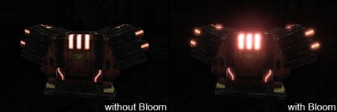</img></br>
このような現象がブルームと呼ばれます。では強い光とは一体どの程度のもののことをいうのでしょうか？私たちはここまでいくつかのライティングの計算を学んできました。ディフューズライト、スペキュラライト、アンビエントライトなど。これらのライトのカラーの値を大きくすることで、強い光を物体にあてることができます。これまでピクセルシェーダーで、ランバート拡散反射などを利用して、物体に光が入射した時の反射光の強さを求めてきました。しかし、どれだけ強い光を当てたとしても、レンダリングターゲットのカラーバッファに書き込まれるカラーの値の範囲は、0～255の256段階しかありませんでした。しかし現実世界での光の明るさの範囲は256段階程度ではありません。明るさはNitという単位で表すことができます。例えば室内の床の明るさは0.08Nit、廊下の壁の明るさは77Nit、蛍光灯の光は6,000Nit、コンクリートの照り返しは10,000Nit、直射日光を反射した車のボディの輝きは300,000Nitです。このように現実世界に存在する光の強さの幅は非常に大きいです。しかし、これまでのプログラムでは、どんなに強い光を当てても、カラーバッファに書き込むことができる光の強さの範囲は0～255までです。これでは表現できる光の強さの範囲が狭すぎるため、ブルームの表現を綺麗に行うことが困難です。そこで、このチャプター以降では、もっと広い光の範囲を扱うことができる、浮動小数点テクスチャをカラーバッファとして利用します。そして、このように、0～255段階という狭い範囲から抜け出して、広い範囲の光を扱うレンダリングのことをHDR( High Dynamic Range )レンダリングと呼びます。

#### 10.4.2.1 浮動小数点テクスチャ
今回実装するブルームでは、カラーバッファに32bitの浮動小数点テクスチャを利用します。これまでは8bit整数テクスチャを利用していました。テクスチャというのは、次のような配列です。
```cpp
struct Color{
	unsigned char r;
	unsigned char g;
	unsigned char b;
	unsigned char a;
};
//これは8ビットの整数テクスチャ。
Color texture[720][1280];
```
このテクスチャはr,g,b,aが8ビット符号なし整数型となっているため、0～255までの値しか扱えません。これが8bit整数テクスチャです。では、32bit浮動小数点テクスチャとはどのようなテクスチャなのでしょうか。次のプログラムを読んでください。</br>
```cpp
struct Color{
	float r;
	float g;
	float b;
	float a;
};
//これは32ビット浮動小数点テクスチャ。
Color texture[720][1280];
```
このテクスチャはr,g,b,aが32ビット浮動小数点型になっているため、8bit整数型とは比べ物にならないくらい、広い範囲の数値を扱えます。浮動小数点が表現できる範囲は言語使用などで異なってきますが、標準規格として普及しているIEEE754であれば、-3.40282×10^38～3.40282×10^38の範囲の数値を扱えます。

### 10.4.3 アルゴリズムの流れ
では、ブルームを行うためのアルゴリズムの流れを見ていきましょう。アルゴリズムの流れとしては次のようになります。
1. シーンをメインレンダリングターゲットにレンダリング
2. シーンの輝度をテクスチャとして抽出
3. 抽出した輝度テクスチャにブラーをかけてぼかす
4. ぼかした輝度テクスチャをメインレンダリングターゲットに加算合成

この流れを絵で示すと、図10.16のようになります。

**図10.16**</br>
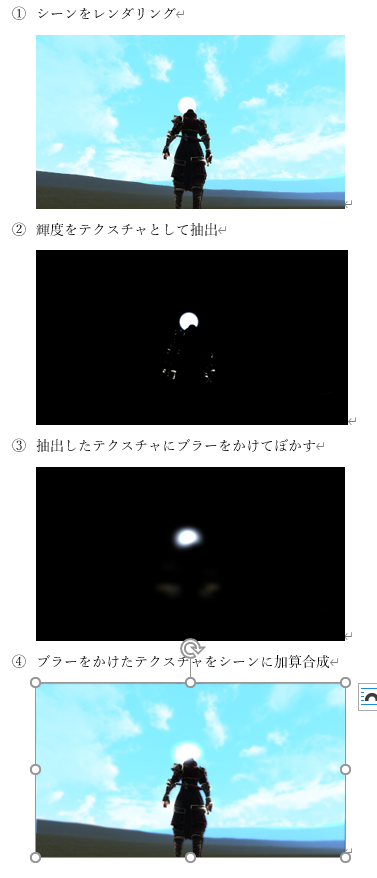</img></br>
では、各ステップを詳細に見ていきましょう。

1. シーンをメインレンダリングターゲットにレンダリング
このステップはこれまでのポストエフェクトと何も変わりません。メインレンダリングターゲットに対してゲームのシーンをレンダリングしていきます。ただし、メインレンダリングターゲットのカラーバッファのテクスチャは32ビット浮動小数点テクスチャです。このステップでは図10.17のようなテクスチャが作成されます。この時点では、光の強さとして強い値が描き込まれているのですが、光があふれる表現などは発生しません。</br>
**図10.17**</br>
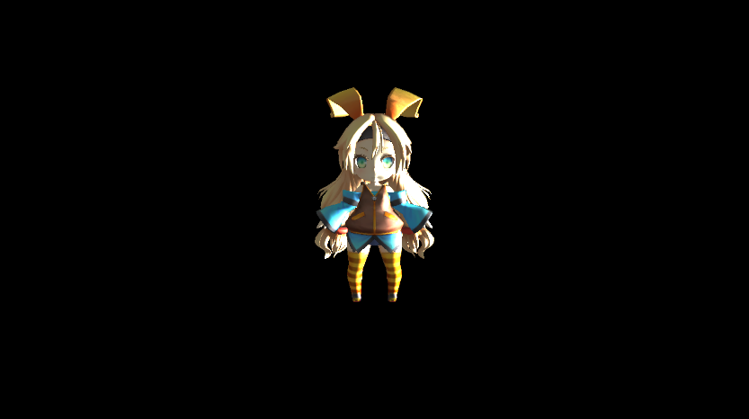</img></br>

2. シーンの輝度をテクスチャとして抽出輝度の抽出
このステップでは、1で作成したシーンテクスチャを利用して、光が強く反射しているピクセルのみを抽出した輝度テクスチャを作成します。このステップでは図10.18のようなテクスチャが作成されます。</br>
**図10.18**</br>
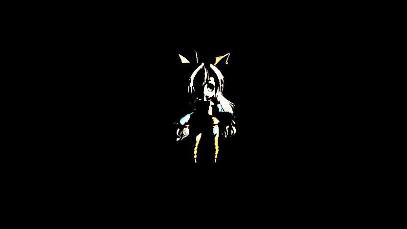</img></br>

3. 抽出した輝度テクスチャにブラーをかけてぼかす
ここでは、2で作成したテクスチャにガウシアンブラーなどを適用して、ボケ画像を作成します。このステップでは図10.19のようなテクスチャが生成されます。輝度テクスチャをぼかすことで、強い光が当たっている箇所が外に広がっている画像が生成されます。</br>
**図10.19**</br>
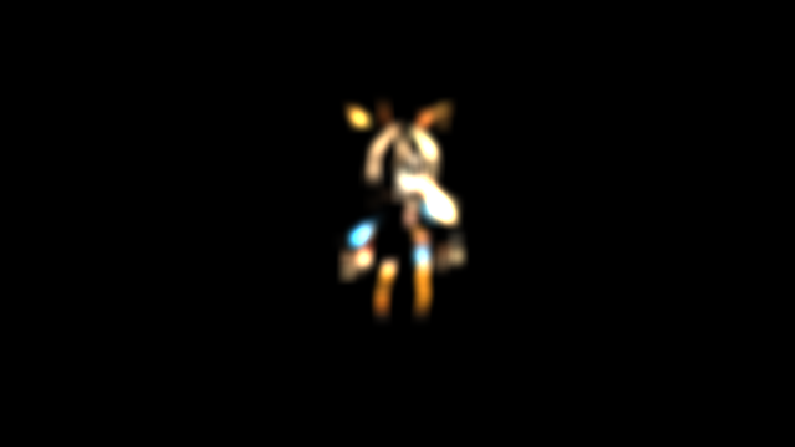</img></br>

4. ぼかした輝度テクスチャをメインレンダリングターゲットに加算合成
いよいよ、最終ステップです。1で作成されたシーンテクスチャと3で作成した画像を加算合成することで、ブルームエフェクトが完成します(図10.20)。</br>
**図10.20**</br>
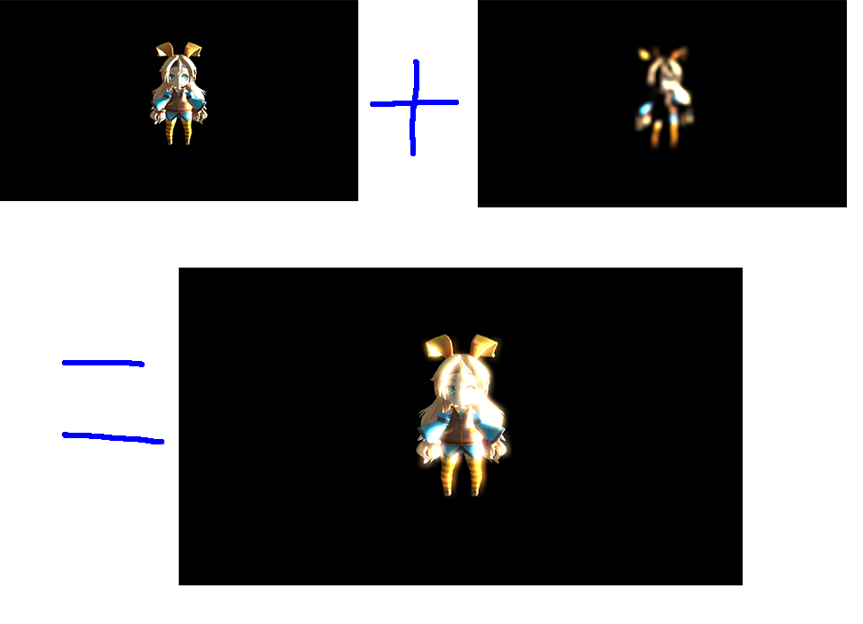</img></br>

### 10.4.4【ハンズオン】ブルームを実装
では、ブルームを実装していきましょう。`Sample_10_05/Sample_10_05.sln`を立ち上げてください。
#### step-1 32ビットの浮動小数点のカラーバッファを保持したメインレンダリングターゲットを作成する。
step-1では、これまで通り、ゲームシーンをレンダリングするレンダリングターゲットを作成するプログラムを実装するのですが、カラーバッファのフォーマットが32bit浮動小数点になっています。これはHDRレンダリングを行うためです。ここに注目して、main.cppの51行目にリスト10.31のプログラムを入力して下さい。</br>
[リスト10.31 main.cpp]
```cpp
//step-1 32ビットの浮動小数点のカラーバッファを保持したメインレンダリングターゲットを作成する。
RenderTarget mainRenderTarget;
mainRenderTarget.Create(
	1280,
	720,
	1,
	1,
	//【注目】カラーバッファのフォーマットを32bit浮動小数点にしている。
	DXGI_FORMAT_R32G32B32A32_FLOAT,
	DXGI_FORMAT_D32_FLOAT
);
```
#### step-2 強い光のライトを用意する。
続いて、3Dモデルにあてるライトを用意します。今回実装するエフェクトは、強い光を反射している箇所から、光が溢れ出てくるエフェクトです。そのため、意図的に強めのライトを設定しています。では、リスト10.32のプログラムを入力してください。</br>
[リスト10.32 main.cpp]
```cpp
//step-2 強い光のライトを用意する。
Light light;
//【注目】光を強めに設定する。
light.directionalLight[0].color.x = 5.8f;
light.directionalLight[0].color.y = 5.8f;
light.directionalLight[0].color.z = 5.8f;

light.directionalLight[0].direction.x = 0.0f;
light.directionalLight[0].direction.y = 0.0f;
light.directionalLight[0].direction.z = -1.0f;
light.directionalLight[0].direction.Normalize();

light.ambinetLight.x = 0.5f;
light.ambinetLight.y = 0.5f;
light.ambinetLight.z = 0.5f;
light.eyePos = g_camera3D->GetPosition();
```

#### step-3 輝度抽出用のレンダリングターゲットを作成。
続いて、輝度抽出用のレンダリングターゲットを作成します。ここでもカラーバッファのフォーマットに32bit浮動小数点を指定しています。では、リスト10.33のプログラムを入力してください。</br>
[リスト10.33 main.cpp]
```cpp
//step-3 輝度抽出用のレンダリングターゲットを作成。
RenderTarget luminnceRenderTarget;
//解像度、ミップマップレベル
luminnceRenderTarget.Create(
	1280,		//解像度はメインレンダリングターゲットと同じ。
	720,		//解像度はメインレンダリングターゲットと同じ。
	1,
	1,
	//【注目】カラーバッファのフォーマットを32bit浮動小数点にしている。
	DXGI_FORMAT_R32G32B32A32_FLOAT,
	DXGI_FORMAT_D32_FLOAT
);
```
#### step-4 輝度抽出用のスプライトを初期化。
続いて、輝度抽出用のスプライトを初期化します。リスト10.34のプログラムを入力してください。</br>
[リスト10.34 main.cpp]
```cpp
//step-4 輝度抽出用のスプライトを初期化。
//初期化情報を作成する。
SpriteInitData luminanceSpriteInitData;
//輝度抽出用のシェーダーのファイルパスを指定する。
luminanceSpriteInitData.m_fxFilePath = "Assets/shader/samplePostEffect.fx";
//頂点シェーダーのエントリーポイントを指定する。
luminanceSpriteInitData.m_vsEntryPointFunc = "VSMain";
//ピクセルシェーダーのエントリーポイントを指定する。
luminanceSpriteInitData.m_psEntryPoinFunc = "PSSamplingLuminance";
//スプライトの幅と高さはluminnceRenderTargetと同じ。
luminanceSpriteInitData.m_width = 1280;
luminanceSpriteInitData.m_height = 720;
//テクスチャはメインレンダリングターゲットのカラーバッファ。
luminanceSpriteInitData.m_textures[0] = &mainRenderTarget.GetRenderTargetTexture();
//描き込むレンダリングターゲットのフォーマットを指定する。
luminanceSpriteInitData.m_colorBufferFormat[0] = DXGI_FORMAT_R32G32B32A32_FLOAT;

//作成した初期化情報をもとにスプライトを初期化する。
Sprite luminanceSprite;
luminanceSprite.Init( luminanceSpriteInitData );
```

#### step-5 ガウシアンブラーを初期化。
輝度テクスチャをぼかすためのガウシアンブラーを初期化します。ガウシアンブラーはブルーム以外の処理でも頻繁に利用する処理なので、再利用しやすいように、著者の方でGaussianBlurクラスを用意しました。GaussianBlur::Init関数にブラーをかけたいテクスチャを渡して、後述するGaussianBlur::ExecuteOnGPU()を呼び出すと、指定したテクスチャにブラーをかけてくれます。リスト10.35のプログラムを入力してください。</br>
[リスト10.35 main.cpp]
```cpp
//step-5 ガウシアンブラーを初期化。
GaussianBlur gaussianBlur;
gaussianBlur.Init(&luminnceRenderTarget.GetRenderTargetTexture());
```
#### step-6 ボケ画像を加算合成するスプライトを初期化。
続いて、ガウシアンブラーで生成したボケ画像を、メインレンダリングターゲットに加算合成するためのスプライトを初期化します。加算合成を行うので、アルファブレンディングに加算モードを指定しています。リスト10.36のプログラムを入力してください。</br>
[リスト10.36 main.cpp]
```cpp
//step-6 ボケ画像を加算合成するスプライトを初期化。
//初期化情報を設定する。
SpriteInitData finalSpriteInitData;
finalSpriteInitData.m_textures[0] = &gaussianBlur.GetBokeTexture();
//解像度はmainRenderTargetの幅と高さ。
finalSpriteInitData.m_width = 1280;
finalSpriteInitData.m_height = 720;
//ぼかした画像を、通常の2Dとしてメインレンダリングターゲットに描画するので、
//2D用のシェーダーを使用する。
finalSpriteInitData.m_fxFilePath = "Assets/shader/sample2D.fx";
//ただし、加算合成で描画するので、アルファブレンディングモードを加算にする。
finalSpriteInitData.m_alphaBlendMode = AlphaBlendMode_Add;
//カラーバッファのフォーマットは例によって、32ビット浮動小数点バッファ。
finalSpriteInitData.m_colorBufferFormat[0] = DXGI_FORMAT_R32G32B32A32_FLOAT;

//初期化情報を元に加算合成用のスプライトを初期化する。
Sprite finalSprite;
finalSprite.Init(finalSpriteInitData);
```

#### step-7 mainRenderTargetのテクスチャをフレームバッファに貼り付けるためのスプライトを初期化する。
初期化ステップの最後に、メインレンダリングターゲットに描画された絵をフレームバッファにコピーするためのスプライトを初期化します。リスト10.37のプログラムを入力してください。</br>
[リスト10.37 main.cpp]
```cpp
//step-7 mainRenderTargetのテクスチャをフレームバッファに貼り付けるためのスプライトを初期化する。
//スプライトの初期化オブジェクトを作成する。
SpriteInitData spriteInitData;
//テクスチャはmainRenderTargetのカラーバッファ。
spriteInitData.m_textures[0] = &mainRenderTarget.GetRenderTargetTexture();
spriteInitData.m_width = 1280;
spriteInitData.m_height = 720;
//モノクロ用のシェーダーを指定する。
spriteInitData.m_fxFilePath = "Assets/shader/sample2D.fx";
//初期化オブジェクトを使って、スプライトを初期化する。
Sprite copyToFrameBufferSprite;
copyToFrameBufferSprite.Init(spriteInitData);
```
#### step-8 レンダリングターゲットをmainRenderTargetに変更する。
step-8からはゲームループの処理です。まずは、いつも通りレンダリングターゲットをメインレンダリングターゲットに変更します。リスト10.38のプログラムを入力してください。</br>
[リスト10.38 main.cpp]
```cpp
//step-8 レンダリングターゲットをmainRenderTargetに変更する。
//レンダリングターゲットとして利用できるまで待つ。
renderContext.WaitUntilToPossibleSetRenderTarget(mainRenderTarget);
//レンダリングターゲットを設定。
renderContext.SetRenderTargetAndViewport(mainRenderTarget);
//レンダリングターゲットをクリア。
renderContext.ClearRenderTargetView(mainRenderTarget);
```
#### step-9 mainRenderTargetに各種モデルを描画する。
step-9もいつも通りの処理です。メインレンダリングターゲットに対して、各種モデルを描画します。リスト10.39のプログラムを入力してください。</br>
[リスト10.39 main.cpp]
```cpp
//step-9 mainRenderTargetに各種モデルを描画する。
plModel.Draw(renderContext);
//レンダリングターゲットへの書き込み終了待ち。
renderContext.WaitUntilFinishDrawingToRenderTarget(mainRenderTarget);
```
#### step-10 輝度抽出
続いて輝度抽出です。レンダリングターゲットを輝度抽出用に変更します。変更できたら、輝度抽出用のスプライトを描画します。リスト10.39のプログラムを入力してください。</br>
[リスト10.39 main.cpp]
```cpp
//step-10 輝度抽出
//輝度抽出用のレンダリングターゲットに変更。
renderContext.WaitUntilToPossibleSetRenderTarget(luminnceRenderTarget);
//レンダリングターゲットを設定。
renderContext.SetRenderTargetAndViewport(luminnceRenderTarget);
//レンダリングターゲットをクリア。
renderContext.ClearRenderTargetView(luminnceRenderTarget);
//輝度抽出を行う。
luminanceSprite.Draw(renderContext);
//レンダリングターゲットへの書き込み終了待ち。
renderContext.WaitUntilFinishDrawingToRenderTarget(luminnceRenderTarget);
```

#### step-11 ガウシアンブラーを実行する。
輝度テクスチャを作成することができたら、そのテクスチャにガウシアンブラーを実行します。前述したように、今回は著者の方で用意した、GaussianBlurクラスを利用します。GaussianBlur::ExecuteOnGPU関数の第二引数は画像のボケ具合です。値を大きくすると、画像が強くボケるようになります。今回のサンプルでは20を指定しています。では、リスト10.40のプログラムを入力してください。</br>
[リスト10.40 main.cpp]
```cpp
//step-11 ガウシアンブラーを実行する。
gaussianBlur.ExecuteOnGPU(renderContext, 20);
```

#### step-12 ボケ画像をメインレンダリングターゲットに加算合成。
続いて、レンダリングターゲットをメインレンダリングターゲットに切り替えて、ボケ画像を加算合成します。リスト10.41のプログラムを入力してください。</br>
[リスト10.41 main.cpp]
```cpp
//step-12 ボケ画像をメインレンダリングターゲットに加算合成。
//レンダリングターゲットとして利用できるまで待つ。
renderContext.WaitUntilToPossibleSetRenderTarget(mainRenderTarget);
//レンダリングターゲットを設定。
renderContext.SetRenderTargetAndViewport(mainRenderTarget);
//最終合成。
finalSprite.Draw(renderContext);
//レンダリングターゲットへの書き込み終了待ち。
renderContext.WaitUntilFinishDrawingToRenderTarget(mainRenderTarget);
```

#### step-13 メインレンダリングターゲットの絵をフレームバッファにコピー。
step-13でcpp側のプログラムを終了です。step-12のプログラムでブルームエフェクトは完成しているので、あとは、完成した絵をフレームバッファにコピーするだけです。リスト10.42のプログラムを入力してください。</br>
[リスト10.42 main.cpp]
```cpp
//step-13 メインレンダリングターゲットの絵をフレームバッファにコピー。
renderContext.SetRenderTarget(
	g_graphicsEngine->GetCurrentFrameBuffuerRTV(),
	g_graphicsEngine->GetCurrentFrameBuffuerDSV()
);
copyToFrameBufferSprite.Draw(renderContext);	
```
#### step-14 輝度を抽出するピクセルシェーダーを実装。
今回の実装で、シェーダー側の実装は輝度抽出のピクセルシェーダーだけです。今回は内積を利用して、サンプリングしてきたテクスチャカラーの明るさを計算しています。clip()は引数の値がマイナスになると、ピクセルシェーダーの処理が打ち切られます。今回の実装では、明るさtが1.0以下の場合、処理が打ち切られるため、ピクセルカラーが描き込まれません。ですので、明るさが1.0以上になっているテクセルのみ、カラーバッファに描き込まれます。リスト10.43のプログラムを入力してください。入力出来たら実行してみてください。図10.21のようなプログラムが実行できたら完成しています。</br>
[リスト10.43 `samplePostEffect.fx`]
```cpp
//step-14 輝度を抽出するピクセルシェーダーを実装。
//メインレンダリングターゲットからカラーをサンプリング。
float4 color = mainRenderTargetTexture.Sample(Sampler, In.uv);
//サンプリングしたカラーの明るさを計算。
float t = dot( color.xyz, float3(0.2125f, 0.7154f, 0.0721f) );
//clip関数は引数の値がマイナスになると、以降の処理をスキップする。
//なので、マイナスになるとピクセルカラーは出力されない。
//今回の実装はカラーの明るさが１以下ならピクセルキルする。
clip(t - 1.0f);
return color;
```
**図10.21**</br>
</img></br>


#### 更に強い光をあてるとどうなる？
さて、先ほど実装したブルームのプログラムで、キャラに更に強い光をあてるとどうなるでしょうか？先ほどのサンプルはコントローラーの左スティックの入力(キーボードならA,D)の入力でライトの強さを変更することができます。ライトの強さを大きくしてみて下さい。すると、綺麗に光が広がらず、図10.22のようになってしまっていると思います。</br>
**図10.22**</br>
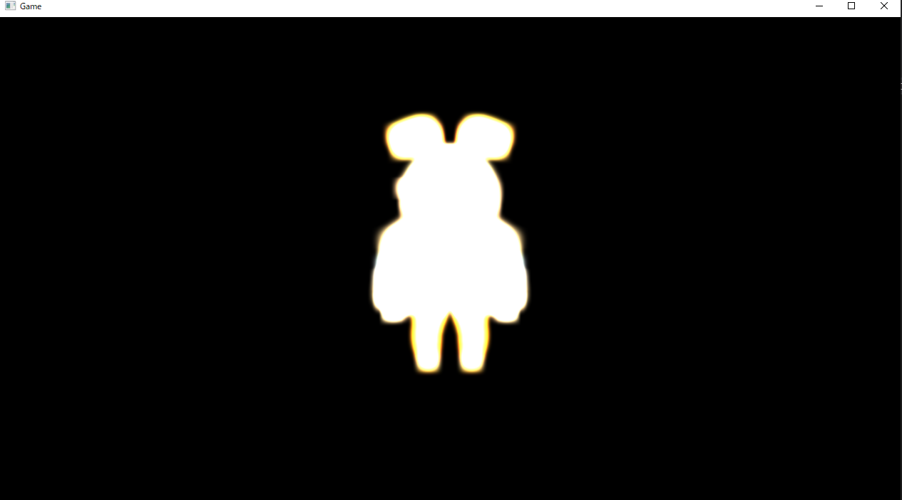</img></br>
では、次の節ではこのブルームの処理を改良した川瀬式ブルームフィルタを見ていきます。川瀬式ブルームフィルタを実装すると、同じように強い光を当てた時に、図10.23のように綺麗に光が広がっていくようになります。</br>

**図10.23**</br>
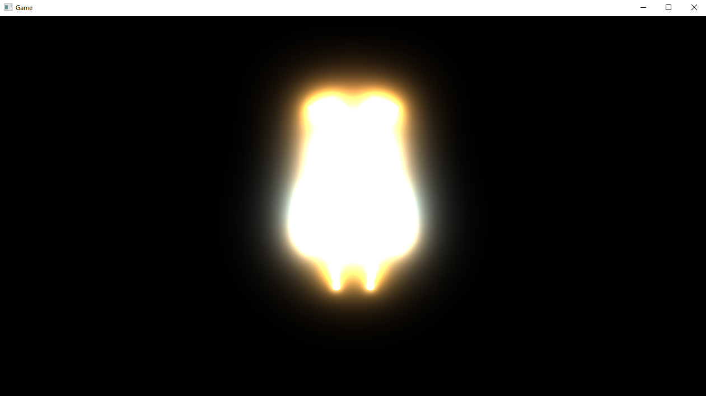</img></br>

## 10.5 川瀬式ブルーム
この節では、ブルームをさらに綺麗に見せるために、当時ぶんか社に所属していた川瀬正樹氏が2003年のGDC(Game Developers Conference)で発表した川瀬式ブルームフィルタを紹介します。</br>
このアルゴリズムは高速で品質の高いブルームを表現でき、かつ非常にシンプルなアルゴリズムとなっています。川瀬式のブルームフィルタのアルゴリズムは、10.4で学んだ単一のガウシアンフィルターのアルゴリズムを少し改良するだけの実装です。ですが、その効果は絶大です。10.4で学んだブルームのアルゴリズムとの違いは、輝度テクスチャをぼかす処理が一回ではなく、複数ガウシアンブラーをかけていき、それらのテクスチャを合成します。例えば、輝度テクスチャの解像度が1024×1024の場合、512×512、256×256、128×128、64×64、32×32というように複数のダウンサンプリング用のレンダリングターゲットを用意して、ガウスフィルターをかけて縮小していきます。そして、それらを同解像度に拡大合成して、あふれテクスチャを生成する手法です。図10.24はアルゴリズムの流れを示しています。</br>
**図10.24**</br>
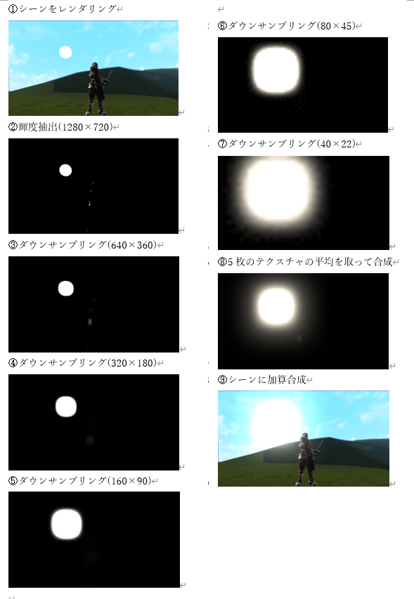</img></br>

### 10.5.1 【ハンズオン】川瀬式ブルームを実装
では、さっそく川瀬式ブルームを実装していきましょう。`Sample_10_06/Sample_10_06.sln`を立ち上げてください。川瀬式のブルームフィルタは輝度抽出までの処理は、10.4のブルームを同じです。今回のハンズオンでは、10.4のブルームと違う点だけを見ていきます。

#### step-1 ガウシアンブラーを初期化。
今回のサンプルでは、ガウシアンブラーを４回実行してみます。GaussianBlurクラスのオブジェクトが要素数４の配列で定義されています。また、各オブジェクトが呼び出しているInit関数の引数に注目してください。gaussianBlur[0]は輝度テクスチャにブラーをかけたテクスチャを生成します。gaussianBlur[1]はgaussianBlur[0]のテクスチャにブラーをかけたテクスチャを生成します。これにより、４枚のボケ画像が出来上がります。では、main.cppの134行目にリスト10.44のプログラムを入力してください。</br>
[リスト10.44 main.cpp]
```cpp
//step-1 ガウシアンブラーを初期化。
GaussianBlur gaussianBlur[4];
//gaussianBlur[0]は輝度テクスチャにガウシアンブラーをかける。
gaussianBlur[0].Init(&luminnceRenderTarget.GetRenderTargetTexture());
//gaussianBlur[1]はgaussianBlur[0]のテクスチャにガウシアンブラーをかける。
gaussianBlur[1].Init(&gaussianBlur[0].GetBokeTexture());
//gaussianBlur[2]はgaussianBlur[1]のテクスチャにガウシアンブラーをかける。
gaussianBlur[2].Init(&gaussianBlur[1].GetBokeTexture());
//gaussianBlur[3]はgaussianBlur[2]のテクスチャにガウシアンブラーをかける。
gaussianBlur[3].Init(&gaussianBlur[2].GetBokeTexture());
```

#### step-2 ボケ画像を合成して書き込むためのスプライトを初期化。
続いて、ボケ画像を合成してスプライトを初期化します。4枚のボケ画像を使用するため、スプライトの初期化オブジェクトのm_textureメンバに４枚のテクスチャを指定しています。こうすると、Sprite::Init()の中で、４枚のテクスチャがディスクリプタヒープに登録されます。シェーダーもこの後で実装する専用シェーダーを指定していることに注目してください。では、main.cppにリスト10.45のプログラムを入力してください。</br>
[リスト10.45 main.cpp]
```cpp
//step-2 ボケ画像を合成して書き込むためのスプライトを初期化。
//初期化情報を設定する。
SpriteInitData finalSpriteInitData;
//【注目】ボケテクスチャを4枚指定する。
finalSpriteInitData.m_textures[0] = &gaussianBlur[0].GetBokeTexture();
finalSpriteInitData.m_textures[1] = &gaussianBlur[1].GetBokeTexture();
finalSpriteInitData.m_textures[2] = &gaussianBlur[2].GetBokeTexture();
finalSpriteInitData.m_textures[3] = &gaussianBlur[3].GetBokeTexture();
//解像度はmainRenderTargetの幅と高さ。
finalSpriteInitData.m_width = 1280;
finalSpriteInitData.m_height = 720;
//【注目】ボケ画像を合成する必要があるので、2D用のシェーダーではなく、専用シェーダーを指定。
finalSpriteInitData.m_fxFilePath = "Assets/shader/samplePostEffect.fx";
finalSpriteInitData.m_psEntryPoinFunc = "PSBloomFinal";

//ただし、加算合成で描画するので、アルファブレンディングモードを加算にする。
finalSpriteInitData.m_alphaBlendMode = AlphaBlendMode_Add;
//カラーバッファのフォーマットは例によって、32ビット浮動小数点バッファ。
finalSpriteInitData.m_colorBufferFormat[0] = DXGI_FORMAT_R32G32B32A32_FLOAT;

//初期化情報を元に加算合成用のスプライトを初期化する。
Sprite finalSprite;
finalSprite.Init(finalSpriteInitData);
```

#### step-3 ガウシアンブラーを4回実行する。
step-3からはゲームループ内の処理です。輝度テクスチャ抽出処理の後ろに、ガウシアンブラーを４回実行するコードを追加しましょう。main.cppにリスト10.46のプログラムを入力してください。</br>
[リスト10.46 main.cpp]
```cpp
//step-3 ガウシアンブラーを4回実行する。
gaussianBlur[0].ExecuteOnGPU(renderContext, 10);
gaussianBlur[1].ExecuteOnGPU(renderContext, 10);
gaussianBlur[2].ExecuteOnGPU(renderContext, 10);
gaussianBlur[3].ExecuteOnGPU(renderContext, 10);
```

#### step-4 4枚のボケ画像を合成してメインレンダリングターゲットに加算合成。
step-4でcpp側の最後の実装です。４枚のボケ画像の生成処理のあとで、ボケ画像を合成する処理を追加しましょう。リスト10.47のプログラムを入力してください。</br>
[リスト10.47 main.cpp]
```cpp
//step-4 4枚のボケ画像を合成してメインレンダリングターゲットに加算合成。
//レンダリングターゲットとして利用できるまで待つ。
renderContext.WaitUntilToPossibleSetRenderTarget(mainRenderTarget);
//レンダリングターゲットを設定。
renderContext.SetRenderTargetAndViewport(mainRenderTarget);
//最終合成。
finalSprite.Draw(renderContext);
//レンダリングターゲットへの書き込み終了待ち。
renderContext.WaitUntilFinishDrawingToRenderTarget(mainRenderTarget);
```

#### step-5 4枚のボケ画像にアクセスするための変数を追加。
ここからはシェーダー側です。ボケ画像を合成するためのシェーダーを実装して行きましょう。まずは、４枚のボケ画像にアクセスするための変数を追加します。`Assets/shader/samplePostEffect.fx`の51行目にリスト10.48のプログラムを入力してください。</br>
[リスト10.48 samplePostEffect.fx]
```cpp
//step-5 4枚のボケ画像にアクセスするための変数を追加。
Texture2D<float4> g_bokeTexture_0 : register(t0);
Texture2D<float4> g_bokeTexture_1 : register(t1);
Texture2D<float4> g_bokeTexture_2 : register(t2);
Texture2D<float4> g_bokeTexture_3 : register(t3);
```

#### step-6 ボケ画像をサンプリングして、平均をとって出力する。
これで最後の実装です。ボケ画像を合成して出力するピクセルシェーダーを実装しましょう。リスト10.49のプログラムを入力してください。入力出来たら実行してください。図10.25のようなプログラムが実行されたら完成です。コントローラの左スティック(キーボードならA,D)の入力でライトの強さを変えることができるので、10.4のブルームとの光の広がり方の違いを確認してみてください。</br>
[リスト10.49 samplePostEffect.fx]
```cpp
//step-6 ボケ画像をサンプリングして、平均をとって出力する。
float4 combineColor = g_bokeTexture_0.Sample(Sampler, In.uv);
combineColor += g_bokeTexture_1.Sample(Sampler, In.uv);
combineColor += g_bokeTexture_2.Sample(Sampler, In.uv);
combineColor += g_bokeTexture_3.Sample(Sampler, In.uv);
combineColor /= 4.0f;
combineColor.a = 1.0f;
return combineColor;
```
**図10.25**</br>
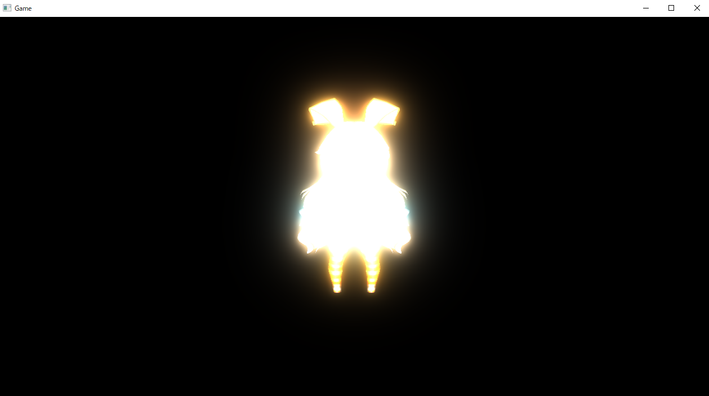</img></br>

## 10.5 被写界深度
被写界深度(以下DoF)とはカメラのピントが合っているように見える範囲のことを指すのですが、リアルタムＣＧでDoFというと、図10.26のようなカメラのピンボケ現象全般を指します。このピンボケ現象もリアルタイムCGでは、ポストエフェクトで実現されています。</br>

**図10.26**
</img></br>

### 10.5.1 アルゴリズム概要
 カメラのピンボケ現象は、図10.27のようにカメラ空間での深度値(Z値)によってボケ具合が変わっていきます。
**図10.27**
</img></br>

これでピンと来た人もいるかと思いますが、DoFの実装にはカメラから見たピクセルのZ値を活用します。Z値が被写界深度内の範囲外にあるピクセルにぼかしをかけていって、シーンに合成します。そのため、カメラから見たZ値をテクスチャ化する必要があります。
次が最もシンプルなDoFのアルゴリズムとなります。
1. シーンをメインレンダリングターゲットに描画。
2. １で描画したシーンのカメラ空間でのZ値を、深度値記録用のレンダリングターゲットに描画。
3. メインレンダリングターゲットのシーンテクスチャにブラーをかけて、ボケ画像を作成する。
4. 3で作成したボケ画像と2で作成したシーンの深度テクスチャを利用して、ボケ画像をメインレンダリングターゲットに合成する(図10.31)。
では、アルゴリズムの詳細を見ていきましょう。

#### 1. シーンをメインレンダリングターゲットに描画。
まずは普通のシーンの描画です。ここで特別なことは行いません。メインレンダリングターゲットにオブジェクトを描画していきます(図10.28)。
**図10.28**
</img></br>

#### 2. １で描画したシーンのカメラ空間でのZ値を、深度値描き込み用のレンダリングターゲットに描画。</br>
続いて、シーンのカメラ空間でのZ値を、メインレンダリングターゲットとは別に作成したレンダリングターゲットに描画していきます(図10.29)。
**図10.29**
</img></br>

#### 3. メインレンダリングターゲットのシーンテクスチャにブラーをかけて、ボケ画像を作成する。</br>
続いて、シーンテクスチャのボケ画像を作成します。この画像を作るには、ガウシアンブラーなどのフィルターを使います(図10.30)。
**図10.30**
</img></br>

4. 3で作成したボケ画像と2で作成したシーンの深度テクスチャを利用して、ボケ画像をメインレンダリングターゲットに合成する(図10.31)。</br>
これで最後です。３で作成したボケ画像と、２で作成した深度テクスチャを使って、メインレンダリングターゲットにボケ画像を合成していきます。この処理では、ボケ画像からサンプリングしたテクセルをメインレンダリングターゲットに描き込む際に、深度テクスチャを参照して、そのテクセルのカメラから見たときのZ値を調べます。その値が被写界深度外であればボケたテクセルをメインレンダリングターゲットに描き込みます。逆に被写界深度内であれば、clip()などを利用して、ピクセルキルを行って、ボケたテクセルを描き込みません。すると、被写界深度外の箇所だけボケ画像になる最終画像が作成されます(図10.31)。
**図10.31**
</img></br>


### 10.5.2 Multi Renderging Target(MRT)
DoFを実装するためには、カメラから見た深度値が必要になってきます。アルゴリズム概要では、シーンをレンダリングした後で、カメラから見た深度値をレンダリングしていました。つまり、同じカメラから見たシーンを２回レンダリングしていることになります。次のコードはこの処理の疑似コードです。
```cpp
//レンダリングターゲットをメインレンダリングターゲットに変更する。
ChangeRenderTarget( mainRenderTarget );
//通常描画用のシェーダーを設定してモデルを描画。
SetNormalRenderShader();
//すべてのモデルを描画。
for( auto& model : modelList ){
　　model.Draw();
}
//レンダリングターゲットを深度値書き込み用のレンダリングターゲットに変更。
ChangeRenderTarget( depthInViewRenderTarget );
//深度値書き込み用のシェーダーを設定してモデルを描画
SetDepthInViewRenderShader();
//もう一度すべてのモデルを描画！！！
for( auto& model : modelList ){
　　model.Draw();
}
```
深度値を書き込むためだけに、シーンを2度レンダリングしているということは、3Dモデルを描画するための座標変換(頂点シェーダー)が2回実行されていることになります。ですが、同じカメラから見ているシーンを描画するわけなので、この頂点シェーダーの計算結果は結果は１回目と２回目とで全く同じ結果になります。DirectXにはこのような無駄な計算をなくすために、Multi Rendering Target(MRT)という機能ア用意されています。MRTを活用すると、一度の描画で複数のレンダリングターゲットに描き込むことができます。このあと実装する被写界深度は、このMRTを活用したものとなります。

### 10.5.3【ハンズオン】被写界深度を実装する。
では、Sample_10_07を改造して被写界深度を実装していきましょう。Sample_10_07/Sample_10_07.slnを立ち上げてください。
#### step-1 メインレンダリングターゲットと深度レンダリングターゲットを作成。
まずは、シーンのカラーを描きこむためのメインレンダリングターゲットと、シーンのカメラ空間でのZ値を描きこむためのレンダリングターゲットを作成します。main.cppの42行目にリスト10.50のプログラムを入力してください。</br>
[リスト10.50 main.cpp]
```cpp
//step-1 メインレンダリングターゲットと深度レンダリングターゲットを作成。
//シーンのカラーを描きこむメインレンダリングターゲットを作成。
RenderTarget mainRenderTarget;
mainRenderTarget.Create(
	1280,
	720,
	1,
	1,
	DXGI_FORMAT_R32G32B32A32_FLOAT,
	DXGI_FORMAT_D32_FLOAT
);
//シーンのカメラ空間でのZ値を書きこむレンダリングターゲットを作成。
RenderTarget depthRenderTarget;
depthRenderTarget.Create(
	1280,
	720,
	1,
	1,
	DXGI_FORMAT_R32_FLOAT,
	DXGI_FORMAT_UNKNOWN
);
```

#### step-2 シーンテクスチャをぼかすためのガウシアンブラーオブジェクトを初期化。
続いて、メインレンダリングターゲットに書き込まれた、シーンテクスチャをぼかすためのガウシアンブラーオブジェクトを初期化します。main.cppにリスト10.51のプログラムを入力してください。</br>
[リスト10.51 main.cpp]
```cpp
// step-2 シーンテクスチャをぼかすためのガウシアンブラーオブジェクトを初期化。
GaussianBlur blur;
blur.Init(&mainRenderTarget.GetRenderTargetTexture());
```

#### step-3 ボケ画像合成用のスプライトを初期化する。
被写界深度のアルゴリズムの最終ステップでは、step-2で作成されたボケ画像と、カメラ空間での深度テクスチャを利用して、ボケ画像をシーンに合成していきます。では、画像合成用のスプライトを初期化しましょう。リスト10.52のプログラムを入力して下さい。</br>
[リスト10.52 main.cpp]
```cpp
 // step-3 ボケ画像合成用のスプライトを初期化する。
SpriteInitData combineBokeImageSpriteInitData;
//使用するテクスチャは２枚。
combineBokeImageSpriteInitData.m_textures[0] = &blur.GetBokeTexture();
combineBokeImageSpriteInitData.m_textures[1] = &depthRenderTarget.GetRenderTargetTexture();
combineBokeImageSpriteInitData.m_width = 1280;
combineBokeImageSpriteInitData.m_height = 720;
//合成用のシェーダーを指定する。
combineBokeImageSpriteInitData.m_fxFilePath = "Assets/shader/samplePostEffect.fx";
combineBokeImageSpriteInitData.m_colorBufferFormat = DXGI_FORMAT_R32G32B32A32_FLOAT;
// 距離を利用してボケ画像をアルファブレンディングするので、半透明合成モードにする。
combineBokeImageSpriteInitData.m_alphaBlendMode = AlphaBlendMode_Trans;
// 初期化オブジェクトを利用してスプライトを初期化する。
Sprite combineBokeImageSprite;
combineBokeImageSprite.Init(combineBokeImageSpriteInitData);
```

#### step-4 ２枚のレンダリングターゲットを設定して、モデルを描画する。
ここからはゲームループの処理です。まずはシーンの絵とカメラ空間でのZ値を書きこんでいきます。今回はMRTを利用するので、複数枚のレンダリングターゲットを設定する必要があります。そのため、複数枚のレンダリングターゲットに対する操作ができる関数を利用して、レンダリングターゲットを設定していっています。そこに注目して、リスト10.53のプログラムを入力してください。</br>
[リスト10.53 main.cpp]
```cpp
 //step-4 ２枚のレンダリングターゲットを設定して、モデルを描画する。
//２枚のレンダリングターゲットのポインタを持つ配列を定義する。
RenderTarget* rts[] = {
	&mainRenderTarget,
	&depthRenderTarget
};
//レンダリングターゲットとして利用できるまで待つ
renderContext.WaitUntilToPossibleSetRenderTargets(2, rts);
//レンダリングターゲットを設定。
renderContext.SetRenderTargetsAndViewport(2, rts);
// レンダリングターゲットをクリア
renderContext.ClearRenderTargetViews(2, rts);
//モデルをドロー。
model.Draw(renderContext);
// レンダリングターゲットへの書き込み終了待ち
renderContext.WaitUntilFinishDrawingToRenderTargets(2, rts);
```

#### step-5 メインレンダリングターゲットのボケ画像を作成。
続いて、ボケ画像を作る処理を実装します。この処理はGaussianBlur::Execute()を実行するだけでです。では、リスト10.54のプログラムを入力してください。</br>
[リスト10.54 main.cpp]
```cpp
//step-5 メインレンダリングターゲットのボケ画像を作成。
blur.ExecuteOnGPU(renderContext, 5);
```

#### step-6 ボケ画像と深度テクスチャを利用して、ボケ画像を描きこんでいく。
では、cpp側はこれで最後です。ボケ画像と深度テクスチャを作成することができたので、この２枚のテクスチャを利用して、メインレンダリングターゲットにボケ画像を合成してきましょう。リスト10.55のプログラムを入力してください。</br>
[リスト10.55 main.cpp]
```cpp
// step-6 ボケ画像と深度テクスチャを利用して、ボケ画像を描きこんでいく。
// メインレンダリングターゲットを設定。
renderContext.WaitUntilToPossibleSetRenderTarget(mainRenderTarget);
renderContext.SetRenderTargetAndViewport(mainRenderTarget);
// スプライトを描画。
combineBokeImageSprite.Draw(renderContext);
// レンダリングターゲットへの書き込み終了待ち
renderContext.WaitUntilFinishDrawingToRenderTarget(mainRenderTarget);
```

#### step-7 カメラ空間でのZ値を記録する変数をピクセルシェーダへの入力に追加。
step-7からはシェーダー側です。まずは、３Dモデル描画の際に使用されているシェーダーを改造します。このシェーダーでは、二つのレンダリングターゲットに対して、シーンのカラーとカメラ空間でのZ値を出力する必要があります。では、まずは頂点シェーダーで計算したカメラ空間でのZ値をピクセルシェーダーに渡すために、ピクセルシェーダーの入力構造体に変数を追加しましょう。Assets/shader/sample3D.fxの39行目にリスト10.56のプログラムを入力してください。</br>
[リスト10.56 sample3D.fx]
```cpp
//step-7 カメラ空間でのZ値を記録する変数を追加。
float3 depthInView : TEXCOORD2; // カメラ空間でのZ値。
```

#### step-8 ピクセルシェーダーからの出力構造体を定義する。
続いて、ピクセルシェーダーからの出力構造体を定義します。このシェーダーではカラーとカメラ空間での深度値という二つの値を出力する必要があるため、その二つをまとめた構造体を利用します。では、リスト10.57のプログラムを入力してください。</br>
[リスト10.57 sample3D.fx]
```cpp
//step-8 ピクセルシェーダーからの出力構造体を定義する。
struct SPSOut{
    float4 color : SV_Target0;  //レンダリングターゲット0に描きこむ。
    float depth : SV_Target1;   //レンダリングターゲット1に描きこむ。
};
```

#### step-9 頂点シェーダーでカメラ空間でのZ値を設定する。
続いて、頂点シェーダーを改造します。ピクセルシェーダーにカメラ空間でのZ値を引き渡すための処理を実装します。リスト10.58のプログラムを頂点シェーダーに追加してください。</br>

[リスト10.58 sample3D.fx]
```cpp
//step-9 頂点シェーダーでカメラ空間でのZ値を設定する。
psIn.depthInView = psIn.pos.z;
```

#### step-10 ピクセルシェーダーからカラーとZ値を出力する。
step-10でsample3D.fxの実装は最後です。最後はピクセルシェーダーからシーンのカラーとカメラ空間でのZ	値を出力する処理を実装します。今回のサンプルでは、物理ベースライティングの結果を返してくれるCalcPBR()を著者の方で用意していますので、カラーの計算ではそちらを利用しています。では、ピクセルシェーダーにリスト10.59のプログラムを入力してください。</br>
[リスト10.59 sample3D.fx]
```cpp
//step-10 ピクセルシェーダーからカラーとZ値を出力する。
SPSOut psOut;
//カラーを計算。
psOut.color = CalcPBR(psIn);
//カメラ空間での深度値を設定。
psOut.depth = psIn.depthInView;
return psOut;
```

#### step-11 ボケ画像と深度テクスチャにアクセスするための変数を追加。
step-11からはボケ画像を合成していくシェーダーを改造していきます。Assets/shader/samplePostEffect.fxを開いて下さい。まずは、ボケ画像とカメラ空間での深度テクスチャにアクセスするための変数を追加します。samplePostEffect.fxの5行目にリスト10.60のプログラムを入力してください。</br>
[リスト10.60 samplePostEffect.fx]
```cpp
//step-11 ボケ画像と深度テクスチャにアクセスするための変数を追加。
Texture2D<float4> bokeTexture : register(t0);  // ボケ画像
Texture2D<float4> depthTexture : register(t1); // 深度テクスチャ
```

#### step-12 ボケ画像描き込み用のピクセルシェーダーを実装。
では、いよいよ最後です。深度テクスチャとボケテクスチャを利用して、ボケ画像をメインレンダリングターゲットに描きこんでいくシェーダーを実装しましょう。今回は、カメラ空間での深度値が200以上なら、徐々にボケていくように実装しています。では、リスト10.61のプログラムを入力してください。</br>
[リスト10.61 main.cpp]
```cpp
// step-12 ボケ画像描き込み用のピクセルシェーダーを実装。
// カメラ空間での深度値をサンプリング。
float depth = depthTexture.Sample( Sampler, In.uv );
// カメラ空間での深度値が200以下ならピクセルキル 
//      -> ボケ画像を描きこまない。
clip( depth - 200.0f);
// ボケ画像をサンプリング。
float4 boke = bokeTexture.Sample( Sampler, In.uv );
// 深度値から不透明度を計算する。
// 深度値200からボケが始まり、深度値500で最大のボケ具合になる。
//  -> つまり、深度値500で不透明度が1になる。
boke.a = min( 1.0f, ( depth - 200.0f ) / 500.0f );
// ボケ画像を出力。
return boke;
```
入力出来たら実行してみてください。うまく実装できていると図10.32のように、画面の奥の方の画像がボケて表示されているはずです。</br>
**図10.32**
</img></br>

## 10.6 被写界深度(カメラの絞り考)
10.6では更に品質の高いピンボケ現象を勉強していきましょう。実は、ピンボケのボケ方はカメラのレンズの絞りの形状に依存します。絞りの形状が球であれば球形のボケが、六角形であれば六角形のボケが発生します(図10.33,図10.34)。</br>
**図10.33**</br>
</img></br>

**図10.34**</br>
</img></br>

この章では、六角形のボケが発生する被写界深度の実装について見ていきます。

### 10.6.1 六角形ブラー
六角形のボケが発生する被写界深度の、今回の実装方法ですが、10.5で勉強した実装と違う点は、画像をぼかす処理だけです。それ以外の処理は全く同じになります。六角形のボケを発生させる方法はピクセルを六角形の形状にブラーをかけていくことで実現できます。六角形ブラーをかけるためには、まず２枚のボケ画像を作ります。一つ目は垂直方向にぼかした画像(図10.35)、二つ目は垂直方向と対角線方向の２方向にぼかした画像(10.36)です。</br>
**図10.35**</br>
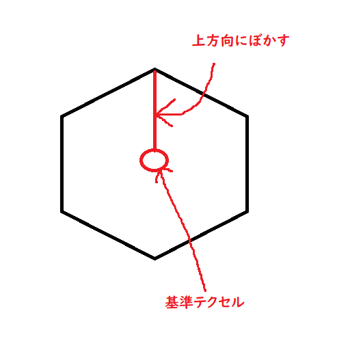</img></br>

**図10.36**</br>
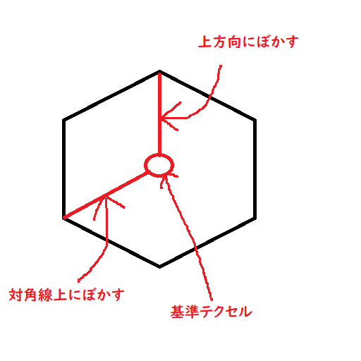</img></br>
そしてこの２枚の画像を元に６角形の領域を埋めるようにブラーをかけていき、それを合成すると六角形ブラーの完成です(図10.37)。</br>

**図10.37**
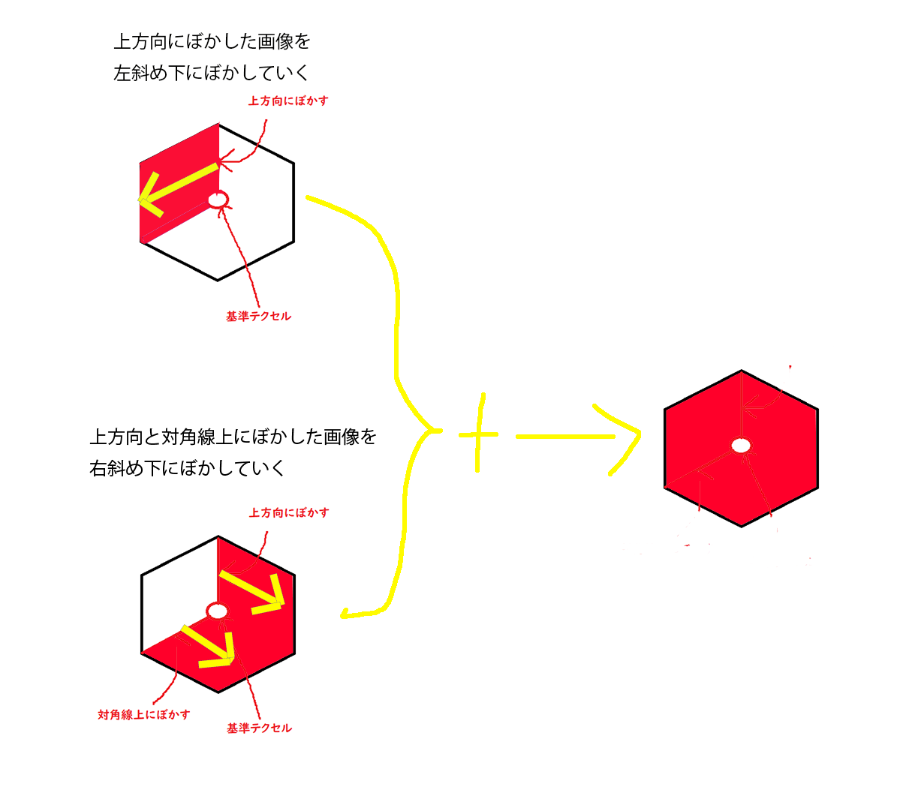</img></br>

### 10.6.2 高輝度部分から六角形のボケが発生する
さて、ここまでの説明で、なぜこのブラーで六角形のボケが発生するのか疑問に思われた方はいないでしょうか？実は著者は最初この方法を知ったときに、なぜこれで六角形のボケが発生するのかがピンと来ませんでした。正確には、図10.34のように、特定の箇所でだけ六角形ボケが発生する理由が分かりませんでした。このブラーは全てのピクセルに対して実行されます。であれば、全体にブラーがかかるだけなので、画像が全体的にボケるだけなのでは？と考えたからです。実はこの考え方はピクセルの明るさが全て近い場合は正しく、その場合は、六角形ボケは発生せずに全体的にボケた画像が生成されるだけです。では、六角形のボケはどこから発生するのか？答えは高輝度、非常に明るいピクセルから発生します。高輝度なピクセルはRGBで格納されている数値が大きくなります。そうするとどうなるかというと、高輝度ピクセルの周囲のピクセルはブラーをかけられた結果、高輝度ピクセルの影響を強く受けるようになります。これによって、非常に明るいピクセルの周辺で六角形のボケが発生するようになるのです。図10.38は高輝度なピクセルがあるシーンに六角形ブラーを実行している図です。高輝度なピクセルが周辺に強く影響を与えていっているのが分かるかと思います。つまり、六角形ボケの被写界深度は、高輝度なピクセルを扱うことができるHDRレンダリングでないと効果的に演出することはできません。</br>
**図10.38**</br>
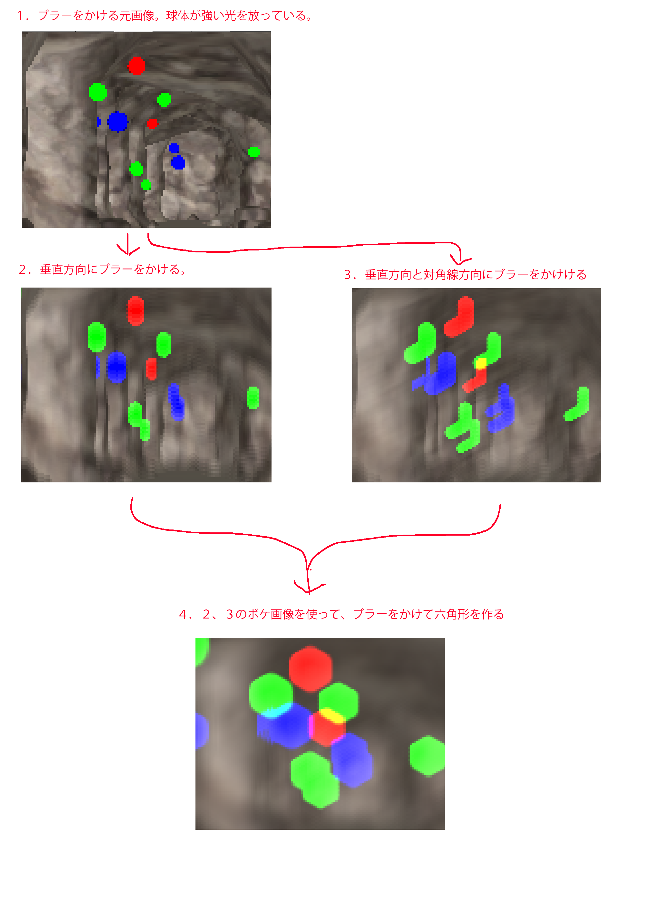</img></br>

### 10.6.3 【ハンズオン】六角形ボケの被写界深度を実装する。
では、六角形ボケの被写界深度を実装してみましょう。10.5の被写界深度との違いは画像をぼかすブラーの処理だけですので、ブラーの処理のみ改造していきます。では、Sample_10_07/Sample_10_07.slnを立ち上げてください。</br>

#### step-1 各種レンダリングターゲットを初期化する。
では、まずは垂直ブラー、対角線ブラー、六角形ブラーを行うための各種レンダリングターゲットを初期化しましょう。main.cppの26行目にリスト10.62のプログラムを入力して下さい。</br>

[リスト10.62 main.cpp]
```cpp
//step-1 各種レンダリングターゲットを初期化する。
RenderTarget rtVerticalBlur;            //垂直ブラーをかけるためのレンダリングターゲット。
RenderTarget rtDiagonalBlur;            //対角線ブラーをかけるためのレンダリングターゲット。
RenderTarget rtPhomboidBlur;            //六角形ブラー。
rtVerticalBlur.Create(1280, 720, 1, 1, DXGI_FORMAT_R32G32B32A32_FLOAT, DXGI_FORMAT_UNKNOWN);
rtDiagonalBlur.Create(1280, 720, 1, 1, DXGI_FORMAT_R32G32B32A32_FLOAT, DXGI_FORMAT_UNKNOWN);
rtPhomboidBlur.Create(1280, 720, 1, 1, DXGI_FORMAT_R32G32B32A32_FLOAT, DXGI_FORMAT_UNKNOWN);
```
#### step-2 垂直、対角線ブラーをかけるためのスプライトを初期化。
続いて、垂直、対角線ブラーをかけるためのスプライトを初期化します。垂直、対角線ブラーはMRTを活用して、一回のスプライトの描画で処理を行います。そのため、レンダリングターゲットが２枚となるため、書きこみ先のカラーバッファのフォーマットの指定として、vertDiagonalBlurSpriteInitData.m_colorBufferFormat[0]とvertDiagonalBlurSpriteInitData.m_colorBufferFormat[1]の二つに値を設定しています。ではリスト10.63のプログラムを入力してください。</br>
[リスト10.63 main.cpp]
```cpp
//step-2 垂直、対角線ブラーをかけるためのスプライトを初期化。
SpriteInitData vertDiagonalBlurSpriteInitData;
vertDiagonalBlurSpriteInitData.m_textures[0] = &mainRenderTarget.GetRenderTargetTexture();
vertDiagonalBlurSpriteInitData.m_width = 1280;
vertDiagonalBlurSpriteInitData.m_height = 720;
vertDiagonalBlurSpriteInitData.m_fxFilePath = "Assets/shader/sample.fx";
//垂直、対角線ブラー用のピクセルシェーダーを指定する。
vertDiagonalBlurSpriteInitData.m_psEntryPoinFunc = "PSVerticalDiagonalBlur";
vertDiagonalBlurSpriteInitData.m_colorBufferFormat[0] = DXGI_FORMAT_R32G32B32A32_FLOAT;
vertDiagonalBlurSpriteInitData.m_colorBufferFormat[1] = DXGI_FORMAT_R32G32B32A32_FLOAT;

Sprite vertDIagonalBlurSprite;
vertDIagonalBlurSprite.Init(vertDiagonalBlurSpriteInitData);
```

#### step-3 六角形ブラーをかけるためのスプライトを初期化。
続いて、六角形ブラーをかけるためのスプライトを初期化します。リスト10.64のプログラムを入力してください。</br>
[リスト10.64 main.cpp]
```cpp
//step-3 六角形ブラーをかけるためのスプライトを初期化。
SpriteInitData phomboidBlurSpriteInitData;
phomboidBlurSpriteInitData.m_textures[0] = &rtVerticalBlur.GetRenderTargetTexture();
phomboidBlurSpriteInitData.m_textures[1] = &rtDiagonalBlur.GetRenderTargetTexture();
phomboidBlurSpriteInitData.m_width = 1280;
phomboidBlurSpriteInitData.m_height = 720;
phomboidBlurSpriteInitData.m_fxFilePath = "Assets/shader/sample.fx";
//六角形ブラー用のピクセルシェーダーを指定する。
phomboidBlurSpriteInitData.m_psEntryPoinFunc = "PSRhomboidBlur";
phomboidBlurSpriteInitData.m_colorBufferFormat[0] = DXGI_FORMAT_R32G32B32A32_FLOAT;

Sprite phomboidBlurSprite;
phomboidBlurSprite.Init(phomboidBlurSpriteInitData);
```

#### step-4 垂直、対角線ブラーをかける。
step-4からはゲームループの処理です。まずは垂直、対角線ブラーをかける処理を実装しましょう。このブラーの処理は、MRTを活用した処理となるため、レンダリングターゲットを２枚設定しています。では、リスト10.65のプログラムを入力してください。</br>
[リスト10.65 main.cpp]
```cpp
//step-4 垂直、対角線ブラーをかける。
RenderTarget* blurRts[] = {
	&rtVerticalBlur,
	&rtDiagonalBlur
};

//レンダリングターゲットとして利用できるまで待つ
renderContext.WaitUntilToPossibleSetRenderTargets(2, blurRts);
//レンダリングターゲットを設定。
renderContext.SetRenderTargetsAndViewport(2, blurRts);
// レンダリングターゲットをクリア
renderContext.ClearRenderTargetViews(2, blurRts);
// 
vertDIagonalBlurSprite.Draw(renderContext);
// レンダリングターゲットへの書き込み終了待ち
renderContext.WaitUntilFinishDrawingToRenderTargets(2, blurRts);
```
#### step-5 六角形ブラーをかける。
cpp側の実装はstep-5で終了です。では、リスト10.66のプログラムを入力してください。</br>
[リスト10.66 main.cpp]
```cpp
 //step-5 六角形ブラーをかける。
renderContext.WaitUntilToPossibleSetRenderTarget(rtPhomboidBlur);
renderContext.SetRenderTargetAndViewport(rtPhomboidBlur);

phomboidBlurSprite.Draw(renderContext);
// レンダリングターゲットへの書き込み終了待ち
renderContext.WaitUntilFinishDrawingToRenderTarget(rtPhomboidBlur);
```

#### step-6  垂直、対角線ブラーの出力構造体を定義。
step-6からはシェーダー側です。まずは、垂直、対角線ブラーのピクセルシェーダーから出力されるデータをまとめた構造体を定義します。Assets/shder/sample.fxの28行目にリスト10.67のプログラムを入力してください</br>
[リスト10.67 sample.fx]
```cpp
//step-6  垂直、対角線ブラーの出力構造体を定義。
struct PSOutput{
	float4 color_0 : SV_Target0;	//垂直ブラーの出力先
	float4 color_1 : SV_Target1;	//斜めブラーの出力先。
};
```
#### step-7 ブラー半径からブラーステップの長さを求める。
step7からは垂直、対角線ブラーのピクセルシェーダーの処理を実装していきます。まずはブラーステップの長さを求めるプログラムを追加しましょう。これはブラー半径を表している定数から求めています。BLUR_RADIUSは六角形の大きさを表している定数で、この値を大きくすると六角形が大きくなります。</br>
ここで求めているblurStepLenはテクセルのサンプリングごとに進めるサンプリングステップの長さを求めています。</br>
今回のサンプルは、サンプリングする場所を六角形の半径分すすめるのに、4ステップしているので、ブラー半径が4であれば、blurStepLenは1となります。では、リスト10.68を入力してください。</br>

[リスト10.68 sample.fx]
```cpp
//step-7 ブラー半径(BLUR_RADIUS)からブラーステップの長さを求める。
float blurStepLen = BLUR_RADIUS / 4.0f;
```

#### step-8 垂直方向のuvオフセットを計算。
続いて、垂直方向のUVオフセットを計算します。このUVオフセット方向に4ステップサンプリングすることとなります。では、リスト10.69のプログラムを入力してください。</br>

[リスト10.69 sample.fx]
```cpp
//step-8 垂直方向のuvオフセットを計算。
float2 uvOffset = float2(0.0f, 1.0f / BLUR_TEX_H );
uvOffset *= blurStepLen;
```
#### step-9 垂直方向にカラーをサンプリングして平均する。
では、step-8で求めたuvオフセットを元にブラーステップを進めていき、４テクセルサンプリングして、平均カラーを求めましょう。リスト10.70のプログラムを入力してください。</br>
[リスト10.70 sample.fx]
```cpp
//step-9 垂直方向にカラーをサンプリングして平均する。
//1ステップ進める。
psOut.color_0 += srcTexture.Sample(
	g_sampler, pIn.uv + uvOffset );
//2ステップ進める。
psOut.color_0 += srcTexture.Sample(
	g_sampler, pIn.uv + uvOffset * 2 );
//3ステップ進める。
psOut.color_0 += srcTexture.Sample(
	g_sampler, pIn.uv + uvOffset * 3 );
//4ステップ進める。
psOut.color_0 += srcTexture.Sample(
	g_sampler, pIn.uv + uvOffset * 4 );
//平均化。
psOut.color_0 /= 4.0f;
```

#### step-10 対角線方向のuvオフセットを計算。
続いて、対角線方向にブラーをかけるためのUVオフセットを計算します。リスト10.71のプログラムを入力してください。</br>
[リスト10.71 sample.fx]
```cpp
//step-10 対角線方向のuvオフセットを計算。
uvOffset.x = 0.86602f / BLUR_TEX_W;
uvOffset.y = -0.5f / BLUR_TEX_H;
uvOffset *= blurStepLen;
```

#### step-11 対角線方向にカラーをサンプリングして平均化する。
垂直、対角線ブラーの処理の最後の実装です。対角線方向のカラーをサンプリングして平均化しましょう。リスト10.72のプログラムを入力してください。</br>
[リスト10.71 sample.fx]
```cpp
//step-11 対角線方向にカラーをサンプリングして平均化する。
psOut.color_1 = srcTexture.Sample(
	g_sampler, pIn.uv + uvOffset );

psOut.color_1 += srcTexture.Sample(
	g_sampler, pIn.uv + uvOffset * 2 );
	
psOut.color_1 += srcTexture.Sample(
	g_sampler, pIn.uv + uvOffset * 3 );
	
psOut.color_1 += srcTexture.Sample(
	g_sampler, pIn.uv + uvOffset * 4 );

psOut.color_1 += srcColor;
psOut.color_1 /= 5.0f;
//垂直方向に平均化した
psOut.color_1 += psOut.color_0;
psOut.color_1 /= 2.0f;
```

#### step-12 右斜め下方向へのuvオフセットを計算する。
step-12からは六角形ブラーのピクセルシェーダーを実装し９て行きます。六角形ブラーでは、垂直、対角線ブラーで作成した２枚のテクスチャを利用して、右下方向と、左下方向にブラーを書けることで六角形のブラーかけます。まずは、右斜め下方向へのUVオフセットを計算しましょう。
リスト10.72のプログラムを入力してください。</br>
[リスト10.72 sample.fx]
```cpp
//step-12 右斜め下方向へのuvオフセットを計算する。
float2 uvOffset;
uvOffset.x = 0.86602f / BLUR_TEX_W;
uvOffset.y = -0.5f / BLUR_TEX_H;
uvOffset *= blurStepLen;
```
#### step-13 右斜め下方向にカラーをサンプリングする。
UVオフセットを計算することができたら、右斜め下方向にテクセルをサンプリングしていきます。リスト10.73のプログラムを入力してください。</br>
[リスト10.73 sample.fx]
```cpp
//step-13 右斜め下方向にカラーをサンプリングする。
float4 color = blurTexture_0.Sample(
	g_sampler, pIn.uv + uvOffset );
	
color += blurTexture_0.Sample(
	g_sampler, pIn.uv + uvOffset * 2 );

color += blurTexture_0.Sample(
	g_sampler, pIn.uv + uvOffset * 3 );

color += blurTexture_0.Sample(
	g_sampler, pIn.uv + uvOffset * 4 );
```
#### step-14 左斜め下方向へのuvオフセットを計算する。
続てい、左斜め下方向へのUVオフセットを計算しましょう。リスト10.74のプログラムを入力してください。</br>
[リスト10.74 sample.fx]
```cpp
//step-14 左斜め下方向へのuvオフセットを計算する。
uvOffset.x = -0.86602f / BLUR_TEX_W * blurStepLen;
```

#### step-15 左斜め下方向にカラーをサンプリングする。
左斜め下方向へのUVオフセットを計算することができたので、それを利用して、左斜め下方向にテクセルをサンプリングしていきましょう。リスト10.75のプログラムを入力して下さい。</br>
[リスト10.75 sample.fx]
```cpp
//step-15 左斜め下方向にカラーをサンプリングする。
color += blurTexture_1.Sample(
	g_sampler, pIn.uv );
	
color += blurTexture_1.Sample(
	g_sampler, pIn.uv + uvOffset );
	
color += blurTexture_1.Sample(
	g_sampler, pIn.uv + uvOffset * 2 );

color += blurTexture_1.Sample(
	g_sampler, pIn.uv + uvOffset * 3 );

color += blurTexture_1.Sample(
	g_sampler, pIn.uv + uvOffset * 4 );

```

#### step-16 平均化。
では、これで最後です。右斜め下方向、左斜め下方向のテクセルのサンプリングが完了したので、それらを平均化しましょう。リスト10.76のプログラムを入力してください。</br>
[リスト10.76 sample.fx]
```cpp
//step-16 平均化。
color /= 9.0f;
```
入力出来たら実行してください。図10.39のように六角形ボケが発生していたら完成です。</br>
**図10.39**</br>
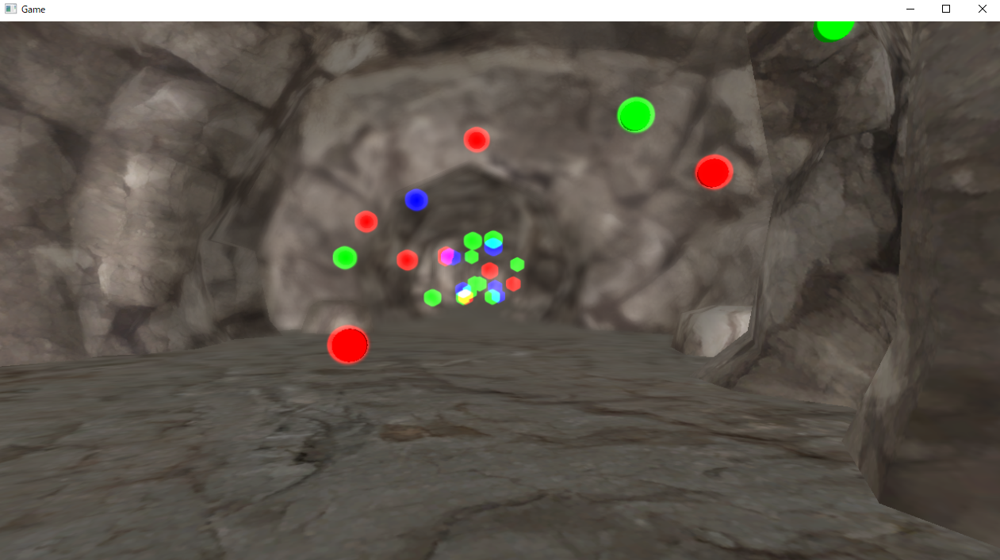</img></br>

## 10.7 トーンマップ
書かないかも(Chapter 14の後に書く。)

## 10.8 Screen space reflection
書かないかも(Chapter 14の後に書く。)

# Chapter 11 シャドウイング
## 11.1 投影シャドウ
３Ｄゲームにおいて、リアルなグラフィックを実現するために影は非常に重要な要素になります。また、グラフィック面だけではなく、影は３Ｄオブジェクトの空間上の位置をユーザーに教えるための重要な要素となります。このチャプターでは、基本となる古典的な影生成アルゴリズムの投影シャドウについて見ていきます。
### 11.1.1 シャドウマップ
投影シャドウはシャドウマップと呼ばれるテクスチャを使用して、影を落とすアルゴリズムの一つになります。シャドウマップというのは影が落ちる場所がテクスチャに描きこまれたものとなります。下の図を見てみて下さい。図11.1を見てください。</br>
**図11.1**</br>
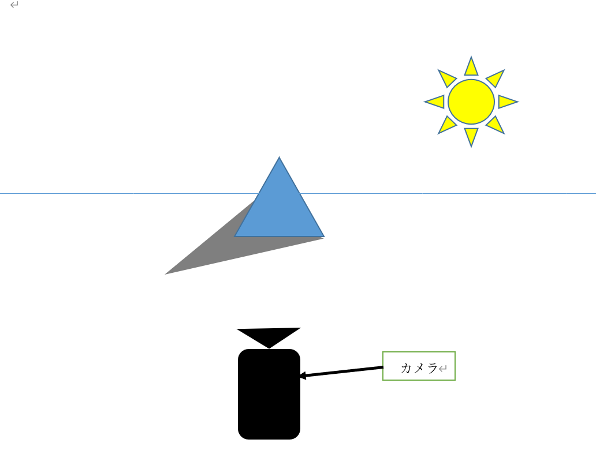</img></br>
このように、影というのは物体によって光が遮られている箇所に発生するものだということが分かります。これは言い方を変えると、光を放っているライトの位置から見たときに、手前に物体が存在していれば影が落ちると言うことができます。図11.2を見てみて下さい。</br>

**図11.2**</br>
</img></br>
キャラクターの影が岩に落ちているのが分かります。では、これをライトの方向から見た場合はどうなるでしょうか？図11.3を見てください。

**図11.3**</br>
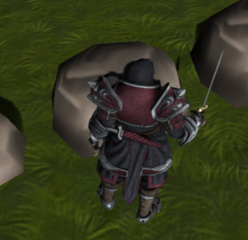</img></br>
このように、ライトの位置から見てみると、影が落ちていた岩の部分は、キャラクターに遮られていることが分かります。このライトから見た絵がシャドウマップです。</br>


### 11.1.2 【ハンズオン】シャドウマップを作ってみる
では、早速ハンズオンでシャドウマップを作っていましょう。シャドウマップというのは、ライトから見た絵です。勘のいい人ならすでに気付いているかもしれませんが、シャドウマップは、これはチャプター10で勉強したオフスクリーンレンダリングを行うことで作成することが出来ます。つまり、ライトをカメラと見立てて影を生成したいオブジェクトを、シャドウマップに対してレンダリングしてやればいいのです。シャドウマップを作成するためのポイントは次の４点です。
1. シャドウマップ描画用のレンダリングターゲットを作成する
2. ライトの位置にカメラを設置する。
3. シャドウマップ描画用のモデルを用意する。
4. 影を生成したいモデルをシャドウマップに描画する。
5. シャドウマップ描画用のピクセルシェーダーを作成する。
では、この４点をハンズオンで実装していきましょう。`Sample_11_01/Sample_11_01.sln`を立ち上げてください。

#### step-1 シャドウマップ描画用のレンダリングターゲットを作成する
まずは。影から見た絵を描画する必要があるので、シャドウマップ描画用のレンダリングターゲットを作成する必要があります。main.cppの23行目にリスト11.1のプログラムを入力してください。</br>
[リスト11.1 main.cpp]
```cpp
//step-1 シャドウマップ描画用のレンダリングターゲットを作成する。
//カラーバッファのクリアカラー
//今回はカラーバッファは真っ白にする。
float clearColor[4] = { 1.0f, 1.0f, 1.0f, 1.0f };
RenderTarget shadowMap;
shadowMap.Create(
	1024,//【注目】レンダリングターゲットの横幅
	1024,//【注目】レンダリングターゲットの縦幅
	1,
	1,
	DXGI_FORMAT_R8G8B8A8_UNORM,
	DXGI_FORMAT_D32_FLOAT,
	clearColor
);
```
レンダリングターゲットの解像度は、影生成のクオリティに影響を与えるので、コメントを記載しています。端的に説明しておくと、シャドウマップの解像度を上げると品質は向上し、下げると品質は低下します。では、単純に解像度をあげればいいのかというと、そういう訳でもなく、解像度を上げると影の品質は上がりますが、パフォーマンスは低下することとなります。

#### step-2 ライトの位置にカメラを設置する
続いて、ライトから見た絵をシャドウマップに描画するのでライトカメラを準備します。ライトカメラはライトの位置置、方向などの情報からカメラを設定します。リスト11.2のプログラムをmain.cppに入力してください。</br>
[リスト11.2 main.cpp]
```cpp
//step-2 影描画用のライトカメラを作成する。
Camera lightCamera;
//カメラの位置を設定。これはライトの位置。
lightCamera.SetPosition(0, 600, 0);
//カメラの注視点を設定。これがライトが照らしている場所。
lightCamera.SetTarget(0, 0, 0);
//【注目】上方向を設定。今回はライトが真下を向いているので、X方向を上にしている。
lightCamera.SetUp(1, 0, 0);
//今回のサンプルでは画角を狭めにしておく。
lightCamera.SetViewAngle(Math::DegToRad(20.0f));
//ライトビュープロジェクション行列を計算している。
lightCamera.Update();
```
今回のハンズオンはライトが真下を向いているので、カメラの上方向に{0, 1, 0}を指定すると、計算がおかしくなってしまうため、X方向を真上にしています。

#### step-3 シャドウマップ描画用のモデルを用意する。
続いて、シャドウマップ描画用のモデルを定義します。今回のサンプルでは、シャドウマップ描画と通常描画でピクセルシェーダーが異なるため、ティーポットのモデルはシャドウマップ描画用と通常描画用の２種類を用意しています。リスト11.3のプログラムをmain.cppに入力してください。</br>
[リスト11.3 main.cpp]
```cpp
//step-3 シャドウマップ描画用のモデルを用意する。
ModelInitData teapotShadowModelInitData;
//【注目】シャドウマップ描画用のシェーダーを指定する。
teapotShadowModelInitData.m_fxFilePath = "Assets/shader/sampleDrawShadowMap.fx";
teapotShadowModelInitData.m_tkmFilePath = "Assets/modelData/teapot.tkm";
Model teapotShadowModel;
teapotShadowModel.Init(teapotShadowModelInitData);
teapotShadowModel.UpdateWorldMatrix(
	{ 0, 50, 0 },
	g_quatIdentity,
	g_vec3One
);
```

#### step-4 影を生成したいモデルをシャドウマップに描画する。
cpp側最後のハンズオンです。影を生成したモデルをシャドウマップに描画しましょう。リスト11.4のプログラムをmain.cppに入力してください。</br>
[リスト11.4 main.cpp]
```cpp
//step-4 影を生成したいモデルをシャドウマップに描画する。
//レンダリングターゲットをシャドウマップに変更する。
renderContext.WaitUntilToPossibleSetRenderTarget(shadowMap);
renderContext.SetRenderTargetAndViewport(shadowMap);
renderContext.ClearRenderTargetView(shadowMap);

//影モデルを描画。
teapotShadowModel.Draw(renderContext, lightCamera);

//書き込み完了待ち。
renderContext.WaitUntilFinishDrawingToRenderTarget(shadowMap);
```

#### step-5 シャドウマップ描画用のピクセルシェーダーを作成する。
では、最後のハンズオンです。今回のハンズオンでシャドウマップに描き込むカラーはグレースケール(灰色)である必要があります。そこで、シャドウマップ描画用のピクセルシェーダーを実装しましょう。Assets/shader/sampleDrawShadowMap.fxの46行目にリスト11.5のプログラムを入力してください。</br>
[リスト11.5 sampleDrawShadowMap.fx]
```cpp
//step-5 シャドウマップ描画用のピクセルシェーダーを作成する。
return float4( 0.5f, 0.5f, 0.5f, 1.0f);
```
ここまで実装できたら、実行してみてください。うまく実装できていると図11.4のようなプログラムが実行できます。</br>
**図11.4**</br>
</img></br>
ここまでの実装はシャドウマップを作成しただけなので、まだ投影シャドウの実装の半分です。ですので、まだ影は落ちません。今回のサンプルではシャドウマップが作成できていることを確認するために、画面の左上に描画されたシャドウマップを表示しています。図11.4と同じようなシャドウマップが作れているか確認してください。

### 11.1.3 シャドウマップの貼り付け
前節でグレースケールのシャドウマップが作成できました。これで投影シャドウに使用するシャドウマップは完成したことになります。あとは、影を受けたいオブジェクトにシャドウマップを張り付けてやればよいことになります。では、どうやって張り付けるのか見ていきましょう。例えば図11.5絵の岩を画面に描画する際は、岩の頂点座標×ワールド行列×カメラ行列×射影行列という計算を行ってスクリーン座標系に変換します。</br>
**図11.5**</br>
</img></br>

シャドウマップを張り付ける場合は、先ほどの変換とは別に岩の頂点座標×ワールド行列×ライトカメラ行列×ライト射影行列という計算を行って、ライトをカメラと見立てたスクリーン座標系への変換も行う必要があります。つまり岩に影を落とす場合、図11.6の２パターンの座標変換を行うことになります。</br>
**図11.6**</br>
</img></br>
では、具体的にコードを見ていきましょう。次のコードは２パターンの座標変換を行っている頂点シェーダーの疑似コードです。</br>

```cpp
/// <summary>
/// 影が落とされる3Dモデル用の頂点シェーダー。
/// </summary>
SPSIn VSMain(SVSIn vsIn)
{
	//シャドウレシーバー用の頂点シェーダーを実装。
	SPSIn psIn;
	//ここは通常の座標変換
	float4 worldPos = mul(mWorld, vsIn.pos);
	psIn.pos = mul(mView, worldPos);
	psIn.pos = mul(mProj, psIn.pos);
	psIn.uv = vsIn.uv;

	//ここからライトビュースクリーン空間での座標を計算している。
	psIn.posInLVP = mul( mLVP, worldPos);
	psIn.normal = mul(mWorld, vsIn.normal);
	return psIn;
}
```
psIn.posInLVPというパラメータにライトビュースクリーン空間での座標が記録されており、この値がピクセルシェーダーに渡されています。
#### 11.1.3.1 正規化スクリーン座標系
では、ここで頂点シェーダーで変換されている、スクリーン空間の座標系というのがどのような座標系になっているかみてみましょう。例えば図11.7のように描画された場合、頂点座標は縦横-1.0～1.0の座標系に変換されています。</br>
**図11.7**</br>
</img></br>
このように、画面の左下が( -1, -1 )、画面の右上が( 1, 1 )となっている座標系が正規化スクリーン座標系と呼ばれます。実は、これまでの頂点シェーダーで行っていた変換は、最終的に正規化スクリーン座標系に変換していたのです。これがシャドウマップを張り付ける際に重要になってきますので、しっかりと抑えておいてください。

#### 11.1.3.2  正規化スクリーン座標系からUV座標系に変換
では、シャドウマップの貼り付けの話に戻りましょう。先ほど頂点シェーダーで影を受けたいオブジェクトの頂点座標にライトビュープロジェクション行列を乗算して、正規化スクリーン座標系に変換を行いました。そうすると岩のオブジェクトは図11.8のような座標系に変換されます。</br>
**図11.8**</br>
</img></br>

仮にこの人間のキャラクターがシャドウマップに描画されている場合は図11.9のようなシャドウマップが生成されています。
**図11.9**</br>
</img></br>
図11.8と図11.9を見比べてみると、座標の範囲の違いはありますが、岩に影が落ちる部分はシャドウマップにマッピングするとちょうど灰色になっていることが分かります。つまり、ライトビュープロジェクション行列で変換した座標(-1～1)を、UV座標(0～1)に変換して、それを使って岩にシャドウマップを張り付けてやればうまくいきそうです。次のコードは座標変換の疑似コードです。</br>

```cpp
//正規化スクリーン座標系( -1～1 )の範囲に0.5をかけて( -0.5～0.5 )の範囲にする。
//yの値が-0.5なのは、上下が逆だから。
float2 shadowMapUV = psIn.posInLVP.xy * float2( 0.5f, -0.5f);
//( -0.5～0.5 )の範囲に0.5を足し算することで、( 0.0～1.0 )の範囲にする。
shadowMapUV += 0.5f; 
```
あとは、計算されたUV座標を利用して、シャドウマップからカラーをサンプリングしてやれば影を落とすことができます。

### 11.1.4 【ハンズオン】シャドウマップを使って影を落とす。
では、シャドウマップを貼り付けるプログラムを実装していきましょう。Sample_11_02/Sample_11_02.slnを立ち上げてください。

#### step-1 影を受ける背景モデルを初期化。
まずは、影を落とされるモデルを初期化します。影を受けるモデルは、座標変換とシャドウマップからのカラーのサンプリングが必要になるので、シェーダーが通常のモノとは異なります。また、ライトビュースクリ�������ン空間に変換を行う必要があるため、座標変換を行うための行列を定数バッファに設定しています。main.cppの71行目にリスト11.6のプログラムを入力してください。</br>

[リスト11.6 main.cpp]
```cpp
//step-1 影を受ける背景モデルを初期化。
ModelInitData bgModelInitData;
//影が落とされるモデル用のシェーダーを指定する。
bgModelInitData.m_fxFilePath = "Assets/shader/sampleShadowReciever.fx";
//シャドウマップを拡張SRVに設定する。
bgModelInitData.m_expandShaderResoruceView[0] = &shadowMap.GetRenderTargetTexture();
//ライトビュープロジェクション行列を拡張定数バッファに設定する。
bgModelInitData.m_expandConstantBuffer = (void*)&lightCamera.GetViewProjectionMatrix();
bgModelInitData.m_expandConstantBufferSize = sizeof(lightCamera.GetViewProjectionMatrix());
bgModelInitData.m_tkmFilePath = "Assets/modelData/bg/bg.tkm";

Model bgModel;
bgModel.Init(bgModelInitData);
```

#### step-2 影を受ける背景を描画。
続いて、影を受けるモデルを描画します。この描画は通常の描画パスです。main.cppにリスト11.7のプログラムを入力してください。</br>
[リスト11.7 main.cpp]
```cpp
//step-2 影を受ける背景を描画。
bgModel.Draw(renderContext);
```
#### step-3 ライトビュープロジェクション行列にアクセする定数バッファを定義。
step-3からは影を受けるモデル用のシェーダーのプログラムになります。まずは、ライトビュープロジェクション行列にアクセスするための定数バッファを定義しましょう。`Assets/shader/sampleShadowReciever.fx`を開いて、11行目にリスト11.8のプログラムを入力してください。</br>

[リスト11.8 sampleShadowReciever.fx]
```cpp
//step-3 ライトビュープロジェクション行列にアクセする定数バッファを定義。
cbuffer ShadowCb : register(b1){
	float4x4 mLVP;
};

```
#### step-4 ライトビュースクリーン空間でのピクセルの座標を追加。
続いて、ピクセルシェーダーへの入力にライトビュースクリーン空間でのピクセルの座標を追加します。リスト11.9のプログラムを入力してください。</br>
[リスト11.9 sampleShadowReciever.fx]
```cpp
//step-4 ライトビュースクリーン空間でのピクセルの座標を追加。
float4 posInLVP		: TEXCOORD1;	//ライトビュースクリーン空間でのピクセルの座標
```

#### step-5 ライトビュースクリーン空間の座標を計算する。
step-5では、頂点シェーダーでのライトビュースクリーン空間への座標変換を実装します。リスト11.10のプログラムを入力してください。</br>
[リスト11.10 sampleShadowReciever.fx]
```cpp
//step-5 ライトビュースクリーン空間の座標を計算する。
psIn.posInLVP = mul( mLVP, worldPos);
```

#### step-6 ライトビュースクリーン空間からUV空間に座標変換。
続いてピクセルシェーダーです。まず、頂点シェーダーから渡された、ライトビュースクリーン空間の座標をUV空間に変換しましょう。リスト11.11のプログラムを入力してください。</br>

[リスト11.11 sampleShadowReciever.fx]
```cpp
//step-6 ライトビュースクリーン空間からUV空間に座標変換。
//【注目】ライトビュースクリーン空間からUV座標空間に変換している。
float2 shadowMapUV = psIn.posInLVP.xy / psIn.posInLVP.w;
shadowMapUV *= float2( 0.5f, -0.5f);
shadowMapUV += 0.5f; 
```
ここで一点注意点として、psIn.posInLVP.xyの値をpsIn.posInLVP.wで除算しています。これはまだ説明していませんが、実は正規化スクリーン座標系というのは、wで割り算することで、(-1～1)の範囲に収まることとなります。この数学的な原理の話については本書では詳しくは説明しません。本書では、wで除算することで、正規化スクリーン座標系に変換されるということを覚えておいてくれれば十分です。
#### step-7 計算したUV座標を使って、シャドウマップから影情報をサンプリング。
UV座標を計算することができたら、シャドウマップから影情報をサンプリングしましょう。リスト11.12のプログラムを入力してください。</br>
[リスト11.12 sampleShadowReciever.fx]
```cpp
//step-7 計算したUV座標を使って、シャドウマップから影情報をサンプリング
float3 shadowMap = 1.0f; 
if( shadowMapUV.x > 0.0f && shadowMapUV.x < 1.0f
	&& shadowMapUV.y > 0.0f && shadowMapUV.y < 1.0f
){
	shadowMap = g_shadowMap.Sample(g_sampler, shadowMapUV);
} 
```
UV座標がUV空間の範囲内の場合だけ、シャドウマップからカラーをサンプリングしています。シャドウマップに描画できる範囲というのは、有限なので、範囲外の場所に影を落とすことはできません。

#### step-8 サンプリングした影情報をテクスチャカラーに乗算する。
では、最後のハンズオンです。影情報をサンプリングできたら、そのカラーをテクスチャカラーに掛け算しましょう。リスト11.13のプログラムを入力してください。</br>
[リスト11.13 sampleShadowReciever.fx]
```cpp
//step-8 サンプリングした影情報をテクスチャカラーに乗算する。
//テクスチャカラーにシャドウマップからサンプリングした情報を掛け算する。
//影が描き込まれていたら0.5になっているので、色味が落ちて影っぽくなる。
color.xyz *= shadowMap;
```

シャドウマップは1.0でクリアされています。また、影が落ちる箇所には、灰色(0.5, 0.5, 0.5)が格納されています。そのため、影が落ちていなければ1.0が乗算されるため、何も変化が起きず、影が落ちている箇所は0.5が乗算されるため、色味が暗くなります。実装出来たら実行してください。うまく実装できていると図11.10のようなプログラムが実行できます。</br>
**図11.10**</br>
</img></br>

## 11.2 デプスシャドウ
11.2では投影シャドウを進化させたデプスシャドウ技法について見ていきましょう。
### 11.2.1 投影シャドウの欠点
11.1でシンプルな影生成技法の投影シャドウについて見ていきました。シンプルな考え方でリアルな影を生成することができるため、今でもゲームによっては採用されることがある影生成技法です。しかし、投影シャドウには次のような欠点があります。

1. 影が落ちないはずの場所に影が落ちてしまう。
2. セルフシャドウが行えない。

投影シャドウは単純にモデルにシャドウマップを貼り付けているだけなので、図11.11のように本来影が落ちない場所に影が落ちてしまいます。</br>
**図11.11**</br>
</img></br>
これと同様の原因として、自分自身に影を落とすセルフシャドウも行うことができません。今回のケースで言えば、ティーポットにティーポット自身の影を落とすことができないということです。デプスシャドウ技法を使うと、これらの問題を解決することができます。

<note>

`Sample_11_03/ShadowProjection/Game.exe`を実行すると、投影シャドウの問題点について確認することができるので、こちらも試してみてください。コントローラーの左スティックの入力でカメラを動かすことができます。

</note>

### 11.2.2 デプスシャドウとは
デプスシャドウは投影シャドウの考え方を発展させたものとなります。アルゴリズム的にもシャドウマップを作成して、それを利用して影を落とすという処理になるため、投影シャドウととてもよく似ています。投影シャドウとの違いは、シャドウマップに描き込む値が、グレースケールではなく、ライトスクリーン空間でのZ値を描き込むというて点です。Z値、ライトスクリーン空間での深度値、デプスを描き込むめ、デプスシャドウと呼ばれます。デプスシャドウは「影はライトの光が遮られている場所に落ちるはずなので、影が落ちる箇所には、手前に遮蔽物があるはず」という考え方から影を落とします(図11.12)。</br>
**図11.12**</br>
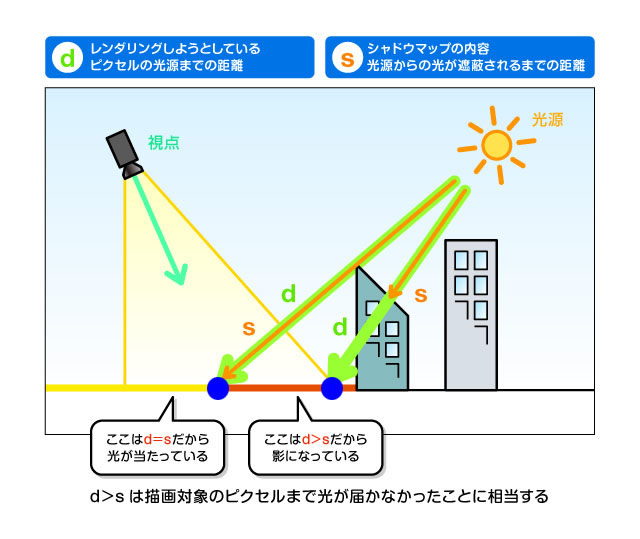</img></br>

モデルを描画する際に、シャドウマップに描き込まれた深度値を使って、ピクセルが遮蔽されているかどうかを判定します。
### 11.2.3【ハンズオン】デプスシャドウを実装する。
では、Sample_11_03/Sample_11_03.slnを改造して、デプスシャドウを実装しましょう。実装は投影シャドウを少し改造するだけです。今回は投影シャドウから改造した点に注目して実装を行っていきます。

#### step-1 シャドウマップ描画用のレンダリングターゲットを作成する。
まずは、シャドウマップ描画用のレンダリングターゲットを作成します。変更点はカラーバッファのフォーマットです。今回は数値の精度が欲しかったのと、深度情報のみを描き込むため、G(緑)B(青)A(α)の成分は不要なので、R(赤)のみの32bit浮動小数点フォーマットにしています。では、main.cppの36行目にリスト11.14のプログラムを入力してください。</br>
[リスト11.14 main.cpp]
```cpp
//step-1 シャドウマップ描画用のレンダリングターゲットを作成する。
float clearColor[4] = { 1.0f, 1.0f, 1.0f, 1.0f };
RenderTarget shadowMap;
shadowMap.Create(
	1024, 
	1024, 
	1, 
	1, 
	//【注目】シャドウマップのカラーバッファのフォーマットを変更している。
	DXGI_FORMAT_R32_FLOAT,
	DXGI_FORMAT_D32_FLOAT,
	clearColor
);
```

#### step-2 シャドウマップに描画するモデルを初期化する。
続いて、シャドウマップに描画するモデルの初期化処理を実装します。ここでの変更点もカラーバッファのフォーマットの変更に起因するものです。DirectX12では、ドローコールを実行する際にパイプラインステートというものを指定する必要があるのですが、このパイプラインステートの設定に、描き込むカラーバッファのフォーマットというものがあります。この設定のための変更があります。main.cppにリスト11.15のプログラムを入力してください。</br>
[リスト11.15 main.cpp]
```cpp
//step-2 シャドウマップに描画するモデルを初期化する。
ModelInitData teapotShadowModelInitData;
//シャドウマップ描画用のシェーダーを指定する。
teapotShadowModelInitData.m_fxFilePath = "Assets/shader/sampleDrawShadowMap.fx";
teapotShadowModelInitData.m_tkmFilePath = "Assets/modelData/teapot.tkm";

//【注目】カラーバッファのフォーマットに変更が入ったので、こちらも変更する。
teapotShadowModelInitData.m_colorBufferFormat[0] = DXGI_FORMAT_R32_FLOAT;

Model teapotShadowModel;
teapotShadowModel.Init(teapotShadowModelInitData);
teapotShadowModel.UpdateWorldMatrix(
	{ 0, 50, 0 },
	g_quatIdentity,
	g_vec3One
);
```
#### step-3 シャドウマップにZ値を描き込む。
step-3はシャドウマップ書き込み用のシェーダー側の変更です。まずは、シャドウマップに書き込む値をライトカメラスクリーン空間でのZ値に変更します。`Assets/shader/sampleDrawShadowMap.fx`の56行目にリスト11.16のプログラムを入力してください。</br>
[リスト11.16 sampleDrawShadowMap.fx]
```cpp
//step-3 シャドウマップにZ値を描き込む。
return float4( psIn.pos.z, psIn.pos.z, psIn.pos.z, 1.0f);
```
ちなみにここでは、psIn.pos.zをpsIn.pos.wで除算していません。これは、SV_POSITIONのセマンティクスが指定されているパラメーターはwで除算済みのデータとして、ピクセルシェーダーに渡されるためです。

#### step-4 ライトビュースクリーン空間でのZ値を計算する。
step-4からは影を受けるモデル用のシェーダーの変更です。まずは、影を受けるモデルのライトビュースクリーン空間でZ値を計算します。`Assets/shader/sampleShadowReciever.fx`の70行目にリスト11.17のプログラムを入力してください。</br>
[リスト11.17 sampleShadowReciever.fx]
```cpp
//step-4 ライトビュースクリーン空間でのZ値を計算する。
float zInLVP = psIn.posInLVP.z / psIn.posInLVP.w;
```

#### step-5 シャドウマップに描き込まれているZ値と比較する。
これで最後です。step-4で描画したいピクセルのライトビュースクリーン空間でのZ値を求めることができたので、シャドウマップに書き込まれているZ値と比較を行って、遮蔽されているようであれば、影を落とすプログラムを実装します。sampleShadowReciever.fxにリスト11.18のプログラムを入力してください。</br>
[リスト11.18 sampleShadowReciever.fx]
```cpp
//step-5 シャドウマップに描き込まれているZ値と比較する。
//計算したUV座標を使って、シャドウマップから深度値をサンプリング
float zInShadowMap = g_shadowMap.Sample(g_sampler, shadowMapUV).r;
if( zInLVP > zInShadowMap ){
	//遮蔽されている。
	color.xyz *= 0.5f;
}
```
ここまで実装出来たら実行してみて下さい。うまく実装できていると、図11.13のようなプログラムが実行できます。ティーポットの上の赤いオブジェクトに影が落ちないようになっているはずです。
**図11.13**</br>
</img></br>


## 11.3 Percentage Closer Filtering(PCF)
この節では、もっとも簡単にソフトシャドウを実現できるPercentage Closer Filtering(PCF)について見ていきます。

### 11.3.1 ソフトシャドウ
ソフトシャドウとは現実世界の影で生じるやわらかい影のことを指しています。現実世界では、影の輪郭付近が薄くなっていき、ぼんやりとした影になります(図11.14)。</br>
**図11.14**</br>
</img></br>
一方、11.2で実装した影はハードシャドウとよばれる、輪郭がくっきりとした影になります(図11.15)。</br>

**図11.15**</br>
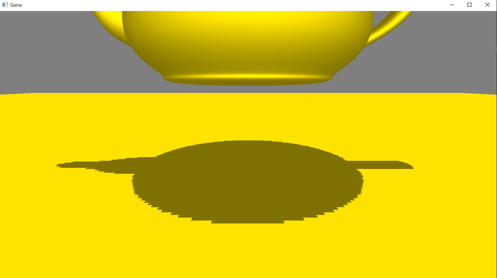</img></br>

### 11.3.2 PCF
PCFはデプスシャド���マップを少し改造するだけで実装出来ます。ほとんどのアルゴリズムはシンプルなデプスシャドウと同じです。違いがあるのは、シャドウレシーバーを描画するときのピクセルシェーダーです。シャドウレシーバーを描画する際にシャドウマップから深度値をサンプリングして、そのピクセルが光源から遮蔽されているかどうかを判定していましたが、PCFではこの深度値のサンプリングを一点だけではなく、複数サンプリングして、その遮蔽状況から、その遮蔽情報からどれだけ遮蔽されているか(遮蔽率)を決定します(図11.16)。</br>

**図11.16**</br>
</img></br>

### 11.3.2.1 PCFのアルゴリズム
PCFのアルゴリズムを疑似コードを見ながら説明していきます。PCFはシャドウマップを作成するまでの処理は、シンプルなデプスシャドウと全く同じです。違う点はシャドウレシーバーを描画するときの影の判定の方法です。PCFでは、まずシャドウマップをつかって、基準テクセルから近傍４テクセルの深度値をサンプリングします(リスト11.19)。</br>

[リスト11.19 疑似コード]
```cpp
//OFFSET_XとOFFSET_Yには1テクセルずらすためのUVオフセットが計算されているとする。
//【注目】基本テクセルから近傍4テクセル深度値を引っ張ってくる。
float zInShadowMap_0 = g_shadowMap.Sample(
	g_sampler, 
	shadowMapUV).r;
float zInShadowMap_1 = g_shadowMap.Sample(
	g_sampler, 
	shadowMapUV + float2( OFFSET_X, 0.0f)).r;
float zInShadowMap_2 = g_shadowMap.Sample(
	g_sampler, 
	shadowMapUV + float2( OFFSET_X, OFFSET_Y)).r;
float zInShadowMap_3 = g_shadowMap.Sample(
	g_sampler, 
	shadowMapUV + float2( 0.0f, OFFSET_Y)
	).r;
```

4つの深度値をサンプリングできたら、これから描画しようとしているピクセルのZ値と、サンプリングしたZ値との比較を行います。遮蔽されている場合はshadowRateという変数に１加算していっていることに注目してください(リスト11.20)。</br>

[リスト11.20 疑似コード]
```cpp
//このピクセルのライトから見た深度値と４つの深度値を比較して遮蔽率を計算する。
float shadowRate = 0.0f;
if( zInLVP > zInShadowMap_0){
	//遮蔽されているので、遮蔽率を１加算。
	shadowRate += 1.0f;
}
if( zInLVP > zInShadowMap_1){
	//遮蔽されているので、遮蔽率を１加算。
	shadowRate += 1.0f;
}
if( zInLVP > zInShadowMap_2){
	//遮蔽されているので、遮蔽率を１加算。
	shadowRate += 1.0f;
}
if( zInLVP > zInShadowMap_3){
	//遮蔽されているので、遮蔽率を１加算。
	shadowRate += 1.0f;
}
```
4つの深度値と比較を行うことができたら、最後にshadowRateを4で割って遮蔽率の平均を求めます。もしこのピクセルが2つのテクセルから遮蔽されていたら、遮蔽率の平均は0.5となります(リスト11.21)。</br>
[リスト11.22 疑似コード]
```cpp
//遮蔽率の平均を計算する。
//4つすべて遮蔽されていたら遮蔽率が100%になる。
//２つしか遮蔽されていなければ、50%になる。
shadowRate /= 4.0f;
```
遮蔽率を求めることができたら、その遮蔽率を使って、シャドウカラーと通常カラーをブレンディングして最終カラーを求めることで影を落とすことができます。(リスト11.23)。</br>
[リスト11.23 疑似コード]
```cpp
//遮蔽率が求まったら、線形補完で影を落とす。
float3 shadowColor = albedoColor.xyz;
float3 finalColor = lerp( albedoColor.xyz, shadowColor, shadowRate );
```

### 11.3.2 ハードウェアの機能を使ったPCFの実装
HLSLには、リスト11.19とリスト11.20の深度比較と遮蔽率の計算を一発で行うことができる、SampleCmpLevelZero()という関数があります。この関数を利用すると、先ほどのコードを次のように改造することができます(リスト11.24)。</br>
[リスト11.24 疑似コード]
```cpp
//SampleCmpLevelZero()を利用して、遮蔽率を求める。
float shadow = g_shadowMap.SampleCmpLevelZero(
	g_shadowMapSampler, 	//比較サンプリング用のサンプラステート。
	shadowMapUV, 			//シャドウマップUV。
	zInLVP					//このピクセルのライトから見たときの深度値。
);
//遮蔽されている。
float3 shadowColor = color.xyz * 0.5f;
color.xyz = lerp( color.xyz, shadowColor, shadow) ;
```
この関数を利用するためには、適切な比較サンプリング用のサンプラステートを作成する必要があります。今回指定しているサンプラステートは、第三引数の値と、シャドウマップの値とで比較を行い、第三引数の値が大きければ1,0、小さければ0.0、これを４テクセル分行って、その平均を戻り値として返すように設定されています。リスト11.19とリスト11.20の疑似コードの４テクセル分のif文と同じ処理を行うための設定です。本書が提供しているエンジンでは、このサンプラステートはMiniEngine/Material.cppの91行目からのプログラムで作成されています(リスト11.25)。

[リスト11.25 Material.cpp]
```cpp
//シャドウマップ用のサンプラの設定を行う。
samplerDescArray[1] = samplerDescArray[0];
//比較対象の値が小さければ０、大きければ１を返す比較関数を設定する。
samplerDescArray[1].Filter = D3D12_FILTER_COMPARISON_MIN_MAG_MIP_LINEAR;
samplerDescArray[1].ComparisonFunc = D3D12_COMPARISON_FUNC_GREATER;
samplerDescArray[1].MaxAnisotropy = 1;
samplerDescArray[1].ShaderRegister = 1; //s1レジスタに設定する。

m_rootSignature.Init(
	samplerDescArray,
	2
);
```
### 11.3.3 【ハンズオン】PCFを実装する
では、PCFを実装していきましょう。今回は4つのテクセル値との比較の平均を取得してくれる、HLSLの関数のSampleCmpLevelZeroを使用してPCFを実装していきます。Sample_11_04/Sample_11_04.slnを立ち上げてください。

#### step-1 シャドウマップサンプリング用のサンプラステートにアクセスする変数を追加する。
PCFのアルゴリズムはシャドウマップを作るまでは、ノーマルのデプスシャドウと何も変わりはありません。違いがあるのはシャドウレシーバーの影判定の箇所だけです。ですので、今回の実装では、シャドウレシーバー用のシェーダーのみ変更してきます。まずは、比較サンプリングのためのサンプラステートにアクセスするための変数を追加します。では、Assets/shader/sampleShadowReciever.fxの39行目にリスト11.26のプログラムを入力してください。</br>

[リスト11.26 sampleShadowReciever.fx]
```cpp
//step-1 シャドウマップサンプリング用のサンプラステートにアクセスする変数を追加する。
SamplerComparisonState g_shadowMapSampler: register(s1);
```
リスト11.25で見たように、本書のエンジンでは、比較サンプリング用のサンプラステートはs1レジスタに設定されてるため、s1にアクセスするための変数を定義しています。

#### step-2 SampleCmpLevelZero関数を使用して、遮蔽率を取得する。
続いてピクセルシェーダーの改造です。SampleCmpLevelZero関数を使用して、ピクセルの遮蔽率を計算します。リスト11.27のプログラムを入力して下さい。</br>
[リスト11.27 sampleShadowReciever.fx]
```cpp
//step-2 SampleCmpLevelZero関数を使用して、遮蔽率を取得する。
float shadow = g_shadowMap.SampleCmpLevelZero(
	g_shadowMapSampler, 	//使用するサンプラステート。
	shadowMapUV, 			//シャドウマップにアクセするUV座標。
	zInLVP					//比較するZ値。この値が比較するテクセルの値より大きければ1.0、0.0。
							//それを4テクセル分行い、4テクセルの平均を返してくる。
);
```
#### step-3 シャドウカラーと通常カラーを遮蔽率で線形補間する。
では、これで最後です。遮蔽率を使って、シャドウカラーと通常カラーでブレンディグして影を落とします。リスト11.28のプログラムを入力して下さい。</br>
[リスト11.28 sampleShadowReciever.fx]
```cpp
//step-3 シャドウカラーと通常カラーを遮蔽率で線形補間する。
//シャドウカラーを計算。
float3 shadowColor = color.xyz * 0.5f;
//遮蔽率を使って線形補完、
color.xyz = lerp( color.xyz, shadowColor, shadow) ;
```
実装したら実行して、コントローラーの右スティックを操作して、影をアップにしてみてください。図11.17のように、影の境界がボケていたら実装できています。</br>
**図11.17**</br>
</img></br>


## 11.4 Variance Shadow Maps(VSM)
11.4ではPCFよりも品質の高いソフトシャドウを実現することができる、Variance Shadow Maps(VSM)と呼ばれる分散シャドウマップについて見ていきます。
### 11.4.1 VSMとは
VSMとは、シャドウマップに描き込まれた深度値の局所的な分散を利用して、ソフトシャドウを実現するアルゴリズムです。分散というのは、ある集団がどれくらい分散している、散らばっているのか？というものを表すものです。例えば、次の表11.1、表11.2を見てください。これはある二つのクラスの数学の試験の結果です。</br>
**表11.1 Aクラスの数学の試験結果**</br>
|名前|点数|
| ---- | ---- |
|山田 太郎|100|
|山田 花子|90|
|佐々木 小次郎|20|
|聖徳 太子|10|

**表11.2 Bクラスの数学の試験結果**</br>
|名前|点数|
| ---- | ---- |
|織田 信長|70|
|豊臣 秀吉|80|
|小野 妹子|50|
|徳川 家康|60|

この二つのクラスを見比べると、Aクラスは点数の差(分散)が10点～90点と、点数の差が大きくなっているのに対して、Bクラスは点数の差(分散)が50点～70点と、点数の差は小さくなっています。これが分散です。Aクラスは分散の値が大きく、Bクラスは分散の値が小さくなります。

#### 11.4.1.1 深度値の局所的な分散とは？
VSMはシャドウマップに描き込まれた深度値の局所的な分散を利用したアルゴリズムです。局所的な分散とは、シャドウマップに書き込まれた深度値をいくつかのグループに分けた、グループごとの分散のことです。図11.18を見てみてください。</br>
**図11.18**</br>
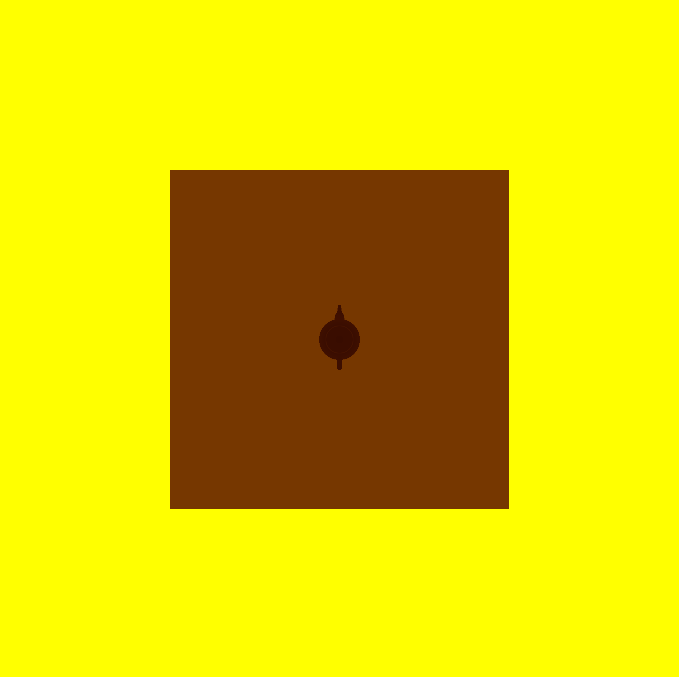</img></br>
図11.18は図11.19のシーンのシャドウマップです。</br>

**図11.19**</br>
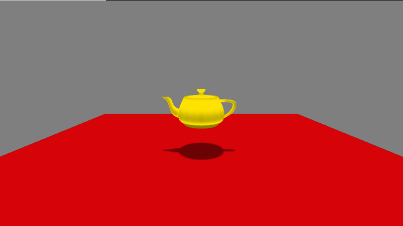</img></br>
このシャドウマップには、ティーポットと地面のライトから見た深度値が描き込まれています。VSMでは、このシャドウマップを図11.20のようにグループ分けを行います。</br>

**図11.20**</br>
</img></br>
この図はシャドウマップに描き込まれたティーポットをアップにしたものです。VSMでは、このシャドウマップを格子模様で分割して、各グループ内の深度値について分散を調べていくことになります(図11.21)。

**図11.21**</br>
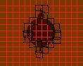</img></br>

さて、ここで注目してほしいのはどの「グループの分散が大きくなるのか？」ということです。分散が大きいということは、グループ内に含まれているテクセルの深度値の幅が広いということです。逆に言うと、グループ内に含まれているテクセルの深度値の幅が狭いということは、分散が小さいということです。分散が大きくなるグループにマークを付けた図11.22を見てください。</br>

**図11.22**</br>
</img></br>
マークがついている個所に注目してみると、ティーポットと地面の両方の深度値が描き込まれている箇所が分散が大きくなっていることが分かります。これは、影の境界線付近が分散が大きくなることを示しており、影のジャギーが起きやすい箇所です。VSMは、この深度値の局所的な分散を利用して、分散が大きい箇所はジャギーが起きる可能性が高いため、影を薄くして、ジャギーを目立たないようにしましょう、というアルゴリズムとなります。

#### 11.4.1.2 シャドウマップに書き込む値
では、具体的な実装を見ていきましょう。VSMではのちの分散の計算のために、次の値を書き込みます。
1. ライトから見たピクセルまでの距離(深度値)
2. ライトから見たピクセルまでの距離(深度値)の２乗
まず、これまではライトスクリーン空間でのZ値を描きこんでいたのですが、実はこのZ値の値は非線形の変化をしており、深度値の変化が一定ではありませんでした。VSMでは深度値による分散を考えたいので、線形に変化しているほうが都合がよいので、ライトから見た距離を深度値として書き込みます。ただし、考え方はこれまで通りの考え方と変わりはなく、ライトから見た深度値を書き込んでいます。続いて、２番目の距離の２乗ですが、分散を計算するときには、距離の２乗など、２乗した値を使います。これを詳しく説明すると、数学や統計学の分野に入ってしまい、本書の範疇を超えてしまいますので、説明はしません。VSMではシャドウマップに「ライトから見たピクセルまでの深度」と「ライトから見たピクセルまでの深度の2乗を書き込む」と考えてください。リスト11.29はシャドウマップに１と２を書き込んでいるピクセルシェーダーの疑似コードです。</br>
[リスト11.29 疑似コード]
```cpp
/// <summary>
/// シャドウマップ描画用のピクセルシェーダー。
/// </summary>
float4 PSMain( SPSIn psIn ) : SV_Target0
{
	//ライトからの距離を計算する。
	float depth = min( 1.0f, length( psIn.worldPos - lightPos ) / 1000.0f );
	return float4( 
		depth, 			//Rの成分にライト空間での深度値
		depth * depth,	//Gの成分にライト空間での深度値の２乗
		0.0f, 
		1.0f	
	);
}
```
深度値を1000で割ることで、0～1000までの深度値を、0.0～1.0に正規化しています。

#### 11.4.1.3 グループごとの深度値と深度値の２乗の平均を求める。
続いて、グループごとの深度値と深度値の２乗の平均を求めます。これを求めるために、今回の実装ではガウシアンブラーを使ってシャドウマップにブラーをかけます。ブラーをかけると周囲のテクセルの値と混ぜ合わせたテクスチャが出来上がるため、ブロックごとの平均を求めるのにうってつけです。本書のミニエンジンが用意しているGaussianBlurクラスを利用すると、元のテクスチャの1/4のサイズになるため、4x4ブロックで局所的な平均を計算することができます(図11.23)。</br>
**図11.23**</br>
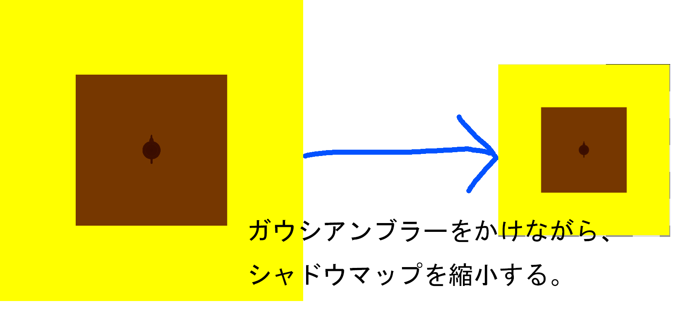</img></br>
これにより、シャドウマップの局所的な深度値の平均と、深度値の2乗の平均が求まりました。VSMでは、ガウシアンブラーがかかったテクスチャをシャドウマップとして利用して、影を落とします。

#### 11.4.1.4 チェビシェフの不等式を利用して、光が届く確率を求める。
VSMで利用するシャドウマップが出来上がったので、あとはシャドウレシーバーに影を落とします。影を落とすときにはチェビシェフの不等式というものを利用します。これの詳しい説明も本書の範疇を超えてしまいますので、割愛して要点だけ説明します。この不等式を利用することで、あるピクセルに光が届く確率を計算することができます。この確率は分散が大きいほど光が届く確率が高くなり、分散が小さいほど光が届く可能性が低くなります。処理の流れはデプスシャドウ技法とよく似ています。描画しようとするシャドウレシーバーのピクセルの、ライトから見た深度値を計算します。そして、シャドウマップを参照して、そのピクセルが遮蔽されているかどうかを調べるのです。そして、遮蔽されている場合は、そのピクセルが含まれているシャドウマップのグループの分散具合から、光がどれくらい届くか？を調べるのです。分散が大きいほど光が届く可能性が高くなるため、影が薄くなります。逆に分散が小さければ光が届く可能性が低くなるため、影が濃くなります。リスト11.30は影を落とす疑似コードです。</br>
[リスト11.30 疑似コード]
```cpp
//シャドウマップから値をサンプリング。
float2 shadowValue = g_shadowMap.Sample(g_sampler, shadowMapUV).xy;
//【注目】まずこのピクセルが遮蔽されているか調べる。これは通常のデプスシャドウと同じ。
if( zInLVP > shadowValue.r){
	//////////////////////////////////////////
	//ここからチェビシェフの不等式を利用している。
	//////////////////////////////////////////
	//遮蔽されているなら、チェビシェフの不等式を利用して光が当たる確率を求める。
	float depth_sq = shadowValue.x * shadowValue.x;
	//このグループの分散具合を求める。
	//【注目】分散が大きいほど、varianceの数値は大きくなる。
	float variance = min( max( shadowValue.y - depth_sq, 0.0001f), 1.0f);
	//このピクセルのライトから見た深度値とシャドウマップの平均の深度値の差を求める。
	float md = zInLVP - shadowValue.x;
	//【注目】光が届く確率を求める。
	float lit_factor = variance / ( variance + md * md )  ;
	//////////////////////////////////////////
	//ここまでがチェビシェフの不等式
	//////////////////////////////////////////

	//シャドウカラーを求める。
	float3 shadowColor = color.xyz * 0.5f;
	//光が当たる確率を使って通常カラーとシャドウカラーを線形補間。
	color.xyz = lerp( shadowColor, color.xyz, lit_factor);
}		
```
まず、最初にピクセルが遮断されているかを調べています。これは通常のデプスシャドウと同じです。続いて、シャドウマップに書き込まれている値からグループの分散を求めて、varianceに記録されています。そして、mdという変数に、このグループの平均深度値との差を求めています。その後、varianceの値とmdの値を利用して、光が届く確率をlit_factorという変数に記録しています。光が届く計算を見てみると分かりますが、分散の値が大きいほど、光が届く確率は大きくなりやすくなっていきます。


### 11.4.2 【ハンズオン】VSMを実装する。
では、分散シャドウマップを実装していきましょう。Sample_11_05/Sample_11_05.slnを立ち上げてください。
#### step-1 シャドウマップ描画用のレンダリングターゲットを作成する。
まずは、シャドウマップ描画用のレンダリングターゲットを作成します。VSMでは、ライトから見た深度値と、ライトから見た深度値の２乗の二つのパラメーターを描き込む必要があるため、カラーバッファのフォーマットをR(赤)とG(緑)を描き込むことができるDXGI_FORMAT_R32G32_FLOATに変更しています。では、main.cppの32行目にリスト11.31のプログラムを入力してください。</br>
[リスト11.31 main.cpp]
```cpp
//step-1 シャドウマップ描画用のレンダリングターゲットを作成する。
float clearColor[4] = { 1.0f, 1.0f, 1.0f, 1.0f };
RenderTarget shadowMap;
shadowMap.Create(
	2048, 
	2048, 
	1, 
	1, 
	//【注目】シャドウマップのカラーバッファのフォーマットを変更している。
	DXGI_FORMAT_R32G32_FLOAT,
	DXGI_FORMAT_D32_FLOAT,
	clearColor
);
```
#### step-2 シャドウマップをぼかすためのGaussianBlurクラスのオブジェクトを初期化する。
続いて、シャドウマップをぼかすために、GaussianBlurクラスのオブジェクトを用意します。ぼかすテクスチャはstep-1で作ったシャドウマップのテクスチャです。main.cppにリスト11.32のプログラムを入力してください。</br>
[リスト11.32 main.cpp]
```cpp
//step-2 シャドウマップをぼかすためのGaussianBlurクラスのオブジェクトを初期化する。
GaussianBlur shadowBlur;
shadowBlur.Init(
	&shadowMap.GetRenderTargetTexture()	//ぼかすテクスチャはシャドウマップのテクスチャ。
);

```
#### step-3 GPU側で利用するシャドウ用のShadowParam構造体を定義する。
VSMではライトから見た深度値を計算する必要があるため、ライトの位置情報を送る必要があるので、拡張定数バッファに設定するパラメータを追加する必要があります。そこで今回は、ライトビュープロジェクション行列とライトの座標のパラメーターをまとめた構造体を定義します。main.cppにリスト11.33のプログラムを入力してください。</br>
[リスト11.33 main.cpp]
```cpp
//step-3 GPU側で利用するシャドウ用のShadowParam構造体を定義する。
struct ShadowParam {
	Matrix mLVP;		//ライトビュープロジェクション行列。
	Vector3 lightPos;	//ライトの座標。
};
```
#### step-4 GPU側に送るデータを設定する。
ShadowParam構造体を定義することができたので、ShadowParam構造体型の変数spを定義して、各種データを設定してやりましょう。main.cppにリスト11.34のプログラムを入力してください。</br>
[リスト11.34 main.cpp]
```cpp
//step-4 GPU側に送るデータを設定する。
ShadowParam sp;
sp.mLVP = lightCamera.GetViewProjectionMatrix();
sp.lightPos.Set(ligPos);

```
#### step-5 シャドウマップに描画するモデルを初期化する。
続いて、シャドウマップに描画するためのモデルを初期化します。注目する点は２点です。まずは、拡張定数バッファにstep-4で定義した変数spのアドレスを渡しています。もう一点はシャドウマップのフォーマットに変更が入ったので、ModelInitData::m_colorBufferFormatに設定する値も変更する必要があります。これはDirectX12では、プリミティブを描画する前に、描き込むカラーバッファのフォーマットを指定する必要があるためでした。では、main.cppにリスト11.35のプログラムを入力して下さい。</br>
[リスト11.35 main.cpp]
```cpp
//step-5 シャドウマップに描画するモデルを初期化する。
//ティーポットモデルを初期化するための初期化データを設定する。
ModelInitData teapotShadowModelInitData;
//シャドウマップ描画用のシェーダーを指定する。
teapotShadowModelInitData.m_fxFilePath = "Assets/shader/sampleDrawShadowMap.fx";
teapotShadowModelInitData.m_tkmFilePath = "Assets/modelData/teapot.tkm";
//【注目】影用のパラメータを拡張定数バッファに設定する。
teapotShadowModelInitData.m_expandConstantBuffer = (void*)&sp; 
teapotShadowModelInitData.m_expandConstantBufferSize = sizeof(sp);
//【注目】カラーバッファのフォーマットに変更が入ったので、こちらも変更する。
teapotShadowModelInitData.m_colorBufferFormat[0] = DXGI_FORMAT_R32G32_FLOAT;

//ティーポットモデルを初期化する。
Model teapotShadowModel;
teapotShadowModel.Init(teapotShadowModelInitData);
teapotShadowModel.UpdateWorldMatrix(
	{ 0, 50, 0 },
	g_quatIdentity,
	g_vec3One
);
```
#### step-6 影を受ける背景モデルを初期化。
続いて、影を受ける背景モデルの初期化です。こちらも注目してほしい点は２点です。まず一点目はstep-5と同じく拡張定数バッファです。そして、二点目はシャドウマップにガウシアンブラーでぼかしたテクスチを指定している点です。この二点に注目してmain.cppにリスト11.36のプログラムを入力してください。</br>
[リスト11.36 main.cpp]
```cpp
//step-6 影を受ける背景モデルを初期化。
ModelInitData bgModelInitData;
//シャドウレシーバー(影が落とされるモデル)用のシェーダーを指定する。
bgModelInitData.m_fxFilePath = "Assets/shader/sampleShadowReciever.fx";
//【注目】影用のパラメータを拡張定数バッファに設定する。
bgModelInitData.m_expandConstantBuffer = (void*)&sp;
bgModelInitData.m_expandConstantBufferSize = sizeof(sp);
//【注目】シャドウマップは、ガウシアンブラーでぼかしたものを利用する。
bgModelInitData.m_expandShaderResoruceView[0] = &shadowBlur.GetBokeTexture();

bgModelInitData.m_tkmFilePath = "Assets/modelData/bg/bg.tkm";

Model bgModel;
bgModel.Init(bgModelInitData);
```
#### step-7 シャドウマップをぼかすためのガウシアンブラーを実行する。
step-7からはゲームループの処理です。VSMではシャドウマップへのレンダリングが終わったら、シャドウマップをぼかして、グループごとの平均の値を計算する必要があります。これを行うために、ガウシアンブラーを実行するコードを追加しましょう。main.cppにリスト11.37のプログラムを入力してください。</br>
[リスト11.37 main.cpp]
```cpp
//step-7 シャドウマップをぼかすためのガウシアンブラーを実行する。
shadowBlur.ExecuteOnGPU(renderContext, 5.0f);
```

#### step-8 影用のパラメータにアクセする定数バッファを定義。
ここからはシェーダー側です。まずは、シャドウマップに描き込むシェーダーを改造していきます。Assets/shader/sampleDrawShadowMap.fxを開いてください。まずは、ライトビュープロジェクション行列、ライトの座標にアクセスするための定数バッファを定義します。sampleDrawShadowMap.fxの13行目にリスト11.38のプログラムを入力して下さい。</br>
[リスト11.38 sampleDrawShadowMap.fx]
```cpp
//step-8 影用のパラメータにアクセする定数バッファを定義。
cbuffer ShadowParamCb : register(b1){
	float4x4 mLVP;		//ライトビュープロジェクション行列。
	float3 lightPos;	//ライトの座標。
};
```
#### step-9 頂点のライトから見た深度値と、ライトから見た深度値の２乗を計算する。
続いて、頂点シェーダーです。今回のサンプルではピクセル単位ではなく、頂点単位でライトから見た深度値と、ライトから見た深度値の２乗を計算しています。sampleDrawShadowMap.fxにリスト11.39のプログラムを入力してください。</br>
[リスト11.39 sampleDrawShadowMap.fx]
```cpp
//step-9 頂点のライトから見た深度値と、ライトから見た深度値の２乗を計算する。
psIn.depth.x = length( worldPos - lightPos) / 1000.0f;
psIn.depth.y = psIn.depth.x * psIn.depth.x;
```
今回のサンプルでは、ライトから見た深度値の最大は1000で固定になっています。このため、ライトからの距離が1000を超える箇所には影は落ちません。このパラメーターも定数バッファとして送ることができると、より柔軟な影生成が可能になります。

#### step-10 ライトから見た深度値と、ライトから見た深度値の２乗を出力する。
step-10はピクセルシェーダーを実装します。この実装でシャドウマップへの描き込みシェーダーの実装は終了です。ピクセルシェーダーが行うことは、頂点シェーダーから渡された深度情報を出力するだけです。リスト11.40のプログラムを入力してください。</br>
[リスト11.40 sampleDrawShadowMap.fx]
```cpp
//step-10 ライトから見た深度値と、ライトから見た深度値の２乗を出力する。
return float4( psIn.depth.x, psIn.depth.y, 0.0f, 1.0f);
```
#### step-11 影用のパラメータにアクセする定数バッファを定義。
step-11からはシャドウレシーバー用のシェーダーを改造します。Assets/shader/sampleShadowReciever.fxを開いて下さい。こちらもsampleDrawShadowMap.fxと同じく、影用パラメータにアクセスするための定数バッファを定義します。sampleShadowReciever.fxの11行目にリスト11.41のプログラムを入力してください。</br>
[リスト11.41 sampleShadowReciever.fx]
```cpp
//step-11 影用のパラメータにアクセする定数バッファを定義。
cbuffer ShadowParamCb : register(b1){
	float4x4 mLVP;		//ライトビュープロジェクション行列。
	float3 lightPos;	//ライトの座標。
};
```
#### step-12 頂点のライトから見た深度値を計算する。
続いて、頂点シェーダーの改造です。シャドウレシーバーオブジェクトの頂点のライトから見た深度値を計算します。sampleShadowReciever.fxにリスト11.42のプログラムを入力してください。</br>
[リスト11.42 sampleShadowReciever.fx]
```cpp
//step-12 頂点のライトから見た深度値を計算する。
psIn.posInLVP.z = length( worldPos.xyz - lightPos) / 1000.0f;
```
#### step-13 シャドウレシーバーに影を落とす。
では、いよいよ最後です。ピクセルが遮断されている時に、チェビシェフの不等式を利用して、光が届く確率を求めて、影の濃さを計算するプログラムを実装しましょう。sampleShadowReciever.fxリスト11.43のプログラムを入力してください。</br>
[リスト11.43 sampleShadowReciever.fx]
```cpp
//step-13 シャドウレシーバーに影を落とす。
//シャドウマップから値をサンプリング。
float2 shadowValue = g_shadowMap.Sample(g_sampler, shadowMapUV).xy;
//まずこのピクセルが遮蔽されているか調べる。これは通常のデプスシャドウと同じ。
if( zInLVP > shadowValue.r &&  zInLVP <= 1.0f){
	//遮蔽されているなら、チェビシェフの不等式を利用して光が当たる確率を求める。
	float depth_sq = shadowValue.x * shadowValue.x;
	//このグループの分散具合を求める。
	//分散が大きいほど、varianceの数値は大きくなる。
	float variance = min( max( shadowValue.y - depth_sq, 0.0001f), 1.0f);
	//このピクセルのライトから見た深度値とシャドウマップの平均の深度値の差を求める。
	float md = zInLVP - shadowValue.x;
	//光が届く確率を求める。
	float lit_factor = variance / ( variance + md * md )  ;
	//シャドウカラーを求める。
	float3 shadowColor = color.xyz * 0.5f;
	//光が当たる確率を使って通常カラーとシャドウカラーを線形補完。
	color.xyz = lerp( shadowColor, color.xyz, lit_factor);
}
```
入力出来たら実行して見てください。コントローラーの左スティックと右スティックの入力でカメラを動かすことができるので、ティーポットに近づいて、影を確認してみて下さい。図11.24のようにPCFでのソフトシャドウよりも品質の高い影が表現できていると思います。</br>
**図11.24**</br>
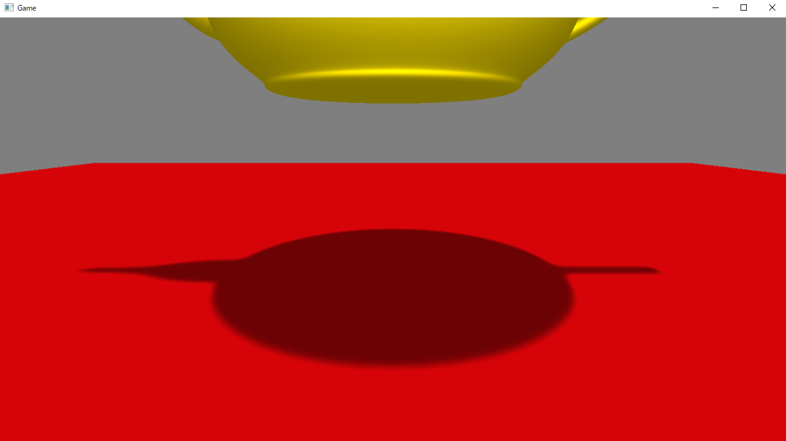</img></br>

## 11.5 カスケードシャドウ
シャドウイングの最後の内容として、カスケードシャドウ法について解説します。現在のハイエンドゲームの影生成技法はカスケードシャドウ＋ソフトシャドウという手法がディファクトスタンダードとなっています。

## 11.5.1 ジャギーとの戦い
ここまで、シャドウマップ法をベースとしたアルゴリズムはいくつか見てきました。シャドウマップ法のアルゴリズムの進化は影のジャギーとの戦いの歴史です。シャドウマップ法は、シャドウマップと影の投影面の解像度の違いでジャギーが発生するという問題があります(図11.25)。</br>
**図11.25**</br>
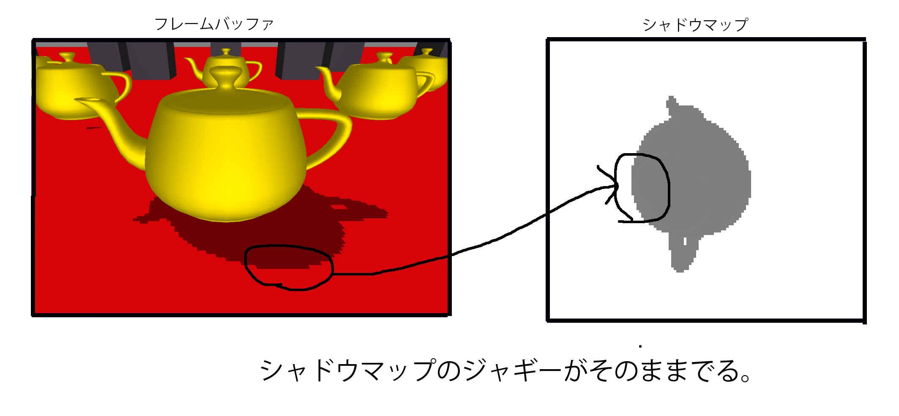</img></br>
シャドウマップ法はシャドウマップに描き込まれたオブジェクトの影しか落とすことができないため、広範囲に影を落とそうとすると、どうしても解像度が足りなくなり、ジャギーが発生してしまいます(図11.26)。</br>

**図11.26**</br>
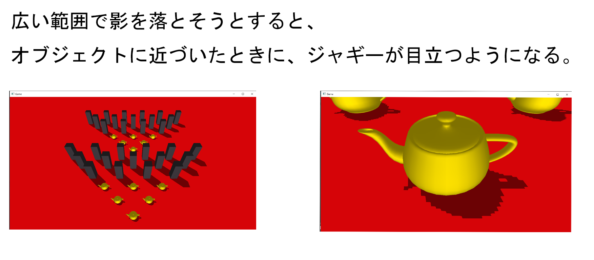</img></br>

ジャギーはソフトシャドウをかけることによって軽減することはできるのですが、そもそもシャドウマップに書き込まれている情報が不足しているため、ソフトシャドウをかけたとしても品質の低い影表現となってしまいます(図11.27)。</br>
**図11.27**</br>
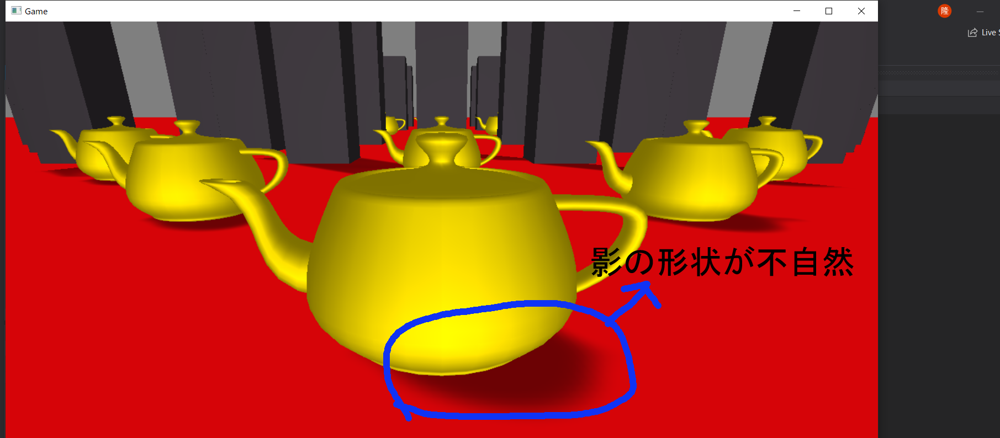</img></br>
この解像度による品質劣化を改善するために、Perspective Shadow Map(PSM)、Light Scpace Perspective Shadow Map(LSPSM)など様々なアルゴリズムが開発されてきました。しかし、それらの多くのアルゴリズムは、特定の条件下で品質が劣化し、通常のシャドウマップ技法と変わらなくなるという問題点を抱えていました。カスケードシャドウマップもその流れで開発されたアルゴリズムなのですが、その他の影生成アルゴリズムと比べて、実装難易度、扱いやすさ、品質のバランスが高く、現在の影生成技法のデファクトスタンダードになっている手法です。

## 11.5.2 どこの影が一番きれいに見えてほしい？
カスケードシャドウ法について考える前に、一旦ゲームのユーザー視点に戻って考えてみましょう。あなたがゲームを遊んでいて一番影が綺麗に見えてほしい箇所はどこでしょうか？図11.28を見てみて下さい。恐らく最も影が綺麗に見えてほしいのは、カメラから近い場所。画面上アップになっている場所だと思います。一方、画面から離れている場所については、そもそも画面に移っている範囲が小さいため、多少影が汚くても分かりません。</br>
**図11.28**</br>
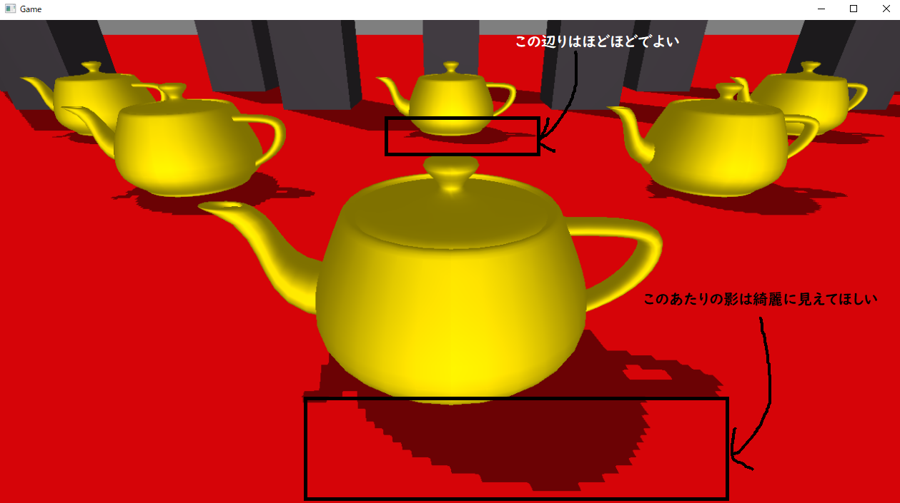</img></br>
PSM、LSPSM、そしてカスケードシャドウもこの観点から影の品質を向上を行うアルゴリズムで、画面に近いエリアほど影を綺麗に描画して、画面から遠いエリアの影はほどほどで描画するという手法になります。PSMやLSPSMはこの問題を一枚のシャドウマップで解決しようとするアルゴリズムですが、カスケードシャドウマップは複数枚のシャドウマップを利用することでこの問題の解決を行います。

## 11.5.3 複数枚のシャドウマップ
カスケードシャドウマップは複数枚のシャドウマップを利用することで影の品質を向上させます。PSMやLSPSMは一枚のシャドウマップを使って、線形代数的な工夫を行って品質向上を行うのですが、それらに比べると、いささか力技で強引な解決法のように感じるかもしれません。ですが、非常にシンプルな考え方で高品質な影を実装できるため、非常にバランスの良い影生成手法だと言えます。カスケードシャドウマップは近距離描画用のシャドウマップ、中距離描画用のシャドウマップ、遠距離描画用のシャドウマップというように、カメラからの距離に応じて使用するシャドウマップを変更します。そして、近距離の描画ほど、高い解像度で狭いエリアを描画します。</br>
**図11.29**</br>
<!-- ネットから拾ってきた画像を加工しています。-->
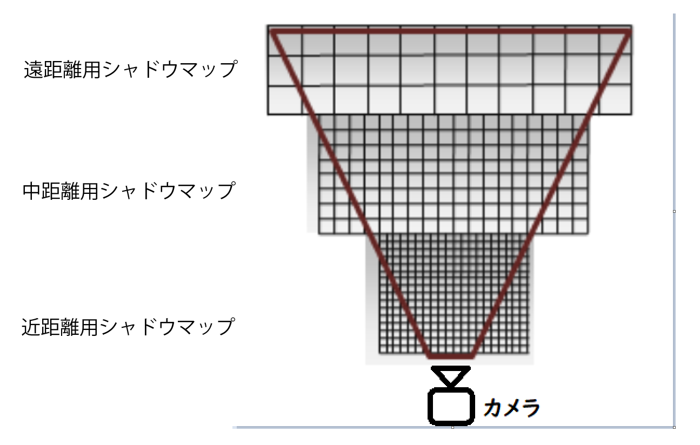</img></br>

## 11.5.4 アルゴリズムの流れ
では、カスケードシャドウのアルゴリズムの流れについて見ていきましょう。
1. 分割エリアを定義する
2. 分割エリアを描画するためのライトビュープロジェクション行列を計算する。
3. 複数枚のシャドウマップにシャドウキャスターモデルを描画する。
4. 複数枚のシャドウマップを利用してシャドウレシーバーを描画する。

では、各ステップ詳細に見ていきましょう。
### 11.5.4.1 分割エリアを定義する
分割エリアの定義とは、カメラからどこまでの距離を近距離、中距離、遠距離とするかを定義するものです。この分割エリアを適切に計算するためのアルゴリズムなどもあるのですが、今回は、分割エリアは単なる配列の固定値で定義しています。次の疑似コードを見てください。
```cpp
float splitAreaTbl[] = {
	500.0f,		//近距離
	2000.0f,	//中距離
	5000.0f		//遠距離
};
```
このテーブルは、カメラから距離500以内を近距離、500～2000を中距離、2000～5000を遠距離と定義しています。このデータを使って、2番のライトビュープロジェクション行列を計算します。
<note>
今回はカスケードシャドウマップのアルゴリズムに焦点をあてるため、分割距離の定義はシンプルなものにしています。webに無料で公開されている、GPU Gems3などに分割距離の計算のアルゴリズムのParallel-Split ShadowMapsなどが公開されていますので、興味がある方は参照してみて下さい。</br>
https://developer.nvidia.com/gpugems/gpugems3/part-ii-light-and-shadows/chapter-10-parallel-split-shadow-maps-programmable-gpus
</note>

### 11.5.4.2 分割エリアを描画するためのライトビュープロジェクション行列を計算する。
続いて、分割エリアを描画するためのライトビュープロジェクション行列の計算です。カスケードシャドウでは、ここが一番難しい話になるかと思います。カスケードシャドウ技法では、分割エリアの定義に従って、各距離のオブジェクトを適切なシャドウマップに必ず描画する必要があります。そのため、各エリアのオブジェクトを正しくシャドウマップに描画するためのライトビュープロジェクション行列を計算する必要があります。行列の計算手順は次のようになります。
1. 通常のデプスシャドウマップ技法用のライトビュープロジェクション行列を作成する。
2. 分割エリアの定義にしたがって、各エリアを内容する視錐台の8頂点を求める。
3. 2で求めた各エリアの8頂点をライトビュープロジェクション空間に変換する。
4. 3で求めた8頂点の最大値と最小値を利用して、ライトビュープロジェクション空間に収めるためのクロップ行列を計算する。
5. ライトビュープロジェクション行列とクロップ行列を乗算して最終的な行列を求める。

では、各ステップ詳細に見ていきましょう。
#### 1. 通常のデプスシャドウマップ技法用のライトビュープロジェクション行列を作成する。
これは特別な説明は不要かと思います。通常のデプスシャドウマップと同じです。ライトをカメラと見立てて、ライトビュープロジェクション行列を求めてください。なお、今回のサンプルではプロジェクション行列に平行投影行列を利用しています。平行投影行列を利用すると、遠近感がない絵を描画することができます。遠近感がないということは、光源から近くだろうが、遠くだろうが大きさが変わらないということです。例えば、地球上でジャンプして太陽との距離が多少変わったところで影の大きさは変わりません。ですので、太陽などで生じる影は平行投影行列を利用するのが良いでしょう。

#### 2.分割エリアの定義に従って、各エリアを内包する視錐台の8頂点を求める。
続いて、分割エリアの定義に従って、各エリアを内包する8頂点を求めます。図11.30を見てください。</br>
**図11.30**</br>
<!-- ネットから拾ってきた画像を加工しています。-->
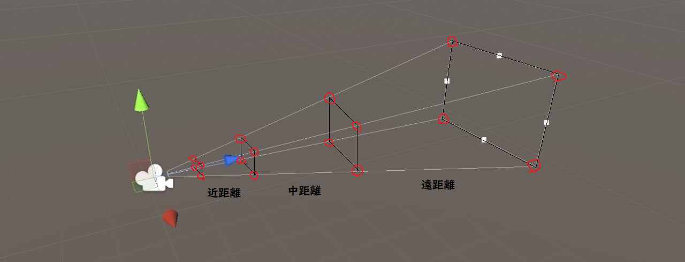</img></br>
図11.30に〇でマークしている頂点を求めます。各エリアで8頂点なので、近、中、遠なら3×8の24頂点を求めます（実際には、重複する頂点があるので、16頂点求めればOKです)。この頂点は、カメラの各種情報(位置、画角、前方方向、アスペクト比、カメラの上方向)が分かっていれば、簡単な三角比を利用することで求めることができます。図11.31を見てください。

**図11.31**</br>
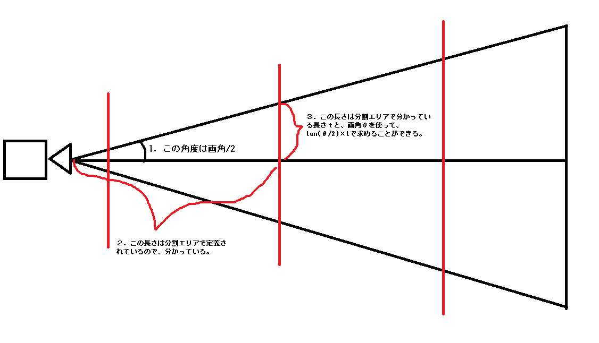</img></br>
図11.31は視錐台を横から見ている図です。この図に記載されている3番目の辺の長さを求めることができたら、8頂点を求めることができます。図にも記載していますが、この辺の長さは、画角と分割エリアの範囲が分かっていれば、tan関数を利用することで求めることができます。リスト11.43は近影エリアを内包する８頂点を求めるために、カメラの各種情報と、距離テーブルを定義している疑似コードです。

[リスト11.43 疑似コード]
```cpp
//シャドウマップを分割する距離テーブル。
float cascadeAreaTbl[NUM_SHADOW_MAP] = {
	500,					//近影を映す最大深度値。
	2000,					//中影を映す最大深度値。
	g_camera3D->GetFar(),	//遠影を映す最大深度値。
};
//nearDepthはエリアの最小深度値を表す。
//近影エリア最小深度値はカメラのニーアクリップ。
float nearDepth = g_camera3D->GetNear();
//近影エリアの最大深度値を距離テーブルから引っ張ってくる。
float farDepth = cascadeAreaTbl[0];

////////////////////////////////////////////////////////////////
// ここから下のカメラ関係のパラメータは、
// 本書が提供しているMiniEngineのCameraクラスで計算済みのものを利用している。
////////////////////////////////////////////////////////////////
//視点
Vector3 cameraPos = g_camera3D->GetPosition();
//カメラの前方向
Vector3 cameraForward = g_camera3D->GetForward();
//カメラの右方向
Vector3 cameraRight = g_camera3D->GetRight();
//カメラの上方向は前方方向と右方向の外積で求められる。
Vector3 cameraUp;
cameraUp.Cross( camera);
//画角
float viewAngle = g_camera3D->GetViewAngle();
//アスペクト比
float accpect = g_camera3D->GetAspect();

```
続いて、リスト11.44のコードは近影エリアの最小深度の4頂点を求める疑似コードです。ここで三角比を利用して、4頂点を求めています。このプログラムで求めているものを図11.32で示しますので、そちらも参照してみてください。</br>

[リスト11.44 疑似コード]
```cpp
Vector3 vertex[8];
//１.最小深度の平面の中心座標を求める。
Vector3 nearClipCneterPos = cameraPos + forward * nearDepth;

//２．近影エリアの最小深度の上面までの長さを変数yに求める。
float y = tanf(viewAngle*0.5f) * nearDepth;
//３．右面までの長さを変数xに求める。
//アスペクト比は縦の長さに対しての横の長さの比率なので
//縦の長さに乗算してやれば求まる。
float x = y * asspect;

//４．４頂点を求める。
vertex[0] = nearClipCneterPos + cameraUp *  y + cameraRight *  x;
vertex[1] = nearClipCneterPos + cameraUp *  y + cameraRight * -x;
vertex[2] = nearClipCneterPos + cameraUp * -y + cameraRight *  x;
vertex[3] = nearClipCneterPos + cameraUp * -y + cameraRight * -x;
```
**図11.32**</br>
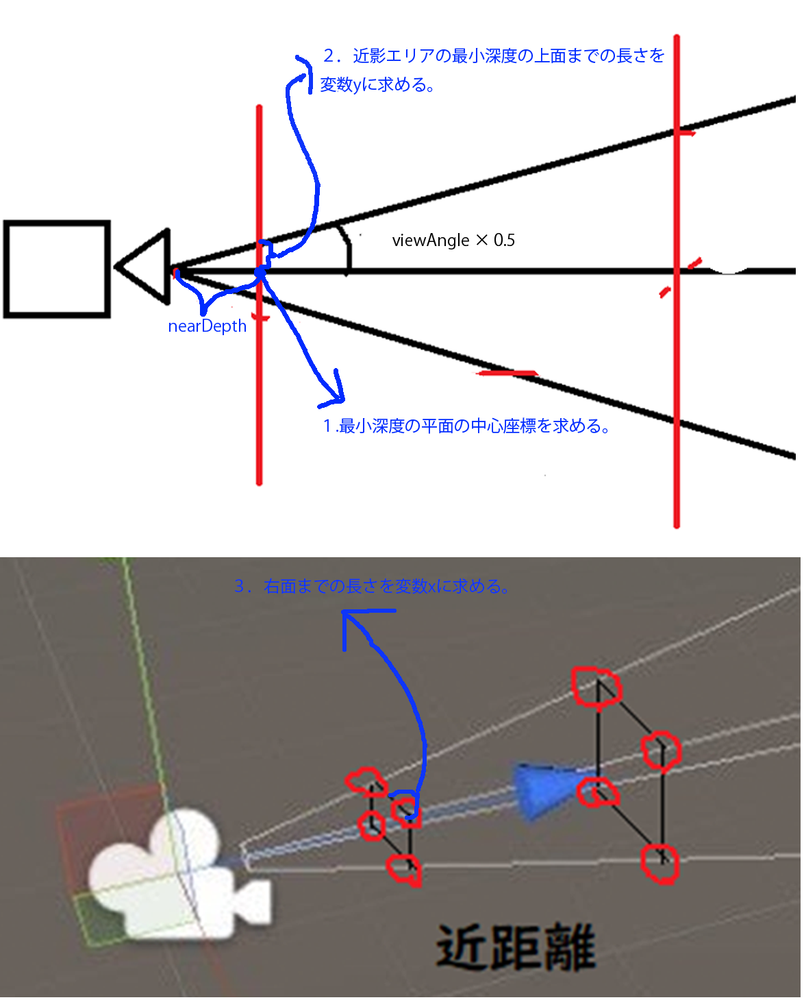</img></br>

続いて、リスト11.45に近影エリアの最深深度の4頂点を求める疑似コードを示します。この疑似コードは最小深度の4頂点を求める考え方と全く同じです。</br>
[リスト11.45 疑似コード]
```cpp
//１.最大深度の平面の中心座標を求める。
Vector3 farClipCneterPos = cameraPos + forward * farDepth;

//２．近影エリアの最大深度の上面までの長さを変数yに求める。
y = tanf(viewAngle*0.5f) * farDepth;
//３．右面までの長さを変数xに求める。
//アスペクト比は縦の長さに対しての横の長さの比率なので
//縦の長さに乗算してやれば求まる。
x = y * asspect;

//４．４頂点を求める。
vertex[4] = farClipCneterPos + cameraUp *  y + cameraRight *  x;
vertex[5] = farClipCneterPos + cameraUp *  y + cameraRight * -x;
vertex[6] = farClipCneterPos + cameraUp * -y + cameraRight *  x;
vertex[7] = farClipCneterPos + cameraUp * -y + cameraRight * -x;
```

#### 2で求めた各エリアの8頂点をライトビュープロジェクション空間に変換する。
続いて、2で求めた8頂点をライトビュープロジェクション空間に変換します(リスト11.46)。</br>[リスト11.45 疑似コード]
```cpp
//エリアを内包する視錐台の8頂点をライトビュープロジェクション空間に変換する
for (int i = 0; i < 8; i++) {
	lvpMatrix.Apply(vertex[i]);
}
```

#### 3で求めた8頂点の最大値と最小値を利用して、ライトビュープロジェクション空間に収めるためのクロップ行列を計算する。
さて、ここからが各エリアを分割エリアの定義に従って、各距離のオブジェクトを適切なシャドウマップに必ず描画するためのトリックになります。今定義されているライトビュープロジェクション行列はライトを適当な場所に設置しているため、どこのエリアを写すかは分かりません。これを補正するための行列がクロップ行列です。各エリアごとのクロップ行列を計算して、その行列をライトビュープロジェクション行列に乗算することで、該当エリアのオブジェクトをすべてシャドウマップに描画することができるようになります。</br>
では、２で求めたライトビュープロジェクション空間の視錐台の8頂点について考えていきましょう。シャドウマップに全てのオブジェクトを描画するということは、変換された視錐台の8頂点が正規化スクリーン座標系の-1～1の範囲に収まっていれば良いことになります。しかし、今はライトの位置が適当な位置になっているため、変換後の8頂点は-1～1の範囲に綺麗には収まってはいないでしょう。もちろん奇跡的に収まっていることもあるかもしれませんが、その場合、その他のエリアがはみ出しているはずです。そこで視錐台の8頂点を-1～1の範囲に収めるための行列、クロップ行列を求めます。そしてこの行列をライトビュープロジェクション行列に乗算します。そうすると、この行列で座標変換されたオブジェクトの頂点座標は、ライトビュープロジェクション空間にちょうど収まるように補正されることになるので、必ず画面に収まるようになります。では、クロップ行列とは一体何のか？これはそれほど難しい行列ではなく、単なる拡大行列 × 平行移動行列です。図11.33を見てください。これは、あるエリアの8頂点をライトビュースクリーン空間に座標変換したものです。全て、-1～1の範囲から外れています。</br>
**図11.33**</br>
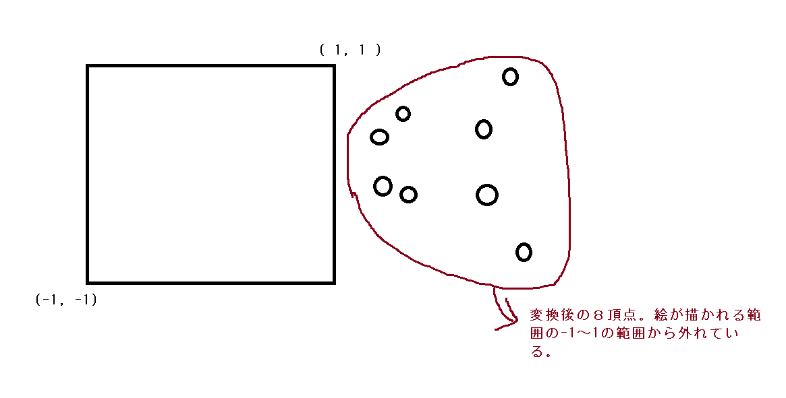</img></br>

この８頂点を画面に収める��め��は��まず８頂点の最大値と最小値を求めて、8頂点を内包するAABBをまず求めます(図11.34)。</br>
**図11.34**</br>
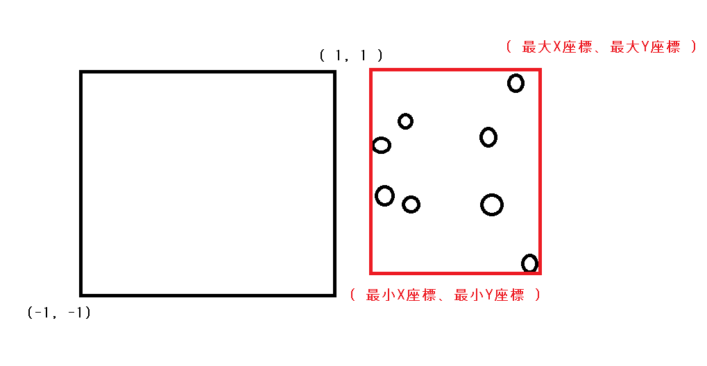</img></br>
８頂点の最大値と最小値を求めることができたら、このAABBが正規化スクリーン座標系にピッタリフィットするような拡大率を求めます。個の拡大率は正規化スクリーン座標系の幅と高さの長さが2なので、次のようなプログラムで求めることができます。</br>

```cpp
float xScale = 2.0f / (vMax.x - vMin.x);
float yScale = 2.0f / (vMax.y - vMin.y);
```
このプログラムで求めているものを図11.35で示します。</br>
**図11.35**</br>
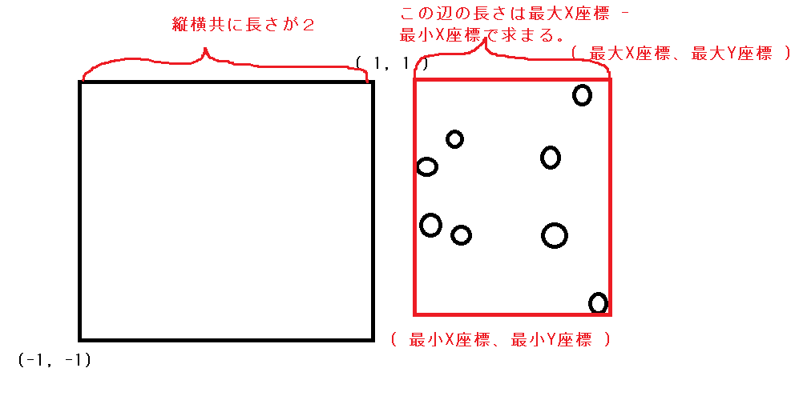</img></br>

拡大率を求めることができたら、最後は座標を-1～1の範囲に収まるようにずらします。これは、拡大した最大値、最小値を利用して、AABBの中心座標を求めて、その分平行移動してやることで求めることができます。この平行移動を求めるプログラムを次に示します。</br>
```cpp
float xOffset = (vMax.x + vMin.x) * -0.5f * xScale;
float yOffset = (vMax.y + vMin.y) * -0.5f * yScale;
```
このプログラムで求めているものを図11.36で示します。</br>
**図11.36**</br>
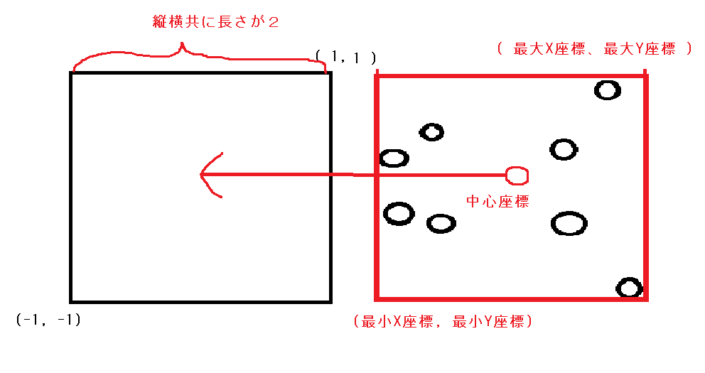</img></br>
これで8頂点を内包するAABBをシャドウマップにぴったりと収めるための拡大率と平行移動量が求まりました。後はこれらを利用して、クロップ行列を作成計算します。

```cpp
//クロップ行列を求める。
Matrix clopMatrix;
clopMatrix.m[0][0] = xScale;
clopMatrix.m[1][1] = yScale;
clopMatrix.m[3][0] = xOffset;
clopMatrix.m[3][1] = yOffset;

```

#### ライトビュープロジェクション行列とクロップ行列を乗算して最終的な行列を求める。
では、いよいよ最後です。最後は先ほど求めたクロップ行列をライトビュープロジェクション行列に乗算するだけです。これで、後は普通のデプスシャドウマップと同じように、作成した行列を使って、座標変換して、シャドウマップに描画、シャドウレシーバーに影を落としていくだけです。</br>

```cpp
//ライトビュープロジェクション行列にクロップ行列を乗算する。
lvpMatrix = lvpMatrix * clopMatrix;
```

## 11.5.5【ハンズオン】カスケードシャドウマップを実装しよう
では、`Smaple_11_06/Sample_11_06.sln`を開いて、カスケードシャドウマップを実装していきましょう。
### step-1 シャドウマップの枚数を定数で定義する。
まずはシャドウマップの枚数の定数を定義しましょう。main.cppの37行目にリスト11.46のプログラムを入力してください。</br>
[リスト11.46 main.cpp]
```cpp
//step-1 シャドウマップの枚数を定数で定義する。
const int NUM_SHADOW_MAP = 3;
```
### step-2 ライトビュープロジェクションクロップ行列の配列を定義する。
続いて、ライトビュープロジェクションクロップ行列の配列を定義します。近、中、遠の３エリアをシャドウマップに描画する必要があるので、行列も３つ必要です。では、main.cppにリスト11.47のプログラムを入力してください。</br>
[リスト11.47 main.cpp]
```cpp
//step-2 ライトビュープロジェクションクロップ行列の配列を定義する。
Matrix lvpcMatrix[NUM_SHADOW_MAP];
```

### step-3 シャドウマップを書き込むレンダリングターゲットを３枚用意する。
step-3では、シャドウマップを書き込むためのレンダリングターゲットを３枚用意します。遠景のシャドウマップになるほど、解像度が小さくなっていっていることに注目してリスト11.48のプログラムをmain.cppに入力してください。</br>
[リスト11.48 main.cpp]
```cpp
//step-3 シャドウマップを書き込むレンダリングターゲットを３枚用意する。
RenderTarget shadowMaps[NUM_SHADOW_MAP];
//近影用のシャドウマップ。
shadowMaps[0].Create(
	2048, 
	2048, 
	1, 
	1, 
	DXGI_FORMAT_R32_FLOAT,
	DXGI_FORMAT_D32_FLOAT,
	clearColor
);
//中影用のシャドウマップ。
shadowMaps[1].Create(
	1024,
	1024,
	1,
	1,
	DXGI_FORMAT_R32_FLOAT,
	DXGI_FORMAT_D32_FLOAT,
	clearColor
);
//遠影用のシャドウマップ。
shadowMaps[2].Create(
	512,
	512,
	1,
	1,
	DXGI_FORMAT_R32_FLOAT,
	DXGI_FORMAT_D32_FLOAT,
	clearColor
);
```

### step-4 分割エリアの最大深度値を定義する。
続いて、分割エリアの最大深度テーブルを定義しましょう。今回は一番最後の最大深度値はカメラのFarクリップにしています。こうすることで、カメラに映る範囲すべてのオブジェクトの影を落とすことができるようになります。では、main.cppにリスト11.49のプログラムを入力してください。</br>
[リスト11.49 main.cpp]
```cpp
//step-4 分割エリアの最大深度値を定義する。
float cascadeAreaTbl[NUM_SHADOW_MAP] = {
	500,					//近影を映す最大深度値。
	2000,					//中影を映す最大深度値。
	g_camera3D->GetFar(),	//遠影を映す最大深度値。３枚目の最大深度はカメラのFarクリップ。
};
```

### step-5 影を受ける背景モデルを初期化。
続いて、影を受ける背景モデルを初期化します。シャドウレシーバーモデルは３枚のシャドウマップと、３つのライトビュープロジェクションクロップ行列を利用して、影を落とします。拡張SRVにテクスチャを３つ、拡張定数バッファにライトビュープロジェクションクロップ行列の配列を設定している点に注目して、リスト11.50のプログラムを入力してください。</br>
[リスト11.50 main.cpp]
```cpp
//step-5 影を受ける背景モデルを初期化。
ModelInitData bgModelInitData;
//シャドウレシーバー(影が落とされるモデル)用のシェーダーを指定する。
bgModelInitData.m_fxFilePath = "Assets/shader/sampleShadowReciever.fx";
//【注目】シャドウマップを拡張SRVに設定する。
bgModelInitData.m_expandShaderResoruceView[0] = &shadowMaps[0].GetRenderTargetTexture();
bgModelInitData.m_expandShaderResoruceView[1] = &shadowMaps[1].GetRenderTargetTexture();
bgModelInitData.m_expandShaderResoruceView[2] = &shadowMaps[2].GetRenderTargetTexture();
//【注目】ライトビュープロジェクションクロップ行列を拡張定数バッファに設定する。
bgModelInitData.m_expandConstantBuffer = (void*)lvpcMatrix;
bgModelInitData.m_expandConstantBufferSize = sizeof(lvpcMatrix);
bgModelInitData.m_tkmFilePath = "Assets/modelData/bg/bg.tkm";

Model bgModel;
bgModel.Init(bgModelInitData);
```
### step-6 カメラの前方向、右方向、上方向を求める。
ここからはゲームループの処理です。まずはライトビュープロジェクションクロップ行列を計算するために必要な、カメラの各種情報を計算します。リスト11.51のプログラムを入力してください。</br>
[リスト11.51 main.cpp]
```cpp
//step-6 カメラの前方向、右方向、上方向を求める。
//前方向と右方向はすでに計算済みなので、それを引っ張ってくる。
const auto& cameraForward = g_camera3D->GetForward();
const auto& cameraRight = g_camera3D->GetRight();
//カメラの上方向は前方向と右方向の外積で求める。
Vector3 cameraUp;
cameraUp.Cross( cameraForward, cameraRight );
```

### step-7 エリアを内包する視錐台の８頂点を求める。
step-7からは３枚のカスケードシャドウへの描画のループ内の処理です。step-7～step-11までのプログラムは、３枚のシャドウマップに対して行う処理になるため、計３回実行されます。では、まずは描画しようとしているエリアの８頂点を求めるプログラムを入力しましょう。これは11.5.4.2で勉強した、カメラの画角と三角比を使って求める処理です。では、リスト11.52のプログラムをmain.cppに入力してください。
[リスト11.52 main.cpp]
```cpp
//step-7 エリアを内包する視錐台の８頂点を求める。
//エリアの近平面の中心からの上面、下面までの距離を求める。
float nearY = tanf(g_camera3D->GetViewAngle() * 0.5f) * nearDepth;
//エリアの近平面の中心からの右面、左面までの距離を求める。
float nearX = nearY * g_camera3D->GetAspect();

//エリアの遠平面の中心からの上面、下面までの距離を求める。
float farY = tanf(g_camera3D->GetViewAngle()*0.5f) * cascadeAreaTbl[areaNo];
//エリアの遠平面の中心からの右面、左面までの距離を求める。
float farX = farY * g_camera3D->GetAspect();

//エリアの近平面の中心座標を求める。
Vector3 nearPos = g_camera3D->GetPosition() + cameraForward * nearDepth;
//エリアの遠平面の中心座標を求める。
Vector3 farPos = g_camera3D->GetPosition() + cameraForward * cascadeAreaTbl[areaNo];

//8頂点を求める。
Vector3 vertex[8];
//近平面の右上の頂点。
vertex[0] += nearPos + cameraUp *  nearY + cameraRight *  nearX;
//近平面の左上の頂点。
vertex[1] += nearPos + cameraUp *  nearY + cameraRight * -nearX;
//近平面の右下の頂点。
vertex[2] += nearPos + cameraUp * -nearY + cameraRight *  nearX;
//近平面の左下の頂点。
vertex[3] += nearPos + cameraUp * -nearY + cameraRight * -nearX;

//遠平面の右上の頂点。
vertex[4] += farPos + cameraUp *  farY + cameraRight *  farX;
//遠平面の左上の頂点。
vertex[5] += farPos + cameraUp *  farY + cameraRight * -farX;
//遠平面の右下の頂点。
vertex[6] += farPos + cameraUp * -farY + cameraRight *  farX;
//遠平面の左下の頂点。
vertex[7] += farPos + cameraUp * -farY + cameraRight * -farX;
```
### step-8 8頂点をライトビュープロジェクション空間に変換して、8頂点の最大値、最小値を求める。
8頂点を求めることができたら、ライトビュープロジェクション空間に変換して、ライトビュープロジェクション空間での最大値、最小値を求めます。main.cppにリスト11.53のプログラムを入力してください。</br>
[リスト11.53 main.cpp]
```cpp
//step-8 8頂点をライトビュープロジェクション空間に変換して、8頂点の最大値、最小値を求める。
Vector3 vMax, vMin;
vMax = { -FLT_MAX, -FLT_MAX, -FLT_MAX };
vMin = {  FLT_MAX,  FLT_MAX,  FLT_MAX };
for (auto& v : vertex) {
	lvpMatrix.Apply(v);
	vMax.Max(v);
	vMin.Min(v);
}
```
### step-9 クロップ行列を求める。
ライトビュープロジェクション空間での８頂点の最大値、最小値を求めることができたので、これらの頂点をライトビュープロジェクション空間の-1～1の範囲に収めるためのクロップ行列を計算します。リスト11.54のプログラムを入力してください。</br>
[リスト11.54 main.cpp]
```cpp
//step-9 クロップ行列を求める。
float xScale = 2.0f / (vMax.x - vMin.x);
float yScale = 2.0f / (vMax.y - vMin.y);
float xOffset = (vMax.x + vMin.x) * -0.5f * xScale;
float yOffset = (vMax.y + vMin.y) * -0.5f * yScale;
Matrix clopMatrix;
clopMatrix.m[0][0] = xScale;
clopMatrix.m[1][1] = yScale;
clopMatrix.m[3][0] = xOffset;
clopMatrix.m[3][1] = yOffset;
```

### step-10 ライトビュープロジェクション行列にクロップ行列を乗算する。
クロップ行列を求めることができたので、ライトビュープロジェクション行列にクロップ行列を乗算した行列を求めます。この行列がシャドウマップにオブジェクトを描画するときと、シャドウレシーバーに影を落とすときに使われる行列です。では、リスト11.55のプログラムを入力してください。</br>
[リスト11.55 main.cpp]
```cpp
//step-10 ライトビュープロジェクション行列にクロップ行列を乗算する。
lvpcMatrix[areaNo] = lvpMatrix * clopMatrix;
```
### step-11 シャドウマップにレンダリング。
ライトビュープロジェクションクロップ行列を計算することができたので、シャドウマップに影を落とすオブジェクトを描画していきましょう。リスト11.56のプログラムを入力してください。</br>
[リスト11.56 main.cpp]
```cpp
//step-11 シャドウマップにレンダリング。
//レンダリングターゲットをシャドウマップに変更する。
renderContext.WaitUntilToPossibleSetRenderTarget(shadowMaps[areaNo]);
renderContext.SetRenderTargetAndViewport(shadowMaps[areaNo]);
renderContext.ClearRenderTargetView(shadowMaps[areaNo]);

//影モデルを描画。
testShadowModel[areaNo].Draw(renderContext, g_matIdentity, lvpcMatrix[areaNo]);

//書き込み完了待ち。
renderContext.WaitUntilFinishDrawingToRenderTarget(shadowMaps[areaNo]);
```

### step-12 ライトビュープロジェクションクロップ行列にアクセスするための定数バッファを定義。
step12からはシェーダー側の実装になります。カスケードシャドウでは、シャドウマップを作成する処理に特別な処理はないので、sampleDrawShadowMap.fxは改造せずに、影を落とす処理が記述されているsampleShadowReciever.fxのみ改造していきます。まずは、ライトビュープロジェクションクロップ行列にアクセスするための定数バッファを定義しましょう。Asset/shader/sampleShadowReciever.fxの11行目にリスト11.57のプログラムを入力してください。</br>
[リスト11.57　sampleShadowReciever.fx]
```cpp
//step-12 ライトビュープロジェクションクロップ行列にアクセスするための定数バッファを定義。
cbuffer ShadowParamCb : register(b1){
	float4x4 mLVPC[3];		//ライトビュープロジェクションクロップ行列。
};
```
### step-13 ライトビュースクリーン空間での座標を追加。
今回の実装では、エリアが３つあるので、３つのライトビュースクリーン空間の座標を計算して、ピクセルシェーダーに渡す必要があります。リスト11.58のプログラムを入力して、ピクセルシェーダーへの入力データを追加してください。</br>
[リスト11.58 sampleShadowReciever.fx]
```cpp
//step-13 ライトビュースクリーン空間での座標を追加。
float4 posInLVP[3]	: TEXCOORD1;	//ライトビュースクリーン空間でのピクセルの座標

```
### step-14 近～中距離のシャドウマップにアクセスするための変数を定義。
続いて、各エリアのシャドウマップにアクセスする��めの変数を定義します。リスト11.59のプログラムを入力してください。</br>
[リスト11.59 sampleShadowReciever.fx]
```cpp
//step-14 近～中距離のシャドウマップにアクセスするための変数を定義。
Texture2D<float4> g_shadowMap_0 : register(t10);	//近距離のシャドウマップ。
Texture2D<float4> g_shadowMap_1 : register(t11);	//中距離のシャドウマップ。
Texture2D<float4> g_shadowMap_2 : register(t12);	//遠距離のシャドウマップ。

```
### step-15 ライトビュースクリーン空間の座標を計算する。
では、頂点シェーダーを改造します。頂点シェーダーでは３つのライトビュープロジェクションクロップ行列を利用して、座標返還を行います。リスト11.60のプログラムを入力してください。</br>
[リスト11.60 sampleShadowReciever.fx]
```cpp
//step-15 ライトビュースクリーン空間の座標を計算する。
psIn.posInLVP[0] = mul( mLVPC[0], worldPos);
psIn.posInLVP[1] = mul( mLVPC[1], worldPos);
psIn.posInLVP[2] = mul( mLVPC[2], worldPos);
```
### step-16 ３枚のシャドウマップを使って、シャドウレシーバーに影を落とす。
では、いよいよ最後です。３枚のシャドウマップを使って、影を落とすプログラムをピクセルシェーダーに実装しましょう。やっていることは単一のシャドウマップでやっていたことを、３枚分行っているだけです。では、リスト11.61のプログラムを入力してください。</br>
[リスト11.61 sampleShadowReciever.fx]
```cpp
//step-16 ３枚のシャドウマップを使って、シャドウレシーバーに影を落とす。
for( int cascadeIndex = 0; cascadeIndex < 3; cascadeIndex++){		
	//ライトビュースクリーン空間でのZ値を計算する。
	float zInLVP = psIn.posInLVP[cascadeIndex].z  / psIn.posInLVP[cascadeIndex].w;
	if( zInLVP >= 0.0f && zInLVP <= 1.0f ){
		//Zの値を見て、このピクセルがこのシャドウマップに含まれているか判定。
		float2 shadowMapUV = psIn.posInLVP[cascadeIndex].xy / psIn.posInLVP[cascadeIndex].w;
		shadowMapUV *= float2( 0.5f, -0.5f);
		shadowMapUV += 0.5f; 
		//シャドウマップUVが範囲内か判定。
		if( shadowMapUV.x >= 0.0f && shadowMapUV.x <= 1.0f
			&& shadowMapUV.y >= 0.0f && shadowMapUV.y <= 1.0f ){ 
			//シャドウマップから値をサンプリング。
			float2 shadowValue = shadowMapArray[cascadeIndex].Sample(g_sampler, shadowMapUV).xy;;
			//まずこのピクセルが遮蔽されているか調べる。
			if( zInLVP >= shadowValue.r){
				color.xyz *= 0.5f;
				//影を落とせたので終了。
				break;
			}		
		}

	} 
}
```
ここまで入力出来たら実行して、コントローラーの右スティックと左スティックを操作して、カメラを動かしてみてください。近景の影は綺麗に落ちており、遠景に行っても影が落ちているかと思います(図11.37)。注意深く影を見てみると、シャドウマップの切り替わりが分かるかと思います。</br>
**図11.37**</br>
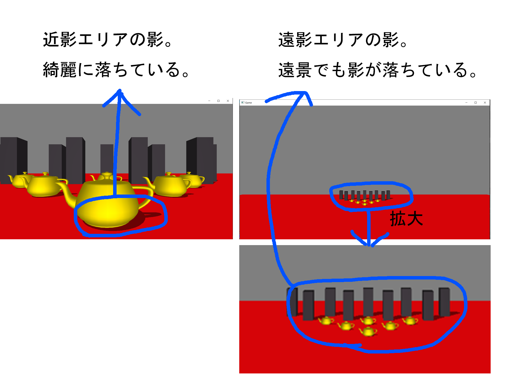</img></br>


<!-- 改ページ. -->
<div style="page-break-before:always"></div>


# Chapter 12 ディファードレンダリング
&emsp;このチャプターでは現在主流になってきているディファードレンダリングについてみていきます。
## 12.1 フォワードレンダリング
&emsp;ディファードレンダリングを見ていく前に、まずは、3Dゲームの黎明期から進化してきたレンダリング手法のフォワードレンダリングについて見ていきましょう。フォワードレンダリングを端的に説明すると、**「ポリゴンをレンダリングする時にライティングの計算を行う」**というものです。モデルのDrawを行うと頂点シェーダー、ピクセルシェーダーが実行されてピクセルカラーが決まります。このタイミングでライティングを行うのがフォワードレンダリングです。これまで皆さんが実装してきたものは全てフォワードレンダリングとなります。
## 12.2 ディファードレンダリング
&emsp;ディファードレンダリングはxbox360、PlayStation3のころに生まれたレンダリング手法で、比較的新しい手法となっています。特にPlayStation3はこの手法が向いているアーキテクチャだったため、ディファードレンダリングが採用されているゲームがいくつかありました。ディファードレンダリングを端的に説明すると「ポリゴンをレンダリングする時にはライティングの計算は行わずに後で行う。」というものです。Deferredは遅延という意味なので、遅延レンダリングとも呼ばれます。フォワード系に慣れ親しんでいるとピンと来ないかもしれません。ライティングの計算をポストエフェクト的に行うと言った方が理解しやすいかもしれませんね。

### 12.2.1 G-Buffer
&emsp;ではディファードレンダリングで使用されるG-Bufferについてみていきましょう。ディファードレンダリングではポリゴンをレンダリングする時にはライティングの計算は行わずにMRT(MultiRenderingTarget)を活用して、複数枚のテクスチャ(G-Bufferと呼ばれる)にテクスチャカラー、法線情報、スペキュラ強度、深度値などを書き込みます。図12.1はPlayStation3のKillzone2のG-Bufferの内容です</br>

**図12.1**</br>
</img></br>
&emsp;フォワードレンダリングでは「モデルを描画する=ライティングを行ってレンダリングターゲットに書き込む」だったのですが、ディファードレンダリング「モデルを描画する=ライティングに必要な情報をG-Bufferに書き込む。」というものになります。そして、G-Bufferを使用してポストエフェクト的にライティングの計算を行って、最終画象をレンダリングターゲットに書き込みます。

## 12.3 ディファードレンダリングのメリット
&emsp;なぜ、PlayStation3やXbox360のころからディファードレンダリングを採用しているゲームが増えてきたのでしょうか？当然増えてきたのには何か理由があります。この節ではその理由についてみていきましょう。
&emsp;PlayStation3、Xbox360が登場したことによって、家庭用ゲーム機の世界にもプログラマブルシェーダーの波が押し寄せました。映像を少しでもいいものに、ほかのゲームと違うグラフィック表現などなど、いろいろな工夫が凝らされるようになった結果、1ピクセル当たりの計算量がどんどん増えていきました。例えばPlayStation3が発売されたばかりのころの１ピクセルのプログラムは次のようなものだったと思ってください。</br>

```cpp
/*!
 *@brief	ピクセルシェーダー。
 */
float4 PSMain( VS_OUTPUT In ) : COLOR
{
	//ライトを計算。
	float4 lig = 0.0f;
	float3 normal = normalize(In.normal);
	lig.xyz = CalcDiffuse( In.normal );
	lig.xyz += CalcSpecular( In.worldPos, normal );	
	lig += g_ambientLight;
	float4 color = tex2D( g_diffuseTextureSampler, In.uv );
	color.xyz *= lig;
	return color;
}
```
これが時とともにもっと良いものを求めていった結果複雑化していき、次のようなコードになっていきました。</br>

```cpp
/*!
 * @brief	ピクセルシェーダー。
 */
PSOutput PSMain( VS_OUTPUT In )
{
	float4 color = 0.0f;
	float4 diffuseColor = tex2D(g_diffuseTextureSampler, In.Tex0);
	color = diffuseColor;
	float3 normal = normalize(In.Normal);
	if(g_flags.x){
		//法線マップあり。
		float3 tangent = normalize(In.Tangent);
		float3 binSpaceNormal = tex2D( g_normalMapSampler, In.Tex0);
		float4x4 tangentSpaceMatrix;
		float3 biNormal = normalize( cross( tangent, normal) );
		tangentSpaceMatrix[0] = float4( tangent, 0.0f);
		tangentSpaceMatrix[1] = float4( biNormal, 0.0f);
		tangentSpaceMatrix[2] = float4( normal, 0.0f);
		tangentSpaceMatrix[3] = float4( 0.0f, 0.0f, 0.0f, 1.0f );
		//-1.0～1.0の範囲にマッピングする。
		binSpaceNormal = (binSpaceNormal * 2.0f)- 1.0f;
		normal = tangentSpaceMatrix[0] * binSpaceNormal.x + tangentSpaceMatrix[1] * binSpaceNormal.y + tangentSpaceMatrix[2] * binSpaceNormal.z; 
		
	}
	float4 lig = DiffuseLight(normal);
	if(g_flags.z){
		//リムライト。
		lig.xyz += CalcLimLight(normal, g_light.limLightDir, g_light.limLightColor.xyz);
	}
	if(g_flags.w){
		//スペキュラライト。
		lig.xyz += SpecLight(normal, In.worldPos_depth.xyz, In.Tex0);
	}
	if(g_flags.y){
		//影
		lig *= CalcShadow(In.worldPos_depth.xyz);
	}
	//自己発光色
	lig.xyz += g_light.emission;
	color *= lig;
	//大気錯乱
	if(g_flags2.y == AtomosphereFuncObjectFromAtomosphere)
	{
		color = In.rayColor + color * In.mieColor;
	}
	//ポイントライト。
	color.xyz += diffuseColor.xyz * PointLight(normal, In.worldPos_depth.xyz, g_flags.z);
	//アンビエントライトを加算。
	color.xyz += diffuseColor.xyz * g_light.ambient.xyz;	
	if(g_fogParam.z > 1.9f){
		//高さフォグ
		float h = max(In.worldPos_depth.y - g_fogParam.y, 0.0f);
		float t = min(h / g_fogParam.x, 1.0f);
		color.xyz = lerp(float3(0.75f, 0.75f, 0.95f), color.xyz, t);
	}else if(g_fogParam.z > 0.0f){
		//距離フォグ
		float z = length(In.worldPos_depth.xyz - g_cameraPos);
		z = max(z - g_fogParam.x, 0.0f);
		float t = min( z / g_fogParam.y, 1.0f);
		color.xyz = lerp(color.xyz, float3(0.75f, 0.75f, 0.95f), t);
	}
	PSOutput psOut = (PSOutput)0;
	psOut.color = color;
	psOut.depth = In.worldPos_depth.w;
	if(g_flags2.x){
		psOut.velocity.xy = In.velocity.xy / In.velocity.w-In.screenPos.xy / In.screenPos.w;
		psOut.velocity.xy *= 0.5f;
		psOut.velocity.xy += 0.5f;
		psOut.velocity.zw = 0.0f;
	}else{
		//速度なし。
		psOut.velocity = 0.5f;
	}
	return psOut;
}
```
&emsp;これが１ピクセルに実行されるプログラムです。これによりピクセル単位のプログラムの処理時間が増大していきました。そこで、無駄なピクセルのプログラムは実行しないようにできないか？という考えから生まれてきたのがディファードレンダリングです。フォワードレンダリングは先にライティングを行うため、不要なピクセルのライティングが計算されてしまいます。例えば図12.2のように3Dモデルを画面の奥から手前の順番でレンダリングした場合のことを考えてみてください。</br>
**図12.2**</br>
</img></br>
&emsp;この図は顔のモデルを描画した後で、その手前に三角形の板ポリを描画している図です。これがフォワードレンダリングで行われた場合、三角形の板ポリに遮蔽された部分のライティングの計算が無駄になってしまいます。一方、ディファードレンダリングでは、モデル描画のパスではライティング計算は行わずに、G-Bufferの内容を使って、ポストエフェクト的にライティングの計算を行うため、無駄な計算は発生しません。例えば1920×1080の解像度であれば、どんな順番でモデルを描画したとしても1920×1080回のライティングの計算で完了することになります。

## 12.4 ディファードレンダリングのデメリット
&emsp;先ほどはディファードレンダリングのメリットを見ていきましたが、すべてのケースでフォワードレンダリングより優れているわけではありません。ではディファードレンダリングのデメリットについてみていきましょう。
### 12.4.1 メモリの速度と容量の問題
&emsp;ディファード系ではMRT(multiRenderingTarget)を活用するため、フォワード系に比べるとメモリ使用量が増大します。また、モデルの描画パスで複数のG-Bufferに対して書き込みを行うため、メモリの書き込み速度も問題になってきます。CPUやGPUの演算速度とメモリの読み書きの速度の差はどんどん大きくなってきています。そのため、アーキテクチャによってはディファード系の方が遅くなるというのは十分考えられます。実はディファード系がPlayStation3では増えていたが、Xbox360では増えなかったのはこれが理由です。メモリの速度とVRAMの容量がxbox360はPlayStation3より劣っていたため、ディファードに向きでした。

### 12.4.2 半透明描画の問題
&emsp;ディファード系は半透明オブジェクトの描画に弱いため、半透明のオブジェクトを描画する場合、不透明オブジェクトをディファードで描画した後でフォワードで半透明オブジェクトを描画するなどといった工夫が必要になります。そのため、半透明オブジェクトを多用する日本のゲームには向いていないといわれていました。</br>
&emsp;このようにいいことばかりではなく、ディファードの方が遅くなるケースは実はたくさんあります。最近ですとVRゲームは4K解像度の絵を右目用と左目用の２枚レンダリングを行う必要があり、ディファードでレンダリングを行うと4K解像度の複数枚のG-Bufferへの書き込みが発生してメモリ帯域を圧迫します。


## 12.5 【ハンズオン】ディファードレンダリング入門 ～ 拡散反射 ～
&emsp;では、ハンズオンでディファードレンダリングを実装してみましょう。Sample_12_0を立ち上げてください。
### step-1 	モデルを初期化。
&emsp;まず、レンダリングを行うモデルを用意します。シェーダーにmodel.fxを指定していますが、このシェーダーではライティングの計算は行っていません。このシェーダーの目的はアルベドカラーと法線をG-bufferに出力することです。</br>

[リスト 12.1 main.cpp]
```cpp
//step-1 モデルを用意。
ModelInitData modelInitData;
modelInitData.m_tkmFilePath = "Assets/modelData/unityChan.tkm";
modelInitData.m_fxFilePath = "Assets/shader/model.fx";
Model model;
model.Init(modelInitData);
```

### step-2 G-Bufferを作成
&emsp;アルベドカラーと法線を出力するためのG-Bufferを作成します。</br>
[リスト 12.2 main.cpp]
```cpp
//step-2 G-Bufferを作成。
RenderTarget albedRT;	//アルベドカラー書き込み用のレンダリングターゲット。
albedRT.Create(
	FRAME_BUFFER_W, FRAME_BUFFER_H, 
	1, 1, 
	DXGI_FORMAT_R8G8B8A8_UNORM, DXGI_FORMAT_D32_FLOAT);
RenderTarget normalRT;	//法線書き込み用のレンダリングターゲット。
normalRT.Create(
	FRAME_BUFFER_W, FRAME_BUFFER_H, 
	1, 1, DXGI_FORMAT_R8G8B8A8_UNORM, XGI_FORMAT_UNKNOWN);

```

### step-3 ポストエフェクト的にディファードライティングを行うためのスプライトを準備。
&emsp;続いて、ポストエフェクト的にライティングを行うので、画面全体にレンダリングされるスプライトを準備します。ここで指定しているsprite.fxでライティングの計算が行われます。

[リスト 12.3 main.cpp]
```cpp
//step-3 ポストエフェクト的にディファードライティングを行うためのスプライトを準備。
SpriteInitData spriteInitData;
//画面全体にレンダリングするので幅と高さはフレームバッファの幅と高さと同じ。
spriteInitData.m_width = FRAME_BUFFER_W;
spriteInitData.m_height = FRAME_BUFFER_H;
//使用するテクスチャはアルベドテクスチャと法線テクスチャ。
spriteInitData.m_textures[0] = &albedRT.GetRenderTargetTexture();
spriteInitData.m_textures[1] = &normalRT.GetRenderTargetTexture();
spriteInitData.m_fxFilePath = "Assets/shader/sprite.fx";
spriteInitData.m_expandConstantBuffer = &light;
spriteInitData.m_expandConstantBufferSize = sizeof(light);
//初期化データを使ってスプライトを作成。
Sprite defferdLightinSpr;
defferdLightinSpr.Init(spriteInitData);
```
&emsp;このスプライトの描画でモデルのドローで作成されるテクスチャが利用されます。

### step-4 レンダリングターゲットをG-Bufferに変更して書き込む。
&emsp;この箇所がフォワードレンダリングでのモデルのドローにあたる部分です。これまでここで直接フレームバッファ(画面)にレンダリングしていたのですが、ディファードではレンダリング先がG-Bufferになります。</br>
[リスト 12.4 main.cpp]
```cpp
//step-4 レンダリングターゲットをG-Bufferに変更して書き込む。
RenderTarget* rts[] = {
	&albedRT,
	&normalRT
};
//まず、レンダリングターゲットとして設定できるようになるまで待つ。
renderContext.WaitUntilToPossibleSetRenderTargets(2, rts);
//レンダリングターゲットを設定。
renderContext.SetRenderTargets(2, rts);
//レンダリングターゲットをクリア。
renderContext.ClearRenderTargetViews(2, rts);
model.Draw(renderContext);

//レンダリングターゲットへの書き込み待ち。
renderContext.WaitUntilFinishDrawingToRenderTargets(2, rts);
```
&emsp;このモデルのドローで図12.1と図12.2の２枚のテクスチャ(G-Buffer)が作成されます。この2枚のテクスチャを使用してstep-5でライティングの計算が行われます。</br>
**図12.1 アルベド**</br>
</img>

**図12.2 法線**</br>
</img></br>

### step-5 レンダリング先をフレームバッファに戻してスプライトをレンダリングする 
&emsp;G-Bufferの作成が終わったら、次はディファードライティングです。step-4で作成されたアルベドテクスチャと法線テクスチャを使ってライティングの計算が行われます。</br>
[リスト 12.5 main.cpp]
```cpp
//step-5 レンダリング先をフレームバッファに戻してスプライトをレンダリングする
g_graphicsEngine->ChangeRenderTargetToFrameBuffer(renderContext);
//G-Bufferの内容を元にしてスプライトをレンダリング。
defferdLightinSpr.Draw(renderContext);
```
&emsp;このスプライトのドローで、step-4で作成されたテクスチャを使用して、ライティングの計算がおこなれます。</br>
**図12.3 ディファードライティング**</br>
</img></br>

### step-6 G-Bufferに出力。
&emsp;続いて、シェーダー側��model.fxです。モデルシェーダーではライティングの計算のような複雑な計算は行われておらず、アルベドと法線をレンダリングターゲットに出力しているだけのシンプルなプログラムになっています。</br>
[リスト 12.6 model.fx]
```cpp
//step-6 G-Bufferに出力。
SPSOut psOut;
//アルベドカラーを出力。
psOut.albedo = g_texture.Sample(g_sampler, psIn.uv);
//法線を出力。
//出力は0～1に丸められてしまうのでマイナスの値が失われてしまう。
//なので-1～1を0～1に変換する。
//(-1 ～ 1) ÷ 2.0       = ( -0.5 ～ 0.5 )
//( -0.5 ～ 0.5) + 0.5  = (  0.0 ～ 1.0 )
psOut.normal = ( psIn.normal / 2.0f ) + 0.5f;
return psOut;
```

### step-7 G-Bufferの内容を使ってライティング。
&emsp;いよいよ最後です。sprite.fxでは作成されたG-Bufferの情報を元にライティングの計算を行います。ライティングの計算自体はフォワードレンダリングで行っているものと違いはありません。</br>
[リスト 12.6 sprite.fx]
```cpp
//step-7 G-Bufferの内容を使ってライティング。
float4 albedo = albedoTexture.Sample(Sampler, In.uv);
float3 normal = normalTexture.Sample(Sampler, In.uv).xyz;
normal = (normal * 2.0f)-1.0f;
//ライトを計算。
float3 lig = 0.0f;
float t = max( 0.0f, dot( normal, ligDirection) * -1.0f);
lig = ligColor * t;
float4 finalColor = albedo;
finalColor.xyz *= lig;
return finalColor;
```
&emsp;今回のハンズオンではライティングの計算もシンプルだったので、余り恩恵は受けませんが、この後のチャプターで勉強する物理ベースライティングでは、１ピクセル辺りのライティングの計算が更にヘビーになります。そのような重いシェーダーになってきたときはディファードレンダリングの恩恵が大きくなっていきます。

## 12.6 【ハンズオン】ディファードレンダリング入門 ～ 鏡面反射 ～
&emsp;続いてディファードレンダリングで鏡面反射を実装してみましょう。このハンズオンは12.5のハンズオンの続きになります。鏡面反射ではピクセルのワールド座標のデータが必要になるため、G-Bufferが１枚追加されます。図12.4が今回のハンズオンで作成されるG-Bufferです。</br>
**図12.4**
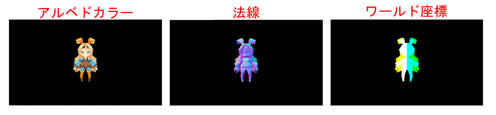</img></br>

&emsp;では、ハンズオンを行っていきましょう。12.5の内容を全て実装しているサンプルプログラムがあるので、そちらを利用します。Sample_12_1を立ち上げて下さい。
### step-1　ライトの情報に視点を追加
&emsp;今回実装する鏡面反射は[ほげほげ(章番号を入れる)]で勉強したフォン鏡面反射です。フォン鏡面反射の計算には視点の位置が必要になるので、ライティングの情報に視点のデータを追加します。main.cppにリスト12.7のプログラムを入力してください。</br>
[リスト12.7 main.cpp]
```cpp
//step-1 ライトの情報に視点を追加
light.eyePos = g_camera3D->GetPosition();
```
### step-2　ピクセルのワールド座標を記憶するためのG-Bufferを作成
&emsp;鏡面反射の計算では、ピクセルから視点まで伸びるベクトルを計算する必要があります。その計算のためにワールド座標を記憶するためのG-Bufferを作成しましょう。リスト12.8のプログラムを入力してください。</br>
[リスト12.8 main.cpp]
```cpp
RenderTarget worldPosRT;
worldPosRT.Create(
	FRAME_BUFFER_W, 
	FRAME_BUFFER_H, 
	1, 
	1, 
	DXGI_FORMAT_R32G32B32A32_FLOAT,		//ワールド座標を記録するので、32ビット浮動小数点バッファを利用する。
	DXGI_FORMAT_UNKNOWN
);
```
&emsp;ワールド座標はアルベドカラーや法線と違い、大きな数値になるため8ビットのバッファでは精度が足りません。ですので、32ビットの浮動小数点バッファを作成しています。

### step-3　ディファードライティングで使用するテクスチャにワールド座標テクスチャを追加。
&emsp;ディファードライティングで先ほど作成したワールド座標のテクスチャを利用するため、spriteInitData.m_textureに追加します。リスト12.9のプログラムを入力して下さい。</br>
[リスト12.9 main.cpp]
```cpp
//step-3 ディファードライティングで使用するテクスチャにワールド座標テクスチャを追加。
spriteInitData.m_textures[2] = &worldPosRT.GetRenderTargetTexture();
```

### step-4　2番目のレンダリングターゲットにworldPosRTを追加
&emsp;step-3までで初期化のプログラムは終了です。続いて、ドローコールを改造します。レンダリングするG-Bufferの種類が増えたので、RenderToGBufferで設定するレンダリングターゲットを増やします。リスト12.10のプログラムを入力してください。</br>
[リスト12.10 main.cpp]
```cpp
//step-4 2番目のレンダリングターゲットにworldPosRTを追加。
RenderTarget* rts[] = {
	&albedRT,	//0番目のレンダリングターゲット
	&normalRT,	//1番目のレンダリングターゲット
	&worldPosRT	//2番目のレンダリングターゲット
};
```
&emsp;これでC++側のプログラムは終了です。では、続いてHLSL側のプログラムを実装していきましょう。

### step-5　頂点シェーダーからの出力にワールド座標を追加。
&emsp;まずは、RenderToGBufferのシェーダーを改造します。G-Bufferにピクセルのワールド座標を描きこむので、頂点シェーダーで計算されたワールド座標をピクセルシェーダーに渡す必要があります。頂点シェーダーからの出力構造体にワールド座標を出力するためのメンバを追加しましょう。model.fxを開いて、リスト12.11のプログラムを入力してください。</br>
[リスト12.11 model.fx]
```cpp
//step-5 頂点シェーダーからの出力にワールド座標を追加。
float3 worldPos		: TEXCOORD1;	//ワールド座標。
```
### step-6　ピクセルシェーダーからの出力にワールド座標を追加。
&emsp;続いて、ピクセルシェーダーからの出力構造体を改造します。ピクセルシェーダーからレンダリングターゲット２番目にワールド座標を出力する必要があるので、`SV_Target2`セマンティクスが指定されたメンバを追加しています。model.fxにリスト12.12のプログラムを入力してください。</br>
[リスト12.12 model.fx]
```cpp
//step 6 ピクセルシェーダーからの出力にワールド座標を追加。
float3 worldPos : SV_Target2;	//ワールド座標。
```
&emsp;このシェーダーが実行されると、図12.5のワールド座標のG-Bufferが作成されます。</br>
**図12.5**</br>
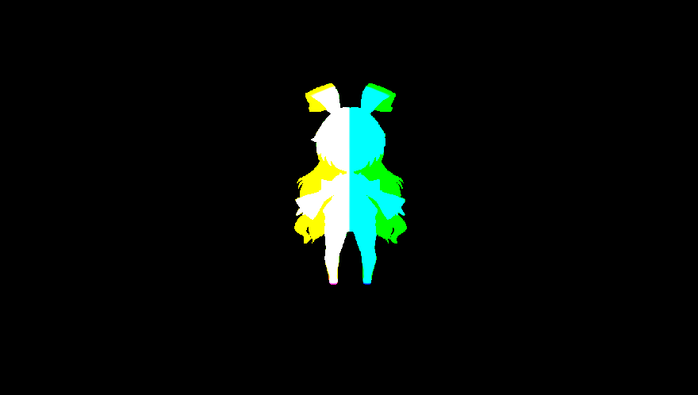</img>

### step-7　頂点シェーダーからワールド座標を出力
&emsp;では、プログラムの本体の改造をしていきましょう。まずは頂点シェーダーからワールド座標を出力できるようにしていきましょう。リスト12.13のプログラムを入力してください。
[リスト12.13 model.fx]
```cpp
//step-7 頂点シェーダーからワールド座標を出力。
psIn.worldPos = psIn.pos;
```
### step-8　ピクセルシェーダーからワールド座標を出力
&emsp;続いて、ピクセルシェーダーを改造しましょう。ピクセルシェーダーの仕事は頂点シェーダー→ラスタライザで計算されたピクセルのワールド座標をG-Bufferに出力するだけです。リスト12.14のプログラムを入力してください。</br>
[リスト12.14 model.fx]
```cpp
//step-8 ピクセルシェーダーからワールド座標を出力。
psOut.worldPos = psIn.worldPos;
```
### step-9　定数バッファに視点の位置を追加
&emsp;次はディファードライティングのシェーダーを改造します。鏡面反射を実装するので、定数バッファに視点の位置を追加しましょう。sprite.fxを開いてリスト12.15のプログラムを入力してください。</br>
[リスト12.15 sprite.fx]
```cpp
//step-9 定数バッファに視点の位置を追加。
float3 eyePos;			//視点
```

### step-10　ワールド座標テクスチャにアクセスするための変数を追加
&emsp;RenderToGBufferのパスで作成されたワールド座標テクスチャを利用するので、テクスチャにアクセスするための変数を追加します。ワールド座標テクスチャはcpp側のSprite::Drawの中でt2レジスタに関連付けされています。リスト12.16のプログラムを入力してください。</br>
[リスト12.16 sprite.fx]
```cpp
//step-10 ワールド座標テクスチャにアクセスするための変数を追加
Texture2D<float4> worldPosTexture : register(t2);	//ワールド座標。
```
### step-11　スペキュラ反射を計算
&emsp;では、最後にスペキュラ反射を計算するプロググラムを追加しましょう。スペキュラ反射は[Chpaterほげほげ]で解説したプログラムと同じです。リスト12.17のプログラムを入力して下さい。</br>
[リスト12.17 sprite.fx]
```cpp
//step-11 スペキュラ反射を計算。
float3 worldPos = worldPosTexture.Sample( Sampler, In.uv).xyz;
float3 toEye = normalize( eyePos - worldPos );
float3 r = reflect( ligDirection, normal);
t = max( 0.0f, dot( toEye, r));
t = pow( t, 5.0f);
lig += ligColor * t;
```

### step-12　動作確認
&emsp;ここまで入力できたら実行して動作を確認してください。うまくできていれば、図12.6のようにスペキュラ反射が発生しているはずです。</br>
**図12.6**</br>
</img></br>

## 12.8 【ハンズオン】ディファードレンダリング入門～法線マップ～
## 12.9 【ハンズオン】ディファードレンダリング入門～スペキュラマップ～

<!-- 改ページ. -->
<div style="page-break-before:always"></div>

# Chapter 13 ディファードレンダリングとフォワードレンダリングの融合
&emsp;現在主流になっているレンダリングエンジンはディファードオンリー、フォワードオンリーというわけではなく、ディファードとフォワードを融合したものとなっています。ディファードレンダリングは無駄なピクセルのシェーダーが実行されないというメリットがあります。現在のリッチゲームは1ピクセル当たりのシェーダーが複雑になってきており、無駄な計算が発生しないディファードレンダリングがメインストリームになっています。しかし、ディファードレンダリングにはいくつかの欠点があります。その欠点を解消するために、ディファードとフォワードのハイブリッド仕様のレンダリングエンジンを作成するケースが増えていっています。では、ディファードの欠点を詳しくみていって、それに対処できるハイブリッド式のエンジンをハンズオンで作成していきましょう。
## 13.1 半透明問題
&emsp;ディファードレンダリングは半透明描画が弱いと言われています。では、なぜディファードレンダリングは半透明描画が弱いのか考えていきましょう。結論を先に説明すると、半透明のオブジェクトを描画すると、G-Bufferの内容が上書きされてしまうからです。G-Bufferは手前に描画されたピクセルの情報で上書きされてしまうため、奥のピクセルの情報は失われます。不透明のオブジェクトであれば、上書きされてしまっても問題ないのですが、半透明のオブジェクトが描画された時に、ピクセルの情報を上書きしてしまうのは問題です。なぜなら、半透明オブジェクトは透過しているので、奥のオブジェクトはまだ画面に表示されているからです。具体例を見てみましょう。図13.1は女の子のモデルと半透明の板ポリを描画している様子です。</br>
**図13.1**</br>
</img></br>
&emsp;女の子のモデルはランバート拡散反射の計算で陰影がついていることが分かります。さて、では女の子の手前に半透明の板ポリを移動するとどうなるでしょうか。図13.2を見てください。</br>

**図13.2**</br>
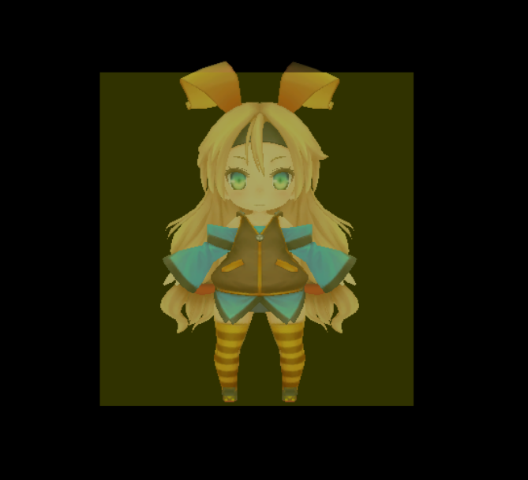</img></br>
&emsp;女の子から陰影がなくなってしまいました。これは手前に描画された板ポリによって、G-Bufferの法線情報が上書きされてしまったことによって起きた現象です。図13.3はG-Bufferの変化です。</br>

**図13.3**</br>
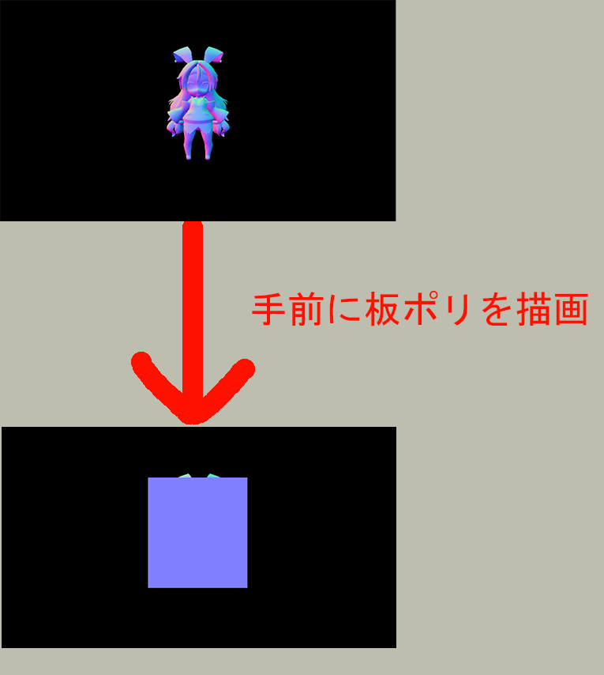</img></br>
&emsp;この問題は法線だけではなく、スペキュラ強度、深度値など多くのG-Bufferで発生します。半透明のオブジェクトを描画する場合、奥のオブジェクトも表示されているため、きちんと陰影を計算してやる必要があります。しかし、シンプルなディファードレンダリングの場合、奥のオブジェクトの情報は失われてしまうため、正しい陰影計算を行うことができません。これがディファードレンダリングで半透明描画が難しい理由です(今回紹介した半透明描画に関する問題をサンプルプログラム、Sample13_01で確認することができます。興味がある方は実行して動作を確認してみてください)。
&emsp;この半透明に起因する問題を解決する最も簡単な方法は、不透明オブジェクトはディファード、半透明オブジェクトはフォワードでレンダリングすることです。下記はフォワードとディファードを融合させたエンジンの１フレームの描画の流れです。</br>

1. 不透明オブジェクトをG-Bufferにレンダリング</br>
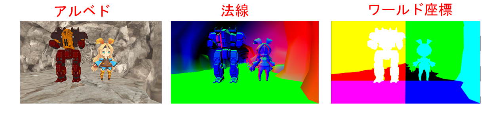</img></br>

2. G-Bufferの内容を使ってディファードライティング</br>
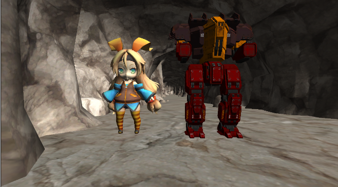</img></br>

3. 半透明オブジェクトをフォワードでレンダリング</br>
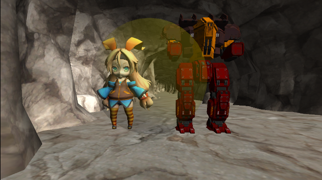</img></br>

<!-- 改ページ. -->
<div style="page-break-before:always"></div>

## 13.2 【ハンズオン】ディファードとフォワードのハイブリッドエンジンの実装
&emsp;では、半透明問題の解決のためにディファードとフォワードのハイブリッドエンジンを実装してきましょう。今回使用するサンプルプログラムのSample_13_02は不透明オブジェクトのみディファードでレンダリングしているサンプルです。このサンプルを改造して半透明オブジェクトをレンダリングしても、正しいライティングの結果を得られるようにしていきましょう。</br>
### step-1 半透明の球体モデルを初期化
&emsp;まずは、半透明オブジェクトの球体モデルを初期化しましょう。半透明オブジェクトの描画で使用されるピクセルシェーダーは不透明オブジェクトのものとは別のシェーダーです。不透明オブジェクトのピクセルシェーダーはG-Bufferに出力しますが、半透明オブジェクトのピクセルシェーダーはライティングの計算を行います。リスト13.1のプログラムをmain.cppに入力してください。</br>
[リスト13.1 main.cpp]
```cpp
//step-1 半透明の球体モデルを初期化。
ModelInitData transModelInitData;
transModelInitData.m_tkmFilePath = "Assets/modelData/sphere.tkm";
transModelInitData.m_fxFilePath = "Assets/shader/model.fx";
//半透明モデルはモデルを描くときにライティングを行うので、ライトの情報を渡す。
transModelInitData.m_expandConstantBuffer = &light;
transModelInitData.m_expandConstantBufferSize = sizeof(light);
//ピクセルシェーダのエントリーポイントが不透明モデルとは異なる。
//不透明モデルはPSMain、半透明モデルはPSMainTransを使用する。
//ピクセルシェーダの実装は後で確認。
transModelInitData.m_psEntryPointFunc = "PSMainTrans";
//半透明の球体モデルを初期化。
Model sphereModel;
sphereModel.Init(transModelInitData);
```

### step-2 半透明オブジェクトを描画
&emsp;続いて、半透明オブジェクトを描画します。半透明オブジェクトの描画がディファードライティングの後で行われている点に注目してください。また、半透明オブジェクトを描画する際の深度ステンシルビューはG-Bufferを作成したときに作られた深度ステンシルビューを使用しています。このようにすることで、ディファードライティングが終わった後で、オブジェクトをレンダリングしても、正しい前後関係が得られます。リスト13.2のプログラムを入力してください。</br>
[リスト13.2 main.cpp]
```cpp
//step-2 半透明オブジェクトを描画
//深度ステンシルビューはG-Bufferを作成したときのものに変更する。
renderContext.SetRenderTarget(
	g_graphicsEngine->GetCurrentFrameBuffuerRTV(), 
	rts[0]->GetDSVCpuDescriptorHandle()
);
//半透明オブジェクトを描画！
sphereModel.Draw(renderContext);
```
### step-3 ライトの情報を受け取るための定数バッファを追加
&emsp;step-3はシェーダー側のプログラムです。半透明オブジェクトをレンダリングするためのシェーダーを追加しましょう。まずはライティングを行うためにライトの情報にアクセスするための定数バッファを追加しましょう。Assets/shader/model.fxを開いてリスト13.3のプログラムを入力してください。</br>
[リスト13.3 model.fx]
```cpp
//step-3 ライトの情報を受け取るための定数バッファを追加。
cbuffer DirectionLight : register(b1){
	float3 ligColor;		//ライトのカラー
	float3 ligDirection;	//ライトの方向。
	float3 eyePos;			//視点
};
```
### step-4 半透明オブジェクト用のピクセルシェーダーを実装
&emsp;これで最後のハンズオンです。半透明オブジェクトのためのピクセルシェーダーの本体を実装しましょう。内容はこれまでに勉強してきたフォワードレンダリングです。リスト13.4のプログラムを入力してください。</br>
[リスト13.4 model.fx]
```cpp
//step-4 半透明オブジェクト用のピクセルシェーダーを実装。
float4 PSMainTrans( SPSIn psIn ) : SV_Target0
{
	//フォワードレンダリング。
	//普通にライティングをする。
	//拡散反射光を計算。
	float3 lig = 0.0f;
	float3 normal = psIn.normal;
	float t = max( 0.0f, dot( psIn.normal, ligDirection) * -1.0f);
	lig = ligColor * t;
	
	float4 finalColor = g_texture.Sample(g_sampler, psIn.uv);
	finalColor.xyz *= lig;
	return finalColor;
}
```

### step-5 動作確認
&emsp;ここまで入力できたら実行して動作を確認してください。うまくできていれば、図13.4のように半透明の球体モデルを描画できているはずです。</br>
**図13.4**</br>
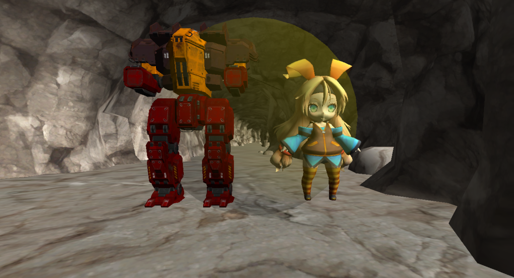</img></br>

## 13.2 特殊なシェーディングが困難
&emsp;ディファードレンダリングは半透明の問題だけではなく、特殊なシュエ―てぃんぐの実現が困難という問題があります。ディファードレンダリングは全てピクセルに対して、同じ陰影計算が行われます。そのため、特定のマテリアルだけ計算を変更したいということが難しくなります。かみ砕いて説明すると、リアルなグラフィックの世界にアニメ調のキャラクターを登場させることが困難になります。このような問題もディファードとフォワードのハイブリッドエンジンであれば解決することができます。


# Chapter 14 3Dゲームで使えるシェーダー発展
チャプター14では3Dゲームで使えるいくつかのシェーダーを紹介します。このチャプターでは、ディファードとフォワードのハイブリッドの本書オリジナルのレンダリングエンジンを使用して色々なシェーダーを見ていきます。
## 14.1 レンダリングエンジンとは
ここまで、Chapter1からChapter13までの内容で、影生成、ブルーム、ディファードレンダリング、PBRなど色々なグラフィックアルゴリズムを個別で見てきました。しかし、実際にゲームの絵を作成するためには、これらのアルゴリズムを個別で実装するだけではなく、組み合わせて最終的な絵を完成させる必要があります。そして、これらの処理を組み合わせて、最終的な絵を完成させる処理を実装したプログラムのことを、レンダリングエンジンと呼称します。</br>
Chapter14で使用する本書オリジナルのレンダリングエンジンの処理の流れは下記のようになっています。
1. シャドウマップへの描画
2. ZPrepass
3. G-Bufferへの描画
4. ディファードレンダリング
5. ディファードライティングが終わった時点でのスナップショットの撮影
6. フォワードレンダリング
7. ポストエフェクトを実行
8. メインレンダリングターゲットの絵をフレームバッファにコピー

Chapter14で使用するレンダリングエンジンの処理はRenderingEngine.cpp,hに記述されています。では、簡単にですが、ソースコードを交えて各ステップを説明していきます。
### 14.1.1 シャドウマップへの描画
こちらはカスケードシャドウ法を利用したシャドウマップ生成アルゴリズムを採用しています。今回の実装では、最大4本のライトに対しての影を生成できるようになっています。ですので、図14.1のように複数本のライトからの影を生成することができるようになっています。</br>
**図14.1**</br>
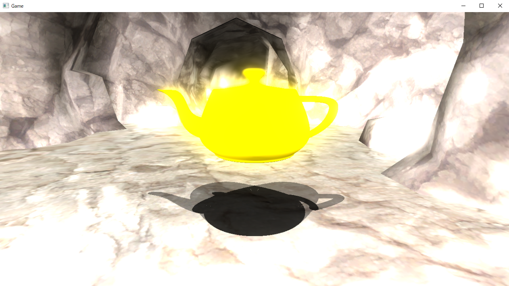</img></br>
シャドウマップへの描画処理はRenderingEngine.cppの22行目から記述されています。シャドウマップへの描画に関する処理はShadowMapRenderクラスにまとめられており、RenderEngineクラスはライトの本数分のShadowMapRenderクラスのインスタンスを配列で保持しています。次のコードは、ライトの本数分、シャドウマップへの描画処理を実行しているコードです。</br>

```cpp
void RenderingEngine::RenderToShadowMap(RenderContext& rc)
{
	int ligNo = 0;
	for (auto& shadowMapRender : m_shadowMapRenders) {
		shadowMapRender.Render(
			rc, 
			m_deferredLightingCB.m_light.directionalLight[ligNo].direction
		);
		ligNo++;
	}
}
```

### 14.1.2 ZPrepass
ZPrepassはシーンのZ値をレンダリングするステップです。このステップではシーンに描画される不透明オブジェクトのZ値が全て描画されます。後続するG-Bufferへの描画ステップでもシーンのZ値をレンダリングする処理があるのですが、G-Bufferで生成されるZ値は、ディファードレンダリングを行うオブジェクトのZ値のみです。今回のエンジンでは、この後実装する、エッジ描画の処理で、フォワードレンダリングを行うオブジェクトのZ値が必要となる処理になったため、ディファード、フォワード両方のオブジェクトのZ値を出力する特殊なステップを用意しました。また、このZPrepassを実装することで、深度バッファにシーンのZ値を先に構築することができ、ZPrepass以降の描画ステップで、画面に表示されない無駄なピクセルシェーダーの実行を抑制でき、パフォーマンスの向上も期待できます。ZPrepassの処理はRenderingEngine.cppの233行目から記述されています。</br>
```cpp
void RenderingEngine::ZPrepass(RenderContext& rc)
{
	// まず、レンダリングターゲットとして設定できるようになるまで待つ
	rc.WaitUntilToPossibleSetRenderTarget(m_zprepassRenderTarget);
	// レンダリングターゲットを設定
	rc.SetRenderTargetAndViewport(m_zprepassRenderTarget);
	// レンダリングターゲットをクリア
	rc.ClearRenderTargetView(m_zprepassRenderTarget);

	for (auto& model : m_zprepassModels) {
		model->Draw(rc);
	}

	rc.WaitUntilFinishDrawingToRenderTarget(m_zprepassRenderTarget);
}
```

### 14.1.3 G-Bufferへの描画
今回のレンダリングエンジンで作成されるG-Bufferの種類は下記のようになっています。
1. アルベド
2. 法線
3. ワールド座標
4. スペキュラ
5. 影パラメータ

アルベド、法線、ワールド座標、スペキュラはディファードレンダリングの章で解説した内容です。それに追加して、今回は影生成用のパラメーターを出力するためのG-Bufferが追加されています。このG-Bufferにはピクセルが影を受けるかどうかの、シャドウレシーバーフラグの状態などが記憶されています。G-Bufferへの描画処理はRenderingEngine.cppの261行目から記述されています。
```cpp
void RenderingEngine::RenderToGBuffer(RenderContext& rc)
{
	// レンダリングターゲットをG-Bufferに変更
	RenderTarget* rts[enGBufferNum] = {
		&m_gBuffer[enGBufferAlbedo],     // 0番目のレンダリングターゲット
		&m_gBuffer[enGBufferNormal],     // 1番目のレンダリングターゲット
		&m_gBuffer[enGBufferWorldPos],   // 2番目のレンダリングターゲット
		&m_gBuffer[enGBufferSpecular],   // 3番目のレンダリングターゲット
		&m_gBuffer[enGBUfferShadowParam],// 4番目のレンダリングターゲット
	};

	// まず、レンダリングターゲットとして設定できるようになるまで待つ
	rc.WaitUntilToPossibleSetRenderTargets(ARRAYSIZE(rts), rts);
	// レンダリングターゲットを設定
	rc.SetRenderTargets(ARRAYSIZE(rts), rts);
	// レンダリングターゲットをクリア
	rc.ClearRenderTargetViews(ARRAYSIZE(rts), rts);
	for (auto& model : m_renderToGBufferModels) {
		model->Draw(rc);
	}

	// レンダリングターゲットへの書き込み待ち
	rc.WaitUntilFinishDrawingToRenderTargets(ARRAYSIZE(rts), rts);
}
```

### 14.1.4 ディファードレンダリング
G-Bufferへの描画が完了したので、次はディファードレンダリングを行います。今回のディファードレンダリングでは、各ピクセルに対して、PBRでのライティング計算がされていきます。また、ステップ１で作成されたシャドウマップを利用した、影生成もここで実行されます。ディファードレンダリングの処理はRenderingEngine.cppの293行目に記述されています。
```cpp
void RenderingEngine::DeferredLighting(RenderContext& rc)
{
	//ディファードライティングに必要なライト情報を更新する。
	m_deferredLightingCB.m_light.eyePos = g_camera3D->GetPosition();
	for (int i = 0; i < NUM_DEFERRED_LIGHTING_DIRECTIONAL_LIGHT; i++) {
		for (int areaNo = 0; areaNo < NUM_SHADOW_MAP; areaNo++) {
			m_deferredLightingCB.mlvp[i][areaNo] = m_shadowMapRenders[i].GetLVPMatrix(areaNo);
		}
	}
			// レンダリング先をメインレンダリングターゲットにする。	
	// メインレンダリングターゲットを設定
	rc.WaitUntilToPossibleSetRenderTarget(m_mainRenderTarget);
	rc.SetRenderTargetAndViewport(m_mainRenderTarget);

	// G-Bufferの内容を元にしてディファードライティング
	m_diferredLightingSprite.Draw(rc);

	// メインレンダリングターゲットへの書き込み終了待ち
	rc.WaitUntilFinishDrawingToRenderTarget(m_mainRenderTarget);

}
```

### 14.1.5 ディファードレンダリングが終わった時点でのスナップショットの撮影
これは、後で実装するステル処理で必要になったため、追加したパスです。ディファードライティングが終わった時点での、メインレンダリングターゲットの内容を別のテクスチャにコピーしています。スナップショットの処理はRenderingEngine.cppの285行目～記述されています。
```cpp
void RenderingEngine::SnapshotMainRenderTarget(RenderContext& rc, EnMainRTSnapshot enSnapshot)
{
	//メインレンダリングターゲットの内容をスナップショット。
	rc.WaitUntilToPossibleSetRenderTarget(m_mainRTSnapshots[(int)enSnapshot]);
	rc.SetRenderTargetAndViewport(m_mainRTSnapshots[(int)enSnapshot]);
	m_copyMainRtToFrameBufferSprite.Draw(rc);
	rc.WaitUntilFinishDrawingToRenderTarget(m_mainRTSnapshots[(int)enSnapshot]);
}
```

### 14.1.6 フォワードレンダリング
ディファードレンダリングで実行されるライティングはPBRでのライティング計算となっているため、ノンフォトリアルな絵作りはできません。そこで、PBR以外での特殊なライティングを行いたい、オブジェクトの描画をこのステップで実行します。フォワードレンダリングの処理はRenderingEngine.cppの248行目から記述されています。
```cpp
void RenderingEngine::ForwardRendering(RenderContext& rc)
{
	rc.WaitUntilToPossibleSetRenderTarget(m_mainRenderTarget);
	rc.SetRenderTarget(
		m_mainRenderTarget.GetRTVCpuDescriptorHandle(), 
		m_gBuffer[enGBufferAlbedo].GetDSVCpuDescriptorHandle()
	);
	for (auto& model : m_forwardRenderModels) {
		model->Draw(rc);
	}
	// メインレンダリングターゲットへの書き込み終了待ち
	rc.WaitUntilFinishDrawingToRenderTarget(m_mainRenderTarget);
}
```

### 14.1.7 ポストエフェクトの実行
フォワードレンダリングが完了すると、メインレンダリングターゲットの絵に対してポストエフェクトをかけていきます。今回のエンジンでは、川瀬式ブルームと六角形絞りの被写界深度を実装しています。ポストエフェクトの処理はPostEffectクラスにまとめられており、RenderingEngineクラスはPostEffectクラスのインスタンスを１つだけ保持しています。ポストエフェクトの実行の処理はRenderingEngine.cppの210行目に記述されています。
```cpp
//ポストエフェクトを実行。
m_postEffect.Render(rc, m_mainRenderTarget);
```

### 14.1.8 メインレンダリングターゲットの絵をフレームバッファにコピー
いよいよ最終仕上げです。最後はメインレンダリングターゲットの内容をフレームバッファにコピーします。これで本書のレンダリングエンジンの１フレームの処理が終了となります。

## 14.2 レンダリングエンジンのカスタマイズ
さて、簡単ではありますが、本書で実装しているレンダリングエンジンの処理の流れについて説明をしました。このようなレンダリングエンジンは、実装の詳細に差異はあれど、UnityやUnrealEngineといった商用エンジンだけではなく、各ゲームデベロッパーが保持しているオリジナルのゲームエンジンにも実装されているものとなります。さて、では今の時代このようなレンダリングエンジンの詳細について勉強することにどのような意味があるのでしょうか？UnityやUnrealEngineを利用すれば、このようなレンダリングエンジンの詳細を知らなくてもゲームを作ることができます。オリジナルのゲームエンジンであっても、すでに現在のトレンドを抑えたレンダリングエンジンは用意されています。では、現在このような勉強を行うことは無駄なことなのでしょうか？私は無駄であるとは考えていません。使っているエンジンのレンダリングエンジンに関して深い知識を得ることで、そのエンジンのパフォーマンスを最大に引き出すことができるようになります。また、ゲーム独自の特殊な処理を実現したい場合にレンダリングエンジンを改造するということもあります。先ほどの本書のエンジンの説明に、「エッジ描画を行うためにZPrepassを追加した」、「ステルス処理を実装するために、スナップショットをとる機能を追加した」という記述があったと思います。まさにこれがレンダリングエンジンの改造です。UnrealEngineであれば、エンジンのコードが全て公開されているため、今回私が自身のエンジンで行ったようなC++による改造を行うことができます。Unityであれば、C#スクリプトを通じてレンダリングエンジンを改造できる、「スクリプタブルレンダーパイプライン」という機能があります。これらの機能を使いこなすためにも、現在のモダンなレンダリングエンジンの実装について、ある程度の知識が必要であると私は考えています。この後の実装で使用するサンプルプログラムには、本書独自の小さなレンダリングエンジンのコードが付属しています(Unity、UnrealEngineなどに比べるととても小さなレンダリングエンジンです)。非常に小さなエンジンで、ここまで勉強してきた内容を踏まえる実装となっているため、レンダリングエンジンの実装の入門プログラムとして入りやすい内容になっているかと思いますので、ぜひコードを読んでみてもらえたらと思います。

## 14.3 輪郭線の描画
さて、ここからは、本書のレンダリングエンジンを活用して、いくつかのグラフィック表現を実装していきましょう。まずは輪郭線描画の処理を実装していきます。輪郭線の描画はアニメ調の表現を行うために、よく使用されている表現です。輪郭線描画のアルゴリズムはシーンの深度テクスチャや、法線テクスチャなどを利用したポストエフェクトの処理として、よく紹介されています。隣り合うピクセル同士の深度値の差や法線の傾きが、ある一定値以上であれば輪郭線が発生している判定して、ピクセルカラーを黒にして出力します。しかしポストエフェクト的な輪郭線描画は次のような問題があります。
1. シーン全体に輪郭線が発生してしまう。
2. 輪郭線の色が同じになってしまう。

まず、１のシーン全体に輪郭線が発生するというのは、ポストエフェクトの処理なので、シーン全体に処理が実行されるため、望んでいない箇所にまで輪郭線が発生してしまいます。ですので、例えば、ゲーム中一部のオブジェクトにだけ輪郭線を表示したいといった処理を実現するためにはひと工夫が必要になってしまいます。輪郭線が同じ色になるというのも同じ問題です。ゲームちゅう一部のオブジェクトの輪郭線のみ色を変える、といった処理の実現が難しくなります。そこで、今回はこれらの問題を解決できる、フォワードレンダリングでの輪郭線描画を実装していきます。

### 14.1.1 【ハンズオン】フォワードレンダリングで輪郭線を描画する
今回実装する輪郭線描画のアルゴリズムは、ほとんどポストエフェクト的な輪郭線抽出のものと変わりありません。輪郭線の抽出には、RenderToGBufferのパスで作成済みのシーンの深度テクスチャや法線テクスチャを利用します。フォワードでやるかポストエフェクトでやるか程度の違いしかなく、とても簡単です。しかし、この輪郭線描画の処理はポストエフェクト的な処理と違い、高い柔軟性を持っているパワフルな処理です。では、Sample_14_01/Sample_14_01.slnを立ち上げてください。

#### step-1 フォワードレンダリングのパスで描画されるティーポットの描画処理を初期化する。
まずは、モデル描画処理を初期化します。今回のサンプルでは、本書のレンダリングエンジンで動作するためのモデル描画クラスのModelRenderを利用します。ModelRenderクラスは内部にModelクラスのインスタンスを保持しているクラスです。このクラスの詳細については説明はしませんが、レンダリングエンジンの勉強として、コードを読んでみると面白いと思います。では、main.cppの35行目にリスト14.1のプログラムを入力してください。</br>
[リスト14.1 main.cpp]
```cpp
// step-1 フォワードレンダリングのパスで描画されるティーポットの描画処理を初期化する。
ModelInitData modelInitData;
modelInitData.m_tkmFilePath = "Assets/modelData/teapot.tkm";
modelInitData.m_fxFilePath = "Assets/shader/sample.fx";
modelInitData.m_colorBufferFormat[0] = DXGI_FORMAT_R32G32B32A32_FLOAT;
//【注目】拡張SRVにZPrepassで作成された深度テクスチャを指定する。
modelInitData.m_expandShaderResoruceView[0] = &renderingEngine.GetZPrepassDepthTexture();
//初期化情報を使って描画処理を初期化する。
myRenderer::ModelRender teapotModelRender;
//InitForwardRendering()を利用すると、フォワードレンダリングの描画パスで描画される。
teapotModelRender.InitForwardRendering(renderingEngine, modelInitData);
//シャドウキャスターフラグをオンにする。
teapotModelRender.SetShadowCasterFlag(true);
```
今回の実装は、深度テクスチャを利用したエッジ抽出アルゴリズムなので、拡張SRVにZPrepassで作成された深度テクスチャを指定しています。

#### step-2 ティーポットを描画する。
つづいて、ゲームループの処理です。ティーポットの描画命令を追加します。リスト14.2のプログラムを入力してください。</br>
[リスト14.2 main.cpp]
```cpp
// step-2 ティーポットを描画する。
teapotModelRender.Draw();
```

#### step-3 深度テクスチャにアクセスするための変数を追加
step-3からはシェーダー側です。Assets/shader/sample.fxを開いてください。まずは、深度テクスチャにアクセスするための変数を追加します。sample.fxの37行目にリスト14.3のプログラムを入力してください。</br>
[リスト14.3 sample.fx]
```cpp
// step-3 深度テクスチャにアクセスするための変数を追加。
Texture2D<float4> g_depthTexture : register(t10);
```

#### step-4 頂点の正規化スクリーン座標系の座標をピクセルシェーダーに渡す
続いて、頂点シェーダーです。今回の実装では、ピクセルの正規化スクリーン座標系の座標が必要になります。そこで、頂点シェーダーから透視変換後の座標を出力するコードを追加します。sample.fxにリスト14.4のプログラムを入力してください。</br>
[リスト14.4 sample.fx]
```cpp
//step-4 頂点の正規化スクリーン座標系の座標をピクセルシェーダーに渡す
psIn.posInProj = psIn.pos;
psIn.posInProj.xy /= psIn.posInProj.w;
```
#### step-5 近傍8テクセルの深度値を計算して、エッジを抽出する。
では、これで最後です。ピクセルシェーダーでは、深度テクスチャを利用して、近傍8テクセルの深度値の平均を計算して、これから描画しようとしているピクセルの深度値との差を求めて、差が大きければピクセルカラーを黒にすることで、エッジを描画しています。では、sample.fxにリスト14.5のプログラムを入力してください。</br>
[リスト14.5 sample.fx]
```cpp
//step-5 近傍8テクセルの深度値を計算して、エッジを抽出する。
//正規化スクリーン座標系からUV座標系に変換する。
float2 uv = psIn.posInProj.xy * float2( 0.5f, -0.5f) + 0.5f;
//近傍8テクセルへのUVオフセット。
float2 uvOffset[8] = {
	float2(           0.0f,  1.0f / 720.0f), //上
	float2(           0.0f, -1.0f / 720.0f), //下
	float2( 1.0f / 1280.0f,           0.0f), //右
	float2(-1.0f / 1280.0f,           0.0f), //左
	float2( 1.0f / 1280.0f,  1.0f / 720.0f), //右上
	float2(-1.0f / 1280.0f,  1.0f / 720.0f), //左上
	float2( 1.0f / 1280.0f, -1.0f / 720.0f), //右下
	float2(-1.0f / 1280.0f, -1.0f / 720.0f)  //左下
};
//このピクセルの深度値を取得。
float depth = g_depthTexture.Sample(g_sampler, uv).x;
//近傍8テクセルの深度値の平均値を計算する。
float depth2 = 0.0f;
for( int i = 0; i< 8; i++){
	depth2 += g_depthTexture.Sample(g_sampler, uv + uvOffset[i]).x;
}
depth2 /= 8.0f;
//自身の深度値と近傍8テクセルの深度値の差を調べる。
if( abs(depth - depth2) > 0.00005f ){
	//深度値が結構違う場合はピクセルカラーを黒にする
	//->これがエッジカラーとなる。
	return float4( 0.0f, 0.0f, 0.0f, 1.0f);
}
//普通にテクスチャを
return g_texture.Sample(g_sampler, psIn.uv);
```
入力出来たら実行してみてください。図14.2のようにティーポットに輪郭線が描画できていたら、完成です。</br>
**図14.2**</br>
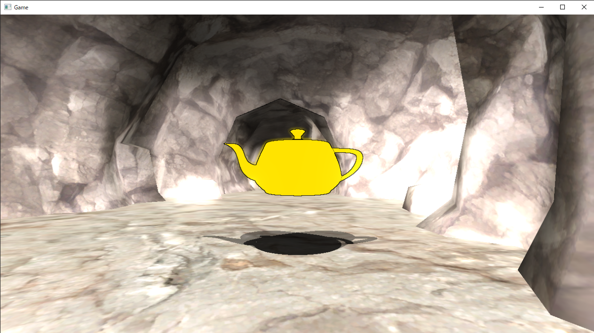</img></br>

## 14.3 ステルス
続いて、メタルギアソリッドのステルス迷彩のような処理を実装したいときに利用できる、ステルス処理を実装してみましょう。今回の実装のステルス処理は、単純にアルファブレンディングなどで透明にするのではなく、図14.3のように透過した背景を歪める処理を実装していきます。</br>
**図14.3**</br>
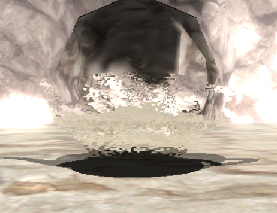</img></br>
図14.3は「ディファードレンダリングが終わった時点でのスナップショット」を利用してステルス処理が実装されています。図14.3のプログラムで利用されている、スナップショットテクスチャは図14.4のようになっています。</br>

**図14.4**</br>
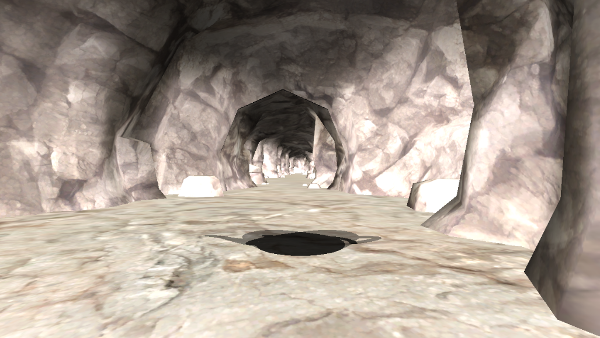</img></br>

このテクスチャをティーポットに貼り付けることで、透過しているように見せています。しかし、そのまま貼り付けただけでは、単にアルファブレンディングで透明にしただけのものと同じになってしまいます。そこで、今回はこのテクスチャを貼り付けるときに、シンプレックスノイズを利用して、UV座標を少しずらしてやって、歪みが発生するようにテクスチャを貼り付けていきます。

### 14.3.1 【ハンズオン】フォワードレンダリングでステルス処理を実装する。
では、Sample_14_02/Sample_14_02.slnを立ち上げて、ステルス処理を実装していきましょう。

#### step-1 ティーポットモデルの描画処理を初期化。
まずは、ティーポットモデルの描画処理を初期化します。main.cppの35行目にリスト14.6のプログラムを入力してください。</br>
[リスト14.6 main.cpp]
```cpp
// step-1 ティーポットモデルの描画処理を初期化。
ModelInitData modelInitData;
modelInitData.m_tkmFilePath = "Assets/modelData/teapot.tkm";
modelInitData.m_fxFilePath = "Assets/shader/sample.fx";
modelInitData.m_colorBufferFormat[0] = DXGI_FORMAT_R32G32B32A32_FLOAT;
//【注目】メインレンダリングターゲットのスナップショットテクスチャを拡張SRVに指定する。
modelInitData.m_expandShaderResoruceView[0] = &renderingEngine.GetMainRenderTargetSnapshotDrawnOpacity();
myRenderer::ModelRender teapotModelRender;
//フォワードレンダリングの描画パスで実行されるように初期化する。
teapotModelRender.InitForwardRendering(renderingEngine, modelInitData);
//シャドウキャスターフラグを設定する。
teapotModelRender.SetShadowCasterFlag(true);
```
拡張SRVにメインレンダリングターゲットのスナップショットを指定している点に注目してください。

#### step-2 ティーポットモデルを描画
続いて、ゲームループの処理です。main.cppにリスト14.7のプログラムを入力してください。</br>
[リスト14.7 main.cpp]
```cpp
// step-2 ティーポットモデルを描画
teapotModelRender.Draw();
```

#### step-3 ディファードレンダリング済みのシーンテクスチャにアクセスするための変数を追加。
step-3からはシェーダー側の実装です。まずは、メインレンダリングターゲットのスナップショットテクスチャにアクセスするための変数を定義します。Assets/shader/sample.fxの36行目にリスト14.8のプログラムを入力してください。</br>
[リスト14.8 sample.fx]
```cpp
// step-3 ディファードレンダリング済みのシーンテクスチャにアクセスするための変数を追加。
Texture2D<float4> g_sceneTexture : register(t10);
```

#### step-4 頂点の正規化スクリーン座標系の座標をピクセルシェーダーに渡す
今回の実装では、エッジ描画の時と同じように、ピクセルの正規化スクリーン座標系の座標が必要になります。そこで、頂点シェーダーから透視変換後の座標を出力するコードを追加します。sample.fxにリスト14.9のプログラムを入力してください。</br>
[リスト14.9 sample.fx]
```cpp
 //step-4 頂点の正規化スクリーン座標系の座標をピクセルシェーダーに渡す
psIn.posInProj = psIn.pos;
psIn.posInProj.xy /= psIn.posInProj.w;
```

#### step-5 シンプレックスノイズを利用して、UV座標をずらしてシーンテクスチャを貼り付ける。
では、これで最後です。シンプレックスノイズを利用して、UV座標をずらして、シーンテクスチャをティーポットに貼り付けましょう。シンプレックスノイズは、乱数生成アルゴリズムの一種ですが、パーリンノイズと同様に乱数の発生がなだらかに変化するという特徴をもっており、画像処理アルゴリズムでよく利用される乱数生成です。シンプレックスノイズは、パーリンノイズよりシンプルな実装になっており、計算負荷が低いという利点を持っています。今回は著者が用意した３次元のノイズを発生させるSimplexNoise()を利用して、UV座標をずらしていきます。では、sample.fxにリスト14.10のプログラムを入力してください。</br>
[リスト14.10 sample.fx]
```cpp
// step-5 シンプレックスノイズを利用して、UV座標をずらしてシーンテクスチャを貼り付ける。
// 正規化スクリーン座標系からUV座標系に変換する。
float2 uv = psIn.posInProj.xy * float2( 0.5f, -0.5f) + 0.5f;
// パーリンノイズを利用して、UVオフセットを計算する。
float uOffset = SimplexNoise(float3(uv, 0.0f) * 256.0f) * 0.02f ;
// シーンテクスチャからカラーをサンプリング。
float4 stealth = g_sceneTexture.Sample(g_sampler, uv + uOffset);
// サンプリングしたカラーを返す。
return stealth;
```

入力できたら実行してみて下さい。図14.5のようなプログラムが実行できたら完成です。</br>
**図14.5**</br>
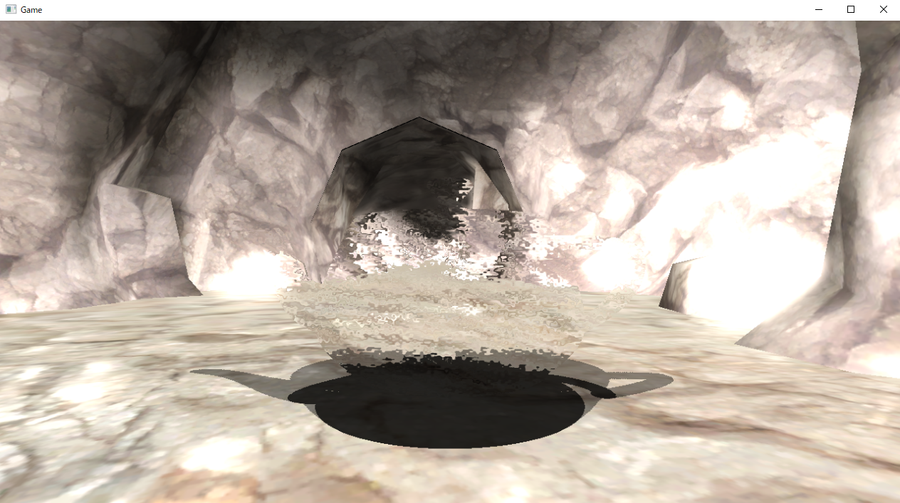</img></br>

## 14.4 ディザリング
14.4では、最近のゲームでよく利用されているディザリングを利用した半透明処理について見ていきます。ディザリングは、ドット絵の時代に使われていた半透明処理で、3Dゲームが隆盛を誇っていた、PS1～PS4の初期頃まではディザリングを活用した半透明処理というのはあまり見たことがありませんでした。しかし、PS4中期以降のゲームでは、3Dのゲームであってもディザリングを利用した半透明処理を頻繁に見るようになっていきました。ディザリングを利用した半透明処理が流行した背景には、ディファードレンダリングを採用したレンダリングエンジンの普及があげられると私は考えています。実はディザリングを利用した半透明処理は、半透明っぽく見せているだけで、実際には不透明オブジェクトを描画しているだけなのです。そのため、半透明に起因する、描画順番やパフォーマンスの劣化という問題を全て解決することができます。また、見てきたように、ディファードレンダリングは、半透明描画を正しく行うことができないため、ディファードとの相性も抜群だったわけです。</br>
ディザリングとは一部のピクセルをディザパターンに従って描画しないよう手法のことです。ドット絵の時代には図14.6のような簡易的なグラデーションの表現としても使われていました。ディザリングを行うと、一部のピクセルが描画されなくなるため、図14.6のように半透明のような表現が実現できます。</br>
**図14.6**</br>
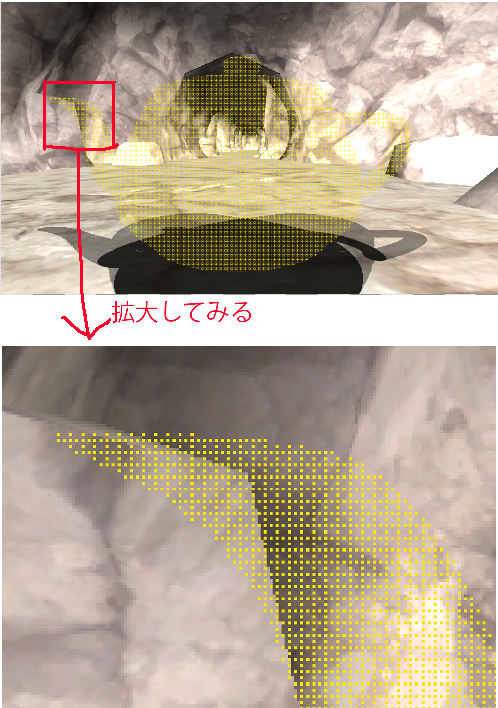</img></br>
ここでポイントとなるのは、ディザリングは一部のピクセルが描画されていないだけで、アルファブレンディングによる半透明処理は一切行っていないということです。つまり、不透明なピクセルを描画しているだけです。そのため、半透明による描画順番の問題や、ディファードレンダリングで問題となった、半透明オブジェクトを描画することで、G-Bufferが上書きされてしまうという問題が全て解決されます。

### 14.4.1 【ハンズオン】ディザリングを利用した半透明処理を実装する。
では、ディザリングを利用した半透明処理を実装していきましょう。Sample_14_03/Sample_14_03.slnを立ち上げてください。今回実装するディザリングはフォワードレンダリングの描画パスで描画される、ティーポットモデルに対して実装していきます。そのため、改造するシェーダーはモデルシェーダーとなります。また、今回はC++側の実装はすべて完了しているため、シェーダー側のみの実装となります。

#### step-1 ディザパターンを定義する。
まずはディザパターンと呼ばれる二次元配列をを定義します。Assets/shader/sample.fxを開いて42行目にリスト14.11のプログラムを入力してください。</br>
[リスト14.11 sample.fx]
```cpp
// step-1 ディザパターンを定義する。
static const int pattern[4][4] = {
    { 0, 32,  8, 40},
    { 48, 16, 56, 24},
    { 12, 44,  4, 36},
    { 60, 28, 52, 20},
};
```

#### step-2 ディザパターンを利用してディザリングを実装する。
続いて、ピクセルシェーダーを改造して、ディザリングを実装します。sample.fxにリスト14.12のプログラムを入力してください。</br>
[リスト14.12 sample.fx]
```cpp
// step-2 ディザパターンを利用してディザリングを実装する。
//このピクセルのスクリーン座標系でのX座標、Y座標を4で割った余りを求める。
int x = (int)fmod(psIn.pos.x, 4.0f);
int y = (int)fmod(psIn.pos.y, 4.0f);

//上で求めた、xとyを利用して、このピクセルのディザリング閾値を取得する。
int dither = pattern[y][x];

//ディザリング閾値が50以下のピクセルはピクセルキルする。
//clip()は引数の値がマイナスになるとピクセルキルが実行される。
clip( dither - 50 );

float4 tex = g_texture.Sample( g_sampler, psIn.uv);
return tex;
```
このプログラムでは、最初にピクセルのスクリーン座標系でのx座標とy座標を4で割った余りをローカル変数のxとyに求めてます。そうするとxとyにはピクセルの位置に応じて、0～3の値が記憶されます。この数値を利用して、step-1で定義したディザパターンから、ディザリング閾値を取得してきています。そして、clip()を利用して、その閾値が50以下ならピクセルキル(ピクセルを描画しない)を行うことで、一部のピクセルのみ描画しないという処理を実現しています。実装出来たら実行してみてください。図14.7のようなプログラムが実行できていたら完成です。</br>
**図14.7**</br>
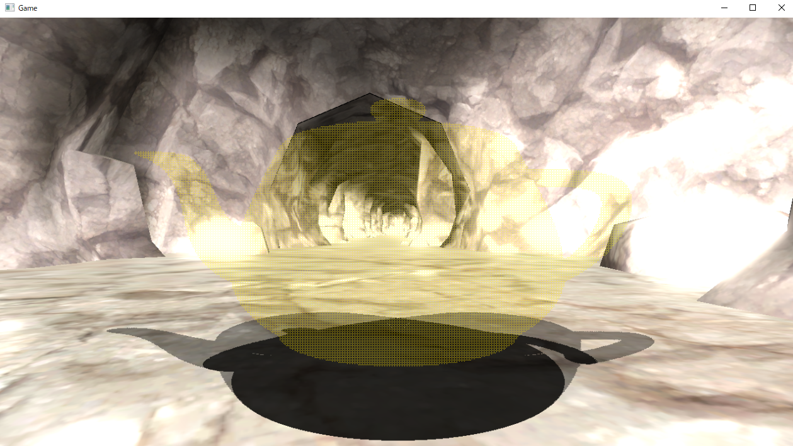</img></br>

<note>
今回のディザリングはフォワードレンダリングで実行していますが、これはディファードレンダリングでも実装可能です。ディファードレンダリングで実装する場合はG-Bufferの作成のパスで今回実装した手法を行えば実現することができます。
</note>

### 14.4.2 【ハンズオン】カメラ位置に応じて、ディザリングを利用した透過処理を行う。
ディザリングが活用されているケースの１つとして、カメラがオブジェクトにめり込んだ時の透過処理があげられます。この節では、カメラの位置に応じてディザリングによる透過具合が変化していくプログラムを実装していきましょう。Sample_14_04/Sample_14_04.slnを立ち上げてください。

#### step-1 オブジェクトとカメラとの距離を求める。
まずは、オブジェクトとカメラとの距離を求めます。Assets/shader/sample.fxを開いて61行目にリスト14.13のプログラムを入力してください。なお、今回はオブジェクトとカメラの距離の計算をシェーダー側で行っていますが、この計算はC++側で行って、その結果を定数バッファなどでGPUに渡す実装でも問題ありません。むしろその方がパフォーマンスは向上します。</br>
[リスト14.13 sample.fx]
```cpp
// step-1 オブジェクトとカメラとの距離を求める。
//オブジェクトの座標をワールド行列の平行移動成分から引っ張ってくる。
float4 objectPos = mWorld[3];
//オブジェクトの座標をカメラ座標系に変換する。
float4 objectPosInCamera = mul(mView, objectPos);
//カメラからの距離を計算する。
psIn.distToEye = length( objectPosInCamera );
```
#### step-2 完全にクリップされる範囲を定義する。
続いてピクセルシェーダーの実装です。まずはオブジェクトが完全にクリップされる範囲を定義します。カメラとオブジェクトの距離が定義した範囲以内になると、オブジェクトは完全にクリップされ、表示されなくなります。では、sample.fxにリスト14.14のプログラムを入力してください。</br>
[リスト14.14 sample.fx]
```cpp
// step-2 完全にクリップされる範囲を定義する。
//カメラがオブジェクトのクリップ範囲内に入ると、
//完全にオブジェクトがクリップされる。
//この数値を変更すると、オブジェクトが完全に消える範囲が変わります。
float clipRange = 50.0f;
```

#### step-3 視点とクリップ範囲までの距離を計算する。
続いて、視点とクリップ範囲までの距離を計算します。リスト14.15のプログラムを入力してください。</br>
[リスト14.15 sample.fx]
```cpp
// step-3 視点とクリップ範囲までの距離を計算する。
//オブジェクトとカメラの距離が50以下になると、
//psIn.distToEye - clipDistの結果がマイナスになるので、tに0が代入される。
//psIn.distToEyeが50以上なら、tには視点からクリップ範囲までの距離が
//計算される。
float eyeToClipRange = max( 0.0f, psIn.distToEye - clipRange);
```
ここでeyeToClipRangeに計算している値は視点とクリップ範囲までの距離です(図14.8)。max()を利用することで、視点がクリップ範囲内に入ると、計算結果0になるようになっています。</br>
**図14.8**</br>
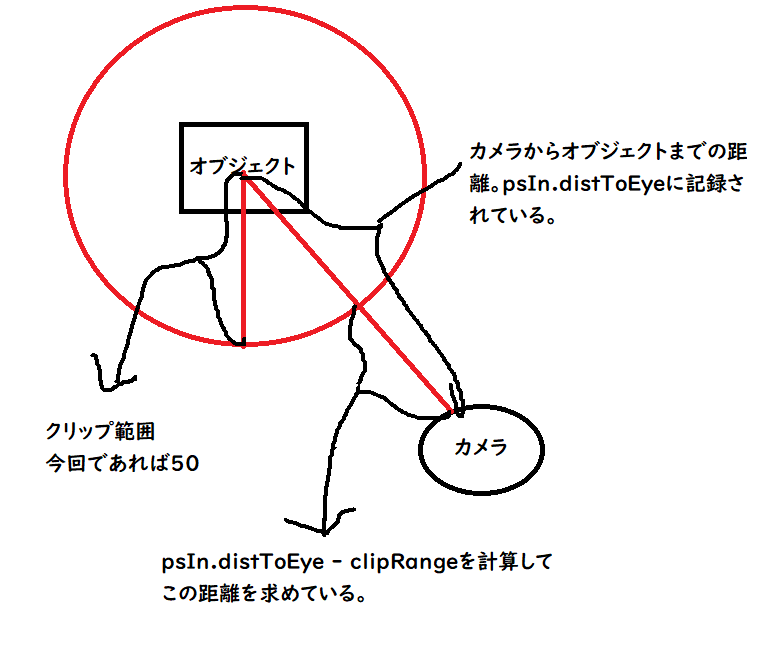</img></br>

#### step-4 クリップ率を求める
続いて、クリップ率を求めます。ここで求めるクリップ率は0～1の範囲の値をとります。step-3で求めた、クリップ範囲までの距離を利用して、クリップ範囲までの距離が0ならクリップ率は1.0(100%)、クリップ範囲までの距離が100以上ならクリップ率は0.0(0%)となるように計算しています。では、リスト14.16のプログラムを入力してください。</br>
[リスト14.16 sample.fx]
```cpp
// step-4 クリップ率を求める。clipRateは0～1の値をとる。
//clipRateが1になると完全にクリップされる。
//下記のコードは、視点とクリップ範囲の距離が100以下になると、
//線形にclipRateの1に近づいていき、eyeToClipRangeが0になると、
//clipRateが1になる計算になっている。
float clipRate = 1.0f - min( 1.0f, eyeToClipRange / 100.0f);
```

#### step-5 クリップ率を利用してピクセルキルを行う。
では、これで最後です。step-4で求めたクリップ率を利用してピクセルキルを行います。リスト14.17のプログラムを入力してください。</br>
[リスト14.17 sample.fx]
```cpp
// step-5 クリップ率を利用してピクセルキルを行う。
//clipRateの値は0～1の値をとる。tが0ならどのピクセルもクリップされない。
//clipRateの値が1になると、64以下のピクセルがクリップされるため、
//全てのピクセルがキリップされる。(ditherの値の最大値は62なので)
clip( dither - 64 * clipRate);
```
入力出来たら実行してみてください。コントローラーの左スティックと右スティックでカメラを動かすことができます。実装ができていると、カメラがオブジェクトに近づいていくと、少しずつディザリングで透過していく処理が確認できると思います。


<!-- 改ページ. -->
<div style="page-break-before:always"></div>

# Chapter 15 コンピュートシェーダー
## 15.1 GPGPU
&emsp;GPGPUとはGeneral-purpose computing on graphics processing unitsの略でGPUに汎用計算を行わせることを指しています。汎用計算とは画像処理以外の処理のことを指します。例えばコリジョン処理など。本来GPUは画像処理を行うために進化してきましたが、プログラマブルシェーダーの登場により、GPUでそれなりに複雑なロジックを実行することができるようになりました。また、CPUはGPUとは異なる進化を遂げてきたため、単純な計算であればCPUとは比べ物にならない速度で処理することができます。そのため、GPUに画像処理だけさせるのは勿体ない、もっと色々な処理をGPUに実行させよう！という考えが生まれます。これがGPGPUの始まりです。近年では仮想通貨のマイニングにGPUが使われたり、AIを飛躍的に進化させた機械学習という大量のデータを扱うアルゴリズムを高速に実行するためにGPUが使われたりしていました(ただし、最近は機械学習に特化したプロセッサをgoogleやMicrosoftが独自に開発したため、GPUが使われることは減っています)。


## 15.2 コンピュートシェーダー
&emsp;さて、ではどのようにGPUで汎用的な演算を行うのでしょうか？これまで皆さんが勉強してきたのは、頂点処理を行うための頂点シェーダーと、ピクセル処理を行うためのピクセルシェーダーのみです。固定機能の時代に比べると、ある程度自由にプログラミングができるようになったとはいえ、まだまだ制約は多いです。頂点シェーダーからの出力結果に計算の結果を簡単に加工することはできませんし、ピクセルシェーダーからの出力もカラー情報しか出力できません。DirectX9までは、この二つのシェーダーステージしか用意されていませんでした。(しかし、ゲーム開発者はこの制限のなかでもGPGPUをおこなっていましたが・・・)。そこで、GPUに汎用的な処理を行わせるプログラムを簡単に記述したい、という開発者の要望に答える形で、DirectX10にコンピュートシェーダーという新しいシェーダーステージが追加されました。
コンピュートシェーダーはhlslで記述することができ、より柔軟に計算結果を出力することができるようになっています。

## 15.3 データの入力と出力
&emsp;多くの処理ではいろいろな計算を行うためにはデータを入力する必要があります。そしてその入力に対する計算結果を出力する必要もあるでしょう。クラスの平均点を求める関数であれば、リスト15.1のような実装になると思います。</br>

【リスト15.1】
```cpp
int CalcAvarage( int numStudent, int* scoreArray )
{
	int totalScore = 0;
	for( int I = 0; I < numStudent; i++ ){
	totalScore += scoreArray[i];
	}
	return totalScore / numStudent;
}
```
このクラスの平均点を求める計算をGPUに行わせる場合も同様にGPUに対して生徒数と点数の配列を送ってやる必要があります。そして、GPUで行った計算結果を出力する必要があります。

## 15.4 StructuredBuffer
&emsp;StructuredBufferとは構造化バッファと呼ばれるもので、構造体の配列のように扱うことができます。今回扱うサンプルプログラムでは、シェーダーへの入力、出力として使用しています。

## 15.5 アンオーダーアクセスビューとシェーダーリソースビュー
&emsp;データの入力はピクセルシェーダーや頂点シェーダーと同じように、定数バッファやシェーダーリソースビューなどを利用して入力します。しかし、これらは読み取り専用となっており、データの出力では利用できません。そこで、今回はデータの出力が可能なアンオーダーアクセスビューを使用します。ビューというのはリソースの振る舞いについて定義するためのものです。例えば、シェーダーリソースビューが指定されたリソースは読み取り専用になります。一方アンオーダーアクセスビューが設定されたリソースはランダムアクセスが可能になり、読み書きが可能になります。リスト15.1のプログラムですと、CaclAvarageの引数で渡しているデータはシェーダーリソースビュー、戻り値のデータはアンオーダーアクセスビューに関連付けされます。</br>

**図15.1**</br>
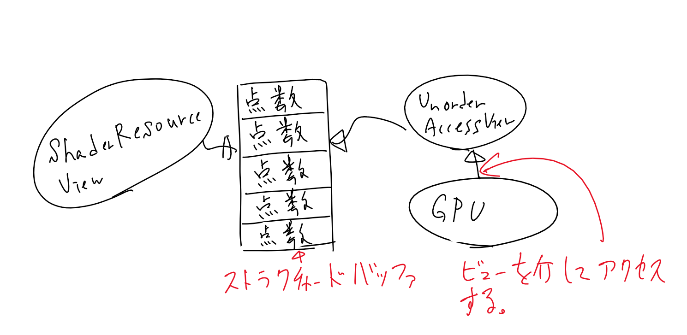</img></br>

## 15.6 学生の平均点を計算するプログラム
&emsp;では、具体的なプログラムを見て、コンピュートシェーダーの使い方を学んでいきましょう。Sample_15_1/Sample_15_1.slnを起動して実行してください。このプログラムは3人の生徒の試験の成績をランダムに生成して、その平均点を計算して図15.2のように表示しているだけの簡単なプログラムです。</br>
**図15.2**</br>
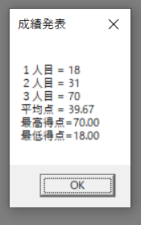</img></br>

### 15.6.1　コンピュートシェーダーのロード
&emsp;まず、コンピュートシェーダーをロードする必要があります。シェーダーのロードの処理は頂点シェーダーやピクセルシェーダーと同じように、シェーダーファイルのファイルパスとエントリーポイントとなる関数名を指定します。</br>
[リスト 15.2 main.cpp 27行目～]
```cpp
//コンピュートシェーダのロード
Shader cs;
cs.LoadCS(L"Assets/shader/sample.fx", "CSMain");
```

### 15.6.2　入力データを受け取るバッファを作成
&emsp;続いて、入力データを受け取るバッファを作成します。コンピュートシェーダもGPU上で動作するので、当然アクセスできるのはグラフィックメモリですので、グラフィックメモリ上にバッファを作成する必要があります。今回は入力データは読み取り専用のストラクチャードバッファとして作成しています。</br>
[リスト 15.3 main.cpp 39行目～]
```cpp
//入力データを受け取るバッファを作成。
int inputData[] = {
	20, 30, 40
};

StructuredBuffer inputSB;
inputSB.Init(sizeof(int), 3, inputData);
```

### 15.6.3 出力データを受け取るバッファを作成
&emsp;入力データが作成できたら、今度は出力データを記憶するバッファを作成します。出力データは読み書き可能なストラクチャードバッファとして作成しています。</br>
[リスト 15.4 main.cpp 47行目～]
```cpp
//出力データを受け取るバッファを作成。
RWStructuredBuffer outputSb;
outputSb.Init(sizeof(OutputData), 1, nullptr);
```

### 15.6.4 ディスクリプタヒープへの登録
&emsp;入力データと出力データをディスクリプタヒープに登録します。これも頂点シェーダー、ピクセルシェーダと変わりありません。入力データはシェーダーリソースビュー、出力データはアンオーダーアクセスビューとして登録します。</br>
[リスト 15.5 main.cpp 49行目～]
```cpp
DescriptorHeap ds;
ds.RegistShaderResource(0, inputSB);
ds.RegistUnorderAccessResource(0, outputSb);
ds.Commit();
```

### 15.6.5 ディスパッチコール
&emsp;ディスパッチコールを実行することで、設定されていたコンピュートシェーダーが実行されます。絵を描くときのドローコール似たような感じです。ディスパッチコールを行うために必要なリソースを設定して実行します。</br>
[リスト 15.6 main.cpp 76行目～]
```cpp
//////////////////////////////////////
//ここからDirectComputeへのディスパッチ命令。
//////////////////////////////////////
renderContext.SetComputeRootSignature(rs);
renderContext.SetPipelineState(pipelineState);
renderContext.SetComputeDescriptorHeap(ds);
renderContext.Dispatch(1, 1, 1);
```
### 15.6.6 コンピュートシェーダー
&emsp;では、最後にコンピュートシェーダーのコードを見ていきましょう。やっていることは平均点、最高点、最小点の計算を行っているだけです。</br>
&emsp;入力データにアクセスするための変数と、出力データにアクセスするための変数が用意されています。入力データはシェーダーリソースビューなのでtレジスタに割り当てられています。出力データはuレジスタに割り当てられています。
[リスト 15.7 Assets/shader/sample.fx]
```cpp
// 平均点、最高得点、最低得点を計算するコンピュートシェーダー。
#define NUM_STUDENT 3.0f //生徒の数

//出力データ構造体
struct OutputData{
	float avarageScore;	//平均点。
	float maxScore;		//最高点。
	float minScore;		//最小点。
};

//入力データにアクセスるための変数。
StructuredBuffer<int> g_scores : register(t0);
//出力先にアクセスするための変数。
RWStructuredBuffer<OutputData> g_outputData : register(u0);

//これがエントリーポイント
[numthreads(1, 1, 1)] //これは今は気にしなくてよい。
void CSMain( uint3 DTid : SV_DispatchThreadID )
{
	g_outputData[0].maxScore = 0;
	g_outputData[0].minScore = 100;

	int totalScore = 0;
	for(int i = 0; i < NUM_STUDENT; i++ ){
		totalScore += g_scores[i];
		g_outputData[0].maxScore = max( g_outputData[0].maxScore, g_scores[i]);
		g_outputData[0].minScore = min( g_outputData[0].minScore, g_scores[i]);
	}
	g_outputData[0].avarageScore = totalScore / NUM_STUDENT;
}
```
## 15.7 【ハンズオン】合計点を出力する
&emsp;では、Sample_15_01を改造して、合計点を出力できるようにしてみましょう。まず、コンピュートシェーダーを改造しましょう。</br>
### 15.7.1 step-1 出力構造体にメンバを追加する(HLSL)
&emsp;sample.fxの「step-1 出力構造体にメンバを追加する」と書かれている箇所にリスト15.8のプログラムを追加してください。</br>
[リスト 15.8 sample.fx]
```hlsl
//step-1 出力構造体にメンバを追加する
int totalScore;		//合計点。
```

### 15.7.2 step-2 合計点を出力する(HLSL)
&emsp;メンバを追加できたら、実際に出力するプログラムをウ生かします。「step-2 合計点を出力する」と書かれている箇所にリスト15.9のプログラムを追加してください。</br>
[リスト 15.9 sample.fx]
```hlsl
//step-2 合計点を出力する
g_outputData[0].totalScore = totalScore;
```

### 15.7.3 step-3 出力構造体にメンバを追加する(C++)
&emsp;続いて、コンピュートシェーダーで計算されたデータを受け取るために、C++側に定義されている出力構造体にもメンバを追加しましょう。main.cppの「step-3 出力構造体にメンバを追加する」と書かれている箇所にリスト15.10のプログラムを追加してください。</br>
[リスト 15.10]
```cpp
//step-3 出力構造体にメンバを追加する
int totalScore;		//合計点。
```
### 15.7.4 step-4 合計点を表示する(C++)
&emsp;では最後のハンズオンです。main.cppの「step-4 合計点を表示する」と書かれている箇所にリスト15.11のプログラムを追加して、メッセージボックスに合計点の表示を追加してみましょう。
[リスト 15.11]
```cpp
//step-4 合計点を表示する
sprintf(
	text, 
	"１人目 = %d\n" \
	"２人目 = %d\n" \
	"３人目 = %d\n" \
	"平均点 = %0.2f\n" \
	"最高得点=%0.2f\n" \
	"最低得点=%0.2f\n" \
	"合計点=%d\n", //これを追加。
	inputData[0], 
	inputData[1], 
	inputData[2],
	outputData->avarageScore, 
	outputData->maxScore, 
	outputData->minScore,
	outputData->totalScore //これも追加。
);
```
<!-- 改ページ. -->
<div style="page-break-before:always"></div>

## 15.8【課題】標準偏差を計算する
&emsp;Sample_15_01を改造して、図15.3のように標準偏差を表示できるようにしなさい。</br>
**図15.3**</br>
<!-- どこかのサイトから拾ってきた画像です。差し替えをお願いします。 -->
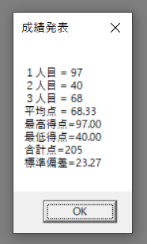</img></br>

標準偏差の計算はGPUで行いなさい。標準偏差は下記の数式で求めることができます。</br>

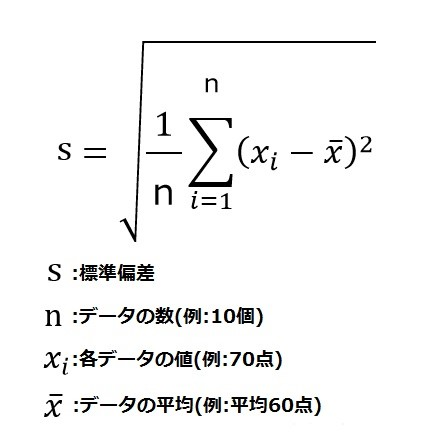</img></br>

答え:Sample_15_01/Assets/shader/main_15_8.fx、Sample_15_01/main_15_8.cpp</br>
<!-- 改ページ. -->
<div style="page-break-before:always"></div>

## 15.9 コンピュートシェーダーの並列処理
&emsp;この節では、画像のモノクロ化のサンプルプログラムを通して、コンピュートシェーダーの並列処理について学んでいきます。

### 15.9.1 スレッド
&emsp;すべてのプログラムはスレッドによって実行されています。驚くかもしれませんが、実はこれまで、あなたが記述したmain関数はメインスレッドから呼ばれていたのです。スレッドは複数作成することができて、作成されたスレッドは並列に動作します。例えば、あるゲームの１フレームの処理が図15.4のようになっていると考えてみましょう。</br>
**図15.4**</br>
</img></br>
&emsp;このゲームではメインスレッドに記述されているゲームループから順次処理を呼び出していて、1フレームの処理が完了するまでに24ミリ秒かかっています。残念ながらこのゲームは60fpsを達成できていないため、ゲームプレイの滑らかさは多少損なわれています。図15.5はスレッドを二つ立てて、ゲームの処理、物理シミュレーション、描画処理を並列に実行している様子です。</br>

**図15.5**</br>
</img></br>
&emsp;物理シミュレーションと描画処理を並列に実行するようにしたことで、１フレームの処理時間が14ミリ秒まで短縮できました！これで60fpsが達成できました！(現実はデータの排他など非常に難解なことを考える必要が出てくるため、マルチスレッドにするということはここまで簡単な話ではないので注意してください。)コンピュートシェーダーもスレッドから実行されており、ディスパッチされると、スレッドが生成されます。生成されるスレッドの数はコンピュートシェーダーのコードで指定することができます。</br>

```cpp
[numthreads(2, 2, 1)] //これがスレッドの数！！！                                                                                
void CSMain( uint3 DTid : SV_DispatchThreadID)
{
　　　・
　　　・
　　　・
}
```
&emsp;numthreads(x,y,z)という文が一つのスレッドグループで生成されるスレッド数を指定しています(スレッドグループについては後述します)。この場合生成されるスレッド数は2×2×1の4スレッド生成されます。numthreads(4, 1, 1)と同じ意味になるのですが、例えば入力データを二次元配列のように扱いたい場合、このように指定したほうが扱いやすくなります。</br>

### 15.9.2 スレッドグループ
&emsp;スレッドグループとはスレッドをひとまとめにしたものです。スレッドグループの数はコンピュートシェーダーをディスパッチするときに指定することができます。</br>
```cpp
//3×3のスレッドグループが作られる！
renderContext.Dispatch(3,3,1);
```
&emsp;Dispatch関数の引数がスレッドグループの数です。この場合スレッドグループの数は3×3×1の9グループとなります。では15.9.1の4スレッド生成するコンピュートシェーダーを3×3×1の9グループでディスパッチするとどのようになるか見てみいきましょう。まずディスパッチされると(0,0,0)のグループの4スレッドが起動してCSMainが実行されます。</br>
**図15.6**</br>
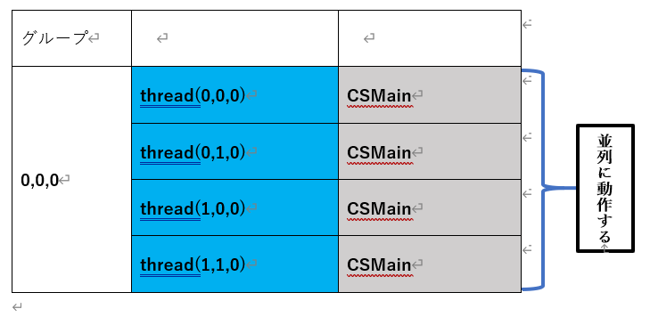</img></br>
(0,0,0)のスレッドがすべて終了すると(0,1,0)のグループが実行されます。</br>

**図15.7**</br>
</img></br>
続いて(0,2,0)、(1,0,0)と実行されて最後に(2,2,0)を実行するとコンピュートシェーダーは終了します。</br>

### 15.9.3 SV_DispatchThreadIDセマンティクス
&emsp;コンピュートシェーダ―では、メイン関数の引数にSV_DispatchThreadIDセマンティクスを指定することができます。このセマンティクスを指定するとメイン関数を呼び出しているスレッドのIDを引っ張ってくるができます。このIDは3次元ベクトルになります。例えば、スレッドＡのIDは(3,4,3)、スレッドＢのIDは(10, 2, 1)といったものです。例えば、２×２×１のスレッドで実行されるコンピュートシェーダ―を４×３×１のスレッドグループでディスパッチすると、スレッドIDは(0,0,0)～(8,6,1)になります。

### 15.9.4 【ハンズオン】モノクロ画像を生成する
&emsp;ではSample_15_02を改造して、ロードしたビットマップフォーマットの画像をモノクロに変換するプログラムを作成してみましょう。ビットマップフォーマットは端的に説明すると、下記のコードのような光の三原色のデータの配列です。
```cpp
//1ピクセルのデータ構造体。
struct SRgb{
	unsigned char r;
	unsigned char g;
	unsigned char b;
	unsigned char a;
};
//画像データ。ピクセルの集合体。
SRgb image[512×512];
```
#### step-1 画像データをメインメモリ上にロードする。
&emsp;では、ハンズオンを行っていきます。今回はAssets/image/original.bmpをモノクロ化します。まずは画像データをメインメモリ上にロードします。リスト15.12を入力してください。なお、このサンプルプログラムにはビットマップ画像をロードできるBitmapクラスを用意しています。このクラスは簡易的なクラスであるため、全てのビットマップ画像を扱えるわけではないので注意してください。</br>
[リスト15.2 main.cpp 22行目～]
```cpp
Bitmap imagebmp;
imagebmp.Load("Assets/image/original.bmp");
```
&emsp;
#### step-2  画像データをグラフィックメモリに送るためにストラクチャードバッファを作成する。
&emsp;step-1でロードした画像データはメインメモリに乗っています。今回はコンピュートシェーダ―でモノクロ化を行うため、グラフィックメモリに転送する必要があります。リスト15.3のプログラムを入力して、ストラクチャードバッファを作成しましょう。</br>
[リスト15.3 main.cpp 26行目～]
```cpp
StructuredBuffer inputImageBmpSB;
inputImageBmpSB.Init(
	imagebmp.GetPixelSizeInBytes(), //第一引数は1画素のサイズ。
	imagebmp.GetNumPixel(),			//ピクセルの数を取得。
	imagebmp.GetImageAddress()		//画像データの先頭アドレス。
);
```

#### step-3 モノクロ化した画像を受け取るためのRWストラクチャバッファを作成。
&emsp;では、続いてモノクロ化した画像を受け取るためのRWストラクチャバッファを作成します。リスト15.4のプログラムを入力してください。</br>
[リスト15.4 main.cpp 31行目～]
```cpp
RWStructuredBuffer outputImageBmpRWSB;
outputImageBmpRWSB.Init(
	imagebmp.GetPixelSizeInBytes(), //第一引数は1画素のサイズ。
	imagebmp.GetNumPixel(),			//ピクセルの数を取得。
	imagebmp.GetImageAddress()		//画像データの先頭アドレス。
);
```

#### step-4 入力データと出力データをディスクリプタヒープに登録する。
&emsp;入力データと出力データを受け取るためのバッファを作成出来たら、バッファをディスクリプタヒープに登録します。リスト15.5のプログラムを入力してください。</br>
[リスト15.5 main.cpp 42行目～]
```cpp
DescriptorHeap ds;
ds.RegistShaderResource(0, inputImageBmpSB);
ds.RegistUnorderAccessResource(0, outputImageBmpRWSB);
ds.Commit();
```

#### step-5 ディスパッチコールを実行する。
&emsp;step-4までで準備が完了したので、ディスパッチコールを実行します。リスト15.6のプログラムを入力してください。</br>
[リスト15.6 main.cpp 70行目～]
```cpp
renderContext.SetComputeRootSignature(rs);
renderContext.SetPipelineState(pipelineState);
renderContext.SetComputeDescriptorHeap(ds);
//ピクセル数は512×512 = 262,144ピクセル。
//4つのスレッドを生成するコンピュートシェーダ―なので、
//262,144 ÷ 4 = 65,536個のスレッドグループを作成する。
renderContext.Dispatch(65536, 1, 1);
```

#### step-6 モノクロにした画像を保存。
&emsp;では、これでC++側は最後になります。コンピュートシェーダ―でのモノクロ化の結果を確認するために画像データを保存しましょう。Bitmapクラスには画像をセーブする機能があります。この機能を使ってAssets/imageフォルダの中にmonochrome.bmpという名前で保存します。リスト15.7のプログラムを入力してください。</br>
[リスト15.7 main.cpp 70行目～]
```cpp
//step-6 モノクロにした画像を保存。
imagebmp.Copy(outputImageBmpRWSB.GetResourceOnCPU());
imagebmp.Save("Assets/image/monochrome.bmp");
```

#### step-7 t0、u0に設定されているバッファにアクセスするための変数を定義。
&emsp;続いてシェーダー側のプログラムです。まずは、t0、u0レジスタに設定されているストラクチャードバッファにアクセスるための変数を定義します。Assets/shader/sample.fxを開いて、リスト15.8のプログラムを入力してください。</br>
[リスト15.8 sample.fx 7行目～]
```hlsl
//step-7 t0、u0に設定されているバッファにアクセスするための変数を定義。
StructuredBuffer<uint> inputImage : register( t0 );
RWStructuredBuffer<uint> outputBuffer : register(u0);
```

#### step-8 入力データから画素を引っ張ってきて、モノクロ化。
&emsp;では、これで最後です。コンピュートシェーダ―のメイン関数を実装します。リスト15.9のプログラムを入力してください。</br>
[リスト15.9 sample.fx 36行目～]
```hlsl
//step-8 入力データから画素を引っ張ってきてモノクロ化する。

//スレッドＩＤをりよして画像データから画素を引っ張ってくる。
uint iColor = inputImage[DTid.x];
//0～255の画像データを0.0～1.0に正規化する。
float4 color = UnpackedRGBA32ToFloat4(iColor);

float Y = 0.29900 * color.r + 0.58700 * color.g + 0.11400 * color.b;
color.r = Y;
color.g = Y;
color.b = Y;
color.a = 1.0f;

//float4をRGBA32ビットのフォーマットに変して出力
outputBuffer[DTid.x] = PackedFloat4ToRGBA32( color );
```
&emsp;全て入力出来たらプログラムを実行してみてください。完成していたら、Assets/imageフォルダの中にmonochrome.bmpが出来上がっています。

### 15.9.5 SV_DispatchThreadIDセマンティクスの利用
&emsp;さて、先ほどのハンズオンではスレッドグループが65536個、１つのスレッドグループで実行されるスレッドの数が4個でした。ですので、生成されるスレッド数は65536 × 4 = 262,144個‬になっていました。この���は、今回モノクロ化した画像のピクセル数と同じです(512 × 512 = 262,144)。今回のハンズオンでは、モノクロカする画像のピクセル数と同じになるようにディスパッチされていて、１つのスレッドが１ピクセルをモノクロ化していました。各スレッドが度のピクセルをモノクロ化するかを決めるために、SV_DispatchThreadIDセマンティクスが使われていました。SV_DispatchThreadIDセマンティクスが指定された変数にはスレッドの番号が入っています。今回は0～262,143の番号が渡されます。ちょうどピクセルの画素を配列として扱った場合のインデックスと一致しています。これを利用して、各スレッドに１ピクセルずつモノクロ加工させていたわけです。

### 15.9.6 【課題】解像度の違うoriginal2.bmpをモノクロ化しなさい。
&emsp;Sample_15_02を改造して、original2.bmpをモノクロ化して、monochrome2.bmpという名前で保存しなさい。表15.1のようにoriginal2.bmpはoriginal.bmpとでは解像度が違います。そのため、生成するスレッドの数を変更する必要があります。</br>
**表15.1**</br>
| ファイル名 | 解像度|
| ---- | ---- |
| original.bmp | 512 × 512 |
| original2.bmp | 1024 × 768 |

答え:Sample_15_02/Assets/shader/main_15.9.6.cpp

### 15.9.7 【ハンズオン】original.bmpにガウシアンブラーをかけてボケ画像を生成する。
&emsp;続いて、Sample_15_03を改造して、ロードした画像にガウシアンブラーをかけてボケ画像を生成するプログラムを作成してみましょう。実装するボケ画像生成のアルゴリズムはポストエフェクトの章で勉強したアルゴリズムと同じで、カウス関数で計算した重みテーブルを使って、Xブラー、Yブラーを行って縮小テクスチャを作っていきます。</br>
#### step-1 画像データをメインメモリ上にロードする。
&emsp;まずはBitmapクラスを使って、画像データをロードします。リスト15.10のプログラムを入力してください。</br>
[リスト15.10 main.cpp]
```cpp
//step-1 画像データをメインメモリ上にロードする。
Bitmap imagebmp;
imagebmp.Load("Assets/image/original.bmp");
```
#### step-2 ブレンディング係数を送るための定数バッファを作成。
&emsp;ピクセルの重みテーブルを送るための定数バッファを作成します。リスト15.11のプログラムを入力して下さい。</br>
[リスト15.11 main.cpp]
```cpp
//step-2 ブレンディング係数を送るための定数バッファを作成する。
ConstantBuffer weightsCB;
weightsCB.Init(sizeof(float) * 8, nullptr);
```

#### step-3 テクスチャ情報を送るための定数バッファを作成する。
&emsp;縮小バッファを利用したガウシアンブラーでは、オリジナルのテクスチャ、Xブラーをかけた画像の出力用のテクスチャ、Yブラーをかけた画像の出力用のテクスチャの情報が必要になります。これらをグラフィックメモリに送るために定数バッファを追加します。リスト15.12のプログラムを入力して下さい。</br>
[リスト15.12 main.cpp]
```cpp
//step-3 テクスチャ情報を送るための定数バッファを作成する。
TexInfo texInfo;
texInfo.originalTexSize[0] = imagebmp.GetWidth();
texInfo.originalTexSize[1] = imagebmp.GetHeight();
texInfo.xBlurTexSize[0] = texInfo.originalTexSize[0] / 2;
texInfo.xBlurTexSize[1] = texInfo.originalTexSize[1];
texInfo.yBlurTexSize[0] = texInfo.originalTexSize[0] / 2;
texInfo.yBlurTexSize[1] = texInfo.originalTexSize[1] / 2;
ConstantBuffer texInfoCB;
texInfoCB.Init(sizeof(texInfo), &texInfo);
```

#### step-4 各種ストラクチャードバッファを作成する。
&emsp;今回使用するアルゴリズムでは、オリジナルの画像をGPUに渡すための入力用のバッファと、コンピュートシェーダ―が３回ディスパッチされて、横方向に半分の解像度のテクスチャ(Xブラーの出力結果)、縦横半分の解像度のテクスチャ(Yブラーの出力結果)、オリジナルの画像と同じ解像度のテクスチャ(最終合成の結果)の３つ出力用のバッファが必要となります。では、リスト15.13を入力して、各種ストラクチャードバッファを作成できるようにしてください。</br>
[リスト15.13 main.cpp]
```cpp
//step-4 各種ストラクチャードバッファを作成する。
StructuredBuffer inputImageBmpSB;
inputImageBmpSB.Init(
	imagebmp.GetPixelSizeInBytes(), //第一引数は1画素のサイズ。
	imagebmp.GetNumPixel(),			//ピクセルの数を取得。
	imagebmp.GetImageAddress()		//画像データの先頭アドレス。
);

//Xブラーをかけた画像を出力するためのRWストラクチャバッファを作成。
RWStructuredBuffer outputXBlurImageRWSB;
outputXBlurImageRWSB.Init(
	imagebmp.GetPixelSizeInBytes(), //第一引数は1画素のサイズ。
	imagebmp.GetNumPixel() / 2,		//横方向に1/2の解像度へダウンサンプリングを行うのでピクセル数を半分にする。
	nullptr
);

//Yブラーをかけた画像を出力するためのRWストラクチャバッファを作成。
RWStructuredBuffer outputYBlurImageRWSB;
outputYBlurImageRWSB.Init(
	imagebmp.GetPixelSizeInBytes(), //第一引数は1画素のサイズ。
	imagebmp.GetNumPixel() / 4,		//縦、横方向に1/2の解像度へダウンサンプリングを行うのでピクセル数を1/4にする。
	nullptr
);
//最終結果を出力するためのRWストラクチャバッファを作成。
RWStructuredBuffer finalImageRWSB;
finalImageRWSB.Init(
	imagebmp.GetPixelSizeInBytes(), //第一引数は1画素のサイズ。
	imagebmp.GetNumPixel(),	
	nullptr
);
```

#### step-5 各種ディスクリプタヒープを作成する。
&emsp;続いて各種ディスクリプタヒープの作成です。今回はコンピュートシェーダを３回ディスパッチしますが、そのために入力用のバッファと出力用のバッファが異なります。そこで、各ディスパッチ用のディスクリプタ―ヒープを作成する必要があります。リスト15.14のプログラムを入力してください。</br>
[リスト15.14 main.cpp]
```cpp
//step-5 各種ディスクリプタヒープを作成する。
//Xブラー用のディスクリプタヒープを作成。
DescriptorHeap xBlurDS;
xBlurDS.RegistShaderResource(0, inputImageBmpSB);
xBlurDS.RegistConstantBuffer(0, weightsCB);
xBlurDS.RegistConstantBuffer(1, texInfoCB);
xBlurDS.RegistUnorderAccessResource(0, outputXBlurImageRWSB);
xBlurDS.Commit();

//Yブラー用のディスクリプタヒープを作成。
DescriptorHeap yBlurDS;
yBlurDS.RegistShaderResource(0, outputXBlurImageRWSB);
yBlurDS.RegistConstantBuffer(0, weightsCB);
yBlurDS.RegistConstantBuffer(1, texInfoCB);
yBlurDS.RegistUnorderAccessResource(0, outputYBlurImageRWSB);
yBlurDS.Commit();

//最終結果出力用のディスクリプタヒープを作成。
DescriptorHeap finalDS;
finalDS.RegistShaderResource(0, outputYBlurImageRWSB);
finalDS.RegistConstantBuffer(0, weightsCB);
finalDS.RegistConstantBuffer(1, texInfoCB);
finalDS.RegistUnorderAccessResource(0, finalImageRWSB);
finalDS.Commit();
```

#### step-6 各種パイプラインステートを作成する。
&emsp;続いてパイプラインステートの作成です。パイプラインステートもディスパッチのたびにシェーダーが変更されるため、ディスパッチの数分だけ作成する必要があります。リスト15.15のプログラムを入力してください。</br>
[リスト15.15 main.cpp]
```cpp
//step-6 各種パイプラインステートを作成する。

//Xブラー用のパイプラインステートを作成。
//Xブラー用のコンピュートシェーダをロードする。
Shader xblurCS;
xblurCS.LoadCS("Assets/shader/sample.fx", "XBlur");
//パイプラインステートを作成する。
PipelineState xBlurPipelineState;
InitPipelineState(rs, xBlurPipelineState, xblurCS);

//Yブラー用のパイプラインステートを作成。
//Yブラー用のコンピュートシェーダのロード
Shader yblurCS;
yblurCS.LoadCS("Assets/shader/sample.fx", "YBlur");
//パイプラインステートを作成。
PipelineState yBlurPipelineState;
InitPipelineState(rs, yBlurPipelineState, yblurCS);

//最終出力用のパイプラインステートを作成。
//最終出力用のコンピュートシェーダーのロード。
Shader finalCS;
finalCS.LoadCS("Assets/shader/sample.fx", "Final");
//パイプラインステートを作成。
PipelineState finalPipelineState;
InitPipelineState(rs, finalPipelineState, finalCS);
```

#### step-7 各種コンピュートシェーダ―をディスパッチ
&emsp;これで、cpp側は最後になります。準備が整ったので、各種コンピュートシェーダーをディスパッチしていきましょう。リスト15.16のプログラムを入力してください。</br>

[リスト15.16 main.cpp]
```cpp
//step-7 各種コンピュートシェーダ―をディスパッチ
//Xブラーをディスパッチ。
renderContext.SetPipelineState(xBlurPipelineState);
renderContext.SetComputeDescriptorHeap(xBlurDS);
renderContext.Dispatch(texInfo.xBlurTexSize[0] / 4, texInfo.xBlurTexSize[1] / 4, 1);

//Yブラーをディスパッチ。
renderContext.SetPipelineState(yBlurPipelineState);
renderContext.SetComputeDescriptorHeap(yBlurDS);
renderContext.Dispatch(texInfo.yBlurTexSize[0] / 4, texInfo.yBlurTexSize[1] / 4, 1);

//最終合成をディスパッチ。
renderContext.SetPipelineState(finalPipelineState);
renderContext.SetComputeDescriptorHeap(finalDS);
renderContext.Dispatch(texInfo.originalTexSize[0] / 4, texInfo.originalTexSize[1] / 4, 1);
```

#### step-8 各種定数バッファにアクセスするための変数を定義。
&emsp;ここからはシェーダー側のプログラムになります。下まずは定数バッファにアクセスするための変数を定義します。Assets/shader/sample.fxを開いてリスト15.17のプログラムを入力して下さい。</br>
[リスト15.17 sample.fx]
```cpp
//step-8 各種定数バッファにアクセスするための変数を定義。
//定数バッファ
cbuffer cb_0 : register(b0) {
	float4 weights[2];
	
};
//テクスチャ情報用の定数バッファ。
cbuffer texInfoCB : register(b1){
	int2 texSize;			//オリジナルテクスチャのサイズ
	int2 xBlurTexSize;		//Xブラーの出力先のテクスチャのサイズ。
	int2 yBlurTexSize;		//Yブラーの出力先のテクスチャのサイズ。
};

```

#### step-9 入出力画像にアクセスするための変数を定義。
&emsp;続いて、入出力用の画像にアクセスするための変数を定義します。リスト15.18のプログラムを入力してください。</br>
[リスト 15.18 sample.fx]
```cpp
StructuredBuffer<uint> inputImage : register(t0);
RWStructuredBuffer<uint> outputImage : register(u0);
```
<!-- 改ページ. -->
<div style="page-break-before:always"></div>

#### step-10 Xブラーを実装
&emsp;いよいよコンピュートシェーダー本体の実装です。まずはXブラーの実装。Xブラーは基準テクセルから左右に８テクセルの合計１６テクセルをブレンディングしていきます。リスト15.19のプログラムを入力してください。</br>
[リスト 15.19 sample.fx]
```cpp
[numthreads(4, 4, 1)]
void XBlur( uint3 DTid : SV_DispatchThreadID)
{
	uint2 basepos = uint2( DTid.x * 2, DTid.y);
	
	float4 color = GetPixelColor( basepos.x, basepos.y, texSize ) * weights[0].x;
	color += GetPixelColor( basepos.x + 1, basepos.y, texSize ) * weights[0].y;
	color += GetPixelColor( basepos.x + 2, basepos.y, texSize ) * weights[0].z;
	color += GetPixelColor( basepos.x + 3, basepos.y, texSize ) * weights[0].w;
	color += GetPixelColor( basepos.x + 4, basepos.y, texSize ) * weights[1].x;
	color += GetPixelColor( basepos.x + 5, basepos.y, texSize ) * weights[1].y;
	color += GetPixelColor( basepos.x + 6, basepos.y, texSize ) * weights[1].z;
	color += GetPixelColor( basepos.x + 7, basepos.y, texSize ) * weights[1].w;

	color += GetPixelColor( basepos.x - 1, basepos.y, texSize ) * weights[0].y;
	color += GetPixelColor( basepos.x - 2, basepos.y, texSize ) * weights[0].z;
	color += GetPixelColor( basepos.x - 3, basepos.y, texSize ) * weights[0].w;
	color += GetPixelColor( basepos.x - 4, basepos.y, texSize ) * weights[1].x;
	color += GetPixelColor( basepos.x - 5, basepos.y, texSize ) * weights[1].y;
	color += GetPixelColor( basepos.x - 6, basepos.y, texSize ) * weights[1].z;
	color += GetPixelColor( basepos.x - 7, basepos.y, texSize ) * weights[1].w;

	uint pixelIndex = GetPixelIndexFromXYCoord( DTid.x, DTid.y, xBlurTexSize.x);
	outputImage[pixelIndex] = PackedFloat4ToRGBA32(color);
}
```
#### step-11 Yブラーを実装
&emsp;続いてYブラーです。YブラーはXブラーをかけた画像に対して行っています。基準テクセルから上下に８テクセルの合計１６テクセルをブレンディングしていきます。リスト15.20のプログラムを入力してください。</br>
[リスト 15.20 sample.fx]
```cpp
//step-11 Yブラーを実装。
[numthreads(4, 4, 1)]
void YBlur(uint3 DTid : SV_DispatchThreadID)
{
	uint2 basepos = uint2( DTid.x, DTid.y * 2);

	float4 color = GetPixelColor( basepos.x, basepos.y, xBlurTexSize ) * weights[0].x;
	color += GetPixelColor( basepos.x, basepos.y + 1, xBlurTexSize ) * weights[0].y;
	color += GetPixelColor( basepos.x, basepos.y + 2, xBlurTexSize ) * weights[0].z;
	color += GetPixelColor( basepos.x, basepos.y + 3, xBlurTexSize ) * weights[0].w;
	color += GetPixelColor( basepos.x, basepos.y + 4, xBlurTexSize ) * weights[1].x;
	color += GetPixelColor( basepos.x, basepos.y + 5, xBlurTexSize ) * weights[1].y;
	color += GetPixelColor( basepos.x, basepos.y + 6, xBlurTexSize ) * weights[1].z;
	color += GetPixelColor( basepos.x, basepos.y + 7, xBlurTexSize ) * weights[1].w;

	color += GetPixelColor( basepos.x, basepos.y - 1, xBlurTexSize ) * weights[0].y;
	color += GetPixelColor( basepos.x, basepos.y - 2, xBlurTexSize ) * weights[0].z;
	color += GetPixelColor( basepos.x, basepos.y - 3, xBlurTexSize ) * weights[0].w;
	color += GetPixelColor( basepos.x, basepos.y - 4, xBlurTexSize ) * weights[1].x;
	color += GetPixelColor( basepos.x, basepos.y - 5, xBlurTexSize ) * weights[1].y;
	color += GetPixelColor( basepos.x, basepos.y - 6, xBlurTexSize ) * weights[1].z;
	color += GetPixelColor( basepos.x, basepos.y - 7, xBlurTexSize ) * weights[1].w;

	uint pixelIndex = GetPixelIndexFromXYCoord( DTid.x, DTid.y, yBlurTexSize.x);
	outputImage[pixelIndex] = PackedFloat4ToRGBA32(color);
}

```

#### step-12 最終出力を実装
&emsp;いよいよ最後です。最後はYブラーをかけた画像にバイリニアフィルタをかけて、元画像の解像度にアップサンプリングしています。リスト15.21のプログラムを入力してください。</br>
[リスト 15.21 sample.fx]
```cpp
//step-12 最終出力を実装
[numthreads(4, 4, 1)]
void Final(uint3 DTid : SV_DispatchThreadID)
{
	//バイリニアフィルタをかける。
	uint2 basepos = uint2( DTid.x / 2, DTid. y /2 );
	float4 color = GetPixelColor( basepos.x, basepos.y, yBlurTexSize );
	color += GetPixelColor( basepos.x, basepos.y + 1, yBlurTexSize );
	color += GetPixelColor( basepos.x + 1, basepos.y, yBlurTexSize );
	color += GetPixelColor( basepos.x + 1, basepos.y + 1, yBlurTexSize );

	//加重平均を取る。
	color /= 4.0f;
	uint pixelIndex = GetPixelIndexFromXYCoord( DTid.x, DTid.y, texSize.x);
	outputImage[pixelIndex] = PackedFloat4ToRGBA32(color);
}
```

#### step-13 実行
ここまで実装できたら実行して見てください。Assets/imageフォルダの中にblur.bmpという図15.8のような画像が出来上がっていたら完成です。</br>
**図15.8**</br>
</img></br>

<!-- 改ページ. -->
<div style="page-break-before:always"></div>

# Chapter 16 Tile based rendering(TBR)
<lead>
このチャプターでは、大量の動的光源を高速に扱うためのTile based rendering(以下TBR)についてみてきましょう。今回のTBRの実装にはコンピュートシェーダーを使用します。
<l/ead>

<!-- この内容は後でライティング発展に移動させる. -->
## 16.1　ポイントライト
&emsp;光源が多くなると処理が重くなるというのは、昔からの問題なのですが、その中でももっとも話題に上がるのはポイントライトだったと思います。ポイントライトとは位置、カラー、減衰率を持っているライトです。図16.1のような豆電球を想像すると分かりやすいと思います。</br>
**図16.1**</br>
<!-- ネットから拾ってきた図です。差し替えをお願いします。 -->
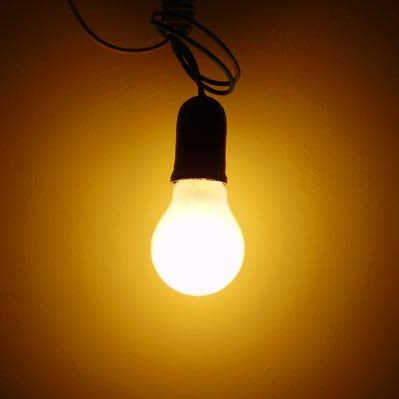</img></br>

&emsp;プログラム的には下記のようなデータとして扱われます。

```cpp
struct PointLight{
	Vector3 position;	//位置
	Vector3	color;		//ライトのカラー
	Vector4 attn;		//減衰用のパラメータ	
};
```
&emsp;positionはポイントライトの座標、colorはライトのカラーで光の三原色として扱われます。attnは光の減衰のためのパラーメータです。ポイントライトはサーフェイスとの距離に応じて、光の影響が弱くなるので、減衰のためのパラメータも必要になります。多くの場合でポイントライトが影響を与える範囲などが入っています。【以前の章を入れる】で勉強したディレクションライトは位置情報はなく、ある特定の方向のみを持つライトのディレクションライトです。ですた、ポイントライトはディレクションライトとは異なり、位置情報を持っています。また、光を特定の方向のみではなく全方位に放射しています。


### 16.1.2 ポイントライトでランバート拡散反射
&emsp;【以前の章】で材質が荒いマテリアルでおきる光の反射である拡散反射を学びました。そこでは拡散反射を計算���るための簡易的なライティングモデルのランバート拡散反射を勉強しました。ランバート拡散反射の強さは入射する光の方向と、面の法線で求めることができます。ディレクションライトではライトの方向と面の法線とで内積を計算することで拡散反射の強さを計算していました。(図16.2)</br>
**図16.2**</br>
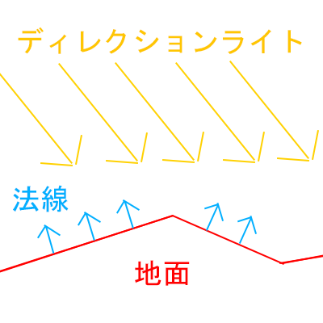</img></br>
&emsp;ポイントライトでランバート拡散反射を計算する場合も、考え方はディレクションライトの場合と同じです。光の影響を計算したい面に入射してくる光の方向と、面の法線の内積を求めることで、反射の強さを計算します。面の法線はディレクションライトの場合と同じなので、考える必要はありません。考える必要があるのは入射してくる光の方向です。光の方向は次の計算で求めることができます。</br>
$$ 光が入射するサーフェイスの座標　－　ポイントライトの座標 $$

**図16.3**</br>
</img></br>
&emsp;入射してくる光の方向を計算することができたら、次は光の方向と逆向きのベクトルと面の法線とで内積を取って、反射する光の強さを計算します。</br>
$$ 光の強さ = dot( -光の方向, 面の法線 ) $$
これはディレクションライトの章で勉強したランバート拡散反射と同じです。ただし、ポイントライトはここからサーフェイスとライトの距離に応じて強さが変化していきます。では、指定した距離を超えたらライトの強さが0になる計算式を見てみましょう。今回はライトとの距離が50を超えたら、影響率が0になるとします。</br>
$$ ライトの影響率 = 1 - ライトまでの距離 ÷ 50(指定された距離) $$
&emsp;この計算式の結果を表でまとめてみましょう。</br>

| ライトまでの距離 | 計算式 | 影響率 | コメント |
| ---- | ---- | ---- | ---- |
| 0 | 1 - 0 ÷ 50 | 1 | 影響率が1.0なので、ライトの影響を完全に受ける | 
| 10 | 1 - 10 ÷ 50 | 0.8 | 影響率が0.8なので、ライトの影響を80%受ける |
| 25 | 1 - 25 ÷ 50 | 0.5 | 影響率が0.5なので、ライトの影響を50%受ける |
| 50 | 1 - 50 ÷ 50 | 0.0 | 影響率が0.0なので、ライトの影響は全く受けない |

&emsp;この計算式で求めた影響率をライトの強さに乗算することで、サーフェイスに入射したポイントライトの強さを求めることができます。では、ここまでのまとめとしてポイントライトの強さを求める疑似コードを示します。

``` cpp
struct PointLight{
	float3 pos;
	float3 color;
	float range;
};
PointLight pointLig : register( b0 );

//ピクセルシェーダー。
//psIn.worldPosはサーフェイスのワールド座標。
//psIn.normalはサーフェイスの法線。
float4 PSMain( PSIn psIn )
{
	　　・
	　　・
	　　・
	//１. 光源からサーフェイスに入射するベクトルを求める。
	float ligDir = normalize( psIn.pos - pointLig.pos );
	//２. 光源からサーフェイスまでの距離を求める。
	float distance = length( psIn.pos - pointLig.pos );
	//３. 内積を使って反射の強さを計算する。(ランバート拡散反射)
	float t = max( 0.0f, dot( -ligDir , psIn.normal ) );
	//４. 影響率を計算する。影響率は0.0～1.0の範囲で、
	//　  指定した距離(pointsLights[i].range)を超えたら、影響率は0.0になる。
	float affect = 1.0f - min( 1.0f, distance / pointLig.range );
　　//５. 最終的にサーフェイスが受けるライトの影響を計算する。
	float3 lig = pointLig.color * t * affect;
	    ・
		・
		・
}
```

### 16.1.3 【ハンズオン】ポイントライトを実装
&emsp;では、Sample_16_01を利用してポイントライトを実装していきましょう。

#### step-1 ポイントライト構造体を定義する。
&emsp;まず、ポイントライト構造体を定義します。main.cppにリスト16.1のプログラムを入力してください。</bf>
[リスト16.1 main.cpp]
```cpp
//step-1 ポイントライト構造体を定義する。
//ポイントライト構造体。
struct SPointLight {
	Vector3 position;	//座標。
	float pad0;			//パディング
	Vector3 color;		//ライトのカラー
	float range;		//ライトの影響を与える範囲。
};
```
#### step-2 ポイントライトの数を表す定数を定義。
&emsp;続いて、ポイントライトの数を定義します。main.cppにリスト16.2のプログラムを入力して下さい。</br>
[リスト16.2 main.cpp]
```cpp
//step-2 ポイントライトの数を表す定数を定義。
const int NUM_POINT_LIGHT = 16;
```


#### step-3 ポイントライトをランダムな位置とカラーで初期化する。
&emsp;次は、ポイントライトを初期化します。今回は16個のポイントライトを使用するので、配列を利用しています。リスト16.3のプログラムを入力して下さい。</br>
[リスト16.3 main.cpp]
```cpp
//step-3 ポイントライトをランダムな位置とカラーで初期化する。
SPointLight pointLights[NUM_POINT_LIGHT];
for (auto& pt : pointLights) {
	pt.position.x = static_cast<float>(random() % 1000) - 500.0f;
	pt.position.y = 20.0f; //高さは20固定。
	pt.position.z = static_cast<float>(random() % 1000) - 500.0f;
	pt.range = 50.0f;		//影響範囲も50で固定しておく。
	pt.color.x = static_cast<float>(random() % 255) / 255.0f;
	pt.color.y = static_cast<float>(random() % 255) / 255.0f;
	pt.color.z = static_cast<float>(random() % 255) / 255.0f;
}
```

#### step-4 表示するモデルを初期化する。
&emsp;ポイントライトの準部ができたら、次は表示するモデルを初期化します。今回は女の子のキャラクターと洞窟を表示します。モデルを初期化するときに拡張データとして、step-3で作成したポイントライトの配列を渡しています。こうすることで、Model���ラスの���部で定数バッファが確保されて、ディスクリプタヒープに登録されます。リスト16.4のプログラムを入力してください。</br>
[リスト16.4 main.cpp]
```cpp
//step-4 表示するモデルを初期化する。
//女の子のモデルを初期化。
ModelInitData ladyModelInitData;
//ユーザー拡張データとしてポイントライトのリストを渡す。
ladyModelInitData.m_expandConstantBuffer = pointLights;
ladyModelInitData.m_expandConstantBufferSize = sizeof(pointLights);
ladyModelInitData.m_tkmFilePath = "Assets/modelData/unityChan.tkm";
ladyModelInitData.m_fxFilePath = "Assets/shader/model.fx";
Model ladyModel;
ladyModel.Init(ladyModelInitData);

//背景のモデルを初期化。
ModelInitData bgModelInitData;
//ユーザー拡張データとしてポイントライトのリストを渡す。
bgModelInitData.m_expandConstantBuffer = pointLights;
bgModelInitData.m_expandConstantBufferSize = sizeof(pointLights);
bgModelInitData.m_tkmFilePath = "Assets/modelData/bg.tkm";
bgModelInitData.m_fxFilePath = "Assets/shader/model.fx";
Model bgModel;
bgModel.Init(bgModelInitData);
```

#### step-5 ポイントライトを毎フレーム回す。
&emsp;今回は動的光源(動く光源)であることを強調するために、ポイン���ライトを毎フレーム動かしてみようと思います。リスト16.5のプログラムを入力してみて下さい。</br>
[リスト16.5 main.cpp]
```cpp
//step-5 ポイントライトを毎フレーム回す。
Quaternion qRot;
qRot.SetRotationDegY(1.0f);
for (auto& pt : pointLights) {
	qRot.Apply(pt.position);
}
```

#### step-6 モデルのドローコールを実行。
&emsp;では、cpp側はこれで最後です。モデルのドローコールを実行しましょう。リスト16.6のプログラムを入力してください。</br>
[リスト16.6 main.cpp]
```cpp
//step-6 モデルのドローコールを実行。
ladyModel.Draw(renderContext);
bgModel.Draw(renderContext);
```

#### step-7 ポイントライト構造体を定義する。
&emsp;cpp側が完成したので、次はシェーダー側です。シェーダー側にもポイントライト構造体を定義しましょう。Assets/shader/model.fxを開いてリスト16.7のプログラムを入力してください。</br>
[リスト16.7 model.fx]
```cpp
//step-7 ポイントライト構造体を定義する。
struct SPointLight {
	float3 position;	//座標。
	float3 color;		//ポイントライトのカラー。
	float  range;		//影響を与える範囲。
};
```
#### step-8 ポイントライトの数を表す定数を定義。
&emsp;続いて、シェーダー側にもポイントライトの数を表す定数を定義しましょう。model.fxにリスト16.8のプログラムを入力してください。</br>
[リスト16.8 model.fx]
```cpp
//step-8 ポイントライトの数を表す定数を定義。
static const int NUM_POINT_LIGHT = 16;
```
#### step-9 ポイントライトの定数バッファにアクセスするための変数を定義する。
&emsp;続いて、ポイントライトの定数バッファにアクセスるための変数を定義しましょう。この定数バッファはModelクラスの初期化時に拡張データとして指定したものです。model.fxにリスト16.9のプログラムを入力してください。</br>

[リスト16.9 model.fx]
```cpp
cbuffer PointLightCb : register(b1){
	SPointLight pointsLights[NUM_POINT_LIGHT];
}
```

#### step-10 ポイントライトから光によるランバート拡散反射を計算。
&emsp;いよいよ最後にピクセルシェーダーにランバート拡散反射を計算するプログラムを入力しましょう。ここで入力するプログラムは[16.1.2 ポイントライトでランバート拡散反射]で示した疑似コートとよく似たコードになっています。では、model.fxにリスト１16.10のプログラムを入力してください。</br>
[リスト16.10 model.fx]
```cpp
for( int i = 0; i < NUM_POINT_LIGHT; i++){
	//１．光源からサーファイスに入射するベクトルを計算。
	float3 ligDir = normalize( psIn.worldPos - pointsLights[i].position);
	//２．光源からサーフェイスまでの距離を計算。
	float distance = length( psIn.worldPos - pointsLights[i].position );
	//３．光の入射ベクトルとサーフェイスの法線で内積を取って反射の強さを計算する。
	float t = max( 0.0f, dot( -ligDir , psIn.normal ) );
	//４．影響率を計算する。影響率は0.0～1.0の範囲で、
	//    指定した距離(pointsLights[i].range)を超えたら、影響率は0.0になる。
	float affect = 1.0f - min( 1.0f, distance / pointsLights[i].range );
	lig += pointsLights[i].color * t * affect;
} 
```

#### step-11 実行
&emsp;ここまで入力出来たら最後に実行をしてみてください。うまくいっていると図16.4のように洞窟内でポイントライトが回っているプログラムが実行できます。</br>
**図16.4**</br>
</img></br>

## 16.2 Tile based deffered rendering( TBDR )
&emsp;では、TBR技術の１つのTBDRについて見ていきましょう。TBDRはChapter12で勉強したディファードレンダリングの改良版です。DirectX9世代のGPUでは動的光源が増えると処理がドンドン重くなっていくという問題がありました。フォワード系に比べるとディファード系は多少マシですが、それでも限界があります。これを解決するために考えられたのが、DefferdRenderingの進化版となる、TBDRです。

### 16.2.1 アルゴリズム概要
&emsp;TBDRのアルゴリズムを簡単に説明すると、「スクリーンをタイル状に分割して、そのタイルに影響を与える光源のリストを作成する。そのあとで、そのタイル含まれるピクセルに影響を与える光源だけでライティングを計算する。」というものです。ポイントライトの数を増やすと処理が重くなるのは、**「全てのピクセルで全てのポイントライトとライトの影響を計算する必要がある」**という点です。16.1.3のハンズオンでピクセルシェーダーに次のようなコードを記述したと思います。

```cpp
for( int i = 0; i < NUM_POINT_LIGHT; i++){
	//１．光源からサーファイスに入射するベクトルを計算。
	float3 ligDir = normalize( psIn.worldPos - pointsLights[i].position);
	//２．光源からサーフェイスまでの距離を計算。
	float distance = length( psIn.worldPos - pointsLights[i].position );
	//３．光の入射ベクトルとサーフェイスの法線で内積を取って反射の強さを計算する。
	float t = max( 0.0f, dot( -ligDir , psIn.normal ) );
	//４．影響率を計算する。影響率は0.0～1.0の範囲で、
	//    指定した距離(pointsLights[i].range)を超えたら、影響率は0.0になる。
	float affect = 1.0f - min( 1.0f, distance / pointsLights[i].range );
	lig += pointsLights[i].color * t * affect;
} 
```
&emsp;このループがポイントライトの計算なのですが、この計算がすべてのピクセルで実行されます。仮に1920×1080の解像度の場合は、ピクセルの数は1920×1080=約200万になります。このとき、このゲームにポイントライトが1000個置かれていた場合、ポイントライトの計算は、ピクセル数(200万) × ポイントライトの数(1000)で約20億回計算されることとなります。これはGPUといえども厳しい数字です。そこでTBRでは、画面を図16.5のようにタイル状に分割して、各タイルごとに影響を受けるポイントライトのリストを作成することで計算量を大幅に減らす工夫がなされています。</br>
**図16.5**</br>
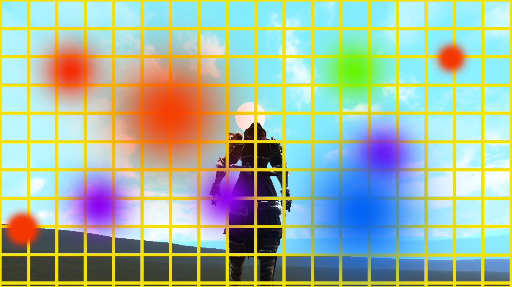</img></br>

### 16.2.2 アルゴリズム詳細
&emsp;では、アルゴリズムの詳細を見ていきましょう。TBDRのアルゴリズムは下記のような流れになります。
1. モデル描画パスでG-Bufferを作成する。
2. スクリーンをタイル状に分割して、各タイルごとに影響を与える可能性のある光源のリストを作成する。
3. 2で調べた光源のリストとG-Bufferを使用してポストエフェクト的にライティングを行っていく。</br>

&emsp;1と2はChapter12で勉強したディファードレンダリングと変わりありません。重要なのは2番の「スクリーンをタイル状に分割して、各タイルごとに影響を与える可能性のある光源のリストを作成する」です。２番の処理はライトカリングと呼ばれます。ライト化リングではポイントライトとタイルのあたり判定を行い、衝突している場合は影響を与えるライトの番号を調べます。</br>

**図16.6**</br>
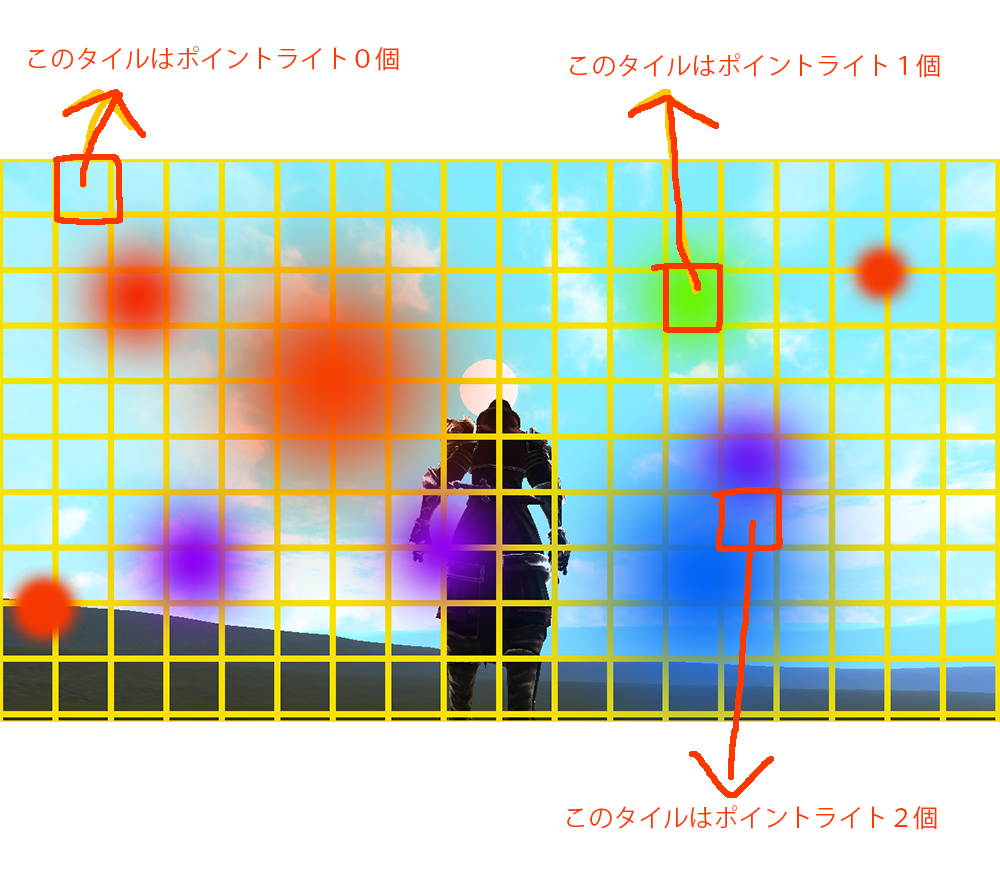</img></br>

### 16.2.3 計算量を調べてみる
&emsp;では、ライトカリングを行うことで、本当に計算量が少なくなるのか考えてみましょう。結論を先に述べておくと、図16.6のようなケースであればライトカリングを行うことで、計算量は95%削減できます。これは素晴らしい最適化です。図16.6であれば、ピクセル数が200万あるので、ポイントライトが10個設置されている場合、何も工夫をしなければ計算量は2000万回ほどになります。では、ライトカリングを行うとどうなるでしょうか。？図16.6では、画面を18×10=180個のタイルに分割しています。ここで注目してほしいのが、ほとんどのタイルがポイントライトの影響を受けていない or １つ程度のポイントライトの影響を受けているとなっています。数えてみると影響を受けているタイルは約60タイル程度です。1タイルに含まれているピクセル数は約１万ピクセルですので、ポイントライトとの計算が必要なピクセル数は約60万ピクセルとなります。そして、これらのピクセルが影響を受けるライトの数は1～2個です。つまり、図16.6のケースであれば、ライトカリングを行った場合、計算量は60万ピクセル × 1.5(1と２の中間にしています)の約90回程度となります。ライトカリングのためのタイルとポイントライトの衝突判定の計算量は1800回ですので、無視できるだけの計算量です。何も工夫をしない場合は計算量が2000万回だったのに対して、ライトカリングを行った場合は、わずか90万回になっています。これがTBDRが高速になる理由です。
&emsp;計算量のオーダーの差を表16.1にまとめていますので参照してください。</br>

**表16.1**</br>
| 方式 | ピクセル | ポイントライト | タイル |式 | 計算量 |
| ---- | ---- | ---- | ---- | ---- | ---- |
| 工夫なし | 200万 | 10 | なし |200万 + 10 | 2000万回 | 
| TBDR | 200万 | 10 | 180 | 10 × 180 +  60万 × 1.5 | 約90万回 | 


### 16.2.4 【ハンズオン】ポイントライトをディファードレンダリングで実装
&emsp;16.1.3のハンズオンで実装したポイントライトはフォワードレンダリングで実装しました。ですが、TBDRはディファードレンダリングの進化系です。ですので、まずはポイントライトをディファードレンダリングで実装していきましょう。Sample_16_02を立ち上げてください。
#### step-1 射影空間でのZ値を出力するためのG-Bufferを作成。
&emsp;ポイントライトを実装するためにはピクセルのワールド座標のデータをG-Bufferに出力する必要があります。しかし、今回のハンズオンではワールド座標を出力するためのG-Bufferは追加しません。代わりに射影空間でのZ値を出力するG-Bufferを追加します。理由としては、ワールド座標は射影空間のZ値から計算することができることと、TBDRの実装で射影空間でのZ値を利用するからです。また、射影空間でのZ値は、被写界深度、SSAO、SSRなど様々なポストエフェクトで利用されるため、ワールド座標のG-Bufferを用意せずに、Z値のG-Bufferで代用している実装がポピュラーであるように思います。では、main.cppにリスト16.11のプログラムを入力してください。</br>
[リスト16.11 main.cpp]
```cpp
//step-1 射影空間でのZ値を出力するためのG-Bufferを作成。
RenderTarget depthRT;
depthRT.Create(
	FRAME_BUFFER_W,
	FRAME_BUFFER_H,
	1,
	1,
	DXGI_FORMAT_R32_FLOAT,
	DXGI_FORMAT_UNKNOWN
);
```
#### step-2 RenderGBufferのパスのレンダリングターゲットにdepthRTを追加。
&emsp;では、続いてstep-1で作成したdepthRTをG-Buffer作成時のレンダリングターゲットとして追加します。リスト16.12のプログラムを入力してください。</br>
[リスト16.12 main.cpp]
```cpp
//step-2 RenderGBufferのパスのレンダリングターゲットにdepthRTを追加
&depthRT		//2番目のレンダリングターゲット

```

#### step-3 ディファードライティングで使用するテクスチャを追加。
&emsp;cpp側の最後のハンズオンとして、depthRTのテクスチャをディファードライティング時に使用するテクスチャとして追加しましょう。リスト16.13のプログラムを入力してください。</br>
[リスト16.13 main.cpp]
```cpp
//step-3 ディファードライティングで使用するテクスチャを追加。
spriteInitData.m_textures[2] = &depthRT.GetRenderTargetTexture();
```

#### step-4 RenderGBufferパスのピクセルシェーダーの出力に深度値を追加する。
&emsp;続いてG-Buffer作成のシェーダーを改造します。まずは、ピクセルシェーダーの出力構造体を改造して、２番目のレンダリングターゲットに深度値を出力できるようにします。Assets/shader/renderGBuffer.fxを開いてリスト16.14のプログラムを入力してください。</br>
[リスト16.14 renderGBuffer.fx]
```cpp
//step-4 RenderGBufferパスのピクセルシェーダーの出力に深度値を追加する。
float depth		: SV_Target2;	//深度値。
```

#### step-5 射影空間でのZ値を出力する。
&emsp;では、RenderGBufferの最後のハンズオンです。ピクセルシェーダーを変更して、射影空間でのZ値を出力できるようにしましょう。SV_Positionセマンティクスの座標はピクセルシェーダーに渡された時点て射影空間に変換されているので、そのZ値をそのまま出力するだけです。リスト16.15のプログラムを入力してください。</br>
[リスト16.15 renderGBuffer.fx]
```cpp
//step-5 射影空間でのZ値を出力する。
psOut.depth = psIn.pos.z;
```

#### step-6 深度テクスチャの追加。
&emsp;続いて、ディファードライティングのピクセルシェーダーを改造します。まずはt2レジスタに設定されている深度テクスチャにアクセスするための変数を追加します。Assets/shader/defferedLighting.fxを開いてリスト16.16のプログラムを入力してください。</br>
[リスト16.16 defferedLighting.fx]</br>
```cpp
//step-6 深度テクスチャの追加。
Texture2D<float> depthTexture : register(t2);	//射影空間に正規化された深度値。
```

#### step-7 射影空間の深度値からワールド座標を復元する。
&emsp;続いて、ピクセルシェーダー本体の改造を行います。まずは、ピクセルの射影空間での深度値をテクスチャから引っ張ってきて、ワールド座標を復元します。ワールド座標への復元の説明は数学的な話になりすぎるため、本書では詳細な説明は省かせていただきますが、ワールド空間から射影空間に変換する行列の逆行列を乗算することで、ワールド座標に復元しています。復元するプログラムの詳細が知りたい方は、defferedLighting.fxに記述されているCalcWorldPosFromUVZ関数の中身を調べてください。では、リスト16.17のプログラムを入力してください。</br>
[リスト16.17 defferedLighting.fx]</br>
```cpp
//step-7 射影空間の深度値からワールド座標を復元する。
float z = depthTexture.Sample( Sampler, In.uv );
float3 worldPos = CalcWorldPosFromUVZ( In.uv, z, mViewProjInv);		
```
#### step-8 ポイントライトを計算。
&emsp;では、最後のハンズオンです。G-Bufferの情報を元にポイントライトの計算を行います。リスト16.18のプログラムを入力してください。</br>
[リスト16.18 defferedLighting.fx]</br>
```cpp
for( int ligNo = 0; ligNo < NUM_POINT_LIGHT; ligNo++ ){
	//拡散反射を計算
	//光源からサーファイスに入射するベクトルを計算。
	float3 ligDir = normalize( worldPos - pointLight[ligNo].position);
	//光源からサーフェイスまでの距離を計算。
	float distance = length( worldPos - pointLight[ligNo].position );
	//影響率を計算する。影響率は0.0～1.0の範囲で、
	//    指定した距離(pointsLights[i].range)を超えたら、影響率は0.0になる。
	float affect = 1.0f - min( 1.0f, distance / pointLight[ligNo].range );
	//拡散反射光を加算。
	lig += CalcLambertReflection(
		ligDir, 
		pointLight[ligNo].color,
		normal ) * affect;

	//スペキュラ反射を加算。
	lig += CalcSpecularReflection(
		ligDir,
		pointLight[ligNo].color,
		normal,
		toEye
	) * affect;
}
```

#### step-9 実行
&emsp;ここまで入力出来���ら���後に実行をしてみてください。うまくいっていると図16.7のように洞窟内で1000個のポイントライトが回っているプログラムが実行できます。</br>

**図16.7**</br>
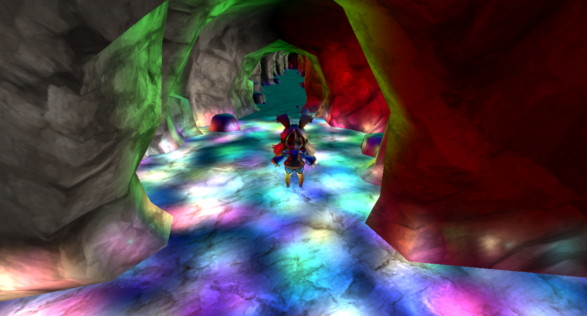</img></br>

### 16.2.5 ライトカリング
&emsp;16.2.4はシンプルなディファードレンダリングでの実装だったので、1000個ものポイントライトを設置すると処理落ちが発生していました。では、いよいよTBRのキモのライトカリングについて見ていきましょう。ライトカリングでは、カメラの視錐台を図16.8のようにタイルの数で分割します。</br>
**図16.8**</br>
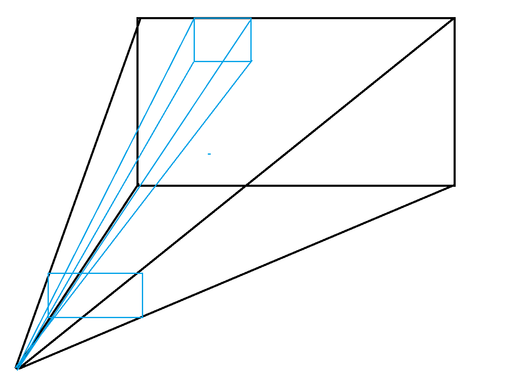</img></br>
&emsp;タイルの数分だけ作られた小さな視錐台とポイントライトの距離を計算して、その距離が影響を受ける範囲であれば、そのポイントライトは、タイル内のピクセルに影響を与えると判断します。視錐台とポイントライトの距離の計算は平面の方程式を利用して求めることができます。本書は数学の本ではないので詳細は割愛しますが、視錐台を構成する6つの平面と、ポイントライトの座標を使って、平面の方程式を解くだけで距離を求めることができます。難しそうに感じるかもしれませんが、平面の法線とポイントライトの座標とで内積を計算しているだけです。6つの平面のうちどれか一つでも、影響を受ける範囲に入っていれば影響リストに積まれます。ライトカリングでディスパッチされる、１スレッドグループのスレッド数はタイルに含まれるピクセルの数です。このスレッドで分担して、ポイントライトと視錐台の衝突判定を行います。例えば、タイルに含まれるピクセルの数が100、ポイントライトの数が1000であれば、１つのスレッドは10個のポイントライトと視錐台の衝突判定を計算することになります。</br>
&emsp;ライトカリングで、ポイントライトの影響リストが作成出来たら、後はディファードレンダリングで影響リストを参照して、必要な分だけのポイントライトの計算を行います。ディファードライティングのピクセルシェーダーでは、各ピクセルがどのタイルに属しているか計算して、そのタイルの影響リストを使って、ライティングの計算を行っていきます。

### 16.2.6 【ハンズオン】TBDRを実装
&emsp;では、いよいよTBDRを実装していきましょう。
#### step-1 ライトカリング用のコンピュートシェーダーをロード。
&emsp;まずは、ライトカリング用のシェーダーをロードします。Sample_16_03を立ち上げて、main.cppの109行目にリスト16.19のプログラムを入力してください。</br>s
[リスト16.19 main.cpp]</br>
```cpp
//step-1 ライトカリング用のコンピュートシェーダーをロード。
Shader csLightCulling;
csLightCulling.LoadCS("Assets/shader/lightCulling.fx", "CSMain");
```

#### step-2 ライトカリング用のパイプラインステートを初期化。
&emsp;続いて、パイプラインステートを作成します。リスト16.20のプログラムを入力してください。</br>
[リスト16.20 main.cpp]</br>
```cpp
//step-2 ライトカリング用のパイプラインステートを初期化。
PipelineState lightCullingPipelineState;
InitPipelineState(rootSignature, lightCullingPipelineState, csLightCulling);
```

#### step-3 タイルごとのポイントライトの番号のリスト(影響リスト)を出力するUAVを初期化。
&emsp;続いて、タイルに影響を与えるポイントライトの番号を出力するためのUAVを作成します。リスト16.21のプログラムを入力してください。</br>
[リスト16.21 main.cpp]</br>
```cpp
//step-3 タイルごとのポイントライトの番号のリスト(影響リスト)を出力するUAVを初期化。
RWStructuredBuffer pointLightNoListInTileUAV;
//第一引数は1要素のサイズ。
//1要素はポイントライトの番号なので４バイト。
//第二引数はバッファ全体のサイズ。
//1つのタイルにすべてのポイントライトが含まれる可能性があるので、
//1つのタイルで番号を記憶できることが可能なサイズを確保する。
pointLightNoListInTileUAV.Init(
	sizeof(int),
	MAX_POINT_LIGHT * NUM_TILE,
	nullptr
);
```
影響リストは単なるポイントライトの番号の配列です。１つのタイルに全てのライトが含まれている可能性があるため、全てを記憶することが可能なサイズの配列を確保しています。</br>

#### step-4 ポイントライトの情報を送るための定数バッファを作成。
&emsp;ライトカリングでもポイントライトの情報が必要になるため、ライトのデータの転送先の定数バッファを作成さいます。リスト16.22のプログラムを入力してください。</br>

[リスト16.22 main.cpp]</br>
```cpp
//step-4 ポイントライトの情報を送るための定数バッファを作成。
//ライトカリングのカメラ用の定数バッファを作成。
LightCullingCameraData lightCullingCameraData;
lightCullingCameraData.mProj = g_camera3D->GetProjectionMatrix();
lightCullingCameraData.mProjInv.Inverse(g_camera3D->GetProjectionMatrix());
lightCullingCameraData.mCameraRot = g_camera3D->GetCameraRotation();
lightCullingCameraData.screenParam.x = g_camera3D->GetNear();
lightCullingCameraData.screenParam.y = g_camera3D->GetFar();
lightCullingCameraData.screenParam.z = FRAME_BUFFER_W;
lightCullingCameraData.screenParam.w = FRAME_BUFFER_H;
ConstantBuffer cameraParamCB;
cameraParamCB.Init(sizeof(lightCullingCameraData), &lightCullingCameraData);

//ライトカリングのライト用の定数バッファを作成。
ConstantBuffer lightCB;
lightCB.Init(sizeof(light), &light);
```

#### ste-5 ライトカリング用のディスクリプタヒープを作成。
&emsp;使用するリソースをまとめたディスクリプタヒープを作成します。ライトカリングでは、ピクセルの深度情報を送る必要があります。これは、ピクセルのワールド座標を計算する必要があるためです。リスト16.23のプログラムを入力してください。</br>

[リスト16.23 main.cpp]</br>
```cpp
//ste-5 ライトカリング用のディスクリプタヒープを作成。
DescriptorHeap lightCullingDescriptroHeap;
lightCullingDescriptroHeap.RegistShaderResource(
	0, 
	depthRT.GetRenderTargetTexture()
);
lightCullingDescriptroHeap.RegistUnorderAccessResource(
	0, 
	pointLightNoListInTileUAV
);
lightCullingDescriptroHeap.RegistConstantBuffer(
	0, 
	cameraParamCB
);
lightCullingDescriptroHeap.RegistConstantBuffer(
	1, 
	lightCB
);
lightCullingDescriptroHeap.Commit();

//ポストエフェクト的にディファードライティングを行うためのスプライトを初期化。
Sprite defferdLightingSpr;
InitDefferedLightingSprite(
	defferdLightingSpr, 
	gbuffers, 
	ARRAYSIZE(gbuffers), 
	light,
	pointLightNoListInTileUAV
);
```

#### step-6 ライトカリングのコンピュートシェーダーをディスパッチ。
&emsp;step-6でcpp側のプログラムは終了です。では、最後にコンピュートシェーダーをディスパッチしましょう。ディスパッチするスレッドグループの数はタイルの数です。リスト16.24のプログラムを入力して下さい。</br>
[リスト16.24 main.cpp]</br>
```cpp
//step-6 ライトカリングのコンピュートシェーダーをディスパッチ。
renderContext.SetComputeRootSignature(rootSignature);
lightCB.CopyToVRAM(light);
renderContext.SetComputeDescriptorHeap(lightCullingDescriptroHeap);
renderContext.SetPipelineState(lightCullingPipelineState);
//グループの数はタイルの数。
renderContext.Dispatch(
	FRAME_BUFFER_W / TILE_WIDTH,
	FRAME_BUFFER_H / TILE_HEIGHT,
	1
);
```

#### step-7 タイル内でのインデックスを求める。
&emsp;続いて、ライトカリングシェーダーを改造していきましょう。ライトカリングシェーダーはタイルに含まれているピクセルの数分だけスレッドが生成されます。ここでは、グループ内でのスレッド番号を求めています。Assets/shader/lightCulling.fxを開いて118行目からリスト16.25のプログラムを入力してください。
[リスト16.25 lightCulling.fx]</br>
```cpp
//step-7 タイル内でのインデックスを求める
//groupThreadIdはグループ内でのスレッド番号。
//これを使って、グループ内でのスレッド番号を計算する。
uint groupIndex = groupThreadId.y * TILE_WIDTH + groupThreadId.x;
```
#### step-8 共有メモリを初期化する。
&emsp;共有メモリとは、スレッド間で共有されるメモリのことです。ここはマルチスレッドプログラムの知識がないと難しい話になってくるのですが、複数人で仕事をするうえでの共有されるデータといったイメージです。例えば、stTileNumLightsはタイルに含まれるライトの数なのですが、この数は全てのスレッドが協力して調査するため、共有メモリとなっています。では、リスト16.26のプログラムを入力してください。</br>
[リスト16.26 lightCulling.fx]</br>
```cpp
//step-8 共有メモリを初期化する。
if(groupIndex == 0)
{
	sTileNumLights = 0;
	sMinZ = 0x7F7FFFFF;		// floatの最大値
	sMaxZ = 0;
}
```

#### step-9 このスレッドが担当するピクセルのカメラ空間での座標を計算する。
&emsp;ライトカリングで一番最初に行う処理は、タイルのカメラ空間での最大深度値と最小深度値を調査することです。ですので、このスレッドが担当するピクセルのカメラ空間での座標を求める必要があります。リスト16.27のプログラムを入力してください。</br>
[リスト16.27 lightCulling.fx]</br>
```cpp
//step-9 このスレッドが担当するピクセルのカメラ空間での座標を計算する。
uint2 frameUV = dispatchThreadId.xy;
//ビュー空間での座標を計算する。
float3 posInView = ComputePositionInCamera(frameUV);
```

#### step-10 全てのスレッドがここに到達するまで同期を取る。
&emsp;スレッドは並列に動作しています。なので、スレッドAはライトカリングの処理を10行目まで進めているけど、スレッドBは3行目までしか進んでいないということが起こります。しかし、場合によっては11行目以降のプログラムは、みんな揃ってスタートする必要があるという場合があります。今回のケースでは、step-11以降のプログラムでは、sMinZとsMaxZという共有メモリが確実に初期化されている必要があるため、一旦全てのスレッドの同期を取る必要があります。HLSLにはGroupMemoryBarrierWithGroupSyncというスレッドの同期をとるための関数があります。リスト16.28のプログラムを入力してください。</br>
[リスト16.28 lightCulling.fx]</br>
```cpp
//step-10 全てのスレッドがここに到達するまで同期を取る
GroupMemoryBarrierWithGroupSync();
```

#### step-11 タイルの最大・最小深度を求める。
&emsp;スレッドの動機が取れたので、タイルの最小・最大深度を調査してsMinZとsMaxZに記憶します。ここで、sMinZとsMaxZが共有メモリであることに注意が必要です。これもマルチスレッドに絡んだ問題になってしまうため、本書の範疇から外れるため割愛しますが、sMinZとsMaxZの値を単純なプログラムで操作すると問題が起きます。共有されているメモリであるため、メモリの内容をスレッドAが書き換えている最中に、スレッドBが書き換えるということが可能になってしまいます。そういったことが起きた時に、メモリの内容はこちらが意図したものとは異なる状態になってしまいます。そこで、共有メモリの操作にはアトミック性が保証された命令を使う必要があります。アトミック性が保証されているとは、なにかのスレッドがメモリを操作しているときに、他のスレッドはメモリを操作することができないことを保証しているものです。HLSLにはC言語のmin、maxマクロと同じ処理をアトミックに実行できる、InterlockedMin関数とInterlockedMax関数があります。ここではこの二つの関数を利用して、タイルの最大・最小深度を求めていきます。リスト16.29のプログラムを入力してください。
[リスト16.29 lightCulling.fx]</br>
```cpp
//step-11 タイルの最大・最小深度を求める
// この処理は並列するスレッド全てで排他的に処理される
InterlockedMin( sMinZ, asuint(posInView.z) );
InterlockedMax( sMaxZ, asuint(posInView.z) );
// ここで同期を取ることでタイルの最大・最小深度を正しいものにする
GroupMemoryBarrierWithGroupSync();

```

#### step-12 タイルの視錘台を構成する６つの平面を求める。
&emsp;ポイントライトとタイルのあたり判定は、タイルの視錘台を構成する６つの平面を利用して行います。step-12ではこの６つの平面を表すデータを構築します。リスト16.30のプログラムを入力して下さい。</br>
[リスト16.30 lightCulling.fx]</br>
```cpp
//step-12 タイルの視錘台を構成する６つの平面を求める。
float4 frustumPlanes[6];
//この関数の中で、錘台を構成する６つ平面を計算している。
GetTileFrustumPlane( frustumPlanes, groupId );

```
#### step-13 タイルとポイントライトの衝突判定を行う。
&emsp;では、step-12で作成した平面の情報を使って、ポイントライトとタイルのあたり判定を実装しましょう。リスト16.31のプログラムを入力してください。</br>
[リスト16.31 lightCulling.fx]</br>
```cpp
//step-13 タイルとポイントライトの衝突判定を行う。
for (
	uint lightIndex = groupIndex; 	//初期化式
	lightIndex < numPointLight; 	//条件式
	lightIndex += TILE_SIZE			//反復式
)
{
	PointLight light = pointLight[lightIndex];

	// タイルとの判定
	bool inFrustum = true;
	for (uint i = 0; i < 6; ++i)
	{
		//ライトの座標と平面の法線とで内積を使って、ライトと平面との距離(正負あり)を計算している。
		float4 lp = float4(light.positionInView, 1.0f);
		float d = dot( frustumPlanes[i], lp );
		//ライトと平面の距離を使って、衝突判定を行っている。
		inFrustum = inFrustum && (d >= -light.range);
	}

	// タイルと衝突している場合
	if (inFrustum)
	{
		//衝突したポイントライトの番号を影響リストに積んでいく。
		uint listIndex;
		InterlockedAdd( sTileNumLights, 1, listIndex );
		sTileLightIndices[listIndex] = lightIndex;
	}
}
// ここで同期を取ると、sTileLightIndicesにタイルと衝突しているライトのインデックスが積まれている
GroupMemoryBarrierWithGroupSync();
```
&emsp;衝突判定は実行しているスレッドで分担して処理を行っています、for文のlightIndexの初期化式と反復式を見てみてください。初期値はグループ内のスレッド番号から始まっていて、反復式ではタイルサイズ(これはスレッドの数と同じになる)を加算しています。こうすることで、スレッド番号０番のスレッドは、０番のポイントライト、２５６番のポイントライト、５１２番のポイントライトを調べていくようになります。スレッド番号１番のスレッドは、１番のポイントライト、２５７番のポイントライト、５１３番のポイントライトと調べていきます。いかがでしょうか、見事にスレッドで分担してライトを処理できています。</br>
&emsp;ループの最後にスレッドの同期をとっていることに注意してください。step-14で衝突しているライトを影響リストに詰んでいくため、全てのスレッドの衝突判定が完了している必要があります。ですので、このタイミングでスレッドの同期をとっています。</br>

#### step-14 ライトインデックスを出力バッファに出力。
&emsp;衝突しているライトの調査が終わったら、影響リストにライトの番号を記憶していきます。リストリスト16.32のプログラムを入力してください。</br>

[リスト16.32 lightCulling.fx]</br>
```cpp
//step-14 ライトインデックスを出力バッファに出力
uint numCellX = (screenParam.z + TILE_WIDTH - 1) / TILE_WIDTH;
uint tileIndex = floor( frameUV.x / TILE_WIDTH ) + floor( frameUV.y / TILE_WIDTH ) * numCellX;
uint lightStart = numPointLight * tileIndex;
for (uint lightIndex = groupIndex; lightIndex < sTileNumLights; lightIndex += TILE_SIZE)
{
	rwLightIndices[lightStart + lightIndex] = sTileLightIndices[lightIndex];
}
```
&emsp;影響リストを作成する処理も各スレッドで分担しています。for文の初期化式と反復式を見てみてください。step-13と同じような式になっています。</br>

#### step-15 最後に番兵を設定する。
&emsp;最後に影響リストの最後に番兵を設定します。step-16以降のディフェードライティングでは、番兵(0xFFFFFFFF)という値が出てくるまで、影響リストを捜査してライトの番号を取得していき、ポイントライトの計算を行うようになります。リスト16.33のプログラムを入力してください。</br>
[リスト16.33 lightCulling.fx]</br>
```cpp
//step-15 最後に番兵を設定する。
if ((groupIndex == 0) && (sTileNumLights < numPointLight))
{
	//-1で番兵。
	rwLightIndices[lightStart + sTileNumLights] = 0xffffffff;
}
```

#### step-16 このピクセルが含まれているタイルの番号を計算する。
&emsp;続いて、ディファードライティングのシェーダーを改造していきます。Assets/shader/defferedLighting.fxを開いて118行絵にリスト16.34のプログラムを入力してください。</br>
[リスト16.34 defferedLighting.fx]</br>
```cpp
//step-16 このピクセルが含まれているタイルの番号を計算する。
//スクリーンをタイルで分割したときのセルのX座標を求める。
uint numCellX = (screenParam.z + TILE_WIDTH - 1) / TILE_WIDTH;
//タイルインデックスを計算する。
uint tileIndex = floor(In.pos.x / TILE_WIDTH) + floor(In.pos.y / TILE_WIDTH) * numCellX;
```
&emsp;ここでは、処理するピクセルがどのタイルに含まれているかを計算しています。

#### step-17 このピクセルが含まれるタイルの影響リストの開始位置と終了位置を計算する。
&emsp;step-16で計算した、タイル番号を使って、このタイルに影響を与えるライトの番号が記憶されている配列の開始位置と終了位置を計算します。リスト16.35のプログラムを入力してください。</br>
[リスト16.35 defferedLighting.fx]</br>
```cpp
//step-17 このピクセルが含まれるタイルの影響リストの開始位置と終了位置を計算する。
uint lightStart = tileIndex * numPointLight;
uint lightEnd = lightStart + numPointLight;
```

#### step-18 ポイントライトを計算。
&emsp;影響リストの開始位置と終了位置が求まったら、後はポイントライトの番号を引っ張ってきて、番兵があらわれるまでライティングの計算を行います。リスト16.36のプログラムを入力して下さい。</br>

[リスト16.36 defferedLighting.fx]</br>
```cpp
//step-18 ポイントライトを計算。
for (uint lightListIndex = lightStart; lightListIndex < lightEnd; lightListIndex++) {
	uint ligNo = pointLightListInTile[lightListIndex];
	if (ligNo == 0xffffffff) {
		//このタイルに含まれるポイントライトはもうない。
		break;
	}

	//拡散反射を計算
	//１．光源からサーファイスに入射するベクトルを計算。
	float3 ligDir = normalize( worldPos - pointLight[ligNo].position);
	//２．光源からサーフェイスまでの距離を計算。
	float distance = length( worldPos - pointLight[ligNo].position );
	//３．影響率を計算する。影響率は0.0～1.0の範囲で、
	//    指定した距離(pointsLights[i].range)を超えたら、影響率は0.0になる。
	float affect = 1.0f - min( 1.0f, distance / pointLight[ligNo].range );
	//４．拡散反射光を加算。
	lig += CalcLambertReflection(
		ligDir, 
		pointLight[ligNo].color,
		normal ) * affect;

	//スペキュラ反射を加��。
	lig += CalcSpecularReflection(
		ligDir,
		pointLight[ligNo].color,
		normal,
		toEye
	) * affect;
}
```

## 16.3 Tile based forward rendering( TBFR )
&emsp;ではTBR系の勉強の最後に、TBFR(Tile based forward rendering)について見ていきましょう。TBDRのようなDeferred系のレンダリング手法は下記のようなデメリットがあります。</br>
　
1. 半透明描画に弱い。
2. 多彩なマテリアルの表現に弱い。</br>
 多彩なマテリアルに対応するためには、マテリアルの情報を書き込むためのG-Bufferが必要になる。
3. G-Bufferの肥大化によるメモリ使用量の増加。</br>

&emsp;このように、Deferred系は柔軟性が低く、特にノンフォトリアルな絵を作りたい場合は不向きな面があります。そこでforward系を改良してはどうか？という考えが生まれます。そこから生まれてきたのがTBFR(別名forward+)といわれるレンダリング手法です。</br>

## 16.3.1 アルゴリズム
&emsp;TBFRもアルゴリズムの概要はTBDRと同様です。スクリーンをタイル状に分割して、コンピュートシェーダーでタイルに衝突しているライトのリストを作成します。そしてそのリストを使用して、ピクセルに当たる可能性のあるライトに対してだけライティングを計算するというものです。</br>
</br>ではアルゴリズムの詳細を見ていきましょう。TBFRはZPrepassという描画パスが必要になります。これはDeferred系でG-Bufferと同じようなものですが、深度値のみ出力する場合にZPrepassという言葉が使われます。TBFRでもライトカリングを行うためには、各タイルの視推台を作成するときに深度値が必要になります。そのため、ライトカリングを行う前に、ZPrepassというパスで深度テクスチャを作成します。TBFRの処理の流れは下記になります。</br>

1. ZPrepassで深度テクスチャを作成する。
2. コンピュートシェーダーでタイルごとのライトカリング。
3. ２で作成されたライトのリストを使用してモデルを描画。(モデル描画パス)

では各ステップを詳細に見ていきましょう。</br>
1. ZPrepassで深度テクスチャを作成する。</br>
Deferred系のG-Bufferの作成をイメージしてください。それの深度値を作成するだけのものがZPrepassです。

2. コンピュートシェーダーでタイルごとのライトカリング。</br>
スクリーンをタイル状に分割して、タイルと接触しているライトのリストを作成します。こちらもTBDRと同じです。ただし、TBDRではライトのリストを作成した後で、そのままコンピュートシェーダーでディファードライティングを行っていましたが、TBFRではここではライティング計算は行いません。ライトのリストを作成するだけです。</br>
3. ２で作成されたライトのリストを使用してモデルを描画。(モデル描画パス)</br>
モデルの描画パスです。TBFRはforward系のレンダリングですので、モデル描画パスでライティングの計算を行います。このライティングの計算の時に2で作成したライトのリストを使用します。

<!-- 改ページ. -->
<div style="page-break-before:always"></div>

## 16.3.2 【ハンズオン】TBFRを実装
### step-1 zprepassクラスを作成。
&emsp;まずZPrepassを実行するクラスを作成します。ZPrepassはG-Bufferの考え方とほとんど同じです。深度テクスチャのみを作成する処理だと考えて下さい。では、Sample_16_04を立ち上げて、main.cppの140行目にリスト16.37のプログラムを入力して下さい。</br>
[リスト16.37 main.cpp]
```cpp
//step-1 zprepassクラスを作成。
class ZPrepass {
private:
	RenderTarget m_depthRT;	//深度値を書き込むレンダリングターゲット。
	Model m_ladyModel;		//女の子のモデル。
	Model m_bgModel;		//背景モデル。
public:
	RenderTarget& GetDepthRenderTarget()
	{
		return m_depthRT;
	}
	void Init()
	{
		//深度値を書き込むレンダリングターゲットを作成。
		m_depthRT.Create(
			FRAME_BUFFER_W,
			FRAME_BUFFER_H,
			1,
			1,
			DXGI_FORMAT_R32_FLOAT,
			DXGI_FORMAT_D32_FLOAT
		);

		//モデルを初期化。
		ModelInitData ladyModelInitData;
		ladyModelInitData.m_tkmFilePath = "Assets/modelData/unityChan.tkm";
		//シェーダーをZPrepass用にする。
		ladyModelInitData.m_fxFilePath = "Assets/shader/zprepass.fx";
		// 出力先のカラーバッファのフォーマットを指定する。
        ladyModelInitData.m_colorBufferFormat[0] = DXGI_FORMAT_R32_FLOAT;
		m_ladyModel.Init(ladyModelInitData);

		//背景のモデルを初期化。
		ModelInitData bgModelInitData;
		//ユーザー拡張データとしてポイントライトのリストを渡す。
		bgModelInitData.m_tkmFilePath = "Assets/modelData/bg.tkm";
		//シェーダーをZPrepass用にする。
		bgModelInitData.m_fxFilePath = "Assets/shader/zprepass.fx";
		//出力先のカラーバッファのフォーマットを指定する。
        bgModelInitData.m_colorBufferFormat[0] = DXGI_FORMAT_R32_FLOAT;
		m_bgModel.Init(bgModelInitData);
	}
	void Draw(RenderContext& renderContext)
	{
		//レンダリングターゲットを切り替えてドロー。
		RenderTarget* rts[] = {
			&m_depthRT
		};
		renderContext.WaitUntilToPossibleSetRenderTargets(1, rts);
		//レンダリングターゲットを設定。
		renderContext.SetRenderTargets(1, rts);
		//レンダリングターゲットをクリア。
		renderContext.ClearRenderTargetViews(1, rts);

		m_ladyModel.Draw(renderContext);
		m_bgModel.Draw(renderContext);

		//レンダリングターゲットへの書き込み待ち。
		renderContext.WaitUntilFinishDrawingToRenderTargets(1, rts);

		//レンダリング先をフレームバッファに戻す。
		g_graphicsEngine->ChangeRenderTargetToFrameBuffer(renderContext);
	}
};
```

### step-2 ZPrepassクラスのオブジェクトを作成して初期化する。
&emsp;ZPrepassクラスが作成できたので、クラスのオブジェクトを定義して初期化を行いましょう。リスト16.38のプログラムを入力してください。</br>
[リスト16.38 main.cpp]
```cpp
//step-2 ZPrepassクラスのオブジェクトを作成して初期化する。
ZPrepass zprepass;
zprepass.Init();
```

### step-3 ZPrepass⇒ライトカリング⇒フォワードレンダリングの実行
&emsp;続いてレンダリングです。TBFRでは、ZPrepass⇒ライトカリング⇒フォワードレンダリングの順番でレンダリングを行います。処理の流れをイメージしながら、リスト16.39のプログラムを入力してください。</br>
[リスト16.39 main.cpp]
```cpp
//step-3 ZPrepass⇒ライトカリング⇒フォワードレンダリングの実行
//ZPrepass実行。
zprepass.Draw(renderContext);

//ライトカリングをディスパッチ。
lightCulling.Dispatch(renderContext);

//フォワードレンダリング。
ladyModel.Draw(renderContext);
bgModel.Draw(renderContext);
```

### step-4 ZPrepassシェーダーを実装する。
&emsp;step-4ではZPrepassシェーダーをすべて実装していきます。ZPrepassシェーダーは非常にシンプルなシェーダーです。頂点シェーダーでは単純な座標変換を行っているだけです。ピクセルシェーダーはピクセルのZ値を出力しているだけです。Assets/shader/zprepass.fxを開いてリスト16.40のプログラムを入力してください。</br>
[リスト16.40 zprepass.fx]
```cpp
//モデル用の定数バッファ
cbuffer ModelCb : register(b0){
	float4x4 mWorld;
	float4x4 mView;
	float4x4 mProj;
};

//頂点シェーダーへの入力。
struct SVSIn{
	float4 pos 		: POSITION;
};
//ピクセルシェーダーへの入力。
struct SPSIn{
	float4 pos 			: SV_POSITION;
};

/// <summary>
/// モデル用の頂点シェーダーのエントリーポイント。
/// </summary>
SPSIn VSMain(SVSIn vsIn, uniform bool hasSkin)
{
	SPSIn psIn;

	psIn.pos = mul(mWorld, vsIn.pos);	//モデルの頂点をワールド座標系に変換。
	psIn.pos = mul(mView, psIn.pos);	//ワールド座標系からカメラ座標系に変換。
	psIn.pos = mul(mProj, psIn.pos);	//カメラ座標系からスクリーン座標系に変換。
	return psIn;
}

/// <summary>
/// ピクセルシェーダーのエントリーポイント
/// </summary>
float4 PSMain( SPSIn psIn ) : SV_Target0
{
	return float4(psIn.pos.z, psIn.pos.z, psIn.pos.z, 1.0f);
}
```

### step-5 ライトカリングで作成したライトのリストを使って、ポイントライトを計算する。
&emsp;では、これで最後です。最後はフォワードレンダリングのシェーダーを改造します。やっていることはディファードライティングの時と全く同じです。ライトカリングで作成したポイントライトのリストを使って、ポイントライトの計算を行っています。では、Assets/shader/model.fxを開いて、リスト16.41のプログラムを入力してください。</br>
[リスト16.41 model.fx]
```cpp
//step-5 ライトカリングで作成したライトのリストを使って、ポイントライトを計算する。
//タイルの幅と高さ。
const int TILE_WIDTH = 16;
const int TILE_HEIGHT = 16;

//スクリーンの左上を(0,0)、右下を(1,1)とする座標系に変換する。
//ビューポート座標系に変換する。
float2 viewportPos = psIn.pos.xy;
//スクリーンをタイルで分割したときのセルのX座標を求める。
uint numCellX = (screenParam.z + TILE_WIDTH - 1) / TILE_WIDTH;
//タイルインデックスを計算する。
uint tileIndex = floor(viewportPos.x / TILE_WIDTH) + floor(viewportPos.y / TILE_WIDTH) * numCellX;

//このピクセルが含まれるタイルのライトインデックスリストの開始位置を計算する。
uint lightStart = tileIndex * numPointLight;
//このピクセルが含まれるタイルのライトインデックスリストの終了位置を計算する。
uint lightEnd = lightStart + numPointLight;

float3 lig = 0.0f;
float3 toEye = normalize(eyePos - psIn.worldPos.xyz);
for (uint lightListIndex = lightStart; lightListIndex < lightEnd; lightListIndex++) {
	uint ligNo = pointLightListInTile[lightListIndex];
	if (ligNo == 0xffffffff) {
		//このタイルに含まれるポイントライトはもうない。
		break;
	}
	//拡散反射を計算
	//１．光源からサーファイスに入射するベクトルを計算。
	float3 ligDir = normalize( psIn.worldPos - pointLight[ligNo].position);
	//２．光源からサーフェイスまでの距離を計算。
	float distance = length( psIn.worldPos - pointLight[ligNo].position );
	//３．影響率を計算する。影響率は0.0～1.0の範囲で、
	//    指定した距離(pointsLights[i].range)を超えたら、影響率は0.0になる。
	float affect = 1.0f - min( 1.0f, distance / pointLight[ligNo].range );
	//４．拡散反射光を加算。
	lig += CalcLambertReflection(
		ligDir, 
		pointLight[ligNo].color,
		psIn.normal ) * affect;

	//スペキュラ反射を加算。
	lig += CalcSpecularReflection(
		ligDir,
		pointLight[ligNo].color,
		psIn.normal,
		toEye
	) * affect;
}
return lig;
```

### step-6 実行
&emsp;ここまでのプログラムが入力出来たら、プログラムを実行してみてください。フォワードレンダリングでも大量のポイントライトを設置しても、高いパフォーマンスを発揮できていることが確認できます。

<!-- 改ページ. -->
<div style="page-break-before:always"></div>

# Chapter 17 レイトレーシング
<laead>
&emsp;このチャプターでは、Playstation5などの次世代のリアルタイムCGプログラミングで重要な要素となるレイトレーシングについて見ていきます。
</lead>

## 17.1 レイトレーシング対応のGPUの登場
&emsp;レイトレーシング法とは光の伝搬をシミュレーションすることによって、とてもリアルなコンピュータグラフィックスを表現する一般的な手法の１つです。レイトレーシング法は新しい手法なわけではなく、映画などのCGの世界では昔から使われてきていた手法です。一方ゲームの世界で使われてきていた手法というのはラスタライザ法です。ラスタライザ法というのは、ポリゴンなどの3Dデータをラスタ形式に変換して画像化する手法です。これは、3Dモデルの頂点座標を頂点シェーダーでスクリーン空間に変換して、ラスタライザが塗りつぶすピクセルを決定して、そのピクセルのカラーを決定するという、ここまで皆さんが勉強してきた手法です。これがラスタライザ法と呼ばれる手法です。</br>
&emsp;レイトレーシング法はラスタライザ法では簡単には実現できない影生成、アンビエントオクルージョン、屈折、グローバルイルミネーション、映り込みといった表現ををシンプルな考え方で実装することができます。では、なぜゲームの世界ではレイトレーシング法ではなく、ラスタライザ法が使われてきたのでしょうか。答えはレイトレーシング法は非常に処理負荷が高い手法だからです。映画の世界であれば、１枚の絵を作成するのに、膨大な時間を書けることができますが、ゲームの世界では16ミリ秒～33ミリ秒で1枚の絵を作成するという非常に厳しい制約のもとで動いています。そのため、レイトレーシングをリアルタイムで行うというのは現実的なものではありませんでした。
&emsp;しかし、2018年にGPUメーカーの雄のNVIDIAがリアルタイムレイトレーシングを行うための専用プロセッサを搭載した、RTXシリーズを発表しました。そしてほぼ同時期に、リアルタイムコンピュータグラフィックスを牽引してきた、MicrosoftのDirectXからリアルタムレイトレーシングを行うためのAPIセットのDirectX Raytracingは公開されました。これより、一気にリアルタムレイトレーシングの流れが加速し、すでに多くのゲームが発売されいます。2020年末発売予定のPlayStation5も当然のようにリアルタイムレイトレーシング対応のGPUを載せています。</br>

## 17.2 レイトレーシング法とラスタライザ法の違い
&emsp;レイトレーシング法とラスタライザ法は全く別の手法になるため、3Dの絵を画面に表示するまでの考え方が大きく異なっていきます。例えば、ラスタライザ法でポリゴンを画面に表示しようとすると、ドローコールというGPUに対する命令を行っていました。しかし、レイトレーシング法ではドローコールというものを行う必要はありません。代わりにカメラから光線を飛ばす命令を行うことになります。しかし、頂点バッファ、インデックスバッファ、座標変換、カメラ空間などといった、多くの基本的な考え方は同じです。ラスタライザ法で3Dの絵を表示する手法を本質的に理解できていれば、全く異質の手法であるわけではないことが分かってもらえると思います。では、レイトレーシング法の詳しい手法を見ていきましょう。</br>

### 17.2.1 レイトレ法の概要
&emsp;まず、ライティング、影、屈折、反射などを一切考えずに、レイトレーシング法で3Dグラフィックスを表現する方法について考えていきましょう。レイトレーシング法では、図17.1のようにカメラからスクリーンに交差するように光線を飛ばしていきます。この光線の数はスクリーンの画素数と同じになります。</br>

**図17.1**</br>
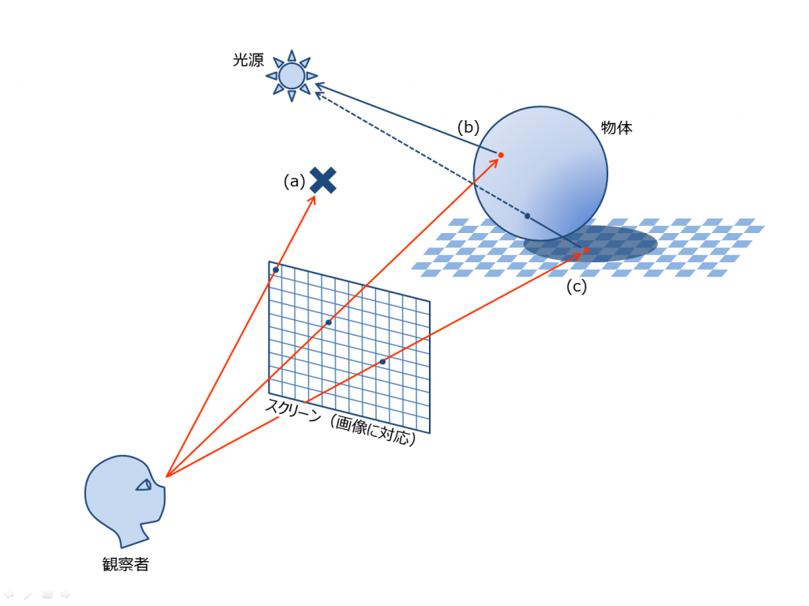</img></br>

&emsp;レイを飛ばすと、レイと3Dオブジェクトの交差判定を行います。これは線分(レイ)と三角形(ポリゴン)の交差判定です。そして、交差した場合、そのサーフェイスのカラーを決定します。決定されたカラーがピクセルのカラーになります。これを全ピクセルに対して行うことで、3DCGを画面上に表示することができます。</br>

**図17.2**</br>
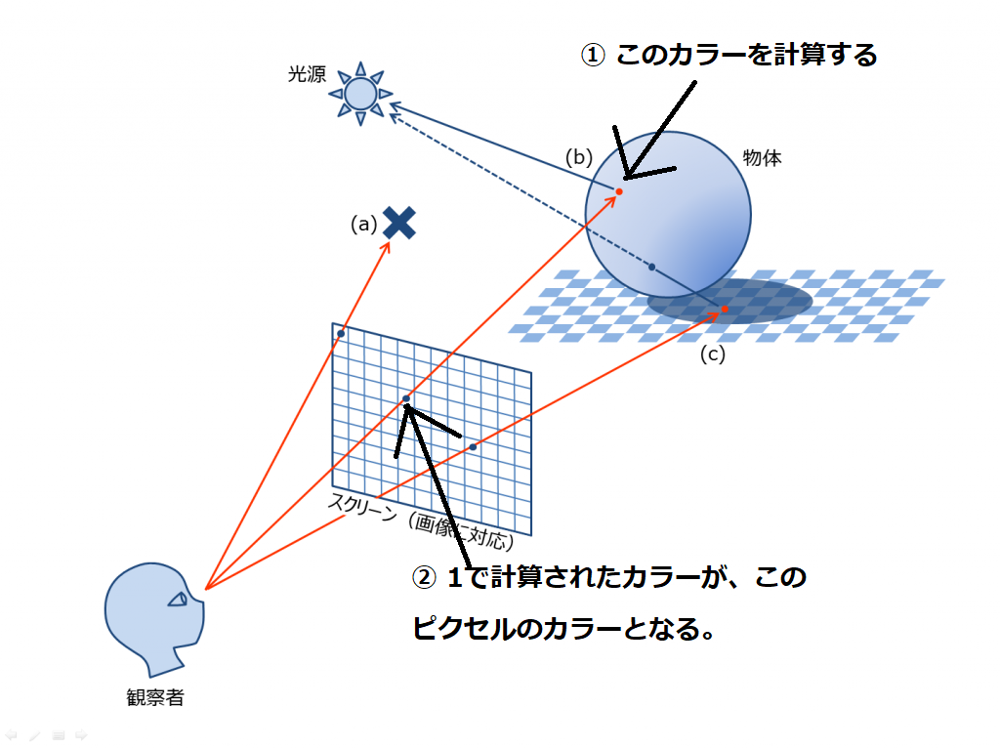</img></br>

## 17.3 【ハンズオン】レイトレ超入門
&emsp;では、早速実際にプログラムを書いてレイトレを行ってみましょう。今回のサンプルはDXRが動作する必要があるため、GeForce GTX 1060 6GB以上のGPUが必要となります。Sample_17_01を立ち上げてください。</br>

### step-1 人型モデルをレイトレワールドに追加する。
&emsp;レイトレを行うためには、レイと３Ｄモデルのポリゴンとの交差判定を行う必要があるため、３Ｄモデルのポリゴンが登録されたレイトレワールドというものを構築する必要があります。ゲームのシーンのようなものだと考えてください。(図17.3)</br>
**図17.3**</br>
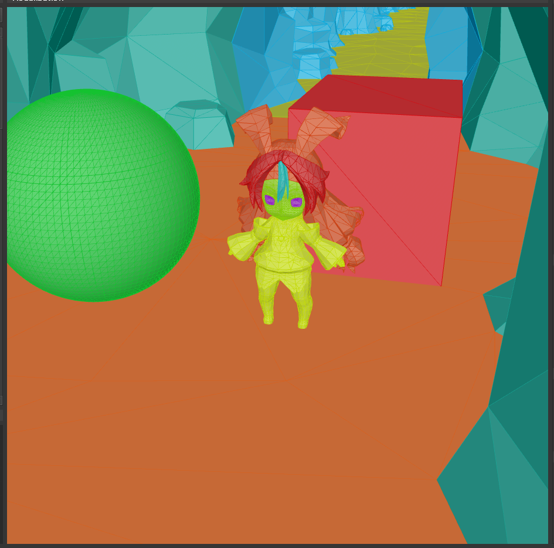</img></br>
&emsp;レイトレワールドに登録するのは３Ｄモデルのポリゴン情報なので、頂点バッファやインデックスバッファといった情報です。ですので、ここまで勉強してきたラスタライザベースのモデルクラスを利用することができます。では、main.cppにリスト17.1のプログラムを入力してください。</br>

[リスト17.1 main.cpp]
```cpp
//step-1 モデルをレイトレワールドに追加する。
//まずは普通にモデルをロードする。
ModelInitData humanModelInitData;
humanModelInitData.m_tkmFilePath = "Assets/modelData/unityChan.tkm";
Model humanModel;
humanModel.Init(humanModelInitData);

//モデルをレイトレワールドに追加。
g_graphicsEngine->RegistModelToRaytracingWorld(humanModel);
```
&emsp;Modelクラスを利用して、人型モデルのデータをロードしています。ロードができたら、GraphicsEngine::RegistModelToRaytracingWorld関数を利用して、モデルをレイトレワールドに登録しています。この関数の中でDirectXRaytracingでレイトレワールドを構築するためのジオメトリ情報を構築しています。(後述)


### step-2 登録されたモデルを使ってレイトレワールドを構築。
&emsp;モデルをレイトレワールドに登録することができたら、最後にGraphicsEngine::BuildRaytracingWorld関数を呼び出して、レイトレワールド構築します。main.cppにリスト17.2のプログラムを入力してください。</br>

[リスト17.2 main.cpp]
```cpp
//step-2 登録されたモデルを使ってレイトレワールドを構築。
g_graphicsEngine->BuildRaytracingWorld(renderContext);
```
この関数の中で、DirectXRaytracingでレイトレ―シングを行うための各種データ構造が全て構築されています。

### step-3 レイをディスパッチ。
&emsp;では、cpp側の最後のハンズオンです。レイトレワールドを構築することができたら、後はレイをディスパッチするだけです。main.cppにリスト17.3のプログラムを入力してください。</br>

[リスト17.3 main.cpp]
```cpp
//step-3 レイをディスパッチ。
g_graphicsEngine->DispatchRaytracing(renderContext);
```

### step-4 レイと衝突した点の色を計算する。
&emsp;続いてシェーダー側のコードです。DXRでは新たにいくつかのシェーダーが追加されています。今回のサンプルでは「レイと最も近いポリゴンとの衝突した時のシェーダー」のclosesthitシェーダーと、「レイがポリゴンが衝突しなかった時のシェーダー」missシェーダーを改造していきます。step-4ではclosesthitシェーダーを改造しましょう。Assets/shader/sample.fxを開いてリスト17.4のプログラムを入力してください。</br>

[リスト17.4 sample.fx]
```cpp
//step-4 レイと衝突した点の色を計算する。
float3 barycentrics;
barycentrics.x = 1.0f - attribs.barycentrics.x - attribs.barycentrics.y;
barycentrics.y = attribs.barycentrics.x;
barycentrics.z = attribs.barycentrics.y;

payload.color = barycentrics;
```

&emsp;chs関数がclosesthitシェーダーのエントリーポイントとして登録されています。chs関数の引数として渡されているBuiltInTriangleIntersectionAttributes型のattrbs変数は衝突した三角形ポリゴンの情報を持っています。attribs.barycentricsには図17.4のように三角形ポリゴンのどこに衝突したかという情報(重心座標)が入っています。</br>

**図17.4**</br>
</img></br>

&emsp;この重心座標は、0.0～1.0の範囲の値となっており、この後のハンズオンで実装する衝突した点の法線、UV情報などを取得する際に利用することになります。今回は重心座標をカラーとして出力しています。</br>

### step-5 レイがポリゴンが衝突しなかった時のカラーを計算する。
&emsp;最後にmissシェーダーを改造しましょう。リスト17.5のプログラムを入力してください。</br>
[リスト17.5 sample.fx]
```cpp
//step-5 レイがポリゴンが衝突しなかった時のカラーを計算する。
payload.color = float3(1.0f, 0.0f, 0.0f);
```
&emsp;今回は赤いカラーを返すだけのシェーダーにしています。このミスシェーダーでは、例えば屋外のシーンであれば、天球マップなどのテクスチャをフェッチすることで、空を描画することができます。</br>

### step-6 実行
&emsp;ここまで実装できたらプログラムを実行してみてください。実装できていたら図17.5のようなプログラムが実行できます。</br>
**図17.5**</br>
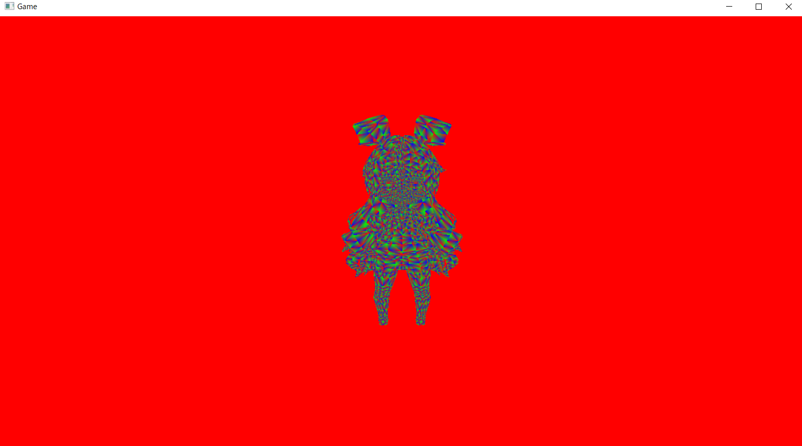</img></br>

## 17.4 【ハンズオン】テクスチャマッピング
&emsp;では、続いてレイトレでのテクスチャマッピングを見ていきましょう。Sample_17_02を開いてください。</br>

### step-1 衝突したポリゴンの番号からポリゴンを構成する頂点番号を取得する。
&emsp;今回のサンプルでは、頂点バッファ、テクスチャといったテクスチャマッピングに必要なデータは全て準備済みで、シェーダーからすぐアクセス可能となっています。ですので、シェーダーを改造するだけでテクスチャマッピングが可能です。では、Assets/shader/sample.fxを開いてリスト17.6のプログラムを入力してください。</br>

[リスト17.6 sample.fx]
```cpp
//step-1 衝突したポリゴンの番号からポリゴンを構成する頂点番号を取得する。
//衝突したポリゴンの番号を取得。
uint polygonNo = PrimitiveIndex();  
//ポリゴンを構成する３頂点の番号を取得する。
uint v0_id = g_indexBuffers[polygonNo * 3];
uint v1_id = g_indexBuffers[polygonNo * 3 + 1];
uint v2_id = g_indexBuffers[polygonNo * 3 + 2];
```

&emsp;PrimitiveIndex関数は、衝突したポリゴンの番号を取得することができます。Modelクラスで扱えるジオメトリのトポロジーはトライアングルリストになっているため、ポリゴンの番号×３、ポリゴンの番号×３＋１、ポリゴンの番号×３＋２をインデックスバッファの添え字に使えば頂点番号を取得することができます。</br>

### step-2 頂点番号から各頂点のUV座標を取得する。
&emsp;頂点番号を求めることができたら、頂点バッファにアクセスして各頂点のUV座標を取得します。リスト17.7のプログラムを入力して下さい。</br>

[リスト17.7 sample.fx]
```cpp
//step-2 頂点番号から各頂点のUV座標を取得する。
float2 uv0 = g_vertexBuffers[v0_id].uv;
float2 uv1 = g_vertexBuffers[v1_id].uv;
float2 uv2 = g_vertexBuffers[v2_id].uv;
```

### step-3 各頂点のUV座標と重心座標を使って、衝突点のUV座標を求める。
&emsp;テクスチャを貼り付けるためには、衝突点のUV座標を求める必要があります。しかし、step2で求めたUV座標はポリゴンの各頂点のUV座標なのでそのままは使えません。(図17.6)</br>

**図17.6**</br>
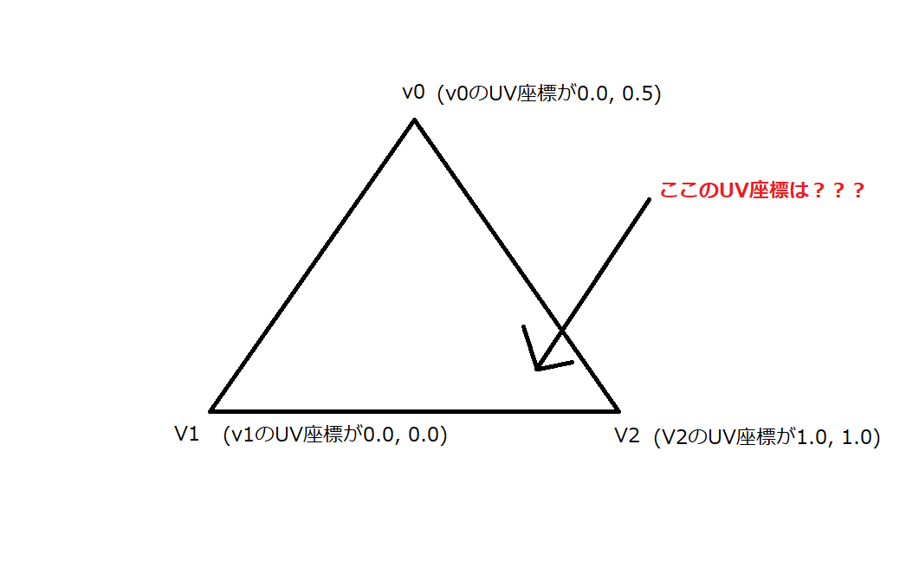</img></br>
&emsp;この衝突点のUV座標を求めるのに重心座標を使います。では、リスト17.8のプログラムを入力してください。</br>

[リスト17.8 sample.fx]
```cpp
//step-3 各頂点のUV座標と重心座標を使って、衝突点のUV座標を求める。
//重心座標を計算する。
float3 barycentrics ;
barycentrics.x = 1.0 - attribs.barycentrics.x - attribs.barycentrics.y;
barycentrics.y = attribs.barycentrics.x;
barycentrics.z = attribs.barycentrics.y;

//衝突点のUV座標を求める。
float2 uv = barycentrics.x * uv0 
            + barycentrics.y * uv1 
            + barycentrics.z * uv2;
```

### step-4 求めたUV座標を使ってテクスチャカラーをサンプリングする。
&emsp;では、最後に求めたUV座標を使ってテクスチャを貼り付けましょう。このプログラムはこれまでのピクセルシェーダーとほとんど同じ処理になります。リスト17.9のプログラムを入力して下さい。</br>

[リスト17.9 sample.fx]
```cpp
//step-4 求め��UV座標を使ってテクスチャカラーをサンプリングする。
payload.color = g_albedoTexture.SampleLevel( 
	g_samplerState,
	uv,
	0.0f
);
```

### step-5 実行
&emsp;ここまで実装できたらプログラムを実行してみてください。実装できていたら図17.7のようなプログラムが実行できます。</br>

**図17.7**</br>
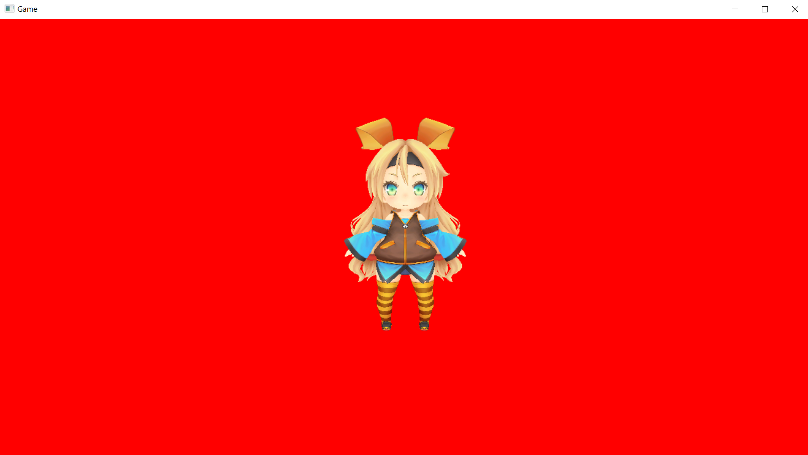</img></br>

## 17.5 2次反射
&emsp;ここまでのハンズオンでカメラからレイトレワールドに対してレイを飛ばしてピクセルカラーを決定する処理について見てきました。しかし、レイトレはレイが物体とぶつかったらそれで終了というわけではありません。レイが物体に衝突したら、そこからさらにレイを飛ばして、その物体に影響を与えている物体やライトを追跡する。これがレイトレーシングです。(図17.8)</br>

**図17.8**</br>
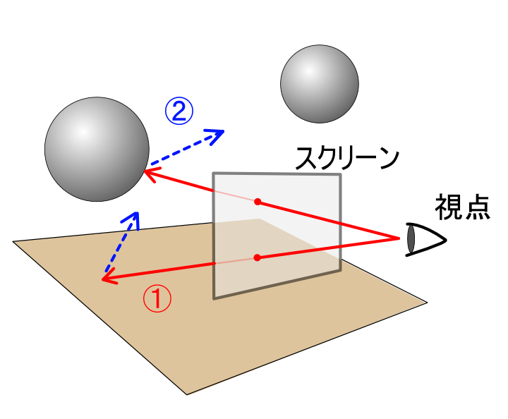</img></br>
&emsp;２次反射のレイを飛ばすことで、周囲の映り込みやグローバル・イルミネーション等を実現することができます。</br>

### 17.5.1 シャドウレイ
&emsp;では、２次反射の１つのシャドウレイについて見ていきましょう。シャドウレイは図17.9のように光源に向けて飛ばすレイです。シャドウレイを飛ばすことで、物体のライティング、そしてシャドウイングが計算できます。</br>

**17.9**
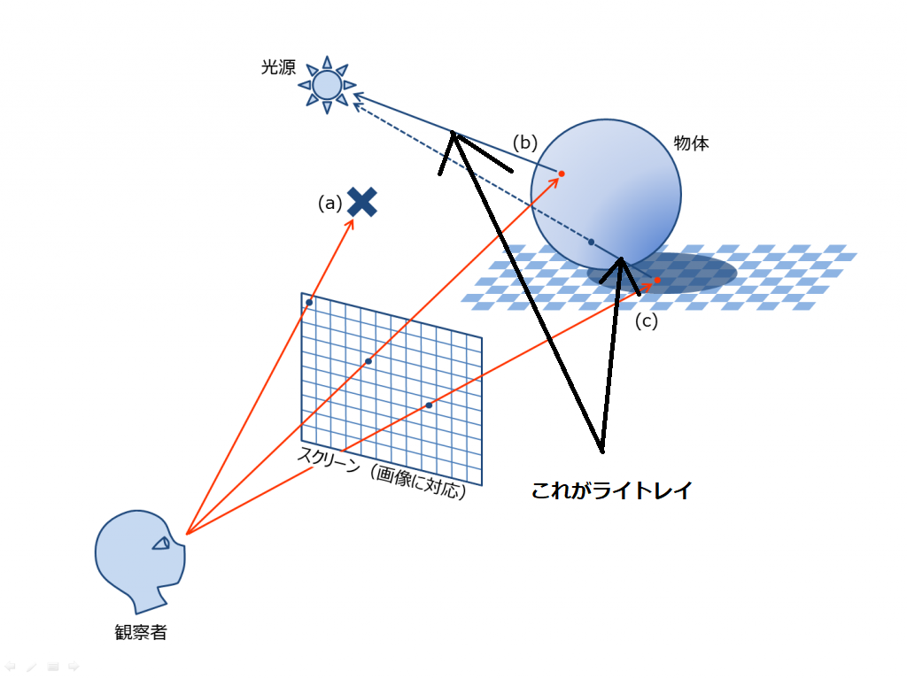</img></br>

### 17.5.2 【ハンズオン】シャドウイング
&emsp;では、シャドウレイを飛ばして影を落とすハンズオンを行っていきましょう。レイトレでのシャドウイングはシャドウマップ法のような複雑なアルゴリズムは必要なりません。光源に向けてレイを飛ばして、そのレイが物体と衝突する場合、光が遮蔽されているので影を落とすという処理になります。では、Sample_17_03を立ち上げてください。</br>

#### step-1 背景モデルをロードしてレイトレワールドに追加する。
&emsp;今回のハンズオンはシャドウイングを行うため、影が落ちていることを分かりやすくするために、背景モデルをレイトレワールドに追加しましょう。main.cppにリスト17.10のプログラムを入力してください。</br>

[リスト17.10 main.cpp]
```cpp
//step-1 背景モデルをロードしてレイトレワールドに追加する。
//背景モデルをロード。
ModelInitData bgModelInitData;
bgModelInitData.m_tkmFilePath = "Assets/modelData/bg/bg.tkm";
Model bgModel;
bgModel.Init(bgModelInitData);
//背景モデルをレイトレワールドに追加。
g_graphicsEngine->RegistModelToRaytracingWorld(bgModel);
```
プログラムを入力して実行すると図17.10のようなプログラムが実行できます。</br>

**図17.10**</br>
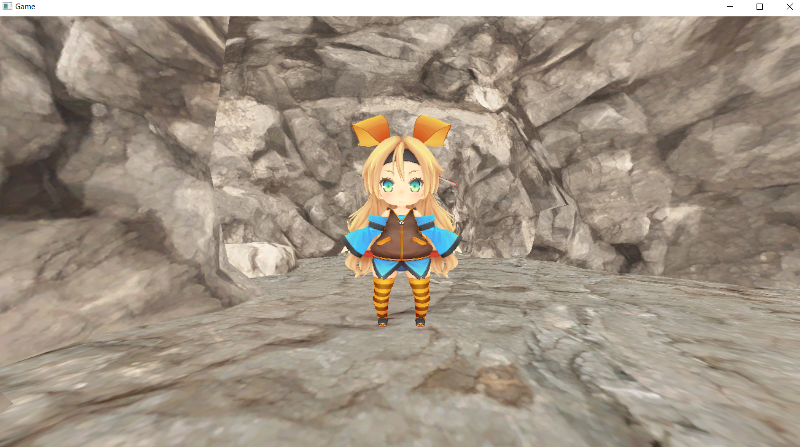</img></br>

#### step-2 レイとポリゴンの衝突点を求める。
&emsp;必要なモデルの登録が完了したので、次はシェーダー側の改造です。シェーダー側では２次反射のシャドウレイを飛ばすプログラムを書いていくのですが、この２次反射をするためには、まずカメラからのレイ(以降カメラレイ)と物体との衝突点を計算する必要があります(図17.11)。この衝突点の計算は、closesthitシェーダーでの簡単なベクトル演算で計算することができます。Assets/shader/sample.fxを開いて、chs関数にリスト17.11のプログラムを入力してください。</br>

[リスト17.11 sample.fx]
```cpp
//step-2 レイとポリゴンの衝突点を求める。
//１．ぶつかったレイの方向ベクトルを取得。
float3 rayDirW = WorldRayDirection();
//２．レイを飛ばした座標を取得。今回であればカメラの視点。
float3 rayOriginW = WorldRayOrigin();
//３．レイを飛ばした場所から、衝突した点までの距離を取得。
float hitT = RayTCurrent();
//１、２、３の情報から諸突した座標を求める。
float3 hitPos = rayOriginW + rayDirW * hitT;
```

**図17.11**</br>
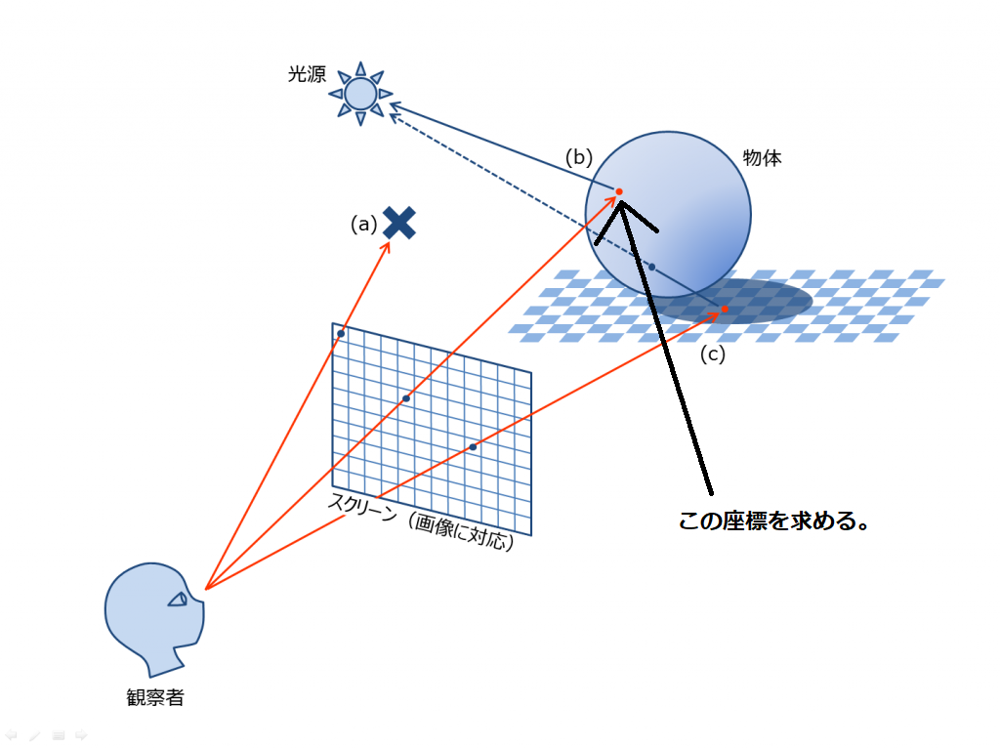</img></br>

#### step-3 シャドウレイを作る。
&emsp;衝突点を求めることができたら、シャドウレイを作っていきましょう。シャドウレイは衝突点から光源に向かって飛ばすレイです。今回光源は平行光源一本として考えています。リスト17.12のプログラムを入力してください。</br>

[リスト17.12 sample.fx(chs関数)]
```cpp
//step-3 シャドウレイを作る。
RayDesc ray;
//シャドウレイを飛ばす場所。
ray.Origin = hitPos;
//ライトまでのベクトル。今回のハンズオンでは固定。
ray.Direction = float3( 0.5f, 0.5f, 0.2f);
//正規化しておく。
ray.Direction = normalize(ray.Direction);
//レイの最小距離と最大距離。
ray.TMin = 0.01f;
ray.TMax = 100;
```
#### step-4 シャドウレイを飛ばす。
&emsp;レイを作成することができたら、レイを飛ばしましょう。レイを飛ばすためにはTraceRay関数を利用します。リスト17.13のプログラムを入力してください。</br>

[リスト17.13 sample.fx(chs関数)]
```cpp
//step-4 シャドウレイを飛ばす。
TraceRay(
	g_raytracingWorld,  //レイトレワールド。
	0,                  
	0xFF,
	1,                  //ヒットグループのオフセット番号。
	0,
	1,                  //ミスシェーダーの番号。
	ray,                //レイ。
	raypayload
);
```
&emsp;TraceRay関数は第一引数にレイと衝突を調べるレイトレワールドを指定します。今回のサンプルではg_raytracingWorldを指定すればＯＫです。第四引数はヒットグループのオフセット番号で、このヒットグループの番号によって、呼び出されるclosesthitシェーダーが変更されます。今回はstep-5で実装するlightChsを呼び出してほしいので１を指定しています(0を指定するとchs関数が呼ばれます)。第六引数はミスシェーダーの番号です。この番号を変更することで、呼び出されるmissシェーダーが変更されます。今回はstep-6で実装するlightMissを呼び出してほしいので１を指定しています。</br>

#### step-5 シャドウレイがポリゴンと衝突したときに衝突フラグを立てる。
&emsp;シャドウレイが最も近いポリゴンと衝突したときに、lightChs関数が呼び出されます。この関数が呼ばれたときに衝突フラグを立てるようにしましょう。リスト17.14のプログラムを入力してください。</br>
[リスト17.14 sample.fx(lightChs関数)]
```cpp
//step-5 シャドウレイがポリゴンと衝突したときに衝突フラグを立てる。
payload.hit = 1;
```

#### step-6 シャドウレイがどのポリゴンとも衝突しない場合はフラグを下す。
&emsp;シャドウレイがどのポリゴンとも衝突しない場合はlightMiss関数が呼び出されます。この関数が呼ばれたときは諸突フラグを下すようにしましょう。リスト17.15のプログラムを入力してください。</br>

[リスト17.15 sample.fx(lightMiss関数)]
```cpp
//step-6 シャドウレイがどのポリゴンとも衝突しない場合はフラグを下す。
payload.hit = 0;
```

#### step-7 衝突フラグを調べて影を落とす。
&emsp;では、最後に衝突フラグを調べて影を落とすプログラムを入力しましょう。リスト17.16のプログラムを入力してください。</br>

[リスト17.16 sample.fx(chs関数)]
```cpp
//step-7 衝突フラグを調べて影を落とす。
if( payload.hit == 1){
	//諸突しているので色味を弱くする。
	payload.color *= 0.5f;
}
```

### step-8 実行
&emsp;ここまで入力出来たらプログラムを実行してみてください。うまくいっていると図17.12のようなプログラムが実行できます。</br>

**図17.12**</br>
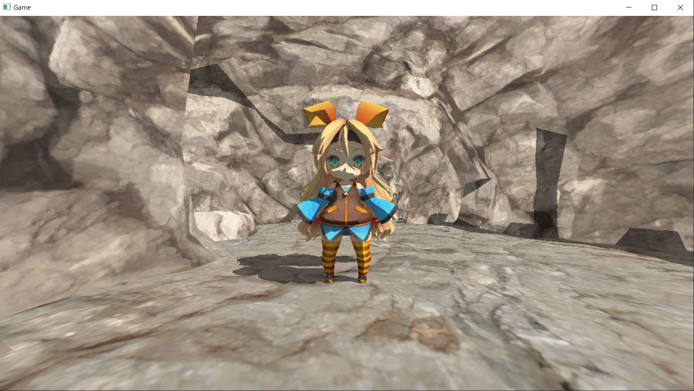</img></br>

### 17.5.3 リフレクションレイ
&emsp;では、続いてもう一つの２次反射のリフレクションレイについて見ていきましょう。リフレクションレイはカメラレイがポリゴンに衝突して反射するレイです(図17.13)。
**図17.13**</br>
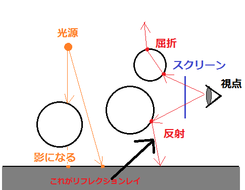</img></br>
&emsp;リフレクションレイを飛ばすことで、鏡のように周囲のオブジェクトを映す表現や、周囲のオブジェクトの反射光の影響を受けるグローバルイルミネーションを実現することができます(図17.14)。

### 17.5.4 【ハンズオン】リフレクション
&emsp;では、リフレクションレイを飛ばして、鏡のように周囲のオブジェクトを映す表現を実装してみましょう。Sample_17_04を立ち上げてください。</br>

#### step-1 カメラレイがポリゴンと衝突した位置を計算する。
&emsp;まずはカメラレイがポリゴンと衝突した位置を計算します。これはシャドウレイの時に計算したものと全く同じです。Assets/shader/sample.fxにリスト17.17のプログラムを入力してください。</br>
[リスト17.17 sample.fx(chs関数)]
```cpp
//step-1 カメラレイがポリゴンと衝突した位置を計算する。
//ぶつかったレイの方向ベクトルを取得。
float3 rayDirW = WorldRayDirection();
//レイを飛ばした座標を取得。今回であればカメラの視点。
float3 rayOriginW = WorldRayOrigin();
//レイを飛ばした場所から、衝突した点までの距離を取得。
float hitT = RayTCurrent();
//１、２、３の情報から諸突した座標を求める。
float3 hitPos = rayOriginW + rayDirW * hitT;
```

#### step-2 反射ベクトルを計算する。
&emsp;続いて反射ベクトルを求めます。リスト17.18のプログラムを入力してください。</br>
[リスト17.18 sample.fx(chs関数)]
```cpp
//step-2 反射ベクトルを計算する。
//法線を取得。
float3 normal = GetNormal(attribs);
//reflect関数を利用して反射ベクトルを計算。
float3 refDir = reflect( rayDirW, normal );
```
&emsp;反射ベクトルの計算には衝突したポリゴンの法線が必要になります。法線の取得の仕方はUV座標を取得した方法と同じです。今回はGetNormalというヘルパー関数を用意していますので、そちらを使用します。法線ベクトルを求めることができたら、reflect関数を利用して反射ベクトルを求めています。

#### step-3 レイを作る。
&emsp;反射ベクトルを求めるとことができたら、レイを作成します。リスト17.19のプログラムを入力してください。</br>
[リスト17.19 sample.fx(chs関数)]
```cpp
//step-3 レイを作る。
RayDesc ray;
//レイの射出位置はカメラレイとポリゴンの衝突点。
ray.Origin = hitPos;
//レイの方向は反射ベクトル。
ray.Direction = refDir;
ray.TMin = 0.01f;
ray.TMax = 10000;
```

#### step-4 レイを飛ばす。
&emsp;レイを作成することができたので、TraceRay関数を利用してレイを飛ばしましょう。リスト17.20のプログラムを入力してください。</br>
[リスト17.20 sample.fx(chs関数)]
```cpp
//step-4 レイを飛ばす。
if(payload.reflection == 0){
	//このレイがリフレクションレイでないなら。
	RayPayload reflectionPayload;
	//このレイはリフレクションレイなのでフラグを立てる。
	reflectionPayload.reflection = 1;
	TraceRay(
		g_raytracingWorld,
		0,
		0xFF,
		0,　　　　　 //ヒットグループのオフセット番号が0
					//つまり、ポリゴンと衝突するとchs関数が呼ばれる！
		0,
		0,
		ray,
		reflectionPayload
	);
	//step-5 反射カラーの合成

}
```
&emsp;注意点として、シャドウレイと違い、TraceRay関数の第四引数のヒットグループのオフセット番号が0になっています。これが0になっているということは、ポリゴンと衝突するとchs関数が再帰的に呼ばれるということになります。映り込み表現を行いたいので、リフレクションレイで取得したいのは衝突したポリゴンのカラーなのでchs関数の処理がそのまま使えます。しかし関数を何の工夫もなしに再帰的に呼び出すと無限に関数呼び出しが行われるため、プログラムがクラッシュしてしまいます。そこで、今回はリフレクションフラグを用意して、処理を分岐させています。</br>

#### step-5 反射カラーの合成
&emsp;では、最後に反射カラーを合成するプログラムを追加しましょう。今回は元のカラーを0.7、反射カラーを0.3の重みで合成しています。リスト17.21のプログラムを入力してください。</br>
[リスト17.21 sample.fx(chs関数)]
```cpp
//step-5 反射カラーの合成
payload.color = payload.color * 0.7f + reflectionPayload.color * 0.3f;
```

#### step-6 実行
&emsp;ではプログラムを実行してください。うまくいっていると図17.14のようなプログラムが実行できます。</br>
**図17.14**</br>
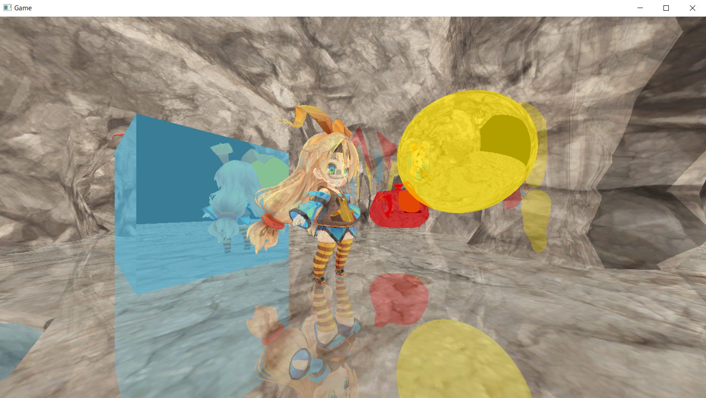</img></br>


### 17.6 DirectX Raytracing
&emsp;ここからはレイトレーシングを扱うためのDirectX12の拡張APIのDirectX Raytracingについて見ていきましょう。本書ではDirectX Raytracingを扱うために重要になってくる下記の４つの概念について説明します。
1. Bottom level acceleration structure(BLAS)
2. Top level acceleration structure(TLAS)
3. 各種シェーダー
4. シェーダーリソーステーブル

#### 17.6.1 Bottom level acceleration structure(BLAS)
&emsp;BLASはレイトレーシングで使用されるポリゴン情報を保持しているデータ構造です。3Dモデルの頂点バッファ、インデックスバッファと言ったデータを保持しています。これまで見てきたプログラムですと、このデータ構造はGraphicsEngine::BuildRaytracingWorld関数が呼ばれたときに構築されています。本書のMiniEngineにはBLASを扱うraytracing::BLASBufferというクラスがあります。このクラスのInit関数にレイトレワールドに登録するインスタンスのリストを渡すことで、BLASが構築されます。</br>
[リスト17.22 MiniEngine/raytracing/BLASBuffer.h]
```cpp

/// <summary>
/// BLASBuffer
/// </summary>
/// <remark>
/// BLAS( Bottom level acceleration structures )とは
/// レイトレワールドに登録されているジオメトリのデータ構造です。
/// BLASに3Dモデルのポリゴン情報が登録されることになります。
/// </remark
class BLASBuffer
{
public:
	/// <summary>
	/// 初期化。
	/// </summary>
	/// <param name="rc"></param>
	/// <param name="instance"></param>
	void Init(RenderContext& rc, const std::vector<InstancePtr>& instance);
	/// <summary>
	/// BLASBufferのリストを取得。
	/// </summary>
	/// <returns></returns>
	const std::vector< AccelerationStructureBuffers>& Get() const
	{
		return m_bottomLevelASBuffers;
	}
private:
m_bottomLevelASBuffers
	std::vector< AccelerationStructureBuffers> ;	//BLASBuffer
};

```
&emsp;BLASのデータ構造は単純なジオメトリ情報というわけではなく、レイとポリゴンとの交差判定を高速にするためのBounding Volume Hierarychy(BVH)というデータ構造になっています。BVHの詳細な説明は本書では行いませんが、BVHは2分岐のデータ構造になっています。このBVHを利用することでレイとポリゴンとの衝突判定の計算量をO(N)からO(logN)にすることができ、大きな高速化を実現できているわけです。

#### 17.6.2 Top level acceleration structure(TLAS)
&emsp;TLASはレイトレワールドのインスタンスのワールド行列、ヒットグループ番号、そしてレイトレワールドに配置するジオメトリ情報のBLASを参照します。レイトレワールドはBLASを構築してからTLASを構築することで作成されます。TLASとBLASの概念図は図17.15を参照してください。</br>
**図17.15**</br>
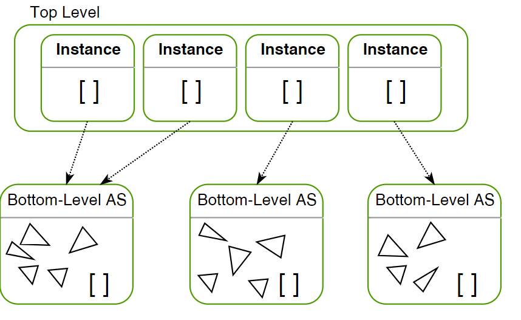</img></br>
&emsp;本書のMiniEngineにはTLASを扱うraytracing::TLASBufferというクラスがあります。このクラスのInit関数を呼び出すことでTLASが構築されます。</br>

[リスト17.23 MiniEngine/raytracing/TLASBuffer.h]
```cpp

/// <summary>
/// TLASBuffer
/// </summary>
/// <remark>
/// TLAS( Top level acceleration structures )とは
/// レイトレワールドに登録されているインスタンスのデータ構造です。
/// インスタンスの使用するジオメトリ、シェーダーID、ワールド行列などの
/// データを保持します。
/// </remark>
class TLASBuffer : public IShaderResource
{
public:
	/// <summary>
	/// TLASを構築。
	/// </summary>
	/// <param name="rc"></param>
	/// <param name="instances"></param>
	void Init(
		RenderContext& rc,
		const std::vector<InstancePtr>& instances,
		const std::vector< AccelerationStructureBuffers>& bottomLevelASBuffers
	);
	/// <summary>
	/// SRVに登録。
	/// </summary>
	/// <param name="descriptorHandle"></param>
	void RegistShaderResourceView(D3D12_CPU_DESCRIPTOR_HANDLE descriptorHandle, int bufferNo) override;
	/// <summary>
	/// VRAM上の仮想アドレスを取得。
	/// </summary>
	/// <returns></returns>
	D3D12_GPU_VIRTUAL_ADDRESS GetGPUVirtualAddress() const
	{
		return m_topLevelASBuffers.pResult->GetGPUVirtualAddress();
	}
private:
	AccelerationStructureBuffers m_topLevelASBuffers;
};
```
&emsp;TLASのデータ構造も単なるインスタンス情報の配列というわけではなく、BLASと同様にBVHというデータ構造になっています。

### 17.6.3 各種シェーダー
&emsp;DXRには新たにいくつかのシェーダーが追加されています。下記は追加されたシェーダーの一覧になります。</br>
1. RayGenerationシェーダー
2. Missシェーダー
3. ClosestHitシェーダー
4. AnyHitシェーダー
5. Intersectionシェーダー

#### RayGenerationシェーダー
&emsp;レイを生成するシェーダーです。レイトレーシングをディスパッチするとレイの本数分(今回のサンプルであれば、ピクセルの画素数)、このシェーダーが呼ばれます。Sample_17_05/Assets/shader/sample.fxの188行目を見てみてください(リスト17.24)。</br>

[リスト17.24 sample.fx]
```cpp
[shader("raygeneration")]
void rayGen()
{
    uint3 launchIndex = DispatchRaysIndex();
    uint3 launchDim = DispatchRaysDimensions();

    float2 crd = float2(launchIndex.xy);
    float2 dims = float2(launchDim.xy);

    float2 d = ((crd / dims) * 2.f - 1.f);
    float aspectRatio = dims.x / dims.y;

	//ピクセル方向に打ち出すレイを作成する。
    RayDesc ray;
    ray.Origin = g_camera.pos;
    ray.Direction = normalize(float3(d.x * g_camera.aspect, -d.y, -1));
    ray.Direction = mul(g_camera.mCameraRot, ray.Direction);

    ray.TMin = 0;
    ray.TMax = 10000;

    RayPayload payload;
    payload.depth = 0;
    //TraceRay
    TraceRay(g_raytracingWorld, 0 /*rayFlags*/, 0xFF, 0 /* ray index*/, 0, 0, ray, payload);
    
    float3 col = payload.color ;
    
    gOutput[launchIndex.xy] = float4(col, 1);
}
```
&emsp;212行目でTraceRay関数が呼ばれています。実はこのTraceRay関数の呼び出しによって、chs関数が呼び出しがされていたのです。

#### Missシェーダー
&emsp;このシェーダーはこれまで見てきたシェーダーです。TraceRay関数を呼び出したときに、レイがどのポリゴンとも交差しないときに呼び出されるシェーダーです。

#### ClosestHitシェーダー
&emsp;このシェーダーもこれまで見てきたシェーダーです。TraceRay関数を呼び出したときに、レイが最も近いポリゴンと交差したときに呼び出されるシェーダーです。レイトレーシングの中核をなすシェーダーであると言えます。</br>
**図17.16**</br>
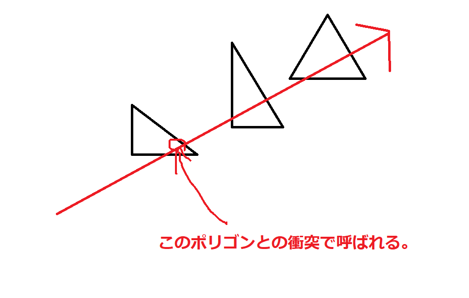</img></br>

#### AnyHitシェーダー
&emsp;半透明ポリゴンとヒットしたときに複数回呼ばれる可能性があるシェーダーです。一見すると半透明オブジェクトへのレイトレースで使えるのかな？と思うかもしれませんが半透明処理はClosestHitシェーダーの中からに２次レイで屈折レイ、リフラクションレイを飛ばせば実現できるので、半透明オブジェクトの表現のためだけに用意されているわけではありません。(ここの用途は調査して正確なことが分かったら追記する可能せいあり。)
**図17.17**</br>
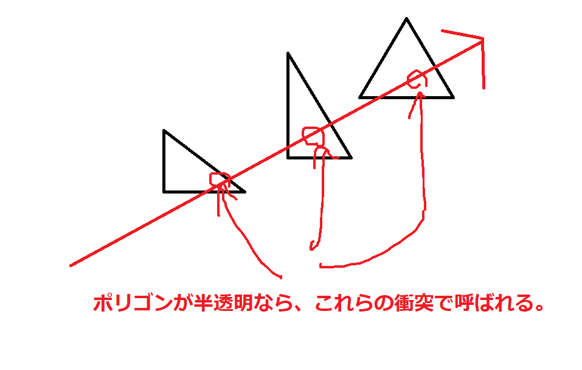</img></br>

#### Intersectionシェーダー
&emsp;プリミティブとの交差判定を行うシェーダーです。BLASの末端ノードのバウンディングボリュームを衝突したときに呼ばれます。登録されているプリミティブが三角形ポリゴンのみの場合は、指定する必要はありません。ユーザー定義のカスタムプリミティブを指定している場合は、交差判定を行う処理を記述する必要があるため、Intersectionシェーダーを指定する必要があります。(このシェーダーも用途を更に詳しく調査して、正確なことが分かったら追記する可能性あり。)

### 17.6.4 シェーダーテーブル
&emsp;最後にシェーダーテーブルを紹介します。シェーダーテーブルはレイトレワールドに登録されている、オブジェクトが使用するテクスチャ、定数バッファなどのリソース等のテーブルです。レイがジオメトリと交差したときに、そのジオメトリに設定されているマテリアル情報から、使用されているテクスチャ、定数バッファなどがシェーダーレジスタにバインドされます。</br>
**図17.18**</br>
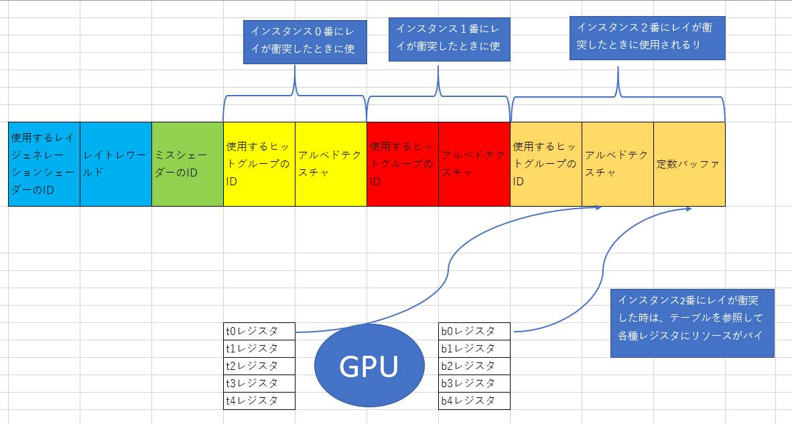</img></br>
&emsp;サンプルではシェーダーテーブルはraytracing::ShaderTableクラスで扱われています。このクラスのInit関数を呼び出すことでシェーダーテーブルが作成されます。</br>

[リスト 17.25 MiniEngine/raytracing/RaytracingShaderTable.h]
```cpp
/// <summary>
/// シェーダーテーブル
/// </summary>
/// <remark>
/// シェーダーテーブルはレイのディスパッチで使用される、
/// シェーダーやリソースのディスクリプタヒープのアドレスなどが登録されているテーブルです。
/// </remark>
class ShaderTable {
public:
	/// <summary>
	/// シェーダーテーブルを初期化。
	/// </summary>
	void Init(
		const World& world,
		const PSO& pso,
		const DescriptorHeaps& descriptorHeaps
	);

	/// <summary>
	/// シェーダーテーブルのGPU上の仮想アドレスを取得。
	/// </summary>
	/// <returns></returns>
	D3D12_GPU_VIRTUAL_ADDRESS GetGPUVirtualAddress() const
	{
		return m_shaderTable->GetGPUVirtualAddress();
	}
	/// <summary>
	/// シェーダーテーブルに記憶されているデータの１要素のサイズを取得。
	/// </summary>
	/// <returns></returns>
	uint32_t GetShaderTableEntrySize() const
	{
		return m_shaderTableEntrySize;
	}
	/// <summary>
	/// レイジェネレーションシェーダーの数を取得。
	/// </summary>
	/// <returns></returns>
	int GetNumRayGenShader() const
	{
		return m_numRayGenShader;
	}
	/// <summary>
	/// ミスシェーダーの数を取得。
	/// </summary>
	/// <returns></returns>
	int GetNumMissShader() const
	{
		return m_numMissShader;
	}
	/// <summary>
	/// シェーダーテーブルに登録されているヒットシェーダーの数を取得。
	/// </summary>
	/// <remark>
	/// ヒットシェーダーの数はインスタンスの数と同じになります。
	/// </remark>
	/// <returns></returns>
	int GetNumHitShader() const
	{
		return m_numHitShader;
	}
private:
	/// <summary>
	/// レイジェネレーションシェーダー、ミスシェーダー、ヒットシェーダーの数をカウントする。
	/// </summary>
	void CountupNumGeyGenAndMissAndHitShader();
	/// <summary>
	/// シェーダーテーブルの1要素のサイズを計算する。
	/// </summary>
	void CalcShaderTableEntrySize();
private:
	ID3D12ResourcePtr m_shaderTable;			//シェーダーテーブル。
	uint32_t m_shaderTableEntrySize = 0;
	int m_numRayGenShader = 0;
	int m_numMissShader = 0;
	int m_numHitShader = 0;
};
```

### 17.7 まとめ
&emsp;では、DirectRayTracingでレイトレを行う流れを見ていきましょう。
#### 準備
1. レイトレワールドの構築⇒BLAS、TLASの構築(CPU)
2. 各種シェーダーをロードする。(CPU)
3. シェーダーテーブルを構築。(CPU)

#### 実行
1. ピクセルの数分レイをディスパッチ(CPU)
2. レイジェネレーションシェーダーの実行(GPU)
3. レイとプリミティブの交差判定⇒Intersectionシェーダー(GPU)
4. 半透明プリミティブと交差していたらAnyhitシェーダーを実行(GPU)
4. 交差していたらClosesthitシェーダーを実行(GPU)
5. 交差していなければMissシェーダーを呼び出す(GPU)
&emsp;17.19はGPU側の処理2～5の流れ図です。</br>

**図17.19**
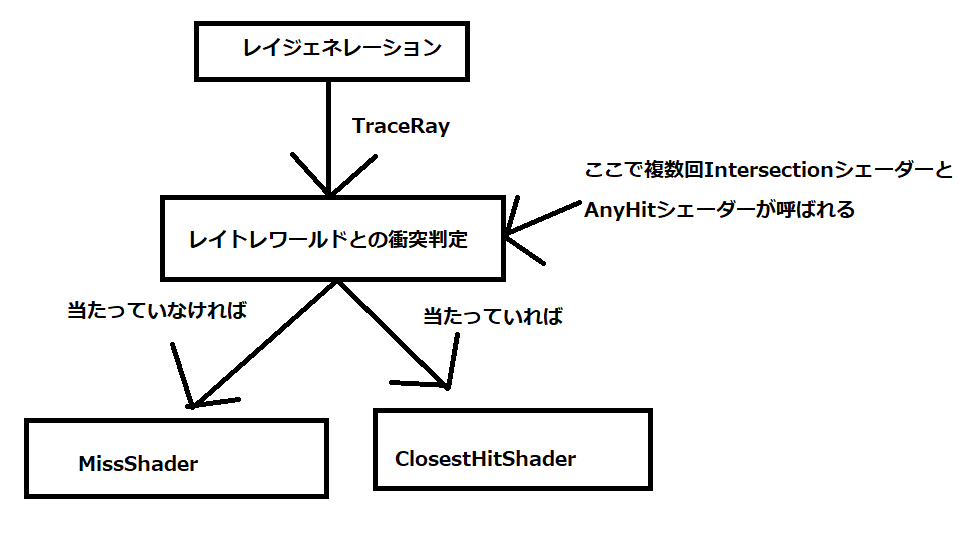</img></br>


## 0.1 節タイトル

### 0.1.1 中見出し

本文はそのまま。`int`などコード文字。**重要語句**はボールドに。

[リスト0.☆ ソースコード]
```hlsl
test

test
{
    // コメント
}
```

リストにするまでもないコード片は次のように。

```cpp
```

#### 小見出し

見出しレベルは小見出しまで。

1. 箇条書き：説明
2. 箇条書き：説明
3. 箇条書き：説明

- 箇条書き
- 箇条書き
- 箇条書き


<note>
囲み記事（NOTE）
</note>

[コラムタイトル]
<column>
コラム
</column>